# 第0章 预备知识

在介绍微积分知识之前, 我们先介绍一些数学基础知识, 如集合、实数基本知识及映射、函数的概念和性质以及极坐标与参数方程等. 这些知识在学习微积分之前是必须掌握和了解的.

## §0.1 集合与映射

### 一、集合

集合是数学的一切分支的基本概念, 集合论主要是由布尔 $^{①}$ 和康托尔 $^{②}$ 建立起来的, 它对 20 世纪数学的发展有着深远的影响. 集合论统一了许多看似没有关联的数学概念, 满足逻辑要求的集合论是一个相当复杂的理论, 但是它包含的基本概念并不多, 我们可以很快掌握一些在数学上常用的词汇. 首先熟悉一下本书采用的与集合有关的一些符号和词汇.

一个集合是指一些可确定、可分辨的事物构成的整体, 我们常用大写英文字母来表示: $A, B, C, \cdots, X, Y, Z, \cdots$.

下面是经常用到的一些关于数的集合:

$$
\begin{array}{l} \mathrm{N} = \text {自然数集 (包括 0)}, \\ \mathrm{Z} = \text {整数集}, \\ \mathrm{N} _ {+} = \text {正整数集}, \\ \mathrm{Q} = \text {有理数集}, \\ \mathrm{R} = \text {实数集}. \end{array}
$$

在初等数学中, 我们知道实数是由有理数与无理数组成的, 即有理数与无理数统称为实数.

> **注：** ① 布尔 (Boole, 1815—1864), 英国数学家, 1847 年出版了 The mathematical analysis of logic, 这是他对符号逻辑诸多贡献中的第一次; 1854 年出版了 The laws of thought, 这是他最著名的著作, 介绍了现在以他的名字命名的布尔代数.

> **注：** ② 康托尔 (Cantor, 1845—1918), 德国数学家, 创立了集合论. 作为实数理论以至整个微积分理论体系的基础, 集合论被誉为 20 世纪最伟大的数学创造, 集合概念大大扩充了数学的研究领域, 给数学结构提供了一个基础. 集合论不仅影响了现代数学, 而且也深深影响了现代哲学和逻辑.

可表示为分数 $\frac{p}{q}$ ($p, q$ 为整数且 $p, q$ 互素, $q > 0$) 的数称为有理数。在实数的十进制表示中, 一个数为有理数当且仅当它可以表示为有限十进制小数或无限十进制循环小数: 因为我们也可以把有限十进制小数看成无限十进制循环小数, 只要在最后一位数后面加上无限多个零即可, 例如 $1.2 = 1.200 \cdots 0 \cdots$. 所以我们简单地说 “有理数就是无限循环小数”。由此, 我们称无限十进制不循环小数为无理数。

值得一提的是, 数的十进制表示并不唯一. 例如

$$
3. 1 2 4 = 3. 1 2 3 9 9 \dots 9 9 \dots , - 3. 1 2 4 = - 3. 1 2 3 9 9 \dots 9 9 \dots .
$$

一般地, 对于正有限小数 (或正整数) $x = a_0.a_1a_2\cdots a_n$, 其中 $a_0$ 为非负整数, $0 \leqslant a_i \leqslant 9 (1 \leqslant i \leqslant n), a_n \neq 0$, 有 $x = a_0.a_1a_2\cdots (a_n - 1)99\cdots 99\cdots$. 特别地, 当 $a_0$ 为正整数时, $a_0 = (a_0 - 1).99\cdots 99\cdots$.

根据上面的约定及我们熟知的两个有理数大小的比较, 可定义两个实数之间的大小关系.

**定义 0.1.1** 对于给定的两个非负实数

$$
x = a _ {0}. a _ {1} a _ {2} \dots a _ {n} \dots , \quad y = b _ {0}. b _ {1} b _ {2} \dots b _ {n} \dots ,
$$

其中 $a_0, b_0$ 为非负整数, $a_k, b_k \in \mathbb{N}$, 且 $0 \leqslant a_k \leqslant 9$, $0 \leqslant b_k \leqslant 9$ ($k = 1, 2, \dots$).

(1) 若 $a_{k} = b_{k} (k = 0,1,2,\dots)$, 则称 $x,y$ 相等, 记作 $x = y$;

(2) 若 $a_0 > b_0$ 或存在 $k \in \mathbb{N}$ 使得 $a_i = b_i (i = 0,1,\dots,k), a_{k+1} > b_{k+1}$, 则称 $x$ 大于 $y$, 或 $y$ 小于 $x$, 记作 $x > y$ 或 $y < x$.

对于负实数 $x$ 和 $y$, 根据上面的定义, 如果有 $-x = -y$ 或 $-x < -y$, 那么分别称 $x$ 与 $y$ 相等或 $x$ 大于 $y$, 记作 $x = y$ 或 $x > y$. 另外, 规定任何非负实数大于任何负实数.

对于实数, 有如下常用的性质, 有关证明可参见一般数学分析教材.

**定理 0.1.2** (有理数的可列性) 有理数全体可以和自然数全体建立一一对应关系.

凡是与自然数集可以建立一一对应的集合称为可列集. 因此, 有理数集是可列集. 可以证明, 无理数集不是可列集, 所以从某种意义上来说, 无理数要比有理数 “多得多”.

**定理 0.1.3** (有理数的稠密性) 任何两个不同的实数之间一定存在一个有理数, 从而存在无穷多个有理数.

同样, 任何两个不同的实数之间一定存在无穷多个无理数.

**定理 0.1.4** 任何一个实数都可以用某有理数列逼近. 即  $\forall a \in R,$  存在有理数列  $\{q_{n}\} (q_{n} \in \mathbb{Q}, n = 1, 2, 3, \cdots)$ , 使得  $\lim_{n \to \infty} q_{n} = a$ .

上面定理中所涉及的极限在本书第1章会详细介绍.

2

第0章

组成一个集合的成员是这个集合的元素, 通常用小写英文字母来标记: $a, b, c, x, y, z, \cdots$. “$a \in X$” 表示 $a$ 是 $X$ 的一个元素, 读作 $a$ 属于 $X$; “$a \notin X$” 表示 $a$ 不是 $X$ 的一个元素, 读作 $a$ 不属于 $X$.

由有限个元素组成的集合称为有限集, 由无限多个元素组成的集合称为无限集.

下面给出集合表示的两种常见方法.

(1) 列举法: 列出集合的所有元素. 例如

$$
X = \{a, e, i, o, u \}
$$

是一个由 5 个元素组成的有限集, 自然数集

$$
\mathbb {N} = \{0, 1, 2, 3, \dots \}
$$

是由无穷多个元素组成的无限集.

(2) 描述法: 给出集合中的一切元素所满足的属性. 一般具有形式

$$
X = \{x | P (x) \},
$$

即表示 $X$ 由满足性质 $P(x)$ 的全体 $x$ 构成. 例如, 有理数集可表示为

$$
\mathbb {Q} = \left\{x   \Big |   x = \frac {m}{n}, m, n \in \mathbb {Z}, m, n \text {互素}, n > 0 \right\};
$$

又如 $I = \{x | x \in \mathbb{R}, 0 \leqslant x \leqslant 1\}$ 表示由所有大于或等于0且小于或等于1的实数所组成的集合.

**定义 0.1.5** 设 A, B 为集合. 如果  $\forall x \in B$ , 必有  $x \in A$ , 那么称 B 为 A 的子集, 也称集合 B 被 A 包含或 A 包含 B, 记为  $B \subseteq A$ .

显然, 上面所介绍的关于数的常见集合有如下包含关系:

$$
\mathrm{N} _ {+} \subseteq \mathrm{N} \subseteq \mathrm{Z} \subseteq \mathrm{Q} \subseteq \mathrm{R}.
$$

按以上定义, 每一个集合本身也是它自己的一个子集, 即 $A \subseteq A$. 如果 $B \subseteq A$ 并且 $B \neq A$, 那么称 $B$ 是 $A$ 的真子集.

我们称一个不包含任何元素的集合为空集, 记为 $\varnothing$. 显然, $\varnothing$ 是任何集合的子集.

**定义 0.1.6** 设 A, B 为集合, 如果  $A \subseteq B$  且  $B \subseteq A$ , 那么称 A 与 B 相等, 记作 A = B.

显然, $A$ 与 $B$ 相等当且仅当 $A$ 中的元素和 $B$ 中的元素完全相同. 例如 $A = \{x \in \mathbb{R} | x^2 = 4\}, B = \{2, -2\}$, 虽然它们的表示形式不一样, 但 $A$ 和 $B$ 包含的元素相同, 所以 $A = B$.

在这里, 为了表示和描述的方便, 规定集合中元素不能重复, 并且集合的表示和元素的次序无关, 例如 $\{1,2\} = \{2,1\}$.

§0.1 集合与映射

根据一些给定的集合, 可以构造出一些新集合, 有时也称为集合的 “运算”. 下面是最常用的集合的基本运算.

**定义 0.1.7** 设 A, B 为集合, 那么有以下的集合运算和记号:

(1) $A$ 与 $B$ 的并集是 $A \cup B = \{x \mid x \in A \text{ 或者 } x \in B\}$;

(2) $A$ 与 $B$ 的交集是 $A \cap B = \{x \mid x \in A \text{ 并且 } x \in B\}$;

(3) $A$ 与 $B$ 的差集是 $A - B = \{x | x \in A \text{ 并且 } x \notin B\}$;

(4) 若 $B \subset A$, 也称 $A - B$ 为 $B$ 关于 $A$ 的补集或余集, 记为 $\complement_A(B)$. 特别, 若记 $S$ 为全集, 则集合 $A$ 关于全集 $S$ 的余集 (简称 $A$ 的余集) 记为 $\bar{A}$, 即 $\bar{A} = S - A$.

以上这些运算可以用图 0.1 来示意, 这种图通常称为维恩 (Venn) 图.

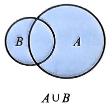

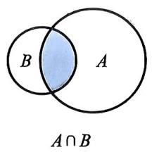

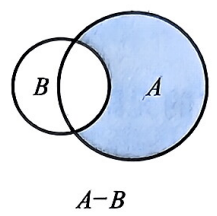

图0.1 集合运算

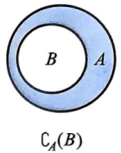

集合的运算满足以下运算律:

(1) 交换律: $A \cup B = B \cup A$, $A \cap B = B \cap A$;

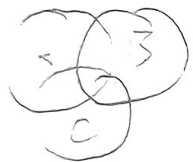

(2) 结合律: $A \cup (B \cup C) = (A \cup B) \cup C, A \cap (B \cap C) = (A \cap B) \cap C$;

(3) 分配律: $A \cap (B \cup C) = (A \cap B) \cup (A \cap C), A \cup (B \cap C) = (A \cup B) \cap (A \cup C)$;

(4) 幂等律: $A \cup A = A, A \cap A = A;$

(5) 德摩根 $^{①}$ 律:  $C - (A \cap B) = (C - A) \cup (C - B)$ ,

$$
C - (A \cup B) = (C - A) \cap (C - B).
$$

特别地, 当 $C$ 为全集时, 即有 $\overline{A \cap B} = \bar{A} \cup \bar{B}, \overline{A \cup B} = \bar{A} \cap \bar{B}$.

作为一个证明两个集合相等的例子, 下面我们证明德摩根律的第一条, 其他运算律的证明留给读者自己完成.

证明: $\forall x \in C - (A \cap B)$, 有 $x \in C$ 且 $x \notin A \cap B$. 因此有

$$
\text {“} x \in C \text {且} x \notin A ” \quad \text {或} \quad “ x \in C \text {且} x \notin B ”,
$$

也即“ $x\in C - A$ ”或“ $x\in C - B$ ”.所以， $x\in (C - A)\cup (C - B)$ .于是

$$
C - (A \cap B) \subseteq (C - A) \cup (C - B).
$$

> **注：** ① 德摩根 (De Morgan, 1806—1871), 英国数学家, 主要在分析学、代数学、数学史及逻辑学等方面做出重要的贡献. 他亦是最早试图解决四色问题的人, 并对四色问题做了一些推进. 他对现代计算学的贡献之一是德摩根律: AND 语句能够转换成 OR 语句, 反之亦然.

4

第0章

另一方面, $\forall y\in (C - A)\cup (C - B)$ ，有

$$
\text {“} y \in C \text {且} y \notin A \text {”} \quad \text {或} \quad \text {“} y \in C \text {且} y \notin B \text {”},
$$

也即 $y \in C$ 且 $y \notin A \cap B$. 所以, $y \in C - (A \cap B)$. 于是

$$
(C - A) \cup (C - B) \subseteq C - (A \cap B).
$$

综上可得

$$
C - (A \cap B) = (C - A) \cup (C - B).
$$

下面介绍一些实数的集合, 为后面介绍函数作准备.

**定义 0.1.8** 设 $a, b \in \mathbb{R}, a < b$.

(1) 称集合

$$
(a, b) = \{x | x \in \mathbb {R}, a <   x <   b \}
$$

为 $\mathbb{R}$ 的一个开区间, $a$ 和 $b$ 分别是其左端点和右端点, 它们不属于 $(a, b)$.

(2) 称集合

$$
[ a, b ] = \{x | x \in \mathbb {R}, a \leqslant x \leqslant b \}
$$

为 $\mathbb{R}$ 的一个闭区间, $a$ 和 $b$ 分别是其左端点和右端点, 它们都属于 $[a, b]$.

(3) 称集合

$$
\begin{array}{l} [ a, b) = \{x | x \in \mathbb {R}, a \leqslant x <   b \}, \\ (a, b ] = \{x | x \in \mathbb {R}, a <   x \leqslant b \} \end{array}
$$

为 $\mathbb{R}$ 的半开半闭区间, $a$ 和 $b$ 分别是左端点和右端点, 如图 0.2 所示.

$$
\begin{array}{c} \text {a <   x <   b} \\ \text {x} \end{array} \quad \begin{array}{c} \text {a\leqslant x\leqslant b} \\ \text {x} \end{array} \quad \begin{array}{c} \text {a\leqslant x <   b} \\ \text {x} \end{array} \quad \begin{array}{c} \text {a <   x\leqslant b} \\ \text {x} \end{array}
$$

图0.2 $\mathbb{R}$ 的区间

(4) 引进记号 $+\infty$ (读作正无穷大) 和 $-\infty$ (读作负无穷大), 则记

$$
\begin{array}{l} (a, + \infty) = \{x | x \in \mathbb {R}, x > a \}, \\ [ a, + \infty) = \{x | x \in \mathbb {R}, x \geqslant a \}, \\ (- \infty , b) = \{x | x \in \mathbb {R}, x <   b \}, \\ (- \infty , b ] = \{x | x \in \mathbb {R}, x \leqslant b \}. \end{array}
$$

以上集合皆称为无穷区间. 特别地, 无穷区间 $(-\infty, +\infty)$ 表示全体实数的集合 $\mathbb{R}$.

(5) 对于 $a \in \mathbb{R}, \varepsilon > 0$, 称 $(a - \varepsilon, a + \varepsilon)$ 为 $a$ 的 $\varepsilon-$ 邻域, 记作 $U(a, \varepsilon)$; 如果不考虑区间的大小, 可以将 $\varepsilon$ 略去, 那么称其为 $a$ 的一个邻域, 记为 $U(a)$.

集合

$$
\stackrel {\circ} {U} (a, \varepsilon) = \{x | 0 <   | x - a | <   \varepsilon \} = (a - \varepsilon , a) \cup (a, a + \varepsilon)
$$

称为 $a$ 的 $\varepsilon-$ 去心邻域; 集合 $(a - \varepsilon, a)$ 和 $(a, a + \varepsilon)$ 分别称为 $a$ 的 $\varepsilon-$ 左邻域和 $\varepsilon-$ 右邻域.

我们还可以用集合构造新的集合, 积集或笛卡儿 $^{①}$ 积就是一个构造新集合的方法.

**定义 0.1.9** 设 A, B 为非空集合, 定义 A 与 B 的积集

$$
A \times B = \{(x, y) | x \in A, y \in B \},
$$

其中 $(x,y)$ 是一个有序对 (也称序偶).

以上非空集合 $A, B$ 的积集 $A \times B$ 中的元素 $(x, y)$ 是有次序的; 两个序偶 $(x, y)$ 与 $(x', y')$ 相等当且仅当 $x = x', y = y'$, 如图0.3所示. 我们通常可以用 $\mathbb{R} \times \mathbb{R}$ 来表示平面上的点的集合.

#### 例 0.1.10 设 $A = \{a, b\}$, $B = \{\alpha, \beta, \gamma\}$, 则

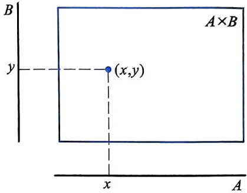

图0.3 积集

$$
A \times B = \{(a, \alpha), (a, \beta), (a, \gamma), (b, \alpha), (b, \beta), (b, \gamma) \}.
$$

显然, 如果 $A \neq B$, 那么 $A \times B \neq B \times A$.

如果 $A = B$, 那么 $A \times B = A \times A$ 可写成 $A^2$. 例如, 若 $A = \{x | x \in \mathbb{R}, 0 \leqslant x \leqslant 1\}$, 则 $A^2$ 表示一个边长为 1 的正方形 (包括内部及边界).

取 $A = B = \mathbb{R}$ ，则

$$
\mathbb {R} ^ {2} = \mathbb {R} \times \mathbb {R} = \{(x, y) | x, y \in \mathbb {R} \}
$$

就是我们熟知的坐标平面. 同理, 若取 $A = \mathbb{R}^2$, $B = \mathbb{R}$, 则

$$
A \times B = \mathbb {R} ^ {2} \times \mathbb {R} = \{((x, y), z) | (x, y) \in \mathbb {R} ^ {2}, z \in \mathbb {R} \},
$$

记为 $\mathbb{R}^3 = \{(x,y,z)|x,y,z\in \mathbb{R}\}$ ，即为三维空间.

我们学习的微积分将建立在集合 $\mathbb{R},\mathbb{R}^2$ 和 $\mathbb{R}^3$ 内, 分别称为一维、二维和三维欧几里得②空间, 简称欧氏空间.

> **注：** ① 笛卡儿 (Descartes, 1596—1650), 法国哲学家、物理学家、数学家. 他将几何坐标体系公式化, 所建立的解析几何在数学史上具有划时代的意义, 从而被认为是解析几何之父. 笛卡儿是二元论的代表, 留下名言 “我思故我在”, 提出了 “普遍怀疑” 的主张, 是欧洲近代哲学的奠基人之一. 黑格尔 (Hegel) 称他为 “现代哲学之父”. 笛卡儿开拓了所谓 “欧陆理性主义” 哲学, 堪称 17 世纪欧洲哲学界和科学界最有影响的巨匠之一, 被誉为 “近代科学的始祖”.

> **注：** ② 欧几里得 (Euclid, 约公元前 330—前 275), 古希腊数学家, 被称为 “几何之父”, 其数学巨著《原本》是一部划时代的著作, 是用公理方法建立起演绎体系的最早典范.

第0章

### 二、映射

一个映射将一个集合 $X$ 的元素对应于另外一个集合 $Y$ 的元素, 但是这种对应需要满足一定条件.

**定义 0.1.11** 设 $X, Y$ 为非空集合.

(1) 若对于 $X$ 中的每个元素 $x$, 按照某一法则 $f$, 在 $Y$ 中有唯一确定的元素 $y$ (记作 $y = f(x)$) 与它对应, 则称 $f$ 为从 $X$ 到 $Y$ 的一个映射, 记为

$$
f: X \to Y,
$$

称 $X$ 为映射 $f$ 的定义域, $Y$ 为映射 $f$ 的值集.

(2) 称与 $x \in X$ 对应的 $f(x) \in Y$ 为 $x$ 在 $f$ 下的像; 若 $A \subset X$, 则称 $f(A) = \{f(x) | x \in A\} \subset Y$ 为 $A$ 在 $f$ 下的像. 称 $f(X)$ 为 $f$ 的值域.

(3) 称 $G = \{(x, f(x)) | x \in X\} \subset X \times Y$ 为映射 $f$ 的图形.

一个映射由三部分组成: (1) 定义域的集合 X; (2) 包含值域的值集 Y;
(3) 对应法则 f.

两个映射 $f: X \to Y$ 和 $g: A \to B$ 相等当且仅当 $X = A, Y = B$ 且对任何 $x \in X$, 均有 $f(x) = g(x)$.

映射的概念可用多种简图来说明. 例如在图 0.4(a) 中, 我们将 X 和 Y 看成点的集合, 箭头用来表示  $x \in X$  是按照法则 f 与  $f(x) \in Y$  对应; 图 0.4(b) 是将 f 想象为一部机器, 当我们将  $x \in X$  输入这部机器, 输出唯一的  $f(x) \in Y$ .

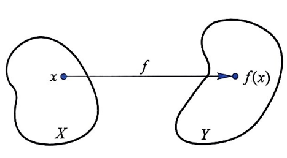

(a)

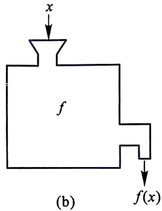

图0.4 映射

以下是常常碰到的一些特殊映射:

(1) 恒等映射 $I_{X}: X \to X$, 即 $\forall x \in X$, 有 $I_{X}(x) = x$.

(2) 常值映射 固定 $y_0 \in Y$, 对于任意 $x \in X$, 定义 $f(x) = y_0$, 则 $f: X \to Y$ 的值域是 $f(X) = \{y_0\}$.

(3) 投影映射 集合 $X$ 和 $Y$ 的积集 $X \times Y$ 有两个自然的映射

$$
p _ {1}: X \times Y \to X, \quad p _ {2}: X \times Y \to Y,
$$

其中 $p_1(x,y) = x, p_2(x,y) = y$. 若把 $(x,y)$ 看作平面直角坐标系中的一个点，则 $p_1$ 将 $(x,y)$ 映射到此点的 $x$ 坐标，也即将此点投影到 $x$ 轴上；同样，$p_2$ 将

§0.1 集合与映射

$(x, y)$ 映射到此点的 $y$ 坐标, 也即将此点投影到 $y$ 轴上. 因此将此映射称为投影映射.

在下面定义中, 我们列出一些具有 “良好” 性质的映射.

**定义 0.1.12** 设 $f: X \to Y$ 是映射.

(1) 如果对于任意 $x_{1}, x_{2} \in X$ 且 $x_{1} \neq x_{2}$, 有 $f(x_{1}) \neq f(x_{2})$, 那么称 $f$ 是单射, 或称 $f$ 为一对一的映射, 如图 0.5(a) 所示.

(2) 如果 $f(X) = Y$, 那么称 $f$ 是满射, 或者说 $f$ 是从 $X$ 到 $Y$ 上的映射, 如图 0.5(b) 所示.

(3) 如果 $f$ 同时是单射和满射, 那么称 $f$ 是双射, 或者说 $f$ 是一一对应的映射, 如图 0.5(c) 所示.

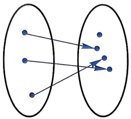

(a)单射

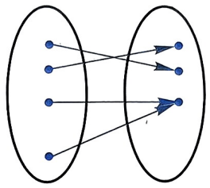

(b) 满射

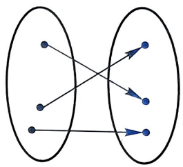

图0.5 有“良好”性质的映射

(c)双射

如果 $f$ 是一个单射, 那么对于每一个 $y \in f(X)$, 只有一个 $x \in X$ 使得 $f(x) = y$. 也就是说, 与单射等价的条件是: 如果 $f(x_1) = f(x_2)$, 那么 $x_1 = x_2$.

如果 $f$ 是满射, 那么对于每一个 $y \in Y$, 都至少存在一个 $x \in X$ 使得 $f(x) = y$.

如果 $f$ 是双射, 那么 $X$ 和 $Y$ 的元素的“个数”是相等的.

由上述定义易知, 恒等映射是双射, 投影映射是满射. 如果 $f: X \to Y$ 是常值映射, 而且 $X$ 和 $Y$ 都是多于一个元素的集合, 那么 $f$ 既不是单射, 也不是满射.

在适当的条件下, 我们可以从已知的映射构造新的映射. 以下的复合映射和逆映射就是常见的例子.

**定义 0.1.13** 设 $f: X \to Y, g: Y \to Z$ 是映射. $f$ 和 $g$ 的复合映射 $g \circ f: X \to Z$ 是用

$$
(g \circ f) (x) = g (f (x))
$$

定义的映射, 如图 0.6 所示.

**定义 0.1.14** 设 $f: X \to Y$ 是双射, 若 $x \in X, y \in Y, y = f(x)$, 作对应 $f^{-1}(y) = x$, 称这样定义的双射

$$
f ^ {- 1}: Y \to X
$$

为 $f$ 的逆映射或反映射, 如图 0.7 所示.

8

第0章

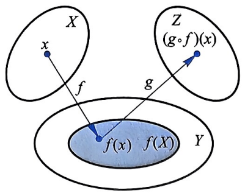

图0.6 复合映射

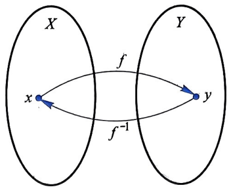

图0.7 逆映射

一个映射, 若不是双射, 则不存在逆映射.

在不同的数学领域, 映射有不同的名称, 如函数、变换或算子. 在微积分中, 我们习惯地称从 $\mathbb{R}^n$ ($n = 1,2,3$) 的一个子集到 $\mathbb{R}$ 的一个子集内的映射为函数. 在接下来的第二节中, 我们会看到, 和以上构造复合映射和逆映射一样, 复合函数和反函数是构造新函数常用的手段.

## §0.2 一元实函数

在这一节里我们主要考虑一元实函数, 即映射

$$
f: D \to \mathbb {R},
$$

其中 $D\subset \mathbb{R}$ .下面我们给出一元实函数的定义.

### 一、函数的概念

**定义 0.2.1** 设非空集合 $D, V \subset \mathbb{R}$, 若 $\forall x \in D$, 按某对应规则 $f$, 有唯一确定的 $y \in V$ 与之对应, 则称 $f$ 是定义在 $D$ 上的函数, 记为

$$
y = f (x), x \in D \quad {\text {或}} \quad f: D \to V,
$$

其中 $D$ 称为 $f$ 的定义域, $f(D) = \{y | y = f(x), x \in D\}$ 称为 $f$ 的值域.

$f$ 的图形是 $G = \{(x, f(x)) | (x, f(x)) \in \mathbb{R}^2, x \in D\}$.

将一个一元实函数图形绘在直角坐标系的二维平面上, 其特点是: 任何垂直于 $x$ 轴的直线和 $G$ 至多相交于一点, 根据函数的定义, 对于每一个给定的 $x$, 所对应的 $f(x)$ 是唯一的. $G$ 在 $x$ 轴上的投影是 $f$ 的定义域, 在 $y$ 轴上的投影是 $f$ 的值域 (图 0.8).

如果任何平行于 $x$ 轴的直线和 $G$ 至多相交于一点, 那么 $f$ 是一对一的, 如图 0.9 所示; 如果我们将一对一的 $f$ 限制为 $f: D \to f(D)$, 那么它是一一对应的. 图 0.8 表示一个不是一对一的函数的图形, 因为存在 $x_1 \neq x_2$, 而 $f(x_1) = f(x_2)$.

§0.2 一元实函数

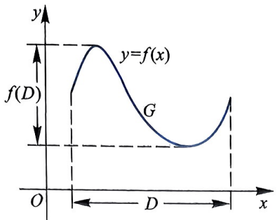

图0.8 图形的投影

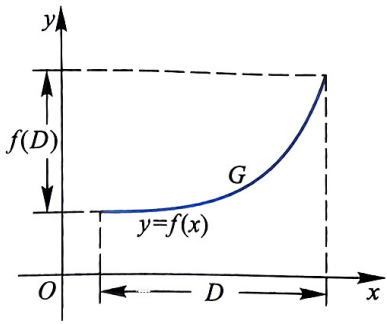

图0.9 一对一函数的图形

一个函数可用一个式子来表示, 如

$$
f: [ 0, + \infty) \to [ 0, + \infty), f (x) = \sqrt {x}.
$$

大部分时候, 为了避免不必要的重复, 使表达精简, 一般不提函数 $f$ 的定义域. 如果没有特别指出, 一个函数 $f$ 的定义域是全部使 $f$ 的定义 (表达式)有意义的实数, 我们称之为自然定义域.

#### 例 0.2.2 如果只写出函数

$$
f (x) = \sqrt {x - 1} + \sqrt {2 - x},
$$

而没有指出 $f$ 的定义域, 我们理解 $f$ 的定义域为 $[1,2]$, 因为使 $\sqrt{x - 1}$ 有意义的实数满足 $x - 1 \geqslant 0$, 使 $\sqrt{2 - x}$ 有意义的实数满足 $2 - x \geqslant 0$, 所以全部使 $f$ 有意义的实数是 $[1, +\infty) \cap (-\infty, 2] = [1, 2]$.

但有时如果我们在表示一个函数的式子后同时指明此函数的定义域,例如

$$
f (x) = \frac {1}{x}, \quad x \in [ - 1, 1 ], \quad x \neq 0,
$$

就是指明 $f$ 的定义域为 $[-1, 1] - \{0\}$.

**定义 0.2.3** 设函数  $y = f(x)$ ,  $x \in D$  是一一对应的函数, 则  $\forall y \in f(D)$ , 有唯一确定的  $x \in D$  与之对应, 称这样的函数为 f 的反函数, 记为

$$
x = f ^ {- 1} (y), \quad y \in f (D) \quad \text {或} \quad f ^ {- 1}: f (D) \to D.
$$

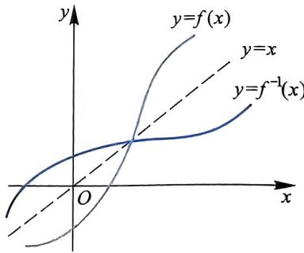

习惯上, 我们用 $x$ 表示自变量, $y$ 表示因变量, 即总是把 $y$ 表示成 $x$ 的函数. 所以, 我们一般称 $y = f^{-1}(x)$ 为 $y = f(x)$ 的反函数. 易知函数

图0.10

$y = f(x)$ 和函数 $y = f^{-1}(x)$ 的图形关于直线 $y = x$ 对称 (图0.10).

#### 例 0.2.4 (1) 函数 $f(x) = x^3, x \in \mathbb{R}$ 的反函数是

$$
f ^ {- 1} (x) = \sqrt [ 3 ]{x}, \quad x \in \mathbb {R};
$$

10

第0章

(2) 函数 $f(x) = x^{2}, x \in [0, +\infty)$ 的反函数是

$$
f ^ {- 1} (x) = \sqrt {x}, \quad x \in [ 0, + \infty);
$$

(3) 指数函数

$$
y = a ^ {x}, \quad x \in \mathbb {R} (a > 0, a \neq 1)
$$

和对数函数

$$
y = \log_ {a} x, \quad x \in (0, + \infty) (a > 0, a \neq 1)
$$

互为反函数;

(4) 正弦函数 $f(x) = \sin x, x \in \mathbb{R}$ 不是一个一一对应的函数, 如果我们取 $\mathbb{R}$ 的一个子集作为定义域, 就可“重新”定义一个正弦函数, 例如

$$
y = \sin x, \quad x \in \left[ - \frac {\pi}{2}, \frac {\pi}{2} \right]
$$

是一个一一对应的函数, 它的反函数为

$$
y = \sin^ {- 1} x, \quad x \in [ - 1, 1 ],
$$

或记为

$$
y = \arcsin x, \quad x \in [ - 1, 1 ].
$$

正弦函数的反函数称为反正弦函数, 它的值域  $\left[-\frac{\pi}{2}, \frac{\pi}{2}\right]$  称为主值范围. 反正弦函数的图像如图 0.11(a) 所示.

同理, 我们可以通过确定余弦函数、正切函数等的主值范围来定义反余弦函数 $y = \arccos x$ 、反正切函数 $y = \arctan x$ 等反三角函数. 图 0.11(b) 和 0.11(c) 分别表示反余弦函数 $y = \arccos x$ 、反正切函数 $y = \arctan x$ 与其原函数 $y = \cos x, x \in [0, \pi]$ 与 $y = \tan x, x \in \left(-\frac{\pi}{2}, \frac{\pi}{2}\right)$ 图像之间的关系.

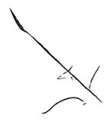

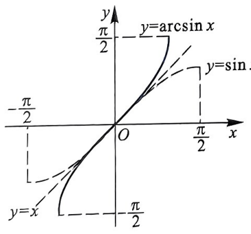

(a)

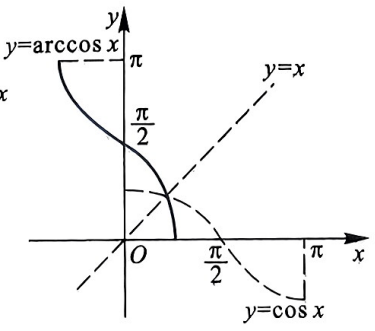

(b)

图0.11

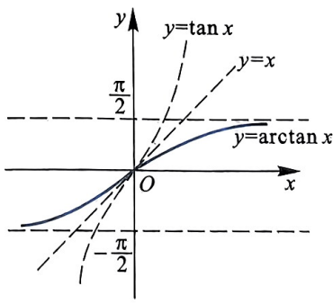

(c)

§0.2 一元实函数

反三角函数有以下常见的性质:

(1) $\arcsin x + \arccos x = \frac{\pi}{2}$;

(2) $\arctan x + \operatorname{arccot} x = \frac{\pi}{2}$;

(3) 当 $x > 0$ 时, 有 $\arctan x + \arctan \frac{1}{x} = \frac{\pi}{2}$.

下面以 (1) 为例, 由于

$$
\sin (\arcsin x) = x, \sin \left(\frac {\pi}{2} - \arccos x\right) = \cos (\arccos x) = x,
$$

而 $\arccos x \in [0, \pi]$, 故 $\frac{\pi}{2} - \arccos x \in \left[-\frac{\pi}{2}, \frac{\pi}{2}\right]$. 又 $\arcsin x \in \left[-\frac{\pi}{2}, \frac{\pi}{2}\right]$, 因此, $\arcsin x = \frac{\pi}{2} - \arccos x$, 从而 $\arcsin x + \arccos x = \frac{\pi}{2}$.

(2) 与 (3) 的证明, 由读者作为练习完成.

下面 6 类函数及其性质是我们非常熟悉的.

(1) 常值函数 $f(x) = c, x \in \mathbb{R}, c$ 为实常数.

(2) 幂函数 $f(x) = x^{\alpha}, \alpha \in \mathbb{R}$ 是固定的. 如果 $\alpha$ 是正整数, 那么 $f$ 的定义域是 $\mathbb{R} = (-\infty, +\infty)$; 其他情况下, $f$ 的定义域视 $\alpha$ 的取值而定; 如果 $\alpha$ 是无理数, 规定 $f$ 的定义域是 $(0, +\infty)$.

(3) 指数函数 $f(x) = a^{x}, x \in \mathbb{R} (a > 0$ 且 $a \neq 1)$.

当 $a = \mathrm{e} = 2.71828182845\cdots$ 时, 称之为自然指数, 记为 $f(x) = \mathrm{e}^{x}$.

(4) 对数函数 $f(x) = \log_a x, x \in (0, +\infty) (a > 0 \text{ 且 } a \neq 1)$.

当 $a = \mathrm{e} = 2.71828182845\cdots$ 时, 称之为自然对数, 记为 $f(x) = \ln x$.

#### (5) 三角函数

正弦函数: $f(x) = \sin x, x \in \mathbb{R}$,

余弦函数: $f(x) = \cos x, x \in \mathbb{R}$,

正切函数: $f(x) = \tan x = \frac{\sin x}{\cos x}, x \in \mathbb{R}$ 且 $x \neq k\pi + \frac{\pi}{2} (k \in \mathbb{Z})$

余切函数: $f(x) = \cot x = \frac{\cos x}{\sin x}, x \in \mathbb{R}$ 且 $x \neq k\pi (k \in \mathbb{Z})$,

正割函数: $f(x) = \sec x = \frac{1}{\cos x}, x \in \mathbb{R}$ 且 $x \neq k\pi + \frac{\pi}{2} (k \in \mathbb{Z})$,

余割函数: $f(x) = \csc x = \frac{1}{\sin x}, x \in \mathbb{R}$ 且 $x \neq k\pi (k \in \mathbb{Z})$.

#### (6) 反三角函数

反正弦函数: $y = \arcsin x : [-1, 1] \to \left[-\frac{\pi}{2}, \frac{\pi}{2}\right]$,

反余弦函数: $y = \arccos x:[-1,1]\to [0,\pi ],$

反正切函数: $y = \arctan x : \mathbb{R} \to \left(-\frac{\pi}{2}, \frac{\pi}{2}\right)$,

12

第0章

反余切函数: $y = \operatorname{arccot} x : \mathbb{R} \to (0, \pi)$.

由于反三角映射是三角映射的逆映射, 我们也记

$$
\begin{array}{l l} \arcsin x = \sin^ {- 1} x, & \arccos x = \cos^ {- 1} x, \\ \arctan x = \tan^ {- 1} x, & \operatorname{arccot} x = \cot^ {- 1} x. \end{array}
$$

以上6类函数统称为基本初等函数.

由基本初等函数经过有限次四则运算或有限次复合运算所得的函数称为初等函数. 如多项式函数

**重难点讲解初等函数**

$$
P (x) = a _ {n} x ^ {n} + a _ {n - 1} x ^ {n - 1} + \dots + a _ {0},
$$

有理函数

$R(x)=\frac{P(x)}{Q(x)}$  (其中  $P(x)$  和  $Q(x)$  是没有公共因子的多项式),

$f(x) = \frac{1}{\sqrt{x^2 - 1}}\cdot \mathrm{e}^{-x}\arctan \frac{1}{x},g(x) = \sin^2\frac{1}{x}$ 等都是初等函数.

那些将定义域分割为不相交的子集, 而在每一个子集上相应给出定义的函数, 称为分段函数. 注意分段函数并不是几个函数, 而是一个函数, 只是其在不同区间上函数表达式不同而已.

分段函数一般不是初等函数, 但有的分段函数也是初等函数. 例如, 函数

$$
f (x) = | x + 2 | + | x - 4 | = \left\{ \begin{array}{l l} - 2 x + 2, & x <   - 2, \\ 6, & - 2 \leqslant x \leqslant 4, \\ 2 x - 2, & x > 4 \end{array} \right.
$$

是分段函数, 但 $f(x)$ 也可表示为

$$
f (x) = \sqrt {(x + 2) ^ {2}} + \sqrt {(x - 4) ^ {2}}.
$$

很显然, $f(x)$ 是初等函数.

在微积分中, 经常讨论分段函数的极限、连续性、可导性与可积性, 希望读者能引起足够的重视.

#### 例 0.2.5 符号函数  $\mathrm{sgn}(x)$  (图 0.12):

$$
\operatorname{sgn} (x) = \left\{ \begin{array}{l l} - 1, & x <   0, \\ 0, & x = 0, \\ 1, & x > 0. \end{array} \right.
$$

#### 例 0.2.6 取整函数 $[x]$, 表示不超过 $x$ 的最大整数 (图0.13), 取整函数可表示为

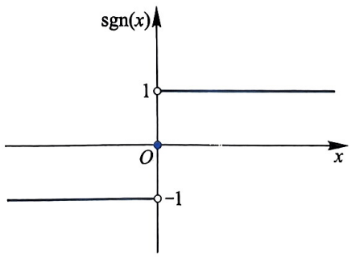

图0.12

$$
f (x) = [ x ] = n (n \leqslant x <   n + 1, n \in \mathbb {Z}),
$$

§0.2 一元实函数

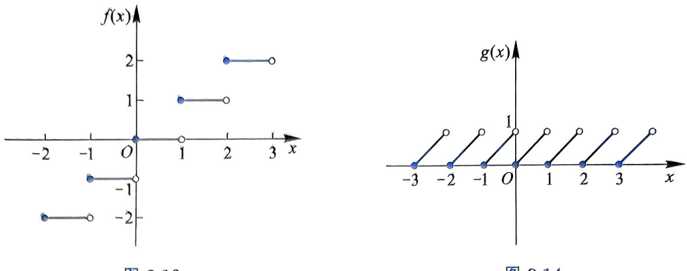

#### 例 0.2.7 天体力学中著名的开普勒①方程

$g(x) = x - [x]$ 称为非负小数部分函数 (图0.14).

前面给出的函数的例子 (包括分段函数) 有共同的特点, 都具有形式 $y = f(x)$, 称为显式函数. 通过满足某一方程所确定的变量 $y$ 和 $x$ 之间的对应关系, 称为隐式函数, 这是函数的另一种重要表示形式.

图0.13

图0.14

$$
y = x + \varepsilon \sin y,
$$

$\varepsilon \in (0,1)$ 是一个实常数. 可以证明, 对任给 $x \in \mathbb{R}$, 存在唯一的 $y$ 满足开普勒方程.

### 二、函数的简单特性

### 1. 有界性

**定义 0.2.8** 设 $f: D \to \mathbb{R}$, 若存在常数 $M$, 对任何 $x \in D$, 均有 $f(x) \leqslant M$, 则称 $f$ 有上界, $M$ 是 $f$ 的一个上界; 若存在常数 $m$ 使得对于任何 $x \in D$ 均有 $f(x) \geqslant m$, 则称 $f$ 有下界, $m$ 是 $f$ 的一个下界. 若 $f$ 既有上界又有下界, 则称 $f$ 是有界函数; 否则, 称 $f$ 为无界函数.

当一个函数有上界 (或者下界) 时, 其上界 (或者下界) 是不唯一的. 事实上, 如果 $M$ 是 $f$ 的一个上界, 那么任何大于 $M$ 的数都是 $f$ 的上界; 如果 $m$ 是 $f$ 的一个下界, 那么任何小于 $m$ 的数都是 $f$ 的下界.

函数 $f(x)$ 在 $D$ 上有界的另一个定义是

$$
\text {存在} M > 0, \forall x \in D, \text {均有} | f (x) | \leqslant M.
$$

容易证明: 这两个定义是等价的.

> **注：** ① 开普勒 (Kepler, 1571—1630), 德国天文学家. 他发现了行星运动的三大定律, 分别是轨道定律、面积定律和周期定律, 即: 所有行星分别是在大小不同的椭圆轨道上运行; 在同样的时间里行星向径在轨道平面上所扫过的面积相等; 行星公转周期的平方与它同太阳间距离的立方成正比. 同时他对光学、数学也做出了重要的贡献, 他是现代实验光学的奠基人.

14

第0章

### 2. 单调性

**定义 0.2.9** 设 $f: D \to \mathbb{R}$, 若 $\forall x_1, x_2 \in D$, 当 $x_1 < x_2$ 时有 $f(x_1) \leqslant f(x_2)$ (或者 $f(x_1) < f(x_2)$), 则称 $f$ 是单调增加的 (或者严格单调增加的); 若 $\forall x_1, x_2 \in D$, 当 $x_1 < x_2$ 时有 $f(x_1) \geqslant f(x_2)$ (或者 $f(x_1) > f(x_2)$), 则称 $f$ 是单调减少的 (或者严格单调减少的).

例如, 函数 $f(x) = a^{x} (a > 1)$, $g(x) = \arctan x$ 在定义域内是严格单调增加的; 函数 $f(x) = a^{x} (0 < a < 1)$, $g(x) = \operatorname{arccot} x$ 在定义域内是严格单调减少的; 而函数 $f(x) = \operatorname{sgn}(x)$, $g(x) = [x]$ 是单调增加的, 但不是严格单调增加的.

由定义知, 一个严格单调增加 (或者减少) 的函数一定是一一对应函数.

关于函数单调性的另一种等价定义:

(1) $f(x)$ 在区间 $D$ 上单调增加当且仅当 $\forall x_{1}, x_{2} \in D$, 恒有

$$
(x _ {1} - x _ {2}) [ f (x _ {1}) - f (x _ {2}) ] \geqslant 0;
$$

(2) $f(x)$ 在区间 $D$ 上单调减少当且仅当 $\forall x_{1}, x_{2} \in D$, 恒有

$$
(x _ {1} - x _ {2}) [ f (x _ {1}) - f (x _ {2}) ] \leqslant 0.
$$

**定理 0.2.10** 设 $f: D \to \mathbb{R}$ 是严格单调增加 (或者减少) 的函数, 则 $f: D \to f(D)$ 存在反函数 $f^{-1}: f(D) \to D$, 且满足

$$
f ^ {- 1} \circ f (x) = x, x \in D, \quad f \circ f ^ {- 1} (y) = y, y \in f (D),
$$

而且 $f^{-1}$ 也是严格单调增加 (或者减少) 的函数 (证明请读者自行完成).

很多函数在其自然定义域内不是单调的, 但在其自然定义域的某些子集内具有单调性, 例如, 函数 $f(x) = \sin x$ 在 $\mathbb{R}$ 上不是单调的, 但在区间 $\left[2k\pi - \frac{\pi}{2}, 2k\pi + \frac{\pi}{2}\right] (k \in \mathbb{Z})$ 上是严格单调增加的, 而在区间 $\left[2k\pi + \frac{\pi}{2}, 2k\pi + \frac{3}{2}\pi\right] (k \in \mathbb{Z})$ 上是严格单调减少的.

### 3. 奇偶性

**定义 0.2.11** 设 $f: D \to \mathbb{R}$, $D$ 关于原点对称, 即当 $x \in D$ 时, $-x \in D$. 如果对于任意 $x \in D$, $f(-x) = f(x)$, 那么称 $f$ 是偶函数; 如果对于任意 $x \in D$, $f(-x) = -f(x)$, 那么称 $f$ 是奇函数.

例如, $f(x) = x^{3}, g(x) = \frac{1}{2} (\mathrm{e}^{x} - \mathrm{e}^{-x}), h(x) = \ln (x + \sqrt{x^{2} + 1})$ 是奇函数; $f(x) = x^{2}, g(x) = |x + a| + |x - a|$ (a为实常数), $h(x) = x\ln \frac{1 - x}{1 + x}$ 是偶函数; 而函数 $f(x) = \sin x + \cos x$ 既不是偶函数也不是奇函数, 有时也称其为非奇非偶函数.

§0.2 一元实函数

### 4. 周期性

**定义 0.2.12** 设 $f: D \to \mathbb{R}$, 如果存在非零常数 $T \in \mathbb{R}$ 使 $\forall x \in D$, $x + T \in D$ 均有 $f(x + T) = f(x)$, 那么称 $f$ 是周期函数, $T$ 是 $f$ 的一个周期. 如果存在最小的 $T > 0$, 使 $T$ 是 $f$ 的一个周期, 那么称 $T$ 是 $f$ 的最小正周期.

显然, 周期函数的周期不是唯一的, 如果 $T$ 是 $f$ 的一个周期, 那么对于任意 $k \in \mathbb{Z} - \{0\}$, $kT$ 也是 $f$ 的一个周期.

例如, $f(x) = \sin x$, $g(x) = \cos x$ 是 $\mathbb{R}$ 上的周期函数, $2k\pi (k \in \mathbb{Z} - \{0\})$ 都是它们的周期, $2\pi$ 是它们的最小正周期. 但并不是每个周期函数都有最小正周期.

#### 例 0.2.13 狄利克雷①函数

$$
D (x) = \left\{ \begin{array}{l l} 0, & x \text {为无理数}, \\ 1, & x \text {为有理数} \end{array} \right.
$$

是一个周期函数. 任何非零有理数都是 $D(x)$ 的周期, 因此 $D(x)$ 不存在最小正周期.

图 0.15 给出了一些函数特性的直观说明.

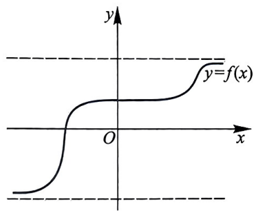

(a) 有界函数

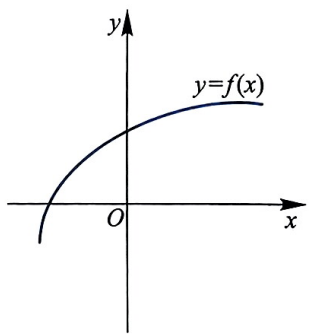

(b) 严格单调增加函数

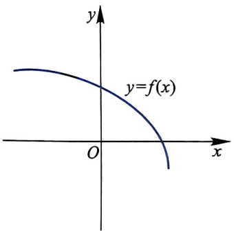

(c) 严格单调减少函数

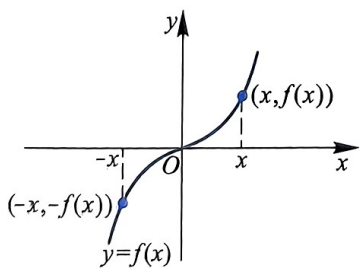

(d) 奇函数

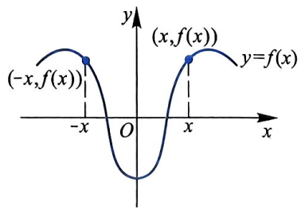

(e) 偶函数

图0.15

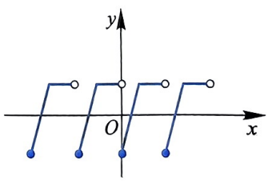

(f) 周期函数

> **注：** ① 狄利克雷 (Dirichlet, 1805—1859), 德国数学家. 他是解析数论的奠基者, 也是现代函数概念的定义者. 他在德国受教育, 后来到法国, 向很多著名数学家学习. 其首篇论文是讨论费马大定理 $n = 5$ 的情况 (1825年证明), 后来亦证明了 $n = 14$ 的情况.

> **注：** $n = 14$

> **注：** $n = 5$

16

第0章

## §0.3 极坐标系与参数方程

在平面直角坐标系里, 我们用 $(x, y)$ 来表示平面上的一点, 其中 $x, y$ 分别是此点在两个坐标轴上的投影坐标. 但有时直角坐标表示不是最方便的, 例如在海平面上报告某船只的位置, 报告船只的距离与方位要比报告船只在某直角坐标系中的坐标更直接更方便. 以下介绍的极坐标系就是用“距离”和“方位”来表示 (确定) 平面上一点的坐标系.

**重难点讲解极坐标、参数方程与不等式**

### 一、极坐标系

在平面上取定一点 $O$, 称为极点. 从 $O$ 出发引一条射线 $Ox$, 称为极轴. 再

取定一个长度单位来表示点到极点的距离; 通常规定角度取逆时针方向为正, 顺时针方向为负. 这样, 平面上任一点 $P$ 的位置就可以用线段 $OP$ 的长度 $r$ 以及从 $Ox$ 到 $OP$ 的角度 $\theta$ 来确定. 有序数对 $(r, \theta)$ 就称为点 $P$ 的极坐标, 记为 $P(r, \theta), r$ 称为点 $P$ 的极径, $\theta$ 称为点 $P$ 的极角, 如图0.16所示.

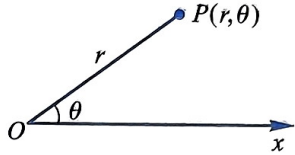

图0.16

一般规定 $0 \leqslant r < +\infty, 0 \leqslant \theta < 2\pi$ (或 $-\pi \leqslant \theta < \pi$), 这样平面上除极点 $O$ 以外, 其他每一点都有唯一的极坐标表示. 极点的极径为零, 极角任意.

有时为了应用方便, 对 $r, \theta$ 不作上述规定, 但这时平面上每一点的极坐标表示就不唯一了. 如果 $(r, \theta)$ 是一个点的极坐标, 那么 $(r, 2n\pi + \theta)$ 和 $(-r, (2n + 1)\pi + \theta)$ 都可作为它的极坐标 (其中 $n$ 是任意整数).

如果我们将极点取为直角坐标系的原点, 极轴取为直角坐标系的 $x$ 轴, 那么某一点 $P$ 的极坐标 $(r, \theta)$ 与平面直角坐标 $(x, y)$ 之间的转换关系为

$\left\{ \begin{array}{l}x = r\cos \theta ,\\ y = r\sin \theta \end{array} \right.\text{或}\left\{ \begin{array}{l}r = \sqrt{x^2 + y^2},\\ \theta = \arctan \frac{y}{x} +k\pi (x\neq 0,k\text{的取值根据}(x,y)\text{确定}), \end{array} \right.$

当 $x = 0$ 时, 若 $y > 0$, 则 $\theta = \frac{\pi}{2}$; 若 $y < 0$, 则 $\theta = \frac{3\pi}{2}$.

### 二、曲线的极坐标方程与参数方程

在平面直角坐标系中, 我们常用 $y = f(x)$ 等形式来表示平面上的曲线, 但有些曲线采用极坐标时, 方程比较简单. 用极坐标系描述的曲线方程称作极坐标方程, 通常表示 $r$ 为自变量 $\theta$ 的函数.

质点运动的位置 (运动轨迹) 与时间有关, 在平面或空间建立直角坐标系后, 质点的坐标是时间 $t$ 的函数. 若质点在平面上运动, 其坐标与时间之间的关

§0.3 极坐标系与参数方程

系为

$$
\left\{ \begin{array}{l l} x = f (t), & (0 \leqslant t _ {1} \leqslant t \leqslant t _ {2}). \\ y = g (t) & \end{array} \right.
$$

上式表示的方程称为参数方程. 参数方程在现实中有很广泛的应用.

下面是一些常见的用平面直角坐标方程、极坐标方程和参数方程表示的平面曲线, 希望读者能熟悉并掌握.

#### 例 0.3.1 (1)以极点(原点) $O$ 为圆心, $a(a > 0)$ 为半径的圆:

直角坐标方程

$$
x ^ {2} + y ^ {2} = a ^ {2},
$$

极坐标方程

$$
r = a (0 \leqslant \theta <   2 \pi),
$$

常见的参数方程为 $(\theta$ 为圆心角或极角)

$$
\left\{ \begin{array}{l l} x = a \cos \theta , \\ y = a \sin \theta \end{array} \right. (0 \leqslant \theta <   2 \pi).
$$

(2) 以 $(a,0)$ 为圆心, $a(a > 0)$ 为半径的圆:

直角坐标方程

$$
(x - a) ^ {2} + y ^ {2} = a ^ {2},
$$

极坐标方程

$$
r = 2 a \cos \theta \left(- \frac {\pi}{2} \leqslant \theta \leqslant \frac {\pi}{2}\right),
$$

参数方程可表示为

① $\left\{ \begin{array}{l}x = 2a\cos^2\theta ,\\ y = 2a\cos \theta \sin \theta \end{array} \right.$ （其中 $\theta$ 为极角， $-\frac{\pi}{2}\leqslant \theta \leqslant \frac{\pi}{2}$ ）；

② $\left\{ \begin{array}{l}x = a + a\cos \theta ,\\ y = a\sin \theta \end{array} \right.$ （其中 $\theta$ 为圆心角， $0\leqslant \theta \leqslant 2\pi)$

(3) 以 $(0, a)$ 为圆心, $a (a > 0)$ 为半径的圆:

直角坐标方程

$$
x ^ {2} + (y - a) ^ {2} = a ^ {2},
$$

极坐标方程

$$
r = 2 a \sin \theta (0 \leqslant \theta \leqslant \pi),
$$

18

参数方程可表示为

$$
\text {①} \left\{ \begin{array}{l l} x = 2 a \sin \theta \cos \theta , \\ y = 2 a \sin^ {2} \theta \end{array} \right. (\text {其中} \theta \text {为极角,} 0 \leqslant \theta \leqslant \pi);
$$

② $\left\{ \begin{array}{l}x = a\cos \theta ,\\ y = a + a\sin \theta \end{array} \right.$ （其中 $\theta$ 为圆心角， $0\leqslant \theta \leqslant 2\pi)$

从上面的例子可以看出, 一条曲线的参数方程是不唯一的. 在实际应用中, 可根据具体情况, 选择适当的参数, 使计算或应用更简单.

#### 例 0.3.2 心形线:  $r = a(1 + \cos\theta)$ , 其中 a > 0 为常数, 如图 0.17 所示.

双纽线: $r^2 = a\cos 2\theta$, 其中 $a > 0$ 为常数, 如图 0.18 所示.

#### 例 0.3.3 阿基米德 $^{①}$ 螺线:  $r = a + b\theta$ , 其中 a, b > 0 为常数, 如图 0.19 所示.

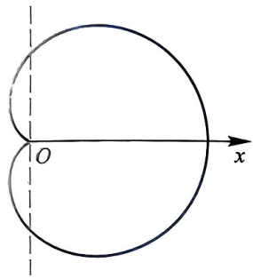

图0.17

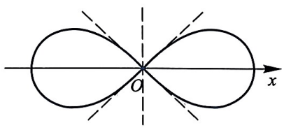

图0.18

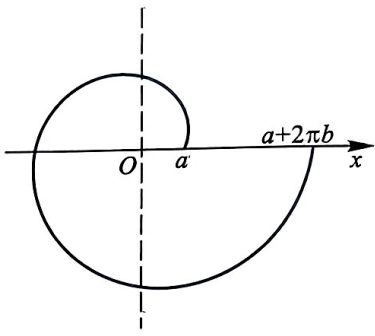

图0.19

许多极坐标方程常用三角函数表示, 因为三角函数具有周期性, 所以极坐标方程表示的曲线经常会表现出不同的对称形式, 请读者自己尝试分析一下.

#### 例 0.3.4 摆线(外摆线)的参数方程

$$
\left\{ \begin{array}{l} x = a (t - \sin t), \\ y = a (1 - \cos t) \end{array} \right.
$$

$$
t \geqslant 0)
$$

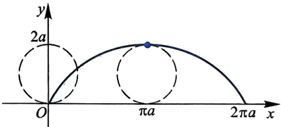

图0.20

摆线可看成半径为 $a$ 的圆沿直线做无滑动的滚动, 在此运动过程中圆上某定点 $P$ 的运动轨迹. 摆线的图形如图0.20所示.

> **注：** ① 阿基米德 (Archimedes, 公元前 287—前 212), 古希腊哲学家、数学家、物理学家、力学家, 静态力学和流体静力学的奠基人, 享有“力学之父”的美称. 阿基米德和高斯 (Gauss)、牛顿 (Newton) 并列为世界三大数学家. 阿基米德曾说过: “给我一个支点, 我就能撬起整个地球.” 这是他的名言. 阿基米德给出许多求几何图形重心的方法. “物体在液体中所受浮力等于它所排开液体所受的重力” 称为阿基米德原理. 阿基米德还采用不断分割法求椭球体、旋转抛物体等的体积, 这种方法已具有积分计算的雏形.

§0.3 极坐标系与参数方程

#### 例 0.3.5 星形线(内摆线)

$$
x ^ {\frac {2}{3}} + y ^ {\frac {2}{3}} = a ^ {\frac {2}{3}} \quad (a \text {为正常数}),
$$

其参数方程为

$$
\left\{ \begin{array}{l l} x = a \cos^ {3} \theta , & (0 \leqslant \theta <   2 \pi). \\ y = a \sin^ {3} \theta \end{array} \right.
$$

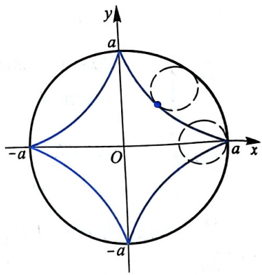

星形线实际上是半径为 $\frac{a}{4}$ 的小圆, 在半径为 $a$ 的圆内部沿圆周做无滑动的滚动过程中小圆上某定点的运动轨迹. 星形线的图形如图0.21所示.

图0.21

附:一些常用的公式

(1) 三角函数公式

倍角公式与半角公式:

$$
\begin{array}{l} \left| \begin{array}{l} \sin 2 \alpha = 2 \sin \alpha \cos \alpha , \\ \cos 2 \alpha = 2 \cos^ {2} \alpha - 1 = 1 - 2 \sin^ {2} \alpha = \cos^ {2} \alpha - \sin^ {2} \alpha , \\ \sin^ {2} \frac {\alpha}{2} = \frac {1 - \cos \alpha}{2}, \quad \cos^ {2} \frac {\alpha}{2} = \frac {1 + \cos \alpha}{2}, \\ \tan \frac {\alpha}{2} = \frac {1 - \cos \alpha}{\sin \alpha} = \frac {\sin \alpha}{1 + \cos \alpha}. \end{array} \right. \end{array}
$$

和差化积公式:

$$
\begin{array}{l} \sin \alpha + \sin \beta = 2 \sin \frac {\alpha + \beta}{2} \cos \frac {\alpha - \beta}{2}, \\ \sin \alpha - \sin \beta = 2 \cos \frac {\alpha + \beta}{2} \sin \frac {\alpha - \beta}{2}, \\ \cos \alpha + \cos \beta = 2 \cos \frac {\alpha + \beta}{2} \cos \frac {\alpha - \beta}{2}, \\ \cos \alpha - \cos \beta = - 2 \sin \frac {\alpha + \beta}{2} \sin \frac {\alpha - \beta}{2}. \end{array}
$$

积化和差公式:

$$
\begin{array}{l} \left| \begin{array}{l} \sin \alpha \cos \beta = \frac {1}{2} [ \sin (\alpha + \beta) + \sin (\alpha - \beta) ], \\ \cos \alpha \sin \beta = \frac {1}{2} [ \sin (\alpha + \beta) - \sin (\alpha - \beta) ], \\ \cos \alpha \cos \beta = \frac {1}{2} [ \cos (\alpha + \beta) + \cos (a - \beta) ], \end{array} \right| \end{array}
$$

20

第0章

$$
\sin \alpha \sin \beta = - \frac {1}{2} [ \cos (\alpha + \beta) - \cos (\alpha - \beta) ].
$$

万能公式: $\sin \alpha = \frac{2\tan\frac{\alpha}{2}}{1 + \tan^2\frac{\alpha}{2}},\cos \alpha = \frac{1 - \tan^2\frac{\alpha}{2}}{1 + \tan^2\frac{\alpha}{2}}.$

#### (2) 排列组合公式

正整数 $n$ 的阶乘: $n! = n(n - 1)(n - 2) \cdot \cdots \cdot 3 \cdot 2 \cdot 1$. 约定零的阶乘等于 1, 即 $0! = 1$.

从 $n$ 个不同元素中取出 $k$ 个元素的排列数 $(k \leqslant n)$:

$$
\mathrm{A} _ {n} ^ {k} = n (n - 1) (n - 2) \dots (n - k + 1) = \frac {n !}{(n - k) !}.
$$

特别地, 当 $k = n$ 时, 即为 $n$ 个不同元素的全排列, 等于 $n!$.

从 $n$ 个不同元素中取出 $k$ 个元素的组合数 $(k \leqslant n)$:

$$
\binom {n} {k} = \mathrm{C} _ {n} ^ {k} = \frac {\mathrm{A} _ {n} ^ {k}}{k !} = \frac {n (n - 1) (n - 2) \cdots (n - k + 1)}{k !} = \frac {n !}{k ! (n - k) !}.
$$

特别地, $C_{n}^{0}=1,C_{n}^{n}=1$ ,且有 $C_{n}^{k}=C_{n}^{n-k},C_{n}^{k-1}+C_{n}^{k}=C_{n+1}^{k}$ .

#### (3) 二项式展开公式

对正整数 $n$ 和数 $a, b$, 有

$$
\begin{array}{r l} (a + b) ^ {n} & = \sum_ {k = 0} ^ {n} \mathrm{C} _ {n} ^ {k} a ^ {n - k} b ^ {k} \\ & = a ^ {n} + n a ^ {n - 1} b + \dots + \frac {n (n - 1) \cdots (n - k + 1)}{k !} a ^ {n - k} b ^ {k} + \dots + b ^ {n}. \end{array}
$$

特别地, 当 $a = 1, b = 1$ 时, 有

$$
\sum_ {k = 0} ^ {n} \mathrm{C} _ {n} ^ {k} = \mathrm{C} _ {n} ^ {0} + \mathrm{C} _ {n} ^ {1} + \mathrm{C} _ {n} ^ {2} + \dots + \mathrm{C} _ {n} ^ {n} = 2 ^ {n}.
$$

(4) 几个常用的不等式

① 三角不等式 对于任意实数 $a$ 和 $b$, 都有

$$
\left| \left| a \right| - \left| b \right| \right| \leqslant \left| a + b \right| \leqslant \left| a \right| + \left| b \right|.
$$

② 伯努利 $^{①}$ 不等式 对于任意正整数 n 和实数  $a \in [-1, +\infty)$ ，有

$$
(1 + a) ^ {n} \geqslant 1 + n a.
$$

> **注：** ① 伯努利 (Bernoulli), 瑞士数学家. 伯努利家族 3 代人中产生了 8 位科学家, 后裔有不少于 120 位, 被人们系统地追溯过, 他们在数学、科学、技术、工程乃至法律、管理、文学、艺术等方面享有名望. 老尼古拉·伯努利 (Nicolaus Bernoulli, 1623—1708) 曾在当地政府和司法部门任高级职务, 他有 3 个有成就的儿子: 长子雅各布·伯努利 (Jocob Bernoulli, 1655—1705) 和第三个儿子约翰·伯努利 (Johann Bernoulli, 1667—1748) 成为著名的数学家, 第二个儿子小尼古拉·伯努利 (Nikolaus Bernoulli, 1662—1716) 在成为彼得堡科学院数学界的一员之前, 是伯尔尼的第一个法律学教授.

§0.3 极坐标系与参数方程

③ 均值不等式 对于 n 个正数  $a_{1}, a_{2}, \cdots, a_{n}$ ，分别称

$$
A _ {n} = \frac {a _ {1} + a _ {2} + \cdots + a _ {n}}{n}, \quad G _ {n} = \sqrt [ n ]{a _ {1} a _ {2} \cdots a _ {n}}, \quad H _ {n} = \frac {n}{\frac {1}{a _ {1}} + \frac {1}{a _ {2}} + \cdots + \frac {1}{a _ {n}}}
$$

为它们的算术平均值、几何平均值及调和平均值. 它们之间有如下关系:

$$
H _ {n} \leqslant G _ {n} \leqslant A _ {n},
$$

等号当且仅当  $a_{1}=a_{2}=\cdots=a_{n}$  时成立.

④ 柯西 $^{②}$ 不等式 对于任意  $2n(n \in \mathbb{N}_{+})$  个实数  $a_{1}, a_{2}, \cdots, a_{n}; b_{1}, b_{2}, \cdots, b_{n}$ ，有

$$
(a _ {1} b _ {1} + a _ {2} b _ {2} + \dots + a _ {n} b _ {n}) ^ {2} \leqslant (a _ {1} ^ {2} + a _ {2} ^ {2} + \dots + a _ {n} ^ {2}) (b _ {1} ^ {2} + b _ {2} ^ {2} + \dots + b _ {n} ^ {2}),
$$

等号成立当且仅当存在常数  $\lambda,\mu$  使得  $\lambda a_{i}+\mu b_{i}=0(i=1,2,\cdots,n)$ .

#### 例 0.3.6 证明下面所给的和差化积与积化和差公式:

$$
\left| \sin \alpha + \sin \beta = 2 \sin \frac {\alpha + \beta}{2} \cos \frac {\alpha - \beta}{2}, \right.
$$

$$
\sin \alpha \cos \beta = \frac {1}{2} [ \sin (\alpha + \beta) + \sin (\alpha - \beta) ].
$$

证明:由于

$$
\sin (\alpha + \beta) = \sin \alpha \cos \beta + \cos \alpha \sin \beta ,
$$

$$
\sin (\alpha - \beta) = \sin \alpha \cos \beta - \cos \alpha \sin \beta ,
$$

两式相加得

$$
\sin \alpha \cos \beta = \frac {1}{2} [ \sin (\alpha + \beta) + \sin (\alpha - \beta) ].
$$

如果记 $\alpha +\beta = x,\alpha -\beta = y$ ，那么 $\alpha = \frac{1}{2} (x + y),\beta = \frac{1}{2} (x - y)$ .因此

$$
\sin x + \sin y = 2 \sin \frac {x + y}{2} \cos \frac {x - y}{2}.
$$

以 $\alpha, \beta$ 分别替代 $x, y$ 可得

$$
\sin \alpha + \sin \beta = 2 \sin \frac {\alpha + \beta}{2} \cos \frac {\alpha - \beta}{2}.
$$

第0章 预备知识

其他和差化积与积化和差公式类似可证, 由读者完成.

> **注：** ② 柯西 (Cauchy, 1789—1857), 法国数学家、物理学家、天文学家. 柯西是数学分析严格化的开拓者, 是复变函数论的奠基人, 也是弹性力学理论基础的建立者. 柯西是仅次于欧拉 (Euler) 的多产数学家, 发表论文 800 篇以上, 几乎涉及当时所有数学分支.

#### 例 0.3.7 设正数 $x, y, z$ 满足

$\frac{x^2}{a^2} + \frac{y^2}{b^2} + \frac{z^2}{c^2} = 1 (a, b, c > 0$ 为常数),

求 xyz 的最大值.

解:由于 $\frac{x^2}{a^2} +\frac{y^2}{b^2} +\frac{z^2}{c^2} = 1,$ 根据均值不等式，有

$$
1 = \frac {x ^ {2}}{a ^ {2}} + \frac {y ^ {2}}{b ^ {2}} + \frac {z ^ {2}}{c ^ {2}} \geqslant 3 \sqrt [ 3 ]{\frac {x ^ {2} y ^ {2} z ^ {2}}{a ^ {2} b ^ {2} c ^ {2}}}.
$$

因此

$$
x y z \leqslant \frac {1}{3 \sqrt {3}} a b c,
$$

等号在 $x = \frac{a}{\sqrt{3}}, y = \frac{b}{\sqrt{3}}, z = \frac{c}{\sqrt{3}}$ 时成立.

所以当 $x = \frac{a}{\sqrt{3}}, y = \frac{b}{\sqrt{3}}, z = \frac{c}{\sqrt{3}}$ 时, $xyz$ 取最大值 $\frac{1}{3\sqrt{3}} abc$.

# 第0章习题

习题0.1

1. 判断下列所给关系是否正确, 并说明理由:

(1) 设 $A = \{1\}, B = \{1, 2\}$:

$$
A \subset B, \quad (\mathrm{b}) A \in B, \quad (\mathrm{c}) 1 \in A, \quad (\mathrm{d}) 1 \subset B;
$$

(2) 设 $A = \{1, 2\}$, $B = \{\{1\}, \{2\}\}$, $C = \{\{1\}, \{1, 2\}\}$, $D = \{\{1\}, \{2\}, \{1, 2\}\}$:
(a) $A = B$, (b) $A \subset B$, (c) $A \subset C$, (d) $A \in C$, (e) $A \subset D$,
(f) $B \subset C$, (g) $B \subset D$, (h) $B \in D$, (i) $A \in D$.

2. 设集合 $S = \{1, 2, 3, 4\}$, 列出 $S$ 的所有子集.

3. 设 $A = \left\{ x \mid x \in \mathbb{R}, x(x^2 - 1)(x - 2) \left( x + \frac{1}{4} \right) (x - 7) = 0 \right\}$, $B = \mathbb{N}$, $C = \mathbb{N}_+$, $D = \mathbb{Q}$, 求 $A \cup B$, $A - C$ 及 $A \cap D$.

4. 设 $A = \{x | x \in \mathbb{R}, 1 \leqslant x < 3\}$, $B = \left\{x \mid x \in \mathbb{R}, \frac{1}{2} < x \leqslant 2\right\}$, 求 $A \cup B, A \cap B$ 及 $A - B$.

5. 设 $A, B, C$ 为集合, 用草图说明 (验证) 以下集合运算的正确性:

(1) $A \cup \varnothing = A, A \cap \varnothing = \varnothing$;

(2) $A\cap B\subset A\subset A\cup B;$

(3) $A \cup (A \cap B) = A, A \cap (A \cup B) = A$;

第0章习题

(4) $A - B = A - (A \cap B) = (A \cup B) - B$;

(5) $A\cap (B - C) = (A\cap B) - (A\cap C);$

(6) $A - (A - B) = A \cap B$.

6. 证明以下等式:

(1) $(A - B) - C = A - (B \cup C)$;

(2) $A - (B - C) = (A - B)\cup (A\cap C);$

(3) $(A - B) \cap (C - D) = (A \cap C) - (B \cup D)$;

$$
(A \cup B) - C = (A - C) \cup (B - C).
$$

7. 等式 $(A - B) \cup C = A - (B - C)$ 成立的充要条件是什么？

8. 设 $A = \{1, 2, 3\}$, $B = \{u, v\}$, 写出 $A \times B, A^2, B^2$.

9. 设 $A = \{x \mid x \in \mathbb{R}, 0 \leqslant x \leqslant 1\}$, 写出 $A^3$.

10. 下面三个等式指出笛卡儿积对三种运算 “∪, ∩, -” 都服从分配律, 试证之:

(1) $A \times (B \cup C) = (A \times B) \cup (A \times C)$;

(2) $A \times (B \cap C) = (A \times B) \cap (A \times C)$;

(3) $A \times (B - C) = (A \times B) - (A \times C)$.

11. 设 $A = \{1,2,3,4\}$, $B = \{a,b,c,d,e\}$, 试问下面哪些法则 $f$ 定义了从 $A$ 到 $B$ 内的一个映射？为什么？

(a) $f(1) = b, f(2) = c, f(3) = d;$

(b) $f(2) = a$, $f(3) = b$, $f(4) = c$, $f(1) = d$, $f(2) = e$;

(c) $f(2) = d$, $f(4) = a$, $f(3) = b$, $f(1) = e$;

(d) $f(1) = a$, $f(2) = a$, $f(3) = c$, $f(4) = d$.

12. 设 $A = \{x, y, z\}$, $B = \{0, 1\}$, 试列出所有的从 $A$ 到 $B$ 的映射, 共有多少个?

13. 试找出下列 $f: A \to B$ 映射中的单射、满射、双射. 对双射, 写出其逆映射:

(1) $A = \mathbb{R}$, $B = \{x \in \mathbb{R} | x \geqslant 0\}$, $f(x) = x^2$;

(2) $A = B = \mathbb{Q}, f(x) = x + c,$ 其中 $c$ 是一个有理数；

(3) $A = \{x\in \mathbb{R}|0\leqslant x\leqslant 1\}$ $B = \{x\in \mathbb{R}|0\leqslant x\leqslant 2\}$ $f(x) = 2x;$

(4) $A = B = \mathbb{Z}, f(x) = x^3$.

14. 设  $N_{+}$  是正整数全体,  $A = \{2, 4, 6, 8, \cdots\}$  是正偶数全体, 试作一映射  $f : N_{+} \rightarrow A$ , 使之成为双射, 再写出该映射的逆映射.

15. 设 $\mathbb{N}_{+}$ 是正整数全体, $\mathbb{Z}$ 是整数全体, 试构造一个映射 $f:\mathbf{N}_{+} \to \mathbb{Z}$, 使之成为双射.

16. 设 $A, B$ 都是有限集, 且 $A$ 的元素个数为 $n, B$ 的元素个数为 $m$, 试在下面三种情况下分别确定 $n$ 与 $m$ 的大小关系:

(1) 存在一个单射 $f: A \to B$;

24

第0章

(2) 存在一个满射 $f: A \to B$;

(3) 存在一个双射 $f: A \to B$.

17. 设 $A = B = C = \{a, b, c, d\}$, $f: A \to B$, $g: B \to C'$ 如下:

$$
f (a) = b, \quad f (b) = c, \quad f (c) = d, \quad f (d) = a;
$$

$$
g (a) = b, \quad g (b) = b, \quad g (c) = c, \quad g (d) = c.
$$

试写出复合映射 $g \circ f: A \to C$.

18. 设 $A = \{x \in \mathbb{R} | -1 \leqslant x \leqslant 1\}$, $B = \{x \in \mathbb{R} | 0 \leqslant x \leqslant 2\}$, $C = \{x \in \mathbb{R} | -1 \leqslant x \leqslant 2\}$. 映射 $f: A \to B$ 及 $g: B \to C$ 分别定义为 $f(x) = x^2$, $g(x) = \sqrt{x}$, 试写出复合映射 $g \circ f: A \to C$.

19. 设 $A, B$ 是两个非空集合, $A \times B$ 是积集, 记 $p_1: A \times B \to A$, $p_1(x, y) = x$; $p_2: A \times B \to B$, $p_2(x, y) = y$ 为两个投影, 证明: $p_1, p_2$ 都是满射. 问: $p_1$ 是单射的充要条件是什么? $p_2$ 是单射的充要条件是什么?

20. 证明: $\sqrt{2}$ 是无理数.

21. 若正整数 $p$ 不是完全平方数, 证明: $\sqrt{p}$ 为无理数.

22. 若 $p, q$ 为互异的素数, 证明: $\sqrt{p} + \sqrt{q}$ 为无理数.

习题0.2

23. 求下列函数的定义域:

$$
f (x) = \frac {1}{| x | - x};
$$

(3) $f(x) = \ln \left(\sin \frac{x}{2}\right)$;

(2) $f(x) = \frac{1}{\sqrt{|x - 1| - 2}};$

(4) $f(x) = \arccos (2^x - 3) + \ln (\ln x)$.

24. 求下列函数的反函数, 并指出反函数的定义域:

(1) $f(x) = \frac{1}{x},\quad x > 0;$

$$
f (x) = \sqrt {4 - x ^ {2}}, \quad - 2 \leqslant x \leqslant 0;
$$

(3) $f(x) = \frac{2x - 1}{x + 1}, \quad x \neq -1;$ (4) $f(x) = \begin{cases} x^2, & x < 0, \\ -x, & 0 \leqslant x \leqslant 1, \\ -x^3, & x > 1; \end{cases}$

(5) $f(x) = \sqrt[3]{x + \sqrt{1 + x^2}} + \sqrt[3]{x - \sqrt{1 + x^2}}, \quad -\infty < x < +\infty.$

25. 已知 $f\left(\frac{1}{x}\right) = x + \sqrt{1 + x^2}$，求 $f(x)$ 的表达式.

26. 分析下列函数的单调性:

(1) $f(x) = 2x^{2}$, $x \in (-\infty, 0)$; (2) $f(x) = x^{3}$, $x \in \mathbb{R}$;

(3) $f(x) = \frac{|x| - x}{2},\quad x\in \mathbb{R};$ (4) $f(x) = x^{2} - 2x + 1,\quad x\geqslant 1.$

第0章习题

27. 分析下列函数的奇偶性:

(1) $f(x) = \ln (x + \sqrt{x^2 + a^2})$ ($a$ 为常数, 且 $a > 0$);

(2) $f(x) = \ln \frac{1 - x}{1 + x}$;

(3) $f(x) = |x| + x;$

(4) $f(x) = \operatorname{sgn} x = \begin{cases} 1, & x > 0, \\ 0, & x = 0, \\ -1, & x < 0. \end{cases}$

28. 证明下列结论:

(1) 两个偶函数的乘积是偶函数;

(2) 两个奇函数的乘积是偶函数;

(3) 一个偶函数与一个奇函数的乘积是奇函数.

29. 设 $f$ 是定义在 $\mathbb{R}$ 上的函数, 证明: $f$ 可以表示成一个偶函数和一个奇函数之和, 且表示法唯一.

30. 证明: 不存在定义在 $\mathbb{R}$ 上严格单调增加的偶函数.

31. 设 $f, g, h$ 均为 $\mathbb{R}$ 上的单调增加函数, 且满足

$$
f (x) \leqslant g (x) \leqslant h (x), \quad \forall x \in \mathbb {R},
$$

证明:

$$
f (f (x)) \leqslant g (g (x)) \leqslant h (h (x)), \quad \forall x \in \mathbb {R}.
$$

32. 若函数 $f, g$ 在定义域 $D$ 上有界, 证明: $f + g, f - g, f \cdot g$ 也在 $D$ 上有界.

33. 试问: 是否存在两个无界函数, 但它们的乘积是有界函数?

34. 证明: $f(x) = \frac{1}{x}$ 在区间 (0,1) 内无界.

35. 设 $f, g$ 均为 $\mathbb{R}$ 上的周期函数, 试问: $f + g$ 是不是 $\mathbb{R}$ 上的周期函数? 为什么?

36. 写出下列周期函数在 $[0, 2\pi]$ 上的表达式:

(1) $f(x) = \arcsin (\sin x)$;

(2) $g(x) = \arccos (\cos x)$.

37. 证明关于取整函数 $y = [x]$ 的如下不等式:

26

第0章

(1) 当 $x > 0$ 时, $1 - x < x\left[\frac{1}{x}\right] \leqslant 1$;

(2) 当 $x < 0$ 时, $1 \leqslant x \left[ \frac{1}{x} \right] < 1 - x$.

38. 设 $a, b \in \mathbb{R}$, 证明:

(1) $\max \{a, b\} = \frac{1}{2} (a + b + |a - b|)$;

(2) $\min \{a, b\} = \frac{1}{2} (a + b - |a - b|)$.

39. 设 $f(x) = x^2$, $g(x) = 2^x$, 求 $f(g(x))$ 及 $g(f(x))$.

40. 将下列函数分解成基本初等函数的四则运算和复合运算:
(1)  $f(x) = \arccos[\cos^{2}(\mathrm{e}^{x} + \ln x)]$ ; (2)  $f(x) = \mathrm{e}^{-x^{2} + 2\sin x}$ ;
(3)  $f(x)=\sin^{2}\frac{1}{x};$
(4)  $f(x)=\cot\sqrt[x]{x};$

(5) $f(x) = \log_a\left(\frac{1}{\sqrt{1 + x^2}}\right) + \mathrm{e}^{\tan x^2}(a > 0, a \neq 1)$.

习题0.3

41. 画出以下极坐标方程表示的曲线草图:
(1) $r = \frac{1}{\cos \theta}$; (2) $r = 1 - \cos \theta$; (3) $r = \sin 2\theta$;
(4) $r = 4 \cos 3\theta$; (5) $r = \frac{1}{1 - \cos \theta}$.

42. 将以下直角坐标方程表示的曲线用极坐标方程表示:
(1)  $x + 2y - 1 = 0;$

(2)  $\left(\frac{x}{a} + \frac{y}{b}\right)^{3} = xy (a > 0, b > 0);$
(3)  $x^{2}+(y-4)^{2}=16;$

(4)  $(x^{2}+y^{2})^{2}=a^{2}(x^{2}-y^{2})(a>0).$

43. 证明柯西不等式:

对于任意  $2n(n \in \mathbb{N}_{+})$  个实数  $a_{1}, a_{2}, \cdots, a_{n}; b_{1}, b_{2}, \cdots, b_{n}$ ，有

$(a_{1}b_{1} + a_{2}b_{2} + \cdots + a_{n}b_{n})^{2} \leqslant (a_{1}^{2} + a_{2}^{2} + \cdots + a_{n}^{2})(b_{1}^{2} + b_{2}^{2} + \cdots + b_{n}^{2})$ ，

等号成立当且仅当存在常数  $\lambda, \mu$  使得  $\lambda a_{i} + \mu b_{i} = 0 (i = 1, 2, \cdots, n)$ .

44. 证明伯努利不等式:

对于任意正整数 $n$ 和实数 $a \in [-1, +\infty)$, 有

$$
(1 + a) ^ {n} \geqslant 1 + n a.
$$

45. 已知 $x^{2} + y^{2} = 1$, 求 $z = x^{2} + y^{2} + 2x + y + 1$ 的最大值与最小值.

第0章习题

46. 设正数 $x, y, z$ 满足 $3x + 4y + 5z = 1$.

(1) 证明: $x^{2} + y^{2} + z^{2} \geqslant \frac{1}{50}$;

(2) 求 $\frac{1}{x + y} + \frac{1}{y + z} + \frac{1}{z + x}$ 的最小值.

47. 设 $x, y \in \mathbb{R}$, 求 $(x - y)^2 + (2x - 5)^2 + 4y^2$ 的最小值.

48. 求函数 $y = \sqrt{x^2 - 8x + 25} + \sqrt{x^2 + 2x + 5}$ 的最小值.

49. 设 $a, b, c \in \mathbb{R}_{+}$ ($\mathbb{R}_{+}$ 为全体正实数的集合), 证明:

$$
\left| \sqrt {a ^ {2} + b ^ {2}} - \sqrt {a ^ {2} + c ^ {2}} \right| \leqslant | b - c |,
$$

并说明此不等式的几何意义.

50. 设曲线 $r = \frac{ep}{1 - e\cos\theta}, p > 0,$ 证明:

(1) 当 $0 < e < 1$ 时为椭圆;

(2) 当 $e = 1$ 时为抛物线;

(3) 当 e > 1 时为双曲线.

【注】椭圆、抛物线和双曲线可以统一定义为: 与一个定点 (焦点) 的距离和一条定直线 (准线) 的距离的比为常数 $e$ (离心率) 的点的轨迹. $r = \frac{ep}{1 - e \cos \theta}$ 中的 $e$ 即为离心率, $p$ 为定点 (焦点) 到定直线 (准线) 的距离.

第0章重难点讲解

第0章部分习题参考答案与提示
