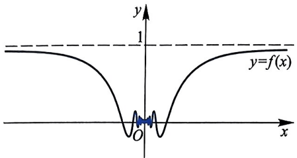
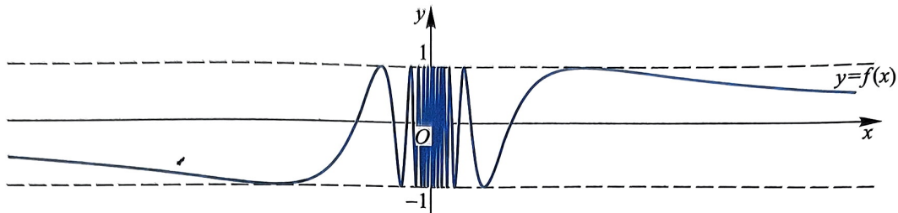
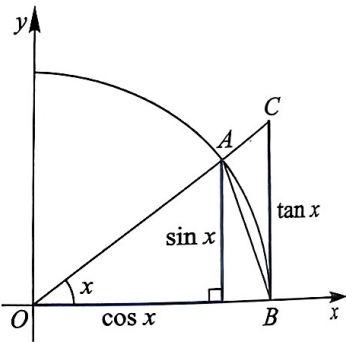

# 第2章 函数的极限与连续性

函数是微积分学研究的主要对象, 本章将在数列极限的基础上, 介绍函数的极限理论, 并讨论一类函数——连续函数的性质和特征. 这也是微积分学的重要基础.

## §2.1 函数的极限

在第1章里, 我们介绍了数列的极限, 现在我们来讨论另一种更为重要的极限, 即函数的极限, 它与数列的极限有本质的不同, 但又有非常密切的联系. 研究函数的极限, 粗略地说, 就是要讨论当自变量 $x$ 无限趋于某个值 $x_0$ (或 $|x|$ 的值越来越大)时, 对应的函数值 $f(x)$ 是否无限地趋于某个实数. 下面我们给出函数极限的严格数学定义.

**定义 2.1.1** 设 $f: D \to \mathbb{R}$, $D$ 是 $\mathbb{R}$ 的子集且包含 $x_0$ 的某去心邻域. 如果存在 $A \in \mathbb{R}$, 使得对于任意的 $\varepsilon > 0$, $\exists \delta > 0$, 当 $x \in \mathring{U}(x_0, \delta) \cap D$ 时, 有

$$
\left| f (x) - A \right| <   \varepsilon ,
$$

就称当 $x$ 趋于 $x_0$ 时, $f(x)$ 趋于 $A$, 记为

$$
\lim _ {x \to x _ {0}} f (x) = A \quad \text {或者} \quad f (x) \to A, x \to 0.
$$

此时称 $A$ 是 $f$ 在 $x_0$ 处的极限. 如果不存在满足要求的 $A$, 就称 $f$ 在 $x_0$ 处的极限不存在.

【注1】定义2.1.1中, 我们不要求 $f$ 在 $x_0$ 处有定义. 即使 $f$ 在 $x_0$ 处有定义, 极限 $A$ 也不一定与 $f(x_0)$ 相等.

**重难点讲解函数极限的定义**

【注2】定义2.1.1中，“当 $x \in \mathring{U}(x_0, \delta) \cap D$ 时”可写为“在 $D$ 内当 $0 < |x - x_0| < \delta$ 时”.

函数在某一点 $x_0$ 有极限 $A$ 的意思是: 对任意给出的一个正数 $\varepsilon$, 能够找到一个正数 $\delta$, 当 $x$ 落在 $x_0$ 的 $\delta$ 去心邻域内时, 相应的 $f(x)$ 落在 $A$ 的 $\varepsilon$ 邻域内. 所以, 一般情况 $\delta$ 随 $\varepsilon$ 的变化而变化, $\varepsilon$ 越小, $\delta$ 越小. 从函数极限的定义中也可以看出, 函数 $f$ 在 $x_0$ 处是否有极限和极限值等于多少, 只取决于 $f$

在 $x_0$ 的充分小的去心邻域内的性质, 而与 $f$ 在 $x_0$ 点和其他“远处”的值无关. 也就是说, 函数极限是函数的局部性质.

根据函数极限的定义, 容易得到: 常值函数 $f(x) = c$ 在任何一点处的极限为 $c$, 即 $\lim_{x \to \infty} c = c$.

#### 例 2.1.2 设  $f(x)=x\sin\frac{1}{x}$  (图 2.1)，证明: $\lim_{x\to0}f(x)=0$ .

证明:对任意给定的 $\varepsilon > 0$，取 $\delta = \varepsilon$。对于任意 $x \in (-\delta, \delta) - \{0\}$，即当 $0 < |x - 0| < \delta$ 时，有

$$
| f (x) - 0 | = \left| x \sin \frac {1}{x} \right| = | x | \left| \sin \frac {1}{x} \right| \leqslant | x | <   \delta = \varepsilon ,
$$

所以

$$
\varliminf_ {x \to 0} x \sin \frac {1}{x} = 0.
$$

图2.1 $f(x) = x\sin \frac{1}{x}$ 的图形

#### 例 2.1.3 设 $f(x) = \sqrt{x}, x_0 \in (0, +\infty)$，证明:$\lim_{x \to x_0} f(x) = \sqrt{x_0}$.

证明:因为 $x_0 > 0, \forall \varepsilon > 0$ ，可取 $\delta = \min \{x_0, \sqrt{x_0} \varepsilon\}$. 当 $0 < |x - x_0| < \delta$ 时，有

$$
\left| f (x) - \sqrt {x _ {0}} \right| = \left| \sqrt {x} - \sqrt {x _ {0}} \right| = \left| \frac {x - x _ {0}}{\sqrt {x} + \sqrt {x _ {0}}} \right| \leqslant \frac {\left| x - x _ {0} \right|}{\sqrt {x _ {0}}} <   \varepsilon ,
$$

所以

$$
\lim _ {x \to x _ {0}} f (x) = \lim _ {x \to x _ {0}} \sqrt {x} = \sqrt {x _ {0}}.
$$

利用函数极限的定义证明函数极限时, 就是要对任意给定的 $\varepsilon$, 找到一个满足条件的 $\delta$. 这个 $\delta$ 显然不是唯一的, 因为没有要求要找到满足条件的最大的 $\delta$, 所以一旦找到了一个 $\delta$, 那么小于这个 $\delta$ 的任何正数都是合适的. 因此, 我们在利用极限定义证明极限时, 经常先限定 $\delta$ 大小以简化计算过程, 给证明带来方便.

#### 例 2.1.4 证明: $\lim_{x\to 1}\frac{x^2 - 1}{x^2 + 2x - 3} = \frac{1}{2}.$

证明:先限定 $0 < |x - 1| < 1$，即 $0 < x < 2, x \neq 1$，则 $\forall \varepsilon > 0$，要使得

$$
\left| \frac {x ^ {2} - 1}{x ^ {2} + 2 x - 3} - \frac {1}{2} \right| = \left| \frac {x + 1}{x + 3} - \frac {1}{2} \right| = \left| \frac {x - 1}{2 (x + 3)} \right| \leqslant \frac {| x - 1 |}{6} <   \varepsilon ,
$$

52

第2章

只要 $|x - 1| < 6\varepsilon$ 即可. 因此, $\forall \varepsilon > 0$, 取 $\delta = \min \{1, 6\varepsilon\}$, 那么当 $0 < |x - 1| < \delta$ 时, 有

$$
\left| \frac {x ^ {2} - 1}{x ^ {2} + 2 x - 3} - \frac {1}{2} \right| <   \varepsilon .
$$

所以

$$
\lim _ {x \to 1} \frac {x ^ {2} - 1}{x ^ {2} + 2 x - 3} = \frac {1}{2}.
$$

**定理 2.1.5** (归结原理) 设 $f: D \subset \mathbb{R} \to \mathbb{R}, \exists \overset{\circ}{U}(x_0) \subset D$, 则 $\lim_{x \to x_0} f(x) = A$ 的充要条件是: 对于任意满足 $\lim_{n \to \infty} x_n = x_0, x_n \neq x_0, n = 1, 2, 3, \cdots$ 的数列 $\{x_n\}$. 其对应的函数值数列 $\{f(x_n)\}$ 均有 $\lim_{n \to \infty} f(x_n) = A$.

证明:(必要性) 假设 $\lim_{x\to x_0}f(x) = A, \{x_n\}$ 是收敛于 $x_0$ 的数列，且 $x_{n}\in D - \{x_{0}\}$，则 $\forall \varepsilon > 0, \exists \delta > 0$，当 $0 < |x - x_0| < \delta$ 时，有 $|f(x) - A| < \varepsilon$。因为 $\lim_{n\to \infty}x_n = x_0$ 且 $x_{n}\neq x_{0}$，所以对于上述 $\delta > 0$，存在正整数 $N$，当 $n\geqslant N$ 时，$|x_{n} - x_{0}| < \delta$。即 $0 < |x_{n} - x_{0}| < \delta$。因此 $|f(x_n) - A| < \varepsilon$，即

$$
\lim _ {n \to \infty} f (x _ {n}) = A.
$$

(充分性) 用反证法. 如果 $f(x)$ 在 $x_0$ 处不以 $A$ 为极限, 那么 $\exists \varepsilon_0 > 0, \forall \delta > 0$. 存在 $x$, 虽然 $0 < |x - x_0| < \delta$, 但是 $|f(x) - A| \geqslant \varepsilon_0$, 即

对 $\delta_1 = 1$ ，存在 $x_{1}$ 满足 $0 < |x_{1} - x_{0}| < 1$ ，使得 $|f(x_1) - A|\geqslant \varepsilon_0;$

对 $\delta_2 = \frac{1}{2}$, 存在 $x_2$ 满足 $0 < |x_2 - x_0| < \frac{1}{2}$, 使得 $|f(x_2) - A| \geqslant \varepsilon_0$;

对 $\delta_3 = \frac{1}{3}$, 存在 $x_3$ 满足 $0 < |x_3 - x_0| < \frac{1}{3}$, 使得 $|f(x_3) - A| \geqslant \varepsilon_0$;

对 $\delta_n = \frac{1}{n}$, 存在 $x_n$ 满足 $0 < |x_n - x_0| < \frac{1}{n}$, 使得 $|f(x_n) - A| \geqslant \varepsilon_0$;

这样, 我们得到数列 $\{x_{n}\}$, 显然满足 $\lim_{n\to \infty}x_n = x_0$ 且 $x_{n}\neq x_{0}$, 但数列 $\{f(x_n)\}$ 不以 $A$ 为极限, 矛盾. 充分性得证.

**定理 2.1.5** 揭示了函数极限与数列极限之间的内在联系, 将函数的极限归结为数列的极限, 因而被称为 “归结原理”. 它使得我们可以很自然地把关于数列极限的结果 “引” 到函数极限情形. 在后面研究函数极限的性质和运算时, 请读者注意和数列极限相比较, 找出它们的共同点和区别之处.

注意到定理 2.1.5 中数列  $\{x_{n}\}$  的任意性, 归结原理经常被用来证明函数在某一点  $x_{0}$  处的极限不存在:

§2.1 函数的极限

如果在 $D - \{x_0\}$ 内找到一个收敛于 $x_0$ 的数列 $\{x_n\}$ 使得 $\{f(x_n)\}$ 极限不存在, 或者找到两个收敛于 $x_0$ 的数列 $\{x_n'\}$ 和 $\{x_n''\}$ 使得 $\{f(x_n')\}$ 和 $\{f(x_n'')\}$ 收敛于不同的值, 那么 $f$ 在 $x_0$ 处的极限不存在.

#### 例 2.1.6 考察函数 $f(x) = \sin \frac{1}{x}$ 在 $x_0 = 0$ 处的极限 (图2.2).

图2.2 $f(x) = \sin \frac{1}{x}$ 的图形

解:令 $a_{n} = \frac{1}{2n\pi}, b_{n} = \frac{1}{2n\pi + \frac{\pi}{2}}$，则 $\{a_{n}\}$ 与 $\{b_{n}\}$ 都收敛于0。但是 $\{f(a_{n})\}$ 是恒等于0的常值数列，$\{f(b_{n})\}$ 是恒等于1的常值数列，即 $\{f(a_{n})\}$ 和 $\{f(b_{n})\}$ 的极限不相等。由归结原理知，$f(x)$ 在 $x_{0} = 0$ 处的极限不存在。

若函数在某点有极限, 则此函数及其极限有着和收敛数列类似的一些性质 (包括运算性质). 这些性质的证明可以参考相应的数列极限性质的证明, 或者利用归结原理.

**定理 2.1.7** (唯一性) 若函数在某点有极限, 则极限是唯一的.

**定理 2.1.8** (局部有界性) 设 $f: D \subset \mathbb{R} \to \mathbb{R}$, $\lim_{x \to x_0} f(x)$ 存在, 则 $f(x)$ 在 $x_0$ 的某去心邻域内有界, 即存在常数 $M > 0$ 及 $\delta > 0$, 当 $0 < |x - x_0| < \delta$ 时, 有 $|f(x)| < M$.

**定理 2.1.9**（局部保号性）

(1) 如果  $\lim_{x\to x_{0}}f(x)=A>0,$  那么  $\forall p\in(0,A),\exists\delta>0,\forall x\in\mathring{U}(x_{0},\delta),$  有  $f(x)>p>0;$

(2) 如果 $\lim_{x\to x_0}f(x) = A < 0$ ，那么 $\forall -p\in (A,0),\exists \delta >0,\forall x\in \mathring{U}(x_0,\delta),$ 有 $f(x) < -p < 0.$

**推论 2.1.10** (1) 设  $\lim_{x\to x_{0}}f(x)=A,\quad\lim_{x\to x_{0}}g(x)=B,A>B,$  则在  $x_{0}$  的某去心邻域内有  $f(x)>g(x);$

(2) 设在 $x_0$ 的某去心邻域内有 $f(x) > g(x)$, 且 $\lim_{x \to x_0} f(x) = A$, $\lim_{x \to x_0} g(x) = B$, 则 $A \geqslant B$.

**定理 2.1.11** (夹逼定理) 设 $f, g, h: D \subset \mathbb{R} \to \mathbb{R}$, $D$ 包含 $x_0$ 的某去心邻域 $\stackrel{\circ}{U}(x, \delta) (\delta > 0)$. 如果 $\forall x \in \stackrel{\circ}{U}(x, \delta)$, 有 $g(x) \leqslant f(x) \leqslant h(x)$, 且满足 $\lim_{x \to x_0} g(x) = \lim_{x \to x_0} h(x) = A$, 那么 $\lim_{x \to x_0} f(x) = A$.

54

第2章

**定理 2.1.12** (四则运算法则) 设 $f, g: D \subset \mathbb{R} \to \mathbb{R}$. 若 $\lim_{x \to x_0} f(x) = A$, $\lim_{x \to x_0} g(x) = B$, 则

(1) $\lim_{x\to x_0}[f(x) + g(x)] = \lim_{x\to x_0}f(x) + \lim_{x\to x_0}g(x) = A + B;$

(2) $\lim_{x\to x_0}cf(x) = c\lim_{x\to x_0}f(x) = cA,$ 其中 $c\in \mathbb{R}$ 是常数；

(3) $\lim_{x\to x_0}f(x)g(x) = \left(\lim_{x\to x_0}f(x)\right)\left(\lim_{x\to x_0}g(x)\right) = AB;$

(4) 当 $g(x) \neq 0$ 且 $B \neq 0$ 时, $\lim_{x \to x_0} \frac{f(x)}{g(x)} = \frac{\lim_{x \to x_0} f(x)}{\lim_{x \to x_0} g(x)} = \frac{A}{B}$.

我们可以利用以上的极限四则运算法则和函数极限的夹逼定理等来方便地求一些函数的极限.

#### 例 2.1.13 设  $P_{n}(x)=a_{0}+a_{1}x+a_{2}x^{2}+\cdots+a_{n}x^{n}$  是 R 上的 n 次多项式 ( $a_{n}\neq0$ ), 计算  $\lim_{x\to x_{0}}P_{n}(x)$ .

解:由运算法则(1)，(2)和(3)得

$$
\begin{array}{r l} \underset {x \to x _ {0}} {\lim} P _ {n} (x) & = \underset {x \to x _ {0}} {\lim} \left(a _ {0} + a _ {1} x + a _ {2} x ^ {2} + \dots + a _ {n} x ^ {n}\right) \\ & = \underset {x \to x _ {0}} {\lim} a _ {0} + \underset {x \to x _ {0}} {\lim} a _ {1} x + \underset {x \to x _ {0}} {\lim} a _ {2} x ^ {2} + \dots + \underset {x \to x _ {0}} {\lim} a _ {n} x ^ {n} \\ & = a _ {0} + a _ {1} \underset {x \to x _ {0}} {\lim} x + a _ {2} \left(\underset {x \to x _ {0}} {\lim} x\right) ^ {2} + \dots + a _ {n} \left(\underset {x \to x _ {0}} {\lim} x\right) ^ {n} \\ & = a _ {0} + a _ {1} x _ {0} + a _ {2} x _ {0} ^ {2} + \dots + a _ {n} x _ {0} ^ {n} = P _ {n} (x _ {0}). \end{array}
$$

两个多项式相除的函数称为有理函数, 由除法法则, 对于有理函数

$$
R (x) = \frac {P _ {n} (x)}{Q _ {m} (x)} = \frac {a _ {n} x ^ {n} + a _ {n - 1} x ^ {n - 1} + \cdots + a _ {1} x + a _ {0}}{b _ {m} x ^ {m} + b _ {m - 1} x ^ {m - 1} + \cdots + b _ {1} x + b _ {0}} (a _ {n} \neq 0, b _ {m} \neq 0),
$$

容易得到以下极限: 对任何一点  $x_{0}$ ，有

$$
\lim _ {x \to x _ {0}} R (x) = \frac {\lim _ {x \to x _ {0}} P _ {n} (x)}{\lim _ {x \to x _ {0}} Q _ {m} (x)} = \frac {P _ {n} (x _ {0})}{Q _ {m} (x _ {0})} = R (x _ {0}), \text {其中} Q _ {m} (x _ {0}) \neq 0.
$$

#### 例 2.1.14 求 $\lim_{x\to 1}\left(\frac{1}{x - 1} -\frac{3}{x^3 - 1}\right)$

解: 因为当 $x \neq 1$ 时, 有

$$
\begin{array}{r l} \frac {1}{x - 1} - \frac {3}{x ^ {3} - 1} & = \frac {1}{x - 1} - \frac {3}{(x - 1) (x ^ {2} + x + 1)} \\ & = \frac {x ^ {2} + x - 2}{(x - 1) (x ^ {2} + x + 1)} \end{array}
$$

§2.1 函数的极限

$$
\begin{array}{l} = \frac {(x - 1) (x + 2)}{(x - 1) (x ^ {2} + x + 1)} \\ = \frac {x + 2}{x ^ {2} + x + 1}, \end{array}
$$

所以

$$
\lim _ {x \to 1} \left(\frac {1}{x - 1} - \frac {1}{x ^ {3} - 1}\right) = \lim _ {x \to 1} \frac {x + 2}{x ^ {2} + x + 1} = \frac {\lim _ {x \to 1} (x + 2)}{\lim _ {x \to 1} (x ^ {2} + x + 1)} = 1.
$$

#### 例 2.1.15 证明:(1) $\lim_{x\to 0}\sin x = 0,\lim_{x\to 0}\cos x = 1;$ (2) $\lim_{x\to 0}\frac{\sin x}{x} = 1.$

证明: 在图 2.3 所示的四分之一的单位圆中, 设 $\angle AOB$ 的弧度值为 $x, 0 < x < \frac{\pi}{2}$. 由于

$\triangle OAB$ 的面积 $<$ 扇形 $OAB$ 的面积 $< \triangle OBC$ 的面积,

故当 $x \in \left(0, \frac{\pi}{2}\right)$ 时, 有 $\sin x < x < \tan x$. 而当 $x \in \left(-\frac{\pi}{2}, 0\right)$ 时, $\tan x < x < \sin x$. 因此当 $x \in \left(-\frac{\pi}{2}, \frac{\pi}{2}\right)$ 时, $|\sin x| \leqslant |x|$.

(1) 事实上, 对于任何 $x \in \mathbb{R}$, 不等式 $|\sin x| \leqslant |x|$ 都成立. 因为当 $|x| \geqslant \frac{\pi}{2}$ 时, $|\sin x| \leqslant |x|$ 显然成立. 因此, 由函数极限的夹逼定理可得 $\lim_{x \to 0} \sin x = 0$.

图2.3

又因为 $|\cos x - 1| = 2\sin^2{\frac{x}{2}} \leqslant{\frac{1}{2}}x^2$，即 $-\frac{1}{2}x^2 \leqslant \cos x - 1 \leqslant {\frac{1}{2}}x^2$，由函数极限的夹逼定理得 $\lim_{x \to 0} (\cos x - 1) = 0$，即 $\lim_{x \to 0} \cos x = 1$.

(2) 当 $x \in \left(-\frac{\pi}{2}, \frac{\pi}{2}\right) - \{0\}$ 时, $1 < \frac{x}{\sin x} < \frac{1}{\cos x}$, 即 $1 > \frac{\sin x}{x} > \cos x$, 由函数极限的夹逼定理可得 $\lim_{x \to 0} \frac{\sin x}{x} = 1$.

以后我们经常利用极限 $\lim_{x\to 0}\frac{\sin x}{x} = 1$ 来计算其他相关极限，例如

$$
\begin{array}{c} \lim _ {x \to 0} \frac {1 - \cos x}{x ^ {2}} = \lim _ {x \to 0} \frac {2 \sin^ {2} \frac {x}{2}}{x ^ {2}} = \frac {1}{2} \lim _ {x \to 0} \left(\frac {\sin \frac {x}{2}}{\frac {x}{2}}\right) ^ {2} \\ = \frac {1}{2} \left(\lim _ {x \to 0} \frac {\sin \frac {x}{2}}{\frac {x}{2}}\right) ^ {2} = \frac {1}{2}. \end{array}
$$

56

第2章

在 $\lim_{x\to x_0}f(x) = A$ 的定义中，$x$ 可以按任意的方式趋于 $x_0$。但有时候，$f$ 只在 $x_0$ 的一侧 (左侧或者右侧) 有定义，或者需要分别研究 $f$ 在 $x_0$ 两侧的状态。因此有必要引入单侧极限的概念。

**定义 2.1.16** 设 $f: D \subset \mathbb{R} \to \mathbb{R}, A \in \mathbb{R}$.

(1) 若 $\forall \varepsilon > 0, \exists \delta > 0$, 当 $-\delta < x - x_0 < 0$, 即 $x \in (x_0 - \delta, x_0)$ 时, 有

$$
| f (x) - A | <   \varepsilon ,
$$

则称 $f$ 在 $x_0$ 处有左极限, $A$ 是 $f$ 在 $x_0$ 处的左极限, 记为 $\lim_{x\to x_0^-}f(x) = A$;

(2) 若 $\forall \varepsilon > 0, \exists \delta > 0$, 当 $0 < x - x_0 < \delta$, 即 $x \in (x_0, x_0 + \delta)$ 时, 有

$$
| f (x) - A | <   \varepsilon ,
$$

则称 $f$ 在 $x_0$ 处有右极限, $A$ 是 $f$ 在 $x_0$ 处的右极限, 记为 $\lim_{x\to x_0^+}f(x) = A$.

$f(x)$ 在 $x_0$ 处的左、右极限有时也分别记为 $f(x_0 - 0), f(x_0 + 0)$ 或 $f_{-}(x_0), f_{+}(x_0)$. 由函数极限的定义, 容易证明

$f$ 在 $x_0$ 处有极限当且仅当 $f$ 在 $x_0$ 处的左、右极限都存在并且相等，即

$$
\varliminf_ {x \to x _ {0}} f (x) = A \Leftrightarrow \lim _ {x \to x _ {0} ^ {-}} f (x) = \lim _ {x \to x _ {0} ^ {+}} f (x) = A.
$$

#### 例 2.1.17 设 $f:\mathbb{R}-\{0\}\to\mathbb{R}, f(x)=\frac{x}{|x|}$, 分析 $f$ 在 $x_0=0$ 处的极限.

解:当 $x < 0$ 时，$|x| = -x$。此时，$f(x) = -1$，$\lim_{x \to 0^-} f(x) = -1$。

当 $x > 0$ 时, $|x| = x$. 此时, $f(x) = 1$, $\lim_{x \to 0^{+}} f(x) = 1$.

$f$ 在 $x_0 = 0$ 处的左、右极限都存在但不相等, 所以 $f$ 在 $x_0 = 0$ 处没有极限.

以上我们讨论的是当 $x$ 无限趋于某个实数 $x_0$ 时函数的极限情况, 下面我们引入函数极限过程的其他形式. 当 $x$ 在一个无穷区间, 例如 $(a, +\infty)$ 内向 $+\infty$ 变化时, 我们也可以定义相应的极限概念, 等等.

**定义 2.1.18** 设 $f: D \subset \mathbb{R} \to \mathbb{R}, A \in \mathbb{R}, a \in \mathbb{R}$.

(1) 若 $D \supset (a, +\infty)$, $\forall \varepsilon > 0$, $\exists M > 0$, 当 $x > M$ 时, 有

$$
| f (x) - A | <   \varepsilon ,
$$

则称 $A$ 是 $f$ 当 $x$ 趋于 $+\infty$ 时的极限, 记为 $\lim_{x\to +\infty}f(x) = A$;

(2) 若 $D \supset (-\infty, a), \forall \varepsilon > 0, \exists M > 0$, 当 $x < -M$ 时, 有

$$
| f (x) - A | <   \varepsilon ,
$$

则称 $A$ 是 $f$ 当 $x$ 趋于 $-\infty$ 时的极限, 记为 $\lim_{x\to -\infty}f(x) = A$;

57

§2.1 函数的极限

(3) 若 $D \supset (-\infty, -a) \cup (a, +\infty)(a > 0), \forall \varepsilon > 0, \exists M > 0,$ 当 $|x| > M$ 时，

$$
\left| f (x) - A \right| <   \varepsilon ,
$$

则称 $A$ 是 $f$ 当 $x$ 趋于 $\infty$ 时的极限, 记为 $\lim_{x\to \infty}f(x) = A$.

显然， $\lim_{x\to \infty}f(x) = A\Leftrightarrow \lim_{x\to +\infty}f(x) = \lim_{x\to -\infty}f(x) = A.$

请读者自行完成当 $x \to \infty (x \to +\infty, x \to -\infty)$ 时的极限性质（唯一性、局部有界性、局部保号性和夹逼定理）及极限四则运算法则的叙述和证明.

#### 例 2.1.19 证明: $\lim_{x\to +\infty}\arctan x = \frac{\pi}{2},\lim_{x\to -\infty}\arctan x = -\frac{\pi}{2}.$

证明: $\forall \varepsilon > 0$, 不妨设 $0 < \varepsilon < \frac{\pi}{2}$, 取 $M = \tan \left(\frac{\pi}{2} - \varepsilon\right) > 0$. 由于 $\arctan x$ 是严格单调增加且以 $\frac{\pi}{2}$ 为上界的函数, 故当 $x > M$ 时, $\arctan x > \arctan M = \frac{\pi}{2} - \varepsilon$, 即有 $\left|\arctan x - \frac{\pi}{2}\right| = \frac{\pi}{2} - \arctan x < \varepsilon$. 所以

$$
\varliminf_ {x \to + \infty} \arctan x = \frac {\pi}{2}.
$$

由于 $\arctan x$ 是奇函数, 故

$$
\begin{array}{c} \lim _ {x \to - \infty} \arctan x = \lim _ {x \to - \infty} [ - \arctan (- x) ] = \lim _ {t \to + \infty} (- \arctan t) \\ = - \lim _ {t \to + \infty} \arctan t = - \frac {\pi}{2}. \end{array}
$$

我们可以用 $x = \frac{1}{t}$ 将无穷处的极限转化为在 $x_0 = 0$ 处的极限:

$$
\lim _ {x \to + \infty} f (x) = A \Leftrightarrow \lim _ {t \to 0 ^ {+}} f \left(\frac {1}{t}\right) = A,
$$

$$
\lim _ {x \to - \infty} f (x) = A \Leftrightarrow \lim _ {t \to 0 ^ {-}} f \left(\frac {1}{t}\right) = A,
$$

$$
\lim _ {x \to \infty} f (x) = A \Leftrightarrow \lim _ {t \to 0} f \left(\frac {1}{t}\right) = A.
$$

这样有时会给计算某些极限带来方便.

函数的极限与连续性

#### 例 2.1.20 求 $\lim_{x\to \infty}\frac{\sin x}{x}.$

解: 我们将上面极限化为 $\lim_{t\to 0}t\sin \frac{1}{t}$. 由例2.1.2知 $\lim_{x\to \infty}\frac{\sin x}{x} = 0$.

我们曾用数列极限定义了 $\mathrm{e} = \lim_{n\to \infty}\left(1 + \frac{1}{n}\right)^n$ .现在我们证明 $\mathbf{e}$ 也可以用

58

函数的极限来定义.

#### 例 2.1.21 证明: $\mathrm{e} = \lim_{x\to \infty}\left(1 + \frac{1}{x}\right)^x$

证明:我们要证明 $\lim_{x\to +\infty}\left(1 + \frac{1}{x}\right)^x = \mathrm{e},\lim_{x\to -\infty}\left(1 + \frac{1}{x}\right)^x = \mathrm{e}.$

(a) 利用归结原理和夹逼定理. 设 $\{x_k\}$ 是任何一个趋于 $+\infty$ 的数列, 不妨设 $x_k > 1$. 对于每一个 $k$, 存在唯一的正整数 $n_k$, 使得 $n_k \leqslant x_k < n_k + 1$, 则 $\{n_k\}$ 趋于 $+\infty$, 因此

$$
\left(1 + \frac {1}{n _ {k} + 1}\right) ^ {n _ {k}} <   \left(1 + \frac {1}{x _ {k}}\right) ^ {x _ {k}} <   \left(1 + \frac {1}{n _ {k}}\right) ^ {n _ {k} + 1},
$$

$$
\left(1 + \frac {1}{n _ {k} + 1}\right) ^ {n _ {k} + 1} \left(1 + \frac {1}{n _ {k} + 1}\right) ^ {- 1} <   \left(1 + \frac {1}{x _ {k}}\right) ^ {x _ {k}} <   \left(1 + \frac {1}{n _ {k}}\right) ^ {n _ {k}} \left(1 + \frac {1}{n _ {k}}\right).
$$

因为 $\mathrm{e} = \lim_{n\to \infty}\left(1 + \frac{1}{n}\right)^n$ ，在上式中令 $k\to \infty$ ，有 $\lim_{k\to \infty}\left(1 + \frac{1}{x_k}\right)^{x_k} = \mathrm{e}$ 根据归结原理，

$$
\lim _ {x \to + \infty} \left(1 + \frac {1}{x}\right) ^ {x} = \mathrm{e}.
$$

(b) 令 $t = -x$, 当 $x \to -\infty$ 时, 有 $t \to +\infty$, 所以

$$
\begin{array}{r l} \underset {x \to - \infty} {\lim} \left(1 + \frac {1}{x}\right) ^ {x} & = \underset {t \to + \infty} {\lim} \left(1 - \frac {1}{t}\right) ^ {- t} = \underset {t \to + \infty} {\lim} \left(\frac {t}{t - 1}\right) ^ {t} \\ & = \underset {t \to + \infty} {\lim} \left(1 + \frac {1}{t - 1}\right) ^ {t - 1} \cdot \underset {t \to + \infty} {\lim} \left(1 + \frac {1}{t - 1}\right) = \mathrm{e}. \end{array}
$$

综上所述, $\mathrm{e}=\lim_{x\to\infty}\left(1+\frac{1}{x}\right)^{x}$

显然, 此极限又有形式 $\lim_{x\to 0}(1 + x)^{\frac{1}{x}} = \mathrm{e}$. 我们也常常利用这个极限来计算某些特殊类型函数的极限.

#### 例 2.1.22 求 $\lim_{x\to 0}\left(\frac{1 + 3x}{1 - 4x}\right)^{\frac{1}{x}}.$

解: $\lim_{x\to 0}\left(\frac{1 + 3x}{1 - 4x}\right)^{\frac{1}{x}} = \lim_{x\to 0}\left(1 + \frac{7x}{1 - 4x}\right)^{\frac{1}{x}}$ ，令 $t = \frac{7x}{1 - 4x}\rightarrow 0,$ 有

$$
\lim _ {x \to 0} \left(\frac {1 + 3 x}{1 - 4 x}\right) ^ {\frac {1}{x}} = \lim _ {t \to 0} (1 + t) ^ {\frac {7 + 4 t}{t}} = \left[ \lim _ {t \to 0} (1 + t) ^ {\frac {1}{t}} \right] ^ {7} \cdot \lim _ {t \to 0} (1 + t) ^ {4} = \mathrm{e} ^ {7}.
$$

§2.2 连续函数

连续性是函数的一个重要性质, 连续函数是微积分中的重要研究对象. 函数连续性源自对函数图像的直观认识, 如 $f(x) = x^2$ 的图像是一条抛物线, 图

§2.2 连续函数

像上的点“连接”在一起而没有“间断”，形成直观上“连续”的一条曲线；而取整函数 $f(x) = [x]$ 在整数点处出现了“间断”，直观上“不连续”。下面我们给出函数连续的严格定义。

**定义 2.2.1** 设 $f: D \subset \mathbb{R} \to \mathbb{R}, D$ 包含 $x_0$ 的某个邻域. 如果

$$
\lim _ {x \to x _ {0}} f (x) = f \left(x _ {0}\right),
$$

就称 f 在  $x_{0}$  处连续.

$f$ 在 $x_0$ 处连续也可以用“$\varepsilon - \delta$”语言表述如下:

$\forall \varepsilon > 0, \exists \delta > 0,$ 当 $|x - x_0| < \delta$ 时, 有 $|f(x) - f(x_0)| < \varepsilon$.

在例 2.1.3 中, 我们证明了  $\lim_{x\to x_{0}}\sqrt{x}=\sqrt{x_{0}}$ , 所以  $f(x)=\sqrt{x}$  在任意点  $x_{0}(x_{0}>0)$  处连续. 设开区间  $I=(a,b)$  或者  $(a,+\infty)$  或者  $(-∞,b)$ , 那么有以下函数在开区间 I 上连续的定义.

**定义 2.2.2** 设 $f$ 在开区间 $I$ 上有定义且在 $I$ 内的每一点都连续, 则称 $f$ 是开区间 $I$ 内的连续函数.

#### 例 2.2.3 证明函数 $f(x) = \frac{1}{x}$ 在区间 $(0, +\infty)$ 内连续.

极限与连续问题

证明:因为对于 $(0, +\infty)$ 内的任何一点 $x_0$ ，有

$$
\varliminf_ {x \to x _ {0}} f (x) = \frac {1}{\lim _ {x \to x _ {0}} x} = \frac {1}{x _ {0}} = f \left(x _ {0}\right),
$$

所以函数 $f$ 在 $x_0$ 处连续. 因此 $f = \frac{1}{x}$ 是 $(0, +\infty)$ 内的连续函数.

#### 例 2.2.4 证明函数 $f(x) = \sin x$ 在 $\mathbb{R}$ 上连续.

证明:对于任意 $x_0 \in \mathbb{R}$, 因为

$$
\left| \sin x - \sin x _ {0} \right| = 2 \left| \cos \frac {x + x _ {0}}{2} \sin \frac {x - x _ {0}}{2} \right| \leqslant 2 \cdot 1 \cdot \frac {\left| x - x _ {0} \right|}{2} = \left| x - x _ {0} \right|,
$$

所以, $\forall \varepsilon > 0$, 取 $\delta = \varepsilon$, 当 $|x - x_0| < \delta = \varepsilon$ 时, 有

$$
| f (x) - f \left(x _ {0}\right) | = | \sin x - \sin x _ {0} | \leqslant | x - x _ {0} | <   \delta = \varepsilon ,
$$

因此函数 $f(x) = \sin x$ 在 $\mathbb{R}$ 上连续.

#### 例 2.2.5 证明函数  $f(x)=\ln x$  在定义域  $(0,+\infty)$  内连续.

证明:我们首先证明: $\lim_{t\to 1}\ln t = 0.$

$\forall \varepsilon > 0,$ 取 $\delta = \min \left\{\mathrm{e}^{\varepsilon} - 1,1 - \mathrm{e}^{-\varepsilon}\right\}$, 当 $|t - 1| < \delta$ 且 $t > 0$ 时,

$$
\mathrm{e} ^ {- \varepsilon} - 1 \leqslant - \delta <   t - 1 <   \delta \leqslant \mathrm{e} ^ {\varepsilon} - 1.
$$

60

第2章

因此, $-\varepsilon < \ln t < \varepsilon$, $|\ln t| < \varepsilon$, 从而 $\lim_{t \to 1} \ln t = 0$.

对于任何 $x_0 \in (0, +\infty)$, $\ln x = \ln \frac{x}{x_0} + \ln x_0$, 有

$$
\lim _ {x \to x _ {0}} \ln x = \lim _ {x \to x _ {0}} \left(\ln \frac {x}{x _ {0}} + \ln x _ {0}\right) = \lim _ {t \to 1} \ln t + \ln x _ {0} = \ln x _ {0},
$$

所以函数 $f(x) = \ln x$ 在定义域 $(0, +\infty)$ 内连续.

因为函数在某点连续, 即为在此点函数的极限等于函数值, 所以由极限的四则运算法则即可得连续函数经四则运算后所得函数的连续性.

**定理 2.2.6** 设函数 f 和 g 在  $x_{0}$  处连续, 则  $f \pm g$  和  $f \cdot g$  在  $x_{0}$  处连续. 如果再设  $g(x_{0}) \neq 0$ , 那么  $\frac{f}{g}$  在  $x_{0}$  处连续.

**定理 2.2.7** (复合函数的连续性) 设  $y = f(x)$  在  $x_{0}$  处连续,  $y_{0} = f(x_{0})$ ,  $z = g(y)$  在  $y_{0}$  处连续, 则复合函数  $z = g(f(x))$  在  $x_{0}$  处连续.

证明: 我们利用 $\varepsilon - \delta$ 语言证明而将定义域略去. 由于 $z = g(y)$ 在 $y_0$ 处连续, 故 $\forall \varepsilon > 0, \exists \delta > 0$, 当 $|y - y_0| < \delta$ 时, 有

$$
\overline {{| g (y) - g (y _ {0}) |}} <   \varepsilon .
$$

对于上述 $\delta$, 由 $y = f(x)$ 在 $x_0$ 处连续知, $\exists \eta > 0$, 当 $|x - x_0| < \eta$ 时,

$$
| f (x) - f \left(x _ {0}\right) | <   \delta ,
$$

即 $|y - y_0| < \delta$. 因此, $\forall \varepsilon > 0, \exists \eta > 0$, 当 $|x - x_0| < \eta$ 时, $|g(f(x)) - g(f(x_0))| < \varepsilon$. 所以, 复合函数 $z = g(f(x))$ 在 $x_0$ 处连续.

为了定义和讨论函数在闭区间上的连续性,我们需要引入单侧连续的概念.

**定义 2.2.8** 如果  $\lim_{x\to x_{0}^{+}}f(x)=f(x_{0})$ ，就称  $f(x)$  在  $x_{0}$  处右连续；如果  $\lim_{x\to x_{0}^{-}}f(x)=f(x_{0})$ ，就称  $f(x)$  在  $x_{0}$  处左连续.

从定义中易知, 当函数在某点的某邻域内有定义时, 函数在此点连续当且仅当函数在此点既左连续亦右连续.

**定义 2.2.9** 设 $f: [a, b] \to \mathbb{R} (a < b)$. 如果 $f$ 在开区间 $(a, b)$ 内连续, 在 $a$ 处右连续, 在 $b$ 处左连续, 就称 $f$ 在闭区间 $[a, b]$ 上连续.

同理可以定义函数在半开半闭区间上连续. 有限闭区间上的连续函数具有非常好的性质, 我们将随后给予介绍.

**定理 2.2.10** (反函数的连续性) 设  $I \subset R$  是一个区间,  $f : I \to R$  是严格单调增加 (或者减少) 的连续函数, 则其反函数  $f^{-1} : f(I) \to I$  是严格单调增加 (或者减少) 的连续函数.

可以证明, 所有基本初等函数在其定义域内是连续的, 而初等函数是由以上基本初等函数经过有限次四则运算及复合运算而得, 所以由上述定理有下面结果.

§2.2 连续函数

**定理 2.2.11** 初等函数在定义区间内是连续函数.

按照函数连续的定义, $f$ 在 $x_0$ 处连续必须满足下面三个条件:

(1) 函数 $f$ 在 $x_0$ 处有定义, 即 $f(x_0)$ 取有限值;

(2) 函数 $f$ 在 $x_0$ 处有左极限, 且 $\lim_{x \to x_0^-} f(x) = f(x_0)$;

(3) 函数 $f$ 在 $x_0$ 处有右极限, 且 $\lim_{x \to x_0^+} f(x) = f(x_0)$.

否则, 称 $x_0$ 是 $f$ 的不连续点或间断点. 对照上述三个条件, 我们可以对间断点进行分类.

**定义 2.2.12** (1) 如果左极限  $\lim_{x\to x_{0}^{-}}f(x)$  和右极限  $\lim_{x\to x_{0}^{+}}f(x)$  都存在但 f 在  $x_{0}$  处不连续, 就称  $x_{0}$  是 f 的第一类间断点. 特别地, 如果左极限  $\lim_{x\to x_{0}^{-}}f(x)$  和右极限  $\lim_{x\to x_{0}^{+}}f(x)$  都存在但不相等, 就称  $x_{0}$  是 f 的跳跃间断点; 如果极限  $\lim_{x\to x_{0}}f(x)$  存在, 但极限值不等于  $f(x_{0})$  或者 f 在  $x_{0}$  处没有定义, 就称  $x_{0}$  是 f 的可去间断点;

(2) 如果 $f$ 在 $x_0$ 处的左极限和右极限至少有一个不存在, 就称 $x_0$ 是 $f$ 的第二类间断点.

例如, 函数 $f(x) = x \sin \frac{1}{x}$, 由于 $\lim_{x \to 0} f(x) = 0$, 但 $f$ 在 $x = 0$ 处没有定义, 故 $x = 0$ 是 $f$ 的可去间断点; 对符号函数 $\operatorname{sgn}(x) = \begin{cases} 1, & x > 0, \\ 0, & x = 0, \\ -1, & x < 0, \end{cases}$ 因为 $\lim_{x \to 0^-} \operatorname{sgn}(x) = -1, \lim_{x \to 0^+} \operatorname{sgn}(x) = 1$, 左极限和右极限都存在但不相等, 所以 $x = 0$ 是其跳跃间断点; 而函数 $g(x) = \sin \frac{1}{x}$, 因为 $\lim_{x \to 0} \sin \frac{1}{x}$ 不存在, 所以 $x = 0$ 是 $g$ 的第二类间断点.

#### 例 2.2.13 分析下列函数的间断点及其类型:

(1) $f(x) = \frac{\mathrm{e}^{\frac{1}{x}} - 1}{\mathrm{e}^{\frac{1}{x}} + 1}$; (2) $f(x) = \lim_{n\to +\infty}\frac{x^{2n - 1} + x^2 - 2x}{x^{2n} + 1}$.

解:(1) 因为初等函数在定义域内为连续函数, 所以只要考虑 $x = 0$ 处即可. 易知 $\lim_{x \to 0^{-}} e^{\frac{1}{x}} = 0$, 有

$$
\lim _ {x \to 0 ^ {-}} f (x) = \lim _ {x \to 0 ^ {-}} \frac {\mathrm{e} ^ {\frac {1}{x}} - 1}{\mathrm{e} ^ {\frac {1}{x}} + 1} = - 1, \quad \lim _ {x \to 0 ^ {+}} f (x) = \lim _ {x \to 0 ^ {+}} \frac {1 - \mathrm{e} ^ {\frac {1}{- x}}}{1 + \mathrm{e} ^ {\frac {1}{- x}}} = 1,
$$

因此 x = 0 为跳跃间断点.

62

函数的极限与连续性

(2) 因为

$$
f (x) = \lim _ {n \to + \infty} \frac {x ^ {2 n - 1} + x ^ {2} - 2 x}{x ^ {2 n} + 1} = \left\{ \begin{array}{l l} \frac {1}{x}, & | x | > 1, \\ x ^ {2} - 2 x, & | x | <   1, \\ 1, & x = - 1, \\ 0, & x = 1, \end{array} \right.
$$

所以 $\lim_{x\to (-1)^{-}}f(x) = -1,\lim_{x\to (-1)^{+}}f(x) = 3;\lim_{x\to 1^{-}}f(x) = -1,\lim_{x\to 1^{+}}f(x) = 1.$ 故$x = -1,x = 1$ 皆为跳跃间断点.

## \* 函数的一致连续性

前面我们所说的函数在某区间上连续, 指的是函数在此区间上每一点都连续, 也即对任意一点 $x_0, \forall \varepsilon > 0, \exists \delta > 0$, 当 $|x - x_0| < \delta$ 时, $|f(x) - f(x_0)| < \varepsilon$. 一般地, 对不同的点 $x_0$, 对给定的同一个 $\varepsilon, \delta$ 是不相同的. 也可以说, $\delta$ 一般是随着 $x_0$ 和 $\varepsilon$ 的变化而变化的. 我们还知道, $\delta$ 一旦找到, 比它小的正数都是合适的, 那么对某个区间上的所有点, 对任意给定的 $\varepsilon$, 能否找到一个共同的合适的 $\delta$ 呢? 要回答这个问题, 我们就要介绍所谓一致连续的概念.

**定义 2.2.14** 设函数 $f: I \to \mathbb{R}$, 如果 $\forall \varepsilon > 0, \exists \delta > 0$, 使得 $\forall x_1, x_2 \in I$, 当 $|x_1 - x_2| < \delta$ 时, 都有 $|f(x_1) - f(x_2)| < \varepsilon$, 就称函数 $f$ 在区间 $I$ 上是一致连续的.

从一致连续的定义可以看出, 若 $f$ 在区间 $I$ 上一致连续, 则 $f$ 在区间 $I$ 上一定是连续的, 而反之不然.

#### 例 2.2.15 证明函数 $f(x) = \sqrt{x}$ 在 $[0, +\infty)$ 上是一致连续的.

证明:对任何 $x_{2} \geqslant x_{1} \geqslant 0$ ，有 $x_{2} \geqslant |x_{2} - x_{1}|$，因此

$$
\sqrt {x _ {1}} + \sqrt {x _ {2}} \geqslant \sqrt {x _ {2}} \geqslant \sqrt {| x _ {2} - x _ {1} |}.
$$

于是当 $x_{2} \neq x_{1}$ 时, 有

$$
| \sqrt {x _ {1}} - \sqrt {x _ {2}} | = \frac {| x _ {2} - x _ {1} |}{\sqrt {x _ {1}} + \sqrt {x _ {2}}} \leqslant \frac {| x _ {2} - x _ {1} |}{\sqrt {| x _ {2} - x _ {1} |}} = \sqrt {| x _ {2} - x _ {1} |}.
$$

所以 $\forall \varepsilon > 0$, 取 $\delta = \varepsilon^2, \forall x_1, x_2 \in [0, +\infty)$, 当 $|x_2 - x_1| < \delta$ 时, 有

$$
| \sqrt {x _ {1}} - \sqrt {x _ {2}} | \leqslant \sqrt {| x _ {2} - x _ {1} |} <   \sqrt {\delta} = \varepsilon .
$$

这就证明了 $f(x) = \sqrt{x}$ 在 $[0, +\infty)$ 上是一致连续的.

#### 例 2.2.16 证明函数  $y = \sin x$  和  $y = \cos x$  在 R 上是一致连续的.

证明:因为对任何 $x_{1}, x_{2}$，有以下不等式成立:

$$
\left| \sin x _ {1} - \sin x _ {2} \right| = \left| 2 \cos \frac {x _ {1} + x _ {2}}{2} \sin \frac {x _ {1} - x _ {2}}{2} \right| \leqslant \left| x _ {1} - x _ {2} \right|,
$$

§2.2 连续函数

$$
\left| \cos x _ {1} - \cos x _ {2} \right| = \left| - 2 \sin \frac {x _ {1} + x _ {2}}{2} \sin \frac {x _ {1} - x _ {2}}{2} \right| \leqslant \left| x _ {1} - x _ {2} \right|,
$$

于是 $\forall \varepsilon > 0$, 取 $\delta = \varepsilon, \forall x_1, x_2 \in \mathbb{R}$, 当 $|x_2 - x_1| < \delta$ 时, 有

$$
\left| \sin x _ {1} - \sin x _ {2} \right| \leqslant \left| x _ {1} - x _ {2} \right| <   \delta = \varepsilon , \quad \left| \cos x _ {1} - \cos x _ {2} \right| \leqslant \left| x _ {1} - x _ {2} \right| <   \delta = \varepsilon.
$$

因此, 函数 $y = \sin x$ 和 $y = \cos x$ 在 $\mathbb{R}$ 上都是一致连续的.

由函数一致连续的定义, 我们可以写出函数 $f(x)$ 在区间 $I$ 上不一致连续的精确描述:

$\exists \varepsilon_0 > 0, \forall \delta > 0,$ 都可以找到两点 $x_{1}, x_{2} \in I,$ 满足 $|x_{1} - x_{2}| < \delta,$ 但是 $|f(x_{1}) - f(x_{2})| \geqslant \varepsilon_{0}$.

为了使判断函数不一致连续比较容易一点, 以下给出一个和上述等价的函数不一致连续的描述:

$\exists \varepsilon_0 > 0,$ 对每一个 $n\in \mathbb{N}_{+}$ ，都可以找到两点 $a_{n},b_{n}\in I$ ，虽然有 $|a_n - b_n| < \frac{1}{n}$ ，但是 $|f(a_n) - f(b_n)|\geqslant \varepsilon_0.$

#### 例 2.2.17 证明: 在区间  $[0, +\infty)$  上,

(1) 函数 $f(x) = x$ 一致连续; (2) 函数 $f(x) = x^2$ 不一致连续.

证明:(1) 的证明比较简单, 只要取 $\delta = \varepsilon$ 即可.

(2) 取 $\varepsilon_0 = 1$, 对任何 $n \in \mathbb{N}_+$, 在 $[0, +\infty)$ 上取两点:

$$
a _ {n} = n, \quad b _ {n} = n + \frac {1}{2 n},
$$

此时 $|a_{n} - b_{n}| = \left|n - \left(n + \frac{1}{2n}\right)\right| = \frac{1}{2n} < \frac{1}{n}$, 但是

$$
\boxed {| f (a _ {n}) - f (b _ {n}) | = \left| a _ {n} ^ {2} - b _ {n} ^ {2} \right| = 1 + \frac {1}{4 n ^ {2}} > 1 = \varepsilon_ {0}.}
$$

所以 $f(x) = x^{2}$ 在 $[0, +\infty)$ 上不一致连续.

#### 例 2.2.18 证明函数 $f(x) = \frac{1}{x}$

(1) 在区间 $(0, +\infty)$ 内不一致连续;

(2) 在区间 $[\sigma, +\infty)$ 上一致连续, 其中 $\sigma > 0$ 为常数.

证明:(1) 取 $\varepsilon_0 = 1$，对任何 $n \in \mathbb{N}_+$，在 $(0, +\infty)$ 内取两点:

$$
a _ {n} = \frac {1}{n}, \quad b _ {n} = \frac {1}{n + 2},
$$

此时 $|a_{n} - b_{n}| = \left|\frac{1}{n} -\frac{1}{n + 2}\right| = \frac{2}{n^{2} + 2n} <  \frac{1}{n},$ 但是

$$
| f (a _ {n}) - f (b _ {n}) | = | n - (n + 2) | = 2 > 1 = \varepsilon_ {0}.
$$

64

第2章

所以 $f(x) = \frac{1}{x}$ 在 $(0, +\infty)$ 内不一致连续.

(2) 任取 $x_{1}, x_{2} \in [\sigma, +\infty)$, 有

$$
| f (x _ {1}) - f (x _ {2}) | = \left| \frac {1}{x _ {1}} - \frac {1}{x _ {2}} \right| = \frac {| x _ {1} - x _ {2} |}{x _ {1} x _ {2}} \leqslant \frac {1}{\sigma^ {2}} | x _ {1} - x _ {2} |.
$$

所以 $\forall \varepsilon > 0$, 取 $\delta = \sigma^2\varepsilon, \forall x_1, x_2 \in [\sigma, +\infty)$, 当 $|x_1 - x_2| < \delta$ 时, 有

$$
| f (x _ {1}) - f (x _ {2}) | \leqslant \frac {1}{\sigma^ {2}} | x _ {1} - x _ {2} | <   \frac {1}{\sigma^ {2}} \delta = \varepsilon .
$$

因此 $f(x) = \frac{1}{x}$ 在区间 $[\sigma, +\infty)$ 上一致连续.

对于有限闭区间上的连续函数, 我们有以下重要的康托尔定理, 定理的证明省略, 读者可以参考一般的数学分析教材.

**定理 2.2.19** (康托尔定理) 设函数  $f(x)$  在有限闭区间  $[a, b]$  上连续，则  $f(x)$  在  $[a, b]$  上一致连续.

## §2.3 无穷小和无穷大

**定义 2.3.1** 如果  $\lim_{x\to x_{0}}f(x)=0$ ，就称  $f(x)$  是当  $x\to x_{0}$  时的无穷小量，简称无穷小.

**重难点讲解无穷小量**

显然, 当 $\lim_{x\to x_0}f(x) = A$ 时, $g(x) = f(x) - A$ 是当 $x\to x_0$ 时的无穷小.

**定义 2.3.2** 如果  $\frac{1}{f(x)}$  有定义, 并且当  $x \rightarrow x_{0}$  是无穷小, 就称  $f(x)$  是当  $x \rightarrow x_{0}$  时的无穷大量, 简称无穷大.

从以上定义可知, 无穷小和无穷大互为倒数.

我们也可以如下定义当 $x \to x_0$ 时的无穷大:

$\forall M > 0, \exists \delta > 0,$ 当 $0 < |x - x_0| < \delta$ 时, 有 $|f(x)| > M$.

请读者证明此定义与定义 2.3.2 是等价的.

无穷小和无穷大是两个非常重要的概念, 因为它具有特别的极限情形. 无穷小就是极限为零的变量. 若 $f(x)$ 是当 $x \to x_0$ 时的无穷大, 我们也称当 $x \to x_0$ 时 $f(x)$ 的极限为无穷大. 但要注意的是, $f(x)$ 的极限为无穷大只是说明 $f(x)$ 的一种变化趋势, 并非是极限存在.

同样是无穷小, 趋于零的 “速度” 是不一样的; 同样是无穷大, 函数值的绝对值增大的 “速度” 也是不一样的. 因此, 对于两个无穷小, 引入无穷小的比较是有必要的; 同样, 对两个无穷大亦是如此.

**定义 2.3.3**（无穷小的比较）设 $f(x)$ 和 $g(x)$ 是当 $x \to x_0$ 时的无穷小，且 $g(x) \neq 0$.

§2.3 无穷小和无穷大

(1) 若 $\lim_{x\to x_0}\frac{f(x)}{g(x)} = 0$ ，则称当 $x\to x_0$ 时，$f(x)$ 是比 $g(x)$ 高阶的无穷小，$g(x)$ 是比 $f(x)$ 低阶的无穷小，记为 $f(x) = o(g(x))(x\to x_0)$

(2) 若 $\lim_{x\to x_0}\frac{f(x)}{g(x)} = A\neq 0$ ，则称当 $x\to x_0$ 时，$f(x)$ 与 $g(x)$ 是同阶无穷小，记为 $f(x) = O(g(x))(x\to x_0)$.

特别地, 若 $\lim_{x\to x_0}\frac{f(x)}{g(x)} = 1$, 则称当 $x\to x_0$ 时, $f(x)$ 和 $g(x)$ 是等价无穷小, 记为 $f(x)\sim g(x)(x\to x_0)$.

例如, 当 $x \to 0$ 时, $x, x^2, x^{\frac{1}{3}}, \sin x$ 均是无穷小, 由上述定义易知 $x^2$ 是比 $x$ 高阶的无穷小, $x^{\frac{1}{3}}$ 是比 $x$ 低阶的无穷小, $\sin x$ 与 $x$ 是等价无穷小.

对于无穷大, 我们也可以进行比较, 有相应于定义 2.3.3 的定义.

**定义 2.3.4** (无穷大的比较) 设 $f(x)$ 和 $g(x)$ 是当 $x \to x_0$ 时的无穷大.

(1) 若 $\lim_{x\to x_0}\frac{f(x)}{g(x)} = 0$，则称 $f(x)$ 是比 $g(x)$ 低阶的无穷大，$g(x)$ 是比 $f(x)$ 高阶的无穷大；

(2) 若 $\lim_{x\to x_0}\frac{f(x)}{g(x)} = A\neq 0$ ，则称 $f(x)$ 与 $g(x)$ 是同阶无穷大.特别地，若 $\lim_{x\to x_0}\frac{f(x)}{g(x)} = 1,$ 则称 $f(x)$ 与 $g(x)$ 是等价无穷大

同阶无穷小也可以用以下定义: 设当 $x \to x_0$ 时, $f(x), g(x)$ 皆为无穷小, 且 $\lim_{x \to x_0} \frac{f(x)}{g(x)} \neq 0$, 若 $\exists M > 0$, 使得 $\forall x \in \mathring{U}(x_0), \frac{|f(x)|}{g(x)} < M$, 则 $f(x)$ 与 $g(x)$ 为同阶无穷小.

有时我们用 $f(x) = o(1)$ 来表示 $f(x)$ 为无穷小, 用 $f(x) = O(1)$ 来表示 $f(x)$ 有界.

**定义 2.3.5** (无穷小的阶) 设  $f(x)$  和  $g(x)$  是当  $x \to x_{0}$  时的无穷小, 且  $g(x) > 0$ , 若  $\lim_{x \to x_{0}} \frac{f(x)}{g^{k}(x)} = A \neq 0 (k > 0)$ , 则称  $f(x)$  是当  $x \to x_{0}$  时关于  $g(x)$  的 k 阶无穷小. 特别地, 当  $\lim_{x \to x_{0}^{+}} \frac{f(x)}{(x - x_{0})^{k}} = A \neq 0 (k > 0)$  时, 称  $f(x)$  是当  $x \to x_{0}$  时关于  $(x - x_{0})$  的 k 阶无穷小.

例如, 当 $x \to 0$ 时, $f(x) = 1 - \cos x$ 是关于 $x$ 的二阶无穷小, $g(x) = x \sin \sqrt{x}$ 是关于 $x$ 的 $\frac{3}{2}$ 阶无穷小. 类似地, 我们可以定义无穷大的阶.

等价无穷小 (或者无穷大) 满足乘法运算关系, 但不满足加法运算关系. 如果当 $x \to x_0$ 时, $f(x) \sim \alpha(x), g(x) \sim \beta(x)$, 有

$$
f (x) g (x) \sim \alpha (x) \beta (x) (x \to x _ {0}),
$$

66

第2章

但 $f(x) + g(x)\sim \alpha (x) + \beta (x)(x\to x_0)$ 不一定成立.例如

$$
f (x) = x + x ^ {3}, \quad \alpha (x) = x + x ^ {2}, \quad g (x) = \beta (x) = - x,
$$

当 $x \to 0$ 时, $f(x) \sim \alpha(x), g(x) \sim \beta(x)$, 但 $f(x) + g(x) \sim \alpha(x) + \beta(x)$ 不成立.

#### 例 2.3.6 证明下列极限:(1) $\lim_{x\to 0}\frac{\tan x}{x} = 1;$ (2) $\lim_{x\to 0}\frac{\ln(1 + x)}{x} = 1;$ (3) $\lim_{x\to 0}\frac{\mathrm{e}^x - 1}{x} = 1;$ (4) $\lim_{x\to 0}\frac{(1 + x)^{\alpha} - 1}{x} = \alpha, \alpha \in \mathbb{R}$.

证明:(1) $\lim_{x\to 0}\frac{\tan x}{x} = \lim_{x\to 0}\left(\frac{\sin x}{x}\cdot \frac{1}{\cos x}\right) = \lim_{x\to 0}\frac{\sin x}{x}\cdot \lim_{x\to 0}\frac{1}{\cos x} = 1.$

(2) 利用对数函数的连续性,

$$
\lim _ {x \to 0} \frac {\ln (1 + x)}{x} = \lim _ {x \to 0} \ln (1 + x) ^ {\frac {1}{x}} = \ln \left[ \lim _ {x \to 0} (1 + x) ^ {\frac {1}{x}} \right] = \ln e = 1.
$$

(3) 令 $\mathrm{e}^x - 1 = t$, 则 $x = \ln(1 + t)$, 且当 $x \to 0$ 时 $t \to 0$. 所以

$$
\lim _ {x \to 0} \frac {\mathrm{e} ^ {x} - 1}{x} = \lim _ {t \to 0} \frac {t}{\ln (1 + t)} = 1.
$$

(4) 令 $\alpha \ln (1 + x) = t$, 则当 $x \to 0$ 时 $t \to 0$. 所以

$$
\begin{array}{r l} \underset {x \to 0} {\lim} \frac {(1 + x) ^ {\alpha} - 1}{x} & = \underset {x \to 0} {\lim} \left[ \frac {\mathrm{e} ^ {\alpha \ln (1 + x)} - 1}{\alpha \ln (1 + x)} \cdot \frac {\alpha \ln (1 + x)}{x} \right] \\ & = \underset {t \to 0} {\lim} \frac {\mathrm{e} ^ {t} - 1}{t} \cdot \underset {x \to 0} {\lim} \frac {\alpha \ln (1 + x)}{x} = \alpha . \end{array}
$$

请读者得出此例中相应的无穷小的比较.

当 $x \to 0$ 时, 我们有以下常用的等价无穷小:

(1) $\sin x \sim x, 1 - \cos x \sim \frac{1}{2} x^2, \tan x \sim x$;

(2) $\ln (1 + x)\sim x;$

(3) $\mathrm{e}^{x} - 1\sim x;$

(4) $(1 + x)^{\alpha} - 1 \sim \alpha x$;

(5) $\arcsin x \sim x, \arctan x \sim x$.

我们可以利用等价无穷小来简化函数极限的计算, 这是一个非常有效的计算函数极限的方法.

**定理 2.3.7** 设 $f, g, \alpha, \beta$ 当 $x \to x_0$ 时是无穷小, 且 $f \sim \alpha, g \sim \beta$. 如果 $\lim_{x \to x_0} \frac{\alpha(x)}{\beta(x)}$ 存在, 那么 $\lim_{x \to x_0} \frac{f(x)}{g(x)}$ 存在, 且 $\lim_{x \to x_0} \frac{f(x)}{g(x)} = \lim_{x \to x_0} \frac{\alpha(x)}{\beta(x)}$.

证明:因为 $\frac{f(x)}{g(x)} = \frac{\alpha(x)}{\beta(x)}\cdot \frac{\beta(x)}{g(x)}\cdot \frac{f(x)}{\alpha(x)}$ ，由极限的乘法法则，有

$$
\lim _ {x \to x _ {0}} \frac {f (x)}{g (x)} = \lim _ {x \to x _ {0}} \frac {\alpha (x)}{\beta (x)} \cdot \lim _ {x \to x _ {0}} \frac {\beta (x)}{g (x)} \cdot \lim _ {x \to x _ {0}} \frac {f (x)}{\alpha (x)} = \lim _ {x \to x _ {0}} \frac {\alpha (x)}{\beta (x)}.
$$

§2.3 无穷小和无穷大

#### 例 2.3.8 求 $\lim_{x\to 0}\frac{\tan x - \sin x}{(\sin x)^3}.$

解: 当 $x \to 0$ 时, $\tan x - \sin x = \tan x(1 - \cos x) \sim \frac{1}{2} x^3$. 于是

$$
\lim _ {x \to 0} \frac {\tan x - \sin x}{(\sin x) ^ {3}} = \lim _ {x \to 0} \frac {\frac {1}{2} x ^ {3}}{x ^ {3}} = \frac {1}{2}.
$$

#### 例 2.3.9 求 $\lim_{x\to a}\frac{a^x - a^a}{x - a},a > 0$ 且 $a\neq 1$

解: $a^x - a^a = a^a (a^{x - a} - 1)$，令 $x - a = t$，则

$$
\begin{array}{c} \lim _ {x \to a} \frac {a ^ {x} - a ^ {a}}{\cdot x - a} = \lim _ {x \to a} \left(a ^ {a} \cdot \frac {a ^ {x - a} - 1}{x - a}\right) = a ^ {a} \lim _ {t \to 0} \frac {a ^ {t} - 1}{t} = a ^ {a} \lim _ {t \to 0} \frac {\mathrm{e} ^ {t \ln a} - 1}{t} \\ = a ^ {a} \lim _ {t \to 0} \frac {t \ln a}{t} = a ^ {a} \ln a. \end{array}
$$

#### 例 2.3.10 求 $\lim_{x\to 1}\frac{x^{\alpha} - 1}{x - 1},\alpha \in \mathbb{R}.$

解:令 $x - 1 = t$ ，则 $x = 1 + t$ ，且当 $x\to 1$ 时 $t\to 0.$ 于是

$$
\lim _ {x \to 1} \frac {x ^ {\alpha} - 1}{x - 1} = \lim _ {t \to 0} \frac {(1 + t) ^ {\alpha} - 1}{t} = \lim _ {t \to 0} \frac {\alpha t}{t} = \alpha .
$$

同样, 我们可以定义和讨论当 $x \to \infty$ 时的无穷小和无穷大, 有非常类似的性质, 请读者自己叙述和应用.

## §2.4 有限闭区间上连续函数的性质

**重难点讲解**
连续函数及其性质

函数连续的概念是按点定义的, 即在某点 $x = x_0$ 处连续, 可以说是一种局部或微观的性质. 如果函数在一个有限闭区间上连续, 我们可以得到整体或宏观的信息, 它们具有一些非常重要的性质, 在理论上有很多应用.

**定理 2.4.1** (有界性) 如果 f 在闭区间  $[a, b]$  上连续, 那么 f 在  $[a, b]$  上有界.

证明: 反证法. 假设 $f$ 在 $[a, b]$ 上没有上界, 则任取 $x_1 \in [a, b]$, 存在 $x_2 \in [a, b]$ 使得 $f(x_2) \geqslant f(x_1) + 1$. 我们可以归纳地选出 $[a, b]$ 中的数列 $\{x_n\}$, 使对每一个正整数 $n$, 均有 $f(x_{n+1}) \geqslant f(x_n) + 1$.

由于 $\{x_{n}\}$ 是 $[a,b]$ 中的数列, 故 $\{x_{n}\}$ 是有界的. 由波尔查诺-魏尔斯特拉斯定理, $\{x_{n}\}$ 有收敛的子列 $\{x_{n_k}\}$, 设 $\lim_{k\to \infty}x_{n_k} = x_0$, 则 $x_0\in [a,b]$. 由 $f$ 的连续性, 有 $\lim_{k\to \infty}f(x_{n_k}) = f(x_0)$, 但是

$$
f \left(x _ {n _ {k + 1}}\right) - f \left(x _ {n _ {k}}\right) \geqslant n _ {k + 1} - n _ {k} \geqslant 1,
$$

68

第2章

因此数列 $\{f(x_{n_k})\}$ 是无界的, 从而 $\{f(x_{n_k})\}$ 发散, 得到矛盾.

假设 $f$ 没有下界, 我们可以找到 $[a, b]$ 中的数列 $\{x_n\}$ 满足 $f(x_{n+1}) \leqslant f(x_n) - 1$, 用类似的方法得到矛盾. 所以, $f$ 在 $[a, b]$ 上有界.

值得一提的是, 定理中 “闭区间” 这个条件不能缺少, 有限开区间上的连续函数不一定有界, 如 $f(x) = \frac{1}{x}$ 在 (0,1) 内连续, 但显然是无界的.

**定理 2.4.2** (最大、最小值定理) 设函数 f 在  $[a, b]$  上连续, 则 f 在  $[a, b]$  上能取到最大值和最小值.

证明:由定理2.4.1, $Y = f([a,b]) = \{f(x) | x \in [a,b]\}$ 是 $\mathbb{R}$ 的有界子集. 由确界原理, $Y$ 有上确界和下确界, 记为 $M = \sup Y$, $m = \inf Y$.

由于上确界是最小的上界, 对于任何 $n \geqslant 1$, $M - \frac{1}{n}$ 不是 $Y$ 的上界, 故存在 $x_{n} \in [a, b]$ 使得 $M - \frac{1}{n} \leqslant f(x_{n}) \leqslant M$. 而 $\{x_{n}\}$ 是有界数列, 由波尔查诺-魏尔斯特拉斯定理, 数列 $\{x_{n}\}$ 存在收敛的子列 $\{x_{n_{k}}\}$, 记 $\lim_{k \to \infty} x_{n_{k}} = d$, 则 $d \in [a, b]$. 由于 $f$ 在 $[a, b]$ 上连续, 故 $\lim_{k \to \infty} f(x_{n_{k}}) = f(d)$.

而 $M - \frac{1}{n_k} \leqslant f(x_{n_k}) \leqslant M$, 令 $k \to +\infty$, 由夹逼定理知 $\lim_{k \to \infty} f(x_{n_k}) = M$. 所以存在 $d \in [a, b]$, 使得 $f(d) = M$, 从而 $f$ 在 $[a, b]$ 上能取到最大值.

利用相同的办法可以证明存在 $c \in [a, b]$, 使得 $f(c) = m$, 所以 $f$ 在 $[a, b]$ 上能取到最小值.

**定理 2.4.2** 对于开区间不成立, 如  $f(x)=x$  在  $(0,1)$  内连续, 但取不到最大值和最小值.

**定理 2.4.3** (零点存在定理) 设函数 f 在  $[a, b]$  上连续且  $f(a)f(b) < 0$ ，则存在  $\xi \in (a, b)$ ，使得  $f(\xi) = 0$ .

证明:不妨设 $f(a) < 0, f(b) > 0$. 考虑集合

$$
A = \{x   |   x \in [ a, b ]  , f (x) \leqslant 0 \}  .
$$

因为 $a \in A$, $A$ 是非空有界集, 根据确界原理, $A$ 有上确界, 记为 $\xi = \sup A$, 所以 $\xi \in (a, b)$. 我们要证明 $f(\xi) = 0$,

(a) 假设 $f(\xi) < 0$. 由 $f$ 的连续性, 对于 $\varepsilon = -f(\xi) > 0$, 存在 $\delta > 0$, 当 $|x - \xi| < \delta$ 时, 有 $|f(x) - f(\xi)| < \varepsilon$, 即

$$
f (\xi) - \varepsilon <   f (x) <   f (\xi) + \varepsilon = 0.
$$

因此 $U(\xi, \delta) \subset A$，与 $\xi$ 是 $A$ 的上确界矛盾。

(b) 假设 $f(\xi) > 0$. 由 $f$ 的连续性, 对于 $\varepsilon = f(\xi) > 0$, 存在 $\delta > 0$, 当 $|x - \xi| < \delta$ 时, 有 $|f(x) - f(\xi)| < \varepsilon$, 即

69

$$
0 = f (\xi) - \varepsilon <   f (x) <   f (\xi) + \varepsilon .
$$

§2.4 有限闭区间上连续函数的性质

因此 $U(\xi, \delta) \cap A = \varnothing$，与 $\xi$ 是 $A$ 的上确界矛盾。

综上所述, 必有  $f(\xi)=0$ .

零点存在定理在直观上很容易理解, 就像从海底走到山顶一定要经过水平线. 下面的定理说的是, 如果想从二楼走到五楼, 就一定要经过三楼、四楼.

**定理 2.4.4** (介值定理) 设函数 f 在  $[a, b]$  上连续, 则对于任何  $\eta \in [m, M]$ , 存在  $\xi \in [a, b]$  使得  $f(\xi) = \eta$ , 其中

$$
m = \inf \{f (x) | x \in [ a, b ] \}, \quad M = \sup \{f (x) | x \in [ a, b ] \}.
$$

证明:如果 $f$ 是常值函数，结论显然成立.

假设 $f$ 不是常值函数, 则 $M > m$. 由最大、最小值定理, 存在 $c, d \in [a, b]$ 使得 $f(c) = m, f(d) = M$.

对于任何 $\eta \in (m, M)$, $F(x) = f(x) - \eta$ 是 $[c, d]$ (或者 $[d, c]$) 上的连续函数, 且 $F(c) = m - \eta < 0$, $F(d) = M - \eta > 0$. 由零点存在定理, 存在 $\xi \in [c, d] \subset [a, b]$ (或者 $\xi \in [d, c] \subset [a, b]$), 使得 $F(\xi) = 0$, 即 $f(\xi) = \eta$.

#### 例 2.4.5 设函数 f 在  $[a, b]$  上连续,  $x_{i} \in [a, b]$ ,  $i = 1, 2, \cdots, n$ , 证明: 至少存在一点  $\xi \in [a, b]$ , 使得  $f(\xi) = \frac{f(x_{1}) + f(x_{2}) + \cdots + f(x_{n})}{n}$ .

证明: 因为 $f$ 在 $[a, b]$ 上连续, 所以 $f$ 在 $[a, b]$ 上有最大值 $M$ 、最小值 $m$, 即有

$$
m \leqslant f (x _ {i}) \leqslant M (i = 1, 2, \dots , n).
$$

令  $\eta=\frac{f(x_{1})+f(x_{2})+\cdots+f(x_{n})}{n}$ ，则有  $m\leqslant\eta\leqslant M$ 。根据连续函数的介值定理，至少存在一点  $\xi\in[a,b]$ ，使得

$$
f (\xi) = \eta = \frac {f (x _ {1}) + f (x _ {2}) + \cdots + f (x _ {n})}{n}.
$$

**定理 2.4.6** 设 $f: [a, b] \to [a, b]$ 是连续函数, 证明: 至少存在一点 $c \in [a, b]$, 使得 $f(c) = c$, 称 $c$ 是 $f$ 的不动点.

证明:考虑函数 $F(x) = f(x) - x$ ，因为 $a \leqslant f(x) \leqslant b, x \in [a, b]$，所以

函数的极限与连续性

$$
F (a) = f (a) - a \geqslant 0, \quad F (b) = f (b) - b \leqslant 0.
$$

(a) 如果 $F(a) = 0$ 或者 $F(b) = 0$, 那么定理得证.

(b) 假设 $F(a) > 0$ 且 $F(b) < 0$, 由零点存在定理, 至少存在一点 $c \in (a, b)$, 使得 $F(c) = 0$, 即 $f(c) = c$.

一维的不动点定理在 1910 年左右由荷兰数学家布劳威尔 $^{①}$ 推广到高维方体上, 被称为布劳威尔不动点定理, 它可广泛应用于证明方程解的存在性. 随着

> **注：** ① 布劳威尔 (Brouwer, 1881—1966), 荷兰数学家. 布劳威尔获得博士学位后的主要研究领域为拓扑学, 取得不少重要成果, 有著名的布劳威尔不动点定理; 后来开始研究基础问题, 发展了直觉主义数学. 布劳威尔在数学上开创了一个派别, 与他致力于哲学研究分不开.

70

现代数学的发展, 布劳威尔不动点定理被推广到更为广泛的情况, 得到许多重要的应用. 不动点定理成为近代数学的一个重要的研究方向.

# 第2章习题

### 习题2.1

1. 按定义证明下列极限:

(1) $\lim_{x\to 2}x^2 = 4;$ (2) $\lim_{x\to 3}\frac{x - 3}{x^2 - 9} = \frac{1}{6};$

(3) $\lim_{x\to 1}\frac{x - 1}{\sqrt{x} - 1} = 2;$

(4) $\lim_{x\to 1}\frac{(x - 2)(x - 1)}{x - 3} = 0;$

(5) $\lim_{x\to 0}\frac{1 - x^2}{1 + x^2} = 1;$

(6) $\lim_{x\to 1}\frac{x(x - 1)}{x^2 - 1} = \frac{1}{2};$

(7) $\lim_{x\to x_0}2^x = 2^{x_0};$

(8) $\lim_{x\to 0}(1 + x)^{\alpha} = 1 (\alpha \in \mathbb{R})$

(9) $\lim_{x\to 0}x^n\sin \frac{1}{x} = 0, n\in \mathbb{N}_+$;

(10) $\lim_{x\to \infty}\frac{\arctan x}{x} = 0;$

(11) $\lim_{x\to x_0}\cos x = \cos x_0;$

(12) 当 $x_0 \neq n\pi + \frac{\pi}{2}$ 时, $\lim_{x \to x_0} \tan x = \tan x_0$.

$$
\frac {(\tau + 1 0)}{(\tau - 1 0)}
$$

2. 证明: $\lim_{x\to x_0}f(x) = A$ 当且仅当 $\lim_{t\to \infty}f\left(x_0 + \frac{1}{t}\right) = A.$

3. 求下列极限:

(1) $\lim_{x\to 1}\left[\frac{1}{x}\right];$ (2) $\lim_{x\to 0}\frac{x^2 - 1}{2x^2 - x - 1};$

(3) $\lim_{x\to 1}\left(x^5 -5x + 2 + \frac{1}{x}\right);$ (4) $\lim_{x\to 0}\frac{x}{\sqrt{1 + x} - \sqrt{1 - x}};$

(5) $\lim_{x\to 0}\frac{\sqrt{x^2 + 1} - 1}{x};$ (6) $\lim_{x\to 0}\frac{\sqrt{x + a} - \sqrt{a}}{\sqrt{x + b} - \sqrt{b}} (a,b > 0);$

(7) $\lim_{x\to 0}\frac{(1 + mx)^n - (1 + nx)^m}{x^2} (m,n\in \mathbb{N}_+)$;

(8) $\lim_{x\to 3}\frac{x^2 - 5x + 6}{x^2 - 8x + 15};$ (9) $\lim_{x\to 1}\frac{x^m - 1}{x^n - 1} (m,n\in \mathbb{N}_+)$;

(10) $\lim_{x\to 0}\frac{\sin{3}x}{\sin{5}x};$ (11) $\lim_{x\to 0}x\arctan{\frac{1}{x}}.$

4. 求出下列函数在指定点处的左、右极限:

(1) $f(x) = \left\{ \begin{array}{ll}0, & x\geqslant 1,\\ 1, & x = 1,\text{在} x = 1;\\ x^{2} + 2, & x <   1, \end{array} \right.$

第2章习题

(2) $f(x) = \left\{ \begin{array}{ll}\frac{1}{x - 1}, & x <   0,\\ x, & 0\leqslant x <   1,\text{在} x = 0\text{及} x = 1;\\ 1, & x\geqslant 1, \end{array} \right.$

(3) $f(x) = [x]$, 在 $x = n, n$ 为整数;

(4) $f(x) = \frac{|x|}{\sqrt{1 + x} - \sqrt{1 - x}}$，在 $x = 0$.

5. 求下列极限:

(1) $\lim_{x\to \infty}\frac{x^2 - 1}{2x^2 - x - 1};$

(2) $\lim_{x\to \infty}\frac{x(x^2 - 1)^4}{(x - 1)^3(2 + 3x)^6};$

(3) $\lim_{x\to \infty}\left(\frac{x^3}{2x^2 - 1} -\frac{x^2}{2x - 1}\right);$

(4) $\lim_{x\to +\infty}\left(\sqrt{x^2 + 1} -x\right)$;

(5) $\lim_{x\to \infty}\left(\frac{x + 2}{x - 3}\right)^{x - 1};$

(6) $\lim_{x\to \infty}\left(1 + \frac{2}{x}\right)^{4x};$

(7) $\lim_{x\to 0}(1 - 2x)^{\frac{3}{x}};$

(8) $\lim_{x\to +\infty}\left(\frac{x + 1}{x - 1}\right)^x;$

(9) $\lim_{x\to +\infty}\left(\sin \sqrt{x^2 + 1} -\sin x\right)$.

6. 已知 $\lim_{x\to +\infty}\left(\frac{x^2 + 1}{x + 1} - ax - b\right) = 0,$ 试求常数 $a$ 和 $b$ 的值.

7. 已知 $\lim_{x\to \infty}\left(\frac{x + a}{x - a}\right)^x = 2,$ 试求常数 $a$ 的值.

8. 如果对于一切正数 $x$, 恒有 $\frac{1}{\sqrt{x^2 + 1}} \leqslant \frac{f(x)}{x + \sqrt{x^2 + 1}} \leqslant \frac{1}{x}$, 试求 $\lim_{x \to +\infty} f(x)$.

9. 用夹逼定理求:

(1) $\lim_{x\to +\infty}\frac{1 - [x]}{3x + 4};$

(2) $\lim_{x\to +\infty}\sqrt[x]{a_1^x + a_2^x + \cdots + a_n^x}$ (常数 $a_i\geqslant 0,i = 1,2,\dots ,n$ ).

10. 求极限  $\lim_{n\to\infty}(1+x)(1+x^{2})\cdots(1+x^{2^{n}})$  的值.

11. 设 $\lim_{x\to x_0}f(x) = A$ ，证明: $\lim_{x\to x_0}|f(x)| = |A|$

12. 设 $f, g: D \subset \mathbb{R} \to \mathbb{R}$, $\lim_{x \to x_0} f(x) = A$, $\lim_{x \to x_0} g(x) = B$, 且 $\exists \delta > 0$, 当 $0 < |x - x_0| < \delta$ 时, $f(x) > g(x)$, 证明: $A \geqslant B$. 等式 $A = B$ 是否可能成立? 为什么?

习题2.2

13. 按定义证明下列函数在定义域内连续:

(1) $f(x) = |x|$; (2) $f(x) = ax + b$;

72

第2章

(3) $f(x) = \frac{1}{x + 1}$; (4) $f(x) = \sin \frac{1}{x}$.

14. 对于无穷多个正数 $\varepsilon > 0$, 都存在对应的 $\delta > 0$, 使当 $|x - x_0| < \delta$ 时, 有 $|f(x) - f(x_0)| < \varepsilon$, $f$ 在 $x_0$ 处是否连续?

15. 设对于每个形如  $\varepsilon=\frac{1}{2^{n}}, n=1,2,\cdots$  的正数, 都有对应的  $\delta>0$ , 使当  $|x-x_{0}|<\delta$  时, 有  $|f(x)-f(x_{0})|<\varepsilon, f$  在  $x_{0}$  处是否连续?

16. 设对于每个 $\delta > 0$, 都存在 $\varepsilon > 0$, 使当 $|x - x_0| < \delta$ 时, $|f(x) - f(x_0)| < \varepsilon$, $f$ 在 $x_0$ 处是否连续?

17. 若 $f(x)$ 在点 $x = a$ 的邻域内有定义, 极限 $\lim_{h \to 0} [f(a + h) - f(a - h)] = 0$, 问 $f(x)$ 在 $x = a$ 处是否连续?

18. 设 $b > a, a, b$ 为常数, $\forall \delta \in \left(0, \frac{b - a}{2}\right)$, $f(x)$ 在闭区间 $[a + \delta, b - \delta]$ 上连续, 试问:

(1) $f(x)$ 在 $(a,b)$ 内是否连续？

(2) $f(x)$ 在 $[a,b]$ 上是否连续？

19. 证明: 若 $f(x)$ 连续, 则 $|f(x)|$ 连续; 反之未必成立. 试举例说明.

20. 如果函数 $f(x), g(x)$ 在区间 $I$ 上连续, 证明: $H_{1}(x) = \max\{f(x), g(x)\}$ 及 $H_{2}(x) = \min\{f(x), g(x)\}$ 在 $I$ 上均连续.

21. 设 $f: \mathbb{R} \to \mathbb{R}$ 是连续函数, 证明: 对任何 $c > 0$, 函数

$$
F (x) = \left\{ \begin{array}{l l} - c, & f (x) <   - c, \\ f (x), & | f (x) | \leqslant c, \\ c, & f (x) > c \end{array} \right.
$$

是连续函数, 并绘出该函数的草图 (提示: 证明 $F = \max \{\min \{f, c\}, -c\}$).

22. 设 $f, g: D \subset \mathbb{R} \to \mathbb{R}, f$ 在 $x_0$ 处连续, $g$ 在 $x_0$ 处不连续, 试问: $f \pm g$ 与 $f \cdot g$ 在 $x_0$ 处的连续性如何?

23. 若 $f, g$ 都在 $x_0$ 处不连续, 试问: $f \pm g$ 与 $f \cdot g$ 在 $x_0$ 处的连续性如何?
24. 以

$$
f (x) = \left\{ \begin{array}{l l} 1, & x \leqslant 1, \\ 2, & x > 1, \end{array} \right. \quad g (y) = \left\{ \begin{array}{l l} y, & y \leqslant 1, \\ 3 y - 5, & y > 1 \end{array} \right.
$$

为例说明: $f$ 在 $x_0, g$ 在 $y_0 = f(x_0)$ 处均不连续, 但 $g(f(x))$ 在 $x_0$ 处仍可能连续.

25. 设 $g$ 在 $y_0$ 处连续, 而 $\lim_{x \to x_0} f(x) = y_0$, 证明: $\lim_{x \to x_0} g(f(x)) = g(y_0)$.

26. 分析函数 $f(x) = x - k\sin x$ ($0 \leqslant k \leqslant 1$) 是否存在连续的反函数.

第2章习题

27. 研究函数

$$
f (x) = \left\{ \begin{array}{l l} \mathrm{e} ^ {x}, & x <   0, \\ x + a, & x \geqslant 0 \end{array} \right.
$$

的连续性.

28. 研究分段函数

$$
f (x) = \left\{ \begin{array}{l l} x, & x \text {为有理数}, \\ 1 - x, & x \text {为无理数} \end{array} \right.
$$

的连续性.

29. 设 $f: D \subset \mathbb{R} \to \mathbb{R}$, 用“$\varepsilon - \delta$”语言叙述 $f$ 在 $x_0 \in D$ 处不连续.

30. 设 $f(x) = \frac{\sin ax}{x(x - 1)}$ ( $a$ 为常数, 且 $0 < a < 2\pi$), 试补充定义 $f(x)$ 在 $x = 0$ 与 $x = 1$ 处的值, 并确定 $a$ 的值, 使补充定义后的函数在闭区间 [0,1] 上连续.

31. 确定下列各式中的常数 $a, b$, 使得函数在定义区间上连续:

$$
f (x) = \left\{ \begin{array}{l l} x + a, & x <   - 2, \\ 5 a x + b, & - 2 \leqslant x <   1, \\ 8 x + 2 b, & x \geqslant 1; \end{array} \right.\tag{2}
$$

$$
f (x) = \left\{ \begin{array}{l l} \frac {\sqrt {1 - a x} - 1}{x}, & x <   0, \\ a x + b, & 0 \leqslant x \leqslant 1, \\ \arctan \frac {2}{x - 1}, & x > 1; \end{array} \right.
$$

(3) $f(x) = \left\{ \begin{array}{ll}a x + b, & 0\leqslant x\leqslant 1,\\ \mathrm{e}^{\frac{1}{x}}, & \text{其他.} \end{array} \right.$

32. 构造一个在 $x_0$ 处不连续的函数, 使 $\lim_{x \to x_0^-} f(x)$ 存在, $\lim_{x \to x_0^+} f(x)$ 不存在.

33. 构造一个在 $x_0$ 处不连续的函数, 使 $\lim_{x \to x_0^-} f(x)$ 与 $\lim_{x \to x_0^+} f(x)$ 均存在但不相等.

34. 构造一个在 $x_0$ 处不连续的函数, 使 $\lim_{x \to x_0^-} f(x) = \lim_{x \to x_0^+} f(x) \neq f(x_0)$.

35. 证明狄利克雷函数

$$
D (x) = \left\{ \begin{array}{l l} 1, & x \text {为有理数}, \\ 0, & x \text {为无理数} \end{array} \right.
$$

在 $\mathbb{R}$ 上每一点都不连续.

74

第2章

### 36. 设符号函数

$$
\operatorname{sgn} (x) = \left\{ \begin{array}{l l} 1, & x > 0, \\ 0, & x = 0, \\ - 1, & x <   0, \end{array} \right.
$$

研究下列式子在 $x = 0$ 处的连续性:

(1) $\operatorname{sgn}(x) - 1$; (2) $x\mathrm{sgn}(x)$;

(3) $\operatorname{sgn}^2 (x)$; (4) $x\mathrm{sgn}^2 (x)$.

37. 指出下面函数的间断点并确定其类型:

(1) $f(x) = \frac{x^2 - 1}{x^2 - 3x + 2}$; (2) $f(x) = \frac{1}{1 - 2^{\frac{x}{x - 1}}}$;

(3) $f(x) = [x]\sin \frac{1}{x};$ (4) $f(x) = \frac{x}{\sin x};$

(5) $f(x) = \left\{ \begin{array}{ll}\frac{\sin x}{x}, & x\neq 0,\\ a, & x = 0, \end{array} \right.$ $a$ 为常数； (6） $f(x) = \mathrm{e}^{\frac{1}{x}};$

(7) $f(x) = \begin{cases} \cos \frac{\pi}{2} x, & |x| \leqslant 1, \\ |x - 1|, & |x| > 1; \end{cases}$ (8) $f(x) = (1 - x)^{\frac{2}{x}}$;

(9) $f(x) = xD(x)$, 其中 $D(x)$ 是狄利克雷函数.

\*38. (1) 若函数 $f$ 在区间 $I$ 上一致连续, 当区间 $D \subset I$ 时, $f$ 在 $D$ 上是否一致连续?

(2) 若函数 $f, g$ 在区间 $I$ 上一致连续, 问 $f + g, f \cdot g$ 在区间 $I$ 上是否一致连续?

\*39. 分析下列函数的一致连续性:

(1) $f(x) = x^{2}\arcsin x, |x| \leqslant 1$;

(2) $f(x) = \sin \frac{1}{x}, x \in (0,1)$;

(3) $f(x) = x\arctan x, x \in \mathbb{R}$;

(4) $f(x) = \sqrt[3]{x}, x \geqslant 0$;

(5) $f(x) = x\cos \frac{1}{x}, x > 0.$

\*40. 设函数 $f$ 在开区间 $(a, b)$ 内连续, 且 $f(a + 0), f(b - 0)$ 存在、有限, 证明: $f$ 在开区间 $(a, b)$ 内一致连续.

\*41. 设函数 $f$ 在区间 $[a, +\infty)$ 上连续, 且 $\lim_{x \to +\infty} f(x)$ 存在、有限, 证明: $f$ 在 $[a, +\infty)$ 上一致连续.

\*42. 设函数 $f$ 在区间 $[x_0, +\infty)$ 上连续, 若存在常数 $a, b$, 使得

$$
\lim _ {x \to + \infty} (f (x) - a x - b) = 0,
$$

则称直线 $y = ax + b$ 为曲线 $y = f(x)$ 的一条渐近线, 证明: 在此情况下, $f$ 在 $[a, +\infty)$ 上一致连续.

第2章习题

习题2.3

43. 证明:

(1) 有限多个无穷小的和是无穷小;

(2) 有界函数与无穷小的乘积是无穷小;

(3) 有限多个无穷小的乘积是无穷小.

44. 证明下列函数的等价无穷小或无穷大关系:

(1) $x^{3} + x^{6}\sim x^{3}$ ，当 $x\to 0$ 时；

(2) $\sqrt{x\sin x} \sim x$, 当 $x \to 0^{+}$ 时;

(3) $\mathrm{e}^{x} - \mathrm{e}^{-x} \sim 2x$, 当 $x \to 0$ 时;

(4) $\arcsin x \sim x$, 当 $x \to 0$ 时;

(5) $\arctan x \sim x$, 当 $x \to 0$ 时;

(6) $\sqrt{x^2 + \sqrt[3]{x}} \sim \sqrt[6]{x}$, 当 $x \to 0^+$ 时;

(7) $a^x - 1 \sim x \ln a (a > 0, a \neq 1)$, 当 $x \to 0$ 时;

(8) $\frac{\ln x}{(1 - x)^2} \sim \frac{1}{x - 1}$, 当 $x \to 1$ 时;

(9) $\frac{2x^5}{x^3 - 3x + 1} \sim 2x^2$, 当 $x \to \infty$ 时;

(10) $\sqrt{1 + \sqrt{1 + \sqrt{x}}} \sim \sqrt[8]{x}$, 当 $x \to +\infty$ 时;

(11) $x^{2} + x\sin x\sim x^{2}$ ，当 $x\to \infty$ 时；

(12) $\frac{\arctan x}{2x^2 + 1} \sim \frac{\pi}{4x^2}$, 当 $x \to +\infty$ 时.

45. 当 $x \to 0^{+}$ 时, 求下列无穷小关于 $x$ 的无穷小阶数:

(1) $\sqrt{x + \sqrt{x + \sqrt[3]{x}}}$;

(2) $x^{2}\sin^{\frac{1}{k}}x, k$ 为正整数;

(3) $\ln (1 + x) - \ln (1 - x)$;

(4) $\sqrt{1 + \tan x} - \sqrt{1 + \sin x}$.

46. 选择适当的 $a, k$, 使得

(1) $\frac{1}{\sqrt{x}}\sin^3\frac{2}{x}\sim \frac{a}{x^k}, x\to +\infty;$

(2) $\arcsin \left(\sqrt{x^2 + \sqrt{x}} - x\right) \sim \frac{a}{x^k}, x \to +\infty.$

47. 证明当 $x \to 0$ 时 $(m, n$ 为正数), 有

(1) $o(x^{m}) + o(x^{n}) = o(x^{k})$ ，其中 $k = \min \{m,n\}$

(2) $o(x^{m})\cdot o(x^{n}) = o(x^{m + n}).$

48. 试用等价无穷小替换的方法计算下列极限:

(1) $\lim_{x\to 0}\frac{\sin mx}{\sin nx}, m, n$ 为正整数; (2) $\lim_{x\to 0}\frac{\tan ax}{x}, a$ 为常数;

(3) $\lim_{x\to 0}\frac{\sin\sin x}{x};$

(4) $\lim_{x\to 0}\frac{\tan x - \sin x}{\sin^32x};$

76

第2章

| 77

(5) $\lim_{x\to 0}\frac{\arcsin\frac{x}{\sqrt{1 - x^2}}}{\arctan x};$

(6) $\lim_{x\to 0}\frac{\arctan(x + a) - \arctan a}{x};$

(7) $\lim_{x\to 0}\frac{1 - \cos(1 - \cos x)}{x^4};$

(8) $\lim_{x\to 0}\frac{x(1 - \cos x)}{\tan x\ln\left(1 + x^2\right)};$

(9) $\lim_{x\to 0}\frac{\ln(a + x) - \ln a}{x} (a > 0);$

(10) $\lim_{x\to 0}\frac{\sqrt[n]{1 + \sin x} - 1}{\tan x}, n$ 是正整数;

(11) $\lim_{x\to 0}\frac{\sqrt{1 + x\sin{x}} - \sqrt{\cos{2x}}}{\tan^2{\frac{x}{2}}};$

(12) $\lim_{x\to 0}\frac{\sqrt{1 + x + x^2} - 1}{\sin 2x};$

(13) $\lim_{x\to 0}\frac{\mathrm{e}^x - \mathrm{e}^{-x}}{\sin x};$

(14) $\lim_{x\to 0}\frac{\sqrt{1 + x^2} - 1}{1 - \cos x};$

(15) $\lim_{x\to 0}\frac{\sqrt{1 - x^2} - \sqrt{1 - 2x^2}}{\ln(1 + x) + \ln(1 - x)};$

(16) $\lim_{x\to \frac{\pi}{3}}\frac{\sin\left(x - \frac{\pi}{3}\right)}{1 - 2\cos x};$

(17) $\lim_{x\to 0}\frac{\sqrt{1 - \cos x^2}}{1 - \cos x};$

(18) $\lim_{x\to 0}\frac{1 - \cos\left(1 - \cos\frac{x}{2}\right)}{\ln\left(1 + x^4\right)}.$

### 49. 计算下列极限:

(1) $\lim_{x\to a}\frac{\tan x - \tan a}{x - a};$

(2) $\lim_{x\to 0}\left(x + \mathrm{e}^x\right)^{\frac{1}{x}};$

(3) $\lim_{x\to 0^{+}}\frac{\mathrm{e}^{x} - 1 + x^{2}\arctan\frac{1}{x}}{1 - \cos\sqrt{x}};$

(4) $\lim_{x\to \frac{\pi}{2}}(\sin x)^{\tan x};$

(5) $\lim_{x\to a}\frac{\ln x - \ln a}{x - a}, a > 0;$

(6) $\lim_{x\to \infty}\left(\frac{x + a}{x - a}\right)^x;$

(7) $\lim_{x\to a}\left(\frac{\sin x}{\sin a}\right)^{\frac{1}{x - a}}, 0 < a < \pi;$

(8) $\lim_{x\to \infty}\left(\sin \frac{2}{x} +\cos \frac{1}{x}\right)^x;$

(9) $\lim_{x\to 0}\left(\sin x + \mathrm{e}^x\right)^{\frac{1}{2x}};$

(10) $\lim_{x\to +\infty}[\sin \ln (1 + x) - \sin \ln x];$

(11) $\lim_{x\to 0}\frac{\ln\cos ax}{\ln\cos bx};$

(12) $\lim_{x\to 0}\frac{\cos ax - \cos bx}{x^2}.$

### 习题2.4

50. 如果 $f$ 在 $[a, b]$ 上连续且没有零点, 证明: $f$ 在 $[a, b]$ 上恒取正值或者恒取负值.

51. 证明: 任何一个奇次 (最高次数为奇数) 实系数多项式至少有一个实根.

52. 证明: 方程 $x \cdot 2^{x} = 1$ 在区间 $[0,1]$ 上有实根.

53. 证明: $ax = \tan x (a > 1$ 为常数) 在区间 $\left(0, \frac{\pi}{2}\right)$ 内至少有一个实根.

54. 设 $a > 0, b > 0$, 证明: 方程 $x = a \sin x + b$ 至少有一个不大于 $a + b$ 的正根.

55. 证明: 方程 $x - \sin (x + 1) = 0$ 在 $\mathbb{R}$ 中有且只有一个根,

第2章习题

56. 证明: 方程 $\frac{1}{x - 1} + \frac{1}{x - 2} + \frac{1}{x - 3} = 0$ 在区间 (1,2) 与区间 (2,3) 内各有一个实根.

57. 设 $f, g$ 在 $[a, b]$ 上连续，且 $f(a) > g(a), f(b) < g(b)$，证明至少存在一点 $x_0 \in (a, b)$，使得 $f(x_0) = g(x_0)$.

58. 证明: 对于椭圆内任意一点 $P$, 存在过 $P$ 的一条弦使得 $P$ 是该条弦的中点.

59. 若 $f(x)$ 在闭区间 $[0, 2a]$ 上连续, 且 $f(0) = f(2a)$, 证明: 方程 $f(x) = f(x + a)$ 在 $[0, a]$ 上至少有一个实根.

60. 设 $f(x)$ 在闭区间 $[a, b]$ 上连续, 证明:

(1) 若 $a_1, a_2$ 是满足 $a_1 + a_2 = 1$ 的正实数, 则至少存在一点 $\xi \in [a, b]$, 使得

$$
a _ {1} f (a) + a _ {2} f (b) = f (\xi);
$$

(2) 对任意正实数 $k_{1}, k_{2}$, 至少存在一点 $\eta \in [a, b]$, 使得

$$
k _ {1} f (a) + k _ {2} f (b) = (k _ {1} + k _ {2}) f (\eta).
$$

61. 如果 $f$ 在 $\mathbb{R}$ 上连续, 且对任何 $x \in \mathbb{R}, f(x)$ 是有理数, 证明: $f$ 是常值函数.

62. 若 $f(x)$ 在开区间 $(a, b)$ 内连续, $f(x)$ 在 $x = a$ 处的右极限与 $x = b$ 处的左极限都存在 (或无穷大) 且异号, 证明: $f(x) = 0$ 在开区间 $(a, b)$ 内至少有一实根.

63. 设 $f(x)$ 在 $(a, b)$ 内连续, $a < x_1 < x_2 < \cdots < x_n < b$, 证明: 在 $(a, b)$ 内至少存在一点 $\xi$, 使得

$$
f (\xi) = \frac {2}{n (n + 1)} \left[ f \left(x _ {1}\right) + 2 f \left(x _ {2}\right) + \dots + n f \left(x _ {n}\right) \right].
$$

64. 设函数 $f(x)$ 在 $(a, b)$ 内有定义, 具有介值性, 并且是一一对应的 (即若 $x_1 \neq x_2$, 则必有 $f(x_1) \neq f(x_2)$), 证明: $f(x)$ 是严格单调的, 值域为某个开区间.

65. 设 $f:[0,1] \to [0,1]$ 连续, $f(0) = 0, f(1) = 1, f(f(x)) = x$, 证明: $f(x) = x$.

第2章重难点讲解

第2章部分习题参考答案与提示
