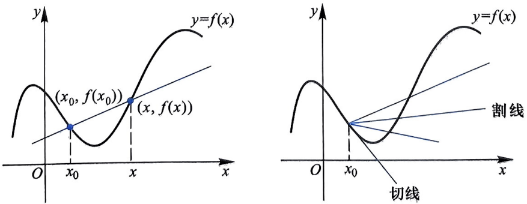
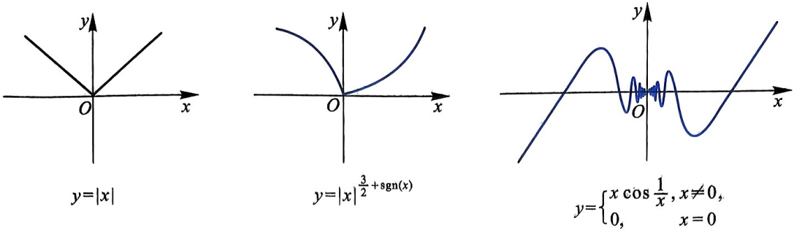
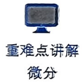
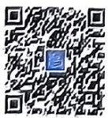

# 第3章 导数与微分

函数的导数是反映函数 (因变量) 的变化相对于自变量的变化的快慢程度. 而微分是利用导数来研究因变量的改变量的一个数学概念. 导数与微分都是讨论函数局部特性的重要概念, 对函数性质的研究起着关键的作用, 并有广泛的应用.

## §3.1 导数的概念

设函数 $f$ 在 $x_0$ 的某个邻域内有定义, 考察 $f$ 在 $x_0$ 附近的局部变化率

$$
k (x) = \frac {f (x) - f \left(x _ {0}\right)}{x - x _ {0}}.
$$

这个变化率有其实际意义, 例如

(1) 如果 $f(t)$ 表示时间 $t$ 内某个物体运动的路程, 那么相应的变化率 $k(t) = \frac{f(t) - f(t_0)}{t - t_0}$ 表示该物体在时间段 $[t_0, t]$ 内的平均速度;

(2) 对某个非均匀质量分布的杆状物, 如果 $f(x)$ 表示离指定端点距离为 $x$ 的这一段质量, 那么变化率 $k(x)$ 为 $x_0$ 到 $x$ 这一段的平均线密度;

(3) 对一般的函数, 从数学上说, 局部变化率 $k(x)$ 在几何上表示平面上过两点 $(x_0, f(x_0))$ 和 $(x, f(x))$ 的直线 (称为过定点 $(x_0, f(x_0))$ 的割线 (图3.1)) 的斜率.

图3.1 曲线的割线

当 $x$ 充分接近于 $x_0$ 时, 我们可以合理地用极限值

$$
\lim _ {x \to x _ {0}} k (x) = \lim _ {x \to x _ {0}} \frac {f (x) - f (x _ {0})}{x - x _ {0}} = k _ {0}
$$

定义 $f$ 在点 $x_0$ 处的函数值变化关于自变量变化的变化率. 如果这个极限存在, 那么上述 (1)、(2) 和 (3) 中, $k_0$ 分别可以定义为 “物体在 $t = t_0$ 时刻的瞬时速度” “非均匀质量分布的杆状物在 $x = x_0$ 处的线密度” 和 “曲线 $y = f(x)$ 在点 $(x_0, f(x_0))$ 处的切线的斜率”.

以下我们给出导数的定义.

**重难点讲解导数的概念及意义**

**定义 3.1.1** 设函数 $y = f(x)$ 在 $x_0$ 的某个邻域内有定义. 如果极限

$$
\lim _ {x \to x _ {0}} \frac {f (x) - f \left(x _ {0}\right)}{x - x _ {0}}
$$

存在, 就称 $f$ 在 $x_0$ 处可导, $x_0$ 为 $f$ 的可导点, 极限值为 $f$ 在 $x_0$ 处的导数, 记为 $f'(x_0)$; 当此极限不存在时, 则称 $f$ 在 $x_0$ 处不可导.

函数 $y = f(x)$ 在 $x = x_0$ 处的导数还可以记为 $\left.\frac{\mathrm{d}f}{\mathrm{d}x}\right|_{x = x_0},\left.\frac{\mathrm{d}y}{\mathrm{d}x}\right|_{x = x_0},y'|_{x = x_0}$ 等.

记 $\Delta x = x - x_0, x = x_0 + \Delta x,$ 则函数 $f$ 在 $x_0$ 处的导数可表示为

$$
f ^ {\prime} \left(x _ {0}\right) = \lim _ {\Delta x \to 0} \frac {f \left(x _ {0} + \Delta x\right) - f \left(x _ {0}\right)}{\Delta x}.
$$

这个极限形式有时计算起来会更方便. 根据定义, 函数 $f$ 在 $x_0$ 处可导, 其首要条件是 $f$ 在 $x_0$ 的某个邻域内有定义, 从而可知某点的导数是函数的一个局部性质. 当我们论述“$f$ 在 $x_0$ 处可导”时, 隐含地假定 $f$ 在 $x_0$ 的某个邻域内有定义, 而不关心这个邻域的大小.

显而易见, 任何常值函数在任何点都可导, 且导数为零, 即 $(c)' = 0$ ($c$ 为实常数).

对一些简单的函数,可以直接根据定义来判断可导性或计算导数值.

#### 例 3.1.2 求 $f(x) = x^{2}$ 在 $x_0 = 0$ 和 $x_0 = 3$ 处的导数.

$$
\left| f ^ {\prime} (0) = \lim _ {x \to 0} \frac {f (x) - f (0)}{x - 0} = \lim _ {x \to 0} \frac {x ^ {2} - 0}{x - 0} = \lim _ {x \to 0} x = 0, \right.
$$

$$
f ^ {\prime} (3) = \lim _ {x \to 3} \frac {f (x) - f (3)}{x - 3} = \lim _ {x \to 3} \frac {x ^ {2} - 9}{x - 3} = \lim _ {x \to 3} (x + 3) = 6.
$$

实际上, $f(x)=x^{2}$  在任何一点  $x_{0}$  处都可导,且

$$
f ^ {\prime} \left(x _ {0}\right) = \lim _ {x \to x _ {0}} \frac {f (x) - f (x _ {0})}{x - x _ {0}} = \lim _ {x \to x _ {0}} \frac {x ^ {2} - x _ {0} ^ {2}}{x - x _ {0}} = \lim _ {x \to x _ {0}} (x + x _ {0}) = 2 x _ {0}.
$$

如果函数 $f:(a,b)\to \mathbb{R}$ 在区间 $(a,b)$ 内的任何一点均可导, 那么由 $x\in (a,b)$ 到导数值 $f^{\prime}(x)$ 的对应关系确定了一个新的函数 $f^{\prime}:(a,b)\to \mathbb{R}$. 我们称

80

第3章

1

其为 $f$ 在区间 $(a,b)$ 内的导函数, 简称为导数. 根据定义, 对于 $x \in (a,b)$,

$$
f ^ {\prime} (x) = \lim _ {\Delta x \to 0} \frac {f (x + \Delta x) - f (x)}{\Delta x}.
$$

#### 例 3.1.3 求 $f(x) = x^{\alpha}, x \in (0, +\infty)$ 的导数 $(\alpha \neq 0)$.

解:根据导数定义，

$$
\begin{array}{r l} f ^ {\prime} (x) & = \lim _ {\Delta x \to 0} \frac {(x + \Delta x) ^ {\alpha} - x ^ {\alpha}}{\Delta x} = \lim _ {\Delta x \to 0} \frac {(1 + \Delta x / x) ^ {\alpha} - 1}{\Delta x / x} x ^ {\alpha - 1} \\ & = x ^ {\alpha - 1} \lim _ {t \to 0} \frac {(1 + t) ^ {\alpha} - 1}{t} = \alpha x ^ {\alpha - 1} \left(\text {这里} t = \frac {\Delta x}{x}\right). \end{array}
$$

#### 例 3.1.4 求 $y = \sin x$ 和 $y = \cos x$ 的导数.

解:由三角函数的和差化积公式，有

$$
\sin (x + \Delta x) - \sin x = 2 \sin \frac {\Delta x}{2} \cos \left(x + \frac {\Delta x}{2}\right).
$$

因此

$$
\lim _ {\Delta x \to 0} \frac {\sin (x + \Delta x) - \sin x}{\Delta x} = \lim _ {\Delta x \to 0} \frac {\sin \frac {\Delta x}{2}}{\frac {\Delta x}{2}} \cos \left(x + \frac {\Delta x}{2}\right) = \cos x.
$$

即

$$
(\sin x) ^ {\prime} = \cos x.
$$

类似地, 可得到

$$
(\cos x) ^ {\prime} = - \sin x.
$$

#### 例 3.1.5 求 $y = \ln x$ 的导函数 $(x > 0)$.

解:因为

$$
\begin{array}{r l} \lim _ {\Delta x \to 0} \frac {\ln (x + \Delta x) - \ln x}{\Delta x} & = \lim _ {\Delta x \to 0} \frac {\ln (1 + \Delta x / x)}{\Delta x} \\ & = \lim _ {\Delta x \to 0} \frac {1}{x} \ln \left(1 + \frac {\Delta x}{x}\right) ^ {\frac {x}{\Delta x}} \\ & = \frac {1}{x}, \end{array}
$$

所以

$$
(\ln x) ^ {\prime} = \frac {1}{x}.
$$

如果 $f$ 是一个分段函数, $x_0$ 为定义区间的一个分段点, 那么应特别注意 $f$ 在分段点 $x_0$ 处的可导性和导数的计算. 通常 $f$ 在 $x_0$ 处是否可导, 应通过定义来分析计算确定.

§3.1 导数的概念

#### 例 3.1.6 分析函数

$$
f (x) = \left\{ \begin{array}{l l} \sin x, & x \leqslant 0, \\ c x, & x > 0 \end{array} \right.
$$

在 x = 0 处的可导性.

解: $f'(0) = \lim_{x \to 0} \frac{f(x) - f(0)}{x - 0}$. 要计算此极限，必须考察其左、右极限:

$$
\lim _ {\Delta x \to 0 ^ {-}} \frac {f (x) - f (0)}{x - 0} = \lim _ {\Delta x \to 0 ^ {-}} \frac {\sin x - 0}{x} = 1,
$$

$$
\lim _ {\Delta x \to 0 ^ {+}} \frac {f (x) - f (0)}{x - 0} = \lim _ {\Delta x \to 0 ^ {+}} \frac {c x - 0}{x} = c.
$$

因此, 只有当 $c = 1$ 时, $f$ 在 $x = 0$ 处可导且导数为 1.

**定理 3.1.7** 设 $f$ 在 $x_0$ 的某个邻域有定义, 如果 $f$ 在 $x_0$ 处可导, 那么 $f$ 在 $x_0$ 处连续.

证明: 若 $f$ 在 $x_0$ 处可导, 则极限 $\lim_{x \to x_0} \frac{f(x) - f(x_0)}{x - x_0}$ 存在. 记

$$
\lim _ {x \to x _ {0}} \frac {f (x) - f \left(x _ {0}\right)}{x - x _ {0}} = d _ {0},
$$

则

$$
\frac {f (x) - f \left(x _ {0}\right)}{x - x _ {0}} = d _ {0} + \alpha (x),
$$

其中

$$
\lim _ {x \to x _ {0}} \alpha (x) = 0.
$$

于是

$$
f (x) - f \left(x _ {0}\right) = d _ {0} (x - x _ {0}) + \alpha (x) (x - x _ {0}).
$$

因此

$$
\lim _ {x \to x _ {0}} (f (x) - f (x _ {0})) = d _ {0} \lim _ {x \to x _ {0}} (x - x _ {0}) + \lim _ {x \to x _ {0}} \alpha (x) (x - x _ {0}) = 0,
$$

即 $\lim_{x\to x_0}f(x) = f(x_0)$, 从而 $f$ 在 $x_0$ 处连续.

上述定理简单地说就是“可导必连续”，但反之不一定成立，即 $f$ 在某点处连续，$f$ 在此点处仍然有可能不可导，下面是一个简单的例子。

#### 例 3.1.8 函数  $f(x)=|x|$  在 x=0 处连续但不可导, 因为极限  $\lim_{x\to0}\frac{|x|}{x}$  不存在.

图 3.2 给出了 3 个在 x = 0 处连续但不可导的函数曲线.

82

第3章

图3.2 在 $x = 0$ 处连续但不可导的函数

分析函数 $f$ 在 $x_0$ 处是否可导, 就是分析极限 $\lim_{x\to x_0}\frac{f(x) - f(x_0)}{x - x_0}$ 是否存在. 分析一个极限是否存在, 往而去分析其左、右极限是否存在并且是否相等. 为此, 我们引出函数的单侧可导性和单侧导数.

**定义 3.1.9** 设函数 $f$ 在 $x_0$ 的某个含 $x_0$ 的右邻域 $[x_0, x_0 + \delta)$ 内有定义. 如果右极限 $\lim_{x \to x_0^+} \frac{f(x) - f(x_0)}{x - x_0}$ 存在, 就称 $f$ 在 $x_0$ 处右侧可导, 其极限值即为 $f$ 在 $x_0$ 处的右导数, 并记其为 $f'_+(x_0)$; 同样, 设 $f$ 在 $(x_0 - \delta, x_0]$ 内有定义, 如果左极限 $\lim_{x \to x_0^-} \frac{f(x) - f(x_0)}{x - x_0}$ 存在, 就称 $f$ 在 $x_0$ 处左侧可导, 其极限值即为 $f$ 在 $x_0$ 处的左导数, 并记其为 $f'_-(x_0)$.

例如, 图 3.2 中所示的函数 $f(x) = |x|$ 在 $x = 0$ 处的左、右导数都存在, 且 $f_{-}^{\prime}(0) = -1$, $f_{+}^{\prime}(0) = 1$; 函数 $f(x) = |x|^{\frac{3}{2} + \mathrm{sgn}(x)}$ 在 $x = 0$ 处的左导数不存在, 因为

$$
\lim _ {x \to 0 ^ {-}} \frac {f (x) - f (0)}{x - 0} = \lim _ {x \to 0 ^ {-}} \frac {\sqrt {| x |} - 0}{x - 0} = - \infty ,
$$

但右导数存在:

$$
\lim _ {x \to 0 ^ {+}} \frac {f (x) - f (0)}{x - 0} = \lim _ {x \to 0 ^ {+}} \frac {x ^ {5 / 2} - 0}{x - 0} = 0;
$$

读者可以自行验证函数 $f(x) = x \cos \frac{1}{x} (x \neq 0)$，$f(0) = 0$ 在 $x = 0$ 处的左、右导数都不存在.

**定理 3.1.10** 设函数 $f$ 在 $x_0$ 的某个邻域内有定义, 则 $f$ 在 $x_0$ 处可导当且仅当 $f$ 在 $x_0$ 处分别左、右可导, 且左、右导数值相等.

就像分析函数的极限是否存在一样, 我们常常通过分析函数的左、右导数是否存在来判断其导数是否存在, 在研究分段函数在分点是否可导时尤其如此.

## §3.2 导数的四则运算与反函数的导数

常见的初等函数, 均是一些简单的基本初等函数通过四则运算、求反函数运算和复合运算得到. 对于一般复合函数, 直接利用导数的定义 (即极限计算)

§3.2 导数的四则运算与反函数的导数

**重难点讲解导数的计算**

来计算导数值是不方便的或者是很困难的. 我们需要建立一些求导规则或利用一些基本初等函数的导函数, 来简化导函数的计算. 本节将分别介绍函数四则运算、反函数下的求导规则, 并根据这些规则给出基本初等函数的导函数. 复合函数的求导规则将在下一节给出.

### 一、导数的四则运算

导数的四则运算法则, 指的是对一个由某些函数经四则运算后得到的函数求导所固有的规则.

**定理 3.2.1**(线性性质) 设函数 $f$ 和 $g$ 在 $x_0$ 处均可导, $\alpha$ 和 $\beta$ 为两个常数, 则函数 $\alpha f + \beta g$ 在 $x_0$ 处也可导, 并且

$$
\left. \frac {\mathrm{d}}{\mathrm{d} x} (\alpha f + \beta g) \right| _ {x = x _ {0}} = \alpha \frac {\mathrm{d} f}{\mathrm{d} x} \bigg | _ {x = x _ {0}} + \beta \frac {\mathrm{d} g}{\mathrm{d} x} \bigg | _ {x = x _ {0}}
$$

证明: 因为 $f$ 和 $g$ 在 $x_0$ 处均可导, 所以

$$
\begin{array}{l} f ^ {\prime} \left(x _ {0}\right) = \lim _ {\Delta x \to 0} \frac {f \left(x _ {0} + \Delta x\right) - f \left(x _ {0}\right)}{\Delta x}, \\ g ^ {\prime} \left(x _ {0}\right) = \lim _ {\Delta x \to 0} \frac {g \left(x _ {0} + \Delta x\right) - g \left(x _ {0}\right)}{\Delta x}. \end{array}
$$

于是

$$
\begin{array}{r l} \frac {\mathrm{d}}{\mathrm{d} x} \left(\alpha f + \beta g\right) \bigg | _ {x = x _ {0}} & = \lim _ {\Delta x \to 0} \frac {[ \alpha f (x _ {0} + \Delta x) + \beta g (x _ {0} + \Delta x) ] - (\alpha f (x _ {0}) + \beta g (x _ {0}))}{\Delta x} \\ & = \alpha \lim _ {\Delta x \to 0} \frac {f (x _ {0} + \Delta x) - f (x _ {0})}{\Delta x} + \beta \lim _ {\Delta x \to 0} \frac {g (x _ {0} + \Delta x) - g (x _ {0})}{\Delta x} \\ & = \alpha \frac {\mathrm{d} f}{\mathrm{d} x} \bigg | _ {x = x _ {0}} + \beta \frac {\mathrm{d} g}{\mathrm{d} x} \bigg | _ {x = x _ {0}} \end{array}
$$

因此, 有以下求导公式:

$$
(\alpha f (x) + \beta g (x)) ^ {\prime} = \alpha f ^ {\prime} (x) + \beta g ^ {\prime} (x).
$$

#### 例 3.2.2 计算函数 $f(x) = \log_a x$ 的导函数 $(a > 0, a \neq 1)$.

解:通过对数的换底公式将 $f(x) = \log_a x$ 改写为

$$
f (x) = \frac {\ln x}{\ln a} = \frac {1}{\ln a} \ln x.
$$

根据例3.1.5的结果可得

$$
(\log_ {a} x) ^ {\prime} = \frac {1}{\ln a} (\ln x) ^ {\prime} = \frac {1}{x \ln a}.
$$

#### 例 3.2.3 计算函数  $f(x)=2x^{3}-5\sin x+1$  的导数.

84

第3章

解: $f'(x) = 2(x^3)' - 5(\sin x)' + (1)' = 2(3x^2) - 5\cos x + 0 = 6x^2 - 5\cos x.$

#### 例 3.2.4 $n$ 次多项式 $(n > 1)$ 的导函数是一个 $n - 1$ 次多项式.

本题证明请读者完成.

**定理 3.2.5** 设函数 $f$ 和 $g$ 在 $x$ 处均可导, 则积函数 $fg$ 在 $x$ 处也可导, 且有

$$
(f (x) g (x)) ^ {\prime} = f ^ {\prime} (x) g (x) + f (x) g ^ {\prime} (x).
$$

证明:

$$
\begin{array}{r l} & (f (x) g (x)) ^ {\prime} \\ & = \lim _ {\Delta x \to 0} \frac {f (x + \Delta x) g (x + \Delta x) - f (x) g (x)}{\Delta x} \\ & = \lim _ {\Delta x \to 0} \frac {f (x + \Delta x) - f (x)}{\Delta x} g (x + \Delta x) + \lim _ {\Delta x \to 0} f (x) \frac {g (x + \Delta x) - g (x)}{\Delta x} \\ & = f ^ {\prime} (x) g (x) + f (x) g ^ {\prime} (x). \end{array}
$$

本定理可推广到多个可导函数之积的情形, 有

$$
\begin{array}{c} (f _ {1} (x) f _ {2} (x) \dots f _ {n} (x)) ^ {\prime} \\ = f _ {1} ^ {\prime} (x) f _ {2} (x) \dots f _ {n} (x) + f _ {1} (x) f _ {2} ^ {\prime} (x) \dots f _ {n} (x) + \dots + f _ {1} (x) f _ {2} (x) \dots f _ {n} ^ {\prime} (x). \end{array}
$$

**定理 3.2.6** 设函数 $f$ 和 $g$ 在 $x$ 处均可导, $g(x) \neq 0$, 则商函数 $\frac{f}{g}$ 在 $x$ 处也可导, 并且

$$
\left(\frac {f (x)}{g (x)}\right) ^ {\prime} = \frac {f ^ {\prime} (x) g (x) - f (x) g ^ {\prime} (x)}{g ^ {2} (x)}.
$$

特别地，

$$
\left(\frac {1}{g (x)}\right) ^ {\prime} = - \frac {g ^ {\prime} (x)}{g ^ {2} (x)}.
$$

请读者自行完成此证明.

#### 例 3.2.7

$$
\begin{array}{c} (\tan x) ^ {\prime} = \left(\frac {\sin x}{\cos x}\right) ^ {\prime} = \frac {(\sin x) ^ {\prime} \cos x - \sin x (\cos x) ^ {\prime}}{\cos^ {2} x} \\ = \frac {\cos^ {2} x - \sin x (- \sin x)}{\cos^ {2} x} = \frac {1}{\cos^ {2} x} = \sec^ {2} x, \end{array}
$$

$$
\left(\cot x\right) ^ {\prime} = \frac {- \sin^ {2} x - \cos^ {2} x}{\sin^ {2} x} = - \frac {1}{\sin^ {2} x} = - \csc^ {2} x,
$$

同理可得 $(\sec x)' = \sec x \tan x, (\csc x)' = -\csc x \cot x.$

### 二、反函数的求导法则

**定理 3.2.8**（反函数的求导法则）设函数 $y = f(x)$ 在 $U(x_0)$ 内严格单调，在 $x_0$ 处可导且 $f'(x_0) \neq 0, y_0 = f(x_0), g: U(y_0) \to U(x_0)$ 为 $y = f(x)$ 的反函数，则函数 $g$ 在 $y_0$ 处可导，且 $g'(y_0) = \frac{1}{f'(x_0)}$.

§3.2 导数的四则运算与反函数的导数

证明:令 $\Delta x = g(y_0 + \Delta y) - g(y_0)$，则

$$
g \left(y _ {0} + \Delta y\right) = x _ {0} + \Delta x, \quad y _ {0} + \Delta y = f \left(x _ {0} + \Delta x\right),
$$

于是

$$
\Delta y = (y _ {0} + \Delta y) - y _ {0} = f (x _ {0} + \Delta x) - f (x _ {0}).
$$

由于 $f$ 在 $U(x_0)$ 内严格单调、连续, 故 $g$ 必在 $y_0$ 的某邻域 $U(y_0)$ 内也严格单调、连续. 因此当 $\Delta y \neq 0$ 时, 上述定义的 $\Delta x \neq 0$, 并且当 $\Delta y \to 0$ 时 $\Delta x \to 0$. 于是, 由 $f$ 在 $x_0$ 处的可导性得

$$
\begin{array}{r l} & {\left| g ^ {\prime} (y _ {0}) = \lim _ {\Delta y \to 0} \frac {g (y _ {0} + \Delta y) - g (y _ {0})}{\Delta y} = \lim _ {\Delta x \to 0} \frac {\Delta x}{f (x _ {0} + \Delta x) - f (x _ {0})} \right|.} \\ & {\qquad = \lim _ {\Delta x \to 0} \frac {1}{\frac {f (x _ {0} + \Delta x) - f (x _ {0})}{\Delta x}} = \frac {1}{f ^ {\prime} (x _ {0})}.} \end{array}
$$

#### 例 3.2.9 证明: 若 $|x| < 1$, 则 $(\arcsin x)' = \frac{1}{\sqrt{1 - x^2}}$.

证明: 令 $y = \arcsin x (|x| < 1)$, 则其反函数为 $x = \sin y, y \in \left(-\frac{\pi}{2}, \frac{\pi}{2}\right)$. 根据反函数的求导法则, 有

$$
(\arcsin x) ^ {\prime} = \frac {1}{(\sin y) ^ {\prime}} = \frac {1}{\cos y} = \frac {1}{\sqrt {1 - \sin^ {2} y}} = \frac {1}{\sqrt {1 - x ^ {2}}}.
$$

应特别注意的是: 上式中  $(\arcsin x)'$  与  $(\sin y)'$  的求导变量是不同的, 前者关于变量 x, 后者关于变量 y. 类似可得到其他反三角函数的导数.

#### 例 3.2.10 求指数函数  $y = a^{x} (a > 0, a \neq 1)$  的导函数.

解: $y = a^{x}$ 的反函数为 $x = \log_a y(y > 0)$. 因此

$$
(a ^ {x}) ^ {\prime} = \frac {1}{(\log_ {a} y) ^ {\prime}} = \frac {1}{1 / (y \ln a)} = y \ln a = a ^ {x} \ln a.
$$

导数问题

特别地, $\left(\mathrm{e}^{x}\right)^{\prime}=\mathrm{e}^{x}$ .

基本初等函数的导数公式

1. $(C)' = 0$ ，其中 $C$ 为实常数；

2. $(x^{a})^{\prime} = ax^{a - 1}$ ，其中 $a$ 为实常数；

3. $(a^{x})^{\prime} = a^{x}\ln a$ ($a > 0$ 且 $a\neq 1$);

4. $(\mathrm{e}^x)' = \mathrm{e}^x;$

5. $(\log_a x)' = \frac{1}{x \ln a} (a > 0, a \neq 1)$;

86

第3章

6. $(\ln x)' = \frac{1}{x}$;

7. $(\sin x)' = \cos x;$

8. $(\cos x)' = -\sin x;$

9. $(\tan x)' = \sec^2 x;$

10.  $(\cot x)' = -\csc^{2} x;$

$$
(\sec x) ^ {\prime} = \sec x \tan x;
$$

12.  $(\csc x)' = -\csc x \cot x;$

13. $(\arcsin x)' = \frac{1}{\sqrt{1 - x^2}} (|x| < 1)$;

14. $(\arccos x)' = -\frac{1}{\sqrt{1 - x^2}} (|x| < 1);$

15. $(\arctan x)' = \frac{1}{1 + x^2}$;

16. $(\operatorname{arccot} x)' = -\frac{1}{1 + x^2}$.

## §3.3 复合函数的求导法——链式法则

除简单的基本初等函数或经四则运算后得到的函数外, 我们还经常要讨论一些由初等函数复合所得的函数. 本节将讨论复合函数的求导法则.

**定理 3.3.1**（链式法则）设函数 $g$ 在 $x_0$ 处可导, $f$ 在对应点 $u_0 = g(x_0)$ 处可导, 则复合函数 $f \circ g$ 在 $x_0$ 处也可导, 且

$$
(f \circ g) ^ {\prime} (x _ {0}) = f ^ {\prime} (u _ {0}) g ^ {\prime} (x _ {0}).
$$

证明: 记 $y = f(u)$, $u = g(x)$, 复合而成的函数为 $y = f(g(x))$. 由于 $f$ 在 $u_0$ 处可导, 故 $f'(u_0) = \lim_{u \to u_0} \frac{f(u) - f(u_0)}{u - u_0}$. 从而

$$
\frac {f (u) - f (u _ {0})}{u - u _ {0}} = f ^ {\prime} (u _ {0}) + \alpha (u),
$$

其中 $\lim_{u\to u_0}\alpha (u) = 0.$ 于是当 $u\neq u_0$ 时，有

$$
f (u) = f (u _ {0}) + f ^ {\prime} (u _ {0}) (u - u _ {0}) + \alpha (u) (u - u _ {0}).\tag{*}
$$

另一方面, 当 $\Delta x \neq 0$ 时, $\Delta u = u - u_0 = g(x_0 + \Delta x) - g(x_0)$ 有可能等于零. 而当 $u = u_0$ (即 $\Delta u = 0$) 时, 虽然有 $\Delta y = f(u) - f(u_0) = 0$, (\*) 式依然成立. 但需对 $\alpha(u)$ 作扩充定义:

$$
\alpha (u) = \left\{ \begin{array}{l l} \frac {f (u) - f (u _ {0})}{u - u _ {0}} - f ^ {\prime} (u _ {0}), & u \neq u _ {0}, \\ 0, & u = u _ {0}. \end{array} \right.
$$

§3.3 复合函数的求导法——链式法则

这样, 无论 $u$ 是否等于 $u_0$, (\*) 式均成立.

$$
(f \circ g) (x) = f (g (x)) = f \left(g (x _ {0})\right) + \left(f ^ {\prime} \left(u _ {0}\right) + \alpha (u)\right) \left(g (x) - g \left(x _ {0}\right)\right).
$$

由于 $g$ 在 $x_0$ 处可导, 故 $g$ 在 $x_0$ 处连续, 从而当 $x \to x_0$ 时, $u = g(x) \to g(x_0) = u_0$. 因此当 $x \to x_0$ 时, $\alpha(u) \to 0$. 根据导数定义, 有

$$
\begin{array}{r l} \lim _ {x \to x _ {0}} \frac {(f \circ g) (x) - (f \circ g) (x _ {0})}{x - x _ {0}} & = \lim _ {x \to x _ {0}} (f ^ {\prime} (u _ {0}) + \alpha (u)) \frac {g (x) - g (x _ {0})}{x - x _ {0}} \\ & = f ^ {\prime} (u _ {0}) g ^ {\prime} (x _ {0}). \end{array}
$$

所以

$$
(f \circ g) ^ {\prime} (x _ {0}) = f ^ {\prime} (u _ {0}) g ^ {\prime} (x _ {0}).
$$

一般地, 如果 $g$ 在开区间 $(a, b)$ 内可导, 而 $f$ 在 $g$ 的值域内可导, 那么在 $(a, b)$ 内有定义的复合函数 $f \circ g$ 在 $(a, b)$ 内也可导, 并且

$$
(f \circ g) ^ {\prime} (x) = f ^ {\prime} (g (x)) g ^ {\prime} (x),
$$

或者表示为

$$
\frac {\mathrm{d} f (g (x))}{\mathrm{d} x} = \left. \frac {\mathrm{d} f (u)}{\mathrm{d} u} \right| _ {u = g (x)} \frac {\mathrm{d} g (x)}{\mathrm{d} x}.
$$

若 $y = f(u), u = g(x)$ 均可导, 则其复合而成的函数 $y = f(g(x))$ 也可导, 且

$$
\frac {\mathrm{d} y}{\mathrm{d} x} = \frac {\mathrm{d} y}{\mathrm{d} u} \cdot \frac {\mathrm{d} u}{\mathrm{d} x} = f ^ {\prime} (u) \cdot g ^ {\prime} (x).
$$

上述公式常被称为复合函数的链式法则. 特别需要强调的是: 当求得 $f'(u)$ 后, 应将 $u = g(x)$ 代入. 另外也请注意: $f'(g(x))$ 与 $(f(g(x)))'$ 是不同的, 读者应明确这两者之间的差异.

通过上述链式法则, 可以方便地计算更为复杂的函数的导函数.

#### 例 3.3.2 求幂函数  $y = x^{a} (x > 0)$  的导函数.

解:在上一节中, 我们已经给出了幂函数的求导公式, 下面我们利用复合函数的链式法则重新给出其证明.

将 $y = x^a$ 表示为 $y = x^a = \mathrm{e}^{a\ln x}$. 它可看作 $y = \mathrm{e}^u$ 与 $u = a\ln x$ 的复合函数. 因此

$$
\frac {\mathrm{d}}{\mathrm{d} x} x ^ {a} = \left. \frac {\mathrm{d}}{\mathrm{d} u} \mathrm{e} ^ {u} \right| _ {u = a \ln x} \cdot \frac {\mathrm{d}}{\mathrm{d} x} (a \ln x) = \left(\mathrm{e} ^ {u} | _ {u = a \ln x}\right) \cdot \frac {a}{x} = x ^ {a} \frac {a}{x} = a x ^ {a - 1}
$$

#### 例 3.3.3 求函数 $f(x) = x^{x} (x > 0)$ 的导函数.

解:因为 $x^{x} = \mathrm{e}^{x\ln x}$ ，所以

$$
(x ^ {x}) ^ {\prime} = \mathrm{e} ^ {x \ln x} (1 + \ln x) = x ^ {x} (1 + \ln x).
$$

88

第3章

对于形如 $f(x) = u(x)^{v(x)}$ (其中 $u(x) > 0$) 的函数, 我们称其为幂指函数, 可将其化成 $u(x)^{v(x)} = \mathrm{e}^{v(x)\ln u(x)}$ 的形式, 然后用复合函数的链式法则求得它的导数.

一些由方程确定的函数关系, 我们称为隐函数, 相应的方程也称为隐函数方程. 在下册里我们将详细介绍隐函数的知识. 下面我们通过例子来说明求隐函数方程所确定的隐函数导数的方法.

#### 例 3.3.4 求由开普勒方程 (常数 $\varepsilon \in (0,1)$) $y - x - \varepsilon \sin y = 0$ 确定的隐函数 $y = f(x)$ 的导数.

解: 将 $y = f(x)$ 代入上述方程, 得到恒等式

$$
f (x) - x - \varepsilon \sin f (x) \equiv 0.
$$

可以证明函数 $y = f(x)$ 是可导的 (将在下册介绍有关理论). 因此, 将上述恒等式两边对变量 $x$ 求导得

$$
f ^ {\prime} (x) - 1 - \varepsilon \cos f (x) f ^ {\prime} (x) \equiv 0,
$$

解得

$$
f ^ {\prime} (x) = \frac {1}{1 - \varepsilon \cos f (x)}.
$$

#### 例 3.3.5 设函数 $y = y(x)$ 由方程 $xy + x^2 + y^3 + e^{xy} = 0$ 确定, 试求 $\left.\frac{\mathrm{d}y}{\mathrm{d}x}\right|_{x=0}$.

解:由方程知，当 $x = 0$ 时，$y = -1$. 将方程两边对 $x$ 求导，可得

$$
y + x y ^ {\prime} + 2 x + 3 y ^ {2} y ^ {\prime} + \mathrm{e} ^ {x y} \left(y + x y ^ {\prime}\right) = 0.
$$

将 $x = 0, y = -1$ 代入得 $-1 + 3y' + (-1) = 0$, 解得 $\left.\frac{\mathrm{d}y}{\mathrm{d}x}\right|_{x=0} = \frac{2}{3}$.

利用对数建立函数恒等式, 将复杂函数简化, 然后通过此恒等式求导, 建立导函数关系式, 进而解得导函数, 这一方法称为对数求导法. 这个方法对幂指函数和由连乘或连除形式给出的函数的导数计算尤为有效.

#### 例 3.3.6 求 $f(x) = x^{\sin x} (x > 0)$ 的导数.

解:首先对函数 $f(x) = x^{\sin x}$ 取对数，从而建立一个恒等式

$$
\ln f (x) = \sin x \ln x.
$$

其次, 将此恒等式两边对 $x$ 求导 (等式左边利用复合函数求导法, 等式右边直接求导), 有

$$
\frac {f ^ {\prime} (x)}{f (x)} = \cos x \ln x + \frac {\sin x}{x}.
$$

§3.3 复合函数的求导法——链式法则

最后解之, 得 $f(x) = x^{\sin x}$ 的导函数

$$
f ^ {\prime} (x) = x ^ {\sin x} \left(\cos x \ln x + \frac {\sin x}{x}\right).
$$

一般地, 若函数 $u(x)$ 和 $v(x)$ 均可导, 且 $u(x) > 0$, 则用对数求导法可得

$$
\left(u (x) ^ {v (x)}\right) ^ {\prime} = u (x) ^ {v (x)} \left(v ^ {\prime} (x) \ln u (x) + v (x) \frac {u ^ {\prime} (x)}{u (x)}\right).
$$

建议读者仔细推导这一公式.

#### 例 3.3.7 求函数 $y = \frac{(x + 1)^2\sqrt{x - 1}}{(x + 2)^{x - 1}x^{1 / 3}}$ ($x > 1$) 的导数.

解:两边取对数，得

$$
\left| \ln y = 2 \ln (x + 1) + \frac {1}{2} \ln (x - 1) - (x - 1) \ln (x + 2) - \frac {1}{3} \ln x. \right.
$$

将上式两边同时对 $x$ 求导, 注意到 $\ln y(x)$ 是复合函数, 因此有

$$
\frac {y ^ {\prime} (x)}{y (x)} = \frac {2}{x + 1} + \frac {1}{2 (x - 1)} - \frac {x - 1}{x + 2} - \ln (x + 2) - \frac {1}{3 x}.
$$

两边乘 $y(x)$ 并将 $y(x)$ 的表示式代入, 得

$$
y ^ {\prime} (x) = \frac {(x + 1) ^ {2} \sqrt {x - 1}}{(x + 2) ^ {x - 1} x ^ {1 / 3}} \left[ \frac {2}{x + 1} + \frac {1}{2 (x - 1)} - \frac {x - 1}{x + 2} - \ln (x + 2) - \frac {1}{3 x} \right].
$$

## §3.4 参数式函数的导数

在 $xOy$ 平面上, 表示平面曲线 $C$ 的最常用的方程形式是参数方程, 它的表达式为

$$
\left\{ \begin{array}{l l} x = \varphi (t), \\ y = \psi (t) \end{array} \right. (\alpha \leqslant t \leqslant \beta),
$$

即

$$
C = \{(x, y) | x = \varphi (t), y = \psi (t), t \in [ \alpha , \beta ] \}.
$$

如果 $\varphi(t)$ 和 $\psi(t)$ 都有连续的导函数, 并且对任何 $t \in [\alpha, \beta], \varphi'(t)$ 和 $\psi'(t)$ 不同时为零, 那么称此平面曲线为光滑曲线. 光滑性要求可以确保参数曲线 $C$ 上的任何一点 $(x_0, y_0) = (\varphi(t_0), \psi(t_0))$ 均有切线. 事实上, 如果参数曲线 $C$ 是光滑的, 那么 $(\varphi'(t_0), \psi'(t_0)) \neq (0, 0)$. 不妨设 $\varphi'(t_0) \neq 0$. 则由 $\varphi'(t)$ 的连续性, 在 $t_0$ 的某个邻域 $U(t_0)$ (如果 $t_0$ 为区间端点, 那么为单侧邻域) 内 $\varphi'(t)$ 非零且保号, 从而 $\varphi(t)$ 严格单调, 并且在 $x_0 = \varphi(t_0)$ 的某个小邻域 $U(x_0)$ 内有反

90

第3章

函数 $t = \varphi^{-1}(x)$, 因此在 $U(x_0)$ 内 $y = \psi(\varphi^{-1}(x))$. 此函数在 $x_0$ 处可导, 其导数为

$$
\left. \frac {\mathrm{d} y}{\mathrm{d} x} \right| _ {x = x _ {0}} = \left. \frac {\mathrm{d} y}{\mathrm{d} t} \cdot \frac {\mathrm{d} t}{\mathrm{d} x} = \frac {\psi^ {\prime} (t)}{\varphi^ {\prime} (t)} \right| _ {t = \varphi^ {- 1} (x _ {0})}
$$

当我们论述“参数式函数的导数”时, 意为 $y = \psi \left( {\varphi }^{-1}\left( x\right) \right)$ 的导函数

$$
\frac {\mathrm{d} y}{\mathrm{d} x} = \left. \frac {\psi^ {\prime} (t)}{\varphi^ {\prime} (t)} \right| _ {t = \varphi^ {- 1} (x)}.
$$

此时, 导函数仍然可以表示为一个参数式函数:

$$
\left| \begin{array}{l} \left\{ \begin{array}{l l} x = \varphi (t), \\ y ^ {\prime} = \frac {\psi^ {\prime} (t)}{\varphi^ {\prime} (t)} \end{array} \right. & (\alpha \leqslant t \leqslant \beta). \end{array} \right.
$$

#### 例 3.4.1 求摆线  $\left\{\begin{aligned} x &= a(t - \sin t), \\ y &= a(1 - \cos t) \end{aligned}\right.$  ( $0 < t < 2\pi, a > 0$ ) 的导数  $\frac{dy}{dx}$ .
解:  $\frac{dy}{dx} = \frac{a \sin t}{a(1 - \cos t)} = \frac{\sin t}{1 - \cos t}.$

## §3.5 高阶导数

给定函数 $f$, 如果其在某个区间内可导, 那么可构造一个新函数: $f$ 的导函数 $f'$. 进一步, 如果函数 $f'$ 也可导, 我们可以构造另一个新函数: $f'$ 的导函数 $(f')'$. 我们称 $(f')'$ 为 $f$ 的二阶导函数, 并简单记为 $f'', f^{(2)}$ 或 $\frac{\mathrm{d}^2 f}{\mathrm{d}x^2}$, 即可理解为

$$
\frac {\mathrm{d} ^ {2}}{\mathrm{d} x ^ {2}} f = \frac {\mathrm{d}}{\mathrm{d} x} \left(\frac {\mathrm{d}}{\mathrm{d} x} f\right).
$$

特别地, 在 $x = x_0$ 处, 如果 $f'(x)$ 在 $U(x_0)$ 内有定义, 且极限

$$
\lim _ {\Delta x \to 0} \frac {f ^ {\prime} (x _ {0} + \Delta x) - f ^ {\prime} (x _ {0})}{\Delta x}
$$

存在, 记其值为 $A$, 那么称 $f$ 在 $x = x_0$ 处二阶可导, 其极限值 $A$ 即为 $f$ 在 $x = x_0$ 处的二阶导数. 即

$$
f ^ {\prime \prime} (x _ {0}) = \lim _ {\Delta x \to 0} \frac {f ^ {\prime} (x _ {0} + \Delta x) - f ^ {\prime} (x _ {0})}{\Delta x}.
$$

**重难点讲解高阶导数**

一般地, 如果已经定义了 $f$ 的 $n$ 阶导函数 $f^{(n)}$, 那么当 $f^{(n)}$ 可导时, 称 $f^{(n)}$ 的导数 $(f^{(n)})'$ 为 $f$ 的 $n + 1$ 阶导函数, 记为 $f^{(n + 1)}$. $n$ 阶导函数也简称为 $n$ 阶导数. 二阶及以上阶导数统称为高阶导数.

§3.5 高阶导数

#### 例 3.5.1 计算指数函数 $f(x) = a^{x}(a > 0)$ 的 $n$ 阶导数.

解:首先， $f'(x) = \ln a \cdot a^x = (\ln a)f(x)$ . 因此

$$
f ^ {\prime \prime} (x) = (\ln a) f ^ {\prime} (x) = (\ln a) ^ {2} f (x).
$$

假设 $f^{(n)}(x) = (\ln a)^{n}f(x) = (\ln a)^{n}a^{x}$，则

$$
f ^ {(n + 1)} (x) = [ (\ln a) ^ {n} (a ^ {x}) ] ^ {\prime} = (\ln a) ^ {n + 1} a ^ {x}.
$$

所以 $f^{(n)}(x) = (\ln a)^{n}f(x) = (\ln a)^{n}a^{x}$

#### 例 3.5.2 计算  $f(x)=\sin x$  的 n 阶导数.

解: $f^{\prime}(x) = \cos x = \sin \left(x + \frac{\pi}{2}\right),$

$$
f ^ {\prime \prime} (x) = \cos \left(x + \frac {\pi}{2}\right) = \sin \left(x + 2 \cdot \frac {\pi}{2}\right).
$$

同例 3.5.1 类似, 可归纳得

$$
f ^ {(n)} (x) = \sin \left(x + \frac {n \pi}{2}\right).
$$

类似地, 有

$$
(\cos x) ^ {(n)} = \cos \left(x + \frac {n \pi}{2}\right).
$$

#### 例 3.5.3 若 $f$ 有 $n$ 阶导数, 则

$$
[ f (a x + b) ] ^ {(n)} = a ^ {n} f ^ {(n)} (a x + b).
$$

请读者自己推导并注意 $[f(ax + b)]^{(n)}$ 和 $f^{(n)}(ax + b)$ 的差异.

#### 例 3.5.4 设 $f(x) = \mathrm{e}^{x}\cos x$，求 $f^{(2015)}(x)$.

解: $f^{\prime}(x) = \mathrm{e}^{x}(\cos x - \sin x)$ ，我们改写 $f^{\prime}(x)$ 为

$$
f ^ {\prime} (x) = \sqrt {2} \mathrm{e} ^ {x} \cos \left(x + \frac {\pi}{4}\right) = \sqrt {2} \mathrm{e} ^ {- \frac {\pi}{4}} \mathrm{e} ^ {x + \frac {\pi}{4}} \cos \left(x + \frac {\pi}{4}\right) = \sqrt {2} \mathrm{e} ^ {- \frac {\pi}{4}} f \left(x + \frac {\pi}{4}\right).
$$

假设 $f^{(n)}(x) = \left(\sqrt{2}\mathrm{e}^{-\frac{\pi}{4}}\right)^n f\left(x + \frac{n\pi}{4}\right) = 2^{\frac{n}{2}}\mathrm{e}^x\cos \left(x + \frac{n\pi}{4}\right)$, 则

$$
\begin{array}{r l} f ^ {(n + 1)} (x) & = \left[ \left(\sqrt {2} \mathrm{e} ^ {- \frac {\pi}{4}}\right) ^ {n} f \left(x + \frac {n \pi}{4}\right) \right] ^ {\prime} \\ & = \left(\sqrt {2} \mathrm{e} ^ {- \frac {\pi}{4}}\right) ^ {n} \cdot \left(\sqrt {2} \mathrm{e} ^ {- \frac {\pi}{4}}\right) f \left(x + \frac {n \pi}{4} + \frac {\pi}{4}\right) \\ & = \left(\sqrt {2} \mathrm{e} ^ {- \frac {\pi}{4}}\right) ^ {n + 1} f \left[ x + \frac {(n + 1) \pi}{4} \right] \\ & = (\sqrt {2}) ^ {n + 1} \mathrm{e} ^ {x} \cos \left[ x + \frac {(n + 1) \pi}{4} \right]. \end{array}
$$

因此

$$
f ^ {(2 0 1 5)} (x) = 2 ^ {1 0 0 7} \mathrm{e} ^ {x} (\cos x + \sin x).
$$

92

第3章

对于计算两个函数乘积的高阶导数, 我们有下述莱布尼茨 $^{①}$ 公式.

**定理 3.5.5**(莱布尼茨公式) 若函数 $u$ 和 $v$ 均 $n$ 阶可导, 则乘积函数 $uv$ 也 $n$ 阶可导, 且

$$
(u v) ^ {(n)} = \sum_ {k = 0} ^ {n} \binom{n}{k} u ^ {(n - k)} v ^ {(k)}.
$$

本定理的证明与二项展开式 $(a + b)^n = \sum_{k=0}^{n} \binom{n}{k} a^{n-k} b^k$ 的证明类似, 读者可参照完成本定理的证明.

一般情况下, 使用莱布尼茨公式求两个函数乘积的高阶导数, 将会使表达式非常烦琐. 但我们注意到 $n$ 次多项式, 当求导阶数高于 $n$ 时, 其导数为零. 所以, 如果 $u, v$ 中有一个是低次的多项式, 那么莱布尼茨公式中的 (非零) 项数大为减少, 此时应用莱布尼茨公式计算高阶导数往往是非常有效的.

#### 例 3.5.6 设 $f(x) = \arctan x$，求 $f^{(n)}(0)$.

解:因为 $f^{\prime}(x) = \frac{1}{1 + x^{2}}$ ，移项得恒等式

$$
(1 + x ^ {2}) f ^ {\prime} (x) = 1.
$$

注意到左边第一个因子是二次多项式, 因此对此恒等式两边求 $n - 1$ 阶导数时, 对左边应用莱布尼茨公式, 得

$$
(1 + x ^ {2}) f ^ {(n)} (x) + 2 (n - 1) x f ^ {(n - 1)} (x) + (n - 1) (n - 2) f ^ {(n - 2)} (x) \equiv 0.
$$

特别地, 令 $x = 0$, 有 $f^{(n)}(0) + (n - 1)(n - 2)f^{(n - 2)}(0) = 0$. 由此得到递推式:

$$
f ^ {(n)} (0) = - (n - 1) (n - 2) f ^ {(n - 2)} (0).
$$

注意到 $f(0) = 0, f'(0) = 1,$ 得

$$
f ^ {(n)} (0) = \left\{ \begin{array}{l l} 0, & n \text {为偶数}, \\ (- 1) ^ {\frac {n - 1}{2}} (n - 1)!, & n \text {为奇数}. \end{array} \right.
$$

#### 例 3.5.7 设 $f$ 在 $[-1, 1]$ 上二阶可导, $g(x) = f(\sin x)$, 求 $g''(x)$.

解:根据复合函数求导法得 $g'(x) = f'(\sin x)\cos x$ ，从而有

$$
g ^ {\prime \prime} (x) = f ^ {\prime \prime} (\sin x) \cos^ {2} x - f ^ {\prime} (\sin x) \sin x.
$$

> **注：** ① 莱布尼茨 (Leibniz, 1646—1716), 德国哲学家、数学家. 莱布尼茨是历史上少见的通才, 被誉为 17 世纪的亚里士多德. 他是微积分学的主要发明人, 不过莱布尼茨与牛顿谁先发明微积分的争论是数学界至今最大的公案. 莱布尼茨认识到好的数学符号能节省思维劳动, 运用符号的技巧是数学成功的关键之一. 因此, 他所创设的微积分符号远远优于牛顿的符号, 这对微积分的发展有极大影响.

§3.5 高阶导数

#### 例 3.5.8 求参数式函数

$$
\left\{ \begin{array}{l} x = \ln (\cos t) + \sin t, \\ y = \sin t \end{array} \right. \left(- \frac {\pi}{2} <   t <   \frac {\pi}{2}\right)
$$

的二阶导数 $\frac{\mathrm{d}^2y}{\mathrm{d}x^2}$

解:根据参数式函数的求导法， $\frac{\mathrm{dy}}{\mathrm{dx}} = \frac{\cos t}{\cos t - \tan t}$ 其仍为参数式函数:

$$
\left\{ \begin{array}{l} x = \ln (\cos t) + \sin t, \\ \frac {\mathrm{d} y}{\mathrm{d} x} = \frac {\cos t}{\cos t - \tan t}. \end{array} \right.
$$

再由参数式函数的求导法得

$$
\begin{array}{r l} & {\frac {\mathrm{d} ^ {2} y}{\mathrm{d} x ^ {2}} = \frac {\left(\frac {\cos t}{\cos t - \tan t}\right) _ {t} ^ {\prime}}{\left[ \ln (\cos t) + \sin t \right] _ {t} ^ {\prime}}} \\ & {\qquad = \frac {- \sin t (\cos t - \tan t) + \cos t (\sin t + \sec^ {2} t)}{(\cos t - \tan t) ^ {2}}} \\ & {\qquad = \frac {1 + \sin^ {2} t}{\cos t (\cos t - \tan t) ^ {3}}.} \end{array}
$$

#### 例 3.5.9 设函数 $y = y(x)$ 由方程 $xy + \ln y = 1$ 确定, 求 $\left.\frac{\mathrm{d}y}{\mathrm{d}x}\right|_{x=0}, \left.\frac{\mathrm{d}^2y}{\mathrm{d}x^2}\right|_{x=0}$. 解: 方程两边同时对 $x$ 求导, 可得

$$
y + x \cdot y ^ {\prime} + \frac {1}{y} \cdot y ^ {\prime} = 0.\tag{*}
$$

由方程知当 $x = 0$ 时 $y = \mathrm{e}$, 代入 (\*) 式得

$$
\left| \frac {\mathrm{d} y}{\mathrm{d} x} \right| _ {x = 0} = - \mathrm{e} ^ {2},
$$

将 (\*) 式两边同时对 x 求导, 可得

$$
\left| y ^ {\prime} + y ^ {\prime} + x \cdot y ^ {\prime \prime} + \frac {y \cdot y ^ {\prime \prime} - y ^ {\prime} \cdot y ^ {\prime}}{y ^ {2}} = 0. \right.
$$

将 $x = 0, y = \mathrm{e}$ 和 $y' = -\mathrm{e}^2$ 代入得

$$
\frac {\mathrm{d} ^ {2} y}{\mathrm{d} x ^ {2}} \bigg | _ {x = 0} = 3 \mathrm{e} ^ {3}.
$$

94

导数与微分

#### 例 3.5.10 设  $f(x)=\left\{\begin{aligned}x^{\frac{10}{3}}\sin\frac{1}{x},&x\neq0,\\ 0,&x=0,\end{aligned}\right.$  求  $f''(0)$ .

解:因为 $f^{\prime}(0) = \lim_{x\to 0}\frac{f(x) - f(0)}{x - 0} = \lim_{x\to 0}x^{\frac{7}{3}}\sin \frac{1}{x} = 0,$ 所以

$$
f ^ {\prime} (x) = \left\{ \begin{array}{l l} \frac {1 0}{3} x ^ {\frac {7}{3}} \sin \frac {1}{x} - x ^ {\frac {4}{3}} \cos \frac {1}{x}, & x \neq 0, \\ 0, & x = 0. \end{array} \right.
$$

因此

$$
f ^ {\prime \prime} (0) = \lim _ {x \to 0} \frac {f ^ {\prime} (x) - f ^ {\prime} (0)}{x - 0} = \lim _ {x \to 0} \left(\frac {1 0}{3} x ^ {\frac {4}{3}} \sin \frac {1}{x} - x ^ {\frac {1}{3}} \cos \frac {1}{x}\right) = 0.
$$

## §3.6 微分

对函数 $y = f(x)$，自变量的微小改变 $\Delta x$，将导致因变量 $y$ 值的改变。如果函数是连续的，那么函数值上的改变量 $\Delta y$ 也应该是微小的。我们将用微分的概念来刻画函数值改变量 $\Delta y$ 对自变量改变量 $\Delta x$ 的依赖关系。

### 一、微分的概念与运算

**定义 3.6.1** 设  $y = f(x)$  在  $x_{0}$  的某个邻域内有定义,  $\Delta x$  是自变量的一个改变量 (称为自变量的增量). 如果存在不依赖于  $\Delta x$  的常数 A, 使得当  $|\Delta x|$  充分小时, 函数的增量

$$
\Delta y = f (x _ {0} + \Delta x) - f (x _ {0}) = A \Delta x + o (\Delta x), \quad \Delta x \to 0,
$$

那么称 $f$ 在 $x_0$ 处可微, 又称 $A\Delta x$ 为 $f$ 在 $x_0$ 处的微分, 记为

$$
\mathrm{d} y \mid_ {x = x _ {0}} = A \Delta x \quad \text {或} \quad \mathrm{d} f (x _ {0}) = A \Delta x.
$$

$f$ 在 $x_0$ 处的微分 $\mathrm{df}(x_0)$ 是以 $\Delta x$ 为自变量的线性函数. 从定义3.6.1中可以看出, 若 $f$ 在 $x_0$ 处可微, 则 $f(x_0 + \Delta x)$ 可以表示为一个关于 $\Delta x$ 的线性函数 $f(x_0) + A\Delta x$ 与一个 $\Delta x$ 的高阶无穷小之和. 我们称 $f(x_0) + A\Delta x$ 为 $f(x_0 + \Delta x)$ 的线性主部. 这个意思是, 当 $|\Delta x|$ 充分小时, 可用 $f(x_0) + A\Delta x$ 作为函数值 $f(x_0 + \Delta x)$ 的近似; 或者说, 当 $|\Delta x|$ 充分小时, $A\Delta x$ 是 $\Delta y$ 的主要部分.

**定理 3.6.2** 函数 $f$ 在 $x_0$ 处可微当且仅当 $f$ 在 $x_0$ 处可导, 并且在可微时有

$$
\mathrm{d} f (x _ {0}) = f ^ {\prime} (x _ {0}) \Delta x.
$$

证明:若 $f$ 在 $x_0$ 处可导, 则 $f'(x_0) = \lim_{\Delta x \to 0} \frac{f(x_0 + \Delta x) - f(x_0)}{\Delta x}$. 于是

$$
\frac {f \left(x _ {0} + \Delta x\right) - f \left(x _ {0}\right)}{\Delta x} = f ^ {\prime} \left(x _ {0}\right) + \alpha ,
$$

§3.6 微分

其中 $\lim_{\Delta x\to 0}\alpha = 0$ ，即

$$
f \left(x _ {0} + \Delta x\right) - f \left(x _ {0}\right) = f ^ {\prime} \left(x _ {0}\right) \Delta x + \alpha \Delta x = f ^ {\prime} \left(x _ {0}\right) \Delta x + o (\Delta x),
$$

所以 f 在  $x_{0}$  处可微.

若 $f$ 在 $x_0$ 处可微, 则存在常数 $A$, 使得

$$
\Delta y = f (x _ {0} + \Delta x) - f (x _ {0}) = A \Delta x + o (\Delta x) (\Delta x \to 0),
$$

即有 $\frac{f(x_0 + \Delta x) - f(x_0)}{\Delta x} = A + \frac{o(\Delta x)}{\Delta x}$. 令 $\Delta x \to 0$, 两边取极限可得

$$
f ^ {\prime} (x _ {0}) = \lim _ {\Delta x \to 0} \frac {f (x _ {0} + \Delta x) - f (x _ {0})}{\Delta x} = A + \lim _ {\Delta x \to 0} \frac {o (\Delta x)}{\Delta x} = A,
$$

因此 $f$ 在 $x_0$ 处可导, 并且 $\mathrm{d}f(x_0) = f'(x_0)\Delta x$.

作为特别情形, 函数 $y = x$ (在任何 $x_0$ 处) 的微分为 $\mathrm{d}x = \Delta x$. 因此我们也将 $\Delta x$ 记为 $\mathrm{d}x$, 又记 $\mathrm{d}f(x_0) = f'(x_0)\mathrm{d}x$.

一般地, 函数 $y = f(x)$ 的微分表示为 $\mathrm{dy} = f'(x)\mathrm{dx}$. 从这个表达式, 我们得到 $\frac{\mathrm{dy}}{\mathrm{dx}} = f'(x)$, 这就是为什么导数要采用“$\frac{\mathrm{dy}}{\mathrm{dx}}$”这个记号了. 因此, 导数也称为微商.

#### 例 3.6.3 计算 $f(x) = \mathrm{e}^{\sin x}$ 的微分.

解: 因为 $f'(x) = \mathrm{e}^{\sin x} \cos x$, 所以

$$
\mathrm{d} f (x) = \mathrm{e} ^ {\sin x} \cos x \mathrm{d} x.
$$

**定理 3.6.2** 表明可导与可微是等价的, 且导数与微分有着如此紧密的关系, 但导数与微分有着不同的意义. 例如它们的几何意义就完全不同, 读者可以分析比较一下. 导数与微分之间这种紧密的关系表明, 微分运算具有与求导运算相同的基本性质. 读者可以毫无困难地对下列结论逐一加以验证.

**定理 3.6.4** 假设函数 $f$ 和 $g$ 均可微, $\alpha$ 和 $\beta$ 为常数, 则 $\alpha f + \beta g, f \cdot g$ 和 $\frac{f}{g} (g \neq 0)$ 也都可微, 并且

(1) $\mathrm{d}(\alpha f + \beta g) = \alpha \mathrm{d}f + \beta \mathrm{d}g;$

(2) $\mathrm{d}(f\cdot g) = \mathrm{d}f\cdot g + f\cdot \mathrm{d}g;$

(3) $\mathrm{d}\left(\frac{f}{g}\right) = \frac{\mathrm{d}f \cdot g - f \cdot \mathrm{d}g}{g^2}$.

**定理 3.6.5** 设函数 $f$ 和 $g$ 均可微, 且复合函数 $f \circ g$ 有定义, 则 $f \circ g$ 仍可微, 且

$$
\mathrm{d} f (g (x)) = f ^ {\prime} (g (x)) g ^ {\prime} (x) \mathrm{d} x.
$$

#### 例 3.6.6 计算 $f(x) = x^{2}\ln (1 + x)$ 的微分.

96

第3章

解:将 $f$ 看作两个函数的乘积，则由微分性质，得

$$
\begin{array}{r l} \mathrm{d} f (x) & = \ln (1 + x) \mathrm{d} (x ^ {2}) + x ^ {2} \mathrm{d} [ \ln (1 + x) ] \\ & = \ln (1 + x) \cdot 2 x \mathrm{d} x + \frac {x ^ {2}}{1 + x} \mathrm{d} x \\ & = \left[ 2 x \ln (1 + x) + \frac {x ^ {2}}{1 + x} \right] \mathrm{d} x. \end{array}
$$

### 二、一阶微分的形式不变性

假设函数 $f, g$ 均可微, 则复合函数 $y = f(g(x))$ 可微, 其微分为

$$
\mathrm{d} y = f ^ {\prime} (g (x)) \cdot g ^ {\prime} (x) \mathrm{d} x.
$$

另一方面, 如果设 $y = f(u)$, $u = g(x)$, 那么 $\mathrm{d}u = g'(x)\mathrm{d}x$, 所以有

$$
\mathrm{d} y = f ^ {\prime} (g (x)) \cdot g ^ {\prime} (x) \mathrm{d} x = f ^ {\prime} (u) \mathrm{d} u.
$$

上述关系式表明: 无论是将 $y = f(u)$ 看作是以 $u$ 为自变量的函数, 还是以 $u$ 为中间变量的复合函数, 其一阶微分 $\mathrm{d}y$ 在形式上都是不变的, 均可表示为 $\mathrm{d}y = f'(u)\mathrm{d}u$ 的形式. 所不同的是, 作为自变量 $u, \mathrm{d}u = \Delta u$; 而作为中间变量 $u$, 微分 $\mathrm{d}u$ 与改变量 $\Delta u$ 一般是不相等的.

#### 例 3.6.7 求函数 $y = \mathrm{e}^{\sin x}(1 + \sin x)$ 的微分.

解: 将函数视为复合函数: $y = \mathrm{e}^{u}(1 + u)$, $u = \sin x$. 由一阶微分的形式不变性, 有

$$
\mathrm{d} y = \mathrm{e} ^ {u} (2 + u) \mathrm{d} u = \mathrm{e} ^ {\sin x} (2 + \sin x) \cos x \mathrm{d} x.
$$

利用一阶微分的形式不变性求复合函数的微分, 使计算过程层次分明, 表达式结构清楚.

我们理解了导数与微分的关系之后, 认识到表达式 “$\frac{\mathrm{dy}}{\mathrm{dx}}$” 即为微分之商, 那么利用微分来求参数式函数的导数和高阶导数就更方便且容易理解了.

#### 例 3.6.8 已知 $\left\{ \begin{array}{l}x = \ln (1 + t^2),\\ y = \arctan t, \end{array} \right.$ 求 $\frac{\mathrm{dy}}{\mathrm{dx}},\frac{\mathrm{d}^2y}{\mathrm{dx}^2}.$

解: $\frac{\mathrm{dy}}{\mathrm{dx}} = \frac{\mathrm{d}(\arctan t)}{\mathrm{d}(\ln(1 + t^2))} = \frac{1}{1 + t^2}\cdot \frac{1 + t^2}{2t} = \frac{1}{2t},$

$$
\frac {\mathrm{d} ^ {2} y}{\mathrm{d} x ^ {2}} = \frac {\mathrm{d} \left(\frac {\mathrm{d} y}{\mathrm{d} x}\right)}{\mathrm{d} x} = \frac {\mathrm{d} \left(\frac {1}{2 t}\right)}{\mathrm{d} \left[ \ln (1 + t ^ {2}) \right]} = - \frac {1}{2 t ^ {2}} \cdot \frac {1 + t ^ {2}}{2 t} = - \frac {1 + t ^ {2}}{4 t ^ {3}}.
$$

#### 例 3.6.9 设函数  $y = y(x)$  由方程  $x^{y} = y^{x} (x > 0, y > 0)$  确定, 求 dy.

§3.6 微分

解:由 $x^{y} = y^{x}$ 可得 $\mathrm{e}^{y\ln x} = \mathrm{e}^{x\ln y}$. 对此方程两边求微分，可得

$$
x ^ {y} \left(\ln x \mathrm{d} y + y \cdot \frac {1}{x} \mathrm{d} x\right) = y ^ {x} \left(\ln y \mathrm{d} x + x \cdot \frac {1}{y} \mathrm{d} y\right),
$$

解得

$$
\mathrm{d} y = \frac {x y \ln y - y ^ {2}}{x y \ln x - x ^ {2}} \mathrm{d} x.
$$

### 三、利用微分作近似计算和误差估计

当 $y = f(x)$ 在 $x = x_0$ 处可微时, 有

$$
f (x _ {0} + \Delta x) - f (x _ {0}) = f ^ {\prime} (x _ {0}) \Delta x + o (\Delta x) (\Delta x \to 0).
$$

因此当 $|\Delta x|$ 充分小时, 我们可以用以下近似公式来计算 $x = x_0$ 附近的函数值:

$$
f (x _ {0} + \Delta x) \approx f (x _ {0}) + f ^ {\prime} (x _ {0}) \Delta x.
$$

#### 例 3.6.10 求  $\sin31^{\circ}$  的值.

解:设 $f(x) = \sin x, x_0 = 30^\circ = \frac{\pi}{6}, \Delta x = 1^\circ = \frac{\pi}{180}$，则有

$$
\begin{array}{r l} \sin 3 1 ^ {\circ} & = \sin \left(\frac {\pi}{6} + \frac {\pi}{1 8 0}\right) \approx \sin \frac {\pi}{6} + \cos \frac {\pi}{6} \cdot \frac {\pi}{1 8 0} \\ & = \frac {1}{2} + \frac {\sqrt {3}}{2} \cdot \frac {\pi}{1 8 0} \approx 0. 5 1 5 1 1. \end{array}
$$

我们在测量某个值 $x^{*}$ 时, 得到的 $x$ 往往是一个近似值, 称 $|x - x^{*}|$ 为近似值 $x$ 的绝对误差, $\frac{|x - x^{*}|}{|x|}$ 为相对误差. 如果存在 $\delta_{x} > 0$, 使

$$
| x - x ^ {*} | \leqslant \delta_ {x},
$$

那么称 $\delta_x$ 为 $x$ 的绝对误差限, $\frac{\delta_x}{|x|}$ 为相对误差限.

#### 例 3.6.11 测量一块正方形土地, 已知边长的测量值为  $(50 \pm 0.03)$  m, 试估计此正方形土地面积的绝对误差和相对误差.

解:此正方形土地的面积为 $S(x) = x^{2}$，其中 $x_0 = 50\mathrm{m}$，$\Delta x = \pm 0.03\mathrm{m}$，则

绝对误差: $|S(x) - S(x_0)| \approx |S'(x_0)\Delta x| \leqslant 2 \times 50 \times 0.03 = 3 \, (\mathrm{m}^2)$.

相对误差: $\frac{|S(x) - S(x_0)|}{S(x_0)}\leqslant \frac{3}{50^2} = 0.12\% .$

98

第3章

# 第3章习题

习题3.1

1. 求下列函数的导数:

(1) $y = x^4$; (2) $y = \sqrt[3]{x^2}$;

(3) $y = \frac{1}{\sqrt{x}}$; (4) $y = \frac{1}{x^6}$;

(5) $y = x^3\sqrt[5]{x};$ (6) $y = e^x + \ln x.$

2. 设 $y = \cos x$, 求 $y' \left|_{x = \frac{\pi}{6}}, y' \right|_{x = \frac{\pi}{3}}$.

3. 讨论下列函数在 $x = 0$ 处的连续性和可导性:

(1) $y = x|x|$; (2) $y = |\sin x|$;

(3) $y = \frac{x + |x|}{2}$; (4) $y = \sqrt[3]{x}$;

(5) $y = \frac{x(1 + x)(2 + x)\cdots(n + x)}{(1 - x)(2 - x)\cdots(n - x)}$; (6) $y = x^{\frac{3}{2}}$;

(7) $y = \left\{ \begin{array}{ll}x^{2}\sin \frac{1}{x}, & x\neq 0,\\ 0, & x = 0. \end{array} \right.$

4. 若 $f'(x_0)$ 存在, 求下列极限的值 (其中 $a$ 为常数):

(1) $\lim_{\Delta x\to 0}\frac{f(x_0) - f(x_0 - \Delta x)}{\Delta x};$

(2) $\lim_{\Delta x\to 0}\frac{f(x_0 + \Delta x) - f(x_0 - \Delta x)}{\Delta x};$

(3) $\lim_{\Delta x\to 0}\frac{f(x_0 + a\Delta x) - f(x_0)}{\Delta x};$

(4) $\lim_{n\to \infty}n\cdot \left[f\left(x_0 + \frac{a}{n}\right) - f(x_0)\right].$

5. 设 $f(x) = \begin{cases} x^2, & x \leqslant 1, \\ ax + b, & x > 1, \end{cases}$ 试确定 $a, b$，使 $f$ 在点 $x = 1$ 处连续且可导.

6. 设 $f(x) = \begin{cases} 2^x, & x \leqslant x_0, \\ ax + b, & x > x_0, \end{cases}$ 其中 $x_0$ 为已知常数，试确定常数 $a, b,$ 使 $f(x)$ 在点 $x_0$ 处可导.

7. 研究函数 $f(x) = \begin{cases} \ln x, & 0 < x \leqslant 1, \\ x - 1, & x > 1 \end{cases}$ 的连续性和可导性.

8. 研究函数 $f(x) = \begin{cases} x + x^3 \cos \frac{1}{x^2}, & x \neq 0, \\ 0, & x = 0 \end{cases}$ 的连续性和可导性.

第3章习题

9. 设 $f(x) = (x - 1)\varphi(x)$, 其中函数 $\varphi$ 在 $x = 1$ 处连续, 求 $f'(1)$.

10. 设 $f(x) = |x - a|\varphi (x)$，其中函数 $\varphi$ 在 $x = a$ 处连续且 $\varphi (a)\neq 0$，分析计算单侧导数 $f_{+}^{\prime}(a)$ 与 $f_{-}^{\prime}(a)$ 的值，并证明 $f$ 在 $x = a$ 处不可导.

11. 设 $\varphi(0) = \varphi'(0) = 0, f(x) = \begin{cases} \varphi(x) \sin \frac{1}{x}, & x \neq 0, \\ 0, & x = 0, \end{cases}$ 试求 $f'(0)$.

12. 若 $f(x)$ 在 $x = a$ 处可导, 导数记为 $f'(a)$, 问 $|f(x)|$ 在 $x = a$ 处是否可导?

13. 设 $f(x)$ 的定义域为 $(- \infty, +\infty)$, 且对于任意的 $x$ 和 $h$, 均有

$$
f (x + h) = f (x) f (h), \quad f (0) \neq 0.
$$

(1) 证明: $f(0) = 1$;

(2) 若 $f'(0)$ 存在, 证明: $f(x)$ 在任一点 $x$ 处均可导, 且 $f'(x) = f(x)f'(0)$.

14. 设 $g(x) = \begin{cases} x \mathrm{e}^{-\frac{1}{x^2}}, & x \neq 0, \\ 0, & x = 0, \end{cases}$ 又函数 $f(x)$ 在 $x = 0$ 处可导, 求函数 $\varphi(x) = f(g(x))$ 在 $x = 0$ 处的导数.

习题3.2

15. 求下列函数的导数:

(1) $y = ax^2 + bx + c$;

(3) $y = \frac{1 - x^2}{1 + x^2}$;

(2) $y = \frac{ax + b}{cx + d}$;

(4) $y = \sqrt{x} (x^2 +\sqrt[3]{x^2} +1);$

(5) $y = x^{2}\cos x + \sin x;$

(6) $y = \frac{\sin x}{x} + \frac{x}{\sin x};$

(7) $y = x^{5}e^{x}(\cos x - \sin x);$

(8) $y = \frac{x\tan x}{1 + \cot x};$

(9) $y = \frac{\sin x}{\cos x + 1};$

(10) $y = x \ln x + \frac{\ln x}{x}$;

(11) $y = \frac{1 - \ln x}{1 + \ln x};$

(12) $y = 3\mathrm{e}^{x} + \log_{a}x (a > 0, a \neq 1)$;

(13) $y = \log_2 x + \log_x 2 + \ln \sqrt{\frac{x}{2}}$;

(14) $y = \mathrm{e}^{x}\sec x;$

(15) $y = (\tan x + \cot x)(\arctan x + \operatorname{arccot}x)$;

(16) $y = \frac{\arctan x}{x}$.

16. 求下列函数在指定点处的导数:

(1) $f(x) = x^{3} - 5x^{2} + 5x + 1, x = 0, x = 1;$

100

第3章

(2) $f(x) = \frac{1 - \ln x}{1 + \ln x}, x = 1, x = 2;$

(3) $f(x) = \frac{x\cot x}{1 + \tan x}, x = \frac{\pi}{4}$;

(4) $f(x) = x(x - 1)(x - 2)\dots (x - 100), x = 0, x = 1$.

17. 已知直线 $y = x$ 与 $y = \log_a x (a > 0, a \neq 1)$ 相切，求 $a$ 的值及切点的坐标.

18. 求过原点且与曲线 $y = \frac{x + 9}{x + 5}$ 相切的直线.

19. 若 $f$ 在 $x_0$ 处可导, $g$ 在 $x_0$ 处不可导, 证明: $F(x) = f(x) + g(x)$ 在 $x_0$ 处不可导.

20. 若 $f, g$ 在 $x_0$ 处均不可导, 能否断定它们的和在 $x_0$ 处不可导? 以

$$
f (x) = \left\{ \begin{array}{l l} x & x \geqslant 0, \\ - 1 & x <   0, \end{array} \right. \quad g (x) = \left\{ \begin{array}{l l} - 1 & x \geqslant 0, \\ x & x <   0 \end{array} \right.
$$

为例说明之.

21. 若 $f, g$ 在 $x_0$ 处均不可导, 能否断定 $F(x) = f(x)g(x)$ 在 $x_0$ 处不可导? 以 $f(x) = |x|, g(x) = |x|$ 为例说明之.

22. 若 $f$ 在 $x_0$ 处可导, $g$ 在 $x_0$ 处不可导, 能否断定 $F(x) = f(x)g(x)$ 在 $x_0$ 处不可导? 以 $f(x) = x^2$, $g(x) = |x|$ 为例说明之.

习题3.3

23. 求下列函数的导数:

(1) $y = \sqrt[3]{x^2 + 1};$

(2) $y = \frac{x}{\sqrt{x^2 + a^2}}$;

(3) $y = \sin ax + \cos bx + \tan x^2$;

(4) $y = \sin \sqrt{x} + \sqrt{\sin x} + \sqrt{\sin \sqrt{x}}$;

(5) $y = \sin \frac{x}{2} + \sin \sin \frac{x}{2} + \sin \sin \sin \frac{x}{2};$

(6) $y = \sqrt{\frac{1 - \sin 2x}{1 + \sin 2x}}$;

(7) $y = \sqrt{1 + \mathrm{e}^{2x}}$;

(8) $y = \mathrm{e}^{-x}(2\cos 3x + 3\sin 2x)$;

(9) $y = \mathrm{e}^{\sqrt{x^2 + 1}}$;

(10) $y = \mathrm{e}^{\sin^2\frac{x - 1}{x + 1}}$;

(11) $y = 2^{\frac{2x}{\ln x}}$

(12) $y = 10^{x - \sin^3 3x}$;

(13) $y = \mathrm{e}^{\sqrt{\ln(x^2 + x + 1)}}$;

(14) $y = \ln (x + \sqrt{x^2 + a^2})$;

(15) $y = \ln \sqrt{\frac{1 - x}{1 + x}}$;

(16) $y = \sqrt{1 + \ln^2 x}$;

(17) $y = (\ln x)^x x^{\ln x}$;

(18) $y = \ln \left[ \ln^2 \left( \ln^2 \frac{x}{2} \right) \right]$;

(19) $y = \sqrt{\ln\left(\sin^2\frac{1}{x}\right) + \cos^2\frac{1}{x}}$;

(20) $y = x^{3}\arcsin 2x;$

第3章习题

(21) $y = \sqrt{x\arcsin\sqrt{x + 1}}$; (22) $y = \arctan \frac{x - 1}{x + 1}$;

(23) $y = x^{x} + a^{x} + x^{a} (a > 0, a \neq 1);$

(24) $y = \cos \left(2\arccos \frac{x}{2}\right) + \arctan \left(2\tan \frac{x}{2}\right)$.

24. 求下列函数的导数:
(1)  $y = |x^{5}|$ ; (2)  $y = |x^{2} - 2|$ ; (3)  $y = 2^{|1 - x|}$ .

25. 求由下列方程确定的隐函数 $y = y(x)$ 的导数 $\frac{\mathrm{d}y}{\mathrm{d}x}$:
(1) $xy = \mathrm{e}^{x + y}$; (2) $y = 1 + xe^y$;
(3) $\mathrm{e}^{x^2 - y^2} = \cos 2x$; (4) $x + y^3 + \ln (1 + y) = 1$;

(5) $\cos y - \sin xy = 1 - x\cos y.$

26. 如果 $\varphi(x), \psi(x)$ 可导, 试求 $\frac{\mathrm{d}y}{\mathrm{d}x}$: (1) $y = \arctan \frac{\varphi(x)}{\psi(x)}$; (2) $y = \varphi(x + \psi(x))$.

27. 设 $f\left(x + \frac{1}{x}\right) = x^2 + \frac{1}{x^2} (x > 0)$, 求 $f_+(2)$.

28. 设 $f(x), g(x)$ 可导, $f^2(x) + g^2(x) \neq 0$, 求函数 $\sqrt{f^2(x) + g^2(x)}$ 的导数.

29. 设 $f(x)$ 可导, 求下列函数的导数:

(1) $x = f(x^2)$;

(2) $y = f(\sin^2 x) + f(\cos^2 x)$;

(3) $y = f(\sin 2x) + \sin 2f(x) + f[\sin f(x)]$;

(4) $y = \sqrt{x + f^2[x + f(x)]}$.

30. 设函数 $f(x) = \begin{cases} |x|^{\alpha} \sin \frac{1}{x}, & x \neq 0, \\ 0, & x = 0, \end{cases}$ 试问: 当实数 $\alpha$ 满足什么条件时,

(1) $f$ 在 $x = 0$ 处连续？

(2) $f$ 在 $x = 0$ 处可导？

(3) $f$ 可导, 且导函数 $f'$ 在 $x = 0$ 处连续?

31. 在一闭合电路中, 若电阻 $R$ 不变, 电流按 $I = I_{\mathrm{m}} \sin (\omega t + \varphi)$ 变化 $(I_{\mathrm{m}}, \omega, \varphi$ 为常数), 则电压 $V$ 也随着变化. 求电压对电流的变化率和电压对时间的变化率.

习题3.4

32. 求由下列参数方程确定的函数的导数 $\frac{\mathrm{dy}}{\mathrm{dx}}$:

102

第3章

(1) $\left\{ \begin{array}{l}x = at^{2}(a\neq 0),\\ y = bt^{2}; \end{array} \right.$

(2) $\left\{ \begin{array}{l}x = t - 1,\\ y = t^{2} + t; \end{array} \right.$

(3) $\left\{ \begin{array}{l}x = \frac{t^3}{3},\\ y = 1 + t; \end{array} \right.$

(4) $\left\{ \begin{array}{l}x = \frac{3at}{1 + t^2},\\ y = \frac{3at^2}{1 + t^2}; \end{array} \right.$

(5) $\left\{ \begin{array}{l}x = \cos at,\\ y = \sin bt; \end{array} \right.$

(6) $\left\{ \begin{array}{l}x = a(\theta -\sin \theta),\\ y = b(1 - \cos \theta); \end{array} \right.$

(7) $\left\{ \begin{array}{l}x = a\cos^3 t,\\ y = b\sin^3 t; \end{array} \right.$

(8) $\left\{ \begin{array}{l}x = \ln (1 + t^2),\\ y = t - \arctan t; \end{array} \right.$

(9) $\left\{ \begin{array}{l}x = 1 + 2t,\\ y^{2} - t^{2} = 1 - \ln y. \end{array} \right.$

33. 已知  $\left\{\begin{aligned} x &= \theta(1 - \sin\theta), \\ y &= \theta \cos\theta, \end{aligned}\right.$  求  $\frac{dx}{dy}$ .

34. 已知  $\left\{\begin{aligned} x &= e^{t} \sin t, \\ y &= e^{t} \cos t, \end{aligned}\right.$  求  $\frac{dy}{dx}$  和  $\frac{dx}{dy}$ .

35. 已知星形线的参数方程为  $\left\{\begin{aligned} x &= a \cos^{3} t, \\ y &= a \sin^{3} t, \end{aligned}\right.$   $t \in [0, 2\pi]$ .

(1) 求 $\left.\frac{\mathrm{dy}}{\mathrm{dx}}\right|_{t = \frac{\pi}{4}};$

(2) 证明该曲线上任一点的切线夹在两坐标轴间的长为常数.

36. 设 $x = x(t), y = y(t)$ 由方程组

$$
\left\{ \begin{array}{l} x ^ {2} + 5 x t + 4 t ^ {3} = 0, \\ \mathrm{e} ^ {y} + (t - 1) y + \ln t = 1 \end{array} \right.
$$

确定, 求  $\left.\frac{dy}{dx}\right|_{t=1}$

习题3.5

37. 求下列函数的二阶导数:

(1) $y = \frac{1}{x^3 + 1}$;

(2) $y = x^{2}\sin x;$

(3) $y = xe^{x}$;

(4) $y = \frac{\mathrm{e}^x}{x^2};$

(5) $y = \ln \sin x;$

(6) $y = \mathrm{e}^{-ax}\sin bx.$

第3章习题

38. 设 $\mathrm{e}^y + xy = \mathrm{e}$, 求 $\left.\frac{\mathrm{d}^2y}{\mathrm{d}x^2}\right|_{x=0}$ 的值.

39. 证明: 由参数方程 $\left\{ \begin{array}{l} x = \mathrm{e}^{t} \sin t, \\ y = \mathrm{e}^{t} \cos t \end{array} \right.$ 确定的函数 $y$ 满足关系式

$$
\frac {\mathrm{d} ^ {2} y}{\mathrm{d} x ^ {2}} (x + y) ^ {2} = 2 \left(x \frac {\mathrm{d} y}{\mathrm{d} x} - y\right).
$$

40. 已知 $f(x) = \frac{1}{1 - x^2}$，求 $f^{(n)}(x)$.

41. 设 $f(x) = \sin^6 x + \cos^6 x$, 求 $f^{(n)}(x)$.

42. 设 $x = a\cos t + b\sin t, y = a\sin t - b\cos t,$ 证明:

$$
\frac {\mathrm{d} ^ {m} x}{\mathrm{d} t ^ {m}} \frac {\mathrm{d} ^ {n} y}{\mathrm{d} t ^ {n}} - \frac {\mathrm{d} ^ {n} x}{\mathrm{d} t ^ {n}} \frac {\mathrm{d} ^ {m} y}{\mathrm{d} t ^ {m}} = (a ^ {2} + b ^ {2}) \sin \frac {n - m}{2} \pi .
$$

43. 已知 $f(x) = x^n$，证明:

$$
f (1) + f ^ {\prime} (1) + \frac {f ^ {\prime \prime} (1)}{2 !} + \dots + \frac {f ^ {(n)} (1)}{n !} = 2 ^ {n}.
$$

44. 设 $f(x) = (x^2 - 1)^n$ ( $n$ 为正整数), 证明: 当 $k$ 为小于 $n$ 的正整数时, $f^{(k)}(1) = f^{(k)}(-1) = 0$, 且 $f^{(n)}(1) = 2^n n!$, $f^{(n)}(-1) = (-2)^n n!$.

45. 设 $\varphi(x)$ 在区间 $(- \infty, x_0]$ 上二阶可导, 应如何选择系数 $a, b, c$ 才能使

$$
f (x) = \left\{ \begin{array}{l l} \varphi (x), & x \leqslant x _ {0}, \\ a (x - x _ {0}) ^ {2} + b (x - x _ {0}) + c, & x > x _ {0} \end{array} \right.
$$

在 $(-\infty, +\infty)$ 内二阶可导？

46. 已知函数 $f(x) = \begin{cases} \mathrm{e}^{-\frac{1}{x^2}}, x \neq 0, \\ 0, x = 0, \end{cases}$ 证明在 $x = 0$ 处 $f^{(n)} = 0 (n = 1, 2, \dots)$,

47. 设 $y = \arcsin x$,

(1) 证明: $(1 - x^{2})y'' - xy' = 0$;

(2) 证明: $(1 - x^{2})y^{(n + 2)} - x(1 + 2n)y^{(n + 1)} - n^{2}y^{(n)} = 0, n = 1, 2, \dots;$

(3) 导出递推公式  $y^{(n+2)}(0)=n^{2}y^{(n)}(0), n=0,1,2,\cdots, y^{(0)}(0)=y(0)=0, y'(0)=1,$  并求出

$$
y ^ {(n)} (0) = \left\{ \begin{array}{l l} 0, & n = 2 k, \\ [ (2 k - 1)!! ] ^ {2}, & n = 2 k + 1, \end{array} \right. k = 1, 2, \dots .
$$

104

第3章

48. 证明:

(1) $y = \frac{\sin x}{x}$ 满足方程 $\frac{d^2y}{dx^2} + \frac{2dy}{xdx} + y = 0;$

(2) 切比雪夫 $^{①}$ 多项式

$$
T _ {n} (x) = \frac {1}{2 ^ {n - 1}} \cos (n \arccos x)
$$

满足方程

$$
(1 - x ^ {2}) T _ {n} ^ {\prime \prime} (x) - x T _ {n} ^ {\prime} (x) + n ^ {2} T _ {n} (x) = 0 (n = 0, 1, 2, \dots);
$$

(3) 由方程 $\sqrt{1 + y}\sqrt{y} - \ln (\sqrt{y} + \sqrt{1 + y}) = x$ 确定的函数 $y = y(x)$ 满足

$$
\frac {\mathrm{d} ^ {2} y}{\mathrm{d} x ^ {2}} + \frac {1}{2 y ^ {2}} = 0.
$$

49. 证明勒让德 $^{①}$ 多项式 $\mathrm{P}_{n}(x)=\frac{1}{2^{n}n!}\left[(x^{2}-1)^{n}\right]^{(n)}$ 满足:
(1) $\mathrm{P}_{n}(1)=1,\mathrm{P}_{n}(-1)=(-1)^{n};$
(2) $(1-x^{2})\mathrm{P}_{n}^{\prime\prime}(x)-2x\mathrm{P}_{n}^{\prime}(x)+n(n+1)\mathrm{P}_{n}(x)=0.$

习题3.6

50. 求下列函数的微分:
(1)  $y = ax^{3} + bx^{2} + c;$

(2)  $y = \sqrt[3]{1 + x^{2}};$

(3)  $y = \frac{x^{2n}}{(1 + x^{2})^{n}};$

(4)  $y = e^{x} \cos(3 - x);$

(5)  $y = \arctan \frac{1 - x^{2}}{1 + x^{2}};$

(6)  $y = \frac{x^{\ln x}}{(\ln x)^{x}}.$

51. 求下列方程确定的隐函数的微分 dy:
(1)  $x + \sqrt{xy + y} = 4;$

(2)  $y = \tan(x + y);$
(3)  $e^{xy} - x^{2} + y^{3} = 1;$

(4)  $y \sin x - \cos(x - y) = 0.$

> **注：** ① 切比雪夫 (Пафну́тий Львóвич Чебышёв, 1821—1894), 俄罗斯数学家、力学家, 他是彼得堡数学学派的奠基人和领袖, 在概率论、数学分析等领域有重要贡献; 他一生发表了 70 多篇科学论文, 内容涉及数论、概率论、函数逼近论、积分学等方面; 他证明了贝尔特兰公式、自然数列中素数分布的定理、大数定律的一般公式以及中心极限定理. 他不仅重视纯数学, 还十分重视数学的应用, 在力学方面, 他首次解决了直动机构的理论计算方法, 还发明了四十余种机械, 制造了有名的步行机和计算器.

> **注：** ① 勒让德 (Legendre, 1752—1833), 法国数学家, 1775 年任巴黎军事学院数学教授; 1782 年以外弹道方面的论文获柏林科学院奖, 次年当选为巴黎科学院助理院士, 两年后升为院士; 1787 年成为伦敦皇家学会会员. 勒让德是椭圆积分理论的奠基人之一, 从 1786 年起就这一课题写了大量论著. 他在关于行星形状和球体引力的研究中, 给出了处理特殊函数的 “勒让德多项式”. 勒让德对数论的主要贡献是二次互反律; 他还是解析数论的先驱者之一, 归纳出了素数分布律. 勒让德的《几何学原理》第一版于 1792 年出版, 是将近一个世纪中初等几何的权威教科书,

第3章习题

52. 当 $|x|$ 较小时, 证明下列近似公式, 近似值度量为 $o(x)$:
(1) $\sin x \approx x$; (2) $\ln (1 + x) \approx x$;
(3) $\tan x \approx x$; (4) $\sqrt[n]{1 + x} \approx 1 + \frac{1}{n} x$;

(5) $\frac{1}{1 + x} \approx 1 - x$.

53. 利用  $\sqrt[n]{1+x} \approx 1 + \frac{x}{n}$  求  $\sqrt{0.97}$  的近似值.

54. 设 $f(x)$ 可微, 利用一阶微分形式不变性求下列函数的微分 $\mathrm{d}y$:
(1) $y = f[f(\sin x)]$; (2) $y = f[\sin f(x)]$.

55. 利用微分证明: 当 $|x|$ 充分小时, 有近似公式 $\sqrt[n]{a^n + x} \approx a + \frac{x}{na^{n-1}} (a > 0)$.

56. 求下列各数的近似值:
(1) $\sqrt{26}$ ; (2)  $\sin1^{\circ}$ ;
(3)  $\tan2^{\circ}$ ; (4)  $\sqrt[3]{9}$ .

57. 已知单摆的振动周期 $T = 2\pi \sqrt{\frac{l}{g}}$，其中 $g = 980 \, \mathrm{cm/s^2}$，$l$ 为摆长。设原摆长为 $20 \, \mathrm{cm}$，为使周期 $T$ 增大 $0.05 \, \mathrm{s}$，摆长约需加长多少？

58. 一电路中, 已知电阻 $R = 22 \Omega$, 今用电流表测得电流 $I = 10 \mathrm{~A}$, 测量的绝对误差限是 $0.1 \mathrm{~A}$, 问用公式 $P = I^{2} R$ 计算电功率 $P$ 所产生的绝对误差限 $\delta_{P}$ 是多少? 相对误差限 $\frac{\delta_{P}}{|P|}$ 是多少?

59. 对一圆柱形钢材试件进行轴向拉伸试验, 已知试件直径 $D = 1 \mathrm{~cm}$, 长 $L = 10 \mathrm{~cm}$, 在荷载 $P = 1570 \mathrm{~kg}$ 的拉伸下, 测得伸长 $l = 0.010 \mathrm{~cm}$. 已知测量伸长 $l$ 的仪器有测量绝对误差限 $0.0003 \mathrm{~cm}$, 问用公式 $E = \frac{4PL}{\pi D^2 l}$ 计算弹性模量 $E$ 时, 绝对误差限 $\delta_E$ 和相对误差限 $\frac{\delta_E}{|E|}$ 各是多少?

第3章重难点讲解

第3章部分习题参考答案与提示
