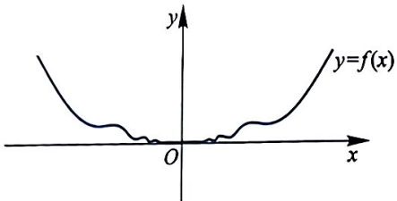
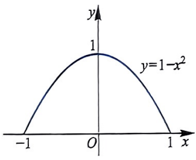
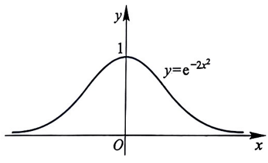
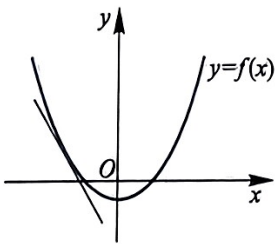
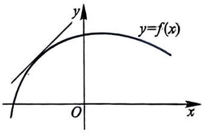
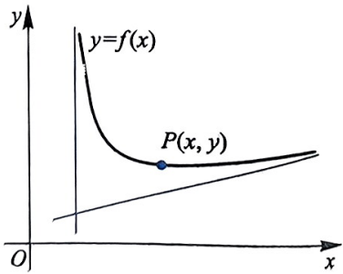
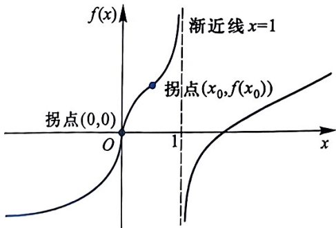
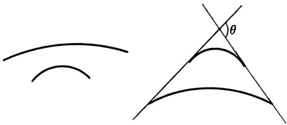
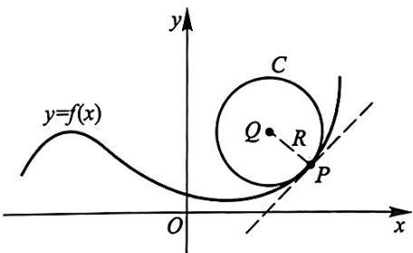

# 第4章 微分中值定理及导数应用

微分中值定理和泰勒定理在微积分学中占据非常重要的地位, 它揭示了函数及其导数之间的关系, 是进一步研究函数性态的理论基础. 微分中值定理由多个相互关联的定理组成, 从内容上看, 微分中值定理建立了函数的整体与局部的关系. 本章还着重介绍了利用导数来分析函数的性态, 例如函数的单调性、极值、凹凸性等, 让我们对函数的性质和图像等有一个较完整的了解.

## §4.1 微分中值定理

### 一、极值与费马定理

微分中值定理的建立源于函数极值的研究. 为此, 我们首先介绍函数极值的概念与性质.

**定义 4.1.1** 设函数 f 在  $x_{0}$  的某个邻域内有定义. 如果存在  $\delta > 0$ , 使得对任何  $x \in (x_{0} - \delta, x_{0} + \delta)$ , 恒有

$$
f (x) \leqslant f (x _ {0}) \quad (\text {或} f (x) \geqslant f (x _ {0})),
$$

就称 $f(x_0)$ 为函数 $f$ 的一个极大值 (或极小值), $x = x_0$ 为 $f$ 的一个极大值点 (或极小值点). 极大值和极小值统称为极值, 极大值点和极小值点统称为极值点.

显然，“极大”或“极小”仅是一个局部概念，不具有整体性。对给定的函数，极大(小)值点可能不存在，也可能存在多个。同样，同一函数的两个极大值有可能不相等。从定义来看，极值点 $x_0$ 必须是 $f$ 定义域的内点（需要在 $x_0$ 的两侧比较函数的大小）。如果 $f$ 仅在 $x_0$ 的一侧有定义，那么 $x_0$ 不可能为 $f$ 的一个极值点。

可微函数的极值点有一个非常容易检验的特点. 为说明这一特点, 设 $f$ 在 $x = x_0$ 处可微, 我们不妨假定 $x_0$ 为 $f$ 的一个极小值点, 则当 $x$ 充分接近 $x_0$ 时, 总有 $f(x) - f(x_0) \geqslant 0$. 于是, 由极限的保号性, 有

$$
f _ {-} ^ {\prime} (x _ {0}) = \lim _ {x \to x _ {0} ^ {-}} \frac {f (x) - f (x _ {0})}{x - x _ {0}} \leqslant 0, \quad f _ {+} ^ {\prime} (x _ {0}) = \lim _ {x \to x _ {0} ^ {+}} \frac {f (x) - f (x _ {0})}{x - x _ {0}} \geqslant 0.
$$

注意到 $f_{-}^{\prime}(x_0) = f_{+}^{\prime}(x_0) = f^{\prime}(x_0)$, 因此必有 $f^{\prime}(x_0) = 0$. 由此我们证明了下述费马①定理.

**定理 4.1.2** (费马定理) 设  $x_{0}$  为函数 f 的极值点. 如果 f 在  $x_{0}$  处可微, 那么

$$
f ^ {\prime} (x _ {0}) = 0.
$$

### 二、罗尔定理

如果可微函数 $f$ 的最大 (小) 值 $f(x_0)$ 在定义区间的内部取到, 那么这个最大 (小) 值必定为 $f$ 的极大 (小) 值, 因此由费马定理, $f'(x_0) = 0$.

以下的罗尔 $^{②}$ 定理给出的条件, 可以确保 f 至少有一个最大或最小值在定义区间的内部取到, 然后也就得出在定义区间内部可微函数必有导数等于零的点.

**定理 4.1.3**（罗尔定理）如果函数 $f$ 满足

(1) 在闭区间 $[a, b]$ 上连续;

(2) 在开区间 $(a, b)$ 内可导;

(3) $f(a) = f(b)$,

**重难点讲解费马定理与罗尔定理**

那么至少存在一点 $\xi \in (a,b)$, 使得 $f'(\xi) = 0$.

证明:(a) 如果 $f$ 在 $[a, b]$ 上为常数, 那么对 $(a, b)$ 内的任何点 $\xi$, 都有 $f'(\xi) = 0$.

(b) 如果 $f$ 在 $[a, b]$ 上不为常数, 那么存在 $x_0 \in (a, b)$, 使得 $f(x_0) \neq f(a)$. 不妨设 $f(x_0) < f(a)$. 于是 $f(a)$ 和 $f(b)$ 都不是 $f$ 在 $[a, b]$ 上的最小值, 其最小值必定在区间 $(a, b)$ 的内部某点 $x = \xi$ 取到. 由费马定理, 必有 $f'(\xi) = 0$.

从上述证明中我们看到, 罗尔定理中的介值点 $\xi$ 可以是一个最大或最小值点. 当然, 对一般函数, 完全可能存在多个导数为零的点.

#### 例 4.1.4 设 $a \in (0, \pi)$, $f(x) = (x - a) \sin x$, 证明: 存在 $\xi \in (0, \pi)$, 使得 $f''(\xi) = 0$.

证明:显然 $f$ 二阶可导. 因为 $f(0) = f(a) = f(\pi) = 0$, 所以根据罗尔定理, 在 $(0, a)$ 和 $(a, \pi)$ 内分别存在 $\xi_1$ 和 $\xi_2$, 使得 $f'(\xi_1) = f'(\xi_2) = 0$. 易

微分中值定理及导数应用

> **注：** ① 费马 (Fermat, 1601—1665), 法国数学家、物理学家. 身为律师, 费马曾担任图卢兹议会的顾问 30 多年, 利用闲暇时间从事数学研究. 费马在笛卡儿之前就系统地引入了直线坐标, 并用于几何学. 他提出了著名的费马大定理. 费马所著《求最大和最小的方法》一书, 在微分与积分演算史上占有重要地位. 他在概率论方面也做出了一定的贡献. 费马还研究了几何光学的基本原理, 在此基础上得出了光的反射和折射定律. 费马在数学和物理学方面的许多发现, 遗留在致朋友们的书信中, 1679 年由其子收集整理, 出版了费马全集, 名为《数学论集》.

> **注：** ② 罗尔 (Rolle, 1652—1719), 法国数学家. 罗尔出生于小店家庭, 只受过初等教育, 年轻时贫困潦倒, 靠充当公证人与律师抄录员的微薄收入养家糊口, 利用业余时间刻苦自学. 罗尔在数学上的成就主要是在代数方面, 专长于丢番图 (Diophantus) 方程的研究. 罗尔曾认为无穷小方法由于缺乏理论基础将导致谬误, 后来罗尔承认他已经放弃了自己的观点, 并且充分认识到无穷小分析新方法的价值. 罗尔于 1691 年在题为《任意次方程的一个解法的证明》的论文中指出: 在多项式方程 $f(x) = 0$ 的两个相邻的实根之间, 方程 $f'(x) = 0$ 至少有一个根. 1846 年, 尤斯托·贝拉维蒂斯将这一定理推广到可微函数, 并把此定理命名为罗尔定理.

> **注：** $f(x) = 0$

> **注：** $f^{\prime}(x) = 0$

知, $f'$ 在 $[\xi_1, \xi_2]$ 上满足罗尔定理的条件, 故对 $f'$ 再次应用罗尔定理, 可知存在 $\xi \in (\xi_1, \xi_2) \subset (0, \pi)$, 使得 $f''(\xi) = 0$.

[QR CODE]

我们常常利用罗尔定理来证明函数的导函数的零点, 但罗尔定理中第 (3)个条件要求函数在区间端点处的函数值相同, 这个在使用中很不方便. 下面的定理避开了这个条件, 是罗尔定理的一个推广.

微分中值定理问题

### 三、拉格朗日中值定理

**定理 4.1.5** (拉格朗日 $^{①}$ 中值定理) 如果函数 f 满足

(1) 在闭区间 $[a, b]$ 上连续;

(2) 在开区间 $(a, b)$ 内可导,

那么至少存在一点 $\xi \in (a,b)$，使得

$$
f ^ {\prime} (\xi) = \frac {f (b) - f (a)}{b - a} \quad \text {或者} \quad f (b) - f (a) = f ^ {\prime} (\xi) (b - a).
$$

证明:作函数

$$
\varphi (x) = f (x) - \left[ f (a) + \frac {f (b) - f (a)}{b - a} (x - a) \right],
$$

那么 $\varphi(x)$ 在闭区间 $[a, b]$ 上连续, 在开区间 $(a, b)$ 内可导, 且 $\varphi(a) = \varphi(b) = 0$. 由罗尔定理, 至少存在一点 $\xi \in (a, b)$, 使得 $\varphi'(\xi) = 0$, 即

$$
\varphi^ {\prime} (\xi) = f ^ {\prime} (\xi) - \frac {f (b) - f (a)}{b - a} = 0,
$$

从而证明了拉格朗日中值定理.

若在拉格朗日中值定理中加上条件“ $f(a)=f(b)$ ”，即为罗尔定理，所以罗尔定理是拉格朗日中值定理的特殊情况.

**推论 4.1.6** 若  $f'$  在  $(a, b)$  内存在且恒为零, 则 f 在  $(a, b)$  内为常数.

证明:对 $(a, b)$ 内的任意两点 $x_{1}, x_{2} (x_{1} < x_{2})$，根据拉格朗日中值定理，存在 $\xi \in (x_{1}, x_{2})$，使得 $f(x_{2}) - f(x_{1}) = f'(\xi)(x_{2} - x_{1}) = 0$，从而 $f(x_{1}) = f(x_{2})$。因此 $f$ 在 $(a, b)$ 内为常数。

#### 例 4.1.7 证明恒等式:

(1) $\arcsin x + \arccos x = \frac{\pi}{2} \quad (-1 \leqslant x \leqslant 1)$;

(2) $\arctan x + \operatorname{arccot} x = \frac{\pi}{2} \quad (\tilde{x} \in \mathbb{R}).$

证明:(1) 因为  $(\arcsin x + \arccos x)' \equiv 0$ ，所以由拉格朗日中值定理，

$$
\arcsin x + \arccos x = C,
$$

109

> **注：** ① 拉格朗日 (Lagrange, 1736–1813), 法国数学家、物理学家. 他在数学、力学和天文学三个学科领域中都有历史性的贡献, 但他主要是数学家, 研究力学和天文学的目的是表明数学分析的威力. 他是数学分析的开拓者, 是分析力学的创立者, 也是天体力学的奠基者. 他的全部著作、论文、学术报告记录和学术通讯超过500篇.

§4.1 微分中值定理

其中 $C$ 为常数. 再令 $x = \frac{\sqrt{2}}{2}$ 即可确定 $C = \frac{\pi}{2}$.

(2) 同理可得, 略.

#### 例 4.1.8 证明当 $x > 0$ 时, 有不等式 $\frac{1}{1 + x} < \ln \left(1 + \frac{1}{x}\right) < \frac{1}{x}$.

证明:令 $f(x) = \ln x (x > 0)$，在闭区间 $[x, 1 + x]$ 上应用拉格朗日中值定理，有

$$
\ln (1 + x) - \ln x = {\frac {1}{\xi}} (1 + x - x) = {\frac {1}{\xi}} (\text {其中} x <   \xi <   1 + x).
$$

因此

$$
\frac {1}{1 + x} <   \ln (1 + x) - \ln x = \frac {1}{\xi} <   \frac {1}{x}.
$$

### 四、柯西中值定理

柯西中值定理是比罗尔定理和拉格朗日中值定理更为一般的结论.

**重难点讲解**
拉格朗日中值定理与柯西中值定理

**定理 4.1.9** (柯西中值定理) 设函数 f 和 g 在  $[a, b]$  上连续, 在  $(a, b)$  内可导, 且  $g'$  在  $(a, b)$  内没有零点, 则至少存在一点  $\xi \in (a, b)$ , 使得

$$
\frac {f (b) - f (a)}{g (b) - g (a)} = \frac {f ^ {\prime} (\xi)}{g ^ {\prime} (\xi)}.
$$

证明:因为 $g'$ 在 $(a, b)$ 内没有零点，所以

$$
g (b) - g (a) = g ^ {\prime} (\xi) (b - a) \neq 0.
$$

作函数 $\varphi(x) = f(x) - \frac{f(b) - f(a)}{g(b) - g(a)} g(x)$, 由条件可知, $\varphi(x)$ 在闭区间 $[a, b]$ 上连续, 在开区间 $(a, b)$ 内可导, 且 $\varphi(a) = \varphi(b) = \frac{f(a)g(b) - f(b)g(a)}{g(b) - g(a)}$. 由罗尔定理可得至少存在一点 $\xi \in (a, b)$, 使得 $\varphi'(\xi) = 0$, 即

$$
\varphi^ {\prime} (\xi) = f ^ {\prime} (\xi) - \frac {f (b) - f (a)}{g (b) - g (a)} g ^ {\prime} (\xi) = 0.
$$

从而证明了柯西中值定理.

上述中值定理的点 $\xi$ 可以表示成如下形式: $\xi = a + \theta (b - a)$, 其中 $\theta \in (0,1)$. 这样的表示形式有时使用起来会更加方便.

#### 例 4.1.10 设 b > a > 0, f 在 [a, b] 上连续, 在 (a, b) 内可导, 证明: 至少存在一点  $\xi \in (a, b)$ , 使得

$$
f (b) - f (a) = \xi f ^ {\prime} (\xi) \ln \frac {b}{a},
$$

110

证明:若将与 $\xi$ 无关的因子移到等式另一边，则可以等价地证明:至少存在一点 $\xi \in (a, b)$，使得

$$
\frac {f (b) - f (a)}{\ln b - \ln a} = \xi f ^ {\prime} (\xi).
$$

令 $g(x) = \ln x$ ，应用柯西中值定理即得所证结论.

## §4.2 洛必达法则

求函数极限时, 我们常常碰到计算分式形式的函数表达式的极限, 如形如 $\lim_{x\to x_0}\frac{f(x)}{g(x)}$ 的极限: (1) 当 $\lim_{x\to x_0}f(x), \lim_{x\to x_0}g(x)$ 皆存在且 $\lim_{x\to x_0}g(x) \neq 0$ 时, 我们可以通过极限的四则运算得到 $\lim_{x\to x_0}\frac{f(x)}{g(x)}$ 的值; (2) 当 $\lim_{x\to x_0}g(x) = 0$ 且 $\lim_{x\to x_0}f(x) = A \neq 0$ (或 $\infty$) 时, $\lim_{x\to x_0}\frac{f(x)}{g(x)} = \infty$; (3) 当 $\lim_{x\to x_0}f(x) = \lim_{x\to x_0}g(x) = 0$ 时, $\lim_{x\to x_0}\frac{f(x)}{g(x)}$ 的极限可能存在, 也可能不存在. 此时我们称极限 $\lim_{x\to x_0}\frac{f(x)}{g(x)}$ 为 “$\frac{0}{0}$ 型” 不定式. 这种无法定性的 “不定式” 可以细分为多种类型, 除了 “$\frac{0}{0}$ 型”, 类似地还有 “$\frac{\infty}{\infty}$ 型” “$0 \cdot \infty$ 型” “$\infty - \infty$ 型” “$1^\infty$ 型” “$\infty^0$ 型” 和 “$0^0$ 型” 等. 理论上, 其他类型的不定式都可化为 “$\frac{0}{0}$ 型” 或 “$\frac{\infty}{\infty}$ 型”. 下面我们介绍计算 “$\frac{0}{0}$ 型” 或 “$\frac{\infty}{\infty}$ 型” 不定式极限的方法——洛必达①法则.

**定理 4.2.1** (洛必达法则 I) 设函数 f 和 g 在  $x_{0}$  的某去心邻域  $\stackrel{\circ}{U}(x_{0})$  内可导, 且  $g' \neq 0$ . 如果  $\lim_{x \to x_{0}} f(x) = \lim_{x \to x_{0}} g(x) = 0$ , 且极限  $\lim_{x \to x_{0}} \frac{f'(x)}{g'(x)} = A$  (或  $\infty$ ), 那么

$$
\lim _ {x \to x _ {0}} \frac {f (x)}{g (x)} = \lim _ {x \to x _ {0}} \frac {f ^ {\prime} (x)}{g ^ {\prime} (x)}.
$$

证明:我们重新定义 $f(x_0) = g(x_0) = 0$，这个定义不影响定理中极限计算。于是 $f$ 和 $g$ 在 $x_0$ 的某邻域 $U(x_0)$ 内连续。根据柯西中值定理，对此邻域 $U(x_0)$ 内每个固定的 $x \neq x_0$，必定存在介于 $x_0$ 与 $x$ 之间的 $\xi$，使得

$$
\frac {f (x)}{g (x)} = \frac {f (x) - f (x _ {0})}{g (x) - g (x _ {0})} = \frac {f ^ {\prime} (\xi)}{g ^ {\prime} (\xi)}.
$$

> **注：** ① 洛必达 (L'Hospital, 1661—1704), 法国数学家. 他曾受袭侯爵衔, 并在军队中担任骑兵军官. 他 15 岁时就解出帕斯卡 (Pascal) 的摆线难题, 之后又解出约翰·伯努利向欧洲挑战的“最速降曲线问题”. 洛必达的《无穷小分析》(1696 年)一书是微积分学方面最早的教科书, 在 18 世纪时为一模范著作, 书中创造的一种算法, 即洛必达法则.

§4.2 洛必达法则

由于当 $x \neq x_0$ 且 $x \to x_0$ 时, 必然有 $\xi \neq x_0$, 且 $\xi \to x_0$. 从而

$$
\lim _ {x \to x _ {0}} \frac {f ^ {\prime} (\xi)}{g ^ {\prime} (\xi)} = \lim _ {x \to x _ {0}} \frac {f ^ {\prime} (x)}{g ^ {\prime} (x)}.
$$

因此

$$
\lim _ {x \to x _ {0}} \frac {f (x)}{g (x)} = \lim _ {x \to x _ {0}} \frac {f ^ {\prime} (x)}{g ^ {\prime} (x)}.
$$

#### 例 4.2.2 计算下列极限:

$$
\lim _ {x \to 1} \frac {x ^ {2} + 2 x - 3}{\sin \pi x};
$$

$$
\lim _ {x \to 0} \frac {1 - \cos 2 x}{x \tan x}.
$$

解:(1) 显然当 $x \to 1$ 时, $\lim_{x \to 1} \frac{x^2 + 2x - 3}{\sin \pi x}$ 为“$\frac{0}{0}$型”不定式. 又因为

$$
\lim _ {x \to 1} \frac {(x ^ {2} + 2 x - 3) ^ {\prime}}{(\sin \pi x) ^ {\prime}} = \lim _ {x \to 1} \frac {2 x + 2}{\pi \cos \pi x} = - \frac {4}{\pi},
$$

所以

$$
\lim _ {x \to 1} \frac {x ^ {2} + 2 x - 3}{\sin \pi x} = - \frac {4}{\pi}.
$$

(2) 显然当 $x \to 0$ 时, $\frac{1 - \cos 2x}{x \tan x}$ 为“$\frac{0}{0}$型”不定式. 由洛必达法则 I 有

$$
\lim _ {x \to 0} \frac {1 - \cos 2 x}{x \tan x} = \lim _ {x \to 0} \frac {(1 - \cos 2 x) ^ {\prime}}{(x \tan x) ^ {\prime}} = \lim _ {x \to 0} \frac {2 \sin 2 x}{\tan x + x \sec^ {2} x}.
$$

显然, 它仍然为 “ $\frac{0}{0}$  型” 不定式, 再次应用洛必达法则 I 有

$$
\begin{array}{r l} \lim _ {x \to 0} \frac {2 \sin 2 x}{\tan x + x \sec^ {2} x} & = \lim _ {x \to 0} \frac {(2 \sin 2 x) ^ {\prime}}{(\tan x + x \sec^ {2} x) ^ {\prime}} \\ & = \lim _ {x \to 0} \frac {4 \cos 2 x}{2 (1 + x \tan x) \sec^ {2} x} \\ & = 2. \end{array}
$$

所以

$$
\lim _ {x \to 0} \frac {1 - \cos 2 x}{x \tan x} = 2.
$$

多次应用洛必达法则在计算不定式的极限时是常见的. 为简单起见, 我们在计算时往往略去上述烦琐的说明过程, 只是简单地表示如下:

$$
\begin{array}{r l} \lim _ {x \to 0} \frac {1 - \cos 2 x}{x \tan x} & \stackrel {{\underline {{0}}}} {{=}} \lim _ {x \to 0} \frac {(1 - \cos 2 x) ^ {\prime}}{(x \tan x) ^ {\prime}} = \lim _ {x \to 0} \frac {2 \sin 2 x}{\tan x + x \sec^ {2} x} \\ & \stackrel {{\underline {{0}}}} {{=}} \lim _ {x \to 0} \frac {(2 \sin 2 x) ^ {\prime}}{(\tan x + x \sec^ {2} x) ^ {\prime}} = \lim _ {x \to 0} \frac {2 \cos 2 x}{(1 + x \tan x) \sec^ {2} x} \\ & = 2. \end{array}
$$

112

第4章

在理论上, 第一、第三个等式成立的前提是最后一个极限 $\lim_{x\to 0}\frac{2\cos 2x}{(1 + x\tan x)\sec^2x}$ 存在. 初学时在等号上标示“$\frac{0}{0}$”是必要的, 它表明在应用洛必达法则之前, 已确认过不定式的类型, 以免错误地使用洛必达法则.

在用洛必达法则求极限的过程中, 适当结合等价无穷小替换, 往往可以简化计算过程. 例如

$$
\lim _ {x \to 0} \frac {1 - \cos 2 x}{x \tan x} \stackrel {{\frac {0}{0}}} {{=}} \lim _ {x \to 0} \frac {\frac {1}{2} (2 x) ^ {2}}{x ^ {2}} = 2.
$$

另一方面, 如果不定式里含有极限不等于零的 (乘) 因子, 可在应用洛必达法则之前, 先计算该因子的极限, 并将其极限值从极限的不定式中分离出来, 以简化计算. (为什么?)

#### 例 4.2.3 计算极限 $\lim_{x\to \pi}\frac{\mathrm{e}^{x^2} - \mathrm{e}^{\pi^2}}{x\tan{x}}.$

解: $\lim_{x\to \pi}\frac{\mathrm{e}^{x^2} - \mathrm{e}^{\pi^2}}{x\tan{x}} = \lim_{x\to \pi}\frac{1}{x}\cdot \lim_{x\to \pi}\frac{\mathrm{e}^{x^2} - \mathrm{e}^{\pi^2}}{\tan{x}}\stackrel {0}{=}\frac{1}{\pi}\lim_{x\to \pi}\frac{2xe^{x^2}}{\sec^2x} = 2\mathrm{e}^{\pi^2}.$

对 “$\frac{\infty}{\infty}$ 型” 不定式, 有类似的洛必达法则. 下面给出更为一般的 “$\frac{*}{\infty}$ 型” 极限的计算方法, 其中分子 “\*” 表示可以不考虑分子的极限是否存在或为 $\infty$.

**定理 4.2.4** (洛必达法则 II) 设函数 f 和 g 在  $x_{0}$  的某去心邻域  $\mathring{U}(x_{0})$  内可导, 且  $g' \neq 0$ . 如果  $\lim_{x \to x_{0}} g(x) = \infty$ , 且极限  $\lim_{x \to x_{0}} \frac{f'(x)}{g'(x)} = A$  (或  $\infty$ ), 那么

$$
\lim _ {x \to x _ {0}} {\frac {f (x)}{g (x)}} = \lim _ {x \to x _ {0}} {\frac {f ^ {\prime} (x)}{g ^ {\prime} (x)}} = A (\text {或} \infty).
$$

这里我们略去本定理的证明, 其证明可参见数学分析教材.

#### 例 4.2.5 计算极限 $\lim_{x\to +\infty}\frac{\ln x}{x^a},a > 0.$

解: $\lim_{x\to +\infty}\frac{\ln x}{x^a} = \lim_{x\to +\infty}\frac{x^{-1}}{ax^{a - 1}} = \lim_{x\to +\infty}\frac{1}{ax^a} = 0.$

#### 例 4.2.6 计算 $\lim_{x\to +\infty}\frac{\ln(x - \ln x)}{x}.$

解:此为“$\frac{*}{\infty}$型”不定式.由洛必达法则Ⅱ,

$$
\begin{array}{r l} \lim _ {x \to + \infty} \frac {\ln (x - \ln x)}{x} & \stackrel {{\underline {{\underline {{\cdot}}}}}} {{=}} \lim _ {x \to + \infty} \frac {1 - \frac {1}{x}}{x - \ln x} = \lim _ {x \to + \infty} \frac {x - 1}{x (x - \ln x)} \\ & \stackrel {{\underline {{\underline {{\cdot}}}}}} {{=}} \lim _ {x \to + \infty} \frac {1}{2 x - \ln x - 1} \stackrel {{\underline {{\underline {{\cdot}}}}}} {{=}} \lim _ {x \to + \infty} \frac {0}{2 - \frac {1}{x}} = 0. \end{array}
$$

§4.2 洛必达法则

对于其他形式的不定式, 可以转化为上述两种基本形式, 再用洛必达法则计算极限值. 下面我们用一些例子说明, 如何将其他形式的不定式转化为上述两种基本形式.

#### 例 4.2.7 计算 $\lim_{x\to 0^{+}}x\ln x.$

$$
\lim _ {x \to 0 ^ {+}} x \ln x \stackrel {0 \cdot \infty} {=} \lim _ {x \to 0 ^ {+}} \frac {\ln x}{x ^ {- 1}} \stackrel {t = x ^ {- 1}} {=} - \lim _ {t \to + \infty} \frac {\ln t}{t} \stackrel {*} {=} - \lim _ {t \to + \infty} \frac {t ^ {- 1}}{1} = 0.
$$

#### 例 4.2.8 计算 $\lim_{x\to 0^{+}}x^{\sin x}$

解: $\lim_{x\to 0^{+}}x^{\sin x}\stackrel {0^{0}}{=} \lim_{x\to 0^{+}}\mathrm{e}^{\sin x\ln x} = \mathrm{e}^{\lim_{x\to 0^{+}}\sin x\ln x} = \mathrm{e}^{\lim_{x\to 0^{+}}x\ln x} = \mathrm{e}^{0} = 1.$

#### 例 4.2.9 计算 $\lim_{x\to 0^{+}}(1 + x)^{\frac{1}{x + \sin x}}.$

解: $\lim_{x\to 0^{+}}(1 + x)^{\frac{1}{x + \sin x}}\stackrel {\infty}{=}\mathrm{e}^{\lim_{x\to 0^{+}}\frac{\ln(1 + x)}{x + \sin x}} = \mathrm{e}^{\lim_{x\to 0^{+}}\frac{1}{(1 + x)(1 + \cos x)}} = \mathrm{e}^{\frac{1}{2}}.$

对于“ $1^{\infty}$ 型”不定式, 也可用 $\lim_{x\to 0}(1 + x)^{\frac{1}{x}} = \mathrm{e}$ 或 $\lim_{x\to \infty}\left(1 + \frac{1}{x}\right)^x = \mathrm{e}$ 来求得.

#### 例 4.2.10 计算 $\lim_{x\to 0^{+}}\left(\ln \frac{1}{x}\right)^{x}$

$$
\begin{array}{c} \lim _ {x \to 0 ^ {+}} \left(\ln \frac {1}{x}\right) ^ {x} \stackrel {{\infty^ {0}}} {{=}} \lim _ {x \to 0 ^ {+}} \mathrm{e} ^ {x \ln \ln \frac {1}{x}} = \mathrm{e} ^ {\lim _ {x \to 0 ^ {+}} x \ln \ln \frac {1}{x}} \stackrel {{t = \frac {1}{x}}} {{=}} \mathrm{e} ^ {\lim _ {t \to + \infty} \frac {\ln \ln t}{t}} \\ = \mathrm{e} ^ {\lim _ {t \to + \infty} \frac {1}{t \ln t}} = \mathrm{e} ^ {0} = 1. \end{array}
$$

#### 例 4.2.11 计算 $\lim_{x\to 1}\left(\frac{1}{\ln x} -\frac{\sin\frac{\pi x}{2}}{x - 1}\right)$

解:$\lim_{x\to 1}\left(\frac{1}{\ln x} -\frac{\sin\frac{\pi x}{2}}{x - 1}\right)$
$\stackrel {\infty -\infty}{=} \lim_{x\to 1}\frac{x - 1 - \sin\frac{\pi x}{2}\cdot\ln x}{(x - 1)\ln x}$
$\stackrel {\frac{0}{0}}{=} \lim_{x\to 1}\frac{1 - \frac{\pi}{2}\cos\frac{\pi x}{2}\cdot\ln x - \sin\frac{\pi x}{2}\cdot\frac{1}{x}}{\ln x + 1 - \frac{1}{x}}$
$\stackrel {\frac{0}{0}}{=} \lim_{x\to 1}\frac{\left(\frac{\pi}{2}\right)^{2}\sin\frac{\pi x}{2}\cdot\ln x - \pi\cos\frac{\pi x}{2}\cdot\frac{1}{x} + \sin\frac{\pi x}{2}\cdot\frac{1}{x^{2}}}{\frac{1}{x} + \frac{1}{x^{2}}}$
$= \frac{1}{2}.$

114

第4章

## §4.3 泰勒定理

在某点 $x_0$ 附近, 函数的微分知识告诉我们, 可以用一次多项式 (切线) 函数 $l(x) = f(x_0) + f'(x_0)(x - x_0)$ 来近似地替代曲线函数 $y = f(x)$. 但对于在 $x_0$ 附近变化较大的函数, 用一次多项式去近似是不够的. 例如考虑函数 $f(x) = x^2 + \sin^3 x$, 易知在 $x = 0$ 处 $f$ 的切线函数为 $y = 0$, 显然用 $y = 0$ 作为 $f(x) = x^2 + \sin^3 x$ 的近似并不理想. 在这种情形下, 我们就设想, 用更高阶的多项式去近似表示 $f$ 是否更理想呢? 例如, 用 $x^2$ 作为 $f(x) = x^2 + \sin^3 x$ 的近似应该更为精确. 本节我们介绍泰勒$^{\text{①}}$定理 (泰勒公式), 讨论怎样用多项式逼近函数, 并介绍泰勒公式的应用.

假设 $f$ 在 $x_0$ 处 $n$ 阶可导, 我们用一个多项式在 $x_0$ 点附近作为 $f$ 的近似, 称为函数 $f$ 的一个多项式逼近. 那么, 怎样的多项式是比较理想的呢? 如果一个 $n$ 次多项式 $P_n(x)$, 在 $x_0$ 点与函数 $f$ 有相同的函数值、有相同的一阶、二阶直至 $n$ 阶导数值, 那么用 $P_n(x)$ 来逼近 $f$ 应该是合适的. 若将多项式 $P_n(x)$ 表示成

$$
P _ {n} (x) = c _ {0} + c _ {1} (x - x _ {0}) + c _ {2} (x - x _ {0}) ^ {2} + \dots + c _ {n} (x - x _ {0}) ^ {n},
$$

使得

$$
P _ {n} (x _ {0}) = f (x _ {0}), \quad P _ {n} ^ {(k)} (x _ {0}) = f ^ {(k)} (x _ {0}), \quad k = 1, 2, \dots , n.\tag{*}
$$

通过计算易得

$$
c _ {0} = f (x _ {0}), \quad c _ {k} = \frac {f ^ {(k)} (x _ {0})}{k !}, \quad k = 1, 2, \dots , n.
$$

我们称满足 (\*) 式的 n 次多项式为函数 f 的泰勒多项式, 记为

$$
T _ {n} (x) = f (x _ {0}) + f ^ {\prime} (x _ {0}) (x - x _ {0}) + \frac {f ^ {\prime \prime} (x _ {0})}{2 !} (x - x _ {0}) ^ {2} + \dots + \frac {f ^ {(n)} (x _ {0})}{n !} (x - x _ {0}) ^ {n}.
$$

我们用它在 $x_0$ 附近逼近函数 $f$ 时, 两者之间的误差函数

$$
R _ {n} (x) = f (x) - T _ {n} (x)\tag{**}
$$

称为泰勒余项. 根据 $f$ 所满足的条件, 泰勒余项有不同的表示形式.

**定理 4.3.1** (泰勒公式 I) 设 f 在  $x_{0}$  处 n 阶可导, 则

$$
R _ {n} (x) = o ((x - x _ {0}) ^ {n}) \quad (x \to x _ {0}),
$$

**重难点讲解泰勒定理**

> **注：** (Taylor, 1685—1731)

> **注：** ① 泰勒 (Taylor, 1685—1731), 英国数学家. 泰勒 1709 年获法学学士学位, 1712 年当选为英国皇家学会会员, 并于两年后获法学博士学位, 同年出任英国皇家学会秘书. 泰勒的主要著作是 1715 年出版的《正的和反的增量方法》, 书中陈述了著名的泰勒定理, 开创了有限差分理论, 使任何单变量函数都可展开成幂级数; 同时亦使泰勒成了有限差分理论的奠基者. 此书还包括了常微分方程的奇异解、曲率问题之研究等. 泰勒还出版了另一名著《线性透视论》, 其中最突出的贡献是提出和使用 “没影点” 概念, 这对摄影测量制图学之发展有一定影响.

§4.3 泰勒定理

即

$$
f (x) = f (x _ {0}) + f ^ {\prime} (x _ {0}) (x - x _ {0}) + \dots + \frac {f ^ {(n)} (x _ {0})}{n !} (x - x _ {0}) ^ {n} + o ((x - x _ {0}) ^ {n}).
$$

我们称此公式为带佩亚诺 $^{①}$ 余项的泰勒公式.

证明:显然， $R_{n}^{(k)}(x)$ 在 $x_0$ 的某邻域内存在，并且由（\*\*）式知

$$
\lim _ {x \to x _ {0}} R _ {n} ^ {(k)} (x) = R _ {n} ^ {(k)} (x _ {0}) = 0 (k = 0, 1, 2, \dots , n - 1), R _ {n} ^ {(0)} (x) = R _ {n} (x).
$$

另一方面, 若令 $Q_{n}(x) = (x - x_{0})^{n}$, 则也有

$$
\lim _ {x \to x _ {0}} Q _ {n} ^ {(k)} (x) = Q _ {n} ^ {(k)} (x _ {0}) = 0 (k = 0, 1, 2, \dots , n - 1), Q _ {n} ^ {(0)} (x) = Q _ {n} (x).
$$

于是, 应用 $n - 1$ 次洛必达法则, 得

$$
\begin{array}{r l} \lim _ {x \to x _ {0}} \frac {R _ {n} (x)}{Q _ {n} (x)} & \stackrel {{0}} {{=}} \lim _ {x \to x _ {0}} \frac {R _ {n} ^ {\prime} (x)}{Q _ {n} ^ {\prime} (x)} \stackrel {{0}} {{=}} \dots \stackrel {{0}} {{=}} \lim _ {x \to x _ {0}} \frac {R _ {n} ^ {(n - 1)} (x)}{Q _ {n} ^ {(n - 1)} (x)} \\ & = \lim _ {x \to x _ {0}} \frac {f ^ {(n - 1)} (x) - f ^ {(n - 1)} (x _ {0}) - f ^ {(n)} (x _ {0}) (x - x _ {0})}{n ! (x - x _ {0})} \\ & = \frac {1}{n !} \left[ \lim _ {x \to x _ {0}} \frac {f ^ {(n - 1)} (x) - f ^ {(n - 1)} (x _ {0})}{x - x _ {0}} - f ^ {(n)} (x _ {0}) \right] = 0. \end{array}
$$

所以

$$
R _ {n} (x) = o (Q _ {n} (x)) = o ((x - x _ {0}) ^ {n}) \quad (x \to x _ {0}).
$$

通过简单计算, 可以得到在 $x_0 = 0$ 处常用的带佩亚诺余项的泰勒公式, 当 $x \to 0$ 时,

$$
\left(1\right) e ^ {x} = 1 + x + \frac {x ^ {2}}{2 !} + \dots + \frac {x ^ {n}}{n !} + o (x ^ {n});
$$

$$
(2) \sin x = x - \frac {x ^ {3}}{3 !} + \frac {x ^ {5}}{5 !} - \dots + (- 1) ^ {n - 1} \frac {x ^ {2 n - 1}}{(2 n - 1) !} + o (x ^ {2 n});
$$

$$
(3) \cos x = 1 - \frac {x ^ {2}}{2 !} + \frac {x ^ {4}}{4 !} - \dots + (- 1) ^ {n} \frac {x ^ {2 n}}{(2 n) !} + o (x ^ {2 n + 1});
$$

$$
(4) \ln (1 + x) = x - \frac {x ^ {2}}{2} + \frac {x ^ {3}}{3} - \dots + (- 1) ^ {n - 1} \frac {x ^ {n}}{n} + o (x ^ {n});
$$

$$
\begin{array}{c} (5) (1 + x) ^ {\alpha} = 1 + \alpha x + \frac {\alpha (\alpha - 1)}{2 !} x ^ {2} + \dots + \frac {\alpha (\alpha - 1) \cdots (\alpha - n + 1)}{n !} x ^ {n} + \\ o (x ^ {n}). \end{array}
$$

由于以上公式中带有一个高阶无穷小形式的余项, 故利用这些公式来计算

> **注：** ① 佩亚诺 (Peano, 1858—1932), 意大利数学家. 佩亚诺因作为符号逻辑的先驱和公理化方法的推行人而著名. 1889 年佩亚诺出版了《几何原理的逻辑表述》, 以简明的符号及公理体系为数理逻辑和数学基础的研究开创了新局面. 佩亚诺编著了《数学公式汇编》《数学百科全书》, 他还做了出色的教学工作和数学史的研究工作.

116

第4章

极限是方便的.

#### 例 4.3.2 求下列极限:

(1) $\lim_{x\to 0}\frac{x - \sin x}{x^3};$ (2) $\lim_{x\to 0}\frac{\sin x^2 + x\ln(1 - x)}{x^3}.$

解:(1) $\lim_{x\to 0}\frac{x - \sin x}{x^3} = \lim_{x\to 0}\frac{x - \left(x - \frac{x^3}{3!} + o(x^4)\right)}{x^3} = \lim_{x\to 0}\frac{\frac{1}{6}x^3 + o(x^4)}{x^3} = \frac{1}{6}.$

$$
\begin{array}{c} (2) \lim _ {x \to 0} \frac {\sin x ^ {2} + x \ln (1 - x)}{x ^ {3}} = \lim _ {x \to 0} \frac {\left(x ^ {2} - \frac {x ^ {6}}{3 !} + o (x ^ {8})\right) + x \left(- x - \frac {x ^ {2}}{2} + o (x ^ {2})\right)}{x ^ {3}} \\ = \lim _ {x \to 0} \frac {- \frac {1}{2} x ^ {3} + o (x ^ {3})}{x ^ {3}} = - \frac {1}{2}. \end{array}
$$

**定理 4.3.3** (泰勒公式 II) 设函数 f 在 [a, b] 上存在 n 阶连续的导函数，在  $(a, b)$  内存在  $(n+1)$  阶导数，则对任意给定的  $x, x_{0} \in [a, b] (x \neq x_{0})$ ，存在  $\xi = x_{0} + \theta(x - x_{0}) \in (a, b)$  (其中  $\theta \in (0, 1)$ )，使得

$$
R _ {n} (x) = f (x) - T _ {n} (x) = \frac {f ^ {(n + 1)} (\xi)}{(n + 1) !} (x - x _ {0}) ^ {n + 1},
$$

即

$$
f (x) = f (x _ {0}) + f ^ {\prime} (x _ {0}) (x - x _ {0}) + \dots + \frac {f ^ {(n)} (x _ {0})}{n !} (x - x _ {0}) ^ {n} + \frac {f ^ {(n + 1)} (\xi)}{(n + 1) !} (x - x _ {0}) ^ {n + 1}.
$$

我们称此公式为 $f$ 在 $x_0$ 处的 $n$ 阶带拉格朗日余项的泰勒公式. 特别地, 当 $x_0 = 0$ 时, 称为带拉格朗日余项的麦克劳林①公式. 以上泰勒公式或麦克劳林公式也称为泰勒展开式或麦克劳林展开式.

证明:因为  $R_{n}^{(k)}(x_{0})=0\ (k=0,1,2,\cdots,n)$ ，作辅助函数

$$
\varphi (t) = R _ {n} (t) - R _ {n} (x) \frac {(t - x _ {0}) ^ {n + 1}}{(x - x _ {0}) ^ {n + 1}}.
$$

易验证  $\varphi^{(k)}(x_{0})=0\ (k=0,1,2,\cdots,n)$  且  $\varphi(x)=0$ . 不妨设  $x>x_{0}$ ，则  $\varphi(t)$  在  $[x_{0},x]$  上连续，在  $(x_{0},x)$  内可导，且  $\varphi(x_{0})=\varphi(x)$ . 根据罗尔定理，得到  $\varphi'(t)$  的一个异于  $x_{0}$  的零点  $\xi_{1}$ ; 然后对  $\varphi'(t)$  在  $[x_{0},\xi_{1}]$  上再应用罗尔定理，得到  $\varphi''(t)$  的一个异于  $x_{0}$  的零点  $\xi_{2}$ ; 重复这一工作，可以得到:存在  $\xi=\xi_{n+1}$ ，使得  $\varphi^{(n+1)}(\xi)=0$ , 显然  $\xi_{k}\ (k=1,2,\cdots,n+1)$  单调地靠近  $x_{0}$ . 又因为

$$
\varphi^ {(n + 1)} (t) = R _ {n} ^ {(n + 1)} (t) - R _ {n} (x) \frac {(n + 1) !}{(x - x _ {0}) ^ {n + 1}}
$$

> **注：** ① 麦克劳林 (Maclaurin, 1698—1746), 英国数学家. 麦克劳林 1715 年获硕士学位, 1717 年任阿伯丁马里歇尔学院数学教授, 1719 年当选为皇家学会会员, 1725 年任爱丁堡大学数学教授. 他最有影响的著作《流数论》为分析形式化的前驱, 他在书中还叙述了级数收敛性的积分判别准则, 并给出了后来以他的名字命名的麦克劳林级数. 他曾因《论潮汐》一文而与欧拉、丹尼尔·伯努利共获 1740 年的法国科学院奖.

§4.3 泰勒定理

$$
= f ^ {(n + 1)} (t) - R _ {n} (x) \frac {(n + 1) !}{(x - x _ {0}) ^ {n + 1}},
$$

而 $\varphi^{(n + 1)}(\xi) = 0$ ，所以 $R_{n}(x) = \frac{f^{(n + 1)}(\xi)}{(n + 1)!} (x - x_{0})^{n + 1}.$

下面是几个常用函数的麦克劳林展开式, 请读者自行验证:

$$
\mathrm{e} ^ {x} = 1 + x + \frac {x ^ {2}}{2 !} + \dots + \frac {x ^ {n}}{n !} + \frac {\mathrm{e} ^ {\theta x}}{(n + 1) !} x ^ {n + 1}, \theta \in (0, 1);
$$

$$
\sin x = x - \frac {x ^ {3}}{3 !} + \frac {x ^ {5}}{5 !} - \dots + (- 1) ^ {n - 1} \frac {x ^ {2 n - 1}}{(2 n - 1) !} + (- 1) ^ {n} \frac {\cos \theta x}{(2 n + 1) !} x ^ {2 n + 1}, \theta \in (0, 1);
$$

$$
\cos x = 1 - \frac {x ^ {2}}{2 !} + \frac {x ^ {4}}{4 !} - \dots + (- 1) ^ {n} \frac {x ^ {2 n}}{(2 n) !} + (- 1) ^ {n + 1} \frac {\cos \theta x}{(2 n + 2) !} x ^ {2 n + 2}, \theta \in (0, 1);
$$

$$
\ln (1 + x) = x - \frac {x ^ {2}}{2} + \frac {x ^ {3}}{3} - \dots + (- 1) ^ {n - 1} \frac {x ^ {n}}{n} + (- 1) ^ {n} \frac {x ^ {n + 1}}{(n + 1) (1 + \theta x) ^ {n + 1}},
$$

$$
\theta \in (0, 1);
$$

$$
(5) (1 + x) ^ {\alpha} = 1 + \alpha x + \frac {\alpha (\alpha - 1)}{2 !} x ^ {2} + \dots + \frac {\alpha (\alpha - 1) \cdots (\alpha - n + 1)}{n !} x ^ {n} + R _ {n} (x),
$$

其中 $R_{n}(x) = \frac{\alpha(\alpha - 1)(\alpha - 2)\cdots(\alpha - n)}{(n + 1)!}\cdot (1 + \theta x)^{\alpha - n - 1}x^{n + 1},\theta \in (0,1).$

#### 例 4.3.4 设  $f(x)$  在  $(a,b)$  内二阶可导, 且  $f''(x) \geqslant 0, x \in (a,b)$ , 证明:  $\forall x_{1}, x_{2} \in (a,b)$ , 有  $f\left(\frac{x_{1} + x_{2}}{2}\right) \leqslant \frac{f(x_{1}) + f(x_{2})}{2}$ .

证明: $f(x)$ 在 $x = \frac{x_1 + x_2}{2}$ 处的一阶泰勒公式为

$$
f (x) = f \left(\frac {x _ {1} + x _ {2}}{2}\right) + f ^ {\prime} \left(\frac {x _ {1} + x _ {2}}{2}\right) \cdot \left(x - \frac {x _ {1} + x _ {2}}{2}\right) + \frac {f ^ {\prime \prime} (\xi)}{2} \left(x - \frac {x _ {1} + x _ {2}}{2}\right) ^ {2},
$$

其中 $\xi$ 介于 $x$ 与 $\frac{x_1 + x_2}{2}$ 之间, 所以有

$$
f (x _ {1}) = f \left(\frac {x _ {1} + x _ {2}}{2}\right) + f ^ {\prime} \left(\frac {x _ {1} + x _ {2}}{2}\right) \cdot \frac {x _ {1} - x _ {2}}{2} + \frac {f ^ {\prime \prime} (\xi_ {1})}{2} \left(\frac {x _ {1} - x _ {2}}{2}\right) ^ {2},
$$

$$
f (x _ {2}) = f \left(\frac {x _ {1} + x _ {2}}{2}\right) - f ^ {\prime} \left(\frac {x _ {1} + x _ {2}}{2}\right) \cdot \frac {x _ {1} - x _ {2}}{2} + \frac {f ^ {\prime \prime} (\xi_ {2})}{2} \left(\frac {x _ {1} - x _ {2}}{2}\right) ^ {2},
$$

其中 $\xi_{i}$ 介于 $x_{i}$ 与 $\frac{x_1 + x_2}{2}$ 之间 $(i = 1,2)$. 因此

$$
f (x _ {1}) + f (x _ {2}) = 2 f \left(\frac {x _ {1} + x _ {2}}{2}\right) + \frac {f ^ {\prime \prime} (\xi_ {1}) + f ^ {\prime \prime} (\xi_ {2})}{2} \left(\frac {x _ {1} - x _ {2}}{2}\right) ^ {2}
$$

118

第4章

$$
\geqslant 2 f \left(\frac {x _ {1} + x _ {2}}{2}\right).
$$

即

$$
f \left(\frac {x _ {1} + x _ {2}}{2}\right) \leqslant \frac {f (x _ {1}) + f (x _ {2})}{2}.
$$

#### 例 4.3.5 求证:当 $x > 0$ 时，$\forall n \in \mathbb{N}_{+}$，有

$$
x - \frac {x ^ {2}}{2} + \frac {x ^ {3}}{3} - \dots - \frac {x ^ {2 n}}{2 n} <   \ln (1 + x) <   x - \frac {x ^ {2}}{2} + \frac {x ^ {3}}{3} - \dots + \frac {x ^ {2 n - 1}}{2 n - 1}.
$$

证明:由 $\ln (1 + x)$ 的麦克劳林展开式，有

$$
\ln (1 + x) - \left(x - \frac {x ^ {2}}{2} + \frac {x ^ {3}}{3} - \dots + (- 1) ^ {n - 1} \frac {x ^ {n}}{n}\right) = (- 1) ^ {n} \frac {x ^ {n + 1}}{(n + 1) (1 + \theta x) ^ {n + 1}}, \theta \in (0, 1).
$$

因为 $x > 0$ ，所以等式右边当 $n$ 为偶数时，取正值；当 $n$ 为奇数时，取负值.即知所证不等式成立.

#### 例 4.3.6 求极限 $\lim_{n\to \infty}\left(1 + \frac{1}{n^2}\right)\left(1 + \frac{2}{n^2}\right)\dots \left(1 + \frac{n}{n^2}\right)$.

解:记 $a_{n} = \left(1 + \frac{1}{n^{2}}\right)\left(1 + \frac{2}{n^{2}}\right)\dots \left(1 + \frac{n}{n^{2}}\right)$，则 $\ln a_{n} = \sum_{k=1}^{n}\ln \left(1 + \frac{k}{n^{2}}\right)$.

由例4.3.5知, 当 $x > 0$ 时, 有 $x - \frac{x^2}{2} < \ln (1 + x) < x$. 因此

$$
\frac {k}{n ^ {2}} - \frac {\dot {k} ^ {2}}{2 n ^ {4}} <   \ln \left(1 + \frac {k}{n ^ {2}}\right) <   \frac {k}{n ^ {2}} (k = 1, 2, \dots , n).
$$

求和得

$$
\frac {1}{n ^ {2}} \sum_ {k = 1} ^ {n} k - \frac {1}{2 n ^ {4}} \sum_ {k = 1} ^ {n} k ^ {2} <   \ln a _ {n} <   \frac {1}{n ^ {2}} \sum_ {k = 1} ^ {n} k,
$$

即有

$$
\frac {1}{2} \left(1 + \frac {1}{n}\right) - \frac {(n + 1) (2 n + 1)}{1 2 n ^ {3}} <   \ln a _ {n} <   \frac {1}{2} \left(1 + \frac {1}{n}\right).
$$

由夹逼定理得 $\lim_{n\to \infty}\ln a_n = \frac{1}{2}$ ，从而

$$
\lim _ {n \to \infty} \left(1 + \frac {1}{n ^ {2}}\right) \left(1 + \frac {2}{n ^ {2}}\right) \dots \left(1 + \frac {n}{n ^ {2}}\right) = \lim _ {n \to \infty} a _ {n} = \sqrt {\mathrm{e}}.
$$

#### 例 4.3.7 试利用  $e^{x}$  的麦克劳林公式计算 e 的近似值, 使误差不超过  $10^{-3}$ .

解: $e^{x}=1+x+\frac{x^{2}}{2!}+\cdots+\frac{x^{n}}{n!}+\frac{e^{\theta x}}{(n+1)!}x^{n+1},\theta\in(0,1).$  令 x=1, 得

$$
\mathrm{e} = 1 + 1 + \frac {1}{2 !} + \dots + \frac {1}{n !} + \frac {\mathrm{e} ^ {\theta}}{(n + 1) !}, \theta \in (0, 1).
$$

§4.3 泰勒定理

第4章

用 $1 + 1 + \frac{1}{2!} +\dots +\frac{1}{n!}$ 作为e的近似值，其误差为

$$
\left| \frac {\mathrm{e} ^ {\theta}}{(n + 1) !} \right| <   \frac {3}{(n + 1) !}.
$$

现取 $n = 7$, 得 $\frac{3}{(n + 1)!} < 0.6 \times 10^{-3}$, 而 $1 + 1 + \frac{1}{2!} + \cdots + \frac{1}{7!}$ 的最后五项计算时取小数点后面4位, 第5位四舍五入, 总误差不超过

$$
(0. 5 \times 1 0 ^ {- 4}) \times 5 = 0. 2 5 \times 1 0 ^ {- 3},
$$

从而

$$
\mathrm{e} \approx 1 + 1 + 0. 5 + 0. 1 6 6 7 + 0. 0 4 1 7 + 0. 0 0 8 3 + 0. 0 0 1 4 + 0. 0 0 0 2 = 2. 7 1 8 3,
$$

其误差不超过 $0.6 \times 10^{-3} + 0.25 \times 10^{-3} = 0.85 \times 10^{-3} < 10^{-3}$.

## §4.4 函数单调性

有了前述的这些中值定理, 分析函数的性态就会方便许多, 在此我们首先分析一下函数在定义区间内的单调性.

**定理 4.4.1** 设 f 在  $[a, b]$  上连续, 在  $(a, b)$  内可导, 则 f 在  $[a, b]$  上单调增加 (减少) 的充要条件是  $f'(x) \geqslant 0 \left( f'(x) \leqslant 0 \right)$ ,  $\forall x \in (a, b)$ .

证明: (充分性) 如果 $f'(x) \geqslant 0$, 那么对 $[a, b]$ 上的任何两点 $x_1, x_2 (x_1 < x_2)$, 由拉格朗日中值定理, 存在 $\xi \in (x_1, x_2)$, 使得 $f(x_2) - f(x_1) = f'(\xi)(x_2 - x_1) \geqslant 0$, 即 $f(x_2) \geqslant f(x_1)$, 从而 $f$ 在 $[a, b]$ 上单调增加.

(必要性) 若 $f$ 在 $[a, b]$ 上单调增加, 则对任何 $x \in (a, b)$,

$$
\frac {f (x + \Delta x) - f (x)}{\Delta x} \geqslant 0.
$$

由导数定义和函数极限的保号性, 知

$$
f ^ {\prime} (x) = \lim _ {\Delta x \to 0} \frac {f (x + \Delta x) - f (x)}{\Delta x} \geqslant 0.
$$

同理可证, 函数 $f$ 单调减少的充要条件是 $f'(x) \leqslant 0$.

**定理 4.4.2** 如果 f 在  $[a,b]$  上连续, 在  $(a,b)$  内可导,  $f'$  在  $(a,b)$  内恒正 (恒负), 那么 f 在  $[a,b]$  上严格单调增加 (减少).

证明留给读者作为练习，

$f'$ 恒正或恒负, 也即 $f'$ 没有零点, 但这并不是严格单调的必要条件. 例如, 函数 $f(x) = x^3$ 严格单调, 但其导函数却有一个零点.

120

**定理 4.4.3** 设 $f$ 在 $[a, b]$ 上连续, 在 $(a, b)$ 内可导. 则 $f$ 在 $[a, b]$ 上严格单调增加的充要条件是 $f'(x) \geqslant 0$, 且 $f'$ 的任何一部分零点都不能构成 (非单点) 区间.

#### 例 4.4.4 分析函数  $f(x)=(2x+1)\mathrm{e}^{-x}$  的单调性.

解:由于 $f'(x) = (1 - 2x)\mathrm{e}^{-x}$，故当 $x > \frac{1}{2}$ 时，$f'(x) < 0$；当 $x < \frac{1}{2}$ 时，$f'(x) > 0$。因此，$f$ 在 $\left(-\infty, \frac{1}{2}\right]$ 内严格单调增加，在 $\left[\frac{1}{2}, +\infty\right)$ 内严格单调减少。

利用函数的单调性, 可以简单地证明一些不等式.

#### 例 4.4.5 证明不等式:  $\arctan x > x - \frac{x^{3}}{3} (x > 0)$ .

证明:考虑函数 $f(x) = \arctan x - \left(x - \frac{x^3}{3}\right), x > 0$. 由于函数 $f$ 在 $[0, +\infty)$ 上连续，在 $(0, +\infty)$ 内可导，且

$$
f ^ {\prime} (x) = \frac {1}{1 + x ^ {2}} - (1 - x ^ {2}) = \frac {x ^ {4}}{1 + x ^ {2}} > 0, x > 0.
$$

因此 $f$ 在 $[0, +\infty)$ 上严格单调增加, 从而当 $x > 0$ 时, $f(x) > f(0) = 0$. 所以当 $x > 0$ 时, 有 $\arctan x > x - \frac{x^3}{3}$.

#### 例 4.4.6 证明: 当  $x \neq 0$  时,  $e^{x} > 1 + x$ .

证明:令 $f(x) = \mathrm{e}^{x} - (1 + x)$，则 $f'(x) = \mathrm{e}^{x} - 1$.

显然, 当 x < 0 时,  $f'(x) < 0$ ; 当 x > 0 时,  $f'(x) > 0$ .

因此, $f$ 在 $(- \infty, 0]$ 上严格单调减少, 在 $[0, +\infty)$ 上严格单调增加.

于是, $f(0) = 0$ 是 $f(x)$ 的最小值, 所以当 $x \neq 0$ 时, 总有

$$
f (x) = \mathrm{e} ^ {x} - (1 + x) > f (0) = 0.
$$

即当 $x \neq 0$ 时, $\mathrm{e}^x > 1 + x$.

## §4.5 函数极值

费马定理给出了可微函数极值点的必要条件: $f'(x_0) = 0$ 。我们称 $f'$ 的零点为 $f$ 的驻点（或稳定点）。因此费马定理可以表述为:可微函数的极值点必定是其驻点。这个条件仅仅是必要而非充分的，例如 $f(x) = x^3$，虽然 $f'(0) = 0$，但 $x_0 = 0$ 不是极值点。当然，极值点也可能在不可导的点取到，所以函数的极值点一定是驻点或不可导的点。下面我们考虑可微函数有极值点的充分条件。

**重难点讲解函数的单调性、极值和不等式证明**

**定理 4.5.1** (极值第一判别法) 如果 f 在  $x_{0}$  的某邻域内连续,  $f'$  在  $x_{0}$  的两侧异号, 那么  $x_{0}$  必定是 f 的极值点. 具体地,

§4.5 函数极值

(1) 若 $\exists \delta > 0, \forall x \in (x_0 - \delta, x_0)$, 均有 $f'(x) \geqslant 0, \forall x \in (x_0, x_0 + \delta)$, 均有 $f'(x) \leqslant 0$, 则 $x_0$ 是 $f$ 的极大值点;

(2) 若 $\exists \delta > 0, \forall x \in (x_0 - \delta, x_0)$, 均有 $f'(x) \leqslant 0, \forall x \in (x_0, x_0 + \delta)$, 均有 $f'(x) \geqslant 0$, 则 $x_0$ 是 $f$ 的极小值点.

导函数在 $x_0$ 两侧的不同单调性, 确保了 $f(x_0)$ 取到极值. 需要指出的是, 这样的两侧单调性是充分条件, 并非必要条件. 例如

$$
f (x) = \left\{ \begin{array}{l l} x ^ {2} \left(1 + \sin^ {2} \frac {1}{x}\right), & x \neq 0, \\ 0, & x = 0 \end{array} \right.
$$

显然 $x = 0$ 为 $f$ 的极小值点, 但对任意小的 $\delta > 0$, $f$ 在 $(- \delta, 0)$ 与 $(0, \delta)$ 内都不是单调的, 参见图4.1.

图4.1 函数 $f(x) = \left\{ \begin{array}{ll}x^{2}\left(1 + \sin^{2}\frac{1}{x}\right), & x\neq 0,\\ 0, & x = 0 \end{array} \right.$

#### 例 4.5.2 求函数  $f(x)=x\sqrt[3]{(x-2)^{2}}$  的极值.

解:令 $f'(x) = \frac{5x - 6}{3\sqrt[3]{x - 2}} = 0$，得函数的驻点为 $x = \frac{6}{5}$，且在 $x = 2$ 处函数不可导。函数的单调性、极值等情况可列表如下:

| x | (-∞,6/5) | 6/5 | (6/5,2) | 2 | (2,+∞) |
| --- | --- | --- | --- | --- | --- |
| f'(x) | + | 0 | - | 不存在 | + |
| f(x) | ↗ | 极大值 | ↘ | 极小值 | ↗ |

从表中可知, $x = \frac{6}{5}$ 为函数的极大值点, 极大值为 $f\left(\frac{6}{5}\right) = \frac{12}{25}\sqrt[3]{10}; x = 2$ 为函数的极小值点, 极小值为 $f(2) = 0$.

#### 例 4.5.3 证明: 函数  $f(x)=(x-2)\ln(x+1)$  在区间  $[0,+\infty)$  上存在唯一极小值点.

解: $f'(x) = \ln (x + 1) + \frac{x - 2}{x + 1}$. 由于 $f'$ 在 $[0, +\infty)$ 上连续，且 $f'(0) < 0 <$

122

第4章

$f'(3)$ ，故  $f'$  在  $(0,3)$  内必有零点  $x_{0}$ 。进一步，因为

$$
f ^ {\prime \prime} (x) = \frac {x + 4}{(x + 1) ^ {2}} > 0, x > 0,
$$

所以 $f'$ 在 $(0, +\infty)$ 内严格单调增加. 从而

当 $0 \leqslant x < x_0$ 时, $f'(x) < f'(x_0) = 0$; 当 $x > x_0$ 时, $f'(x) > f'(x_0) = 0$.

根据极值第一判别法, $x_0$ 为 $f(x) = (x - 2)\ln (x + 1)$ 在 $[0, +\infty)$ 上的唯一极小值点.

**定理 4.5.4** (极值第二判别法) 设 f 在  $x_{0}$  的某邻域内可导, 且在  $x_{0}$  处二阶可导. 如果  $f'(x_{0}) = 0$  且  $f''(x_{0}) \neq 0$ , 那么  $x_{0}$  必定是 f 的极值点, 并且有

(1) 若 $f''(x_0) < 0$, 则 $x_0$ 是 $f$ 的极大值点;

(2) 若 $f''(x_0) > 0$, 则 $x_0$ 是 $f$ 的极小值点.

证明:由已知条件和 $f$ 在 $x_0$ 处的带佩亚诺余项的泰勒公式有

$$
\begin{array}{c} f (x) - f (x _ {0}) = \frac {1}{2} f ^ {\prime \prime} (x _ {0}) (x - x _ {0}) ^ {2} + o ((x - x _ {0}) ^ {2}) \\ = \left(\frac {1}{2} f ^ {\prime \prime} (x _ {0}) + \alpha (x)\right) (x - x _ {0}) ^ {2}, \end{array}
$$

其中 $\alpha (x) = \frac{o((x - x_0)^2)}{(x - x_0)^2}\to 0(x\to x_0).$

注意到当 $x \neq x_0$ 时, $(x - x_0)^2 > 0$, 并且当 $x \to x_0$ 时, $\frac{1}{2} f''(x_0) + \alpha(x) \to \frac{1}{2} f''(x_0)$. 因此, 如果 $f''(x_0) \neq 0$, 那么当 $x$ 充分接近 $x_0$ 时, $f(x) - f(x_0) = \left(\frac{1}{2} f''(x_0) + \alpha(x)\right)(x - x_0)^2$ 与 $f''(x_0)$ 有完全一致的数值符号, 也即 $f(x) - f(x_0)$ 在 $x_0$ 的某邻域内恒大于零或恒小于零. 从而 $x_0$ 必定是 $f$ 的极值点, 且当 $f''(x_0) < 0$ 时, $x_0$ 是 $f$ 的极大值点; 当 $f''(x_0) > 0$ 时, $x_0$ 是 $f$ 的极小值点.

用极值第二判别法判别极值有时比用极值第一判别法更为方便, 但要注意的是极值第二判别法要求函数在相应的点处二阶可导, 这对有些函数是不适用的.

#### 例 4.5.5 求  $f(x)=4x^{2}+3\ln(1-x^{2})$  的极值.

解:f 的定义域为 -1 < x < 1,

$$
f ^ {\prime} (x) = 8 x - \frac {6 x}{1 - x ^ {2}} = \frac {2 x (1 - 4 x ^ {2})}{1 - x ^ {2}}.
$$

因此函数 $f$ 有三个驻点:$x_{1} = 0, x_{2} = -\frac{1}{2}, x_{3} = \frac{1}{2}$.

另一方面，

$$
f ^ {\prime \prime} (x) = 8 - \frac {6 (1 + x ^ {2})}{(1 - x ^ {2}) ^ {2}},
$$

§4.5 函数极值

因此

$$
f ^ {\prime \prime} (x _ {1}) > 0, \quad f ^ {\prime \prime} (x _ {2}) <   0, \quad f ^ {\prime \prime} (x _ {3}) <   0.
$$

根据极值第二判别法, $f(x_{1}) = 0$ 为极小值, $f(x_{2}) = f(x_{3}) = 1 + 3\ln \frac{3}{4}$ 为极大值.

如果函数 $f$ 在 $x_0$ 处的一阶导数 $f'(x_0)$ 和二阶导数 $f''(x_0)$ 同时为零, 怎样判定 $x_0$ 是否为极值点? 请读者根据 $f$ 在 $x_0$ 点的泰勒公式分析之.

## §4.6 曲线的凹凸性、曲率与渐近线

### 一、曲线的凹凸性与拐点

函数的单调性和极值描述了函数曲线的上升、下降形态和“峰”“谷”的情况，然而，同样是上升或下降的曲线，其形态有时也会有很大的差别。例如，函数 $y = 1 - x^{2}$ （图4.2(a))与 $y = \mathrm{e}^{-2x^2}$ （图4.2(b))在 $(-\infty,0)$ 内均严格单调增加，在 $(0, + \infty)$ 内均严格单调减少，同时， $x = 0$ 均为这两个函数的唯一极大值点，且极大值也都是1，但两者的整体形态却大相径庭。如何来区别以上两类曲线的图形特征呢？我们注意到，对于曲线 $y = 1 - x^{2}$，其任何一点 $x_0$ 处的切线（在 $x_0$ 的局部范围内）均在曲线之上。这一特点在曲线 $y = \mathrm{e}^{-2x^2}$ 上并不完全是这样。以下我们从这样的几何特点来给出曲线凹凸性的定义。

(a)

(b)

图4.2 函数 $y = 1 - x^{2}$ 与 $y = \mathrm{e}^{-2x^2}$ 的图形

**定义 4.6.1** 如果在区间  $(a,b)$  内的任一点  $x_{0}$  处, 曲线 f 的切线均在曲线之下, 即在  $x_{0}$  的某个邻域内总有

$$
f (x _ {0}) + f ^ {\prime} (x _ {0}) (x - x _ {0}) \leqslant f (x),
$$

那么称曲线 $f$ 在 $(a, b)$ 内是凹的; 如果在区间 $(a, b)$ 内的任何一点 $x_0$ 处, 曲线 $f$ 的切线均在曲线之上, 即在 $x_0$ 的某个邻域内总有

$$
f (x _ {0}) + f ^ {\prime} (x _ {0}) (x - x _ {0}) \geqslant f (x),
$$

那么称曲线 $f$ 在 $(a,b)$ 内是凸的.

微分中值定理及导数应用

由于函数仅需要局部地满足

$$
f (x _ {0}) + f ^ {\prime} (x _ {0}) (x - x _ {0}) \leqslant f (x) \quad \text {或} \quad f (x _ {0}) + f ^ {\prime} (x _ {0}) (x - x _ {0}) \geqslant f (x),
$$

故我们可以借助泰勒展开式来分析函数曲线的凹凸性. 考虑一阶泰勒展开式

$$
f (x) = f (x _ {0}) + f ^ {\prime} (x _ {0}) (x - x _ {0}) + \frac {1}{2} f ^ {\prime \prime} (\xi) (x - x _ {0}) ^ {2},
$$

其中 $\xi = x_0 + \theta (x - x_0),\theta \in (0,1)$

(1) 如果 $f'' \geqslant 0$, 那么有 $f(x_0) + f'(x_0)(x - x_0) \leqslant f(x)$, 所以函数曲线为凹的 (图 4.3(a));

(2) 如果 $f'' \leqslant 0$, 那么有 $f(x_0) + f'(x_0)(x - x_0) \geqslant f(x)$, 所以函数曲线为凸的 (图 4.3(b)).

(a)

(b)

图4.3 凹与凸

我们有以下凹凸性判别定理.

**定理 4.6.2** (凹凸性判别法) 设 f 在区间  $[a, b]$  上连续, 在  $(a, b)$  内二阶可导, 则

(1) 曲线 $f$ 在 $[a, b]$ 上是凹的, 当且仅当在 $(a, b)$ 内恒有 $f'' \geqslant 0$;

(2) 曲线 $f$ 在 $[a, b]$ 上是凸的, 当且仅当在 $(a, b)$ 内恒有 $f'' \leqslant 0$.

#### 例 4.6.3 分析曲线 $f(x) = \sqrt{\frac{1 + x}{1 - x}}$, $x \in (-1, 1)$ 的凹凸性.

解:由于 $f^{\prime}(x) = \frac{1}{\sqrt{(1 + x)(1 - x)^{3}}}, f^{\prime \prime}(x) = \frac{1 + 2x}{\sqrt{(1 + x)^{3}(1 - x)^{5}}}$，故

当 $x \in \left(-1, -\frac{1}{2}\right)$ 时, $f''(x) < 0$, 从而曲线 $f$ 在 $\left(-1, -\frac{1}{2}\right)$ 内为凸的;

当 $x \in \left(-\frac{1}{2}, 1\right)$ 时, $f''(x) > 0$, 从而曲线 $f$ 在 $\left(-\frac{1}{2}, 1\right)$ 内为凹的.

若函数 $f$ 在点 $x_0$ 处连续, 且曲线 $y = f(x)$ 经过点 $(x_0, f(x_0))$ 时, 凹凸性发生改变, 则称点 $(x_0, f(x_0))$ 为曲线 $y = f(x)$ 的拐点.

在例 4.6.3 中, 点  $\left(-\frac{1}{2}, \frac{\sqrt{3}}{3}\right)$  就是曲线  $y = f(x)$  的拐点.

**定理 4.6.4** 设 $f$ 在区间 $(a, b)$ 内二阶可导, $(x_0, f(x_0))$ 为曲线 $y = f(x)$

§4.6 曲线的凹凸性、曲率与渐近线

的拐点, 则有 $f''(x_0) = 0$.

如同 $f'(x_0) = 0$ 仅是极值点的必要条件而非充分条件一样, $f''(x_0) = 0$ 也仅是拐点的必要条件. 判定点 $(x_0, f(x_0))$ 是否为拐点还需要进一步的条件. 同极值点类似, 拐点处的二阶导数为零或二阶导数不存在. 请读者试着证明下述定理.

**定理 4.6.5** 设 $f$ 在 $x_0$ 处存在 $n$ 阶导数 $(n \geqslant 3)$, 且满足

$$
f ^ {(k)} (x _ {0}) = 0, \quad k = 2, 3, \dots , n - 1, \quad f ^ {(n)} (x _ {0}) \neq 0.
$$

那么, 若 $n$ 为奇数, 则 $(x_0, f(x_0))$ 为曲线 $y = f(x)$ 的拐点; 若 $n$ 为偶数, 则 $(x_0, f(x_0))$ 不是曲线 $y = f(x)$ 的拐点.

#### 例 4.6.6 分析下列曲线的凹凸性, 并求拐点:

(1) $f(x) = \frac{1}{4} x^4 + \frac{1}{3} x^3 + 1;$ (2) $f(x) = \sqrt[3]{x(x + 3)^2}$.

解:(1) $f'(x)=x^{3}+x^{2},f''(x)=3x^{2}+2x$ ，因此曲线的凹凸性与拐点情况如下:

| x | (-∞,-2/3) | -2/3 | (-2/3,0) | 0 | (0,+∞) |
| --- | --- | --- | --- | --- | --- |
| f''(x) | + | 0 | - | 0 | + |
| y=f(x) | 凹 | 拐点(-2/3,77/81) | 凸 | 拐点(0,1) | 凹 |

(2) 经计算得 $f'(x) = \frac{x + 1}{\sqrt[3]{x^2(x + 3)}}$, $f''(x) = -\frac{2}{\sqrt[3]{x^5(x + 3)^4}}$, 因此曲线的凹凸性与拐点如下:

| x | (-∞,-3) | -3 | (-3,0) | 0 | (0,+∞) |
| --- | --- | --- | --- | --- | --- |
| f''(x) | + | 不存在 | + | 不存在 | - |
| y=f(x) | 凹 | 不是拐点 | 凹 | 拐点(0,0) | 凸 |

### 二、曲线的渐近线

所谓“曲线的渐近线”是这样一条直线:当点 $P(x,y)$ 沿曲线远离原点时，$P(x,y)$ 到此直线的距离趋于零(图4.4).

动点 $P(x,y)$ 沿曲线远离原点，可分两种情形:

(1) 当 $x \to x_0$ 时, $f(x) \to \infty$;

(2) $x \to +\infty$ 或 $x \to -\infty$.

当 $x \to x_0$ 时, $f(x) \to \infty$, 则直线 $x = x_0$ 便是曲线 $y = f(x)$ 的一条垂直渐近线.

图4.4

微分中值定理及导数应用

126

当 $x \to +\infty$ 或 $x \to -\infty$ 时, 渐近线可能是水平直线或倾斜直线, 可统一表示为 $y = ax + b$. 在此情形下, 曲线 $y = f(x)$ 上的点 $P(x, y)$ 到此直线的距离为

$$
d (x) = \frac {| f (x) - a x - b |}{\sqrt {1 + a ^ {2}}}.
$$

若当 $x \to +\infty$ 时 $d(x) \to 0$, 则 $f(x) - ax - b \to 0$, 从而 $\frac{f(x) - ax - b}{x} \to 0$, 也即

$$
a = \lim _ {x \to + \infty} \frac {f (x)}{x},
$$

从而可确定

$$
b = \lim _ {x \to + \infty} [ f (x) - a x ].
$$

此时, 若 $a \neq 0$, 则 $y = ax + b$ 称为曲线的斜渐近线; 若 $a = 0$, 则 $y = b = \lim_{x \to +\infty} f(x)$ 称为曲线的水平渐近线.

同样可以确定当 $x \to -\infty$ 时曲线的水平渐近线或斜渐近线.

#### 例 4.6.7 求曲线 $y = f(x) = \frac{x(x + 2)}{x - 1}$ 的渐近线.

解:显然，曲线 $y = f(x)$ 有垂直渐近线 $x = 1$.

另外，

$$
a = \lim _ {x \to \infty} \frac {f (x)}{x} = \lim _ {x \to \infty} \frac {x + 2}{x - 1} = 1,
$$

$$
b = \lim _ {x \to \infty} [ f (x) - a x ] = \lim _ {x \to \infty} \frac {3 x}{x - 1} = 3,
$$

曲线 $y = f(x)$ 有斜渐近线 $y = x + 3$.

注意: $y = x + 3$ 实际上是在 $x \to +\infty, x \to -\infty$ 下的两条重合渐近线.

### 三、函数图形的描绘

我们用函数的导数可以分析出函数的单调性、极值、曲线的凹凸性和拐点以及曲线的渐近线等, 加上可以获得的函数的定义域、值域、连续性等, 已能够比较准确地绘制出函数的图形.

描绘函数 $y = f(x)$ 的图形的主要步骤有

(1) 确定函数的定义域;

(2) 分析函数的奇偶性、周期性等;

(3) 分析函数的单调性、极值;

(4) 分析曲线的凹凸性、拐点;

(5) 求出曲线的渐近线;

(6) 找出特殊点, 例如曲线与坐标轴的交点、不连续点和不可导点等;

§4.6 曲线的凹凸性、曲率与渐近线

(7) 描绘出函数的图形.

通常, 一阶导数用于确定函数单调区间与极值点; 二阶导数用于确定曲线的凹凸性与拐点. 适当地建立一阶导数和二阶导数的信息表, 对绘制函数的图形是有帮助的.

#### 例 4.6.8 绘制函数  $f(x)=\frac{x-2}{x-1}x^{\frac{1}{3}}$  的图形.

解:经计算得

$$
f ^ {\prime} (x) = \frac {x ^ {2} + 2}{3 (x - 1) ^ {2}} x ^ {- \frac {2}{3}}, \quad f ^ {\prime \prime} (x) = - \frac {2 (x ^ {3} + 2 x ^ {2} + 8 x - 2)}{9 (x - 1) ^ {3}} x ^ {- \frac {5}{3}}.
$$

根据三次方程的求根公式 (请读者自行查阅相关参考书), 方程 $x^{3} + 2x^{2} + 8x - 2 = 0$ 只有一个实根:

$$
x _ {0} = \omega - \frac {2 0}{9 \omega} - \frac {2}{3} \approx 0. 2 3 4 6,
$$

其中 $\omega = (r + \sqrt{r^2 + s^3})^{\frac{1}{3}}$, $r = \frac{91}{27}$, $s = \frac{20}{9}$. 因此, $f''$ 只有一个零点 $x_0$.

请注意: $f''$ 在 $x = 0$ 和 $x = 1$ 时不存在, 而点 $(0,0)$ 恰恰是曲线 $f$ 的一个拐点. $f$ 的特征信息如下:

|  | (-∞,0) | 0 | (0,x0) | x0 | (x0,1) | 1 | (1,+∞) |
| --- | --- | --- | --- | --- | --- | --- | --- |
| f' | + | 不存在 | + | + | + | 不存在 | + |
| f'' | + | 不存在 | - | 0 | + | 不存在 | - |
| f | 单调增加,凹 | 拐点(0,0) | 单调增加,凸 | 拐点(x0,f(x0)) | 单调增加,凹 |  | 单调增加,凸 |

显然, $x = 1$ 是曲线 $f$ 的一条垂直渐近线. 由于当 $x \to \infty$ 时 $\frac{f(x)}{x} \to \infty$, 故曲线 $f$ 没有斜渐近线. 易知曲线 $f$ 也没有水平渐近线, 同时函数 $f$ 也没有极值. 函数 $y = f(x)$ 的大致图形见图4.5.

图4.5

### 四、曲率与曲率圆

导数的应用

在一个半径为 $R$ 的圆上截取一弧段, 其弧长 $l$ 由半径 $R$ 与弧段的弧度 $\theta$ 确定:

$$
l = \theta R.
$$

128

当动点从弧段的一端移动到另一端时, 动点处的切线随之转过一个角度. 容易看到, $\theta$ 实际上就是切线转过的角度, 也即切线与 $x$ 轴正向的夹角的改变量. 显然, 弧长 $l$ 或切线角度的改变量 $\theta$ 单独并不能反映弧段的弯曲程度, 从图4.6可以看到, 相等弧长的切线角度的改变量大小可以反映出曲线的弯曲程度, 或者相等切线角度改变量的弧长大小也可以反映出曲线的弯曲程度.

图4.6

对于圆, 决定弧段的弯曲程度实际上是半径 $R$. $R$ 越大, 当然 $\frac{1}{R}$ 越小, 弧段的弯曲程度越小, 即 $\frac{\theta}{l} = \frac{1}{R}$ 决定了弧段的弯曲程度. 我们称 $\frac{\theta}{l}$ 为弧段的平均弯曲程度.

一般地, 在一个可微函数曲线上点 $P$ 附近截取一曲线段, 记 $l$ 为此曲线段的弧长, $\theta$ 为此曲线段起点与终点处两切线的角度的改变量, 我们用 $\frac{\theta}{l}$ 定义此曲线段的平均弯曲程度. 显然, $l$ 越小, $\frac{\theta}{l}$ 越能准确地反映曲线在 $P$ 点处的弯曲程度. 因此, 若当 $l$ 趋于零时, $\frac{\theta}{l}$ 的极限存在, 则我们用此极限值

$$
K = \lim _ {l \to 0} \frac {\theta}{l}
$$

定义曲线在 $P$ 点处的弯曲程度, 又称其为曲率.

容易验证, 半径为 $R$ 的圆上任何点处的曲率均相同, 且为 $K = \frac{1}{R}$. 所以我们又称 $R = \frac{1}{K}$ 为曲线在点 $P$ 处的曲率半径.

现在我们推导一般可微函数曲线 $y = f(x)$ 的曲率表达式. 首先在曲线上任取一固定点 $P(x, f(x))$, 然后再取动点 $M(x + \Delta x, f(x + \Delta x))$. 由于 $P, M$ 两点处的切线与 $x$ 轴的夹角分别为 $\alpha(x) = \arctan f'(x)$ 和 $\alpha(x + \Delta x) = \arctan f'(x + \Delta x)$, 故两点处的切线角度的改变量为

$$
| \Delta \alpha | = | \arctan f ^ {\prime} (x + \Delta x) - \arctan f ^ {\prime} (x) |.
$$

另一方面, 当 $|\Delta x|$ 足够小时, $P, M$ 两点间曲线弧长可表示为 (参见第6章)

$$
\Delta s = | \sqrt {1 + (f ^ {\prime} (x)) ^ {2}} \Delta x + o (\Delta x) |.
$$

§4.6 曲线的凹凸性、曲率与渐近线

因此, 点 $P(x, f(x))$ 处的曲率为

$$
\begin{array}{r l} K (x) & = \lim _ {\Delta s \to 0} \frac {| \Delta \alpha |}{\Delta s} = \lim _ {\Delta x \to 0} \left| \frac {\Delta \alpha / \Delta x}{\Delta s / \Delta x} \right| \\ & = \left| \frac {\alpha^ {\prime} (x)}{\sqrt {1 + (f ^ {\prime} (x)) ^ {2}}} \right| = \frac {| f ^ {\prime \prime} (x) |}{[ 1 + (f ^ {\prime} (x)) ^ {2} ] ^ {3 / 2}}. \end{array}
$$

如果 $K(x) \neq 0$, 在点 $P(x, f(x))$ 处的法线 (过点 $P$ 且与点 $P$ 处切线垂直的直线) 上曲线弯曲一侧取一点 $Q$, 使其到点 $Q$ 的距离为 $R = \frac{1}{K(x)}$; 然后以 $Q$ 为圆心, 以 $R$ 为半径作圆 $C$. 这样的圆具有如下特点:

(1) 它与曲线 $y = f(x)$ 在点 $P$ 处相切 (即具有相同的切线);

(2) 在此公共的切点, 两者有相同的凹凸性;

(3) 在此公共的切点, 两者有相同的曲率.

我们称这样的圆为曲线 $y = f(x)$ 在点 $P$ 处的曲率圆, 曲率半径 $R = \frac{1}{K}$ 即为曲率圆半径, 参见图 4.7. 请读者自己推导出如下曲率圆的圆心 $Q$ 点的坐标 $(\xi, \eta)$:

$$
\left\{ \begin{array}{l} \xi = x - \frac {f ^ {\prime} (x) [ 1 + (f ^ {\prime} (x)) ^ {2} ]}{f ^ {\prime \prime} (x)}, \\ \eta = f (x) + \frac {1 + [ f ^ {\prime} (x) ] ^ {2}}{f ^ {\prime \prime} (x)}. \end{array} \right.
$$

#### 例 4.6.9 求曲线

$$
f (x) = \frac {1}{1 0} \left(x - \frac {1}{2}\right) (x - 1) (x + 3)
$$

图4.7

在 $x = 1$ 处的曲率 $K$ 与曲率半径 $R$.

解:因为 $f'(1) = \frac{1}{5}$, $f''(1) = \frac{9}{10}$，所以曲线 $f$ 在 $x = 1$ 处的曲率

$$
K = \frac {2 2 5}{5 2 \sqrt {2 6}} \approx 0. 8 4 8 6,
$$

曲率半径

$$
R = \frac {1}{K} = \frac {5 2 \sqrt {2 6}}{2 2 5} \approx 1. 1 7 8 4.
$$

# 第4章习题

习题4.1

1. 验证下列函数 $f$ 在指定区间上罗尔定理的正确性, 求出中间值 $\xi$, 并检验相应的 $f(\xi)$ 是否为 $f$ 在指定区间上的最大值或最小值:

130

第4章

(1) $f(x) = x^{3} + 4x^{2} - 7x - 10,[-1,2];$

(2) $f(x) = \ln \sin x, \left[\frac{\pi}{6}, \frac{5\pi}{6}\right]$;

(3) $f(x) = \sqrt{2x - x^2}$, [0, 2].

2. 在指定区间上对下列函数验证拉格朗日中值定理:
(1)  $f(x) = x^{2}, [1, 2]$ ; (2)  $f(x) = \sin 3x, \left[0, \frac{\pi}{3}\right]$ ;
(3)  $f(x) = \tan x, \left[-\frac{\pi}{4}, \frac{\pi}{4}\right]$ ; (4)  $f(x) = x^{2}(x^{2} - 2), [-1, 1]$ .

3. 证明分段函数

$$
f (x) = \left\{ \begin{array}{l l} \frac {2 0 + x ^ {2}}{8}, & 0 \leqslant x \leqslant 2, \\ \frac {x ^ {2} + 2}{x}, & 2 <   x <   + \infty \end{array} \right.
$$

在区间 $[0,4]$ 上满足拉格朗日中值定理的条件, 并求出中值公式中的中间值 $\xi$.

4. 证明: 方程 $x^{3} - 3x + 1 = 0$ 在 $[0,1]$ 上不含有两个不同的根.

5. 证明: 若方程 $a_0x^n + a_1x^{n-1} + \cdots + a_{n-1}x = 0$ 存在一个正根 $x_0$, 则方程

$$
n a _ {0} x ^ {n - 1} + (n - 1) a _ {1} x ^ {n - 2} + \dots + a _ {n - 1} = 0
$$

必有一个小于 $x_0$ 的正根.

6. 设函数 $f(x)$ 在 $[0,1]$ 上连续, 在 $(0,1)$ 内可导, 且有 $f(1) = 2f(0)$, 证明: 在 $(0,1)$ 内至少存在一点 $\xi$, 使得 $(1 + \xi)f'(\xi) = f(\xi)$ 成立.

7. 若 $f(x)$ 在区间 $[a, b]$ 上连续, 在区间 $(a, b)$ 内有二阶导数, 且 $f(a) = f(b) = 0$, $f(c) < 0 (a < c < b)$, 证明: 至少存在一点 $\xi \in (a, b)$, 使得 $f''(\xi) > 0$.

8. 设函数 $f(x)$ 在 $(- \infty, +\infty)$ 上有定义, 且存在常数 $k > 0$ 与 $\alpha > 1$, 使得对任意的 $x_1, x_2$ 有 $|f(x_1) - f(x_2)| \leqslant k|x_1 - x_2|^{\alpha}$, 证明: $f(x)$ 在 $(- \infty, +\infty)$ 上是常量.

9. 试对函数 $f(x) = \sin x$, $g(x) = \cos x$, $x \in \left[0, \frac{\pi}{2}\right]$ 写出柯西中值定理并求 $\xi$.

10. 利用微分中值定理证明下列等式:

(1) $\sin^2 x + \cos^2 x = 1$; (2) $1 + \tan^2 x = \sec^2 x$.

11. 利用微分中值定理证明下列不等式:

(1) $|\sin x - \sin y| \leqslant |x - y|, \forall x, y;$

(2) 如果 $0 < \beta \leqslant \alpha < \frac{\pi}{2}$, 那么 $\frac{\alpha - \beta}{\cos^2\beta} \leqslant \tan \alpha - \tan \beta \leqslant \frac{\alpha - \beta}{\cos^2\alpha}$.

第4章习题

第4章

12. 设在区间 $[0, a]$ 上 $|f''(x)| \leqslant M$, 又 $f(x)$ 在 $(0, a)$ 内取最大值, 证明:

$$
| f ^ {\prime} (0) | + | f ^ {\prime} (a) | \leqslant M a.
$$

13. 设函数 $f(x)$ 在闭区间 $[a, b]$ 上连续，在开区间 $(a, b)$ 内可导。又 $f(x)$ 不是线性函数，且 $f(b) > f(a)$。证明:$\exists \xi \in (a, b)$，使得 $f'(\xi) > \frac{f(b) - f(a)}{b - a}$。

14. 设函数  $f(x)$  在区间 [0,1] 上可微, 且  $f(0)=0, f(1)=1$ , 证明: 对任意 n 个正数  $\lambda_{1}, \lambda_{2}, \cdots, \lambda_{n}$ , 在区间 [0,1] 上存在一组互不相等的数  $x_{1}, x_{2}, \cdots, x_{n}$ , 使得  $\sum_{i=1}^{n} \frac{\lambda_{i}}{f'(x_{i})} = \sum_{i=1}^{n} \lambda_{i}$ .

15. 设函数 $f(x)$ 在闭区间 $[a, b]$ 上连续, 在开区间 $(a, b)$ 内可导 $(0 \leqslant a < b)$, $f(b) \neq f(a)$, 证明: $\exists \xi, \eta \in (a, b)$, 使得 $f'(\xi) = \frac{a + b}{2\eta} f'(\eta)$.

16. 设函数 $f(x)$ 在区间 $[0,2]$ 上具有连续导数，$f(0) = f(2) = 0, M = \max_{x \in [0,2]} \{|f(x)|\}$，证明:

(1) 存在 $\xi \in (0,2)$, 使得 $|f'(\xi)| \geqslant M$;

(2) 若对任意的 $x \in (0,2)$, $|f'(x)| \leqslant M$, 则 $M = 0$.

习题4.2

17. 利用洛必达法则求下列极限:

(1) $\lim_{x\to 0}\frac{x(x - 1)}{\sin x};$

(3) $\lim_{x\to 1}\frac{x^3 - 3x + 2}{x^3 - x^2 - x + 1};$

(2) $\lim_{x\to 0^{+}}xe^{\frac{1}{x}};$

(4) $\lim_{x\to 0}\left(\frac{1}{x^2} -\cot^2 x\right);$

(5) $\lim_{x\to 0}\frac{x - x\cos{x}}{x - \sin{x}};$

(6) $\lim_{x\to \infty}\left(\sin \frac{2}{x} +\cos \frac{1}{x}\right)^x;$

(7) $\lim_{x\to \frac{\pi}{2}}\frac{\tan x}{\tan 3x};$

(8) $\lim_{x\to +\infty}\left(x + \sqrt{x^2 + 1}\right)^{\frac{1}{\ln x}};$

(9) $\lim_{x\to 0}\frac{x - \arctan x}{\arcsin x};$

(10) $\lim_{x\to 0}\frac{\mathrm{e}^x - \mathrm{e}^{-x}}{\sin x};$

(11) $\lim_{x\to +\infty}\frac{x^b}{\mathrm{e}^{ax}},a,b > 0;$

(12) $\lim_{x\to +\infty}\frac{(\ln x)^a}{x^b}, a, b > 0;$

(13) $\lim_{x\to 0}\left(\frac{1}{x} -\frac{1}{\sin{x}}\right);$

(14) $\lim_{x\to 1}\left(\frac{1}{\ln x} -\frac{1}{x - 1}\right);$

(15) $\lim_{x\to 0}\left[\frac{1}{\mathrm{e}^x - 1} -\frac{1}{\ln(1 + x)}\right]$;

(16) $\lim_{x\to 0^{+}}x^{+}$;

(17) $\lim_{\varphi \to 0}\left(\frac{\sin\varphi}{\varphi}\right)^{\frac{1}{\varphi^2}};$

(18) $\lim_{x\to 0}(1 + x)^{\frac{1}{x}};$

(19) $\lim_{x\to \left(\frac{\pi}{2}\right)^{-}}(\tan x)^{2x - \pi};$

(20) $\lim_{x\to 0}\frac{(1 + x)^{\frac{1}{x}} - \mathrm{e}}{x};$

132

(21) $\lim_{x\to 0}\frac{\sqrt{1 + \tan x} - \sqrt{1 + \sin x}}{x\ln(1 + x) - x^2}.$

18. 怎样运用洛必达法则求以下数列的极限: $\lim_{n\to \infty}\frac{f(n)}{g(n)}$? 试求以下极限 ($n$ 为正整数):

(1) $\lim_{n\to \infty}n^2\left(\arctan \frac{a}{n} -\arctan \frac{a}{n + 1}\right);$

(2) $\lim_{n\to \infty}n\left[\mathrm{e}^2 -\left(1 + \frac{1}{n}\right)^{2n}\right];$

(3) $\lim_{n\to \infty}\left(n\tan{\frac{1}{n}}\right)^{n^2}$

19. 证明下列极限不能用洛必达法则求解, 但极限存在:
(1) $\lim_{x\to\infty}\frac{x+\sin x}{x};$  (2) $\lim_{x\to0}\frac{x^{2}\sin\frac{1}{x}}{\sin x};$  (3) $\lim_{x\to+\infty}\frac{e^{x}+e^{-x}}{e^{x}-e^{-x}}.$

习题4.3

20. 求下列函数在指定点处和指定阶数的带拉格朗日余项的泰勒公式:

(1) $f(x) = \arcsin x$, 在 $x = 0$ 处, 三阶;

(2) $f(x) = \mathrm{e}^{x}$, 在 $x = 1$ 处, $n$ 阶;

(3) $f(x) = \sin x$, 在 $x = -\frac{\pi}{2}$ 处, 五阶;

(4) $f(x) = \cos x$, 在 $x = \pi$ 处, 五阶;

(5) $f(x) = 3x^{4} - 5x^{3} + 2x$, 在 $x = 1$ 处, 四阶;

(6) $f(x) = \frac{1}{1 - x}$, 在 $x = 0$ 处, 五阶;

(7) $f(x) = \frac{1}{\sqrt{x}}$ ，在 $x = 4$ 处，三阶；

(8) $f(x) = \operatorname{sh} x = \frac{\mathrm{e}^x - \mathrm{e}^{-x}}{2}$, 在 $x = 0$ 处, 四阶;

(9) $f(x) = \frac{1}{x}$, 在 $x = -1$ 处, $n$ 阶.

21. 利用带佩亚诺余项的泰勒公式求下列极限:

(1) $\lim_{x\to 0}\frac{\sin x - x\cos x}{x - \sin x};$ (2) $\lim_{x\to 0}\frac{\cos x - \mathrm{e}^{\frac{x^2}{2}}}{2x + \ln(1 - 2x)};$ (3) $\lim_{x\to 0}\frac{1 + \frac{x^2}{2} - \sqrt{1 + x^2}}{(\cos x - \mathrm{e}^{x^2})\sin x^2};$ (4) $\lim_{x\to \infty}\left[x - x^2\ln \left(1 + \frac{1}{x}\right)\right];$

(5) $\lim_{x\to \infty}\left[\left(x^3 -x^2 +\frac{x}{2}\right)\mathrm{e}^{\frac{1}{x}} - \sqrt{x^6 + 1}\right].$

第4章习题

22. 确定常数 $a, b$, 使当 $x \to 0$ 时,

(1) $f(x) = x - (a + b\cos x)\sin x$ 是关于 $x$ 的五阶无穷小;

(2) $f(x) = \arctan x - \frac{x + ax^3}{1 + bx^2}$ 关于 $x$ 达到最高阶无穷小, 并求其阶数.

23. 求 $f(x) = \sqrt{1 + x}$ 的一阶麦克劳林公式, 并估计近似公式 $\sqrt{1 + x} \approx 1 + \frac{x}{2} (x > 0)$ 的误差.

24. 设 $f(x) = x^2 \sin x$, 求 $f^{(99)}(0)$.

25. 求 $f(x) = \tan x$ 的三阶麦克劳林公式.

26. 利用  $e^{x}$  的麦克劳林公式求下列函数的 k 阶泰勒多项式  $T_{k}(x)$ :
(1)  $xe^{x} (k = n);$
(2)  $e^{-x^{2}} (k = 2n).$

27. 设  $f(x) = a_{0}x^{n} + a_{1}x^{n-1} + \cdots + a_{n}$ ，且  $a_{0} \neq 0$ ， $f^{(k)}(a) \geqslant 0$  ( $k = 0, 1, 2, \cdots, n$ )，证明: $f(x)$  在  $(a, +\infty)$  内无零点.

28. 设函数 $f(x)$ 在 $(- \infty, +\infty)$ 上 $2n$ 阶可导, $f^{(2n)}(x) > 0$, 且当 $k$ 为偶数时, $f^{(k)}(0) > 0$; 当 $k$ 为奇数时, $f^{(k)}(0) < 0 (k = 0, 1, 2, \dots, 2n - 1)$, 证明: 方程 $f(x) = 0$ 无负实根.

29. 设函数 $f(x)$ 在 $[a, b]$ 上具有 $n$ 阶导数, 且

$$
f (a) = f (b) = f ^ {\prime} (b) = f ^ {\prime \prime} (b) = \dots = f ^ {(n - 1)} (b) = 0,
$$

证明: 在  $(a,b)$  内至少存在一点  $\xi$ ，使  $f^{(n)}(\xi)=0$ .

30. 设函数 $f(x)$ 在 $[0,1]$ 上具有二阶连续导数, 且满足 $f(1) = f(0)$ 及 $|f''(x)| \leqslant M (x \in [0,1])$, 证明: 对一切 $x \in [0,1]$, $|f'(x)| \leqslant \frac{M}{2}$.

31. 设函数 $f(x)$ 在 $[a, b]$ 上连续, 在 $(a, b)$ 内二阶可导, 且 $f(a)f(b) < 0$ 及 $f'(c) = 0$, $a < c < b$, 证明: 当 $f(c) > 0$ 时, 在 $(a, b)$ 内至少存在一点 $\xi$, 使得 $f''(\xi) < 0$.

32. 设 $f(x)$ 在 $[a, b]$ 上连续，在开区间 $(a, b)$ 内有二阶导数，证明:$\exists \xi \in (a, b)$，使得 $f(b) - 2f\left(\frac{a + b}{2}\right) + f(a) = \frac{(b - a)^2}{4} f''(\xi)$.

33. 设函数 $f(x)$ 在区间 $[-a, a]$ 上具有二阶连续导数, 证明:

(1) 若 $f(0) = 0$, 则存在 $\xi \in (-a, a)$, 使得 $f''(\xi) = \frac{1}{a^2}[f(a) + f(-a)]$;

(2) 若 $f(x)$ 在 $(-a, a)$ 内取得极值, 则存在 $\eta \in (-a, a)$, 使得

$$
\left| f ^ {\prime \prime} (\eta) \right| \geqslant \frac {1}{2 a ^ {2}} [ f (a) - f (- a) ].
$$

34. 设 $f(x)$ 在区间 $[a, b]$ 上二阶可导, 且 $f''(x) < 0$, 证明: 对任意 $n$ 个正

微分中值定理及导数应用

134

数 $k_{1}, k_{2}, \cdots, k_{n}, \sum_{i=1}^{n} k_{i}=1, [a,b]$ 上任意的 $n$ 个数 $x_{1}, x_{2}, \cdots, x_{n}$, 有

$$
\left| f \left(\sum_ {i = 1} ^ {n} k _ {i} x _ {i}\right) > \sum_ {i = 1} ^ {n} k _ {i} f (x _ {i}) \right|.
$$

35. 设 $f(x)$ 二阶可导, $f(0) = f(1) = 0$, $\max_{0 \leqslant x \leqslant 1} \{f(x)\} = 2$, 证明: $\min_{0 \leqslant x \leqslant 1} \{f''(x)\} \leqslant -16$.

36. 用四阶泰勒公式求下列各式近似值, 并估计误差:
(1)  $\sqrt{e}$ ; (2) ln 1.1.

习题4.4

37. 分析下列函数的单调性:
(1) $f(x) = \arctan x - x$; (2) $f(x) = x - 2\sin x \left(0 \leqslant x \leqslant \frac{\pi}{3}\right)$;
(3) $f(x) = x - \ln(1 + x)(x > 0)$; (4) $f(x) = xe^{-x} (x < 0)$.
38. 确定下列函数的单调区间:
(1) $f(x) = 3x - 2x^{3}$; (2) $f(x) = \frac{2x}{1 + x^{2}}$;
(3) $f(x) = x^{\alpha} e^{-x}, x > 0$; (4) $f(x) = x^{2} - \ln x^{2}$.

39. 试用微分中值定理证明下述达布 $^{①}$ 定理: 设 f 在  $(a, b)$  内可导,  $x_{1}, x_{2} \in (a, b)$  且  $x_{1} < x_{2}$ , 则对任何介于  $f'(x_{1})$  和  $f'(x_{2})$  之间的实数  $\eta$ , 必存在  $\xi \in [x_{1}, x_{2}]$ , 使得  $\eta = f'(\xi)$ .

40. 证明下列不等式:

(1) 当 $x > 0$ 时, $\frac{x}{1 + x} < \ln (1 + x) < x$;

(2) $\frac{1}{x} + \frac{1}{\ln(1 - x)} < 1 (x < 1, x \neq 0)$;

(3) 当 $0 < b < a, n < 1$ 时, $nb^{n-1}(a - b) < a^n - b^n < na^{n-1}(a - b)$.

41. (1) 证明: $\tan x > x + \frac{x^3}{3}, x \in \left(0, \frac{\pi}{2}\right)$;

(2) 利用 $(\tan x)' = (\tan x)^2 + 1$ 进一步证明:

$$
\tan x > x + \frac {1}{3} x ^ {3} + \frac {2}{1 5} x ^ {5} + \frac {1}{6 3} x ^ {7}, \quad x \in \left(0, \frac {\pi}{2}\right);
$$

(3) 在 (1) 和 (2) 的基础上, 是否还有更强的结果? 请试之.

> **注：** $[a,b]$

> **注：** ① 达布 (Darboux, 1842—1917), 法国数学家, 1881 年任巴黎大学理学院高等几何学教授, 后任理学院院长、名誉院长. 1884 年达布当选为法国科学院院士, 1900 年任科学院几何学部终身秘书. 达布的主要贡献在数学分析、微分几何和微分方程等领域. 他给出了一个 “病态函数”, 这个在区间 $[a, b]$ 上的函数取遍了两个给定值之间的一切中间值, 但它却是不连续的. 他在定积分理论中的工作对黎曼 (Riemann) 积分论的发展起到了重要作用.

第4章习题

习题4.5

42. 求下列函数的极值:

(1) $y = 2x^{3} - 3x^{2};$ (2) $y = x + \frac{1}{x};$

(3) $y = x - \sin x;$

(4) $y = x - \ln (1 + x)$;

(5) $y = \mathrm{e}^{x}\sin x;$

(6) $y = \sqrt{x}\ln x;$

(7) $y = \begin{cases} x^{2x}, & x > 0, \\ x\mathrm{e}^x +1, & x\leqslant 0. \end{cases}$

43. 已知方程 $x^{5} - 5x + k = 0$ 有3个不同的实根, 求 $k$ 的取值范围.
44. 给出函数在指定区间上的最大值和最小值:

(1) $y = x^4 - 8x^2 + 3, -1 \leqslant x \leqslant 3;$

(2) $y = 2x - \sin 2x, \frac{\pi}{4} \leqslant x \leqslant \pi;$

(3) $y = x + \sqrt{1 - x}, -5 \leqslant x \leqslant 1;$

(4) $y = x^{2}\mathrm{e}^{x^{2}},x\in \mathbb{R};$

(5) $y = \sin 2x - x, -\frac{\pi}{2} \leqslant x \leqslant \frac{\pi}{2}$;

(6) $y = (x - 1)^2 (x - 2)^3, 0 \leqslant x \leqslant \frac{3}{2}$;

(7) $y = \frac{x - 1}{x + 1}, 0 \leqslant x \leqslant 4;$

(8) $y = 2\sin 2x + \sin 4x, 0 \leqslant x \leqslant \pi.$

45. 利用函数的最大、最小值证明下列不等式:

(1) $1 + x\ln (x + \sqrt{1 + x^2}) > \sqrt{1 + x^2}$ ($x > 0$);

(2) $\frac{2}{\pi} x < \sin x < x \left(0 < x < \frac{\pi}{2}\right)$;

(3) $2\sqrt{x} > 3 - \frac{1}{x} (x > 1)$.

46. 讨论函数  $y = \left(1 + x + \frac{x^{2}}{2!} + \cdots + \frac{x^{n}}{n!}\right) e^{-x} (n \in \mathbb{N}_{+})$  的极值.

47. 已知可导函数 $y = y(x)$ 满足 $ae^x + y^2 + y - \ln(1 + x)\cos y + b = 0$，且 $y(0) = 0, y'(0) = 0$.

(1) 求 $a, b$ 的值;

(2) 判断 $x = 0$ 是不是 $y(x)$ 的极值点.

48. 试求数列 $1, \sqrt{2}, \sqrt[3]{3}, \dots, \sqrt[n]{n}, \dots$ 中最大的一项.

49. 建造容积为定值 $V_{0}$ 的开口圆柱容器, 若底面每平方米的造价是侧面每平方米造价的两倍, 问底半径 $R$ 与高 $H$ 成怎样的比例, 才能使该容器造价最低?

136

第4章

50. 电池的输出功率 $P = VI - RI^2$，其中 $I$ 为电流。若电压 $V$ 与电阻 $R$ 为常数，求输出功率为最大的电流值。

51. 有甲、乙两城, 甲位于一直线形的河岸, 乙和甲位于河岸同侧, 且乙离岸 $40 \mathrm{~km}$, 而乙到岸的垂足与甲距离 $50 \mathrm{~km}$. 从水厂到甲城及乙城之水管费分别为每千米 500 元和 700 元. 为使水管费最省, 水厂应建在河边何处?

52. 求内接于椭圆 $\frac{x^2}{a^2} + \frac{y^2}{b^2} = 1$ 中面积最大的矩形.

53. 在 n 次试验中, 测得量 A 的 n 个数据  $x_{1}, x_{2}, \cdots, x_{n}$ , 问选取怎样的 x 作为 A 的近似值, 才能使误差平方和  $\delta = \sum_{i=1}^{n} (x - x_{i})^{2}$  达到最小?

习题4.6

54. 分析下列曲线的凹凸性, 并求其拐点:
(1)  $y = x^{3} + 3x^{2} - 1;$

(2)  $y = x^{4} - 2x^{2};$
(3)  $y = (x - 1)^{\frac{5}{3}};$

(4)  $y = \frac{x^{2} - 2x + 2}{x - 1};$

(5) $y = x \sin x + 2 \cos x \left( -\frac{\pi}{2} < x < \frac{3\pi}{2} \right)$;

(6) $y = x\mathrm{e}^{-\frac{x^2}{2}}$.

55. 利用曲线的凹凸性证明不等式: $\mathrm{e}^{\frac{x + y}{2}} < \frac{\mathrm{e}^{x} + \mathrm{e}^{y}}{2}$.

56. 求下列曲线的渐近线:
(1)  $y = \frac{1}{(x + 1)(x - 2)}$ ; (2)  $y = \frac{x^{2}}{x + 1}$ ;
(3)  $y = x \ln \left( e + \frac{1}{x} \right)$ ; (4)  $y = \frac{\sin x}{x}$ ;
(5)  $y = xe^{\frac{2}{x}} + 1;$
(6)  $y = \frac{x^{1+x}}{(1 + x)^x} (x > 0)$ .

57. 已知函数 $f(x) = \frac{x|x|}{x + 1}$，求曲线 $y = f(x)$ 的凹凸区间及渐近线。

58. 作出下列函数的图形:

(1) $y = x^3 - 3x + 3$; (2) $y = \frac{1}{x} + x$;

(3) $y = \mathrm{e}^{-x^2}$; (4) $y = x\mathrm{e}^{-x}$;

(5) $y = \frac{x}{1 + x^2}$; (6) $y = \frac{\ln x}{x}$.

59. 证明曲线 $y = \frac{x + 1}{x^2 + 1}$ 有位于同一直线上的三个拐点.

60. 求抛物线 $y = -x^{2} + 4x + 3$ 在其顶点处的曲率.

第4章习题

61. 求曲线 $y = \cos x$ 在点 (0,1) 处的曲率.

62. 设曲线的参数方程为 $\left\{ \begin{array}{l} x = \varphi(t), \\ y = \psi(t), \end{array} \right.$ 验证曲线的曲率为

$$
K = \frac {\left| \frac {\mathrm{d} x}{\mathrm{d} t} \cdot \frac {\mathrm{d} ^ {2} y}{\mathrm{d} t ^ {2}} - \frac {\mathrm{d} ^ {2} x}{\mathrm{d} t ^ {2}} \cdot \frac {\mathrm{d} y}{\mathrm{d} t} \right|}{\left[ \left(\frac {\mathrm{d} x}{\mathrm{d} t}\right) ^ {2} + \left(\frac {\mathrm{d} y}{\mathrm{d} t}\right) ^ {2} \right] ^ {\frac {3}{2}}},
$$

并分别求椭圆  $\left\{\begin{aligned}x=a\cos t,\\ y=b\sin t\end{aligned}\right.$  在顶点  $(a,0),(0,b)$  处的曲率.

63. 试过正弦曲线 $y = \sin x$ 上点 $M\left(\frac{\pi}{2}, 1\right)$ 作一抛物线 $y = ax^2 + bx + c$, 使抛物线与正弦曲线在 $M$ 点具有相同的曲率与凹凸性, 并求 $M$ 点处两曲线的公共曲率圆方程.

64. 设曲线 $y = f(x)$ 在原点与 $x$ 轴相切, 函数 $f(x)$ 具有连续的二阶导数, 且 $x \neq 0$ 时, $f'(x) \neq 0$, 证明该曲线在原点处的曲率半径为

$$
R = \lim _ {x \to 0} \left| \frac {x ^ {2}}{2 f (x)} \right|.
$$

第4章 重难点讲解

第4章部分习题参考答案与提示
