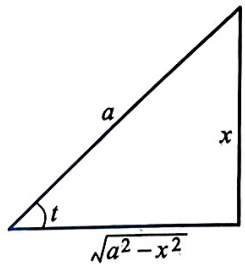
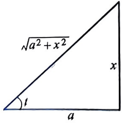
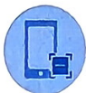
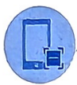

# 第5章 不定积分

在前面我们研究了函数的导数和微分及其相关问题,但在科学技术研究或应用中常常会遇到相反的问题,即已知某个函数的导数或微分,求这个函数.本章就是讨论这类微分学的相反问题.

## §5.1 原函数与不定积分的概念

**定义 5.1.1** 设 f 是定义在区间 I 上的函数, 如果存在可导函数  $F: I \rightarrow R$  满足

$$
F ^ {\prime} (x) = f (x),
$$

就称 F 为 f 在区间 I 上的一个原函数.

例如, $F(x) = \frac{1}{2} x^2$ 是 $f(x) = x$ 的原函数, $F(x) = -\cos x$ 是 $f(x) = \sin x$ 的原函数, $F(x) = \arcsin x$ 是 $f(x) = \frac{1}{\sqrt{1 - x^2}}$ 在 $I = \{x | -1 < x < 1\}$ 上的原函数等. 因为若 $F$ 为 $f$ 的一个原函数, 则 $F + C$ (其中 $C$ 为任意常数) 也为 $f$ 的一个原函数, 所以原函数不唯一. 但是, 在允许相差一个常数的意义下, 原函数是唯一的. 我们有以下定理.

**定理 5.1.2** 设 $F, G$ 是函数 $f(x)$ 在区间 $I$ 上的两个原函数, 则它们之间最多相差一个常数, 即存在常数 $C$, 使

$$
G (x) = F (x) + C.
$$

证明:因为 $F^{\prime}(x) = f(x)$ 和 $G^{\prime}(x) = f(x), x \in I,$ 所以

$$
[ G (x) - F (x) ] ^ {\prime} = f (x) - f (x) \equiv 0, \quad x \in I.
$$

从而 $G(x) - F(x)$ 在区间 $I$ 上为常数, 即有

$$
G (x) = F (x) + C.
$$

关于原函数的存在性, 也即一个函数在什么条件下存在原函数, 我们将在下一章中进行讨论, 在这里, 我们不加证明地给出以下充分条件: 如果某函数在区间 $I$ 上连续, 那么其在 $I$ 上一定存在原函数.

#### 例 5.1.3 某物体在离地面高度为 h m 处由静止状态自由下落, 已知由重力产生的加速度为  $g \, m/s^{2}$ , 试分别求物体在空中下落时, 速度和离地面高度关于时间的函数表达式.

解:设物体离地面高度函数为 $H(t)$，速度函数为 $v(t)$，则有

$$
v ^ {\prime} (t) = - g.
$$

显然，-gt 满足上式. 由定理 5.1.2 得

$$
v (t) = - g t + C _ {1},
$$

其中 $C_1$ 为常数. 因为 $v(0) = 0$, 所以 $C_1 = 0$. 因此, 物体速度关于时间的函数表达式为

$$
v (t) = - g t.
$$

又因为 $H^{\prime}(t) = v(t) = -gt$ ，同理可得

$$
H (t) = - g \cdot \frac {1}{2} t ^ {2} + C _ {2},
$$

其中 $C_2$ 为常数. 而 $H(0) = h$, 得 $C_2 = h$, 故物体离地面高度关于时间的函数表达式为

$$
H (t) = h - \frac {1}{2} g t ^ {2}.
$$

#### 例 5.1.3 即是已知一个函数的导函数表达式, 求此函数的问题, 即求函数的原函数问题, 这样的问题其实就是微分的逆运算问题. 以下我们引入不定积分的概念.

**定义 5.1.4** 若函数 f 在区间 I 上有一个原函数  $F(x)$ ，则其所有原函数所组成的集合称为 f 的不定积分，记作  $\int f(x)\mathrm{d}x$ 。即

$$
\int f (x) \mathrm{d} x = \{F + C, C \in \mathbb {R} \},
$$

简记为

$$
\int f (x) \mathrm{d} x = F (x) + C,
$$

其中 $\int$ 称为积分号, $x$ 称为积分变量, $f$ 称为被积函数, $C$ 称为积分常数.

由定义 5.1.4 知, 求某个函数的不定积分, 只要求出该函数的一个原函数即可, 所以求不定积分就归结为求函数的一个原函数.

求已知函数 $f$ 的一个原函数 $F$, 在几何上就是求一条曲线 $y = F(x)$, 使其上任一点 $M(x, y)$ 处的切线斜率恰好等于 $f(x)$ 的函数值, 这条曲线 $y = F(x)$

140

第5章

称为函数 $f$ 的积分曲线. 因此, 函数 $f$ 的不定积分是一族积分曲线 $y = F(x) + C$, 它们可以看成是曲线 $y = F(x)$ 沿 $y$ 轴方向上下平行移动而得到的.

求一个函数的不定积分都是在相应的定义区间上, 为简便起见, 今后如无特别说明, 求一个函数的不定积分就默认为在其存在区间上的不定积分, 不再注明具体区间.

不定积分有如下性质:

(1) 若 $F$ 是 $\int f(x)\mathrm{d}x$ 集合中的一个函数, 则 $F' = f$, 并且

$$
\frac {\mathrm{d}}{\mathrm{d} x} \int f (x) \mathrm{d} x = f (x) \qquad \text {或} \quad \mathrm{d} \int f (x) \mathrm{d} x = f (x) \mathrm{d} x;
$$

$$
\int \frac {\mathrm{d}}{\mathrm{d} x} F (x) \mathrm{d} x = F (x) + C \quad \text {或} \quad \int \mathrm{d} F (x) = F (x) + C.
$$

若把求微分看作一种运算, 则称之为微分运算; 若把求不定积分也看作一种运算, 则称之为积分运算. 以上性质说明了积分运算与微分运算互为逆运算.

(2) 若函数 $f, g$ 皆存在原函数, $k$ 为任意常数, 则

(i) $\int kf(x)\mathrm{d}x = k\int f(x)\mathrm{d}x;$

(ii) $\int [f(x)\pm g(x)]\mathrm{d}x = \int f(x)\mathrm{d}x\pm \int g(x)\mathrm{d}x.$

由基本初等函数的导数公式, 可以得到相应的不定积分公式.

基本积分表

1. $\int 0\mathrm{d}x = C;$

2. $\int x^{\alpha}\mathrm{d}x = \frac{x^{\alpha + 1}}{\alpha + 1} +C (\alpha \neq -1);$

3. $\int \frac{1}{x} \mathrm{d}x = \ln |x| + C;$

4. $\int a^{x}\mathrm{d}x = \frac{a^{x}}{\ln a} +C(a > 0$ 且 $a\neq 1)$ ，特别地， $\int \mathrm{e}^x\mathrm{d}x = \mathrm{e}^x +C;$

5. $\int \cos x\mathrm{d}x = \sin x + C;$

6. $\int \sin x\mathrm{d}x = -\cos x + C;$

7. $\int \sec^2 x\mathrm{d}x = \tan x + C;$

8. $\int \csc^2 x\mathrm{d}x = -\cot x + C;$

§5.1 原函数与不定积分的概念

第5章

9. $\int \frac{1}{\sqrt{1 - x^2}}\mathrm{d}x = \arcsin x + C;$

10. $\int \frac{1}{1 + x^2}\mathrm{d}x = \arctan x + C;$

11. $\int \sec x\tan x\mathrm{d}x = \sec x + C;$

12. $\int \csc x\cot x\mathrm{d}x = -\csc x + C.$

#### 例 5.1.5 求 $\int \left(1 + \frac{1}{\sqrt{x}}\right)^2\mathrm{d}x.$

解:由不定积分的性质和基本积分表有

$$
\begin{array}{r l} \int \left(1 + \frac {1}{\sqrt {x}}\right) ^ {2} \mathrm{d} x & = \int \left(1 + \frac {2}{\sqrt {x}} + \frac {1}{x}\right) \mathrm{d} x \\ & = \int 1 \mathrm{d} x + 2 \int x ^ {- \frac {1}{2}} \mathrm{d} x + \int \frac {1}{x} \mathrm{d} x \\ & = x + 2 \cdot \frac {1}{1 + \left(- \frac {1}{2}\right)} x ^ {1 + \left(- \frac {1}{2}\right)} + \ln | x | + C \\ & = x + 4 \sqrt {x} + \ln | x | + C. \end{array}
$$

当一个不定积分化为几个不定积分的和时, 每个不定积分求出后会有一个积分常数 (任意常数), 因为有限个任意常数之和仍然是任意常数, 所以只要在最后结果中写上一个积分常数即可.

#### 例 5.1.6 求 $\int \frac{x^3 + 3x^2 + x - 2}{x^2 + 1}\mathrm{d}x.$

解: 把被积函数化简为可用基本积分表中公式求出不定积分的形式, 有

$$
\begin{array}{r l} \int \frac {x ^ {3} + 3 x ^ {2} + x - 2}{x ^ {2} + 1} \mathrm{d} x & = \int \frac {x (x ^ {2} + 1) + 3 (x ^ {2} + 1) - 5}{x ^ {2} + 1} \mathrm{d} x \\ & = \int x \mathrm{d} x + \int 3 \mathrm{d} x - 5 \int \frac {1}{x ^ {2} + 1} \mathrm{d} x \\ & = \frac {1}{2} x ^ {2} + 3 x - 5 \arctan x + C. \end{array}
$$

#### 例 5.1.7 求 $\int \frac{1}{\sin^2 x \cos^2 x} \, \mathrm{d}x.$

解: $\int \frac{1}{\sin^2x\cos^2x}\mathrm{d}x = \int \frac{\sin^2x + \cos^2x}{\sin^2x\cos^2x}\mathrm{d}x$ $= \int \sec^2 x\mathrm{d}x + \int \csc^2 x\mathrm{d}x$

142

$$
= \tan x - \cot x + C.
$$

#### 例 5.1.8 设  $f(x)=\left\{\begin{aligned}&\cos x-x^{2}+1,&x\leqslant0,\\&2\mathrm{e}^{x},&x>0,\end{aligned}\right.$  试求  $\int f(x)\mathrm{d}x$ .

解:因为 $f$ 在区间 $(-\infty, +\infty)$ 上连续，所以 $f$ 的原函数 $F$ 存在，且

当 $x \leqslant 0$ 时, $\int f(x)\mathrm{d}x = \int (\cos x - x^2 + 1)\mathrm{d}x = \sin x - \frac{1}{3} x^3 + x + C_1$;

当 $x > 0$ 时, $\int f(x)\mathrm{d}x = \int 2\mathrm{e}^x\mathrm{d}x = 2\mathrm{e}^x +C_2.$

故

$$
F (x) = \left\{ \begin{array}{l l} \sin x - \frac {1}{3} x ^ {3} + x + C _ {1}, & x \leqslant 0, \\ 2 \mathrm{e} ^ {x} + C _ {2}, & x > 0. \end{array} \right.
$$

上述 $C_1, C_2$ 相互之间存在关系, 因为 $F$ 是可导函数, 所以必连续, 有

$$
\begin{array}{r l} \underset {x \to 0 ^ {-}} {\lim} F (x) & = \underset {x \to 0 ^ {-}} {\lim} \left(\sin x - \frac {x ^ {3}}{3} + x + C _ {1}\right) = C _ {1} = \underset {x \to 0 ^ {+}} {\lim} F (x) \\ & = \underset {x \to 0 ^ {+}} {\lim} (2 \mathrm{e} ^ {x} + C _ {2}) = 2 + C _ {2}, \end{array}
$$

即得 $C_1 = 2 + C_2$ 因此所求不定积分为

$$
F (x) = \left\{ \begin{array}{l l} \sin x - \frac {1}{3} x ^ {3} + x + C _ {2} + 2, & x \leqslant 0, \\ 2 \mathrm{e} ^ {x} + C _ {2}, & x > 0, \end{array} \right.
$$

其中  $C_{2}$  为任意常数.

#### 例 5.1.9 设  $f(\ln x) = x + \ln^{2}x$ ，试求  $\int f'(2x)dx$ .

解:令 $t = \ln x$ ，则 $x = \mathrm{e}^{t}$ ，有 $f(t) = \mathrm{e}^{t} + t^{2}$ .从而

$$
\int f ^ {\prime} (2 x) \mathrm{d} x = \frac {1}{2} \int \mathrm{d} (f (2 x)) = \frac {1}{2} f (2 x) + C = \frac {1}{2} \mathrm{e} ^ {2 x} + 2 x ^ {2} + C.
$$

## §5.2 换元积分法和分部积分法

利用不定积分性质和基本积分表我们可以求出一些简单的不定积分, 但这还是不够的, 还须掌握更多的计算原函数的方法和技巧. 下面我们介绍换元积分法 (简称换元法) 和分部积分法.

### 一、换元积分法

要计算不定积分 $\int \mathrm{e}^{2x}\mathrm{d}x$ ，是否可以机械地套用公式 $\int \mathrm{e}^x\mathrm{d}x = \mathrm{e}^x +C$ 而得到 $\int \mathrm{e}^{2x}\mathrm{d}x = \mathrm{e}^{2x} + C$ 呢？显然 $(\mathrm{e}^{2x} + C)' = 2\mathrm{e}^{2x}\neq \mathrm{e}^{2x}$ ，因此以上计算是错

§5.2 换元积分法和分部积分法

误的. 事实上, 我们做以下简单运算就可以得到正确答案:

$$
\int \mathrm{e} ^ {2 x} \mathrm{d} x = \frac {1}{2} \int \mathrm{e} ^ {2 x} \mathrm{d} (2 x) = \frac {1}{2} \left(\mathrm{e} ^ {2 x} + C _ {0}\right) = \frac {1}{2} \mathrm{e} ^ {2 x} + C, \quad C = \frac {C _ {0}}{2}.
$$

以上过程可以看成是一个换元的过程, 即将 $2x$ 看成新的变量 $t$, 然后由公式 $\int \mathrm{e}^{t} \mathrm{d}t = \mathrm{e}^{t} + C$ 得到结果. 另外, 我们说积分运算和微分运算互为逆运算, 从上述计算中可以看出, 在计算不定积分时, 和换元积分法相联系的是复合函数的求导法则. 进一步看以下例子.

#### 例 5.2.1 求  $\int \sin^{2} x \cos x dx$ .

解:由复合函数的求导公式不难看出 $\left(\frac{1}{3}\sin^3 x\right)' = \sin^2 x\cos x,$ 所以

$$
\left| \int \sin^ {2} x \cos x \mathrm{d} x = \frac {1}{3} \sin^ {3} x + C. \right.
$$

事实上, 例 5.2.1 中, 我们是把被积函数作变形:

$$
\sin^ {2} x \cos x \mathrm{d} x = (\sin^ {2} x) (\sin x) ^ {\prime} \mathrm{d} x = (\sin^ {2} x) \mathrm{d} (\sin x).
$$

若令 $u = \sin x$ ，则上式即为 $\sin^2 x\cos x\mathrm{d}x = u^2\mathrm{d}u,$ 于是

$$
\int \sin^ {2} x \cos x \mathrm{d} x = \int u ^ {2} \mathrm{d} u = \frac {1}{3} u ^ {3} + C = \frac {1}{3} \sin^ {3} x + C.
$$

#### 例 5.2.2 求 $\int x\mathrm{e}^{x^2}\mathrm{d}x.$

解:因为 $x\mathrm{e}^{x^2}\mathrm{d}x = \frac{1}{2}\mathrm{e}^{x^2}(x^2)'\mathrm{d}x = \frac{1}{2}\mathrm{e}^{x^2}\mathrm{d}(x^2)$，若令 $u = x^2$，则

$$
\int x \mathrm{e} ^ {x ^ {2}} \mathrm{d} x = \frac {1}{2} \int \mathrm{e} ^ {x ^ {2}} \mathrm{d} (x ^ {2}) = \frac {1}{2} \int \mathrm{e} ^ {u} \mathrm{d} u = \frac {1}{2} \mathrm{e} ^ {u} + C = \frac {1}{2} \mathrm{e} ^ {x ^ {2}} + C.
$$

#### 例 5.2.3 求 $\int (ax + b)^{20}\mathrm{d}x, a\neq 0.$

解: 若把 $(ax + b)^{20}$ 展开再求各项的不定积分, 表达式会很烦琐, 我们同样可利用复合函数的求导 (求微分) 公式, 有

$$
(a x + b) ^ {2 0} \mathrm{d} x = \frac {1}{a} (a x + b) ^ {2 0} \mathrm{d} (a x + b).
$$

令 $u = ax + b,$ 再用基本积分表中公式，得

$$
\int (a x + b) ^ {2 0} \mathrm{d} x = \frac {1}{a} \int (a x + b) ^ {2 0} \mathrm{d} (a x + b) = \frac {1}{a} \int u ^ {2 0} \mathrm{d} u
$$

144

第5章

$$
= \frac {1}{2 1 a} u ^ {2 1} + C = \frac {1}{2 1 a} (a x + b) ^ {2 1} + C.
$$

从以上例子可以看出, 如果被积函数是两个函数的乘积: 一个是某可导函数 $\varphi$ 与函数 $f$ 的复合函数 $f \circ \varphi$, 另一个恰是 $\varphi$ 的导函数 $\varphi'$, 那么有 (其中 $u = \varphi(x)$)

$$
\int f \left(\varphi (x)\right) \varphi^ {\prime} (x) \mathrm{d} x = \int f \left(\varphi (x)\right) \mathrm{d} \varphi (x) = \int f (u) \mathrm{d} u.
$$

如果 $f$ 的原函数已求出, 那么不定积分 $\int f'(\varphi(x))\varphi'(x)\mathrm{d}x$ 也就求出了.

**定理 5.2.4**（第一换元积分法）设 $f(u)$ 存在原函数 $F(u), u = \varphi(x)$ 可导, 则函数 $f(\varphi(x))\varphi'(x)$ 也存在原函数, 且

**重难点讲解不定积分的概念与第一换元积分法**

$$
\begin{array}{r l} \int f (\varphi (x)) \varphi^ {\prime} (x) \mathrm{d} x & = \int f (\varphi (x)) \mathrm{d} \varphi (x) = \int f (u) \mathrm{d} u \\ & = F (u) + C = F (\varphi (x)) + C. \end{array}\tag{5.1}
$$

证明:利用复合函数的求导法则进行验证:

$$
\frac {\mathrm{d}}{\mathrm{d} x} [ F (\varphi (x)) ] = F ^ {\prime} (\varphi (x)) \varphi^ {\prime} (x) = f (\varphi (x)) \varphi^ {\prime} (x),
$$

所以 $F(\varphi (x))$ 是函数 $f(\varphi (x))\varphi '(x)$ 的一个原函数.故结论成立.

上述的这个过程事实上就是一个变量替换的过程, 即将积分变量 $x$ 通过变量替换 $u = \varphi(x)$ 变成了积分变量 $u$, 求出后再回代到积分变量 $x$, 这样的不定积分方法称为第一换元积分法或凑微分法.

不定积分的第一换元积分法也可表示为如下简便形式:

$$
\int f (\varphi (x)) \varphi^ {\prime} (x) \mathrm{d} x = \int f (\varphi (x)) \mathrm{d} \varphi (x) = F (\varphi (x)) + C.
$$

#### 例 5.2.5 求下列不定积分:

(1) $\int \frac{\mathrm{d}x}{x^2 + 3}$;

(2) $\int \frac{x + \arcsin x}{\sqrt{1 - x^2}}\mathrm{d}x;$

(3) $\int \frac{\mathrm{d}x}{a^2\sin^2x + b^2\cos^2x}$ ($ab \neq 0$);

$$
\int \frac {\sin x}{a \cos x + b \sin x} \mathrm{d} x (a ^ {2} + b ^ {2} \neq 0); \tag {4}
$$

(5) $\int \csc x\mathrm{d}x;$

(6) $\int \sec x\mathrm{d}x.$

$$
\begin{array}{c} \int \frac {\mathrm{d} x}{x ^ {2} + 3} = \int \frac {\mathrm{d} x}{3 \left(\frac {x ^ {2}}{3} + 1\right)} = \frac {1}{\sqrt {3}} \int \frac {\mathrm{d} \left(\frac {x}{\sqrt {3}}\right)}{\left(\frac {x}{\sqrt {3}}\right) ^ {2} + 1} \\ = \frac {1}{\sqrt {3}} \arctan \frac {x}{\sqrt {3}} + C. \end{array}
$$

$$
\int \frac {x + \arcsin x}{\sqrt {1 - x ^ {2}}} \mathrm{d} x = \int \frac {x}{\sqrt {1 - x ^ {2}}} \mathrm{d} x + \int \frac {\arcsin x}{\sqrt {1 - x ^ {2}}} \mathrm{d} x
$$

§5.2 换元积分法和分部积分法

$$
\begin{array}{l} = - \frac {1}{2} \int \frac {\mathrm{d} (1 - x ^ {2})}{\sqrt {1 - x ^ {2}}} + \int \arcsin x \mathrm{d} (\arcsin x) \\ = - \frac {1}{2} \cdot \frac {1}{1 + \left(- \frac {1}{2}\right)} (1 - x ^ {2}) ^ {1 + \left(- \frac {1}{2}\right)} + \frac {1}{2} (\arcsin x) ^ {2} + C \\ = - \sqrt {1 - x ^ {2}} + \frac {1}{2} (\arcsin x) ^ {2} + C. \end{array}\tag{3}
$$

$$
\begin{array}{r l} \int \frac {\mathrm{d} x}{a ^ {2} \sin^ {2} x + b ^ {2} \cos^ {2} x} & = \int \frac {\sec^ {2} x \mathrm{d} x}{b ^ {2} \left(\frac {a ^ {2}}{b ^ {2}} \tan^ {2} x + 1\right)} \\ & = \frac {1}{a b} \int \frac {\mathrm{d} \left(\frac {a}{b} \tan x\right)}{\left(\frac {a}{b} \tan x\right) ^ {2} + 1} \\ & = \frac {1}{a b} \arctan \left(\frac {a}{b} \tan x\right) + C. \end{array}
$$

(4) 因为 $b(a \cos x + b \sin x) - a(a \cos x + b \sin x)' = (b^2 + a^2) \sin x$，所以

$$
\begin{array}{r l} \int \frac {\sin x}{a \cos x + b \sin x} \mathrm{d} x & = \frac {1}{a ^ {2} + b ^ {2}} \int \frac {b (a \cos x + b \sin x) - a (a \cos x + b \sin x) ^ {\prime}}{a \cos x + b \sin x} \mathrm{d} x \\ & = \frac {1}{a ^ {2} + b ^ {2}} \left[ \int b \mathrm{d} x - a \int \frac {\mathrm{d} (a \cos x + b \sin x)}{a \cos x + b \sin x} \right] \\ & = \frac {1}{a ^ {2} + b ^ {2}} \left(b x - a \ln | a \cos x + b \sin x |\right) + C. \end{array}
$$

$$
\begin{array}{r l} \int \csc x \mathrm{d} x & = \int \frac {1}{\sin x} \mathrm{d} x = \int \frac {1}{2 \sin \frac {x}{2} \cos \frac {x}{2}} \mathrm{d} x \\ & = \int \frac {1}{\tan \frac {x}{2} \cos^ {2} \frac {x}{2}} \mathrm{d} \left(\frac {x}{2}\right) = \int \frac {1}{\tan \frac {x}{2}} \mathrm{d} \left(\tan \frac {x}{2}\right) \\ & = \ln \left| \tan \frac {x}{2} \right| + C. \end{array} \tag {5}
$$

因为 $\tan \frac{x}{2} = \frac{\sin\frac{x}{2}}{\cos\frac{x}{2}} = \frac{1 - \cos x}{\sin x} = \csc x - \cot x,$ 所以上述不定积分也可写为

$$
\int \csc x \mathrm{d} x = \ln | \csc x - \cot x | + C.
$$

这个不定积分也可用下述“凑微分”的方法求得:

$$
\int \csc x \mathrm{d} x = \int \frac {\csc x (\csc x - \cot x)}{\csc x - \cot x} \mathrm{d} x
$$

146

第5章

$$
\begin{array}{l} \left| = \int \frac {1}{\csc x - \cot x} \mathrm{d} (\csc x - \cot x) \right| \\ = \ln | \csc x - \cot x | + C. \end{array}
$$

(6) 因为 $\sec x = \csc \left(x + \frac{\pi}{2}\right)$, 所以

$$
\begin{array}{r l} \int \sec x \mathrm{d} x & = \int \csc \left(x + \frac {\pi}{2}\right) \mathrm{d} x = \int \csc \left(x + \frac {\pi}{2}\right) \mathrm{d} \left(x + \frac {\pi}{2}\right) \\ & = \ln \left| \csc \left(x + \frac {\pi}{2}\right) - \cot \left(x + \frac {\pi}{2}\right) \right| + C \\ & = \ln | \sec x + \tan x | + C. \end{array}
$$

本小题也可用下面“凑微分”的方法求得:

$$
\begin{array}{r l} \int \sec x \mathrm{d} x & = \int \frac {\sec x (\sec x + \tan x)}{\sec x + \tan x} \mathrm{d} x = \int \frac {\mathrm{d} (\sec x + \tan x)}{\sec x + \tan x} \\ & = \ln | \sec x + \tan x | + C. \end{array}
$$

(5)、(6) 两个不定积分可作为公式使用.

**定理 5.2.6** (第二换元积分法) 设  $f(x)$  连续,  $x = \varphi(t)$  有连续导数, 且  $\varphi'(t) \neq 0$ . 如果  $\int f(\varphi(t)) \varphi'(t) dt = F(t) + C$ , 那么

**重难点讲解不定积分的第二换元积分法**

$$
\int f (x) \mathrm{d} x = \int f (\varphi (t)) \varphi^ {\prime} (t) \mathrm{d} t = F (t) + C = F (\varphi^ {- 1} (x)) + C,\tag{5.2}
$$

其中 $t = \varphi^{-1}(x)$ 为 $x = \varphi(t)$ 的反函数.

证明:只要验证 $\frac{\mathrm{d}}{\mathrm{d}x} F\left(\varphi^{-1}(x)\right) = f(x)$ 即可.由于

$$
\frac {\mathrm{d}}{\mathrm{d} x} F \left(\varphi^ {- 1} (x)\right) = \frac {\mathrm{d}}{\mathrm{d} t} F (t) \cdot \frac {\mathrm{d} t}{\mathrm{d} x} = f \left(\varphi (t)\right) \cdot \varphi^ {\prime} (t) \cdot \frac {1}{\varphi^ {\prime} (t)} = f \left(\varphi (t)\right) = f (x),
$$

故式(5.2)成立.

#### 例 5.2.7 求下列不定积分 (以下出现的 a > 0 为实常数):
(1)  $\int \frac{x}{\sqrt{x-1}} dx;$

(2)  $\int x^{2}(3x-5)^{100} dx;$
(3)  $\int \sqrt{a^{2}-x^{2}} dx;$

(4)  $\int \frac{dx}{(a^{2}+x^{2})^{\frac{3}{2}}};$
(5)  $\int \frac{dx}{\sqrt{x^{2}-a^{2}}};$

(6)  $\int \frac{e^{2x}}{\sqrt{e^{x}+1}} dx.$

解:(1) 设 $\sqrt{x - 1} = t$，则 $x = t^2 + 1, \mathrm{d}x = 2t\mathrm{d}t$。于是

$$
\int \frac {x}{\sqrt {x - 1}} \mathrm{d} x = \int \frac {t ^ {2} + 1}{t} \cdot 2 t \mathrm{d} t = 2 \int (t ^ {2} + 1) \mathrm{d} t = \frac {2}{3} t ^ {3} + 2 t + C
$$

§5.2 换元积分法和分部积分法

$$
= \frac {2}{3} (x - 1) ^ {\frac {3}{2}} + 2 \sqrt {x - 1} + C = \frac {2}{3} (x + 2) \sqrt {x - 1} + C.
$$

(2) 如果将被积函数中因式 $(3x - 5)^{100}$ 用二项式展开, 计算会很麻烦. 令 $t = 3x - 5$, 则 $x = \frac{1}{3}(t + 5), \mathrm{d}x = \frac{1}{3} \mathrm{d}t$. 于是

$$
\begin{array}{r l} \int x ^ {2} (3 x - 5) ^ {1 0 0} \mathrm{d} x & = \int \left(\frac {t + 5}{3}\right) ^ {2} \cdot t ^ {1 0 0} \cdot \frac {1}{3} \mathrm{d} t \\ & = \frac {1}{2 7} \int (t ^ {1 0 2} + 1 0 t ^ {1 0 1} + 2 5 t ^ {1 0 0}) \mathrm{d} t \\ & = \frac {1}{2 7} \left(\frac {t ^ {1 0 3}}{1 0 3} + \frac {1 0 t ^ {1 0 2}}{1 0 2} + \frac {2 5 t ^ {1 0 1}}{1 0 1}\right) + C \\ & = \frac {(3 x - 5) ^ {1 0 1}}{2 7} \left[ \frac {(3 x - 5) ^ {2}}{1 0 3} + \frac {5}{5 1} (3 x - 5) + \frac {2 5}{1 0 1} \right] + C. \end{array}
$$

(3) 由于被积函数中的根号给计算带来麻烦, 为了去掉根号, 作变换 $x = a \sin t$, $t \in \left[-\frac{\pi}{2}, \frac{\pi}{2}\right]$, 得 $\sqrt{a^2 - x^2} = a \cos t$, $\mathrm{d}x = a \cos t \mathrm{d}t$. 于是

$$
\begin{array}{r l} { \int \sqrt {a ^ {2} - x ^ {2}} \mathrm{d} x =  \int a ^ {2} \cos^ {2} t \mathrm{d} t} \\ & {\qquad = \frac {a ^ {2}}{2} \int (1 + \cos 2 t) \mathrm{d} t} \\ & {\qquad = \frac {a ^ {2}}{2} \left(t + \frac {1}{2} \sin 2 t\right) + C} \\ & {\qquad = \frac {a ^ {2}}{2} t + \frac {a ^ {2}}{2} \sin t \cos t + C} \\ & {\qquad \underline {{{{\text {代回原变量}}}}} \frac {a ^ {2}}{2} \arcsin \frac {x}{a} + \frac {x}{2} \sqrt {a ^ {2} - x ^ {2}} + C.} \end{array}
$$

这类三角变换在代回原变量时, 可根据变换式 $x = a \sin t$ 画出直角三角形示意图 (图5.1), 从图中可方便地得出所需的角 $t$ 的三角函数值, 如 $\cos t = \frac{\sqrt{a^2 - x^2}}{a}, \tan t = \frac{x}{\sqrt{a^2 - x^2}}$ 等.

图5.1

(4) 令 $x = a \tan t\left(-\frac{\pi}{2} < t < \frac{\pi}{2}\right)$, 则 $\left(a^2 + x^2\right)^{\frac{3}{2}} = a^3 \sec^3 t, \mathrm{d}x = a \sec^2 t \mathrm{d}t$ (图5.2). 于是

$$
\begin{array}{c} \int {\frac {1}{(a ^ {2} + x ^ {2}) ^ {\frac {2}{2}}}} \mathrm{d} x = \int {\frac {1}{a ^ {3} \sec^ {3} t}} \cdot a \sec^ {2} t \mathrm{d} t \\ = \frac {1}{a ^ {2}} \int \cos t \mathrm{d} t \end{array}
$$

图5.2

148

$$
\begin{array}{r l} & {= \frac {1}{a ^ {2}} \sin t + C} \\ & {\underline {{{{\underline {{{{\mathrm{代回原变量}}}}}}}}} \frac {x}{a ^ {2} \sqrt {a ^ {2} + x ^ {2}}} + C.} \end{array}
$$

(5) 当 $x > a$ 时, 令 $x = a \sec t$, $0 < t < \frac{\pi}{2}$, 则 $\sqrt{x^2 - a^2} = a \tan t$, $\mathrm{d}x = a \sec t \tan t \mathrm{d}t$. 于是

$$
\begin{array}{r l} \int \frac {1}{\sqrt {x ^ {2} - a ^ {2}}} \mathrm{d} x & = \int \frac {1}{a \tan t} \cdot a \sec t \tan t \mathrm{d} t = \int \sec t \mathrm{d} t \\ & = \ln | \sec t + \tan t | + C _ {1} \\ & \underline {{\underline {{\text {代回原变量}}}}} \ln \left| \frac {x}{a} + \frac {\sqrt {x ^ {2} - a ^ {2}}}{a} \right| + C _ {1} \\ & = \ln \left| x + \sqrt {x ^ {2} - a ^ {2}} \right| + C _ {2} (C _ {2} = C _ {1} - \ln a). \end{array}
$$

当 $x < -a$ 时, 令 $t = -x > a$, 则 $\mathrm{d}x = -\mathrm{d}t$. 于是

$$
\begin{array}{r l} \int \frac {1}{\sqrt {x ^ {2} - a ^ {2}}} \mathrm{d} x & = - \int \frac {1}{\sqrt {t ^ {2} - a ^ {2}}} \mathrm{d} t = - \ln \left| t + \sqrt {t ^ {2} - a ^ {2}} \right| + C _ {3} \\ & = \ln \left| \frac {1}{t + \sqrt {t ^ {2} - a ^ {2}}} \right| + C _ {3} = \ln \left| \frac {t - \sqrt {t ^ {2} - a ^ {2}}}{a ^ {2}} \right| + C _ {3} \\ & = \ln \left| t - \sqrt {t ^ {2} - a ^ {2}} \right| + C _ {4} = \ln \left| - x - \sqrt {x ^ {2} - a ^ {2}} \right| + C _ {4} \\ & = \ln \left| x + \sqrt {x ^ {2} - a ^ {2}} \right| + C _ {4} (C _ {4} = C _ {3} - \ln a ^ {2}). \end{array}
$$

总之有

$$
\int \frac {1}{\sqrt {x ^ {2} - a ^ {2}}} \mathrm{d} x = \ln \left| x + \sqrt {x ^ {2} - a ^ {2}} \right| + C.
$$

(6) 作变量替换 $\sqrt{\mathrm{e}^x + 1} = t$, 则 $x = \ln (t^2 - 1)$, $\mathrm{d}x = \frac{2t}{t^2 - 1}\mathrm{d}t$. 于是

$$
\begin{array}{r l} \int \frac {\mathrm{e} ^ {2 x}}{\sqrt {\mathrm{e} ^ {x} + 1}} \mathrm{d} x & = \int \frac {(t ^ {2} - 1) ^ {2}}{t} \cdot \frac {2 t}{t ^ {2} - 1} \mathrm{d} t = 2 \int (t ^ {2} - 1) \mathrm{d} t \\ & = 2 \left(\frac {1}{3} t ^ {3} - t\right) + C = \frac {2}{3} (\mathrm{e} ^ {x} + 1) ^ {\frac {3}{2}} - 2 \sqrt {\mathrm{e} ^ {x} + 1} + C. \end{array}
$$

从以上例子可以看出, 有的不定积分形式比较简单, 很容易看出用什么变量替换, 并可以通过凑成某个函数的微分的形式得到结果, 这种也称为 “凑微分法”; 而有些不定积分却很难直接凑成一个函数的微分形式, 就需要通过适当的变量替换来 “化简”. 所以用换元积分法求不定积分, 一是要对复合函数的微分形式比较熟悉, 二是要通过练习积累较多的经验, 熟能生巧.

§5.2 换元积分法和分部积分法

常用的凑微分公式:

$$
\mathrm{d} x = \frac {1}{a} \mathrm{d} (a x + b) (a \neq 0), x \mathrm{d} x = \frac {1}{2} \mathrm{d} (x ^ {2}), \frac {1}{x} \mathrm{d} x = \mathrm{d} (\ln | x |), \frac {1}{x ^ {2}} \mathrm{d} x = - \mathrm{d} \left(\frac {1}{x}\right),
$$

$$
\frac {1}{\sqrt {x}} \mathrm{d} x = 2 \mathrm{d} (\sqrt {x}), \sin x \mathrm{d} x = - \mathrm{d} (\cos x), \cos x \mathrm{d} x = \mathrm{d} (\sin x), \mathrm{e} ^ {x} \mathrm{d} x = \mathrm{d} (\mathrm{e} ^ {x}),
$$

$$
\frac {1}{\sqrt {1 - x ^ {2}}} \mathrm{d} x = \mathrm{d} (\arcsin x), \frac {1}{1 + x ^ {2}} \mathrm{d} x = \mathrm{d} (\arctan x).
$$

#### 例 5.2.8 求下列不定积分:

(1) $\int \frac{1}{\sqrt{3x^2 - 2x - 1}}\mathrm{d}x (x > 1)$; (2) $\int \frac{1}{x\sqrt{3x^2 - 2x - 1}}\mathrm{d}x (x > 1)$.

解: (1) 因为

$$
3 x ^ {2} - 2 x - 1 = 3 \left(x - \frac {1}{3}\right) ^ {2} - \frac {4}{3} = \frac {4}{3} \left[ \left(\frac {3}{2} x - \frac {1}{2}\right) ^ {2} - 1 \right],
$$

所以

$$
\int \frac {1}{\sqrt {3 x ^ {2} - 2 x - 1}} \mathrm{d} x = \int \frac {1}{\sqrt {\frac {4}{3}} \cdot \sqrt {\left(\frac {3}{2} x - \frac {1}{2}\right) ^ {2} - 1}} \mathrm{d} x = \frac {\sqrt {3}}{2} \int \frac {\mathrm{d} x}{\sqrt {\left(\frac {3}{2} x - \frac {1}{2}\right) ^ {2} - 1}}.
$$

作变量替换 $\frac{3}{2} x - \frac{1}{2} = \sec t,$ 则 $x = \frac{2}{3}\sec t + \frac{1}{3},\mathrm{d}x = \frac{2}{3}\sec t\tan t\mathrm{d}t.$ 于是

$$
\begin{array}{c} \int \frac {1}{\sqrt {3 x ^ {2} - 2 x - 1}} \mathrm{d} x = \frac {\sqrt {3}}{3} \int \sec t \mathrm{d} t = \frac {\sqrt {3}}{3} \ln | \sec t + \tan t | + C \\ = \frac {\sqrt {3}}{3} \ln \left| \frac {3 x - 1}{2} + \frac {\sqrt {3 (3 x ^ {2} - 2 x - 1)}}{2} \right| + C. \end{array}
$$

(2) 这里也可以像 (1) 那样作变量替换, 但因为分母多了一个因子 $x$, 从而使得变量替换后仍不能方便地计算出结果. 现另作变换 $x = \frac{1}{t}$, 则 $\mathrm{d}x = -\frac{1}{t^2} \mathrm{d}t$. 于是

$$
\begin{array}{r l} \int \frac {1}{x \sqrt {3 x ^ {2} - 2 x - 1}} \mathrm{d} x & = - \int \frac {t}{\sqrt {\frac {3}{t ^ {2}} - \frac {2}{t} - 1}} \cdot \frac {1}{t ^ {2}} \mathrm{d} t \\ & = - \int \frac {1}{\sqrt {3 - 2 t - t ^ {2}}} \mathrm{d} t \\ & = - \int \frac {1}{\sqrt {4 - (t + 1) ^ {2}}} \mathrm{d} (t + 1) \end{array}
$$

150

第5章

$$
\begin{array}{l} = - \int \frac {1}{\sqrt {1 - \left(\frac {t + 1}{2}\right) ^ {2}}} \mathrm{d} \left(\frac {t + 1}{2}\right) \\ = - \arcsin \frac {t + 1}{2} + C \\ = - \arcsin \frac {1 + x}{2 x} + C. \end{array}
$$

一个不定积分有时可以通过不同的变量替换来计算, 如何选择较好的变量替换使计算简单方便, 没有统一的规律可循, 需具体情况具体分析. 从以上例题中, 读者可以了解到一些常见类型的被积函数及其所采用的变量替换, 希望能通过练习, 举一反三.

### 二、分部积分法

有些不定积分, 用变量替换法进行计算会比较困难, 但用以下介绍的分部积分法可以非常方便地计算出来.

设 $u, v$ 是两个可导函数, 由求导法则知

$$
(u v) ^ {\prime} = u ^ {\prime} v + u v ^ {\prime}.
$$

对等式两边求不定积分有

$$
u v = \int v (x) u ^ {\prime} (x) \mathrm{d} x + \int u (x) v ^ {\prime} (x) \mathrm{d} x.
$$

等式左边没有加上任意常数 $C$, 是因为右边的不定积分中仍包含任意常数. 移项得

$$
\int u (x) v ^ {\prime} (x) \mathrm{d} x = u (x) v (x) - \int v (x) u ^ {\prime} (x) \mathrm{d} x.
$$

**重难点讲解**
不定积分的
分部积分法

上式称为分部积分公式, 可简单写为

$$
\left| \int u \mathrm{d} v = u v - \int v \mathrm{d} u. \right.
$$

可以看出, 通过分部积分, 将被积函数为 $uv'$ 的不定积分转化为被积函数为 $vu'$ 的不定积分, 因此当 $\int uv'dx$ 的计算遇到困难时, 可转化成 $\int vu'dx$ 来计算, 就有可能较为方便地计算出来. 用分部积分法时, 关键是把被积函数分解出 $u$ 与 $v'$ 两部分, 且 $\int vu'dx$ 要容易计算.

#### 例 5.2.9 求 $\int x\mathrm{e}^{x}\mathrm{d}x.$

解:这里被积函数是 $x$ 与 $\mathrm{e}^x$ 的乘积, 但是把其中哪一个作为分部积分公式中的 $u$, 哪一个看成 $v'$ 是有讲究的. 目的是要使 $u'v$ 作为被积函数的不定积分容易计算.

§5.2 换元积分法和分部积分法

令 $u = x, v' = \mathrm{e}^x$ ，可取 $v = \mathrm{e}^x$ ，由分部积分公式，有

$$
\int x \mathrm{e} ^ {x} \mathrm{d} x = x \mathrm{e} ^ {x} - \int \mathrm{e} ^ {x} \mathrm{d} x = (x - 1) \mathrm{e} ^ {x} + C.
$$

#### 例 5.2.9 中如果令  $u = e^{x}$ ,  $v' = x$ , 取  $v = \frac{x^{2}}{2}$ , 那么

$$
\int x \mathrm{e} ^ {x} \mathrm{d} x = \frac {x ^ {2}}{2} \mathrm{e} ^ {x} - \frac {1}{2} \int x ^ {2} \mathrm{e} ^ {x} \mathrm{d} x,
$$

转化成了比原来的不定积分更复杂的不定积分, 这样做显然是不可取的. 由此可见, 如何把被积函数分成合适的两部分是分部积分的关键, 这需从大量的练习中去细心体会.

#### 例 5.2.10 求 $\int x^{2}\cos x\mathrm{d}x.$

解:此不定积分可通过连续两次分部积分计算得到结果.

$$
\begin{array}{r l} \int x ^ {2} \cos x \mathrm{d} x & = \int x ^ {2} \mathrm{d} \sin x = x ^ {2} \sin x - 2 \int x \sin x \mathrm{d} x \\ & = x ^ {2} \sin x - 2 \int x \mathrm{d} (- \cos x) \\ & = x ^ {2} \sin x + 2 x \cos x - 2 \int \cos x \mathrm{d} x \\ & = x ^ {2} \sin x + 2 x \cos x - 2 \sin x + C. \end{array}
$$

#### 例 5.2.11 求 $\ln x\mathrm{d}x$

解:令 $u = \ln x, v' = 1$，即可取 $v = x$。于是由分部积分公式，得

$$
\int \ln x \mathrm{d} x = x \ln x - \int x \cdot \frac {1}{x} \mathrm{d} x = x \ln x - x + C.
$$

#### 例 5.2.12 求下列不定积分:
(1) $\int e^{x}\cos2xdx;$  (2) $\int\sec^{3}xdx.$

解: 这两个不定积分在用分部积分法计算时, 会出现与原不定积分相同的式子, 通过解方程可得所求的结果. 这是不定积分计算中常常遇到的循环的情况.

$$
\begin{array}{r l} \int \mathrm{e} ^ {x} \cos 2 x \mathrm{d} x & = \int \cos 2 x \mathrm{d} (\mathrm{e} ^ {x}) \\ & = \mathrm{e} ^ {x} \cos 2 x + 2 \int \mathrm{e} ^ {x} \cdot \sin 2 x \mathrm{d} x \\ & = \mathrm{e} ^ {x} \cos 2 x + 2 \int \sin 2 x \mathrm{d} (\mathrm{e} ^ {x}) \end{array}
$$

152

第5章

$$
\begin{array}{l} = \mathrm{e} ^ {x} \cos 2 x + 2 (\mathrm{e} ^ {x} \sin 2 x - 2 \int \mathrm{e} ^ {x} \cos 2 x \mathrm{d} x) \\ = \mathrm{e} ^ {x} \cos 2 x + 2 \mathrm{e} ^ {x} \sin 2 x - 4 \int \mathrm{e} ^ {x} \cos 2 x \mathrm{d} x. \end{array}
$$

移项得

$$
\int \mathrm{e} ^ {x} \cos 2 x \mathrm{d} x = \frac {1}{5} (\mathrm{e} ^ {x} \cos 2 x + 2 \mathrm{e} ^ {x} \sin 2 x) + C.
$$

$$
\begin{array}{r l} (2) \int \sec^ {3} x \mathrm{d} x & = \int \sec x \mathrm{d} \tan x \\ & = \sec x \tan x - \int \tan x \cdot \sec x \tan x \mathrm{d} x \\ & = \sec x \tan x - \int \sec x (\sec^ {2} x - 1) \mathrm{d} x \\ & = \sec x \tan x - \int \sec^ {3} x \mathrm{d} x + \int \sec x \mathrm{d} x. \end{array}
$$

移项得

$$
\begin{array}{r l} \int \sec^ {3} x \mathrm{d} x & = \frac {1}{2} \sec x \tan x + \frac {1}{2} \int \sec x \mathrm{d} x \\ & = \frac {1}{2} \sec x \tan x + \frac {1}{2} \ln | \sec x + \tan x | + C. \end{array}
$$

在有些情况下, 被积函数含有一个自然数指标 $n$, 这时往往可通过分部积分法得到一个递推公式, 从而得到所求的不定积分.

#### 例 5.2.13 求下列不定积分:

$$
\int \cos^ {n} x \mathrm{d} x, \int \sin^ {n} x \mathrm{d} x;
$$

$$
I _ {n} = \int \frac {\mathrm{d} x}{(a ^ {2} + x ^ {2}) ^ {n}}, a > 0, n \geqslant 2.
$$

解:

$$
\begin{array}{r l} (1) \int \cos^ {n} x \mathrm{d} x & = \sin x \cos^ {n - 1} x + (n - 1) \int \cos^ {n - 2} x \sin^ {2} x \mathrm{d} x \\ & = \sin x \cos^ {n - 1} x + (n - 1) \int \cos^ {n - 2} x (1 - \cos^ {2} x) \mathrm{d} x \\ & = \sin x \cos^ {n - 1} x + (n - 1) \int \cos^ {n - 2} x \mathrm{d} x - (n - 1) \int \cos^ {n} x \mathrm{d} x. \end{array}
$$

移项得以下递推公式:

$$
\left| \int \cos^ {n} x \mathrm{d} x = \frac {1}{n} \sin x \cos^ {n - 1} x + \frac {n - 1}{n} \int \cos^ {n - 2} x \mathrm{d} x, \right.
$$

因此可反复使用此公式, 最后将所求不定积分化为计算 $\int \cos x \mathrm{d}x = \sin x + C$ (当 $n$ 为奇数时) 或 $\int \mathrm{d}x = x + C$ (当 $n$ 为偶数时).

同理可得递推公式

$$
\left| \int \sin^ {n} x \mathrm{d} x = - \frac {1}{n} \cos x \sin^ {n - 1} x + \frac {n - 1}{n} \int \sin^ {n - 2} x \mathrm{d} x. \right.
$$

§5.2 换元积分法和分部积分法

例如, 当 $n = 3$ 时,

$$
\begin{array}{c} \int \sin^ {3} x \mathrm{d} x = - \frac {1}{3} \cos x \sin^ {2} x + \frac {2}{3} \int \sin x \mathrm{d} x \\ = - \frac {1}{3} \cos x \sin^ {2} x - \frac {2}{3} \cos x + C. \end{array}
$$

当 $n = 4$ 时，

$$
\begin{array}{r l} \int \cos^ {4} x \mathrm{d} x & = \frac {1}{4} \sin x \cos^ {3} x + \frac {3}{4} \int \cos^ {2} x \mathrm{d} x \\ & = \frac {1}{4} \sin x \cos^ {3} x + \frac {3}{4} \left(\frac {1}{2} \sin x \cos x + \frac {1}{2} \int \mathrm{d} x\right) \\ & = \frac {1}{4} \sin x \cos^ {3} x + \frac {3}{1 6} \sin 2 x + \frac {3}{8} x + C. \end{array}
$$

(2) 由分部积分公式有

$$
\begin{array}{r l} I _ {n} & = \frac {x}{(a ^ {2} + x ^ {2}) ^ {n}} + 2 n \int \frac {x ^ {2}}{(a ^ {2} + x ^ {2}) ^ {n + 1}} \mathrm{d} x \\ & = \frac {x}{(a ^ {2} + x ^ {2}) ^ {n}} + 2 n \int \frac {(a ^ {2} + x ^ {2}) - a ^ {2}}{(a ^ {2} + x ^ {2}) ^ {n + 1}} \mathrm{d} x \\ & = \frac {x}{(a ^ {2} + x ^ {2}) ^ {n}} + 2 n I _ {n} - 2 n a ^ {2} I _ {n + 1}, \end{array}
$$

解得

$$
I _ {n + 1} = \frac {x}{2 n a ^ {2} (a ^ {2} + x ^ {2}) ^ {n}} + \frac {2 n - 1}{2 n a ^ {2}} I _ {n},
$$

可写成递推公式

$$
I _ {n} = \frac {x}{2 (n - 1) a ^ {2} (a ^ {2} + x ^ {2}) ^ {n - 1}} + \frac {2 n - 3}{2 (n - 1) a ^ {2}} I _ {n - 1}, \quad n = 2, 3, \dots .
$$

重复使用这个递推公式, 可把 $n$ 不断降低, 最后转化成不定积分

$$
I _ {1} = \int \frac {\mathrm{d} x}{a ^ {2} + x ^ {2}} = \frac {1}{a} \arctan \frac {x}{a} + C
$$

的计算, 从而得到所需结果.

例如, 当 $n = 3$ 时,

$$
\begin{array}{r l} & I _ {3} = \int \frac {\mathrm{d} x}{(a ^ {2} + x ^ {2}) ^ {3}} \\ & \quad = \frac {x}{4 a ^ {2} (a ^ {2} + x ^ {2}) ^ {2}} + \frac {3}{4 a ^ {2}} \int \frac {\mathrm{d} x}{(a ^ {2} + x ^ {2}) ^ {2}} \\ & \quad = \frac {x}{4 a ^ {2} (a ^ {2} + x ^ {2}) ^ {2}} + \frac {3}{4 a ^ {2}} \left[ \frac {x}{2 a ^ {2} (a ^ {2} + x ^ {2})} + \frac {1}{2 a ^ {2}} \int \frac {\mathrm{d} x}{a ^ {2} + x ^ {2}} \right] \end{array}
$$

154

不定积分

$$
\begin{array}{l} = \frac {x}{4 a ^ {2} (a ^ {2} + x ^ {2}) ^ {2}} + \frac {3}{4 a ^ {2}} \left[ \frac {x}{2 a ^ {2} (a ^ {2} + x ^ {2})} + \frac {1}{2 a ^ {3}} \arctan \frac {x}{a} + C _ {1} \right] \\ = \frac {x}{4 a ^ {2} (a ^ {2} + x ^ {2}) ^ {2}} + \frac {3}{8 a ^ {4}} \left(\frac {x}{a ^ {2} + x ^ {2}} + \frac {1}{a} \arctan \frac {x}{a}\right) + C. \end{array}
$$

## §5.3 一些特殊被积函数的不定积分

### 一、有理函数的不定积分

**定义 5.3.1** 设  $P_{n}(x)$  和  $Q_{m}(x)$  分别为 n 次和 m 次实系数多项式, 且没有共同的零点, 则其商  $R(x)=\frac{P_{n}(x)}{Q_{m}(x)}$  称为有理函数. 如果 n<m, 那么称  $R(x)$  为有理真分式; 如果  $n \geqslant m$ , 那么称  $R(x)$  为有理假分式.

**重难点讲解特殊函数的不定积分**

对有理假分式, 可以通过多项式除法将其表示成一个多项式和一个有理真分式之和. 例如, $\frac{x^5}{1 - x^2}$ 可以化为

$$
\frac {x ^ {5}}{1 - x ^ {2}} = \frac {x ^ {5} - x ^ {3} + x ^ {3}}{1 - x ^ {2}} = - x ^ {3} + \frac {x ^ {3} - x + x}{1 - x ^ {2}} = - x ^ {3} - x + \frac {x}{1 - x ^ {2}}.
$$

由于多项式的积分是容易求的, 故对有理函数的不定积分我们只需研究如何求有理真分式的不定积分. 下面给出一个代数学定理, 其证明过程可在复变函数课程的相关教材中找到, 这里从略.

**定理 5.3.2** 设 $R(x) = \frac{P_n(x)}{Q_m(x)}$ 是一个有理真分式, 且其分母 $Q_{m}(x)$ 有分解式

$$
Q _ {m} (x) = q _ {0} (x - a) ^ {i} \dots (x - b) ^ {j} (x ^ {2} + p x + q) ^ {k} \dots (x ^ {2} + s x + t) ^ {l},
$$

其中  $q_{0}, a, \cdots, b; p, q, \cdots, s, t$  为实数，且  $p^{2}-4q<0, \cdots, s^{2}-4t<0, i, \cdots, j; k, \cdots, l$  为自然数，则  $R(x)$  可表示成

$$
\begin{array}{r l} R (x) & = \frac {P _ {n} (x)}{Q _ {m} (x)} \\ & = \frac {A _ {1}}{x - a} + \frac {A _ {2}}{(x - a) ^ {2}} + \dots + \frac {A _ {i}}{(x - a) ^ {i}} + \dots + \\ & \frac {B _ {1}}{x - b} + \frac {B _ {2}}{(x - b) ^ {2}} + \dots + \frac {B _ {j}}{(x - b) ^ {j}} + \\ & \frac {C _ {1} x + D _ {1}}{x ^ {2} + p x + q} + \frac {C _ {2} x + D _ {2}}{(x ^ {2} + p x + q) ^ {2}} + \dots + \frac {C _ {k} x + D _ {k}}{(x ^ {2} + p x + q) ^ {k}} + \dots + \\ & \frac {E _ {1} x + F _ {1}}{x ^ {2} + s x + t} + \frac {E _ {2} x + F _ {2}}{(x ^ {2} + s x + t) ^ {2}} + \dots + \frac {E _ {l} x + F _ {l}}{(x ^ {2} + s x + t) ^ {l}}, \end{array}
$$

§5.3 一些特殊被积函数的不定积分

其中  $A_{1}, A_{2}, \cdots, A_{i}; B_{1}, B_{2}, \cdots, B_{j}; C_{1}, D_{1}, C_{2}, D_{2}, \cdots, C_{k}, D_{k}; E_{1}, F_{1}, E_{2}, F_{2}, \cdots, E_{l}, F_{l}$  都是唯一确定的实数.

**定理 5.3.2** 表明, 有理真分式可以分解成下列两类分式 (称之为部分分式)之和:

(1) $\frac{A}{(x - a)^n}$ ($n = 1,2,\dots$);

(2) $\frac{Cx + D}{(x^2 + px + q)^n}$ ($n = 1, 2, \dots$) ($p^2 - 4q < 0$).

因此, 求有理函数的不定积分问题就归结为求以上两类部分分式的不定积分问题. 当然, 在计算不定积分之前, 需要将有理函数分解成多项式和有理真分式之和, 将有理真分式分解成上述两类部分分式之和.

#### 例 5.3.3 将有理真分式 $\frac{x^2 - 5}{(x + 1)(x - 2)^2}$ 分解为部分分式之和.

解:由定理5.3.2,可设

$$
\frac {x ^ {2} - 5}{(x + 1) (x - 2) ^ {2}} = \frac {A}{x + 1} + \frac {B}{x - 2} + \frac {C}{(x - 2) ^ {2}}.
$$

消去分母得 $x^{2} - 5 = A(x - 2)^{2} + B(x + 1)(x - 2) + C(x + 1)$，即

$$
x ^ {2} - 5 = (A + B) x ^ {2} + (- 4 A - B + C) x + (4 A - 2 B + C).
$$

比较等式两边 $x$ 的同次幂系数有

$$
\left\{ \begin{array}{l} A + B = 1, \\ - 4 A - B + C = 0, \\ 4 A - 2 B + C = - 5, \end{array} \right.
$$

解得 $A = -\frac{4}{9}, B = \frac{13}{9}, C = -\frac{1}{3}$. 因此, 原有理真分式可分解为

$$
\frac {x ^ {2} - 5}{(x + 1) (x - 2) ^ {2}} = - \frac {4}{9 (x + 1)} + \frac {1 3}{9 (x - 2)} - \frac {1}{3 (x - 2) ^ {2}}.
$$

#### 例 5.3.4 将  $\frac{x}{x^{3}+x^{2}+3x+3}$  分解为部分分式之和.

解:首先将分母分解因式, 得 $x^{3} + x^{2} + 3x + 3 = (x + 1)(x^{2} + 3)$. 由定理5.3.2, 可设 $\frac{x}{x^3 + x^2 + 3x + 3} = \frac{A}{x + 1} + \frac{Bx + C}{x^2 + 3}$, 消去分母得

$$
x = A (x ^ {2} + 3) + (B x + C) (x + 1).
$$

令 $x = -1$ ，代入得 $A = -\frac{1}{4}$ .再代入上式整理得

$$
\frac {1}{4} x ^ {2} + x + \frac {3}{4} = B x ^ {2} + (B + C) x + C.
$$

156

第5章

比较平方项和常数项的系数即得 $B = \frac{1}{4}, C = \frac{3}{4}$. 因此, 原有理式可分解为

$$
\frac {x}{x ^ {3} + x ^ {2} + 3 x + 3} = - \frac {1}{4} \left(\frac {1}{x + 1} - \frac {x + 3}{x ^ {2} + 3}\right).
$$

#### 例 5.3.5 将  $\frac{x^{3}+1}{x^{4}-3x^{3}+3x^{2}-x}$  分解为部分分式之和.

解:将分母分解因式为 $x^{4} - 3x^{3} + 3x^{2} - x = x(x - 1)^{3}$，因此设

$$
\frac {x ^ {3} + 1}{x ^ {4} - 3 x ^ {3} + 3 x ^ {2} - x} = \frac {A}{x} + \frac {B}{x - 1} + \frac {C}{(x - 1) ^ {2}} + \frac {D}{(x - 1) ^ {3}},
$$

消去分母得

$$
x ^ {3} + 1 = A (x - 1) ^ {3} + B x (x - 1) ^ {2} + C x (x - 1) + D x.
$$

若将等式右边展开再合并同类项, 然后比较等式两边相同幂次的系数, 自然可以解得待定系数 $A, B, C$ 和 $D$, 但计算会比较烦. 下面我们通过取 $x$ 的不同特殊值来方便地得到待定系数的值:

令 $x = 0$ ，得 $A = -1;$

令 $x = 1$ ，得 $D = 2;$

令 $x = -1$ 和 $x = 2$, 分别有 $\left\{ \begin{array}{l}0 = 8 - 4B + 2C - 2,\\ 9 = -1 + 2B + 2C + 4, \end{array} \right.$ 解得 $B = 2,C = 1$ 因此得分解式为

$$
\frac {x ^ {3} + 1}{x ^ {4} - 3 x ^ {3} + 3 x ^ {2} - x} = - \frac {1}{x} + \frac {2}{x - 1} + \frac {1}{(x - 1) ^ {2}} + \frac {2}{(x - 1) ^ {3}}.
$$

下面计算上述两类部分分式的不定积分.

(一) 对于第 (1) 类部分分式  $\frac{A}{(x-a)^{n}} (n=1,2,\cdots)$ ，也就是求  $\int\frac{\mathrm{d}x}{(x-a)^{n}}$
当 n=1 时， $\int\frac{1}{x-a}\mathrm{d}x=\ln|x-a|+C.$
当 n>1 时， $\int\frac{1}{(x-a)^{n}}\mathrm{d}x=\frac{(x-a)^{1-n}}{1-n}+C.$

(二) 对于第 (2) 类部分分式  $\frac{Cx+D}{(x^{2}+px+q)^{n}}\quad(n=1,2,\cdots),p^{2}-4q<0:$
$\int\frac{Cx+D}{(x^{2}+px+q)^{n}}dx$
$=C\int\frac{x+\frac{p}{2}}{(x^{2}+px+q)^{n}}\mathrm{d}x+\left(D-\frac{Cp}{2}\right)\int\frac{\mathrm{d}x}{(x^{2}+px+q)^{n}}$

§5.3 一些特殊被积函数的不定积分

$$
= C \int \frac {x + \frac {p}{2}}{\left[ \left(x + \frac {p}{2}\right) ^ {2} + \frac {4 q - p ^ {2}}{4} \right] ^ {n}} \mathrm{d} x + \left(D - \frac {C p}{2}\right) \int \frac {\mathrm{d} x}{\left[ \left(x + \frac {p}{2}\right) ^ {2} + \frac {4 q - p ^ {2}}{4} \right] ^ {n}}.
$$

作变量替换 $u = x + \frac{p}{2}$ ，记 $a^2 = \frac{4q - p^2}{4}$ ，则

$$
\int \frac {C x + D}{(x ^ {2} + p x + q) ^ {n}} \mathrm{d} x = C \int \frac {u}{(u ^ {2} + a ^ {2}) ^ {n}} \mathrm{d} u + \left(D - \frac {C p}{2}\right) \int \frac {\mathrm{d} u}{(u ^ {2} + a ^ {2}) ^ {n}}.
$$

对于等式右边第一个不定积分:

当 $n = 1$ 时, $\int \frac{u}{u^2 + a^2}\mathrm{d}u = \frac{1}{2}\ln (u^2 +a^2) + C.$

当 $n \geqslant 2$ 时, $\int \frac{u}{(u^2 + a^2)^n} \mathrm{d}u = \frac{1}{2(1 - n)} (u^2 + a^2)^{1 - n} + C.$

对于等式右边第二个不定积分, 记 $I_{n} = \int \frac{1}{(u^{2} + a^{2})^{n}}\mathrm{d}u$, 由例5.2.13(2)知, 可反复利用递推关系

$$
I _ {n} = \frac {u}{2 (n - 1) a ^ {2} (u ^ {2} + a ^ {2}) ^ {n - 1}} + \frac {2 n - 3}{2 (n - 1) a ^ {2}} I _ {n - 1}
$$

将所求不定积分归结为 $I_{1}$ 的计算, 而 $I_{1} = \int \frac{\mathrm{d}u}{u^{2} + a^{2}} = \frac{1}{a} \arctan \frac{u}{a} + C.$

综上所述, 有理函数的不定积分问题就完全解决了, 且可得: 一切有理函数的原函数可以用有理函数、对数函数及反正切函数表示出来.

#### 例 5.3.6 求不定积分  $\int\frac{x^{3}+1}{x^{4}-3x^{3}+3x^{2}-x}dx.$

解:由例5.3.5知

$$
\begin{array}{r l} \int \frac {x ^ {3} + 1}{x ^ {4} - 3 x ^ {3} + 3 x ^ {2} - x} \mathrm{d} x & = \int \left[ - \frac {1}{x} + \frac {2}{x - 1} + \frac {1}{(x - 1) ^ {2}} + \frac {2}{(x - 1) ^ {3}} \right] \mathrm{d} x \\ & = - \ln | x | + \ln (x - 1) ^ {2} - \frac {1}{x - 1} - \frac {1}{(x - 1) ^ {2}} + C \\ & = \ln \frac {(x - 1) ^ {2}}{| x |} - \frac {x}{(x - 1) ^ {2}} + C. \end{array}
$$

#### 例 5.3.7 求不定积分 $\int \frac{3x + 2}{x^2 + 3x + 4}\mathrm{d}x.$

解: 此不定积分当然可以按照前面所述步骤把它计算出来, 但有时适当用点化简技巧可以使计算更加方便, 如有

$$
\frac {3 x + 2}{x ^ {2} + 3 x + 4} = \frac {3}{2} \cdot \frac {(x ^ {2} + 3 x + 4) ^ {\prime}}{x ^ {2} + 3 x + 4} - \frac {5}{2} \cdot \frac {1}{x ^ {2} + 3 x + 4},
$$

158

第5章

所以

$$
\begin{array}{r l} \int \frac {3 x + 2}{x ^ {2} + 3 x + 4} \mathrm{d} x & = \frac {3}{2} \ln (x ^ {2} + 3 x + 4) - \frac {5}{2} \int \frac {\mathrm{d} x}{\left(x + \frac {3}{2}\right) ^ {2} + \left(\frac {\sqrt {7}}{2}\right) ^ {2}} \\ & = \frac {3}{2} \ln (x ^ {2} + 3 x + 4) - \frac {5}{\sqrt {7}} \arctan \frac {2 x + 3}{\sqrt {7}} + C. \end{array}
$$

虽然有理函数的积分总可以通过将有理函数化成部分分式之和, 再对每一个部分分式求不定积分的方法来解决, 但此方法往往计算比较复杂, 所以在计算时应尽量寻找其他更为简便的方法.

#### 例 5.3.8 求 $\int \frac{x^2 + x - 3}{(x - 1)^{10}}\mathrm{d}x.$

解:若将被积函数分解成部分分式, 形式上有 10 项之多. 现作变量替换 $x - 1 = t$, 有

$$
\begin{array}{r l} \int \frac {x ^ {2} + x - 3}{(x - 1) ^ {1 0}} \mathrm{d} x & = \int \frac {(t + 1) ^ {2} + (t + 1) - 3}{t ^ {1 0}} \mathrm{d} t = \int \frac {t ^ {2} + 3 t - 1}{t ^ {1 0}} \mathrm{d} t \\ & = \int \frac {1}{t ^ {8}} \mathrm{d} t + 3 \int \frac {1}{t ^ {9}} \mathrm{d} t - \int \frac {1}{t ^ {1 0}} \mathrm{d} t = - \frac {1}{7 t ^ {7}} - \frac {3}{8 t ^ {8}} + \frac {1}{9 t ^ {9}} + C \\ & = \frac {1}{(x - 1) ^ {9}} \left[ \frac {1}{9} - \frac {3}{8} (x - 1) - \frac {1}{7} (x - 1) ^ {2} \right] + C. \end{array}
$$

#### 例 5.3.9 求 $\int \frac{x^4}{(1 + x^2)^2}\mathrm{d}x.$

解:用分部积分法得

$$
\begin{array}{r l} \int \frac {x ^ {4}}{(1 + x ^ {2}) ^ {2}} \mathrm{d} x & = \frac {1}{2} \int \frac {x ^ {3}}{(1 + x ^ {2}) ^ {2}} \mathrm{d} (1 + x ^ {2}) = - \frac {1}{2} \int x ^ {3} \mathrm{d} \frac {1}{1 + x ^ {2}} \\ & = - \frac {1}{2} \cdot \frac {x ^ {3}}{1 + x ^ {2}} + \frac {3}{2} \int \frac {x ^ {2}}{1 + x ^ {2}} \mathrm{d} x \\ & = - \frac {x ^ {3}}{2 (1 + x ^ {2})} + \frac {3}{2} x - \frac {3}{2} \arctan x + C. \end{array}
$$

### 二、可有理化函数的不定积分

有些不定积分中的被积函数本身并不是有理函数, 但通过适当的变量替换以后, 可以将其化为关于新变量的有理函数的不定积分, 从而可以用前述方法计算出来.

### 1. 三角有理函数的不定积分

我们称形如  $\sum_{i=0}^{m}\sum_{j=0}^{n}a_{ij}x^{i}y^{j}$  的表达式为 x 和 y 的二元多项式, 其中  $a_{ij}\in\mathbb{R}(i=0,1,2,\cdots,m;j=0,1,2,\cdots,n)$ . 称两个二元多项式的商为二元有理函

§5.3 一些特殊被积函数的不定积分

数, 记为 $R(x,y)$; 称 $R(\sin x, \cos x)$ 为三角有理函数, 例如

$$
\frac {3 \cos^ {2} x}{5 + \sin x \cos x}, \quad \frac {\tan x - 2 \cos x}{\sec x + \sin x - 3}
$$

均是三角有理函数. 下面讨论不定积分

$$
\int R (\sin x, \cos x) \mathrm{d} x
$$

的计算. 设 $t = \tan \frac{x}{2}, |x| < \pi$, 则 $x = 2\arctan t, \mathrm{d}x = \frac{2}{1 + t^2} \mathrm{d}t$. 于是由三角恒等式可得以下公式:

$$
\sin x = \frac {2 \tan {\frac {x}{2}}}{1 + \tan^ {2} {\frac {x}{2}}} = \frac {2 t}{1 + t ^ {2}}, \quad \cos x = \frac {1 - \tan^ {2} {\frac {x}{2}}}{1 + \tan^ {2} {\frac {x}{2}}} = \frac {1 - t ^ {2}}{1 + t ^ {2}}.
$$

所以

$$
\int R (\sin x, \cos x) \mathrm{d} x = \int R \left(\frac {2 t}{1 + t ^ {2}}, \frac {1 - t ^ {2}}{1 + t ^ {2}}\right) \cdot \frac {2}{1 + t ^ {2}} \mathrm{d} t.
$$

这就将原三角有理函数的不定积分化成了有理函数的不定积分, 从而可以将不定积分计算出来. 变量替换 $t = \tan \frac{x}{2}$ 或 $x = 2\arctan t$ 被称作“万能变换”.

#### 例 5.3.10 求 $\int \frac{1}{5 + 2\cos x}\mathrm{d}x.$

解:作变量替换 $t = \tan \frac{x}{2}$ ，有

$$
\begin{array}{r l} \int \frac {1}{5 + 2 \cos x} \mathrm{d} x & = \int \frac {1}{5 + 2 \cdot \frac {1 - t ^ {2}}{1 + t ^ {2}}} \cdot \frac {2}{1 + t ^ {2}} \mathrm{d} t = 2 \int \frac {\mathrm{d} t}{3 t ^ {2} + 7} \\ & = \frac {2}{\sqrt {2 1}} \int \frac {\mathrm{d} \left(\sqrt {\frac {3}{7}} t\right)}{\left(\sqrt {\frac {3}{7}} t\right) ^ {2} + 1} = \frac {2}{\sqrt {2 1}} \arctan \left(\sqrt {\frac {3}{7}} t\right) + C \\ & = \frac {2}{\sqrt {2 1}} \arctan \left(\sqrt {\frac {3}{7}} \tan \frac {x}{2}\right) + C. \end{array}
$$

由于有理函数的不定积分计算一般比较复杂, 所以在计算三角有理函数的不定积分时也尽量不要采用转化成有理函数不定积分的方法, 灵活运用其他方法, 具体情况具体分析, 以便避开烦琐复杂的计算.

#### 例 5.3.11 求 $\int \frac{\sin^4 x}{\cos^2 x} \, \mathrm{d}x.$

解:因为

$$
\frac {\sin^ {4} x}{\cos^ {2} x} = \frac {\sin^ {2} x \cdot (1 - \cos^ {2} x)}{\cos^ {2} x} = \tan^ {2} x - \sin^ {2} x
$$

160

第5章

$$
\begin{array}{l} \left| = \sec^ {2} x - 1 - \frac {1}{2} (1 - \cos 2 x) \right| \\ = \sec^ {2} x + \frac {1}{2} \cos 2 x - \frac {3}{2}, \end{array}
$$

所以

$$
\int \frac {\sin^ {4} x}{\cos^ {2} x} \mathrm{d} x = \tan x + \frac {1}{4} \sin 2 x - \frac {3}{2} x + C.
$$

对于一些特殊情形的三角函数, 我们可采取特殊的方法来计算其不定积分. 下面例子中所采用的方法具有一般的意义, 请读者细心体会.

#### 例 5.3.12 求下列不定积分:

(1) $\int \sin^3 x\cos^2 x\mathrm{d}x;$ (2) $\int \sin^4 x\cos^2 x\mathrm{d}x;$ (3) $\int \sin 5x\cos 3x\mathrm{d}x.$

$$
\begin{array}{r l} \int \sin^ {3} x \cos^ {2} x \mathrm{d} x & = - \int \sin^ {2} x \cos^ {2} x \mathrm{d} \cos x \\ & = - \int (1 - \cos^ {2} x) \cos^ {2} x \mathrm{d} \cos x \\ & = - \frac {1}{3} \cos^ {3} x + \frac {1}{5} \cos^ {5} x + C. \end{array}
$$

$$
\begin{array}{r l} (2) \int \sin^ {4} x \cos^ {2} x \mathrm{d} x & = \int (\sin x \cos x) ^ {2} \sin^ {2} x \mathrm{d} x \\ & = \int \left(\frac {\sin^ {2} 2 x}{4} \cdot \frac {1 - \cos 2 x}{2}\right) \mathrm{d} x \\ & = \frac {1}{8} \int \sin^ {2} 2 x \mathrm{d} x - \frac {1}{8} \int \sin^ {2} 2 x \cos 2 x \mathrm{d} x \\ & = \frac {1}{1 6} \int (1 - \cos 4 x) \mathrm{d} x - \frac {1}{1 6} \int \sin^ {2} 2 x \mathrm{d} \sin 2 x \\ & = \frac {1}{1 6} \left(x - \frac {1}{4} \sin 4 x - \frac {1}{3} \sin^ {3} 2 x\right) + C. \end{array}
$$

$$
\begin{array}{c} \int \sin 5 x \cos 3 x \mathrm{d} x = \frac {1}{2} \int [ \sin (5 + 3) x + \sin (5 - 3) x ] \mathrm{d} x \\ = - \frac {1}{1 6} \cos 8 x - \frac {1}{4} \cos 2 x + C. \end{array}
$$

2. 若干其他可有理化函数的不定积分

#### 例 5.3.13 求不定积分 $\int \frac{2\mathrm{e}^x + 1}{\mathrm{e}^{2x} + 4\mathrm{e}^x + 3}\mathrm{d}x.$

一般地，设 $R$ 为有理函数，则以 $\mathrm{e}^x$ 为变量的有理函数 $R(\mathrm{e}^x)$ 的积分 $\int R(\mathrm{e}^x)\mathrm{d}x$ ，可通过变量替换 $x = \ln t$ 化成有理函数的积分 $\int R(t)\frac{1}{t}\mathrm{d}t.$

§5.3 一些特殊被积函数的不定积分

解:令 $x = \ln t (t > 0)$，即 $t = \mathrm{e}^x$，则 $\mathrm{dx} = \frac{1}{t}\mathrm{dt}$. 于是

$$
\begin{array}{l} \int \frac {2 \mathrm{e} ^ {x} + 1}{\mathrm{e} ^ {2 x} + 4 \mathrm{e} ^ {x} + 3} \mathrm{d} x \\ = \int \frac {2 t + 1}{t ^ {2} + 4 t + 3} \cdot \frac {1}{t} \mathrm{d} t \\ = 2 \int \frac {1}{(t + 1) (t + 3)} \mathrm{d} t + \int \frac {1}{t (t + 1) (t + 3)} \mathrm{d} t \\ = \int \left(\frac {1}{t + 1} - \frac {1}{t + 3}\right) \mathrm{d} t + \int \left(\frac {\frac {1}{3}}{t} - \frac {\frac {1}{2}}{t + 1} + \frac {\frac {1}{6}}{t + 3}\right) \mathrm{d} t \\ = \ln \frac {t + 1}{t + 3} + \frac {1}{6} \ln \frac {t ^ {2} (t + 3)}{(t + 1) ^ {3}} + C. \end{array}
$$

代回原变量并化简得

$$
\int \frac {2 \mathrm{e} ^ {x} + 1}{\mathrm{e} ^ {2 x} + 4 \mathrm{e} ^ {x} + 3} \mathrm{d} x = \frac {1}{3} x + \frac {1}{6} \ln \frac {(\mathrm{e} ^ {x} + 1) ^ {3}}{(\mathrm{e} ^ {x} + 3) ^ {5}} + C.
$$

#### 例 5.3.14 求 $\int \sin^3 x\sqrt{\cos x}\mathrm{d}x.$

$$
\begin{array}{r l} \int \sin^ {3} x \sqrt {\cos x} \mathrm{d} x & = - \int (1 - \cos^ {2} x) \sqrt {\cos x} \mathrm{d} \cos x \\ & = - \int \sqrt {\cos x} \mathrm{d} \cos x + \int \cos^ {\frac {5}{2}} x \mathrm{d} \cos x \\ & = - \frac {2}{3} \cos^ {\frac {3}{2}} x + \frac {2}{7} \cos^ {\frac {7}{2}} x + C. \end{array}
$$

#### 例 5.3.15 求 $\int \frac{\mathrm{d}x}{\sqrt{x}\left(1 + \sqrt[3]{x}\right)}.$

解:作变量替换 $t = \sqrt[6]{x}$，则 $x = t^6, \mathrm{d}x = 6t^5\mathrm{d}t$。于是

$$
\begin{array}{r l} \int \frac {\mathrm{d} x}{\sqrt {x} \left(1 + \sqrt [ 2 ]{x}\right)} & = 6 \int \frac {t ^ {5}}{t ^ {3} (1 + t ^ {2})} \mathrm{d} t = 6 \int \left(1 - \frac {1}{1 + t ^ {2}}\right) \mathrm{d} t \\ & = 6 (t - \arctan t) + C = 6 \left(\sqrt [ 6 ]{x} - \arctan \sqrt [ 6 ]{x}\right) + C. \end{array}
$$

值得指出的是, 形如 $R(x, \sqrt{ax^2 + bx + c})$ 和 $R\left(x, \sqrt[n]{\frac{a_1x + b_1}{a_2x + b_2}}\right)$ 的函数是可以有理化的, 前者可通过配方将根号化作形如 $\sqrt{u^2 + k^2}$, $\sqrt{u^2 - k^2}$ 或 $\sqrt{k^2 - u^2}$ 的函数 (其中 $k$ 为常数), 再作三角变量替换便可有理化; 对于后者, 设 $a_1b_2 \neq b_1a_2$ (否则根号里面是一个常数, 就不需要有理化了), 作变量替换 $t = \sqrt[n]{\frac{a_1x + b_1}{a_2x + b_2}}$,

162

第5章

即 $x = \frac{b_2t^n - b_1}{-a_2t^n + a_1}, \mathrm{d}x = \frac{n(a_1b_2 - b_1a_2)t^{n-1}}{(-a_2t^n + a_1)^2}\mathrm{d}t,$ 这样原不定积分就化成关于 $t$ 的有理函数的积分.

#### 例 5.3.16 求 $\int \frac{1}{x + \sqrt{-x^2 + 4x - 3}}\mathrm{d}x.$

解:因为 $\sqrt{-x^2 + 4x - 3} = \sqrt{1 - (x - 2)^2}$，作变量替换 $x - 2 = \sin t$，于是

$$
\begin{array}{r l} & {\int \frac {1}{x + \sqrt {- x ^ {2} + 4 x - 3}} \mathrm{d} x} \\ & {= \int \frac {\cos t}{2 + \sin t + \cos t} \mathrm{d} t} \\ & {= \frac {1}{2} \int \frac {(2 + \sin t + \cos t) + (2 + \sin t + \cos t) ^ {\prime} - 2}{2 + \sin t + \cos t} \mathrm{d} t} \\ & {= \frac {1}{2} \int \mathrm{d} t + \frac {1}{2} \int \frac {\mathrm{d} (2 + \sin t + \cos t)}{2 + \sin t + \cos t} - \int \frac {\mathrm{d} t}{2 + \sin t + \cos t}} \\ & {= \frac {t}{2} + \frac {1}{2} \ln (2 + \sin t + \cos t) - \int \frac {\mathrm{d} t}{2 + \sin t + \cos t}.} \end{array}
$$

又因为

$$
\begin{array}{r l} & {\int \frac {\mathrm{d} t}{2 + \sin t + \cos t} \xlongequal {u = \tan \frac {t}{2}} \int \frac {\frac {2}{1 + u ^ {2}} \mathrm{d} u}{2 + \frac {2 u}{1 + u ^ {2}} + \frac {1 - u ^ {2}}{1 + u ^ {2}}} = \int \frac {2}{u ^ {2} + 2 u + 3} \mathrm{d} u} \\ & {\qquad \qquad = 2 \int \frac {\mathrm{d} u}{(u + 1) ^ {2} + 2} = \sqrt {2} \arctan \frac {u + 1}{\sqrt {2}} + C} \\ & {\qquad \qquad = \sqrt {2} \arctan \frac {\tan \frac {t}{2} + 1}{\sqrt {2}} + C,} \end{array}
$$

所以

$$
\begin{array}{l} \int \frac {1}{x + \sqrt {- x ^ {2} + 4 x - 3}} \mathrm{d} x \\ = \frac {t}{2} + \frac {1}{2} \ln (2 + \sin t + \cos t) - \sqrt {2} \arctan \frac {\tan \frac {t}{2} + 1}{\sqrt {2}} + C \\ = \frac {1}{2} \arcsin (x - 2) + \frac {1}{2} \ln \left(x + \sqrt {- x ^ {2} + 4 x - 3}\right) - \\ \sqrt {2} \arctan \left[ \frac {1}{\sqrt {2}} \left(1 + \frac {1 - \sqrt {- x ^ {2} + 4 x - 3}}{x - 2}\right) \right] + C. \end{array}
$$

#### 例 5.3.17 求 $\int \sqrt{\frac{x - a}{b - x}}\mathrm{d}x, a < x < b.$

§5.3 一些特殊被积函数的不定积分

解: (方法一) 作变量替换 $t = \sqrt{\frac{x - a}{b - x}}$, 则 $x = \frac{bt^2 + a}{t^2 + 1}, \mathrm{d}x = \frac{2(b - a)t}{(t^2 + 1)^2} \mathrm{d}t$. 于是

$$
\begin{array}{r l} \int \sqrt {\frac {x - a}{b - x}} \mathrm{d} x & = 2 (b - a) \int \frac {t ^ {2}}{(t ^ {2} + 1) ^ {2}} \mathrm{d} t \\ & = 2 (b - a) \int \left[ \frac {1}{t ^ {2} + 1} - \frac {1}{(t ^ {2} + 1) ^ {2}} \right] \mathrm{d} t. \end{array}
$$

而

$$
\begin{array}{l} \int \frac {1}{t ^ {2} + 1} \mathrm{d} t = \arctan t + C _ {1}, \\ \int \frac {1}{(t ^ {2} + 1) ^ {2}} \mathrm{d} t = \frac {t}{2 (t ^ {2} + 1)} + \frac {1}{2} \int \frac {\mathrm{d} t}{t ^ {2} + 1} = \frac {t}{2 (t ^ {2} + 1)} + \frac {1}{2} \arctan t + C _ {2}, \end{array}
$$

因此

$$
\begin{array}{r l} \int \sqrt {\frac {x - a}{b - x}} \mathrm{d} x & = (b - a) \left(\arctan t - \frac {t}{t ^ {2} + 1}\right) + C \\ & = (b - a) \arctan \sqrt {\frac {x - a}{b - x}} - \sqrt {(x - a) (b - x)} + C. \end{array}
$$

(方法二) 因为有恒等式 $\frac{x - a}{b - a} + \frac{b - x}{b - a} \equiv 1$, 再考虑到被积函数有根号, 所以作变量替换 $\frac{x - a}{b - a} = \sin^2 t, t \in \left(0, \frac{\pi}{2}\right)$, 则 $x = a + (b - a)\sin^2 t, \mathrm{d}x = 2(b - a)\sin t\cos t\mathrm{d}t$. 于是

$$
\begin{array}{r l} \int \sqrt {\frac {x - a}{b - x}} \mathrm{d} x & = 2 (b - a) \int \tan t \cos t \sin t \mathrm{d} t \\ & = (b - a) \int (1 - \cos 2 t) \mathrm{d} t \\ & = (b - a) (t - \sin t \cos t) + C \\ & = (b - a) \arcsin \sqrt {\frac {x - a}{b - a}} - \sqrt {(x - a) (b - x)} + C. \end{array}
$$

一般地, 对于一个不定积分, 可能会有很多方法能将其计算出来, 但最基本的计算不定积分的方法还是换元积分法与分部积分法. 当然, 要熟练掌握计算不定积分的技巧, 就要通过不断练习, 培养自己通过分析不同的被积函数而找出相应处理办法的能力.

[QR CODE]

这里还需指出, 对于某些不定积分, 例如

不定积分问题

$$
\int {\frac {\sin x}{x}} \mathrm{d} x, \int \mathrm{e} ^ {- x ^ {2}} \mathrm{d} x, \int \sin x ^ {2} \mathrm{d} x, \int {\frac {\mathrm{d} x}{\ln x}} \quad {\text {和}} \quad \int {\sqrt {1 - k ^ {2} \sin^ {2} x}} \mathrm{d} x (0 <   k <   1)
$$

164

第5章

等, 它们的被积函数虽然是初等函数, 但它们的原函数却不是初等函数, 所以在计算时得不到简单的原函数表达式, 在第 7 章中我们将用其他形式来表示这些函数的原函数.

# 第5章习题

习题5.1

1. 计算下列函数的不定积分:
(1)  $\int\left(1+x-\frac{1}{x}+\frac{1}{x^{2}}\right)\mathrm{d}x;$

(2)  $\int\frac{(1-x)^{2}}{\sqrt{x}}\mathrm{d}x;$

(3)  $\int\sqrt{x\sqrt{x}}\mathrm{d}x;$

(4)  $\int\frac{x^{2}}{1+x^{2}}\mathrm{d}x;$

(5)  $\int\frac{1}{x^{2}(1+x^{2})}\mathrm{d}x;$

(6)  $\int(2^{x}+3^{x})^{2}\mathrm{d}x;$

(7)  $\int\tan^{2}x\mathrm{d}x;$

(8)  $\int\left(\frac{\sin x}{2}+\frac{3}{\sin x}+\frac{1}{\sin^{2}x}\right)\mathrm{d}x;$

(9)  $\int\left(\sin\frac{x}{2}+\cos\frac{x}{2}\right)^{2}\mathrm{d}x;$

(10)  $\int\frac{\mathrm{e}^{2x}-1}{\mathrm{e}^{x}+1}\mathrm{d}x.$

2. 一曲线经过原点, 且曲线上每一点切线的斜率等于 $6 - 2x$, 其中 $x$ 是该点的横坐标, 试求该曲线的方程.

3. 已知函数 $f(x) = \frac{1}{2\sqrt{x}} + \sin (x + 1), x \in (0, +\infty)$ 的积分曲线经过点(4,2)，试求 $f$ 的原函数 $F$.

4. 设函数 $f(x) = \begin{cases} x^3 - 2, & x \leqslant 0, \\ \cos x - 3\mathrm{e}^x, & x > 0, \end{cases}$ 求不定积分 $\int f(x)\mathrm{d}x$.

5. 求 $\int \max \left\{x^{2}, x^{3} \right\} \mathrm{d}x$.

6. 以函数 $F(x) = \begin{cases} x^2 \cos \frac{1}{x}, & x \neq 0, \\ 0, & x = 0 \end{cases}$ 为例说明“区间 $I$ 上的非连续函数 $f$ 也可能存在原函数”。

7. 证明: 在区间 $I$ 内有第一类间断点的函数 $f$ 不可能存在原函数.

习题5.2

8. 用换元积分法计算下列不定积分:
(1) $\int\frac{\mathrm{d}x}{(2x-1)^{3}}$; (2) $\int(1-3x)^{20}\mathrm{d}x$;
(3) $\int\frac{1}{x^{2}-2x+5}\mathrm{d}x$; (4) $\int\frac{\mathrm{d}x}{3+x^{2}}$;

第5章习题

(5) $\int \frac{\mathrm{d}x}{\sqrt{4 - 2x^2}};$

(6) $\int \frac{x\mathrm{d}x}{1 + x^4};$

(7) $\int \frac{\tan x}{\sqrt{\cos x}}\mathrm{d}x;$

(8) $\int \mathrm{e}^{-\frac{2x}{3}}\mathrm{d}x;$

(9) $\int \frac{\mathrm{d}x}{1 + \cos x}$;

(10) $\int \frac{x\mathrm{d}x}{\sqrt{1 - x^2}};$

(11) $\int \frac{\sin\sqrt{x}}{\sqrt{x}}\mathrm{d}x;$

(12) $\int \frac{1 + \mathrm{e}^{\arctan x}}{1 + x^2}\mathrm{d}x;$

(13) $\int \frac{3 - x}{\sqrt{5 - x^2}}\mathrm{d}x;$

(14) $\int \frac{\mathrm{d}x}{\sqrt{x(1 - x)}};$

(15) $\int \frac{\mathrm{d}x}{x(1 + x^{10})}$;

(16) $\int \frac{1}{x^2}\sin \frac{1}{x}\mathrm{d}x;$

(17) $\int \frac{\sin^3 x \mathrm{d}x}{2 + \cos x}$;

(18) $\int \frac{\sin^2 x}{\cos^4 x} \, \mathrm{d}x;$

(19) $\int \frac{\mathrm{d}x}{\mathrm{e}^x + \mathrm{e}^{-x}};$

(20) $\int \frac{\mathrm{d}x}{x(1 + 2\ln x)};$

(21) $\int \frac{\mathrm{d}x}{x\cdot\ln x\cdot\ln(\ln x)};$

(22) $\int \frac{1}{1 - \sqrt{3x + 2}}\mathrm{d}x;$

(23) $\int \frac{\mathrm{d}x}{(2x^2 + 1)\sqrt{x^2 + 1}};$

(24) $\int \frac{x^2}{(x - 1)^{99}}\mathrm{d}x;$

(25) $\int \frac{x^5}{\sqrt{1 - x^2}}\mathrm{d}x;$

(26) $\int \frac{1}{x^2\sqrt{1 + x^2}}\mathrm{d}x;$

(27) $\int \frac{\sqrt{x^2 - 9}}{x}\mathrm{d}x;$

(28) $\int \frac{x^2}{\sqrt{-x^2 + 2x + 3}}\mathrm{d}x;$

(29) $\int \frac{1}{\sqrt{1 + e^x}} \mathrm{d}x;$

(30) $\int \frac{x\mathrm{e}^x}{\sqrt{\mathrm{e}^x - 1}}\mathrm{d}x;$

(31) $\int x^{9}(3 - 2x^{5})^{\frac{2}{3}}\mathrm{d}x;$

(32) $\int \frac{x - \arctan\sqrt{x}}{\sqrt{x}(1 + x)}\mathrm{d}x.$

9. 已知 $\int f(x)\mathrm{d}x = \sqrt{x} + C,$ 求不定积分 $\int x^{2}f(1 - x^{3})\mathrm{d}x.$

10. 用分部积分法求下列不定积分:

(1) $\int x\mathrm{e}^{2x}\mathrm{d}x;$

(2) $\int x^{3}\mathrm{e}^{-x^{2}}\mathrm{d}x;$

(3) $\int (\pi - x)\cos \frac{n\pi x}{a}\mathrm{d}x;$

(4) $\int \sqrt{x} \ln^2 x \, \mathrm{d}x$;

(5) $\int x^{2}\sin 2x\mathrm{d}x;$

(6) $\int \frac{\arctan\sqrt{x}}{\sqrt{x}}\mathrm{d}x;$

(7) $\int \sin x\ln \tan x\mathrm{d}x;$

(8) $\int x^{2}\arcsin x\mathrm{d}x;$

(9) $\int x\sin^2 x\mathrm{d}x;$

(10) $\int \ln (x + \sqrt{1 + x^2})\mathrm{d}x;$

(11) $\int 3^{x}(2x + 1)\mathrm{d}x;$

(12) $\int (\arcsin x)^{2}\mathrm{d}x;$

166

第5章

(13) $\int \mathrm{e}^{ax}\sin bx\mathrm{d}x;$

(14) $\int \frac{x\mathrm{e}^{\arctan x}}{(1 + x^2)^{\frac{3}{2}}}\mathrm{d}x;$

(15) $\int \sin (\ln x)\mathrm{d}x;$

(16) $\int \frac{x}{\cos^2 x} \, \mathrm{d}x;$

(17) $\int \frac{x^2}{(4 + x^2)^2}\mathrm{d}x;$

(18) $\int x\sin \sqrt{x}\mathrm{d}x;$

(19) $\int \frac{x\mathrm{e}^x}{(x + 1)^2}\mathrm{d}x;$

(20) $\int x^{2}\sqrt{1 + x^{2}}\mathrm{d}x.$

习题5.3

11. 求下列不定积分:

(1) $\int \frac{\mathrm{d}x}{3x^2 - 5}$;

(2) $\int \frac{2x - 3}{x^2 - 3x - 4}\mathrm{d}x;$

(3) $\int \frac{x}{x^3 - 1} \, \mathrm{d}x$;

(4) $\int \frac{x^2}{x^4 - 1}\mathrm{d}x;$

(5) $\int \frac{4x - 3}{(x^2 + 2x + 5)(x - 1)}\mathrm{d}x;$

(6) $\int \frac{1}{x^4 + 1} \, \mathrm{d}x$;

(7) $\int \frac{x^2 + 1}{(x + 1)^2(x - 1)}\mathrm{d}x;$

(8) $\int \frac{x^3 + x + 2}{x^4 + 2x^2 + 1}\mathrm{d}x;$

(9) $\int \frac{x - 1}{(x^2 + 2x + 3)^2} \, \mathrm{d}x;$

(10) $\int \frac{x^9}{(x^5 + 3)^4} \, \mathrm{d}x.$

12. 求下列不定积分:

(1) $\int \cos^3 2x\mathrm{d}x;$

(2) $\int \sin^4 x\mathrm{d}x;$

(3) $\int \frac{\sin^2 x}{\cos^3 x} \, \mathrm{d}x;$

(4) $\int \frac{\mathrm{d}x}{\sin^3 x \cos x}$;

(5) $\int \frac{\mathrm{d}x}{\sin x\cos^4x}$;

(6) $\int \tan^5 x\mathrm{d}x;$

(7) $\int \frac{\sin^3 x}{\cos^2 x + 1} \, \mathrm{d}x;$

(8) $\int \sin 7x\cos x\mathrm{d}x;$

(9) $\int \frac{\mathrm{d}x}{3 + \cos x};$

(10) $\int \frac{1 - \tan x}{1 + \tan x} \, \mathrm{d}x;$

(11) $\int \frac{1}{5\cos^2x + 3\sin^2x}\mathrm{d}x;$

(12) $\int \frac{1 + \sin x}{1 + \cos x} \, \mathrm{d}x;$

(13) $\int \frac{1}{\cos^4 x + \sin^4 x} \, \mathrm{d}x;$

(14) $\int \frac{1}{\cos(x + b)\sin(x + a)}\mathrm{d}x;$

(15) $\int \frac{1}{3\sin x + 4\cos x + 5}\mathrm{d}x.$

13. 求下列不定积分:

(1) $\int \frac{1}{x}\sqrt{\frac{x + 1}{x}}\mathrm{d}x;$

(2) $\int \frac{1 - \sqrt{x + 1}}{1 + \sqrt{x + 1}}\mathrm{d}x;$

(3) $\int \frac{1}{1 + \sqrt{x^2 + 2x + 2}}\mathrm{d}x;$

(4) $\int \frac{\mathrm{d}x}{\sqrt{x}(1 + \sqrt[4]{x})^3};$

第5章习题

(5) $\int \frac{x - 1}{x^2\sqrt{2x^2 - 2x + 1}}\mathrm{d}x;$

(7) $\int x^{2}\sqrt{\frac{x}{1 - x}}\mathrm{d}x;$

(9) $\int \sqrt{\frac{x}{1 - x\sqrt{x}}}\mathrm{d}x;$

第5章重难点讲解

(6) $\int \frac{\mathrm{d}x}{\sqrt{(x - a)(b - x)}} (a < b).$

(8) $\int \frac{\mathrm{d}x}{x\sqrt{1 + x^3 + x^6}};$

(10) $\int \frac{\mathrm{d}x}{1 + \sqrt{x} + \sqrt{x + 1}}.$

第5章部分习题参考答案与提示
