# 第6章 定积分

数学理论的产生与发展离不开社会实践, 都有其实际应用背景, 定积分的产生也是如此. 为了计算不规则几何图形的度量: 由平面曲线所围成的平面区域的面积, 平面区域绕某转动轴旋转一周所得旋转体的体积、侧面积, 曲线的长度, 等等; 为了解决某些物理学问题: 物体在变力作用下所做的功, 变密度直线段构件的质量, 液体的静压力, 等等, 几代数学家经过长期努力, 创建了积分学. 本章主要介绍定积分的概念、定积分的计算及定积分在几何上、物理上的应用和反常积分等.

## §6.1 定积分的概念

### 一、曲边梯形的面积

#### 例 6.1.1 设  $y = f(x)$  在  $[a, b]$  上连续且  $f(x) \geqslant 0$ ，由直线 x = a, x = b, y = 0 和曲线  $y = f(x)$  所围成的平面区域为 D (该区域称为曲边梯形 (图 6.1)), 求区域 D 的面积.

区域 $D$ 可看成以曲线 $y = f(x)$ 为曲边的梯形, 由于其“高度” $f(x)$ 不断发生变化, 故利用古典的方法很难精确计算区域 $D$ 的面积.

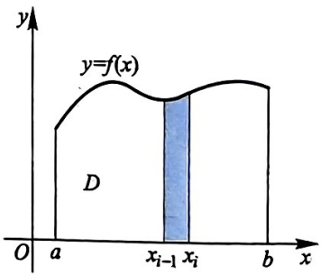

下面我们采用分割、逼近的方法来解决.

图6.1

1. 分割:在区间 $[a, b]$ 内任意插入 $n - 1$ 个分点:

$$
a = x _ {0} <   x _ {1} <   x _ {2} <   \dots <   x _ {n - 1} <   x _ {n} = b,
$$

将区间 $[a, b]$ 分割成 $n$ 个小区间 $[x_{i-1}, x_i] (i = 1, 2, \cdots, n)$, 每个小区间的长度分别为 $\Delta x_i (i = 1, 2, \cdots, n)$, 这样将曲边梯形 $D$ 也分割成 $n$ 个小曲边梯形. 记每个小曲边梯形为 $\Delta S_i$, 其面积也为 $\Delta S_i (i = 1, 2, \cdots, n)$.

记 $\lambda = \max_{1\leqslant i\leqslant n}\{\Delta x_i\}$ ，称 $\lambda$ 为分割

$$
T = \{x _ {0}, x _ {1}, x _ {2}, \dots , x _ {n - 1}, x _ {n} \}
$$

的范数或模, 记作 $\lambda = \| T\|$.

2. 取点: 任取 $\xi_{i} \in [x_{i-1}, x_{i}]$, 以 $f(\xi_{i})$ 为高, $\Delta x_{i} (i = 1, 2, \cdots, n)$ 为底的矩形面积为 $f(\xi_{i}) \Delta x_{i}$. 用该矩形面积近似小曲边梯形的面积, 即

$$
\Delta S _ {i} \approx f (\xi_ {i}) \Delta x _ {i} (i = 1, 2, \dots , n).
$$

3. 作和: 将每个小矩形面积相加, 得到曲边梯形 $D$ 的面积的近似值:

$$
S \approx \sum_ {i = 1} ^ {n} f (\xi_ {i}) \Delta x _ {i}.
$$

4. 求极限: 随着分割越来越细, 即当分割的模趋于零时, 上述和式的极限定义为曲边梯形的面积, 即

$$
S = \lim _ {\lambda \to 0 ^ {+}} \sum_ {i = 1} ^ {n} f (\xi_ {i}) \Delta x _ {i}.
$$

### 二、变速直线运动的路程

#### 例 6.1.2 某物体做直线运动, 其速度  $v = v(t)$ , 求该物体从时刻  $T_{0}$  到时刻  $T_{1} (T_{0} < T_{1})$  所经过的路程.

如果物体做速度为 $v_{0}$ 的匀速直线运动, 那么路程 $s = v_{0}(T_{1} - T_{0})$.

如果物体做变速直线运动, 可采用类似于例 6.1.1 的方法计算路程.

1. 分割: 将时间间隔 $[T_0, T_1]$ 分割成 $n$ 小段, 即在区间 $[T_0, T_1]$ 内任意插入 $n - 1$ 个分点:

$$
T _ {0} = t _ {0} <   t _ {1} <   t _ {2} <   \dots <   t _ {n - 1} <   t _ {n} = T _ {1},
$$

将  $[T_{0}, T_{1}]$  分割成 n 个小区间  $[t_{i-1}, t_{i}] (i = 1, 2, \cdots, n)$ ，每个小区间的长度分别为  $\Delta t_{i} (i = 1, 2, \cdots, n)$ 。记物体在时间间隔  $[t_{i-1}, t_{i}]$  内经过的路程为  $\Delta s_{i} (i = 1, 2, \cdots, n)$ 。

记  $\lambda=\max_{1\leqslant i\leqslant n}\{\Delta t_{i}\},\lambda$  为分割  $T=\{t_{0},t_{1},t_{2},\cdots,t_{n-1},t_{n}\}$  的范数或模, 记作  $\lambda=\|T\|$ .

2. 取点:任取  $\xi_{i} \in [t_{i-1}, t_{i}] (i = 1, 2, \cdots, n)$ ，以物体在时刻  $t = \xi_{i}$  时的速度  $v(\xi_{i})$  作为物体在  $[t_{i-1}, t_{i}]$  这一时间段的速度，这样便得到物体的近似路程  $v(\xi_{i}) \Delta t_{i}$ ，即

$$
\Delta s _ {i} \approx v (\xi_ {i}) \Delta t _ {i} \quad (i = 1, 2, \dots , n),
$$

3. 作和: 将每个时间段的路程相加, 得到从 $T_{0}$ 到 $T_{1}$ 所经过路程的近似值:

$$
s \approx \sum_ {i = 1} ^ {n} v (\xi_ {i}) \Delta t _ {i}.
$$

第6章

4. 求极限:随着时间间隔越来越小, 即当分割的模趋于零时, 上述和式的极限定义为该物体在时间 $[T_0, T_1]$ 内经过的路程, 即

$$
s = \lim _ {\lambda \to 0 ^ {+}} \sum_ {i = 1} ^ {n} v (\xi_ {i}) \Delta t _ {i}.
$$

### 三、变密度直线段构件的质量

#### 例 6.1.3 某截面面积相等的直线段构件, 其线密度为  $\rho = \rho(x) (a \leqslant x \leqslant b)$ , 求该物体的质量 (截面面积相等的物体的线密度为物体单位长度的质量).

如果物体的线密度为常数 $\rho_0$ ，那么其质量 $m = \rho_0(b - a)$

如果物体是变密度, 可采用类似于例 6.1.1 的方法计算其质量.

1. 分割:在区间 $[a, b]$ 内任意插入 $n - 1$ 个分点:

$$
a = x _ {0} <   x _ {1} <   x _ {2} <   \dots <   x _ {n - 1} <   x _ {n} = b,
$$

将区间 $[a, b]$ 分割成 $n$ 个小区间 $[x_{i-1}, x_i] (i = 1, 2, \cdots, n)$, 每个小区间的长度分别为 $\Delta x_i$, 这样将该物体也分割成 $n$ 小段. 记每一小段的质量为 $\Delta m_i (i = 1, 2, \cdots, n)$.

记  $\lambda=\max_{1\leqslant i\leqslant n}\{\Delta x_{i}\},\lambda$  为分割  $T=\{x_{0},x_{1},x_{2},\cdots,x_{n-1},x_{n}\}$  的范数或模，记作  $\lambda=\|T\|$ .

2. 取点:任取  $\xi_{i} \in [x_{i-1}, x_{i}] (i = 1, 2, \cdots, n)$ ，以点  $x = \xi_{i}$  处的线密度  $\rho(\xi_{i})$  近似物体在  $[x_{i-1}, x_{i}] (i = 1, 2, \cdots, n)$  上的密度，则

$$
\Delta m _ {i} \approx \rho (\xi_ {i}) \Delta x _ {i} \quad (i = 1, 2, \dots , n).
$$

3. 作和: 将每一小段物体质量相加, 得到该直线段物体质量的近似值:

$$
m \approx \sum_ {i = 1} ^ {n} \rho (\xi_ {i}) \Delta x _ {i}.
$$

4. 求极限: 随着分割越来越细, 即当分割的模趋于零时, 上述和式的极限即为该直线段物体的质量, 即

$$
m = \lim _ {\lambda \to 0 ^ {+}} \sum_ {i = 1} ^ {n} \rho (\xi_ {i}) \Delta x _ {i}.
$$

**定义 6.1.4** 设  $f(x)$  是定义在  $[a, b]$  上的有界函数, 在区间  $[a, b]$  上任意插入 n-1 个分点:

$$
a = x _ {0} <   x _ {1} <   x _ {2} <   \dots <   x _ {n - 1} <   x _ {n} = b,
$$

§6.1 定积分的概念

将区间 $[a, b]$ 分割成 $n$ 个小区间 $[x_{i-1}, x_i]$, 其长度为 $\Delta x_i = x_i - x_{i-1} (i = 1, 2, \cdots, n)$, 记 $\lambda = \max_{1 \leqslant i \leqslant n} \{\Delta x_i\}$, 称 $\lambda$ 为分割

$$
T = \{x _ {0}, x _ {1}, \dots , x _ {n - 1}, x _ {n} \}
$$

的范数或模. 任取 $\xi_{i} \in [x_{i-1}, x_{i}]$, 作和 $\sum_{i=1}^{n} f(\xi_{i}) \Delta x_{i}$, 其中 $\xi_{i}$ 称为介点.

如果存在常数 $J, \forall \varepsilon > 0, \exists \delta > 0$, 当 $\lambda < \delta$ 时, 对任意分割 $T$ 都有

$$
\left| \sum_ {i = 1} ^ {n} f (\xi_ {i}) \Delta x _ {i} - J \right| <   \varepsilon ,
$$

就称 $f(x)$ 在区间 $[a, b]$ 上可积. 常数 $J$ 称为 $f(x)$ 在 $[a, b]$ 上的定积分. 记作

$$
J = \int_ {a} ^ {b} f (x) \mathrm{d} x,
$$

其中“$\int$”称为积分号, $f(x)$ 称为被积函数, $x$ 为积分变量, $f(x)\mathrm{d}x$ 为积分表达式, $a, b$ 分别称为积分下限与积分上限. 即

$$
\int_ {a} ^ {b} f (x) \mathrm{d} x = \lim _ {\lambda \to 0 ^ {+}} \sum_ {i = 1} ^ {n} f (\xi_ {i}) \Delta x _ {i}.
$$

【注】和式 $\sum_{i=1}^{n} f(\xi_i) \Delta x_i$ 称为黎曼①和, 因此定积分 $\int_{a}^{b} f(x) \mathrm{d}x$ 也称为黎曼积分.

定义在  $[a,b]$  上的函数  $f(x)$ ，对于分割 T，点集  $\xi=\{\xi_{1},\xi_{2},\cdots,\xi_{n}\}$ ，其黎曼和可记为  $S(f,T,\xi)$ .

根据定积分的定义, 上述例子中,

(1) 曲边梯形的面积 $S = \int_{a}^{b} f(x) \, \mathrm{d}x;$

(2) 变速直线运动的路程 $s = \int_{T_0}^{T_1} v(t) \, \mathrm{d}t;$

(3) 变密度直线段构件的质量 $m = \int_{a}^{b} \rho(x) \, \mathrm{d}x$.

由定积分的定义容易得到

> **注：** ① 黎曼 (Riemann, 1826—1866), 德国数学家, 黎曼几何的创始人, 复变函数论创始人之一. 他对数学分析、微分几何和微分方程都做出了重要贡献. 他引入三角级数理论, 奠定了近代解析数论的基础, 最初引入的黎曼曲面这一概念, 对近代拓扑学影响很大. 黎曼几何学为爱因斯坦 (Einstein) 的广义相对论提供了数学基础. 1859 年, 他提出了著名的 “黎曼猜想”.

172

第6章

(1) $\int_{a}^{a} f(x) \mathrm{d}x = 0$; (2) $\int_{b}^{a} f(x) \mathrm{d}x = -\int_{a}^{b} f(x) \mathrm{d}x$.

定积分的几何意义

根据定积分的定义, 当 $f(x) \geqslant 0$ 时, 定积分 $\int_{a}^{b} f(x) \mathrm{d}x$ 的值为由曲线 $y = f(x)$ 和直线 $y = 0, x = a, x = b$ 所围成的曲边梯形的面积; 当 $f(x) \leqslant 0$ 时, 它是该曲边梯形面积的负值. 因此, 定积分 $\int_{a}^{b} f(x) \mathrm{d}x$ 是由曲线 $y = f(x)$ 和直线 $y = 0, x = a, x = b$ 所围成的曲边梯形面积的代数和 (代数面积).

**重难点讲解定积分的定义及其几何意义**

## §6.2 可积函数与定积分的性质

根据定积分的定义来判断函数是否存在定积分是有难度的, 下面不加证明地给出函数 $f(x)$ 在区间 $[a, b]$ 上可积的充分条件, 其证明可参阅数学分析教材.

**定理 6.2.1** 若  $f(x)$  在区间  $[a, b]$  上连续, 则  $f(x)$  在  $[a, b]$  上可积.

**定理 6.2.2** 若有界函数 $f(x)$ 在区间 $[a, b]$ 上最多只有有限个间断点，则 $f(x)$ 在 $[a, b]$ 上可积.

**定理 6.2.3** 若  $f(x)$  在区间  $[a, b]$  上单调, 则  $f(x)$  在  $[a, b]$  上可积.

#### 例 6.2.4 根据定积分的定义计算定积分 $\int_0^1\mathrm{e}^x\mathrm{d}x$ 的值.

解:由于 $f(x) = \mathrm{e}^x$ 在[0,1]上连续，故定积分 $\int_0^1\mathrm{e}^x\mathrm{d}x$ 存在；而定积分 $\int_0^1\mathrm{e}^x\mathrm{d}x$ 为黎曼和的极限，且其极限与分割、取点均无关。现将区间[0,1]分割成 $n$ 等份，其分点为 $x_{k} = \frac{k}{n} (k = 1,2,\dots ,n - 1)$，即

$$
T = \left\{0, \frac {1}{n}, \frac {2}{n}, \dots , \frac {n - 1}{n}, 1 \right\}.
$$

在区间  $\left[\frac{k-1}{n},\frac{k}{n}\right]$  上取点  $\xi_{k}=\frac{k}{n}(k=1,2,\cdots,n)$ ，得

$$
S (f, T, \xi) = \sum_ {k = 1} ^ {n} \frac {1}{n} \mathrm{e} ^ {\frac {k}{n}} = \frac {1}{n} \cdot \frac {\mathrm{e} ^ {\frac {1}{n}} (1 - \mathrm{e})}{1 - \mathrm{e} ^ {\frac {1}{n}}}.
$$

所以

$$
\int_ {0} ^ {1} \mathrm{e} ^ {x} \mathrm{d} x = \lim _ {n \to \infty} S (f, T, \xi) = \lim _ {n \to \infty} \frac {1}{n} \cdot \frac {\mathrm{e} ^ {\frac {1}{n}} (1 - \mathrm{e})}{1 - \mathrm{e} ^ {\frac {1}{n}}} = \mathrm{e} - 1.
$$

§6.2 可积函数与定积分的性质

#### 例 6.2.5 证明狄利克雷函数  $D(x)=\left\{\begin{aligned}&1,&x \text{ 为有理数,}\\ &0,&x \text{ 为无理数}\end{aligned}\right.$  在  $[0,1]$  上不可积.

证明:将区间 $[0,1]$ 分割成 $n$ 等份，其分点为 $x_{i} = \frac{i}{n} (i = 1,2,\dots ,n - 1)$ 在区间 $[x_{i - 1},x_i]$ 上任取点 $\xi_i(i = 1,2,\dots ,n)$.

(1) 当 $\xi_{i}$ 均为有理数时, $S(D,T,\xi)=1$, 从而有 $\lim S(D,T,\xi)=1$.

(2) 当 $\xi_{i}$ 均为无理数时, $S(D,T,\xi)=0$, 从而有 $\lim_{n\to\infty} S(D,T,\xi)=0$.

这样便得到狄利克雷函数 $D(x)$ 在区间 $[0,1]$ 上的黎曼和的极限与取点有关, 因此 $D(x)$ 在 $[0,1]$ 上不可积.

根据定积分的定义, 不难得到

**定理 6.2.6** 假设 $f(x), g(x)$ 在 $[a, b]$ 上可积, 则

(1) $\int_{a}^{b}kf(x)\mathrm{d}x = k\int_{a}^{b}f(x)\mathrm{d}x$ ( $k$ 为实常数);

(2) $\int_{a}^{b}[f(x) + g(x)]\mathrm{d}x = \int_{a}^{b}f(x)\mathrm{d}x + \int_{a}^{b}g(x)\mathrm{d}x.$

**定理 6.2.7** 假设 $f(x)$ 在 $[a,b]$ 上可积, 则 $\forall c\in [a,b]$, 有

$$
\int_ {a} ^ {b} f (x) \mathrm{d} x = \int_ {a} ^ {c} f (x) \mathrm{d} x + \int_ {c} ^ {b} f (x) \mathrm{d} x.
$$

证明: 由于 $f(x)$ 在 $[a, b]$ 上可积, 定积分 $\int_{a}^{b} f(x) \mathrm{d}x$ 的值与区间 $[a, b]$ 的分割 $T$ 无关, 不妨将点 $c$ 作为区间 $[a, b]$ 的一个分点, 这样 $f(x)$ 在 $[a, b]$ 上关于分割 $T$ 的黎曼和可分为两部分: 区间 $[a, c]$ 上的黎曼和与区间 $[c, b]$ 上的黎曼和, 即

$$
\sum_ {[ a, b ]} f (\xi_ {i}) \Delta x _ {i} = \sum_ {[ a, c ]} f (\xi_ {i}) \Delta x _ {i} + \sum_ {[ c, b ]} f (\xi_ {i}) \Delta x _ {i}.
$$

记 $\lambda$ 为区间 $[a, b]$ 关于分割 $T$ 的模, 则

$$
\lim _ {\lambda \to 0 ^ {+}} \sum_ {[ a, b ]} f (\xi_ {i}) \Delta x _ {i} = \lim _ {\lambda \to 0 ^ {+}} \sum_ {[ a, c ]} f (\xi_ {i}) \Delta x _ {i} + \lim _ {\lambda \to 0 ^ {+}} \sum_ {[ c, b ]} f (\xi_ {i}) \Delta x _ {i}.
$$

所以

$$
\int_ {a} ^ {b} f (x) \mathrm{d} x = \int_ {a} ^ {c} f (x) \mathrm{d} x + \int_ {c} ^ {b} f (x) \mathrm{d} x.
$$

实际上, 若 $f(x)$ 在 $[a, c] (c > b)$ 上可积, 同样有

$$
\int_ {a} ^ {b} f (x) \mathrm{d} x = \int_ {a} ^ {c} f (x) \mathrm{d} x + \int_ {c} ^ {b} f (x) \mathrm{d} x.
$$

174

第6章

此性质说明，定积分可以逐段求积分。该性质常用于分段函数的定积分计算。

**定理 6.2.8** 若 $f(x)$ 在 $[a, b]$ 上可积, 且 $f(x) \geqslant 0$, 则 $\int_{a}^{b} f(x) \mathrm{d}x \geqslant 0$.

**推论 6.2.9** 若 $f(x), g(x)$ 在 $[a, b]$ 上可积, 且 $\forall x \in [a, b]$, 有 $f(x) \geqslant g(x)$, 则

$$
\int_ {a} ^ {b} f (x) \mathrm{d} x \geqslant \int_ {a} ^ {b} g (x) \mathrm{d} x.
$$

**推论 6.2.10** 若  $f(x)$  在  $[a, b]$  上可积, 则  $\left|\int_{a}^{b} f(x) \, dx\right| \leqslant \int_{a}^{b} |f(x)| \, dx$ .

#### 例 6.2.11 设  $f(x)$  是区间  $[a, b]$  上非负的连续函数, 证明: 若  $\int_{a}^{b} f(x) \, dx = 0$ , 则  $\forall x \in [a, b]$ , 均有  $f(x) = 0$ .

证明:若 $f(x)$ 在 $[a,b]$ 上不恒等于零, 则 $\exists x_0 \in (a,b)$, 使得 $f(x_0) > 0$. 而 $f(x)$ 在 $x_0$ 处连续, 则 $\exists \delta_0 > 0$, 当 $x_0 - \delta_0 < x < x_0 + \delta_0$ 时, $f(x) > \frac{f(x_0)}{2}$, 且 $\delta_0$ 满足 $(x_0 - \delta_0, x_0 + \delta_0) \subseteq [a,b]$. 因此

$$
\begin{array}{r l} \int_ {a} ^ {b} f (x) \mathrm{d} x & = \int_ {a} ^ {x _ {0} - \delta_ {0}} f (x) \mathrm{d} x + \int_ {x _ {0} - \delta_ {0}} ^ {x _ {0} + \delta_ {0}} f (x) \mathrm{d} x + \int_ {x _ {0} + \delta_ {0}} ^ {b} f (x) \mathrm{d} x \\ & \geqslant \int_ {x _ {0} - \delta_ {0}} ^ {x _ {0} + \delta_ {0}} f (x) \mathrm{d} x > \int_ {x _ {0} - \delta_ {0}} ^ {x _ {0} + \delta_ {0}} \frac {f (x _ {0})}{2} \mathrm{d} x = f (x _ {0}) \delta_ {0} > 0. \end{array}
$$

这与条件 $\int_{a}^{b}f(x)\mathrm{d}x = 0$ 矛盾.故 $\forall x\in [a,b]$ ，均有 $f(x) = 0$

**定理 6.2.12** 若 $f(x)$ 在 $[a,b]$ 上可积, 且 $m \leqslant f(x) \leqslant M$, 则

$$
m (b - a) \leqslant \int_ {a} ^ {b} f (x) \mathrm{d} x \leqslant M (b - a).
$$

**定理 6.2.13** (定积分中值定理) 设  $f(x)$  在  $[a,b]$  上连续, 则  $\exists\xi\in(a,b)$ , 使得

$$
\int_ {a} ^ {b} f (x) \mathrm{d} x = f (\xi) (b - a).
$$

证明:(方法一) 设 $\frac{\int_{a}^{b} f(x) \mathrm{d}x}{b - a} = \mu,$ 若 $\forall x \in (a, b)$, 均有 $f(x) \neq \mu$, 由于 $f(x)$ 在 $[a, b]$ 上连续, 故 $f(x) - \mu$ 在 $[a, b]$ 上保号. 不妨设在 $(a, b)$ 内 $f(x) > \mu,$ 则

$$
\int_ {a} ^ {b} f (x) \mathrm{d} x > (b - a) \mu .
$$

§6.2 可积函数与定积分的性质

从而

$$
\frac {\int_ {a} ^ {b} f (x) \mathrm{d} x}{b - a} > \mu .
$$

这与假设 $\frac{\int_{a}^{b}f(x)\mathrm{d}x}{b - a} = \mu$ 矛盾.因此， $\exists \xi \in (a,b)$ ，使得

$$
\int_ {a} ^ {b} f (x) \mathrm{d} x = f (\xi) (b - a).
$$

(方法二) 由于 $f(x)$ 在 $[a, b]$ 上连续, 从而 $f(x)$ 在 $[a, b]$ 上存在最大值 $M$ 和最小值 $m$, 即 $\exists x_1, x_2 \in [a, b]$, 使得 $M = f(x_1)$, $m = f(x_2)$. 不妨令 $x_1 \leqslant x_2$.

若 $f(x)$ 为常函数, 则结论显然成立.

若 $f(x)$ 不是常函数, 则 $M > m$, 从而有 $x_{1} < x_{2}$. 根据例6.2.11, 有

$$
\int_ {a} ^ {b} [ M - f (x) ] \mathrm{d} x > 0, \quad \int_ {a} ^ {b} [ f (x) - m ] \mathrm{d} x > 0.
$$

因此

$$
m (b - a) <   \int_ {a} ^ {b} f (x) \mathrm{d} x <   M (b - a),
$$

即

$$
m <   \frac {\int_ {a} ^ {b} f (x) \mathrm{d} x}{b - a} <   M.
$$

根据连续函数的介值定理, $\exists \xi \in (x_1, x_2) \subseteq (a, b)$, 使得

$$
f (\xi) = \frac {\int_ {a} ^ {b} f (x) \mathrm{d} x}{b - a}.
$$

故 $\exists \xi \in (a,b)$ ，使得

$$
\int_ {a} ^ {b} f (x) \mathrm{d} x = f (\xi) (b - a).
$$

#### 例 6.2.14 设 $f(x)$ 在 $[0,3]$ 上连续, 在 $(0,3)$ 内可导, 且满足

$$
f (0) + f (1) + f (2) = 3 \int_ {2} ^ {3} f (x) \mathrm{d} x,
$$

证明:$\exists \xi \in (0,3)$，使得 $f'(\xi) = 0$

176

第6章

证明:由于 $f(x)$ 在 $[0,2]$ 上连续，根据连续函数的介值定理，$\exists x_{1} \in [0,2]$，使得

$$
f (x _ {1}) = \frac {f (0) + f (1) + f (2)}{3}.
$$

由积分中值定理, $\exists x_{2} \in (2,3)$, 使得 $\int_{2}^{3} f(x) \mathrm{d}x = f(x_{2})$. 从而有 $f(x_{1}) = f(x_{2})$. 又 $f(x)$ 在 $[x_{1}, x_{2}]$ 上连续, 在 $(x_{1}, x_{2})$ 内可导, 由罗尔定理, $\exists \xi \in (x_{1}, x_{2}) \subseteq (0,3)$, 使得 $f'(\xi) = 0$.

**定理 6.2.15** (推广的定积分中值定理) 设  $f(x), g(x)$  在 [a, b] 上连续, 且  $g(x)$  在 [a, b] 上不变号, 则  $\exists \xi \in (a, b)$ , 使得

$$
\int_ {a} ^ {b} f (x) g (x) \mathrm{d} x = f (\xi) \int_ {a} ^ {b} g (x) \mathrm{d} x.
$$

此定理的证明可参照定积分中值定理的证明, 由读者自行完成.

#### 例 6.2.16 证明: $1 < \int_{0}^{\frac{\pi}{2}}\frac{\sin x}{x}\mathrm{d}x <   \frac{\pi}{2}.$

证明:令 $f(x) = \frac{\sin x}{x}$，由于 $\lim_{x\to 0^+}f(x) = 1$，补充定义 $f(0) = 1$，则 $f(x)$ 在 $\left[0,\frac{\pi}{2}\right]$ 上连续，从而可积.由于

$$
f ^ {\prime} (x) = \frac {x \cos x - \sin x}{x ^ {2}} = \frac {\cos x (x - \tan x)}{x ^ {2}},
$$

又当 $0 < x < \frac{\pi}{2}$ 时, $x < \tan x$, 则 $f'(x) < 0$. 因此, $f(x)$ 在 $\left[0, \frac{\pi}{2}\right]$ 上单调减少. 从而

$$
f \left(\frac {\pi}{2}\right) <   \frac {\sin x}{x} <   f (0).
$$

即当 $0 < x < \frac{\pi}{2}$ 时, 有

$$
\frac {2}{\pi} <   \frac {\sin x}{x} <   1.
$$

由定理6.2.12可得

$$
1 <   \int_ {0} ^ {\frac {\pi}{2}} \frac {\sin x}{x} \mathrm{d} x <   \frac {\pi}{2}.
$$

## §6.3 微积分基本公式

根据定积分的定义计算定积分, 即通过计算黎曼和的极限来计算定积分, 具有很大的技巧和计算难度. 为使定积分的应用成为可能, 必须有比较简单且行之有效的计算方法.

§6.3 微积分基本公式

假设 $f(x)$ 在 $[a, b]$ 上连续, 则 $\forall x \in [a, b]$, 定积分 $\int_{a}^{x} f(t) \mathrm{d}t$ 均存在. 定义 $F(x) = \int_{a}^{x} f(t) \mathrm{d}t (a \leqslant x \leqslant b)$, 称此函数为变上限积分.

**定理 6.3.1**（微积分基本定理）设  $f(x)$  在  $[a,b]$  上连续，则  $F(x)=\int_{a}^{x}f(t)\mathrm{d}t$  在  $[a,b]$  上可导，且  $F'(x)=f(x)$ .

证明: $\forall x\in [a,b]$ ，取增量 $\Delta x$ 使 $x + \Delta x\in [a,b]$ ，则

$$
\begin{array}{r l} F ^ {\prime} (x) & = \lim _ {\Delta x \to 0} \frac {F (x + \Delta x) - F (x)}{\Delta x} = \lim _ {\Delta x \to 0} \frac {\int_ {a} ^ {x + \Delta x} f (t) \mathrm{d} t - \int_ {a} ^ {x} f (t) \mathrm{d} t}{\Delta x} \\ & = \lim _ {\Delta x \to 0} \frac {\int_ {a} ^ {x + \Delta x} f (t) \mathrm{d} t + \int_ {x} ^ {a} f (t) \mathrm{d} t}{\Delta x} = \lim _ {\Delta x \to 0} \frac {\int_ {x} ^ {x + \Delta x} f (t) \mathrm{d} t}{\Delta x} \\ & = \lim _ {\Delta x \to 0} \frac {f (x + \theta \Delta x) \cdot \Delta x}{\Delta x} = f (x) \quad (\text {其中} 0 <   \theta <   1). \end{array}
$$

因此, $F(x) = \int_{a}^{x}f(t)\mathrm{d}t$ 在 $[a,b]$ 上可导, 且 $F^{\prime}(x) = f(x)$.

【注】若 $x = a$ 或 $x = b$, 则所求导数分别为 $F(x)$ 的右导数或左导数.

上面定理表明, 函数 $F(x) = \int_{a}^{x} f(t) \, \mathrm{d}t$ 为连续函数 $f(x)$ 的原函数, 因此连续函数一定存在原函数. 这便回答了上一章不定积分中原函数的存在性问题.

**重难点讲解定积分性质及微积分基本公式**

**定理 6.3.2** (微积分基本公式) 设  $f(x)$  在  $[a, b]$  上连续,  $F(x)$  为  $f(x)$  的一个原函数, 则

$$
\left. \int_ {a} ^ {b} f (x) \mathrm{d} x = F (x) \right| _ {a} ^ {b} = F (b) - F (a).
$$

证明:设 $G(x) = \int_{a}^{x}f(t)\mathrm{d}t$ ，则 $G^{\prime}(x) = f(x)$ .而 $F(x)$ 为 $f(x)$ 的原函数，故

$$
F ^ {\prime} (x) = f (x),
$$

因此存在常数 $C$ ，使得

$$
G (x) = F (x) + C,
$$

又 $F(a) + C = G(a) = 0$ ，则 $C = -F(a)$ .所以

$$
\int_ {a} ^ {b} f (t) \mathrm{d} t = G (b) = F (b) + C = F (b) - F (a).
$$

178

上面的公式称为牛顿 $^{①}$  – 莱布尼茨公式, 也称为微积分基本公式. 它揭示了积分与微分之间的内在联系. 有了此公式后, 连续函数的定积分可转化为计算其原函数端点函数值的差, 这便使定积分的计算变得简单, 从而使定积分的应用成为可能.

#### 例 6.3.3 计算下列函数的导数:

(1) $f(x) = \int_{0}^{x} x \arctan \sqrt[3]{t} \mathrm{d}t;$ (2) $g(x) = \int_{0}^{x^3} \arctan \sqrt[3]{t} \mathrm{d}t.$

解:(1) 由于 $f(x) = x \int_{0}^{x} \arctan \sqrt[3]{t} \, \mathrm{d}t$，故

$$
f ^ {\prime} (x) = \int_ {0} ^ {x} \arctan \sqrt [ 3 ]{t} \mathrm{d} t + x \arctan \sqrt [ 3 ]{x}.
$$

(2) 令 $x^{3} = u$ ，则

$$
g ^ {\prime} (x) = \frac {\mathrm{d} g}{\mathrm{d} x} = \frac {\mathrm{d} g}{\mathrm{d} u} \cdot \frac {\mathrm{d} u}{\mathrm{d} x} = \arctan \sqrt [ 3 ]{u} \cdot 3 x ^ {2} = 3 x ^ {2} \arctan x.
$$

【注】上例说明, 求变上限积分的导数, 可以不用计算出其定积分后再求导数.

#### 例 6.3.4 设 $f(x)$ 在 $\mathbb{R}$ 上连续, $\varphi(x), \psi(x)$ 在 $\mathbb{R}$ 上可导, 求 $\frac{\mathrm{d}}{\mathrm{d}x} \int_{\psi(x)}^{\varphi(x)} f(t) \mathrm{d}t$.

解:因为

$$
\int_ {\psi (x)} ^ {\varphi (x)} f (t) \mathrm{d} t = \int_ {\psi (x)} ^ {a} f (t) \mathrm{d} t + \int_ {a} ^ {\varphi (x)} f (t) \mathrm{d} t = \int_ {a} ^ {\varphi (x)} f (t) \mathrm{d} t - \int_ {a} ^ {\psi (x)} f (t) \mathrm{d} t,
$$

其中 $a$ 为实常数, 所以

$$
\begin{array}{r l} \frac {\mathrm{d}}{\mathrm{d} x} \int_ {\psi (x)} ^ {\varphi (x)} f (t) \mathrm{d} t & = \frac {\mathrm{d}}{\mathrm{d} x} \left(\int_ {a} ^ {\varphi (x)} f (t) \mathrm{d} t - \int_ {a} ^ {\psi (x)} f (t) \mathrm{d} t\right) \\ & = f (\varphi (x)) \cdot \varphi^ {\prime} (x) - f (\psi (x)) \cdot \psi^ {\prime} (x). \end{array}
$$

#### 例 6.3.5 求极限 $\lim_{x\to 0}\frac{\int_0^{2x}(\mathrm{e}^{-t^2} - 1)\sin t\mathrm{d}t}{\arctan^2x\cdot\ln(1 - 2x^2)}.$

> **注：** ① 牛顿 (Newton, 1643–1727), 英国著名的物理学家、数学家, 爵士, 英国皇家学会会长, 著有《自然哲学的数学原理》《光学》等. 他在 1687 年发表的论文《自然定律》里, 对万有引力和三大运动定律进行了描述. 这些描述奠定了此后三个世纪里物理世界的科学观点, 并成了现代工程学的基础. 在力学上, 牛顿阐明了动量和角动量守恒的原理, 提出牛顿运动定律. 在光学上, 他发明了反射望远镜, 并基于对三棱镜将白光发散成可见光谱的观察, 发展出了颜色理论. 他还系统地表述了冷却定律, 并研究了音速. 在数学上, 牛顿与莱布尼茨分享了发展出微积分学的荣誉. 他证明了广义二项式定理, 提出了“牛顿法”以趋近函数的零点, 并为幂级数的研究做出了贡献.

§6.3 微积分基本公式

解:该极限为“$\frac{0}{0}$型”的不定式极限，可用洛必达法则.

$$
\begin{array}{r l} \lim _ {x \to 0} \frac {\int_ {0} ^ {2 x} (\mathrm{e} ^ {- t ^ {2}} - 1) \sin t \mathrm{d} t}{\arctan^ {2} x \cdot \ln (1 - 2 x ^ {2})} & = \lim _ {x \to 0} \frac {\int_ {0} ^ {2 x} (\mathrm{e} ^ {- t ^ {2}} - 1) \sin t \mathrm{d} t}{x ^ {2} \cdot (- 2 x ^ {2})} \\ & = \lim _ {x \to 0} \frac {2 (\mathrm{e} ^ {- 4 x ^ {2}} - 1) \sin 2 x}{- 8 x ^ {3}} \\ & = \lim _ {x \to 0} \frac {- 1 6 x ^ {3}}{- 8 x ^ {3}} = 2. \end{array}
$$

#### 例 6.3.6 计算下列定积分:
(1) $\int_{0}^{1}\mathrm{e}^{x}\mathrm{d}x;$  (2) $\int_{-1}^{0}\frac{x+2}{x^{2}+2x+2}\mathrm{d}x.$

解:(1) 在例 6.2.4 中, 我们利用定积分的定义计算过定积分 $\int_{0}^{1} \mathrm{e}^{x} \mathrm{d}x$, 根据微积分基本公式, 可得

$$
\int_ {0} ^ {1} \mathrm{e} ^ {x} \mathrm{d} x = \mathrm{e} ^ {x} | _ {0} ^ {1} = \mathrm{e} - 1.
$$

$$
\begin{array}{r l} (2) \int_ {- 1} ^ {0} \frac {x + 2}{x ^ {2} + 2 x + 2} \mathrm{d} x & = \frac {1}{2} \int_ {- 1} ^ {0} \frac {(2 x + 2) + 2}{x ^ {2} + 2 x + 2} \mathrm{d} x \\ & = \left. \frac {1}{2} \ln (x ^ {2} + 2 x + 2) \right| _ {- 1} ^ {0} + \int_ {- 1} ^ {0} \frac {1}{(x + 1) ^ {2} + 1} \mathrm{d} x \\ & = \frac {1}{2} \ln 2 + \arctan (x + 1) | _ {- 1} ^ {0} = \frac {1}{2} \ln 2 + \frac {\pi}{4}. \end{array}
$$

#### 例 6.3.7 计算 $\int_{-2}^{2} (|x + 1| + |x - 1|) \, \mathrm{d}x$.

$$
\begin{array}{r l} & {\text {解:} \int_ {- 2} ^ {2} (| x + 1 | + | x - 1 |) \mathrm{d} x} \\ & {\quad = \int_ {- 2} ^ {- 1} [ - (x + 1) + (1 - x) ] \mathrm{d} x + \int_ {- 1} ^ {1} [ (x + 1) + (1 - x) ] \mathrm{d} x +} \\ & {\quad \int_ {1} ^ {2} [ (x + 1) + (x - 1) ] \mathrm{d} x} \\ & {\quad = \int_ {- 2} ^ {- 1} (- 2 x) \mathrm{d} x + 2 \int_ {- 1} ^ {1} \mathrm{d} x + \int_ {1} ^ {2} 2 x \mathrm{d} x = 1 0.} \end{array}
$$

#### 例 6.3.8 计算下列和式的极限:

$$
\lim _ {n \to \infty} \left(\frac {1}{n + 1} + \frac {1}{n + 2} + \dots + \frac {1}{n + n}\right); \tag {1}
$$

第6章

$$
\lim _ {n \to \infty} \left(\frac {\sin \frac {\pi}{n}}{n + \frac {1}{n}} + \frac {\sin \frac {2 \pi}{n}}{n + \frac {2}{n}} + \dots + \frac {\sin \frac {n \pi}{n}}{n + \frac {n}{n}}\right).
$$

解:(1) 记  $S_{n}=\frac{1}{n+1}+\frac{1}{n+2}+\cdots+\frac{1}{n+n}$ ，则

$$
S _ {n} = \frac {1}{n} \left(\frac {1}{1 + \frac {1}{n}} + \frac {1}{1 + \frac {2}{n}} + \dots + \frac {1}{1 + \frac {n}{n}}\right) = \frac {1}{n} \sum_ {k = 1} ^ {n} \frac {1}{1 + \frac {k}{n}}.
$$

令 $f(x) = \frac{1}{1 + x}$, 则 $f(x)$ 在 $[0,1]$ 上可积.

将区间 $[0,1]$ 等分成 $n$ 个小区间，分割 $T = \left\{0,\frac{1}{n},\frac{2}{n},\dots ,\frac{n - 1}{n},1\right\}$ ， $\| T\| =$ $\frac{1}{n}$ ，取点 $\xi_{k} = \frac{k}{n} (k = 1,2,\dots ,n)$ ，则和式 $S_{n}$ 为函数 $f(x)$ 在此分割与取点下的黎曼和.因此

$$
\begin{array}{l} \lim _ {n \to \infty} \left(\frac {1}{n + 1} + \frac {1}{n + 2} + \dots + \frac {1}{n + n}\right) \\ = \lim _ {n \to \infty} \frac {1}{n} \sum_ {k = 1} ^ {n} \frac {1}{1 + \frac {k}{n}} = \int_ {0} ^ {1} \frac {\mathrm{d} x}{1 + x} \\ = \ln (1 + x) \Big | _ {0} ^ {1} = \ln 2. \end{array}
$$

(2) 记 $T_{n} = \frac{\sin\frac{\pi}{n}}{n + \frac{1}{n}} + \frac{\sin\frac{2\pi}{n}}{n + \frac{2}{n}} + \cdots + \frac{\sin\frac{n\pi}{n}}{n + \frac{n}{n}}$，则

$$
\frac {1}{n + 1} \sum_ {k = 1} ^ {n} \sin \frac {k \pi}{n} <   T _ {n} <   \frac {1}{n} \sum_ {k = 1} ^ {n} \sin \frac {k \pi}{n}.
$$

令 $g(x) = \sin \pi x$ ，则 $g(x)$ 在[0,1]上可积

将区间 [0,1] 等分成 n 个小区间, 分割  $T=\left\{0,\frac{1}{n},\frac{2}{n},\cdots,\frac{n-1}{n},1\right\}$ ,  $\|T\|=\frac{1}{n}$ , 取点  $\xi_{k}=\frac{k}{n}(k=1,2,\cdots,n)$ , 则和式  $\frac{1}{n}\sum_{k=1}^{n}\sin\frac{k\pi}{n}$  为函数  $g(x)$  在此分割与取点下的黎曼和. 因此

$$
\lim _ {n \to \infty} \frac {1}{n} \sum_ {k = 1} ^ {n} \sin \frac {k \pi}{n} = \int_ {0} ^ {1} \sin \pi x \mathrm{d} x = - \left. \frac {1}{\pi} \cos \pi x \right| _ {0} ^ {1} = \frac {2}{\pi}.
$$

§6.3 微积分基本公式

同样，

$$
\lim _ {n \to \infty} \frac {1}{n + 1} \sum_ {k = 1} ^ {n} \sin \frac {k \pi}{n} = \lim _ {n \to \infty} \frac {n}{n + 1} \cdot \frac {1}{n} \sum_ {k = 1} ^ {n} \sin \frac {k \pi}{n} = \int_ {0} ^ {1} \sin \pi x \mathrm{d} x = \frac {2}{\pi}.
$$

根据函数极限的夹逼定理, 得

$$
\lim _ {n \to \infty} \left(\frac {\sin \frac {\pi}{n}}{n + \frac {1}{n}} + \frac {\sin \frac {2 \pi}{n}}{n + \frac {2}{n}} + \dots + \frac {\sin \frac {n \pi}{n}}{n + \frac {n}{n}}\right) = \frac {2}{\pi}.
$$

## §6.4 定积分的换元积分法与分部积分法

有了牛顿-莱布尼茨公式后, 计算连续函数的定积分就转化为求其原函数 (不定积分) 的问题. 本节主要介绍定积分的换元积分法、分部积分法和一些特殊函数类的定积分.

### 一、定积分的换元积分法

**定理 6.4.1** 设 $f(x)$ 在 $[a, b]$ 上连续, $\varphi(t)$ 在 $[\alpha, \beta]$ 上有连续导数, 且 $\varphi(\alpha) = a$, $\varphi(\beta) = b$, 其值域 $\varphi([\alpha, \beta]) \subseteq [a, b]$, 则

$$
\int_ {a} ^ {b} f (x) \mathrm{d} x = \int_ {\alpha} ^ {\beta} f (\varphi (t)) \cdot \varphi^ {\prime} (t) \mathrm{d} t.
$$

证明: 由于 $f(x)$ 在 $[a, b]$ 上连续, 故 $f(x)$ 存在原函数. 设其原函数为 $F(x)$, 根据牛顿-莱布尼茨公式, 有

$$
\int_ {a} ^ {b} f (x) \mathrm{d} x = F (b) - F (a).
$$

又

$$
\frac {\mathrm{d}}{\mathrm{d} t} (F (\varphi (t))) = F ^ {\prime} (\varphi (t)) \cdot \varphi^ {\prime} (t) = f (\varphi (t)) \cdot \varphi^ {\prime} (t),
$$

即 $F(\varphi (t))$ 为函数 $f(\varphi (t))\cdot \varphi '(t)$ 的原函数.由牛顿-莱布尼茨公式可得

$$
\int_ {\alpha} ^ {\beta} f (\varphi (t)) \cdot \varphi^ {\prime} (t) \mathrm{d} t = F (\varphi (t)) | _ {\alpha} ^ {\beta} = F (\varphi (\beta)) - F (\varphi (\alpha)) = F (b) - F (a).
$$

所以

**重难点讲解定积分的换元积分法**

$$
\int_ {a} ^ {b} f (x) \mathrm{d} x = \int_ {\alpha} ^ {\beta} f (\varphi (t)) \cdot \varphi^ {\prime} (t) \mathrm{d} t.
$$

182

第6章

定积分的换元积分法, 实际上是通过变换 $x = \varphi(t)$ 将定积分 $\int_{a}^{b} f(x) \mathrm{d}x$ 化为 $\int_{\alpha}^{\beta} f(\varphi(t)) \cdot \varphi'(t) \mathrm{d}t$ 进行计算, 从而简化了计算过程. 与不定积分的换元积分法不同, 此处要求所作变换的函数 $\varphi(t)$ 的值域满足 $\varphi([\alpha, \beta]) \subseteq [\alpha, b]$, 且对积分限作相应变化——“换元换限”; 但与不定积分不同, 不需要再将 $t = \varphi^{-1}(x)$ 代回.

#### 例 6.4.2 计算 $\int_0^3\frac{\mathrm{d}x}{1 + \sqrt{1 + x}}.$

解:令 $\sqrt{1 + x} = t$ ，则 $x = t^2 - 1, \mathrm{d}x = 2t\mathrm{d}t.$ 故

$$
\begin{array}{r l} \int_ {0} ^ {3} \frac {\mathrm{d} x}{1 + \sqrt {1 + x}} & = \int_ {1} ^ {2} \frac {2 t}{t + 1} \mathrm{d} t = 2 \int_ {1} ^ {2} \left(1 - \frac {1}{t + 1}\right) \mathrm{d} t \\ & = 2 [ t - \ln (1 + t) ] | _ {1} ^ {2} = 2 - 2 \ln \frac {3}{2}. \end{array}
$$

#### 例 6.4.3 计算 $\int_{-a}^{a}\sqrt{a^2 - x^2}\mathrm{d}x(a > 0)$

解:令 $x = a\sin t$ ，则 $\mathrm{dx} = a\cos t\mathrm{dt}$ .所以

$$
\begin{array}{c} \left| \int_ {- a} ^ {a} \sqrt {a ^ {2} - x ^ {2}} \mathrm{d} x = \int_ {- \frac {\pi}{2}} ^ {\frac {\pi}{2}} a \cos t \cdot a \cos t \mathrm{d} t = \frac {a ^ {2}}{2} \int_ {- \frac {\pi}{2}} ^ {\frac {\pi}{2}} (1 + \cos 2 t) \mathrm{d} t \right| \\ = \left. \frac {a ^ {2}}{2} \left(t + \frac {1}{2} \sin 2 t\right) \right| _ {- \frac {\pi}{2}} ^ {\frac {\pi}{2}} = \frac {1}{2} \pi a ^ {2}. \end{array}
$$

事实上, 根据定积分的几何意义, $\int_{-a}^{a} \sqrt{a^2 - x^2} \mathrm{d}x$ 是半径为 $a$ 的半圆面积.

#### 例 6.4.4 设

$$
f (x) = \left\{ \begin{array}{l l} \mathrm{e} ^ {- x}, & x \leqslant 0, \\ 3 x ^ {2} + 1, & x > 0, \end{array} \right.
$$

计算 $\int_0^2 f(x - 1)\mathrm{d}x.$

解:令 $x - 1 = t$ ，则 $x = t + 1, \mathrm{d}x = \mathrm{d}t.$ 于是

$$
\begin{array}{r l} \int_ {0} ^ {2} f (x - 1) \mathrm{d} x & = \int_ {- 1} ^ {1} f (t) \mathrm{d} t = \int_ {- 1} ^ {0} f (t) \mathrm{d} t + \int_ {0} ^ {1} f (t) \mathrm{d} t \\ & = \int_ {- 1} ^ {0} \mathrm{e} ^ {- t} \mathrm{d} t + \int_ {0} ^ {1} (3 t ^ {2} + 1) \mathrm{d} t = - \mathrm{e} ^ {- t} | _ {- 1} ^ {0} + (t ^ {3} + t) | _ {0} ^ {1} \\ & = \mathrm{e} + 1. \end{array}
$$

§6.4 定积分的换元积分法与分部积分法

#### 例 6.4.5 计算 $\int_0^1\frac{\ln(1 + x)}{1 + x^2}\mathrm{d}x.$

解:令 $x = \tan u$ ，则 $\mathrm{dx} = \sec^2 u\mathrm{d}u.$ 于是

$$
\int_ {0} ^ {1} \frac {\ln (1 + x)}{1 + x ^ {2}} \mathrm{d} x = \int_ {0} ^ {\frac {\pi}{4}} \frac {\ln (1 + \tan u)}{1 + \tan^ {2} u} \sec^ {2} u \mathrm{d} u = \int_ {0} ^ {\frac {\pi}{4}} \ln (1 + \tan u) \mathrm{d} u.
$$

(方法一) $\int_0^{\frac{\pi}{4}}\ln (1 + \tan u)\mathrm{d}u = \int_0^{\frac{\pi}{4}}\ln (\sin u + \cos u)\mathrm{d}u - \int_0^{\frac{\pi}{4}}\ln \cos u\mathrm{d}u.$ 又

$$
\begin{array}{r l} \int_ {0} ^ {\frac {\pi}{4}} \ln (\sin u + \cos u) \mathrm{d} u & = \int_ {0} ^ {\frac {\pi}{4}} \ln \left[ \sqrt {2} \sin \left(u + \frac {\pi}{4}\right) \right] \mathrm{d} u \\ & = \frac {\pi}{8} \ln 2 + \int_ {\frac {\pi}{4}} ^ {\frac {\pi}{2}} \ln \sin t \mathrm{d} t \\ & \stackrel {{t = \frac {\pi}{2} - u}} {{=}} \frac {\pi}{8} \ln 2 - \int_ {\frac {\pi}{4}} ^ {0} \ln \cos u \mathrm{d} u \\ & = \frac {\pi}{8} \ln 2 + \int_ {0} ^ {\frac {\pi}{4}} \ln \cos u \mathrm{d} u. \end{array}
$$

因此

$$
\int_ {0} ^ {1} \frac {\ln (1 + x)}{1 + x ^ {2}} \mathrm{d} x = \frac {\pi}{8} \ln 2.
$$

(方法二) 令 $u = \frac{\pi}{4} - t$, 则 $\mathrm{d}u = -\mathrm{d}t$. 于是

$$
\begin{array}{r l} \int_ {0} ^ {\frac {\pi}{4}} \ln (1 + \tan u) \mathrm{d} u & = \int_ {0} ^ {\frac {\pi}{4}} \ln \left(1 + \frac {1 - \tan t}{1 + \tan t}\right) \mathrm{d} t \\ & = \frac {\pi}{4} \ln 2 - \int_ {0} ^ {\frac {\pi}{4}} \ln (1 + \tan t) \mathrm{d} t. \end{array}
$$

因此

$$
\int_ {0} ^ {1} \frac {\ln (1 + x)}{1 + x ^ {2}} \mathrm{d} x = \frac {\pi}{8} \ln 2.
$$

(方法三) 根据方法二所作的变换, 本题可直接作如下变化. 令 $x = \frac{1 - u}{1 + u}$, 则 $\mathrm{d}x = -\frac{2\mathrm{d}u}{(1 + u)^2}$. 故

$$
\int_ {0} ^ {1} \frac {\ln (1 + x)}{1 + x ^ {2}} \mathrm{d} x = \int_ {1} ^ {0} \frac {\ln \left(1 + \frac {1 - u}{1 + u}\right)}{1 + \frac {(1 - u) ^ {2}}{(1 + u) ^ {2}}} \left[ - \frac {2}{(1 + u) ^ {2}} \right] \mathrm{d} u
$$

第6章

$$
\begin{array}{l} = \int_ {0} ^ {1} \frac {\ln 2 - \ln (1 + u)}{1 + u ^ {2}} \mathrm{d} u \\ = \frac {\pi}{4} \ln 2 - \int_ {0} ^ {1} \frac {\ln (1 + u)}{1 + u ^ {2}} \mathrm{d} u. \end{array}
$$

因此

$$
\int_ {0} ^ {1} \frac {\ln (1 + x)}{1 + x ^ {2}} \mathrm{d} x = \frac {\pi}{8} \ln 2.
$$

从本例中可以看出, 适当的变量替换, 即换元的思想在定积分计算中的重要性. 希望读者通过适当的练习, 真正领会并熟练掌握定积分的换元积分法.

#### 例 6.4.6 设函数  $f(x)$  在  $[-a, a](a > 0)$  上可积，则

$$
\int_ {- a} ^ {a} f (x) \mathrm{d} x = \int_ {0} ^ {a} [ f (x) + f (- x) ] \mathrm{d} x.
$$

证明: $\int_{-a}^{a}f(x)\mathrm{d}x = \int_{-a}^{0}f(x)\mathrm{d}x + \int_{0}^{a}f(x)\mathrm{d}x.$

对积分 $\int_{-a}^{0}f(x)\mathrm{d}x$ ，令 $x = -t,$ 则 $\mathrm{dx} = -\mathrm{dt}$ 故

$$
\int_ {- a} ^ {0} f (x) \mathrm{d} x = \int_ {a} ^ {0} f (- t) (- \mathrm{d} t) = \int_ {0} ^ {a} f (- t) \mathrm{d} t = \int_ {0} ^ {a} f (- x) \mathrm{d} x.
$$

所以

$$
\int_ {- a} ^ {a} f (x) \mathrm{d} x = \int_ {0} ^ {a} [ f (x) + f (- x) ] \mathrm{d} x.
$$

由例6.4.6可得

(1) 若 $f(x)$ 是区间 $[-a, a]$ 上的奇函数, 则 $\int_{-a}^{a} f(x) \mathrm{d}x = 0$;

(2) 若 $f(x)$ 是区间 $[-a, a]$ 上的偶函数, 则 $\int_{-a}^{a} f(x) \mathrm{d}x = 2 \int_{0}^{a} f(x) \mathrm{d}x$.

#### 例 6.4.7 计算 $\int_{-2}^{2}x\ln (1 + \mathrm{e}^x)\mathrm{d}x.$

解:由例6.4.6可得

$$
\begin{array}{r l} \int_ {- 2} ^ {2} x \ln (1 + \mathrm{e} ^ {x}) \mathrm{d} x & = \int_ {0} ^ {2} [ x \ln (1 + \mathrm{e} ^ {x}) + (- x) \ln (1 + \mathrm{e} ^ {- x}) ] \mathrm{d} x \\ & = \int_ {0} ^ {2} x ^ {2} \mathrm{d} x = \frac {8}{3}, \end{array}
$$

#### 例 6.4.8 设  $f(x)$  是周期为  $T(T > 0)$  的可积函数, 证明:  $\forall a \in R_{i}$  均有

$$
\int_ {a} ^ {a + T} f (x) \mathrm{d} x = \int_ {0} ^ {T} f (x) \mathrm{d} x.
$$

§6.4 定积分的换元积分法与分部积分法

证明:根据定积分的性质，

$$
\int_ {a} ^ {a + T} f (x) \mathrm{d} x = \int_ {a} ^ {0} f (x) \mathrm{d} x + \int_ {0} ^ {T} f (x) \mathrm{d} x + \int_ {T} ^ {a + T} f (x) \mathrm{d} x.
$$

而

$$
\int_ {T} ^ {a + T} f (x) \mathrm{d} x \stackrel {x = T + t} {=} \int_ {0} ^ {a} f (T + t) \mathrm{d} (T + t) = \int_ {0} ^ {a} f (t) \mathrm{d} t.
$$

因此

$$
\int_ {a} ^ {0} f (x) \mathrm{d} x + \int_ {T} ^ {a + T} f (x) \mathrm{d} x = 0.
$$

所以

$$
\int_ {a} ^ {a + T} f (x) \mathrm{d} x = \int_ {0} ^ {T} f (x) \mathrm{d} x.
$$

本题说明:可积的周期函数在一个周期内的积分值为常数.

#### 例 6.4.9 设  $f(x)$  在 [0,1] 上可积.

(1) 证明: $\int_{0}^{\frac{\pi}{2}} f(\sin x) \mathrm{d}x = \int_{0}^{\frac{\pi}{2}} f(\cos x) \mathrm{d}x;$

(2) 证明: $\int_{0}^{\pi} f(\sin x) \mathrm{d}x = 2 \int_{0}^{\frac{\pi}{2}} f(\sin x) \mathrm{d}x;$

(3) 证明: $\int_{0}^{\pi} x f(\sin x) \mathrm{d}x = \frac{\pi}{2} \int_{0}^{\pi} f(\sin x) \mathrm{d}x$, 并计算 $\int_{0}^{\pi} \frac{x \sin x}{1 + \cos^{2} x} \mathrm{d}x$ 的值.

解:(1) 令 $x = \frac{\pi}{2} - t$，则 $\mathrm{d}x = -\mathrm{d}t$. 于是

$$
\int_ {0} ^ {\frac {\pi}{2}} f (\sin x) \mathrm{d} x = - \int_ {\frac {\pi}{2}} ^ {0} f \left[ \sin \left(\frac {\pi}{2} - t\right) \right] \mathrm{d} t = \int_ {0} ^ {\frac {\pi}{2}} f (\cos t) \mathrm{d} t = \int_ {0} ^ {\frac {\pi}{2}} f (\cos x) \mathrm{d} x.
$$

(2) 令 $x = \pi - t$, 则

$$
\int_ {\frac {\pi}{2}} ^ {\pi} f (\sin x) \mathrm{d} x = \int_ {0} ^ {\frac {\pi}{2}} f (\sin t) \mathrm{d} t.
$$

因此

$$
\int_ {0} ^ {\pi} f (\sin x) \mathrm{d} x = \int_ {0} ^ {\frac {\pi}{2}} f (\sin x) \mathrm{d} x + \int_ {\frac {\pi}{2}} ^ {\pi} f (\sin x) \mathrm{d} x = 2 \int_ {0} ^ {\frac {\pi}{2}} f (\sin x) \mathrm{d} x.
$$

(3) 令 $x = \pi - t$, 则 $\mathrm{d}x = -\mathrm{d}t$. 故

$$
\int_ {0} ^ {\pi} x f (\sin x) \mathrm{d} x = \int_ {0} ^ {\pi} (\pi - t) f (\sin t) \mathrm{d} t = \pi \int_ {0} ^ {\pi} f (\sin t) \mathrm{d} t - \int_ {0} ^ {\pi} t f (\sin t) \mathrm{d} t.
$$

186

第6章

因此

$$
\int_ {0} ^ {\pi} x f (\sin x) \mathrm{d} x = \frac {\pi}{2} \int_ {0} ^ {\pi} f (\sin x) \mathrm{d} x.
$$

而

$$
\begin{array}{r l} \int_ {0} ^ {\pi} \frac {x \sin x}{1 + \cos^ {2} x} \mathrm{d} x & = \int_ {0} ^ {\pi} x \cdot \frac {\sin x}{2 - \sin^ {2} x} \mathrm{d} x = \frac {\pi}{2} \int_ {0} ^ {\pi} \frac {\sin x}{2 - \sin^ {2} x} \mathrm{d} x \\ & = - \frac {\pi}{2} \int_ {0} ^ {\pi} \frac {\mathrm{d} (\cos x)}{1 + \cos^ {2} x} = - \frac {\pi}{2} \left. \arctan (\cos x) \right| _ {0} ^ {\pi} \\ & = \frac {\pi^ {2}}{4}. \end{array}
$$

#### 例 6.4.10 证明:  $\int_{0}^{2\pi}\sin^{2n}x dx=4\int_{0}^{\frac{2\pi}{2}}\sin^{2n}x dx$  (n 为正整数).

证明:由于 $\sin^{2n}x$ 是周期为 $\pi$ 的函数，故

$$
\int_ {0} ^ {2 \pi} \sin^ {2 n} x \mathrm{d} x = 2 \int_ {0} ^ {\pi} \sin^ {2 n} x \mathrm{d} x.
$$

根据例6.4.9可得

$$
\int_ {0} ^ {\pi} \sin^ {2 n} x \mathrm{d} x = 2 \int_ {0} ^ {\frac {\pi}{2}} \sin^ {2 n} x \mathrm{d} x.
$$

所以

$$
\int_ {0} ^ {2 \pi} \sin^ {2 n} x \mathrm{d} x = 4 \int_ {0} ^ {\frac {\pi}{2}} \sin^ {2 n} x \mathrm{d} x.
$$

再根据下一节的沃利斯公式, 可得

$$
\int_ {0} ^ {2 \pi} \sin^ {2 n} x \mathrm{d} x = 4 \cdot \frac {(2 n - 1) ! !}{(2 n) ! !} \cdot \frac {\pi}{2} = 2 \pi \cdot \frac {(2 n - 1) ! !}{(2 n) ! !}.
$$

### 二、定积分的分部积分法

设 $u = u(x), v = v(x)$ 在 $[a, b]$ 上有连续导数，则

$$
\mathrm{d} (u v) = u \mathrm{d} v + v \mathrm{d} u.
$$

因此

$$
\begin{array}{r l} \int_ {a} ^ {b} u (x) v ^ {\prime} (x) \mathrm{d} x & = \int_ {a} ^ {b} [ \mathrm{d} (u (x) v (x)) - u ^ {\prime} (x) v (x) \mathrm{d} x ] \\ & = (u (x) v (x)) | _ {a} ^ {b} - \int_ {a} ^ {b} u ^ {\prime} (x) v (x) \mathrm{d} x. \end{array}
$$

§6.4 定积分的换元积分法与分部积分法

这就是定积分的分部积分公式. 在利用其计算定积分时, 不必求出被积函数的原函数后, 再将上下限代入求出其函数值的差, 可计算 “一步” 代入 “一步”.

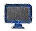

**重难点讲解定积分的分部积分法**

#### 例 6.4.11 计算 $\int_0^1 x\arctan x\mathrm{d}x.$

解:由定积分的分部积分公式，得

$$
\begin{array}{r l} \int_ {0} ^ {1} x \arctan x \mathrm{d} x & = \frac {1}{2} \int_ {0} ^ {1} \arctan x \mathrm{d} (x ^ {2}) \\ & = \frac {1}{2} (x ^ {2} \arctan x) | _ {0} ^ {1} - \frac {1}{2} \int_ {0} ^ {1} \frac {x ^ {2}}{1 + x ^ {2}} \mathrm{d} x \\ & = \frac {\pi}{8} - \frac {1}{2} (x - \arctan x) | _ {0} ^ {1} = \frac {\pi - 2}{4}. \end{array}
$$

#### 例 6.4.12 计算 $\int_{1}^{\mathrm{e}}\sin (\ln x)\mathrm{d}x.$

解:由定积分的分部积分公式，得

$$
\begin{array}{r l} \int_ {1} ^ {\mathrm{e}} \sin (\ln x) \mathrm{d} x & = [ x \sin (\ln x) ] | _ {1} ^ {\mathrm{e}} - \int_ {1} ^ {\mathrm{e}} \cos (\ln x) \mathrm{d} x \\ & = \mathrm{e} \sin 1 - [ x \cos (\ln x) ] | _ {1} ^ {\mathrm{e}} - \int_ {1} ^ {\mathrm{e}} \sin (\ln x) \mathrm{d} x \\ & = \mathrm{e} \sin 1 - \mathrm{e} \cos 1 + 1 - \int_ {1} ^ {\mathrm{e}} \sin (\ln x) \mathrm{d} x. \end{array}
$$

因此

$$
\int_ {1} ^ {\mathrm{e}} \sin (\ln x) \mathrm{d} x = \frac {1}{2} (\mathrm{e} \sin 1 - \mathrm{e} \cos 1 + 1).
$$

#### 例 6.4.13 设 $f(x) = \int_{1}^{x}\frac{\mathrm{d}t}{\sqrt[3]{1 + t^3}}$，计算 $\int_0^1 xf(x)\mathrm{d}x$.

解: 由于计算函数 $f(x)$ 有难度, 通过求 $xf(x)$ 的原函数来计算定积分比较困难, 考虑用分部积分法计算该定积分.

$$
\begin{array}{r l} \int_ {0} ^ {1} x f (x) \mathrm{d} x & = \frac {1}{2} \int_ {0} ^ {1} f (x) \mathrm{d} (x ^ {2}) \\ & = \frac {1}{2} [ x ^ {2} f (x) ] | _ {0} ^ {1} - \frac {1}{2} \int_ {0} ^ {1} \frac {x ^ {2}}{\sqrt [ 3 ]{1 + x ^ {3}}} \mathrm{d} x \\ & = - \frac {1}{6} \cdot \frac {3}{2} (1 + x ^ {3}) ^ {\frac {2}{3}} | _ {0} ^ {1} \\ & = \frac {1 - \sqrt [ 3 ]{4}}{4}. \end{array}
$$

188

第6章

#### 例 6.4.14 证明:  $\int_{0}^{\frac{\pi}{2}}\sin^{n}x dx=\int_{0}^{\frac{\pi}{2}}\cos^{n}x dx$  ( $n=0,1,2,\cdots$ ), 并计算其值.

解:令 $x = \frac{\pi}{2} - t$，则 $\mathrm{d}x = -\mathrm{d}t$。于是

$$
\int_ {0} ^ {\frac {\pi}{2}} \sin^ {n} x \mathrm{d} x = - \int_ {\frac {\pi}{2}} ^ {0} \sin^ {n} \left(\frac {\pi}{2} - t\right) \mathrm{d} t = \int_ {0} ^ {\frac {\pi}{2}} \cos^ {n} t \mathrm{d} t = \int_ {0} ^ {\frac {\pi}{2}} \cos^ {n} x \mathrm{d} x.
$$

记 $I_{n} = \int_{0}^{\frac{\pi}{2}}\sin^{n}x\mathrm{d}x,$ 则 $I_0 = \frac{\pi}{2},I_1 = 1.$ 当 $n\geqslant 2$ 时，

$$
\begin{array}{r l} & {\left| I _ {n} = - \int_ {0} ^ {\frac {\pi}{2}} \sin^ {n - 1} x \mathrm{d} (\cos x) \right.} \\ & {\qquad = (n - 1) \int_ {0} ^ {\frac {\pi}{2}} \sin^ {n - 2} x \cdot \cos^ {2} x \mathrm{d} x} \\ & {\qquad = (n - 1) I _ {n - 2} - (n - 1) I _ {n}.} \end{array}
$$

因此

$$
I _ {n} = \frac {n - 1}{n} I _ {n - 2}.
$$

由此可得当 $n = 2m + 1 (m = 1, 2, \dots)$ 时，

$$
\begin{array}{r l} I _ {n} & = I _ {2 m + 1} = \frac {2 m}{2 m + 1} I _ {2 m - 1} = \frac {2 m}{2 m + 1} \cdot \frac {2 m - 2}{2 m - 1} \cdot \dots \cdot \frac {4}{5} \cdot \frac {2}{3} I _ {1} \\ & = \frac {2 m}{2 m + 1} \cdot \frac {2 m - 2}{2 m - 1} \cdot \dots \cdot \frac {4}{5} \cdot \frac {2}{3} \cdot 1 = \frac {(2 m) ! !}{(2 m + 1) ! !}. \end{array}
$$

当 $n = 2m$ $(m = 1,2,\dots)$ 时，

$$
\begin{array}{r l} I _ {n} & = I _ {2 m} = \frac {2 m - 1}{2 m} I _ {2 m - 2} = \frac {2 m - 1}{2 m} \cdot \frac {2 m - 3}{2 m - 2} \cdot \dots \cdot \frac {3}{4} \cdot \frac {1}{2} I _ {0} \\ & = \frac {2 m - 1}{2 m} \cdot \frac {2 m - 3}{2 m - 2} \cdot \dots \cdot \frac {3}{4} \cdot \frac {1}{2} \cdot \frac {\pi}{2} = \frac {(2 m - 1) ! !}{(2 m) ! !} \cdot \frac {\pi}{2}. \end{array}
$$

综上可得

$$
\int_ {0} ^ {\frac {\pi}{2}} \sin^ {n} x \mathrm{d} x = \left\{ \begin{array}{l l} { \frac {n - 1}{n} \cdot \frac {n - 3}{n - 2} \cdot \dots \cdot \frac {2}{3} \cdot 1,} & {n \text {为奇数},} \\ { \frac {n - 1}{n} \cdot \frac {n - 3}{n - 2} \cdot \dots \cdot \frac {3}{4} \cdot \frac {1}{2} \cdot \frac {\pi}{2},} & {n \text {为偶数}.} \end{array} \right.
$$

上面的公式称为沃利斯 $^{①}$ 公式. 沃利斯公式可作为结论直接应用.

> **注：** ① 沃利斯 (Wallis, 1616—1703), 英国数学家、物理学家. 沃利斯认真钻研了同时代数学家笛卡儿、卡瓦列里等人的论著, 翻译了一些古代数学家著作, 1649 年成为牛津大学萨维尔教授, 并保持席位达 54 年之久, 直到逝世. 沃利斯是英国皇家学会创始人之一, 并且是国王的牧师. 沃利斯是微积分的先驱者之一, 主要著作有《论圆锥曲线》《无穷算术》《论摆线》《代数学》《数学文集》等.

§6.4 定积分的换元积分法与分部积分法

【注】记号 $(2n)!! = 2 \cdot 4 \cdot 6 \cdot \cdots \cdot (2n), (2n - 1)!! = 1 \cdot 3 \cdot 5 \cdot \cdots \cdot (2n - 1)$，称为双阶乘.

#### 例 6.4.15 计算 $\int_{-1}^{1}(2x + 3|x|)^{3}\sqrt{1 - x^{2}}\mathrm{d}x.$

解:根据对称区间上奇偶函数定积分的性质，

$$
\begin{array}{l} \int_ {- 1} ^ {1} (2 x + 3 | x |) ^ {3} \sqrt {1 - x ^ {2}} \mathrm{d} x \\ = \int_ {- 1} ^ {1} [ (8 x ^ {3} + 5 4 x | x | ^ {2}) + (3 6 x ^ {2} | x | + 2 7 | x | ^ {3}) ] \sqrt {1 - x ^ {2}} \mathrm{d} x \\ = 2 \int_ {0} ^ {1} (3 6 x ^ {2} | x | + 2 7 | x | ^ {3}) \sqrt {1 - x ^ {2}} \mathrm{d} x \\ = 1 2 6 \int_ {0} ^ {1} x ^ {3} \sqrt {1 - x ^ {2}} \mathrm{d} x. \end{array}
$$

令 $x = \sin t$ ，则 $\mathrm{dx} = \cos t\mathrm{dt}$ .于是

$$
\begin{array}{c} \int_ {0} ^ {1} x ^ {3} \sqrt {1 - x ^ {2}} \mathrm{d} x = \int_ {0} ^ {\frac {\pi}{2}} \sin^ {3} t \cos^ {2} t \mathrm{d} t = \int_ {0} ^ {\frac {\pi}{2}} (\sin^ {3} t - \sin^ {5} t) \mathrm{d} t \\ = \frac {2}{3} \cdot 1 - \frac {4}{5} \cdot \frac {2}{3} \cdot 1 = \frac {2}{1 5}. \end{array}
$$

因此

$$
\int_ {- 1} ^ {1} (2 x + 3 | x |) ^ {3} \sqrt {1 - x ^ {2}} \mathrm{d} x = \frac {8 4}{5}.
$$

#### 例 6.4.16 计算 $\int_{-\pi}^{\pi}(x\cos^5 x + x\sin^5 x)\mathrm{d}x.$

解:由于 $x\cos^5 x$ 是奇函数，$x\sin^5 x$ 是偶函数，故 $\int_{-\pi}^{\pi} x\cos^5 x \mathrm{d}x = 0.$ 于是

$$
\begin{array}{r l} \int_ {- \pi} ^ {\pi} (x \cos^ {5} x + x \sin^ {5} x) \mathrm{d} x & = 2 \int_ {0} ^ {\pi} x \sin^ {5} x \mathrm{d} x = 2 \cdot \frac {\pi}{2} \int_ {0} ^ {\pi} \sin^ {5} x \mathrm{d} x \\ & = \pi \cdot 2 \int_ {0} ^ {\frac {\pi}{2}} \sin^ {5} x \mathrm{d} x = 2 \pi \cdot \frac {4}{5} \cdot \frac {2}{3} \cdot 1 \\ & = \frac {1 6}{1 5} \pi . \end{array}
$$

#### 例 6.4.17 计算 $\int_{-\frac{\pi}{2}}^{\frac{\pi}{2}}\frac{\cos^4x}{1 + \mathrm{e}^x}\mathrm{d}x.$

解: $\int_{-\frac{\pi}{2}}^{\frac{\pi}{2}}\frac{\cos^4x}{1 + \mathrm{e}^x}\mathrm{d}x = \int_0^{\frac{\pi}{2}}\left(\frac{\cos^4x}{1 + \mathrm{e}^x} +\frac{\cos^4x}{1 + \mathrm{e}^{-x}}\right)\mathrm{d}x$

190

第6章

$$
\begin{array}{l} = \int_ {0} ^ {\frac {\pi}{2}} \left(\frac {\cos^ {4} x}{1 + \mathrm{e} ^ {x}} + \frac {\mathrm{e} ^ {x} \cos^ {4} x}{1 + \mathrm{e} ^ {x}}\right) \mathrm{d} x \\ = \int_ {0} ^ {\frac {\pi}{2}} \cos^ {4} x \mathrm{d} x = \frac {3}{4} \cdot \frac {1}{2} \cdot \frac {\pi}{2} \\ = \frac {3}{1 6} \pi . \end{array}
$$

### 三、变上限积分的导数与定积分不等式

上一节曾讨论过变上限积分的可导性问题, 下面我们作进一步研究.

#### 例 6.4.18 设 $f(x)$ 在 $x = 0$ 的某邻域内连续, 且 $f(0) = 0, f'(0) = 2$, 求

$$
\lim _ {x \to 0} \frac {\int_ {0} ^ {x} t f (x - t) \mathrm{d} t}{\arcsin x - x}.
$$

**重难点讲解变上限函数与定积分不等式**

解:记 $F(x) = \int_0^x tf(x - t)\mathrm{d}t,$ 令 $x - t = u,$ 则 $t = x - u,\mathrm{d}t = -\mathrm{d}u.$ 故

$$
F (x) = \int_ {0} ^ {x} (x - u) f (u) \mathrm{d} u = x \int_ {0} ^ {x} f (u) \mathrm{d} u - \int_ {0} ^ {x} u f (u) \mathrm{d} u.
$$

因此

$$
F ^ {\prime} (x) = \int_ {0} ^ {x} f (u) \mathrm{d} u, \quad F ^ {\prime \prime} (x) = f (x).
$$

所以

$$
\begin{array}{r l} & {\underset {x \to 0} {\lim} \frac {\int_ {0} ^ {x} t f (x - t) \mathrm{d} t}{\arcsin x - x} = \underset {x \to 0} {\lim} \frac {\int_ {0} ^ {x} f (u) \mathrm{d} u}{\frac {1}{\sqrt {1 - x ^ {2}}} - 1} = \underset {x \to 0} {\lim} \sqrt {1 - x ^ {2}} \cdot \frac {\int_ {0} ^ {x} f (u) \mathrm{d} u}{1 - \sqrt {1 - x ^ {2}}}} \\ & {\qquad = \underset {x \to 0} {\lim} \frac {\int_ {0} ^ {x} f (u) \mathrm{d} u}{\frac {1}{2} x ^ {2}} = \underset {x \to 0} {\lim} \frac {f (x)}{x}} \\ & {\qquad = \underset {x \to 0} {\lim} \frac {f (x) - f (0)}{x} = f ^ {\prime} (0) = 2.} \end{array}
$$

#### 例 6.4.19 设  $f(x)$  在  $(-\infty, +\infty)$  上连续且严格单调增加, 证明:  $F(x) = \frac{\int_{0}^{x} f(x - t) dt}{x}$  在  $(-\infty, 0)$  和  $(0, +\infty)$  内也严格单调增加.

证明:记 $g(x) = \int_0^x f(x - t)\mathrm{d}t\xlongequal{x - t = u}\int_0^x f(u)\mathrm{d}u,$ 则 $g^{\prime}(x) = f(x)$ .所以

$$
F ^ {\prime} (x) = \frac {x f (x) - \int_ {0} ^ {x} f (u) \mathrm{d} u}{x ^ {2}}
$$

§6.4 定积分的换元积分法与分部积分法

$$
\begin{array}{l} = \frac {f (x) \int_ {0} ^ {x} \mathrm{d} u - \int_ {0} ^ {x} f (u) \mathrm{d} u}{x ^ {2}} \\ = \frac {\int_ {0} ^ {x} [ f (x) - f (u) ] \mathrm{d} u}{x ^ {2}}. \end{array}
$$

当 $x > 0$ 时, 由于 $f(x)$ 在 $(0, +\infty)$ 内严格单调增加, 故

$$
\int_ {0} ^ {x} [ f (x) - f (u) ] \mathrm{d} u > 0.
$$

当 $x < 0$ 时, 由于 $f(x)$ 在 $(- \infty, 0)$ 内严格单调增加, 故

$$
\int_ {0} ^ {x} [ f (x) - f (u) ] \mathrm{d} u = \int_ {x} ^ {0} [ f (u) - f (x) ] \mathrm{d} u > 0.
$$

因此, 无论 $x < 0$ 还是 $x > 0$ 均有 $F'(x) > 0$, 从而 $F(x)$ 在 $(- \infty, 0)$ 和 $(0, +\infty)$ 内均严格单调增加.

#### 例 6.4.20 证明: $\int_0^{\frac{\pi}{2}}\frac{\sin x}{1 + x^\alpha}\mathrm{d}x\leqslant \int_0^{\frac{\pi}{2}}\frac{\cos x}{1 + x^\alpha}\mathrm{d}x (\alpha >0).$

$$
\begin{array}{r l} & {\text {证明:} \int_ {0} ^ {\frac {\pi}{2}} \frac {\cos x}{1 + x ^ {\alpha}} \mathrm{d} x - \int_ {0} ^ {\frac {\pi}{2}} \frac {\sin x}{1 + x ^ {\alpha}} \mathrm{d} x} \\ & {\qquad = \int_ {0} ^ {\frac {\pi}{2}} \frac {\cos x - \sin x}{1 + x ^ {\alpha}} \mathrm{d} x = \sqrt {2} \int_ {0} ^ {\frac {\pi}{2}} \frac {\sin \left(\frac {\pi}{4} - x\right)}{1 + x ^ {\alpha}} \mathrm{d} x} \\ & {\qquad = \sqrt {2} \left[ \int_ {0} ^ {\frac {\pi}{4}} \frac {\sin \left(\frac {\pi}{4} - x\right)}{1 + x ^ {\alpha}} \mathrm{d} x + \int_ {\frac {\pi}{4}} ^ {\frac {\pi}{2}} \frac {\sin \left(\frac {\pi}{4} - x\right)}{1 + x ^ {\alpha}} \mathrm{d} x \right].} \end{array}
$$

又

$$
\begin{array}{c} \int_ {0} ^ {\frac {\pi}{4}} \frac {\sin \left(\frac {\pi}{4} - x\right)}{1 + x ^ {\alpha}} \mathrm{d} x \stackrel {{\frac {\pi}{4} - x = u}} {{=}} \int_ {0} ^ {\frac {\pi}{4}} \frac {\sin u}{1 + \left(\frac {\pi}{4} - u\right) ^ {\alpha}} \mathrm{d} u, \\ \int_ {\frac {\pi}{4}} ^ {\frac {\pi}{2}} \frac {\sin \left(\frac {\pi}{4} - x\right)}{1 + x ^ {\alpha}} \mathrm{d} x = - \int_ {\frac {\pi}{4}} ^ {\frac {\pi}{2}} \frac {\sin \left(x - \frac {\pi}{4}\right)}{1 + x ^ {\alpha}} \mathrm{d} x \stackrel {{x - \frac {\pi}{4} = u}} {{=}} - \int_ {0} ^ {\frac {\pi}{4}} \frac {\sin u}{1 + \left(\frac {\pi}{4} + u\right) ^ {\alpha}} \mathrm{d} u, \end{array}
$$

因此

$$
\int_ {0} ^ {\frac {\pi}{2}} \frac {\cos x}{1 + x ^ {\alpha}} \mathrm{d} x - \int_ {0} ^ {\frac {\pi}{2}} \frac {\sin x}{1 + x ^ {\alpha}} \mathrm{d} x = \sqrt {2} \int_ {0} ^ {\frac {\pi}{4}} \left[ \frac {\sin u}{1 + \left(\frac {\pi}{4} - u\right) ^ {\alpha}} - \frac {\sin u}{1 + \left(\frac {\pi}{4} + u\right) ^ {\alpha}} \right] \mathrm{d} u \geqslant 0.
$$

192

第6章

所以

$$
\int_ {0} ^ {\frac {\pi}{2}} \frac {\sin x}{1 + x ^ {\alpha}} \mathrm{d} x \leqslant \int_ {0} ^ {\frac {\pi}{2}} \frac {\cos x}{1 + x ^ {\alpha}} \mathrm{d} x \quad (\alpha > 0).
$$

#### 例 6.4.21 设  $f(x)$  在  $[a,b]$  上有二阶连续导数，且  $f\left(\frac{a+b}{2}\right)=0$ . 记

$M=\max_{x\in[a,b]}|f''(x)|$ ，证明: $\left|\int_{a}^{b}f(x)\mathrm{d}x\right|\leqslant\frac{M(b-a)^{3}}{24}$ .

证明:(方法一) 将 $f(x)$ 在 $x_0 = \frac{a + b}{2}$ 处进行泰勒展开, $\exists \xi_x \in (a, b)$, 使得

$$
\begin{array}{c} f (x) = f (x _ {0}) + f ^ {\prime} (x _ {0}) (x - x _ {0}) + \frac {f ^ {\prime \prime} (\xi_ {x})}{2} (x - x _ {0}) ^ {2} \\ = f ^ {\prime} (x _ {0}) (x - x _ {0}) + \frac {f ^ {\prime \prime} (\xi_ {x})}{2} (x - x _ {0}) ^ {2}. \end{array}
$$

两边求定积分, 且有 $\int_{a}^{b}(x - x_0)\mathrm{d}x = \frac{1}{2} (x - x_0)^2 |_a^b = 0$, 因此

$$
\begin{array}{r l} \left| \int_ {a} ^ {b} f (x) \mathrm{d} x \right| & = \left| \int_ {a} ^ {b} \frac {f ^ {\prime \prime} (\xi_ {x})}{2} (x - x _ {0}) ^ {2} \mathrm{d} x \right| \\ & \leqslant \frac {M}{2} \left| \int_ {a} ^ {b} (x - x _ {0}) ^ {2} \mathrm{d} x \right| = \frac {M}{2 4} (b - a) ^ {3}. \end{array}
$$

(方法二) 设 $F(x) = \int_{a}^{x} f(t) \mathrm{d}t$, 将 $F(x)$ 在 $x_0 = \frac{a + b}{2}$ 处进行泰勒展开, 根据泰勒定理, $\exists \xi_1 \in (a, x_0), \xi_2 \in (x_0, b)$, 使得

$$
\begin{array}{r l} F (b) & = \int_ {a} ^ {b} f (x) \mathrm{d} x \\ & = \int_ {a} ^ {x _ {0}} f (x) \mathrm{d} x + f (x _ {0}) (b - x _ {0}) + \frac {f ^ {\prime} (x _ {0})}{2 !} (b - x _ {0}) ^ {2} + \frac {f ^ {\prime \prime} (\xi_ {1})}{3 !} (b - x _ {0}) ^ {3} \\ & = \int_ {a} ^ {x _ {0}} f (x) \mathrm{d} x + \frac {f ^ {\prime} (x _ {0})}{8} (b - a) ^ {2} + \frac {f ^ {\prime \prime} (\xi_ {1})}{4 8} (b - a) ^ {3}, \\ F (a) & = \int_ {a} ^ {a} f (x) \mathrm{d} x \\ & = \int_ {a} ^ {x _ {0}} f (x) \mathrm{d} x + f (x _ {0}) (a - x _ {0}) + \frac {f ^ {\prime} (x _ {0})}{2 !} (a - x _ {0}) ^ {2} + \frac {f ^ {\prime \prime} (\xi_ {2})}{3 !} (a - x _ {0}) ^ {3} \\ & = \int_ {a} ^ {x _ {0}} f (x) \mathrm{d} x + \frac {f ^ {\prime} (x _ {0})}{8} (b - a) ^ {2} - \frac {f ^ {\prime \prime} (\xi_ {2})}{4 8} (b - a) ^ {3}. \end{array}
$$

两式相减可得

§6.4 定积分的换元积分法与分部积分法

$$
\left| \int_ {a} ^ {b} f (x) \mathrm{d} x \right| = \left| \frac {f ^ {\prime \prime} (\xi_ {1})}{4 8} (b - a) ^ {3} + \frac {f ^ {\prime \prime} (\xi_ {2})}{4 8} (b - a) ^ {3} \right| \leqslant \frac {M}{2 4} (b - a) ^ {3}.
$$

【注】由方法二可得, $\exists \xi \in (a,b)$, 使得

$$
\int_ {a} ^ {b} f (x) \mathrm{d} x = \frac {f ^ {\prime \prime} (\xi)}{2 4} (b - a) ^ {3}.
$$

#### 例 6.4.22 证明: $\lim_{n\to \infty}\frac{\int_0^{\frac{\pi}{2}}\sin^{2n}x\mathrm{d}x}{\int_0^{\frac{\pi}{2}}\sin^{2n + 1}x\mathrm{d}x} = 1,$ 并由此推出

$$
\lim _ {n \to \infty} \frac {1}{2 n + 1} \cdot \left[ \frac {(2 n) ! !}{(2 n - 1) ! !} \right] ^ {2} = \frac {\pi}{2}.
$$

证明:记 $I_{n} = \int_{0}^{\frac{\pi}{2}}\sin^{n}x\mathrm{d}x$ $(n = 1,2,\dots)$ ，当 $x\in \left[0,\frac{\pi}{2}\right]$ 时， $\sin^{n + 1}x\leqslant$ $\sin^n x,$ 则

$$
I _ {n + 1} <   I _ {n}.
$$

因此

$$
0 <   I _ {2 n + 1} <   I _ {2 n} <   I _ {2 n - 1}.
$$

从而

$$
1 <   \frac {I _ {2 n}}{I _ {2 n + 1}} <   \frac {I _ {2 n - 1}}{I _ {2 n + 1}} = \frac {\frac {(2 n - 2) ! !}{(2 n - 1) ! !}}{\frac {(2 n) ! !}{(2 n + 1) ! !}} = \frac {2 n + 1}{2 n} = 1 + \frac {1}{2 n}.
$$

根据夹逼定理, 有

$$
\lim _ {n \to \infty} \frac {\int_ {0} ^ {\frac {\pi}{2}} \sin^ {2 n} x \mathrm{d} x}{\int_ {0} ^ {\frac {\pi}{2}} \sin^ {2 n + 1} x \mathrm{d} x} = \lim _ {n \to \infty} \frac {I _ {2 n}}{I _ {2 n + 1}} = 1.
$$

由沃利斯公式，

$$
I _ {2 n} = \frac {(2 n - 1) ! !}{(2 n) ! !} \cdot \frac {\pi}{2}, \quad I _ {2 n + 1} = \frac {(2 n) ! !}{(2 n + 1) ! !}.
$$

因此

$$
\frac {I _ {2 n + 1}}{I _ {2 n}} = \frac {1}{2 n + 1} \left[ \frac {(2 n) ! !}{(2 n - 1) ! !} \right] ^ {2} \cdot \frac {2}{\pi}.
$$

而 $\lim_{n\to \infty}\frac{I_{2n + 1}}{I_{2n}} = 1$ ，故

$$
\lim _ {n \to \infty} \frac {1}{2 n + 1} \cdot \left[ \frac {(2 n) ! !}{(2 n - 1) ! !} \right] ^ {2} = \frac {\pi}{2}.
$$

194

第6章

#### 例 6.4.23（柯西不等式）设 $f(x), g(x)$ 在 $[a, b]$ 上连续，则

$$
\left(\int_ {a} ^ {b} f (x) g (x) \mathrm{d} x\right) ^ {2} \leqslant \int_ {a} ^ {b} f ^ {2} (x) \mathrm{d} x \cdot \int_ {a} ^ {b} g ^ {2} (x) \mathrm{d} x.
$$

证明:$\forall t \in \mathbb{R}$，均有 $[tf(x) + g(x)]^2 \geqslant 0$，则 $\int_{a}^{b}[tf(x) + g(x)]^2 \mathrm{d}x \geqslant 0$，即

$$
\left(\int_ {a} ^ {b} f ^ {2} (x) \mathrm{d} x\right) t ^ {2} + 2 \left(\int_ {a} ^ {b} f (x) g (x) \mathrm{d} x\right) t + \left(\int_ {a} ^ {b} g ^ {2} (x) \mathrm{d} x\right) \geqslant 0.
$$

(1) 当 $\int_{a}^{b} f^{2}(x) \mathrm{d}x = 0$ 时, $\forall x \in [a, b]$, 均有 $f(x) = 0$, 结论显然成立.

(2) 当 $\int_{a}^{b} f^{2}(x) \mathrm{d}x > 0$ 时, 由于上式 $\forall t \in \mathbb{R}$ 恒成立, 故

$$
\Delta = 4 \left(\int_ {a} ^ {b} f (x) g (x) \mathrm{d} x\right) ^ {2} - 4 \int_ {a} ^ {b} f ^ {2} (x) \mathrm{d} x \cdot \int_ {a} ^ {b} g ^ {2} (x) \mathrm{d} x \leqslant 0.
$$

因此

$$
\left(\int_ {a} ^ {b} f (x) g (x) \mathrm{d} x\right) ^ {2} \leqslant \int_ {a} ^ {b} f ^ {2} (x) \mathrm{d} x \cdot \int_ {a} ^ {b} g ^ {2} (x) \mathrm{d} x.
$$

#### 例 6.4.24 已知  $f(x)$  在  $[a, b]$  上连续，且  $f(x) \geqslant 0, \int_{a}^{b} f(x) \, dx = 1$ ，证明: $\forall k \in R,$  有

$$
\left(\int_ {a} ^ {b} f (x) \cos k x \mathrm{d} x\right) ^ {2} + \left(\int_ {a} ^ {b} f (x) \sin k x \mathrm{d} x\right) ^ {2} \leqslant 1.
$$

证明:根据柯西不等式，

$$
\begin{array}{r l} \left(\int_ {a} ^ {b} f (x) \cos k x \mathrm{d} x\right) ^ {2} & = \left(\int_ {a} ^ {b} \sqrt {f (x)} \cdot \sqrt {f (x)} \cos k x \mathrm{d} x\right) ^ {2} \\ & \leqslant \int_ {a} ^ {b} f (x) \mathrm{d} x \int_ {a} ^ {b} f (x) \cos^ {2} k x \mathrm{d} x \\ & = \int_ {a} ^ {b} f (x) \cos^ {2} k x \mathrm{d} x. \end{array}
$$

同理

$$
\left(\int_ {a} ^ {b} f (x) \sin k x \mathrm{d} x\right) ^ {2} \leqslant \int_ {a} ^ {b} f (x) \sin^ {2} k x \mathrm{d} x.
$$

§6.4 定积分的换元积分法与分部积分法

所以

$$
\left(\int_ {a} ^ {b} f (x) \cos k x \mathrm{d} x\right) ^ {2} + \left(\int_ {a} ^ {b} f (x) \sin k x \mathrm{d} x\right) ^ {2} \leqslant \int_ {a} ^ {b} f (x) \mathrm{d} x = 1.
$$

#### 例 6.4.25 设 $f(x)$ 在 $[a, b]$ 上连续，且单调增加，证明:

$$
\int_ {a} ^ {b} x f (x) \mathrm{d} x \geqslant \frac {a + b}{2} \int_ {a} ^ {b} f (x) \mathrm{d} x.
$$

证明:(方法一)构造函数

$$
F (x) = \int_ {a} ^ {x} t f (t) \mathrm{d} t - \frac {a + x}{2} \int_ {a} ^ {x} f (t) \mathrm{d} t, x \in [ a, b ],
$$

可知

$$
\begin{array}{r l} F ^ {\prime} (x) & = x f (x) - \frac {1}{2} \int_ {a} ^ {x} f (t) \mathrm{d} t - \frac {a + x}{2} f (x) \\ & = \frac {x - a}{2} f (x) - \frac {1}{2} f (\xi) (x - a) \\ & = \frac {1}{2} (x - a) [ f (x) - f (\xi) ] \quad (\text {其中} a <   \xi <   x). \end{array}
$$

由于 $f(x)$ 单调增加, 故 $f(x) > f(\xi)$. 因此 $F'(x) > 0$, 从而 $F(x)$ 在 $[a, b]$ 上单调增加, 所以 $F(b) \geqslant F(a) = 0$. 即

$$
\int_ {a} ^ {b} x f (x) \mathrm{d} x \geqslant \frac {a + b}{2} \int_ {a} ^ {b} f (x) \mathrm{d} x.
$$

(方法二) 由于 $f(x)$ 在 $[a, b]$ 上单调增加, 故

$$
\left(x - \frac {a + b}{2}\right) \left[ f (x) - f \left(\frac {a + b}{2}\right) \right] \geqslant 0.
$$

因此

$$
\int_ {a} ^ {b} \left(x - \frac {a + b}{2}\right) \left[ f (x) - f \left(\frac {a + b}{2}\right) \right] \mathrm{d} x \geqslant 0.
$$

而

$$
\int_ {a} ^ {b} \left(x - \frac {a + b}{2}\right) \mathrm{d} x = 0,
$$

所以

$$
\int_ {a} ^ {b} x f (x) \mathrm{d} x \geqslant \frac {a + b}{2} \int_ {a} ^ {b} f (x) \mathrm{d} x.
$$

196

第6章

## §6.5 反常积分

在本章前面所讨论的定积分 $\int_{a}^{b}f(x)\mathrm{d}x$ 中, 可积函数 $f(x)$ 是有条件限制的, 要求 $f(x)$ 有界, 且积分区间 $[a,b]$ 是有限区间. 但在一些实际问题中, 我们将在无限区间上定义积分, 或对有限区间上的无界函数定义积分, 这样的积分我们称为反常积分 (或广义积分). 相对于反常积分, 前面所讨论的积分通常称为常义积分.

**重难点讲解反常积分**

### 一、无限区间上的反常积分

#### 例 6.5.1 (第二宇宙速度) 在地球表面发射火箭, 要使火箭克服地心引力无限远离地球, 试问火箭的初始速度  $v_{0}$  至少要多大?

解: 设地球的半径为 $R$, 质量为 $M$, 火箭的质量为 $m$, 地球表面的重力加速度为 $g$. 根据万有引力定律, 在距离地心 $x(x > R)$ 处, 火箭所受的地心引力为

$$
\left| F (x) = G \frac {M m}{x ^ {2}}, \right.
$$

其中 $G$ 为引力常量. 因此, 火箭上升到距离地心 $r (r > R)$ 处克服地心引力所做的功为

$$
W = \int_ {R} ^ {r} F (x) \mathrm{d} x = \int_ {R} ^ {r} G \frac {M m}{x ^ {2}} \mathrm{d} x = G M m \left(\frac {1}{R} - \frac {1}{r}\right).
$$

当 $r \to +\infty$ 时, 所做功 $W$ 的极限为 $\frac{GMm}{R}$, 就是火箭无限远离地球需做的功. 参照定积分的记号, 我们很自然地会把此极限写作上限为 “+$\infty$” 的 “积分” 形式, 这便是下面要讨论的无限区间上的反常积分. 即

$$
\int_ {R} ^ {+ \infty} F (x) \mathrm{d} x = \int_ {R} ^ {+ \infty} G \frac {M m}{x ^ {2}} \mathrm{d} x = \lim _ {r \to + \infty} \int_ {R} ^ {r} G \frac {M m}{x ^ {2}} \mathrm{d} x = \frac {G M m}{R}.
$$

在地球表面, $mg = G \frac{Mm}{R^2}$, 因此 $GM = gR^2$. 设火箭的初始速度为 $v_0$, 根据能量守恒定律,

$$
\frac {1}{2} m v _ {0} ^ {2} = \frac {G M m}{R} = g m R.
$$

将 $g = 9.81\mathrm{m / s^2}$ ， $R = 6.371\times 10^{3}\mathrm{km}$ 代入可得

$$
v _ {0} = \sqrt {2 g R} \approx 1 1. 2 (\mathrm{km/s}).
$$

这就是俗称的“第二宇宙速度”

**定义 6.5.2** 设 $f(x)$ 在 $[a, +\infty)$ 上有定义, 且在任何有限区间 $[a, b] (b > a)$ 上可积. 若极限 $\lim_{b \to +\infty} \int_{a}^{b} f(x) \mathrm{d}x$ 存在, 则称 $f(x)$ 在 $[a, +\infty)$ 上的反常积分

§6.5 反常积分

(记作  $\int_{a}^{+\infty}f(x)dx$ ) 收敛, 即

$$
\int_ {a} ^ {+ \infty} f (x) \mathrm{d} x = \lim _ {b \to + \infty} \int_ {a} ^ {b} f (x) \mathrm{d} x.
$$

若此极限不存在, 则称反常积分 $\int_{a}^{+\infty} f(x) \mathrm{d}x$ 是发散的.

类似地, 可定义函数 $f(x)$ 在 $(-\infty, b]$ 上的反常积分

$$
\int_ {- \infty} ^ {b} f (x) \mathrm{d} x = \lim _ {a \to - \infty} \int_ {a} ^ {b} f (x) \mathrm{d} x.
$$

对于 $f(x)$ 在 $(-\infty, +\infty)$ 上的反常积分, 可通过前两个反常积分来定义:

$$
\int_ {- \infty} ^ {+ \infty} f (x) \mathrm{d} x = \int_ {- \infty} ^ {a} f (x) \mathrm{d} x + \int_ {a} ^ {+ \infty} f (x) \mathrm{d} x,
$$

其中 $a$ 为任意实数, 当且仅当右边两个反常积分均收敛时它才收敛.

#### 例 6.5.3 计算 $\int_{-1}^{+\infty}\frac{\mathrm{d}x}{x^2 + 4x + 5}.$

$$
\begin{array}{r l} \int_ {- 1} ^ {+ \infty} \frac {\mathrm{d} x}{x ^ {2} + 4 x + 5} & = \lim _ {b \to + \infty} \int_ {- 1} ^ {b} \frac {\mathrm{d} x}{x ^ {2} + 4 x + 5} \\ & = \lim _ {b \to + \infty} \int_ {- 1} ^ {b} \frac {\mathrm{d} x}{(x + 2) ^ {2} + 1} \\ & = \lim _ {b \to + \infty} \arctan (x + 2) | _ {- 1} ^ {b} \\ & = \lim _ {b \to + \infty} \arctan (b + 2) - \frac {\pi}{4} \\ & = \frac {\pi}{2} - \frac {\pi}{4} = \frac {\pi}{4}. \end{array}
$$

简便起见, 在计算熟练后, 可免去极限符号的书写, 直接写作如下形式:

$$
\int_ {- 1} ^ {+ \infty} \frac {\mathrm{d} x}{x ^ {2} + 4 x + 5} = \arctan (x + 2) | _ {- 1} ^ {+ \infty} = \frac {\pi}{2} - \frac {\pi}{4} = \frac {\pi}{4}.
$$

【注】 $\arctan (x + 2)$ 在“ $+\infty$ ”处的值应看作其在“ $+\infty$ ”处的极限值.例6.5.4 计算 $\int_0^{+\infty} x^2 \mathrm{e}^{-x} \mathrm{~d}x$.

$$
\begin{array}{r l} {\text {解}: \int_ {0} ^ {+ \infty} x ^ {2} \mathrm{e} ^ {- x} \mathrm{d} x = (- x ^ {2} \mathrm{e} ^ {- x}) | _ {0} ^ {+ \infty} + 2 \int_ {0} ^ {+ \infty} x \mathrm{e} ^ {- x} \mathrm{d} x} \\ & {\qquad = (- 2 x \mathrm{e} ^ {- x}) | _ {0} ^ {+ \infty} + 2 \int_ {0} ^ {+ \infty} \mathrm{e} ^ {- x} \mathrm{d} x} \end{array}
$$

198

$$
= (- 2 \mathrm{e} ^ {- x}) | _ {0} ^ {+ \infty} = 2.
$$

#### 例 6.5.5 讨论反常积分 $\int_{1}^{+\infty}\frac{\mathrm{d}x}{x^p}$ 的敛散性.

解:由于

$$
\int_ {1} ^ {b} \frac {\mathrm{d} x}{x ^ {p}} = \left\{ \begin{array}{l l} \frac {1}{1 - p} (b ^ {1 - p} - 1), & p \neq 1, \\ \ln b, & p = 1, \end{array} \right.
$$

故

$$
\lim _ {b \to + \infty} \int_ {1} ^ {b} \frac {\mathrm{d} x}{x ^ {p}} = \left\{ \begin{array}{l l} \frac {1}{p - 1}, & p > 1, \\ + \infty , & p \leqslant 1. \end{array} \right.
$$

因此, 当 $p \leqslant 1$ 时, $\int_{1}^{+\infty} \frac{\mathrm{d}x}{x^p}$ 发散; 当 $p > 1$ 时, $\int_{1}^{+\infty} \frac{\mathrm{d}x}{x^p}$ 收敛, 且其值为 $\frac{1}{p - 1}$. 上述积分通常称为 $p$-积分.

#### 例 6.5.6 讨论下列反常积分的敛散性:
(1) $\int_{3}^{+\infty}\frac{\mathrm{d}x}{x(\ln x)^p};$  (2) $\int_{1}^{+\infty}\frac{\arctan x}{x^3}\mathrm{d}x.$

解: (1) 由于无限区间上的反常积分是通过常义积分的极限来定义的, 故定积分中的换元积分法与分部积分法在反常积分中同样适用, 因此有

$$
\int_ {3} ^ {+ \infty} \frac {\mathrm{d} x}{x (\ln x) ^ {p}} = \int_ {3} ^ {+ \infty} \frac {\mathrm{d} (\ln x)}{(\ln x) ^ {p}} \stackrel {\ln x = u} {=} \int_ {\ln 3} ^ {+ \infty} \frac {\mathrm{d} u}{u ^ {p}}.
$$

由例 6.5.5 可得, 反常积分  $\int_{3}^{+\infty}\frac{\mathrm{d}x}{x(\ln x)^{p}}$  当  $p\leqslant1$  时发散, 当 p>1 时收敛.

$$
\begin{array}{r l} (2) \int_ {1} ^ {+ \infty} \frac {\arctan x}{x ^ {3}} \mathrm{d} x & = - \frac {1}{2} \int_ {1} ^ {+ \infty} \arctan x \mathrm{d} \left(\frac {1}{x ^ {2}}\right) \\ & = - \frac {\arctan x}{2 x ^ {2}} \bigg | _ {1} ^ {+ \infty} + \frac {1}{2} \int_ {1} ^ {+ \infty} \frac {1}{x ^ {2} (1 + x ^ {2})} \mathrm{d} x \\ & = \frac {\pi}{8} + \frac {1}{2} \int_ {1} ^ {+ \infty} \left(\frac {1}{x ^ {2}} - \frac {1}{1 + x ^ {2}}\right) \mathrm{d} x \\ & = \frac {\pi}{8} + \frac {1}{2} \left(- \frac {1}{x} - \arctan x\right) \bigg | _ {1} ^ {+ \infty} \\ & = \frac {1}{2}, \end{array}
$$

故反常积分 $\int_{1}^{+\infty}\frac{\arctan x}{x^3}\mathrm{d}x$ 收敛.

§6.5 反常积分

### 二、无界函数的反常积分

**定义 6.5.7** 设函数 $f(x)$ 在 $(a, b]$ 上有定义, 且在 $x = a$ 的任一右邻域内无界, 在任何内闭区间 $[a + \varepsilon, b] (\varepsilon > 0)$ 上有界且可积. 若极限

$$
\varliminf_ {\varepsilon \to 0 ^ {+}} \int_ {a + \varepsilon} ^ {b} f (x) \mathrm{d} x
$$

存在, 则称 $f(x)$ 在 $(a, b]$ 上的反常积分 $\int_{a}^{b} f(x) \mathrm{d}x$ 收敛, 即

$$
\int_ {a} ^ {b} f (x) \mathrm{d} x = \lim _ {\varepsilon \to 0 ^ {+}} \int_ {a + \varepsilon} ^ {b} f (x) \mathrm{d} x.
$$

若上述极限不存在, 则称此反常积分发散.

在定义 6.5.7 中, 函数  $f(x)$  在 x = a 的近旁无界, 这时点 a 称为  $f(x)$  的瑕点 (或奇异点), 故  $f(x)$  的反常积分  $\int_{a}^{b} f(x) \, dx$  也称为瑕积分.

类似地, 可定义瑕点为 $b$ 时的瑕积分.

设函数 $f(x)$ 在 $[a,b)$ 上有定义, 且在 $x = b$ 的任一左邻域内无界, 但在任何内闭区间 $[a,b - \varepsilon](\varepsilon >0)$ 上有界且可积, 则反常积分

$$
\int_ {a} ^ {b} f (x) \mathrm{d} x = \lim _ {\varepsilon \to 0 ^ {+}} \int_ {a} ^ {b - \varepsilon} f (x) \mathrm{d} x.
$$

对于 $f(x)$ 的瑕点 $c \in (a, b)$, 定义瑕积分

$$
\begin{array}{l} \int_ {a} ^ {b} f (x) \mathrm{d} x = \int_ {a} ^ {c} f (x) \mathrm{d} x + \int_ {c} ^ {b} f (x) \mathrm{d} x \\ \qquad = \lim _ {\varepsilon_ {1} \to 0 ^ {+}} \int_ {a} ^ {c - \varepsilon_ {1}} f (x) \mathrm{d} x + \lim _ {\varepsilon_ {2} \to 0 ^ {+}} \int_ {c + \varepsilon_ {2}} ^ {b} f (x) \mathrm{d} x, \end{array}
$$

其中 $f(x)$ 在 $[a, c) \cup (c, b]$ 上有定义, 且在 $x = c$ 的任一邻域内无界, 但在任何 $[a, u] \subset [a, c)$ 和 $[v, b] \subset (c, b]$ 上均可积. 当且仅当右边两个瑕积分均收敛时, 左边的瑕积分才收敛.

#### 例 6.5.8 讨论瑕积分  $\int_{0}^{1}\frac{dx}{x^{q}}$  的敛散性.

解: 被积函数在  $(0,1]$  上连续, 且在 x=0 的右邻域内无界. 由于

$$
\left| \int_ {\varepsilon} ^ {1} \frac {\mathrm{d} x}{x ^ {q}} = \left\{ \begin{array}{l l} \frac {1}{1 - q} (1 - \varepsilon^ {1 - q}), & q \neq 1, \\ - \ln \varepsilon , & q = 1, \end{array} \right. \right|
$$

200

第6章

$$
\lim _ {\varepsilon \to 0 ^ {+}} \int_ {\varepsilon} ^ {1} \frac {\mathrm{d} x}{x ^ {q}} = \left\{ \begin{array}{l l} \frac {1}{1 - q}, & q <   1, \\ + \infty , & q \geqslant 1, \end{array} \right.
$$

故当 $q \geqslant 1$ 时, $\int_{0}^{1} \frac{\mathrm{d}x}{x^q}$ 发散; 当 $q < 1$ 时, $\int_{0}^{1} \frac{\mathrm{d}x}{x^q}$ 收敛, 且其值为 $\frac{1}{1 - q}$.

#### 例 6.5.9 计算 $\int_0^1\ln x\mathrm{d}x.$

解:由于 $\lim_{x\to 0^{+}}\ln x = -\infty$ ，故积分 $\int_0^1\ln x\mathrm{d}x$ 为瑕积分.

$$
\int_ {0} ^ {1} \ln x \mathrm{d} x = \lim _ {\varepsilon \to 0 ^ {+}} \int_ {\varepsilon} ^ {1} \ln x \mathrm{d} x = \lim _ {\varepsilon \to 0 ^ {+}} (x \ln x) | _ {\varepsilon} ^ {1} - \lim _ {\varepsilon \to 0 ^ {+}} \int_ {\varepsilon} ^ {1} \mathrm{d} x = - 1,
$$

其中

$$
\lim _ {\varepsilon \to 0 ^ {+}} \varepsilon \ln \varepsilon = \lim _ {\varepsilon \to 0 ^ {+}} \frac {\ln \varepsilon}{\varepsilon^ {- 1}} = \lim _ {\varepsilon \to 0 ^ {+}} (- \varepsilon) = 0.
$$

【注】 当运算熟练后, 可直接写成如下形式:

$$
\int_ {0} ^ {1} \ln x \mathrm{d} x = (x \ln x) | _ {0} ^ {1} - \int_ {0} ^ {1} \mathrm{d} x = - 1,
$$

函数 $x \ln x$ 在 $x = 0$ 处的值视作其右极限.

#### 例 6.5.10 计算 $\int_0^{\frac{\pi}{2}}\ln \sin x\mathrm{d}x.$

解:令 $I = \int_0^{\frac{\pi}{2}}\ln \sin x\mathrm{d}x, J = \int_0^{\frac{\pi}{2}}\ln \cos x\mathrm{d}x \xlongequal{x = \frac{\pi}{2} - u}\int_0^{\frac{\pi}{2}}\ln \sin u\mathrm{d}u = I,$ 则

$$
\begin{array}{r l} 2 I & = I + J = \int_ {0} ^ {\frac {\pi}{2}} \ln \left(\frac {1}{2} \sin 2 x\right) \mathrm{d} x \\ & = \int_ {0} ^ {\frac {\pi}{2}} \ln \sin 2 x \mathrm{d} x - \frac {\pi}{2} \ln 2 \\ & \stackrel {{2 x = t}} {{=}} \frac {1}{2} \int_ {0} ^ {\pi} \ln \sin t \mathrm{d} t - \frac {\pi}{2} \ln 2 \\ & = \frac {1}{2} \left(\int_ {0} ^ {\frac {\pi}{2}} \ln \sin x \mathrm{d} x + \int_ {\frac {\pi}{2}} ^ {\pi} \ln \sin x \mathrm{d} x\right) - \frac {\pi}{2} \ln 2 \\ & = I - \frac {\pi}{2} \ln 2. \end{array}
$$

因此

$$
\int_ {0} ^ {\frac {\pi}{2}} \ln \sin x \mathrm{d} x = - \frac {\pi}{2} \ln 2.
$$

§6.5 反常积分

上面的瑕积分通常称为欧拉 $^{①}$ 积分.

#### 例 6.5.11 计算 $\int_0^{\frac{\pi}{2}}x\cot x\mathrm{d}x.$

解:记 $f(x) = x\cot x$ 由于 $\lim_{x\to 0^{+}}f(x) = \lim_{x\to 0^{+}}\frac{x}{\tan x} = 1,$ 可补充定义

$f(0) = 1,$ 则 $f(x)$ 在 $\left[0,\frac{\pi}{2}\right]$ 上连续, 积分 $\int_{0}^{\frac{\pi}{2}}x\cot x\mathrm{d}x$ 为常义积分. 故

$$
\int_ {0} ^ {\frac {\pi}{2}} x \cot x \mathrm{d} x = \int_ {0} ^ {\frac {\pi}{2}} x \mathrm{d} (\ln \sin x) = (x \ln \sin x) | _ {0} ^ {\frac {\pi}{2}} - \int_ {0} ^ {\frac {\pi}{2}} \ln \sin x \mathrm{d} x = \frac {\pi}{2} \ln 2.
$$

#### 例 6.5.12 计算 $\int_0^{\frac{\pi}{2}}\sqrt{\tan x}\mathrm{d}x.$

解:令 $\sqrt{\tan x} = u$ ，则 $x = \arctan u^2,\mathrm{d}x = \frac{2u}{1 + u^4}\mathrm{d}u.$ 故

$$
\int_ {0} ^ {\frac {\pi}{2}} \sqrt {\tan x} \mathrm{d} x = 2 \int_ {0} ^ {+ \infty} \frac {u ^ {2}}{1 + u ^ {4}} \mathrm{d} u.
$$

记 $p = \int_0^{+\infty}\frac{u^2}{1 + u^4}\mathrm{d}u = \int_0^1\frac{u^2}{1 + u^4}\mathrm{d}u + \int_1^{+\infty}\frac{u^2}{1 + u^4}\mathrm{d}u,$ 而

$$
\int_ {0} ^ {1} \frac {u ^ {2}}{1 + u ^ {4}} \mathrm{d} u \stackrel {u = \frac {1}{t}} {=} \int_ {+ \infty} ^ {1} \frac {t ^ {- 2}}{1 + t ^ {- 4}} \left(- \frac {1}{t ^ {2}}\right) \mathrm{d} t = \int_ {1} ^ {+ \infty} \frac {1}{1 + t ^ {4}} \mathrm{d} t,
$$

因此

$$
\begin{array}{r l} & p = \int_ {1} ^ {+ \infty} \frac {1 + u ^ {2}}{1 + u ^ {4}} \mathrm{d} u = \int_ {1} ^ {+ \infty} \frac {1 + \frac {1}{u ^ {2}}}{u ^ {2} + \frac {1}{u ^ {2}}} \mathrm{d} u \\ & \quad = \int_ {1} ^ {+ \infty} \frac {1}{\left(u - \frac {1}{u}\right) ^ {2} + 2} \mathrm{d} \left(u - \frac {1}{u}\right) \\ & \quad = \left. \frac {1}{\sqrt {2}} \arctan \frac {u - \frac {1}{u}}{\sqrt {2}} \right| _ {1} ^ {+ \infty} = \frac {\pi}{2 \sqrt {2}}. \end{array}
$$

所以

$$
\int_ {0} ^ {\frac {\pi}{2}} \sqrt {\tan x} \mathrm{d} x = 2 \int_ {0} ^ {+ \infty} \frac {u ^ {2}}{1 + u ^ {4}} \mathrm{d} u = \frac {\pi}{\sqrt {2}}.
$$

① 欧拉 (Euler, 1707—1783), 瑞士数学家. 欧拉 13 岁就进入巴塞尔大学读书, 得到著名数学家伯努利的精心指导. 欧拉知识渊博, 具有罕见的记忆力和心算能力, 无穷无尽的创作精力和空前丰富的著作, 令人惊叹不已!《无穷小分析引论》一书是他划时代的代表作, 当时的数学家称之为“分析学的化身”, 欧拉是科学史上一位杰出的多产数学家, 他写了大量的书籍和论文, 其中包括分析、代数、数论、几何、物理和力学、天文学、弹道学、航海学和建筑学等. 在失明后的 17 年间, 他还口述了几本书和 400 篇左右的论文, 彼得堡科学院为了整理他的著作, 足足忙碌了 47 年.

202

### 三、反常积分的敛散性判别法

### 1. 无限区间上反常积分的敛散性判别

**定理 6.5.13** (比较判别法) 设  $f(x)$ ,  $g(x)$  在  $[a, +\infty)$  上连续, 且  $\forall x \in [a, +\infty)$ , 均有  $0 \leqslant f(x) \leqslant g(x)$ , 则

(1) 若 $\int_{a}^{+\infty} g(x) \mathrm{d}x$ 收敛, 则 $\int_{a}^{+\infty} f(x) \mathrm{d}x$ 也收敛;

(2) 若 $\int_{a}^{+\infty} f(x) \mathrm{d}x$ 发散, 则 $\int_{a}^{+\infty} g(x) \mathrm{d}x$ 必发散.

证明:(1) $\forall x\in [a, + \infty)$ ，定义 $F(x) = \int_{a}^{x}f(t)\mathrm{d}t,G(x) = \int_{a}^{x}g(t)\mathrm{d}t.$ 因为$F^{\prime}(x) = f(x)\geqslant 0,G^{\prime}(x) = g(x)\geqslant 0,$ 所以 $F(x),G(x)$ 在 $[a, + \infty)$ 上单调增加.根据定积分的性质及 $0\leqslant f(x)\leqslant g(x)$ ，有

$$
0 \leqslant F (x) = \int_ {a} ^ {x} f (t) \mathrm{d} t \leqslant \int_ {a} ^ {x} g (t) \mathrm{d} t \leqslant \int_ {a} ^ {+ \infty} g (t) \mathrm{d} t.
$$

由于 $\int_{a}^{+\infty} g(x) \mathrm{d}x$ 收敛, 记 $\int_{a}^{+\infty} g(x) \mathrm{d}x = M$, 故 $0 \leqslant F(x) \leqslant M$. 因为 $F(x)$ 在 $[a, +\infty)$ 上单调增加且有上界, 所以极限 $\lim_{x \to +\infty} F(x)$ 存在. 从而反常积分 $\int_{a}^{+\infty} f(x) \mathrm{d}x$ 收敛.

(2) 用反证法. 假设 $\int_{a}^{+\infty} g(x) \mathrm{d}x$ 收敛, 根据 (1), 反常积分 $\int_{a}^{+\infty} f(x) \mathrm{d}x$ 也收敛. 这与题设矛盾, 因此 $\int_{a}^{+\infty} g(x) \mathrm{d}x$ 发散.

由于 $p$-积分 $\int_{a}^{+\infty} \frac{\mathrm{d}x}{x^p} (a > 0)$ 当 $p > 1$ 时收敛, 当 $p \leqslant 1$ 时发散, 故有下列结论.

**推论 6.5.14** 设函数  $f(x)$  在  $[a, +\infty)(a > 0)$  上连续.

(1) 若 $\exists X > 0$, 当 $x > X$ 时, 有 $0 \leqslant f(x) \leqslant \frac{k}{x^p}$ ($p > 1, k > 0$), 则 $\int_{a}^{+\infty} f(x) \mathrm{d}x$ 收敛;

(2) 若 $\exists X > 0$, 当 $x > X$ 时, 有 $f(x) \geqslant \frac{k}{x^p}$ ($p \leqslant 1, k > 0$), 则 $\int_{a}^{+\infty} f(x) \mathrm{d}x$ 发散.

**推论 6.5.15** 设函数  $f(x)$  在  $[a, +\infty) (a > 0)$  上连续，且  $f(x) \geqslant 0$ .

(1) 若 $\lim_{x\to +\infty}x^{p}f(x) = A(0 < A < +\infty)$ 存在, 即当 $x\to +\infty$ 时, $f(x)\sim$

§6.5 反常积分

$\frac{A}{x^p}$, 则反常积分 $\int_{a}^{+\infty} f(x) \mathrm{d}x$ 与 $\int_{a}^{+\infty} \frac{\mathrm{d}x}{x^p}$ 有相同的敛散性;

(2) 若 $\lim_{x\to +\infty}x^p f(x) = 0$ ，且 $p > 1$ ，则 $\int_{a}^{+\infty}f(x)\mathrm{d}x$ 收敛；

(3) 若 $\lim_{x\to +\infty}x^{p}f(x) = +\infty$ ，且 $p\leqslant 1$ ，则 $\int_{a}^{+\infty}f(x)\mathrm{d}x$ 发散.上面两个推论的证明由读者自己完成.

#### 例 6.5.16 判断反常积分  $\int_{1}^{+\infty}\frac{\ln x}{1+x^{2}}dx$  的敛散性.

解:记 $f(x) = \frac{\ln x}{1 + x^2}$，则 $f(x)$ 在 $[1, +\infty)$ 上连续且非负。由于

$$
\lim _ {x \to + \infty} x ^ {\frac {3}{2}} \frac {\ln x}{1 + x ^ {2}} = \lim _ {x \to + \infty} \frac {x ^ {2}}{1 + x ^ {2}} \cdot \frac {\ln x}{\sqrt {x}} = 0,
$$

而反常积分 $\int_{1}^{+\infty}\frac{\mathrm{d}x}{x\sqrt{x}}$ 收敛, 故反常积分 $\int_{1}^{+\infty}\frac{\ln x}{1 + x^2}\mathrm{d}x$ 也收敛.

#### 例 6.5.17 判断反常积分  $\int_{1}^{+\infty}\frac{x+1}{\sqrt{x^{3}+2x^{2}+1}}dx$  的敛散性.

解:由于 $f(x) = \frac{x + 1}{\sqrt{x^3 + 2x^2 + 1}}$ 在 $[1, +\infty)$ 上连续且非负，又

$$
\lim _ {x \to + \infty} \sqrt {x} \cdot \frac {x + 1}{\sqrt {x ^ {3} + 2 x ^ {2} + 1}} = 1.
$$

而反常积分 $\int_{1}^{+\infty}\frac{\mathrm{d}x}{\sqrt{x}}$ 发散, 故反常积分 $\int_{1}^{+\infty}\frac{x + 1}{\sqrt{x^3 + 2x^2 + 1}}\mathrm{d}x$ 也发散.

上述判别法中要求函数 $f(x) \geqslant 0$, 对于在 $x$ 充分大处, $f(x)$ 非正的情况, 可讨论函数 $g(x) = -f(x)$. 若函数 $f(x)$ 在 $[a, +\infty)$ 上不保号, 可用下面的判别法.

**定理 6.5.18** 若  $f(x)$  在  $[a, +\infty)$  上连续，且  $\int_{a}^{+\infty}|f(x)|\mathrm{d}x$  收敛，则  $\int_{a}^{+\infty}f(x)\mathrm{d}x$  收敛.

证明:由于 $0 \leqslant f(x) + |f(x)| \leqslant 2|f(x)|$，又 $\int_{a}^{+\infty}|f(x)|\mathrm{d}x$ 收敛，根据比较判别法，反常积分 $\int_{a}^{+\infty}[f(x) + |f(x)|]\mathrm{d}x$ 收敛，从而反常积分

$$
\int_ {a} ^ {+ \infty} f (x) \mathrm{d} x = \int_ {a} ^ {+ \infty} [ f (x) + | f (x) | ] \mathrm{d} x - \int_ {a} ^ {+ \infty} | f (x) | \mathrm{d} x
$$

204

第6章

也收敛.

【注】设 $f(x)$ 在 $[a, +\infty)$ 上连续，反常积分 $\int_{a}^{+\infty} f(x) \mathrm{d}x$ 收敛。若 $\int_{a}^{+\infty} |f(x)| \mathrm{d}x$ 发散，则称反常积分 $\int_{a}^{+\infty} f(x) \mathrm{d}x$ 条件收敛；若 $\int_{a}^{+\infty} |f(x)| \mathrm{d}x$ 收敛，则称反常积分 $\int_{a}^{+\infty} f(x) \mathrm{d}x$ 绝对收敛。

**定理 6.5.18**说明:绝对收敛的反常积分 $\int_{a}^{+\infty}f(x)\mathrm{d}x$ 必定收敛.

#### 例 6.5.19 判断反常积分  $\int_{1}^{+\infty}\frac{\sin2x}{x^{2}}dx$  的敛散性.

解:由于在 $[1, +\infty)$ 上函数 $f(x) = \frac{\sin 2x}{x^2}$ 连续，且有

$$
0 \leqslant \left| \frac {\sin 2 x}{x ^ {2}} \right| \leqslant \frac {1}{x ^ {2}}.
$$

而 $\int_{1}^{+\infty}\frac{\mathrm{d}x}{x^2}$ 收敛, 根据比较判别法知反常积分 $\int_{1}^{+\infty}\left|\frac{\sin 2x}{x^2}\right|\mathrm{d}x$ 收敛.

再根据定理6.5.18. 反常积分 $\int_{1}^{+\infty}\frac{\sin 2x}{x^2}\mathrm{d}x$ 收敛.

### 2. 无界函数反常积分的敛散性判别

与无限区间的反常积分类似, 无界函数的反常积分也有相应的敛散性判别法, 下面给出以 $x = a$ 为瑕点的反常积分 $\int_{a}^{b} f(x) \mathrm{d}x$ 的敛散性判别法.

**定理 6.5.20** (比较判别法) 设  $f(x)$ ,  $g(x)$  在  $(a, b]$  上连续, 满足  $\lim_{x \to a^{+}} f(x) = +\infty$ ,  $\lim_{x \to a^{+}} g(x) = +\infty$ , 且  $\forall x \in (a, b]$  有  $0 \leqslant f(x) \leqslant g(x)$ , 则

(1) 若 $\int_{a}^{b} g(x) \mathrm{d}x$ 收敛, 则 $\int_{a}^{b} f(x) \mathrm{d}x$ 也收敛;

(2) 若 $\int_{a}^{b} f(x) \mathrm{d}x$ 发散, 则 $\int_{a}^{b} g(x) \mathrm{d}x$ 必发散.

**定理 6.5.21** 设 $f(x)$ 为 $(a, b]$ 上连续的非负函数, 且 $\lim_{x \to a^{+}} f(x) = +\infty$.

(1) 若 $\lim_{x\to a^{+}}(x - a)^{q}f(x) = A(0 <   A <   + \infty)$ 存在, 即当 $x\to a^{+}$ 时,

$$
f (x) \sim \frac {1}{(x - a) ^ {q}},
$$

则反常积分 $\int_{a}^{b}f(x)\mathrm{d}x$ 与 $\int_{a}^{b}\frac{\mathrm{d}x}{(x - a)^q}$ 有相同的敛散性；

(2) 若 $\lim_{x\to a^{+}}(x - a)^{q}f(x) = 0,$ 且 $q < 1$ ，则 $\int_{a}^{b}f(x)\mathrm{d}x$ 收敛；

§6.5 反常积分

(3) 若 $\lim_{x\to a^{+}}(x - a)^{q}f(x) = +\infty$ ，且 $q\geqslant 1$ ，则 $\int_{a}^{b}f(x)\mathrm{d}x$ 发散.

上面两个定理的证明与无限区间上反常积分敛散性判别法的证明类似, 由读者自己完成.

**定理 6.5.22** 设 $f(x)$ 在 $(a, b]$ 上连续, 且 $\lim_{x \to a^+} f(x) = \infty$, 若 $\int_{a}^{b} |f(x)| \mathrm{d}x$ 收敛, 则 $\int_{a}^{b} f(x) \mathrm{d}x$ 也收敛.

#### 例 6.5.23 判断反常积分  $\int_{0}^{1}\frac{-\ln x}{1+x^{2}}dx$  的敛散性.

解:记 $f(x) = \frac{-\ln x}{1 + x^2}$，则 $f(x)$ 在 $(0,1]$ 上连续且非负。由于

$$
\lim _ {x \to 0 ^ {+}} \sqrt {x} \frac {- \ln x}{1 + x ^ {2}} = - \lim _ {x \to 0 ^ {+}} \sqrt {x} \ln x = 0,
$$

而反常积分 $\int_0^1\frac{\mathrm{d}x}{\sqrt{x}}$ 收敛, 故反常积分 $\int_0^1\frac{-\ln x}{1 + x^2}\mathrm{d}x$ 也收敛.

#### 例 6.5.24 讨论瑕积分  $\int_{0}^{1}\frac{\ln x}{\sqrt{1-x^{2}}}dx$  的敛散性.

解: 记 $f(x) = \frac{|\ln x|}{\sqrt{1 - x^2}}$, 则 $f(x)$ 在 (0,1) 内连续且非负, 且 $x = 0$ 为函数 $f(x)$ 的瑕点. 由于

$$
\lim _ {x \to 1 ^ {-}} f (x) = \lim _ {x \to 1 ^ {-}} \frac {| \ln x |}{\sqrt {1 - x ^ {2}}} = \lim _ {x \to 1 ^ {-}} \frac {1 - x}{\sqrt {1 - x}} \cdot \frac {1}{\sqrt {1 + x}} = 0,
$$

故 $x = 1$ 为 $f(x)$ 的可去间断点，

又

$$
\lim _ {x \to 0 ^ {+}} \sqrt {x} f (x) = - \lim _ {x \to 0 ^ {+}} \frac {\sqrt {x} \ln x}{\sqrt {1 - x ^ {2}}} = - \lim _ {x \to 0 ^ {+}} \sqrt {x} \ln x = 0,
$$

而 $\int_0^1\frac{\mathrm{d}x}{\sqrt{x}}$ 收敛, 因此瑕积分 $\int_0^1\frac{|\ln x|}{\sqrt{1 - x^2}}\mathrm{d}x$ 收敛.

从而由定理 6.5.22 可知, 瑕积分  $\int_{0}^{1}\frac{\ln x}{\sqrt{1-x^{2}}}dx$  收敛.

206

第6章

#### 例 6.5.25 讨论反常积分  $\int_{1}^{+\infty}\frac{\ln x}{\sqrt{x^{3}-1}}dx$  的敛散性.

解:记 $f(x) = \frac{\ln x}{\sqrt{x^3 - 1}}$ ，则 $f(x)$ 在 $(1, +\infty)$ 内连续且非负.

(1) 由于

$$
\lim _ {x \to 1 ^ {+}} f (x) = \lim _ {x \to 1 ^ {+}} \frac {\ln x}{\sqrt {x ^ {3} - 1}} = \lim _ {x \to 1 ^ {+}} \frac {x - 1}{\sqrt {x - 1}} \cdot \frac {1}{\sqrt {x ^ {2} + x + 1}} = 0,
$$

故 x = 1 为  $f(x)$  的可去间断点.

(2) 由于

$$
\lim _ {x \to + \infty} x ^ {\frac {5}{4}} f (x) = \lim _ {x \to + \infty} \frac {x \sqrt {x}}{\sqrt {x ^ {3} - 1}} \cdot \frac {\ln x}{\sqrt [ 4 ]{x}} = 0,
$$

而 $\int_{1}^{+\infty}\frac{\mathrm{d}x}{x^{\frac{5}{4}}}$ 收敛, 故反常积分 $\int_{1}^{+\infty}\frac{\ln x}{\sqrt{x^3 - 1}}\mathrm{d}x$ 收敛.

3. $\Gamma$ 函数

考察积分 $\int_0^{+\infty}x^{s - 1}\mathrm{e}^{-x}\mathrm{d}x,$ 其中 $s$ 为参数.因为

$$
\int_ {0} ^ {+ \infty} x ^ {s - 1} \mathrm{e} ^ {- x} \mathrm{d} x = \int_ {0} ^ {1} x ^ {s - 1} \mathrm{e} ^ {- x} \mathrm{d} x + \int_ {1} ^ {+ \infty} x ^ {s - 1} \mathrm{e} ^ {- x} \mathrm{d} x.
$$

对于等式右边第一个积分, 当 $s < 1$ 时, $x = 0$ 为其瑕点; 又

$$
\lim _ {x \to 0 ^ {+}} x ^ {1 - s} \cdot (x ^ {s - 1} \mathrm{e} ^ {- x}) = 1,
$$

因此当 $s > 0$ 时, $\int_0^1 x^{s - 1}\mathrm{e}^{-x}\mathrm{d}x$ 收敛.

对于等式右边第二个积分, 由于

$$
\varliminf_ {x \to + \infty} x ^ {2} \cdot (x ^ {s - 1} \mathrm{e} ^ {- x}) = \lim _ {x \to + \infty} \frac {x ^ {s + 1}}{\mathrm{e} ^ {x}} = 0,
$$

由无限区间上反常积分的比较判别法, 无论 $s$ 取何值, $\int_{1}^{+\infty} x^{s-1} \mathrm{e}^{-x} \mathrm{~d} x$ 均收敛. 综上可得, 当 $s > 0$ 时, 反常积分 $\int_{0}^{+\infty} x^{s-1} \mathrm{e}^{-x} \mathrm{~d} x$ 收敛. $\int_{0}^{+\infty} x^{s-1} \mathrm{e}^{-x} \mathrm{~d} x$ 的收敛值与参数 $s$ 有关, 是 $s$ 的函数, 称为 $\Gamma$ 函数, 记作

$$
\Gamma (s) = \int_ {0} ^ {+ \infty} x ^ {s - 1} \mathrm{e} ^ {- x} \mathrm{d} x \quad (s > 0).
$$

§6.5 反常积分

第6章

Γ 函数的递推公式:

$$
\Gamma (s + 1) = s \Gamma (s) \quad (s > 0).
$$

事实上, 当 s > 0 时,

$$
\Gamma (s + 1) = \int_ {0} ^ {+ \infty} x ^ {s} \mathrm{e} ^ {- x} \mathrm{d} x = - x ^ {s} \mathrm{e} ^ {- x} \big | _ {0} ^ {+ \infty} + s \int_ {0} ^ {+ \infty} x ^ {s - 1} \mathrm{e} ^ {- x} \mathrm{d} x = s \Gamma (s).
$$

特别地, 当 $n$ 为正整数时,

$$
\Gamma (n + 1) = n \Gamma (n) = \dots = n! \Gamma (1) = n!.
$$

根据递推公式, $\Gamma$ 函数的值可转化为 $0 < s < 1$ 之间的 $\Gamma(s)$ 的函数值来计算. 特别地,

$$
\Gamma \left(\frac {1}{2}\right) = \int_ {0} ^ {+ \infty} x ^ {- \frac {1}{2}} \mathrm{e} ^ {- x} \mathrm{d} x \stackrel {\sqrt {x} = u} {=} 2 \int_ {0} ^ {+ \infty} \mathrm{e} ^ {- u ^ {2}} \mathrm{d} u = \sqrt {\pi}.
$$

积分 $\int_0^{+\infty}\mathrm{e}^{-x^2}\mathrm{d}x = \frac{\sqrt{\pi}}{2}$ 称为泊松①积分, 在本书下册二重积分部分会介绍该积分的计算.

## §6.6 定积分的应用

根据定积分的思想, 利用定积分的定义与计算可解决一些几何与物理上的问题, 本节主要讨论定积分在几何与物理上的应用.

### 一、定积分的应用基础——微元分析法

设所求的量 (几何或物理量等) $Q$ 依赖于定义在区间 $[a, b]$ 上的函数 $f(x)$,

且目标量  $Q = Q(x)$  具有代数可加性.

(1) 当 $f(x)$ 为常数 $c$ 时, 有 $Q = c(b - a)$;

(2) 当 $f(x)$ 不是常数时, $\forall x \in [a, b]$, 给自变量 $x$ 一个增量 $\Delta x$, 相应的目标量 $Q$ 得到增量 $\Delta Q$ (图6.2). 由于 $x$ 的变动 $\Delta x$ 很小, $f(x)$ 可近似看作不变, 故

$$
\Delta Q \approx f (x) \Delta x.
$$

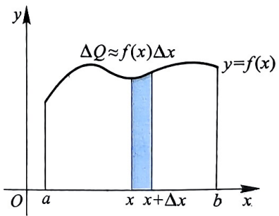

图6.2

> **注：** ① 泊松 (Poisson, 1781-1840), 法国数学家、力学家和物理学家. 他毕生从事数学研究和教学, 曾说生活的乐趣就在于这两件事. 泊松的工作特色是应用数学方法研究各种力学和物理学问题, 并由此得到数学上的发现. 他发表过 300 多篇论文, 所著两卷《力学教程》在很长的时间内被认为是标准的教科书.

208

当 $f(x)$ 满足一定条件时，有

$$
\Delta Q = f (x) \Delta x + o (\Delta x),\tag{6.1}
$$

即

$$
\mathrm{d} Q = f (x) \mathrm{d} x.\tag{6.2}
$$

称 $\mathrm{d}Q$ 为目标量 $Q$ 的微元. 所求的目标量

$$
Q = \int_ {a} ^ {b} f (x) \mathrm{d} x.
$$

由上面分析可知, 欲求目标量 $Q$, 关键在于求出目标量 $Q$ 的微元 $\mathrm{d}Q$ 与自变量 $x$ 的微元 $\mathrm{d}x$ 之间的关系: $\mathrm{d}Q = f(x)\mathrm{d}x$.

在实际应用中, 要论证在何种条件下才有 $\Delta Q = f(x)\Delta x + o(\Delta x)$, 从而得到

$$
\mathrm{d} Q = f (x) \mathrm{d} x,
$$

这是比较麻烦的, 有时甚至是有难度的, 因此对式子 (6.1) 的合理性要特别谨慎. 在本书下面一些典型微元的推导过程中, 均略去其证明过程.

### 二、平面图形的面积

1. 直角坐标系下平面图形的面积

设平面区域 $D$ 由定义在区间 $[a, b]$ 上的连续曲线 $y = f(x)$, $y = g(x)$ 与直线 $x = a$, $x = b$ 所围成 (图6.3), 则 $\forall x \in [a, b]$, 区间 $[x, x + \mathrm{d}x]$ 所对应的几何图形的面积

$$
\mathrm{d} S = | f (x) - g (x) | \mathrm{d} x.
$$

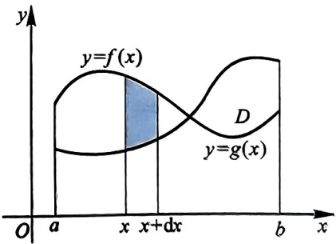

因此, 平面区域 D 的面积

$$
S = \int_ {a} ^ {b} | f (x) - g (x) | \mathrm{d} x.
$$

图6.3

(6.3)

#### 例 6.6.1 计算椭圆  $\frac{x^{2}}{a^{2}} + \frac{y^{2}}{b^{2}} = 1$  所围区域的面积 (a > b > 0).

解:根据对称性，椭圆所围区域的面积为第一象限部分面积的4倍，而

$$
y = \frac {b}{a} \sqrt {a ^ {2} - x ^ {2}}.
$$

因此，椭圆面积

$$
S = 4 \int_ {0} ^ {a} \frac {b}{a} \sqrt {a ^ {2} - x ^ {2}} \mathrm{d} x = \frac {4 b}{a} \int_ {0} ^ {a} \sqrt {a ^ {2} - x ^ {2}} \mathrm{d} x = \frac {4 b}{a} \cdot \frac {1}{4} \pi a ^ {2} = \pi a b.
$$

§6.6 定积分的应用

#### 例 6.6.2 计算由曲线  $y^{2}=x$  与直线 x-2y-3=0 所围平面图形的面积.

解:曲线 $y^{2} = x$ 与直线 $x - 2y - 3 = 0$ 的交点 $A(1, -1), B(9, 3)$. 若选用 $x$ 为积分变量，过点 $A$ 作垂直于 $x$ 轴的直线交曲线 $y^{2} = x$ 于点 $C(1, 1)$，这样将区域分成左、右两部分 (图6.4). 所求平面区域的面积

$$
\begin{array}{r l} S & = 2 \int_ {0} ^ {1} \sqrt {x} \mathrm{d} x + \int_ {1} ^ {9} \left(\sqrt {x} - \frac {x - 3}{2}\right) \mathrm{d} x \\ & = \frac {4}{3} + \frac {2 8}{3} = \frac {3 2}{3}. \end{array}
$$

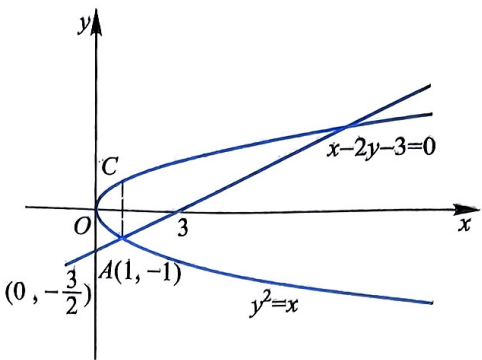

图6.4

若选用 $y$ 为积分变元, 将两曲线表示为 $x = y^2$, $x = 2y + 3$, 则所求区域的面积

$$
S = \int_ {- 1} ^ {3} [ (2 y + 3) - y ^ {2} ] \mathrm{d} y = \frac {3 2}{3}.
$$

#### 例 6.6.3 设直线 $y = ax$ ($0 < a < 1$) 与 $y = x^2$ 所围图形的面积为 $S_1$, 它们与直线 $x = 1$ 所围平面图形的面积为 $S_2$, 试确定 $a$ 的值, 使 $S_1 + S_2$ 最小, 并求此最小值.

解:直线 $y = ax$ 与抛物线 $y = x^{2}$ 的交点为 $A(a,a^2),O(0,0)$ ，则

$$
\begin{array}{r l} S (a) & = S _ {1} + S _ {2} = \int_ {0} ^ {a} (a x - x ^ {2}) \mathrm{d} x + \int_ {a} ^ {1} (x ^ {2} - a x) \mathrm{d} x \\ & = \left(\frac {a ^ {3}}{2} - \frac {a ^ {3}}{3}\right) + \frac {1 - a ^ {3}}{3} - \frac {a - a ^ {3}}{2} = \frac {1}{3} a ^ {3} - \frac {1}{2} a + \frac {1}{3}. \end{array}
$$

令 $S^{\prime}(a) = a^{2} - \frac{1}{2} = 0$ ，则 $a = \frac{1}{\sqrt{2}}$ ，且 $S''\left(\frac{1}{\sqrt{2}}\right) = \sqrt{2} >0.$ 所以，当 $a = \frac{1}{\sqrt{2}}$ 时，$S_{1} + S_{2}$ 取最小值，且最小值为 $S_{\min}\left(\frac{1}{\sqrt{2}}\right) = \frac{1}{3}\left(1 - \frac{1}{\sqrt{2}}\right)$.

若曲线 $C$ 以参数方程形式给出:

$$
C: \left\{ \begin{array}{l} x = x (t), \\ y = y (t) \end{array} \right. \quad (\alpha \leqslant t \leqslant \beta),\tag{6.4}
$$

且 $y(t)$ 在 $[\alpha, \beta]$ 上连续, $x(t)$ 在 $[\alpha, \beta]$ 上有连续导数, $x'(t) \neq 0$ (对于 $y(t)$ 连续可微且 $y'(t) \neq 0$ 的情形可类似讨论).

记 $a = x(\alpha), b = x(\beta) (a < b$ 或 $a > b)$, 则由曲线 $C$ 与直线 $x = a, x = b$ 所围平面图形的面积

$$
S = \int_ {\alpha} ^ {\beta} | y (t) x ^ {\prime} (t) | \mathrm{d} t.\tag{6.5}
$$

210

第6章

#### 例 6.6.4 求星形线 (内摆线) $x^{\frac{2}{3}} + y^{\frac{2}{3}} = a^{\frac{2}{3}} (a > 0)$ 所围平面图形的面积.

解: 根据对称性, 星形线所围区域的面积为第一象限部分面积的 4 倍, 而星形线的参数方程为

$$
\left\{ \begin{array}{l l} x = a \cos^ {3} t, \\ y = a \sin^ {3} t \end{array} \right. \quad (0 \leqslant t <   2 \pi).
$$

因此, 星形线所围平面图形的面积

$$
\begin{array}{r l} & {\left| S = 4 a ^ {2} \int_ {0} ^ {\frac {\pi}{2}} \sin^ {3} t \cdot 3 \cos^ {2} t \sin t \mathrm{d} t \right.} \\ & {\quad = 1 2 a ^ {2} \int_ {0} ^ {\frac {\pi}{2}} (\sin^ {4} t - \sin^ {6} t) \mathrm{d} t} \\ & {\quad = 1 2 a ^ {2} \left(\frac {3}{4} \cdot \frac {1}{2} \cdot \frac {\pi}{2} - \frac {5}{6} \cdot \frac {3}{4} \cdot \frac {1}{2} \cdot \frac {\pi}{2}\right) = \frac {3}{8} \pi a ^ {2}.} \end{array}
$$

如果由参数方程 (6.4) 给出的曲线是封闭的简单曲线, 有

$$
x (\alpha) = x (\beta), \quad y (\alpha) = y (\beta),
$$

且在 $(\alpha, \beta)$ 内曲线不相交, 那么由该曲线所围成的平面图形的面积为

$$
S = \left| \int_ {\alpha} ^ {\beta} y (t) x ^ {\prime} (t) \mathrm{d} t \right|
$$

或

$$
S = \left| \int_ {\alpha} ^ {\beta} x (t) y ^ {\prime} (t) \mathrm{d} t \right|.
$$

此公式可由(6.5)推出.

### 2. 极坐标系下平面图形的面积

若曲线由极坐标方程

$$
C: r = r (\theta) (\alpha \leqslant \theta \leqslant \beta)
$$

给出, 其中 $r(\theta)$ 在 $[\alpha, \beta]$ 上连续, 且 $\beta - \alpha \leqslant 2\pi$. 由曲线 $C$ 与射线 $\theta = \alpha, \theta = \beta$ 所围成的平面图形的面积 (图6.5)

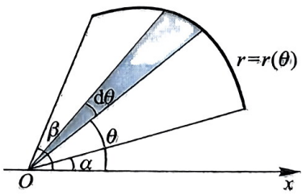

图6.5

$$
S = \frac {1}{2} \int_ {\alpha} ^ {\beta} r ^ {2} (\theta) \mathrm{d} \theta .\tag{6.6}
$$

从原点引射线, 极角为 $\theta$, 给 $\theta$ 一个增量 $\Delta \theta$, 由两条射线与曲线 $C$ 所围成的小扇形的面积 $\mathrm{d}S = \frac{1}{2} r^2(\theta) \mathrm{d}\theta$. 两边求定积分即可得到上面的结论.

#### 例 6.6.5 计算曲线 $C:(x^{2} + y^{2})^{2} = a^{2}(x^{2} - y^{2})(a > 0)$ 所围平面图形

§6.6 定积分的应用

的面积.

解: 由于曲线关于 $x$ 轴、$y$ 轴均对称, 曲线 $C$ 所围图形的面积是其位于第一象限部分的 4 倍. 曲线的极坐标方程

$$
r ^ {2} = a ^ {2} \cos 2 \theta
$$

在第一象限部分 $\left(0\leqslant \theta \leqslant \frac{\pi}{2}\right)$ ，且 $r^2 = a^2\cos 2\theta \geqslant 0$ ，故 $0\leqslant \theta \leqslant \frac{\pi}{4}$ .由(6.6)可得该平面图形的面积

$$
S = 4 \times \frac {1}{2} \int_ {0} ^ {\frac {\pi}{4}} r ^ {2} (\theta) \mathrm{d} \theta = 2 \int_ {0} ^ {\frac {\pi}{4}} a ^ {2} \cos 2 \theta \mathrm{d} \theta = a ^ {2}.
$$

本题中所给出的曲线称为“双纽线”.

#### 例 6.6.6 计算三叶形曲线 $r = a \sin 3\theta (a > 0)$ 所围平面图形的面积.

解: 由于 $r = a \sin 3\theta \geqslant 0 (0 \leqslant \theta \leqslant 2\pi)$, 故 $\theta \in \left[0, \frac{\pi}{3}\right] \cup \left[\frac{2}{3}\pi, \pi\right] \cup \left[\frac{4}{3}\pi, \frac{5}{3}\pi\right]$. 根据对称性, 有

$$
S = 3 \times \frac {1}{2} \int_ {0} ^ {\frac {\pi}{3}} a ^ {2} \sin^ {2} 3 \theta \mathrm{d} \theta \stackrel {3 \theta = t} {=} \frac {3}{2} a ^ {2} \cdot \frac {1}{3} \int_ {0} ^ {\pi} \sin^ {2} t \mathrm{d} t = \frac {1}{4} \pi a ^ {2}.
$$

### 三、已知截面面积求体积 旋转体的体积

### 1. 已知截面面积求体积

根据祖暅原理: 幂势既同, 则积不容异. 即: 夹在两个平行平面间的两个几何体被平行于这两个平行平面的任何平面所截, 如果所截得的两个截面的面积始终相等, 那么这两个几何体的体积相等.

设 $\Omega$ 为三维空间中的立体 (图6.6), 它夹在垂直于 $x$ 轴的两平面 $x = a$ 和 $x = b$ 之间 $(a < b)$, $\forall x \in [a, b]$, 在 $x$ 轴上的点 $x$ 处作垂直于 $x$ 轴的平面 $\Sigma$, 记平面 $\Sigma$ 截立体 $\Omega$ 所得的截面面积为 $A(x)$.

给 $x$ 一个增量 $\mathrm{dx}$, 过点 $x + \mathrm{dx}$ 作与 $x$ 轴垂直的平面 $\Sigma'$, 则立体 $\Omega$ 位于两平面 $\Sigma, \Sigma'$ 之间的体积

$$
\mathrm{d} V \approx A (x) \mathrm{d} x.
$$

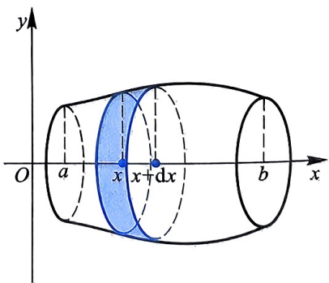

图6.6

因此, 立体  $\Omega$  的体积

$$
V = \int_ {a} ^ {b} A (x) \mathrm{d} x.\tag{6.7}
$$

212

第6章

#### 例 6.6.7 求椭球体  $\Omega:\frac{x^{2}}{a^{2}}+\frac{y^{2}}{b^{2}}+\frac{z^{2}}{c^{2}}\leqslant1$  的体积.

解: 过 $z$ 轴上任意一点 $M(0,0,z)$ $(-c \leqslant z \leqslant c)$ 作与 $z$ 轴垂直的平面, 截椭球体 $\Omega$ 所得的截面为 $\frac{x^2}{a^2} + \frac{y^2}{b^2} \leqslant 1 - \frac{z^2}{c^2}$. 其面积

$$
S = \pi a b \left(1 - \frac {z ^ {2}}{c ^ {2}}\right) (- c \leqslant z \leqslant c).
$$

因此, 椭球体的体积

$$
V = \int_ {- c} ^ {c} \pi a b \left(1 - \frac {z ^ {2}}{c ^ {2}}\right) \mathrm{d} z = \frac {4}{3} \pi a b c.
$$

设两个立体 $\Omega_1, \Omega_2$ 位于两平行平面 $x = a$ 和 $x = b$ 之间，记其被垂直于 $x$ 轴的平面所截得的截面面积分别为 $A_1(x), A_2(x) (a \leqslant x \leqslant b)$. 如果 $A_1(x), A_2(x)$ 在 $[a, b]$ 上连续，且 $A_1(x) = A_2(x)$，那么两立体 $\Omega_1, \Omega_2$ 的体积分别为

$$
V _ {1} = \int_ {a} ^ {b} A _ {1} (x) \mathrm{d} x, \quad V _ {2} = \int_ {a} ^ {b} A _ {2} (x) \mathrm{d} x,
$$

且

$$
V _ {1} = V _ {2}.
$$

这便是祖暅原理所揭示的.

### 2. 旋转体的体积

设 $f(x)$ 在 $[a,b]$ 上连续，由曲线 $y = f(x)$，直线 $x = a, x = b$ 和 $x$ 轴所围成的曲边梯形 $D$ (图6.7) 绕 $x$ 轴旋转一周所得的立体为 $\Omega_x$. 容易得到立体 $\Omega_x$ 的截面面积

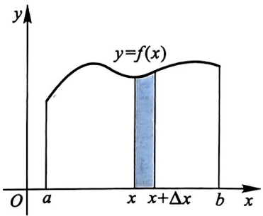

$$
A (x) = \pi f ^ {2} (x) \quad (a \leqslant x \leqslant b),
$$

图6.7

因此该旋转体的体积

$$
V _ {x} = \pi \int_ {a} ^ {b} f ^ {2} (x) \mathrm{d} x.\tag{6.8}
$$

若曲边梯形 $D$ 绕 $y$ 轴旋转一周所得的立体为 $\Omega_y, \forall x \in [a, b]$, 给 $x$ 一个增量 $\mathrm{d}x$, 则介于 $x$ 与 $x + \mathrm{d}x$ 之间的小曲边梯形绕 $y$ 轴旋转一周所得旋转体的体积为

$$
\mathrm{d} V _ {y} \approx 2 \pi | x f (x) | \mathrm{d} x.
$$

因此

$$
V _ {y} = 2 \pi \int_ {a} ^ {b} | x f (x) | \mathrm{d} x.\tag{6.9}
$$

上面的方法通常称为“套筒法”或“柱壳法”

§6.6 定积分的应用

#### 例 6.6.8 若记曲线 $y^{2} = 2x$ 与直线 $y = x - 4$ 所围的平面图形为 $D$.

(1) 求 $D$ 绕 $x$ 轴旋转一周所得旋转体的体积 $V_{x}$;

(2) 求 $D$ 绕 $y$ 轴旋转一周所得旋转体的体积 $V_{y}$.

解:抛物线 $y^{2} = 2x$ 与直线 $y = x - 4$ 的交点为 $A(2, - 2),B(8,4)$

(1) 计算图形 $D$ 绕 $x$ 轴旋转一周所得旋转体的体积时, $x$ 轴下方部分的曲边三角形 $OAEO$ 并不起作用, 我们只需计算由曲边三角形 $OBEO$ 旋转所得立体的体积 (图 6.8(a)). 记点 $B$ 在 $x$ 轴上的投影为 $C$, 则 $V_x$ 为曲边三角形 $OBCO$ 与 $\Delta BCE$ 绕 $x$ 轴旋转所得立体的体积差. 故

$$
V _ {x} = \pi \int_ {0} ^ {8} 2 x \mathrm{d} x - \pi \int_ {4} ^ {8} (x - 4) ^ {2} \mathrm{d} x = \frac {1 2 8}{3} \pi .
$$

(2) 设点 $A, B$ 在 $y$ 轴上的投影分别为 $A_{1}, B_{1}$, 则图形 $D$ 绕 $y$ 轴旋转一周所得立体的体积为梯形 $ABB_{1}A_{1}$ 与曲边梯形 $AOBB_{1}A_{1}A$ 旋转一周所得立体的体积差 (图 6.8(a)):

$$
V _ {y} = \pi \int_ {- 2} ^ {4} (y + 4) ^ {2} \mathrm{d} y - \pi \int_ {- 2} ^ {4} \left(\frac {y ^ {2}}{2}\right) ^ {2} \mathrm{d} y = \frac {5 7 6}{5} \pi .
$$

图形 $D$ 绕 $y$ 轴旋转一周所得立体的体积还可以用下面的方法计算.

过点 $A$ 作 $x$ 轴的垂线交抛物线于点 $F$, 将 $D$ 分成两部分: 区域 $AOFA$ 和曲边三角形 $ABFA$ (图6.8(b)), 则

$$
\begin{array}{r l} & V _ {y} = 2 \pi \int_ {0} ^ {2} x [ \sqrt {2 x} - (- \sqrt {2 x}) ] \mathrm{d} x + 2 \pi \int_ {2} ^ {8} x [ \sqrt {2 x} - (x - 4) ] \mathrm{d} x \\ & \qquad = 4 \sqrt {2} \pi \int_ {0} ^ {2} x ^ {\frac {3}{2}} \mathrm{d} x + 2 \pi \int_ {2} ^ {8} (\sqrt {2} x ^ {\frac {3}{2}} - x ^ {2} + 4 x) \mathrm{d} x = \frac {5 7 6}{5} \pi . \end{array}
$$

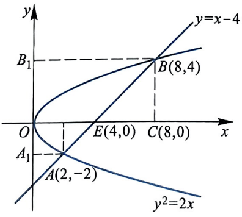

(a)

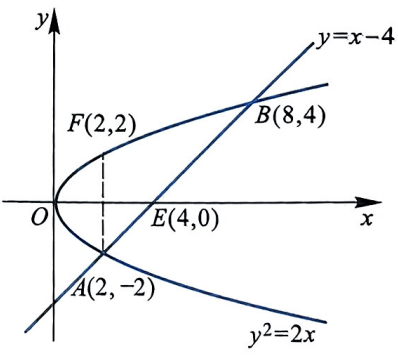

(b)

图6.8

#### 例 6.6.9 从原点引曲线 $C: y = \sqrt{x - 4}$ 的切线 $l$ (图 6.9), 计算 (1) 曲线 $C$、切线 $l$ 及 $x$ 轴所围平面图形 $D$ 的面积;

214

第6章

(2) 平面图形 $D$ 绕 $x$ 轴、$y$ 轴旋转一周所得立体的体积.

解:设切点为 $A(x_0,y_0)$ ，则切线 $l$ 为

$$
y - y _ {0} = \frac {1}{2 \sqrt {x _ {0} - 4}} (x - x _ {0}).
$$

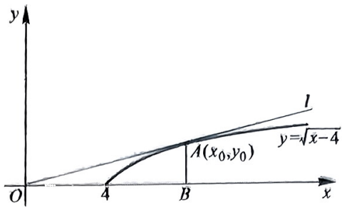

由于切线 l 过原点, 容易得到切点为  $A(8,2)$ ,
切线 l 的方程为  $y = \frac{1}{4} x$ .

图6.9

(1) 平面图形 $D$ 的面积

$$
S = \int_ {0} ^ {2} [ (y ^ {2} + 4) - 4 y ] \mathrm{d} y = \frac {8}{3}.
$$

(2) $D$ 绕 $x$ 轴旋转一周所得立体的体积为

$$
V _ {x} = \frac {1}{3} \pi \cdot 2 ^ {2} \cdot 8 - \pi \int_ {4} ^ {8} (x - 4) \mathrm{d} x = \frac {8}{3} \pi .
$$

$D$ 绕 $y$ 轴旋转一周所得立体的体积为

$$
V _ {y} = \pi \int_ {0} ^ {2} (y ^ {2} + 4) ^ {2} \mathrm{d} y - \frac {1}{3} \pi \cdot 8 ^ {2} \cdot 2 = \frac {2 5 6}{1 5} \pi .
$$

或根据“套筒法”可得

$$
V _ {y} = 2 \pi \int_ {0} ^ {8} x \cdot \frac {x}{4} \mathrm{d} x - 2 \pi \int_ {4} ^ {8} x \sqrt {x - 4} \mathrm{d} x = \frac {2 5 6}{1 5} \pi .
$$

### 四、平面曲线的弧长和旋转曲面的侧面积

### 1. 平面曲线的弧长

首先建立平面曲线弧长的概念. 设平面曲线 $C = \widehat{AB}$ (图6.10), 在曲线 $C$ 上从点 $A$ 到点 $B$ 依次取分点:

$$
A = P _ {0}, P _ {1}, P _ {2}, \dots , P _ {n - 1}, P _ {n} = B,
$$

它们构成曲线 C 的一个分割 T. 用线段连接 T 中相邻的两个分点, 得到弦  $\overline{P_{i-1}P_{i}}$  ( $i = 1, 2, \cdots, n$ ), 这 n 条线段构成曲线 C 的内接折线, 记

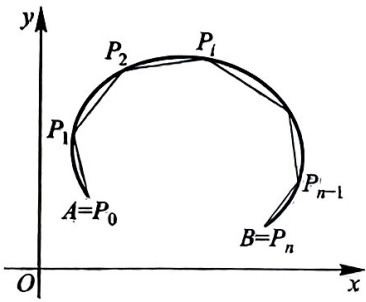

图 6.10

$$
\| T \| = \max _ {1 \leqslant i \leqslant n} \{\overline {{| P _ {i - 1} P _ {i} |}} \},
$$

§6.6 定积分的应用

表示最长弦的长度. 曲线 $C$ 的所有内接折线的长

$$
s (T) = \sum_ {i = 1} ^ {n} | \overline {{P _ {i - 1} P _ {i}}} |.
$$

**定义 6.6.10** 如果对曲线 C 的任意分割 T, 存在有限极限

$$
\varliminf_ {\| T \| \to 0 ^ {+}} s (T) = \lim _ {\| T \| \to 0} \sum_ {i = 1} ^ {n} | \overline {{P _ {i - 1} P _ {i}}} | = s (0 <   s <   + \infty),
$$

那么称曲线 $C$ 是可求长度的, 并将上述极限 $s$ 称为曲线 $C$ 的长度.

**定义 6.6.11** 设平面曲线 $C$ 由参数方程

$$
C: \left\{ \begin{array}{l l} x = x (t), \\ y = y (t) \end{array} \right. (\alpha \leqslant t \leqslant \beta)\tag{6.10}
$$

给出, $\forall t\in [\alpha ,\beta ],x'(t),y'(t)$ 连续且不同时为0,则称曲线 $C$ 为光滑曲线.

我们不加证明引进下面定理.

**定理 6.6.12** 曲线 C 由参数方程 (6.10) 给出, 若 C 是光滑或分段光滑曲线, 则曲线 C 是可求长度的, 且其弧长

$$
s = \int_ {\alpha} ^ {\beta} \sqrt {[ x ^ {\prime} (t) ] ^ {2} + [ y ^ {\prime} (t) ] ^ {2}} \mathrm{d} t.\tag{6.11}
$$

如果曲线 $C$ 由直角坐标方程

$$
y = f (x) \quad (a \leqslant x \leqslant b)
$$

表示, $f(x)$ 在 $[a, b]$ 上有连续导数, 那么可将曲线 $C$ 看成如下参数方程形式:

$$
C: \left\{ \begin{array}{l l} x = x, \\ y = f (x) \end{array} \right. \quad (a \leqslant x \leqslant b),
$$

曲线 $C$ 的弧长

$$
s = \int_ {a} ^ {b} \sqrt {1 + [ f ^ {\prime} (x) ] ^ {2}} \mathrm{d} x.\tag{6.12}
$$

如果曲线 $C$ 由极坐标方程

$$
C: r = r (\dot {\theta}) \quad (\alpha \leqslant \theta \leqslant \beta)
$$

表示, 那么可将曲线 $C$ 表示为如下参数方程形式:

$$
C: \left\{ \begin{array}{l l} x = r (\theta) \cos \theta , \\ y = r (\theta) \sin \theta \end{array} \right. \quad (\alpha \leqslant \theta \leqslant \beta),
$$

216

曲线 $C$ 的弧长

$$
s = \int_ {\alpha} ^ {\beta} \sqrt {[ r ^ {\prime} (\theta) ] ^ {2} + r ^ {2} (\theta)} \mathrm{d} \theta ,\tag{6.13}
$$

其中  $r(\theta)$  有连续导数.

#### 例 6.6.13 求摆线  $\left\{\begin{aligned}x=a(t-\sin t),\\ y=a(1-\cos t)\end{aligned}\right.$  (a>0) 一拱的弧长.

解:由于 $x'(t) = a(1 - \cos t), y'(t) = a\sin t,$ 则摆线一拱的长度

$$
\begin{array}{r l} s & = \int_ {0} ^ {2 \pi} \sqrt {[ x ^ {\prime} (t) ] ^ {2} + [ y ^ {\prime} (t) ] ^ {2}} \mathrm{d} t \\ & = \int_ {0} ^ {2 \pi} \sqrt {2 a ^ {2} (1 - \cos t)} \mathrm{d} t \\ & = 2 a \int_ {0} ^ {2 \pi} \sin \frac {t}{2} \mathrm{d} t = 8 a. \end{array}
$$

#### 例 6.6.14 求曲线  $y = x^{\frac{3}{2}}$  上从点  $O(0,0)$  到点  $A(1,1)$  一段的弧长.

解:由于 $y' = \frac{3}{2}\sqrt{x}$，由公式(6.12)可得

$$
s = \int_ {0} ^ {1} \sqrt {1 + \left(\frac {3}{2} \sqrt {x}\right) ^ {2}} \mathrm{d} x = \frac {1}{2} \int_ {0} ^ {1} \sqrt {4 + 9 x} \mathrm{d} x = \frac {1}{2 7} (1 3 \sqrt {1 3} - 8).
$$

#### 例 6.6.15 求心形线  $r = a(1 + \cos\theta) (a > 0)$  的周长.

解:由公式(6.13)可得

$$
\begin{array}{r l} & s = \int_ {0} ^ {2 \pi} \sqrt {r ^ {2} (\theta) + [ r ^ {\prime} (\theta) ] ^ {2}} \mathrm{d} \theta \\ & \quad = \int_ {0} ^ {2 \pi} \sqrt {2 a ^ {2} (1 + \cos \theta)} \mathrm{d} \theta \\ & \quad = 2 a \int_ {0} ^ {2 \pi} \left| \cos \frac {\theta}{2} \right| \mathrm{d} \theta = 8 a. \end{array}
$$

2. 旋转曲面的侧面积

设平面光滑曲线

$$
C: \left\{ \begin{array}{l l} x = x (t), \\ y = y (t) \end{array} \right. (\alpha \leqslant t \leqslant \beta)
$$

绕 $x$ 轴旋转一周所得到的曲面为 $\Sigma$, 下面计算曲面 $\Sigma$ 的侧面积.

任取 $t \in [\alpha, \beta]$, 对应曲线 $C$ 上点 $P$, 给 $t$ 一个增量 $\Delta t$, 对应曲线 $C$ 上点 $Q$, 则弧 $\widehat{PQ}$ 的长度为

$$
\mathrm{d} s = \sqrt {[ x ^ {\prime} (t) ] ^ {2} + [ y ^ {\prime} (t) ] ^ {2}} \mathrm{d} t,
$$

§6.6 定积分的应用

弧 $\widehat{PQ}$ 绕 $x$ 轴旋转一周所得曲面的侧面积

$$
\mathrm{d} S = 2 \pi | y (t) | \mathrm{d} s = 2 \pi | y (t) | \sqrt {[ x ^ {\prime} (t) ] ^ {2} + [ y ^ {\prime} (t) ] ^ {2}} \mathrm{d} t.
$$

因此, 旋转曲面的侧面积

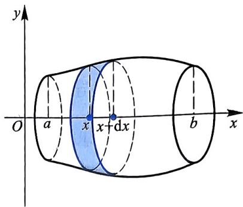

$$
S = 2 \pi \int_ {\alpha} ^ {\beta} | y (t) | \sqrt {[ x ^ {\prime} (t) ] ^ {2} + [ y ^ {\prime} (t) ] ^ {2}} \mathrm{d} t.\tag{6.14}
$$

图6.11

如果曲线 $C: y = f(x) (a \leqslant x \leqslant b), f(x)$ 有一阶连续导数, 那么曲线 $C$ 绕 $x$ 轴旋转一周所得旋转曲面的侧面积 (图6.11)

$$
S = 2 \pi \int_ {a} ^ {b} | f (x) | \sqrt {1 + [ f ^ {\prime} (x) ] ^ {2}} \mathrm{d} x.\tag{6.15}
$$

#### 例 6.6.16 求摆线  $\left\{\begin{aligned} x &= a(t - \sin t), \\ y &= a(1 - \cos t) \end{aligned}\right.$  (a > 0) 的一拱绕 x 轴旋转一周所得旋转曲面的侧面积.

解:根据公式(6.14)，可得

$$
\begin{array}{r l} & {\left| S = 2 \pi \int_ {0} ^ {2 \pi} a (1 - \cos t) \sqrt {2 a ^ {2} (1 - \cos t)} \mathrm{d} t = 8 \pi a ^ {2} \int_ {0} ^ {2 \pi} \sin^ {3} {\frac {t}{2}} \mathrm{d} t \right|} \\ & {\quad \xlongequal {\frac {t}{2} = u} 1 6 \pi a ^ {2} \int_ {0} ^ {\pi} \sin^ {3} {u} \mathrm{d} u = \frac {6 4}{3} \pi a ^ {2}.} \end{array}
$$

#### 例 6.6.17 求半径为  $a(a > 0)$  的球面的表面积.

解: 半径为 $a$ 的球面可看成是由半圆 $y = \sqrt{a^2 - x^2}$ 绕 $x$ 轴旋转一周所得. 由于 $y' = -\frac{x}{\sqrt{a^2 - x^2}}$, 根据公式 (6.15) 可得球面的表面积

$$
S = 2 \pi \int_ {- a} ^ {a} \sqrt {a ^ {2} - x ^ {2}} \cdot \sqrt {1 + \frac {x ^ {2}}{a ^ {2} - x ^ {2}}} \mathrm{d} x = 4 \pi a ^ {2}.
$$

### 五、定积分在物理上的应用

定积分在物理上有着广泛的应用,下面主要介绍液体静压力、万有引力和变力做功等物理问题.

1. 液体的静压力

#### 例 6.6.18 有一半径为 R 的圆形闸门, 试求当水平面通过闸门圆心时, 阀门单侧所受的压力.

218

第6章

解: 建立以圆心为原点, $y$ 轴与水平面上闸门直径重合的直角坐标系 (图 6.12). 圆方程为

$$
x ^ {2} + y ^ {2} = R ^ {2} \quad (R > 0).
$$

由于在相同深度处, 水的静压强相等, 任取一个从 $x$ 到 $x + \mathrm{d}x$, 宽度为 $\mathrm{d}x$ 的小窄条, 此小窄条所受到的压力

$$
\mathrm{d} F = 2 \rho g x \sqrt {R ^ {2} - x ^ {2}} \mathrm{d} x,
$$

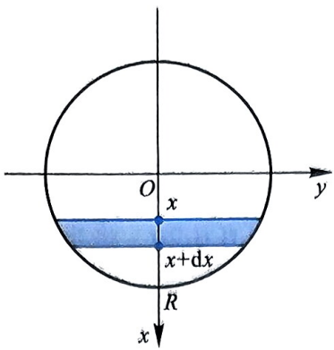

图6.12

$\rho$ 为水的密度, $g$ 为重力加速度. 因此, 圆形闸门单侧所受的压力

$$
F = 2 \rho g \int_ {0} ^ {R} x \sqrt {R ^ {2} - x ^ {2}} \mathrm{d} x = \frac {2}{3} \rho g R ^ {3}.
$$

2. 万有引力

#### 例 6.6.19 有一根长为 l 的均匀细棒, 线密度为  $\mu$ , 在细棒的中垂线上距细棒为 a 处有一质量为 m 的质点 M, 求细棒对该质点的引力.

解:如图6.13所示，建立以细棒中心为原点，细棒所在直线为 $x$ 轴，质点 $M$ 位于 $y$ 轴正半轴上的直角系.任取 $[x,x + \mathrm{d}x]$ ，由于$\mathrm{dx}$ 很小，这一小段近似看成质点，其质量为

$$
\mathrm{d} m = \mu \mathrm{d} x.
$$

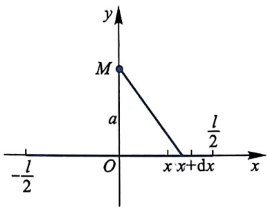

该小段细棒对质点 $M$ 的万有引力可分解为 $x$ 方向与 $y$ 方向的分量:

图6.13

$$
\begin{array}{l} \mathrm{d} F _ {x} = G \frac {\mu m}{a ^ {2} + x ^ {2}} \cdot \frac {x}{\sqrt {a ^ {2} + x ^ {2}}} \mathrm{d} x, \\ \mathrm{d} F _ {y} = - G \frac {\mu m}{a ^ {2} + x ^ {2}} \cdot \frac {a}{\sqrt {a ^ {2} + x ^ {2}}} \mathrm{d} x, \end{array}
$$

$G$ 为引力常量. 因此

$$
\begin{array}{r l} & F _ {x} = \int_ {- \frac {l}{2}} ^ {\frac {l}{2}} G \frac {\mu m}{a ^ {2} + x ^ {2}} \cdot \frac {x}{\sqrt {a ^ {2} + x ^ {2}}} \mathrm{d} x = 0, \\ & F _ {y} = - \int_ {- \frac {l}{2}} ^ {\frac {l}{2}} G \frac {\mu m}{a ^ {2} + x ^ {2}} \cdot \frac {a}{\sqrt {a ^ {2} + x ^ {2}}} \mathrm{d} x \\ & \qquad = - 2 G a m \mu \int_ {0} ^ {\frac {l}{2}} \frac {\mathrm{d} x}{(x ^ {2} + a ^ {2}) ^ {\frac {3}{2}}} (x = a \tan u) \\ & \qquad = - \frac {2 G m \mu}{a} \int_ {0} ^ {\arctan \frac {l}{2 a}} \cos u \mathrm{d} u \end{array}
$$

§6.6 定积分的应用

$$
= - \frac {2 G m \mu l}{a \sqrt {4 a ^ {2} + l ^ {2}}}.
$$

所以, 细棒对质点的引力为 $\frac{2Gm\mu l}{a\sqrt{4a^2 + l^2}}$, 方向向下.

3. 变力做功

#### 例 6.6.20 将半径为 R, 密度为  $\rho$  的铁球从与水面相切的位置提出水面, 试问至少要做多少功?

解: 建立以球心为原点, $x$ 轴垂直于水平面的直角坐标系 (图 6.14). 任取一个从 $x$ 到 $x + \mathrm{d}x (-R \leqslant x \leqslant R)$, 宽度为 $\mathrm{d}x$ 的小圆盘片, 其质量为

$$
\mathrm{d} m = \pi \rho (R ^ {2} - x ^ {2}) \mathrm{d} x.
$$

将此圆盘片提升到与水面相切位置所做的功 $\mathrm{d}W_{1} = \pi (\rho -1)g(R + x)(R^{2} - x^{2})\mathrm{d}x.$

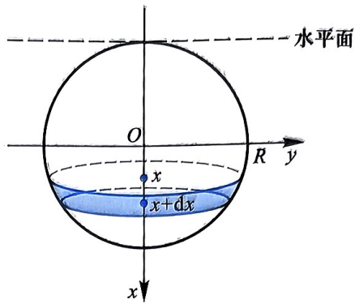

图6.14

再将此圆盘片从水面提升到距离水面 $R - x$ 高度所做的功

$$
\mathrm{d} W _ {2} = \pi \rho g (R - x) (R ^ {2} \div x ^ {2}) \mathrm{d} x.
$$

因此, 将铁球从与水面相切位置提出水面所做的功

$$
\begin{array}{r l} & W = \pi (\rho - 1) g \int_ {- R} ^ {R} (R + x) (R ^ {2} - x ^ {2}) \mathrm{d} x + \pi \rho g \int_ {- R} ^ {R} (R - x) (R ^ {2} - x ^ {2}) \mathrm{d} x \\ & \qquad = 2 \pi (\rho - 1) g \int_ {0} ^ {R} R (R ^ {2} - x ^ {2}) \mathrm{d} x + 2 \pi \rho g \int_ {0} ^ {R} R (R ^ {2} - x ^ {2}) \mathrm{d} x \\ & \qquad = \frac {4}{3} \pi (\rho - 1) g R ^ {4} + \frac {4}{3} \pi \rho g R ^ {4} \\ & \qquad = (2 \rho - 1) g R V, \end{array}
$$

其中 $V$ 为铁球的体积, $V = \frac{4}{3}\pi R^3$.

# 第6章习题

习题6.1

1. 利用定积分定义计算下列定积分:
(1)  $\int_{0}^{2}(2x+1)\mathrm{d}x;$

(2)  $\int_{0}^{1}x^{2}\mathrm{d}x;$
(3)  $\int_{0}^{1}x^{3}\mathrm{d}x;$

(4)  $\int_{0}^{\pi}\sin x\mathrm{d}x.$

220

第6章

2. 根据定积分的几何意义求下列定积分的值:
(1)  $\int_{0}^{a}\sqrt{a^{2}-x^{2}}\mathrm{d}x$  (a>0); (2)  $\int_{-\pi}^{\pi}x\cos x\mathrm{d}x;$
(3)  $\int_{0}^{3}|x-1|\mathrm{d}x;$  (4)  $\int_{0}^{1}(\sqrt{1-x^{2}}-x)\mathrm{d}x.$

3. 用定积分表示下列和式的极限:

(1) $\lim_{n\to \infty}\left(\frac{n}{n^2 + 1^2} +\frac{n}{n^2 + 2^2} +\dots +\frac{n}{n^2 + n^2}\right);$

(2) $\lim_{n\to \infty}\left(\frac{1}{n^2 + 1^2} +\frac{2}{n^2 + 2^2} +\dots +\frac{n}{n^2 + n^2}\right);$

(3) $\lim_{n\to \infty}\frac{1}{n}\left(\sin \frac{\pi}{n} +\sin \frac{2\pi}{n} +\dots +\sin \frac{n\pi}{n}\right);$

(4) $\lim_{n\to \infty}\frac{1}{n^2}\left[\sqrt{n^2 - 1^2} +\sqrt{n^2 - 2^2} +\dots +\sqrt{n^2 - (n - 1)^2}\right].$

4. 求曲线 $y = x^3$ 与直线 $x = 1, y = 0$ 所围平面区域的面积.

习题6.2

5. 比较下列定积分的大小:

(1) $\int_0^1\sqrt{x}\mathrm{d}x$ 与 $\int_0^1 x^2\mathrm{d}x;$

(2) $\int_{1}^{\mathrm{e}} (\ln x)^{2} \mathrm{~d} x$ 与 $\int_{1}^{\mathrm{e}} (\ln x)^{3} \mathrm{~d} x$;

$$
\int_ {0} ^ {1} \mathrm{e} ^ {- x ^ {2}} \mathrm{d} x
$$

$$
\int_ {0} ^ {1} \mathrm{e} ^ {- x ^ {3}} \mathrm{d} x;
$$

\*(4) $\int_{0}^{1} \arcsin x \, \mathrm{d}x$ 与 $\int_{0}^{1} \arccos x \, \mathrm{d}x$ (提示: $\arcsin x + \arccos x = \frac{\pi}{2}$; 当 $x \in \left[0, \frac{\pi}{2}\right]$ 时, $\sin x \geqslant \frac{2}{\pi} x$).

6. 证明下列不等式:
(1) $\frac{2}{5} < \int_{1}^{2} \frac{x}{1 + x^{2}} \mathrm{d}x < \frac{1}{2}$; (2) $\frac{1}{3} < \int_{\frac{\pi}{4}}^{\frac{\pi}{3}} \frac{\tan x}{x} \mathrm{d}x < \frac{\sqrt{3}}{4}$; (3) $\frac{1}{3\sqrt{2}} < \int_{0}^{1} \frac{x^{2}}{\sqrt{1 + x}} \mathrm{d}x < \frac{1}{3}$; (4) $\frac{\pi}{4} < \int_{0}^{1} \frac{\arctan x}{x} \mathrm{d}x < 1$.

7. 若函数 $f$ 在 $[a, b]$ 上连续, 且对任意连续函数 $g$, 等式 $\int_{a}^{b} f(x) g(x) \mathrm{d}x = 0$ 均成立, 证明: $f(x) = 0 (\forall x \in [a, b])$.

8. 对函数 $f(x) = \mathrm{e}^{x^2}$ 在区间 $[0, x](x > 0)$ 上应用积分中值定理, 有

$\int_{0}^{x}\mathrm{e}^{t^{2}}\mathrm{d}t = x\mathrm{e}^{\theta (x)x^{2}}$ ，其中 $\theta (x)\in (0,x),$

第6章习题

计算 $\lim_{x\to 0^{+}}\theta (x)$ 和 $\lim_{x\to +\infty}\theta (x)$

9. 证明推广的定积分中值定理: 设 $f$ 在 $[a, b]$ 上连续, $g$ 在 $[a, b]$ 上连续且不变号, 则 $\exists \xi \in (a, b)$, 使得

$$
\int_ {a} ^ {b} f (x) g (x) \mathrm{d} x = f (\xi) \int_ {a} ^ {b} g (x) \mathrm{d} x.
$$

10. 设 $f(x)$ 在 $[a, b]$ 上可积, 记 $F(x) = \int_{a}^{x} f(t) \mathrm{d}t (a \leqslant x \leqslant b)$, 若 $f(x)$ 在 $x_0 \in (a, b)$ 处连续, 证明: $F'(x_0) = f(x_0)$.

11. 设 $f$ 在 $[0,1]$ 上连续, 在 $(0,1)$ 内可导, 且 $f(1) = 3\int_{0}^{\frac{1}{3}} x f(x) \mathrm{d}x$, 证明: 至少存在一点 $\xi \in (0,1)$, 使得 $f'(\xi) = -\frac{f(\xi)}{\xi}$.

12. 假设 $f$ 在 $[0,1]$ 上连续, 在 $(0,1)$ 内可导, 且 $f(1) = 2\int_{0}^{\frac{1}{2}}\mathrm{e}^{1 - x^2}f(x)\mathrm{d}x,$ 证明: 至少存在一点 $\xi \in (0,1)$, 使得 $f'(\xi) = 2\xi f(\xi)$.

习题6.3

13. 计算下列函数的导数:
(1)  $\int_{0}^{x}(t+1)\mathrm{e}^{-2t^{2}}\mathrm{d}t;$

(2)  $\int_{0}^{2x}\mathrm{e}^{-t^{2}}\sin t\mathrm{d}t;$
(3)  $\int_{\cos x}^{\sin x}\ln(2+\sin t)\mathrm{d}t;$

(4)  $\int_{0}^{x}(x^{2}-t^{2})f(t)\mathrm{d}t$  (f 为连续函数).

14. 计算下列极限:

(1) $\lim_{x\to 0}\frac{\int_0^x\arctan t^2\mathrm{d}t}{x\ln(1 - x^2)};$

(2) $\lim_{x\to 0}\frac{\int_0^x(x - t)\sin t^2\mathrm{d}t}{x\int_0^x\sin t^2\mathrm{d}t};$

(3) $\lim_{x\to 0}\frac{\int_0^{2x}\ln(1 + t^2)\mathrm{d}t}{x\arctan(\sqrt{1 + x^2} - 1)};$

(4) $\lim_{x\to 0^{+}}\frac{\int_{0}^{x^{2}}x\arctan\sqrt{t}\mathrm{d}t}{(\mathrm{e}^{-x^{2}} - 1)\ln(1 - 2x^{2})}.$

15. 当 $x \to 0^{+}$ 时, 将下列无穷小按阶数从小到大的顺序排列:

$$
\alpha = \int_ {0} ^ {x} \left(\mathrm{e} ^ {t} - 1\right) \sin t ^ {2} \mathrm{d} t,
$$

$$
\beta = \int_ {0} ^ {x ^ {2}} t \arcsin \sqrt {t} \mathrm{d} t,
$$

$$
\gamma = \int_ {0} ^ {\sqrt {x}} (\mathrm{e} ^ {t ^ {2}} - 1) \cos t \mathrm{d} t.
$$

第6章

16. 计算下列极限:

(1) $\lim_{n\to \infty}\left(\frac{2^{\frac{1}{n}}}{n + 1} +\frac{2^{\frac{2}{n}}}{n + \frac{1}{2}} +\dots +\frac{2^{\frac{n}{n}}}{n + \frac{1}{n}}\right);$

(2) $\lim_{n\to \infty}\left[\frac{1}{n + 1} +\frac{1}{n + 3} +\dots +\frac{1}{n + (2n + 1)}\right].$

17. 设 $f$ 在 $x = 0$ 的某邻域内连续, 且 $f(0) \neq 0$, 计算 $\lim_{x \to 0} \frac{\int_{0}^{x^3} f(t) \mathrm{d}t}{x^2 \int_{0}^{x} f(t) \mathrm{d}t}$.

18. 设 $f$ 为 $(- \infty, +\infty)$ 上的连续函数, 且 $f(x) = \int_{0}^{x} \mathrm{e}^{x - t} f(t) \mathrm{d}t + \mathrm{e}^x$, 求 $f(x)$.

19. 设 $f$ 为连续函数, 且 $f(x) = 4\mathrm{e}^{2x} - \int_{0}^{1}f(x)\mathrm{d}x$, 求 $f(x)$.

20. 设 $f$ 为连续函数, 且 $f(x) = 4\sin (x^2) - \int_0^{\sqrt{\pi}}xf(x)\mathrm{d}x$, 求 $f(x)$.

21. 计算下列定积分:

(1) $\int_0^1 2^x \cdot \mathrm{e}^{2x} \, \mathrm{d}x$;

(2) $\int_{-\frac{\pi}{2}}^{\frac{\pi}{2}}\sqrt{1 - \cos^2x}\mathrm{d}x;$

(3) $\int_0^1\frac{1 - x}{\sqrt{4 - x^2}}\mathrm{d}x;$

(4) $\int_{0}^{1}\frac{x}{1 + x^2}\mathrm{d}x;$

(5) $\int_{\mathrm{e}}^{\mathrm{e}^2}\frac{\mathrm{d}x}{x(\ln x)^3};$

(6) $\int_{0}^{a} x\sqrt{a^2 - x^2} \, \mathrm{d}x (a > 0)$;

(7) $\int_0^2\max \{x^2,x^3\} \mathrm{d}x;$

(8) $\int_{0}^{\frac{\pi}{2}}\frac{\cos x}{2 - \cos^2x}\mathrm{d}x;$

(9) $\int_0^{\frac{\pi}{2}}\cos^6 x\sin 2xdx;$

(10) $\int_0^1\frac{\mathrm{d}x}{\mathrm{e}^x + \mathrm{e}^{-x}}.$

22. 设 $f$ 在 $[0,1]$ 上连续, 且 $\forall x \in [0,1]$, 有 $\frac{1}{2} \leqslant f(x) \leqslant 2$, 证明:

(1) $\int_0^1 f(x)\mathrm{d}x + \int_0^1\frac{\mathrm{d}x}{f(x)}\leqslant \frac{5}{2};$ (2) $\int_0^1 f(x)\mathrm{d}x\int_0^1\frac{\mathrm{d}x}{f(x)}\leqslant \frac{25}{16},$

23. 设 $f$ 在 $[a, b]$ 上连续, 且 $f(x) > 0$, 证明: 曲线

$$
F (x) = \int_ {a} ^ {b} | x - t | f (t) \mathrm{d} t
$$

在 $[a,b]$ 上为凹的.

第6章习题

24. 设 $f$ 在 $[a, b]$ 上连续可导, 且 $f\left(\frac{a + b}{2}\right) = 0$, $|f'(x)| \leqslant M$ ($M$ 为正常数), 证明:

$$
\left| \int_ {a} ^ {b} f (x) \mathrm{d} x \right| \leqslant \frac {M}{4} (b - a) ^ {2}.
$$

25. 设 $f$ 在 $[a, b]$ 上连续可导, 且 $f(a) = f(b) = 0$, $|f'(x)| \leqslant M$ ($M$ 为正常数), 证明:

$$
\left| \int_ {a} ^ {b} f (x) \mathrm{d} x \right| \leqslant \frac {M}{4} (b - a) ^ {2}.
$$

26. 设 $f(x)$ 在 $[a, b]$ 上二阶可导, 且 $f(a) = f(b) = 0$, 证明:

$$
\max _ {a \leqslant x \leqslant b} | f (x) | \leqslant \frac {1}{8} (b - a) ^ {2} \max _ {a \leqslant x \leqslant b} | f ^ {\prime \prime} (x) |.
$$

习题6.4

27. 计算下列定积分:

(1) $\int_0^3 (x - 1)\sqrt{x + 1}\mathrm{d}x;$

(3) $\int_{1}^{2}\frac{\sqrt{x^2 - 1}}{x}\mathrm{d}x;$

(2) $\int_{1}^{5}\frac{x}{\sqrt{x - 1} + 1}\mathrm{d}x;$

(5) $\int_{-\frac{\pi}{2}}^{\frac{\pi}{2}}\sqrt{\cos x - \cos^3 x}\mathrm{d}x;$

(4) $\int_0^1 x(x - 1)^6\mathrm{d}x;$

(7) $\int_{0}^{\pi}\left|x - \frac{\pi}{2}\right|\cos x\mathrm{d}x;$

(6) $\int_{-\pi}^{\pi} (|x + 1| + |x - 1|) \sin^3 x \, \mathrm{d}x$;

(9) $\int_{\mathrm{e}^{-1}}^{\mathrm{e}}|\ln x|\mathrm{d}x;$

(8) $\int_{-\frac{\pi}{2}}^{\frac{\pi}{2}}\frac{\mathrm{d}x}{1 + \cos x};$

(10) $\int_0^1 (x\ln x)^2\mathrm{d}x;$

(11) $\int_0^1\mathrm{e}^{\sqrt{x}}\mathrm{d}x;$

(12) $\int_{0}^{\frac{\pi}{2}}\frac{\sin x}{\sin x + \cos x}\mathrm{d}x;$

(13) $\int_0^{\frac{\pi}{2}}\frac{\sqrt{\sin x}}{\sqrt{\sin x} + \sqrt{\cos x}}\mathrm{d}x;$

(15) $\int_0^1\sqrt{\frac{1 - x}{1 + x}}\mathrm{d}x;$

(14) $\int_0^1 x\sqrt{\frac{x}{2 - x}}\mathrm{d}x;$

(17) $\int_0^1 x\arctan x\mathrm{d}x;$

(16) $\int_0^1\arcsin x\mathrm{d}x;$

(18) $\int_0^3\arcsin \sqrt{\frac{x}{x + 1}}\mathrm{d}x;$

(19) $\int_{0}^{\frac{\pi}{4}}\frac{x}{1 + \cos 2x}\mathrm{d}x;$

(21) $\int_0^a x^4\sqrt{a^2 - x^2}\mathrm{d}x$ ($a > 0$);

(20) $\int_0^\pi x\sin^6 x\mathrm{d}x;$

(23) $\int_{-1}^{1}\frac{x^4}{1 + e^x}\mathrm{d}x;$

(22) $\int_{-1}^{1}(2x + |x|)^{2}\sqrt{1 - x^{2}}\mathrm{d}x;$

224

第6章

(24) $\int_{-4}^{0}x(x + 1)(x + 2)(x + 3)(x + 4)\mathrm{d}x;$

(25) $\int_{0}^{1}\left(\frac{x - 1}{x + 1}\right)^{4}\mathrm{d}x;$ (26) $\int_0^{n\pi}x|\sin x|\mathrm{d}x;$

(27) $\int_{-2}^{6} x (12 + 4x - x^2)^{\frac{5}{2}} \mathrm{~d}x$;

(28) $\int_{0}^{a}\arctan \sqrt{\frac{a - x}{a + x}}\mathrm{d}x (a > 0);$

(29) $\int_{-\pi}^{\pi} |\sin x| \arctan e^{x} \, \mathrm{d}x;$

(30) $\int_{-\pi}^{\pi}\frac{x\sin x\cdot\arctan e^{x}}{1+\cos^{2}x}\mathrm{d}x.$

28. 设 $f(x) = \begin{cases} 2x + 1, & x \leqslant 0, \\ \mathrm{e}^{2x} - 1, & x > 0, \end{cases}$ 求 $\int_0^4 f(x - 2)\mathrm{d}x$.

29. 设 $f(x)$ 在 $\mathbb{R}$ 上连续, 且 $f(x + 2) - f(x) = x, \int_0^2 f(x)\mathrm{d}x = 1$, 计算 $\int_{1}^{3} f(x)\mathrm{d}x$ 的值.

30. 设 $f(x) = \int_{1}^{x} \frac{t^2}{\sqrt{1 + t^4}} \, \mathrm{d}t$, 计算 $\int_0^1 f(x) \, \mathrm{d}x$.

31. 设 $f(x) = \int_{0}^{1 - x} \mathrm{e}^{t(2 - t)} \, \mathrm{d}t$, 求 $\int_{0}^{1} f(x) \, \mathrm{d}x$.

32. 设函数 $f$ 在 $[- \pi, \pi]$ 上连续, 且 $f(x) = \frac{x}{1 + \cos^2 x} + \int_{-\pi}^{\pi} f(x) \sin x \, \mathrm{d}x$, 求 $f(x)$.

33. 设 $f$ 在 $[0, \pi]$ 上有二阶连续导数, 且 $f(0) = a$, $f(\pi) = b$, 求 $\int_{0}^{\pi}[f(x) + f''(x)] \sin x \mathrm{d}x$.

34. 设 $m, n$ 为自然数, 求 $I(m, n) = \int_{0}^{1} x^{n} (\ln x)^{m} \mathrm{d}x$.

35. 计算下列和式的极限:

(1) $\lim_{n\to \infty}\left(\frac{1^2}{\sqrt{n^6 + 1^6}} +\frac{2^2}{\sqrt{n^6 + 2^6}} +\dots +\frac{n^2}{\sqrt{n^6 + n^6}}\right);$

(2) $\lim_{n\to \infty}\left(\frac{n + 1}{n^2 + 1^2} +\frac{n + 2}{n^2 + 2^2} +\dots +\frac{n + n}{n^2 + n^2}\right);$

(3) $\lim_{n\to \infty}\frac{\sqrt[n]{n!}}{n};$

(4) $\lim_{n\to \infty}\frac{1}{n}\sqrt[n]{n(n + 1)(n + 2)\cdots(2n - 1)};$

(5) $\lim_{n\to \infty}\left(\frac{1^2}{n^3 + 1^3 + 1} +\frac{2^2}{n^3 + 2^3 + 2} +\dots +\frac{n^2}{n^3 + n^3 + n}\right).$

36. 设 $f(x) = \int_{0}^{1} t |t - x| \, \mathrm{d}t$, 求:

第6章习题

(1) $f(x)$ 的表达式; (2) $f(x)$ 的最小值.

37. 设 $|x| \leqslant 1$, 求 $F(x) = \int_{-1}^{1} |t - x| \mathrm{e}^t \, \mathrm{d}t$ 的最大值.

38. 证明下列各题:

(1) $\int_0^{\sqrt{2\pi}}\sin (x^2)\mathrm{d}x > 0;$

(2) $\frac{\pi}{4} < \int_0^1\sqrt{1 - x^4}\mathrm{d}x < \frac{\sqrt{2}}{4}\pi;$

(3) $\int_0^1\frac{\cos x}{\sqrt{1 - x^2}}\mathrm{d}x\geqslant \int_0^1\frac{\sin x}{\sqrt{1 - x^2}}\mathrm{d}x.$

39. 设 $f(x)$ 在 $[0,1]$ 上单调减少, 证明: $\forall \lambda \in [0,1]$, 有

$$
\int_ {0} ^ {\lambda} f (x) \mathrm{d} x \geqslant \lambda \int_ {0} ^ {1} f (x) \mathrm{d} x.
$$

40. 设 $f(x)$ 在 $[0,1]$ 上连续, 在 $(0,1)$ 内可导, 且 $0 \leqslant f'(x) \leqslant 1$, $f(0) = 0$, 证明:

$$
\left(\int_ {0} ^ {1} f (x) \mathrm{d} x\right) ^ {2} \geqslant \int_ {0} ^ {1} [ f (x) ] ^ {3} \mathrm{d} x.
$$

41. 当 $x \geqslant 0$ 时, 证明: $\int_{0}^{x}(t - t^{2})\sin^{2n}t\mathrm{d}t \leqslant \frac{1}{(2n + 2)(2n + 3)} (n \in \mathbb{N}_{+}).$

42. 设 $f$ 在 $[a, b]$ 上连续, 且 $f(x) > 0$, 证明:

$$
\int_ {a} ^ {b} f (x) \mathrm{d} x \cdot \int_ {a} ^ {b} \frac {\mathrm{d} x}{f (x)} \geqslant (b - a) ^ {2}.
$$

43. 设 $a > 0$, 证明: $\int_{0}^{\pi} x a^{\sin x} \mathrm{d}x \int_{0}^{\frac{\pi}{2}} a^{-\cos x} \mathrm{d}x \geqslant \frac{\pi^3}{4}$.

44. 设函数 $f(x), g(x)$ 在 $[0,1]$ 上连续, 且有相同的单调性, 证明:

$$
\int_ {0} ^ {1} f (x) g (x) \mathrm{d} x \geqslant \int_ {0} ^ {1} f (x) \mathrm{d} x \cdot \int_ {0} ^ {1} g (x) \mathrm{d} x.
$$

45. 设 $f(x)$ 在 $\mathbb{R}$ 上有二阶连续导数, 证明: $f''(x) \geqslant 0$ 的充要条件为对任意不同的实数 $a, b$, 恒有

$$
f \left(\frac {a + b}{2}\right) \leqslant \frac {1}{b - a} \int_ {a} ^ {b} f (x) \mathrm{d} x.
$$

46. 证明: $\lim_{n\to \infty}\int_0^1\frac{x^n}{1 + x^2}\mathrm{d}x = 0.$

47. 设 $f(x)$ 在 $[0,1]$ 上有一阶连续导数, 证明:

226

第6章

(1) $\lim_{n\to \infty}\int_0^1 x^n f(x)\mathrm{d}x = 0;$ (2) $\lim_{n\to \infty}n\int_0^1 x^n f(x)\mathrm{d}x = f(1).$

48. 设 $f(x)$ 在 $[0,1]$ 上可积, $g(x)$ 在 $[0,1]$ 上连续, 且 $g(x) \geqslant 0$. 证明:

$$
\lim _ {n \to \infty} \int_ {0} ^ {1} \sqrt [ n ]{g (x)} f (x) \mathrm{d} x = \int_ {0} ^ {1} f (x) \mathrm{d} x.
$$

49. 设 $f$ 在 $[0,1]$ 上连续, 且 $\int_{0}^{1} f(x) \mathrm{d}x = 0$, 证明:

(1) $\exists \xi \in (0,1)$, 使得 $\int_0^\xi f(x)\mathrm{d}x = f(\xi)$;

(2) $\exists \eta \in (0,1)$, 使得 $\int_0^\eta f(x)\mathrm{d}x = -\eta f(\eta)$.

50. 设 $f$ 在 $[0,3]$ 上连续, 在 $(0,3)$ 内可导, 且 $2f(1) = \int_{1}^{3} \mathrm{e}^{1 - x} f(x) \mathrm{d}x$, 证明: 存在 $\xi \in (0,3)$, 使得 $f'(\xi) = f(\xi)$.

51. 设 $f$ 在 $[a, b]$ 上连续, 且 $\int_{a}^{b} f(x) \mathrm{d}x = \int_{a}^{b} x f(x) \mathrm{d}x = 0$, 证明: $f(x)$ 在 $(a, b)$ 内至少存在两个零点.

52. 设 $f$ 在 $[0,1]$ 上连续, 且 $f(0) = 0$, $\int_{0}^{1} f(x) \mathrm{d}x = 0$, 证明:

(1) $\exists \xi \in (0,1)$, 使得 $\int_0^\xi f(x)\mathrm{d}x = \xi f(\xi)$;

(2) $\exists \eta \in (0,1)$, 使得 $\int_0^\eta f(x)\mathrm{d}x = -\eta f(\eta)$.

53. 设 $f$ 是连续的奇函数, 证明: $F(x) = \int_{a}^{x} f(t) \mathrm{d}t$ 是偶函数; 若 $f$ 是连续的偶函数, 试问 $F(x) = \int_{a}^{x} f(t) \mathrm{d}t$ 是否为奇函数? 为什么?

54. 设 $f(x)$ 是 [0,1] 上的连续函数，且 $\int_{x}^{1} f(t) \mathrm{d}t \geqslant \frac{1 - x^3}{2}$，证明:$\int_{0}^{1} [f(x)]^2 \mathrm{d}x \geqslant \frac{9}{20}$.

习题6.5

55. 计算下列反常积分:

(1) $\int_{0}^{+\infty}\frac{x^2}{(x + 1)^4}\mathrm{d}x;$ (2) $\int_0^{+\infty}xe^{-x}\mathrm{d}x;$

$$
\int_ {0} ^ {+ \infty} \frac {\mathrm{d} x}{x ^ {2} + 4 x + 1};
$$

(4) $\int_{1}^{+\infty}\frac{\mathrm{d}x}{x\sqrt{x - 1}};$

第6章习题

(5) $\int_{1}^{+\infty}\frac{\arctan x}{x^2}\mathrm{d}x;$

(6) $\int_0^{+\infty}\frac{\mathrm{d}x}{\mathrm{e}^x + \sqrt{\mathrm{e}^x}};$

(7) $\int_{0}^{1}\sqrt{\frac{x}{1 - x}}\mathrm{d}x;$

(8) $\int_{0}^{1} x \sqrt{\frac{x}{1 - x}} \, \mathrm{d}x;$

(9) $\int_0^1\frac{\mathrm{d}x}{\sqrt{x - x^2}};$

(10) $\int_0^{\frac{\pi}{2}}\ln (\tan x)\mathrm{d}x;$

(11) $\int_{0}^{\pi}\frac{\mathrm{d}x}{a + \cos x}$ $(0 <   a <   1)$;

(12) $\int_{0}^{\pi}\frac{1}{1 + a\cos x}\mathrm{d}x (a > 1);$

(13) $\int_{0}^{+\infty}\frac{\mathrm{d}x}{(1 + x^2)(1 + x^\alpha)};$

(14) $\int_{0}^{\frac{\pi}{2}}\frac{\mathrm{d}x}{1 + \cot^3 x}.$

56. 设 $a > 0, b > 0$, 计算:

(1) $\int_0^{+\infty}\frac{\mathrm{d}x}{(x^2 + a^2)(x^2 + b^2)};$

(2) $\int_0^{+\infty}\frac{x^2}{(x^2 + a^2)(x^2 + b^2)}\mathrm{d}x.$

57. 已知 $\int_{0}^{+\infty}\mathrm{e}^{-x^2}\mathrm{d}x = \frac{\sqrt{\pi}}{2}$, 计算 $\int_{0}^{+\infty}x^{2}\mathrm{e}^{-x^{2}}\mathrm{d}x$ 的值.

58. 判断下列反常积分的敛散性:

(1) $\int_0^{+\infty}\frac{\mathrm{d}x}{x\sqrt{x^2 + x + 1}};$

(2) $\int_{1}^{+\infty}\frac{x}{x^3 + 2x + 1}\mathrm{d}x;$

(3) $\int_{1}^{+\infty}\frac{\ln x}{x\sqrt{x}}\mathrm{d}x;$

(4) $\int_{-\infty}^{+\infty}\frac{\sin x}{\sqrt[3]{x^4 + 1}}\mathrm{d}x;$

(5) $\int_{0}^{1}\frac{\mathrm{d}x}{\mathrm{e}^{x}-\cos x};$

(6) $\int_{\frac{\pi}{3}}^{\frac{2}{3}\pi}\sec^2 x\mathrm{d}x;$

(7) $\int_{1}^{\mathrm{e}}\frac{\mathrm{d}x}{x(\ln x)^p};$

(8) $\int_{2}^{4}x\sqrt{\frac{4 - x}{x - 2}}\mathrm{d}x;$

(9) $\int_{1}^{+\infty}\frac{\mathrm{d}x}{x\sqrt{x - 1}};$

(10) $\int_0^1\frac{\ln(1 + x)}{x^p}\mathrm{d}x$ $(p > 0)$;

(11) $\int_0^1\frac{\ln x}{1 - x}\mathrm{d}x;$

(12) $\int_0^1\frac{\arctan x}{x^3 - 1}\mathrm{d}x.$

59. 利用 $\Gamma$ 函数计算下列积分;

(1) $\int_{0}^{+\infty} x^{6} \mathrm{e}^{-2x} \, \mathrm{d}x$;

(2) $\int_0^{+\infty}x^n\mathrm{e}^{-px}\mathrm{d}x$ ($p > 0, n$ 为正整数);

(3) $\int_{0}^{+\infty} x^{2n+1} \mathrm{e}^{-x^2} \, \mathrm{d}x$;

(4) $\int_{0}^{+\infty} x^{2n} \mathrm{e}^{-x^2} \, \mathrm{d}x$;

(5) $\int_0^1 x^3 (\ln x)^n\mathrm{d}x;$

(6) $\int_0^1\left(\ln \frac{1}{x}\right)^p\mathrm{d}x.$

习题 6.6

60. 计算下列曲线所围成的平面图形的面积:

228

第6章

(1) $y^{2} = 2x, y = x - 4$; (2) $xy = 1, y = x, y = 2x (x > 0)$; (3) $y = \ln x, y = 0, x = e$; (4) $y = 2x - x^{2}, x + y = 0$.

61. 抛物线 $y^{2} = 2x$ 把圆 $x^{2} + y^{2} \leqslant 8$ 分成两部分, 求这两部分的面积比.

62. 求抛物线 $y = -x^{2} + 4x - 3$ 与其在点 $A(0, -3)$ 和 $B(3, 0)$ 处的切线所围平面图形的面积.

63. 求曲线 $y^{2} = x^{2} - x^{4}$ 所围平面图形的面积.

64. 求摆线  $\left\{\begin{aligned} x &= a(t - \sin t), \\ y &= a(1 - \cos t) \end{aligned}\right.$  (a > 0) 的一拱与 x 轴所围平面图形的面积.

65. 求心形线 $r = a(1 - \cos \theta) (a > 0)$ 被圆 $r = a\cos \theta$ 分割所得两部分的面积比.

66. 求曲线 $\sqrt{\frac{x}{a}} + \sqrt{\frac{y}{b}} = 1 (a > 0, b > 0)$ 与坐标轴所围平面图形的面积.

67. 如果曲线 $y = \cos x \left(0 \leqslant x \leqslant \frac{\pi}{2}\right)$ 与 $x$ 轴, $y$ 轴所围平面区域被曲线 $y = a \sin x, y = b \sin x (a > b > 0)$ 三等分, 求 $a$ 和 $b$ 的值.

68. 证明: 球缺的体积公式 $V = \pi H^2 \left( R - \frac{H}{3} \right)$, 其中 $R$ 为球半径, $H$ 为球缺的高.

69. 求圆 $x^{2} + (y - a)^{2} = r^{2} (a > r > 0)$ 绕 $x$ 轴旋转一周所得立体的体积.

70. 设曲线 $C: y = \sqrt{x - 1}$, 过原点作其切线 $l$, 曲线 $C$、切线 $l$ 及 $x$ 轴所围平面区域记作 $D$, 求:

(1) 区域 $D$ 的面积;

(2) 区域 $D$ 绕 $x$ 轴旋转一周所得立体的体积;

(3) 区域 $D$ 绕直线 $x = 2$ 旋转一周所得立体的体积.

71. 设曲线 $y = ax^2$ ($a > 0, x \geqslant 0$) 与 $y = 1 - x^2$ 交于点 $A$, 直线 $OA$ 与曲线 $y = ax^2$ 所围平面区域为 $D$, 试问: 当 $a$ 取何值时, 区域 $D$ 绕 $x$ 轴旋转一周所得立体的体积最大? 并计算最大体积的值.

72. 证明阿基米德定理: 抛物线与直线所围区域 $D$ 的面积等于同底等高三角形面积的 $\frac{3}{4}$ (三角形的高为区域 $D$ 上的点到该直线的最大距离).

73. 求摆线  $\left\{\begin{aligned} x &= a(t - \sin t), \\ y &= a(1 - \cos t) \end{aligned}\right.$  (a > 0) 一拱与 x 轴所围区域分别绕 x 轴、y 轴旋转一周所得立体的体积.

74. 已知星形线 $C: x^{\frac{2}{3}} + y^{\frac{2}{3}} = a^{\frac{2}{3}} (a > 0)$, 求:

(1) 曲线 $C$ 绕 $x$ 轴旋转一周所得立体的体积;

第6章习题

(2) 曲线 C 的弧长.

75. 计算曲线 $y = \int_{0}^{x} \sqrt{\sin t} \, \mathrm{d}t$ ($0 \leqslant x \leqslant \pi$) 的弧长.

76. 求曲线  $\left\{\begin{aligned} x &= e^{t} + e^{-t}, \\ y &= 2t \end{aligned}\right.$  ( $0 \leqslant t \leqslant 1$ ) 绕 x 轴旋转一周所得旋转体的侧面积.

77. 求椭圆 $\frac{x^2}{a^2} + \frac{y^2}{b^2} = 1 (a > b > 0)$ 绕 $x$ 轴旋转一周所得旋转曲面的表面积.

78. 设 $y = f(x)$ 在 $[a, b]$ 上连续且严格单调增加, $f(a) > 0$, 证明: 存在唯一的 $\xi \in (a, b)$, 使得曲线 $y = f(x)$ 与直线 $x = a, y = f(\xi)$ 所围区域面积为曲线 $y = f(x)$ 与直线 $x = b, y = f(\xi)$ 所围区域面积的 2 倍.

79. 半径为 $a (a > 0)$ 的半圆形木板放入水中 (木板直径与水面相齐), 求木板单侧所受的水压力.

80. 有一横断面为等腰梯形的贮水池, 梯形的上底为 $6 \mathrm{~m}$, 下底为 $4 \mathrm{~m}$, 高为 $2 \mathrm{~m}$, 水池长为 $8 \mathrm{~m}$. 现在要将满池水全部抽到距离水池上方 $20 \mathrm{~m}$ 的水塔上, 试问至少要做多少功?

81. 半径为 $r$ 的球体沉入水中, 其密度与水相同, 试问将球体从水中捞出, 至少需做多少功?

82. 有两根长度均为 $l$, 质量都是 $m$ 的匀质细杆, 放置在同一直线上, 两杆最近两端的距离为 $a$, 试求两杆之间的万有引力.

83. 设有一半径为 $r$ 的圆形导线, 均匀带电, 电荷密度为 $\delta$, 在圆心正上方距离圆弧所在平面为 $a$ 的地方有一电量为 $q$ 的点电荷, 试求圆弧形导线与点电荷之间的作用力 (引力或斥力) 的大小.

84. 一个质量为 $m$ 的质点绕转动轴 $l$ 的转动惯量 $I_{l} = md^{2}$, 其中 $d$ 为质点到转动轴的距离, 试求半径为 $a (a > 0)$ 的均匀圆盘 (面密度为 $\rho$) 对直径的转动惯量.

第6章重难点讲解

第6章部分习题参考答案与提示
