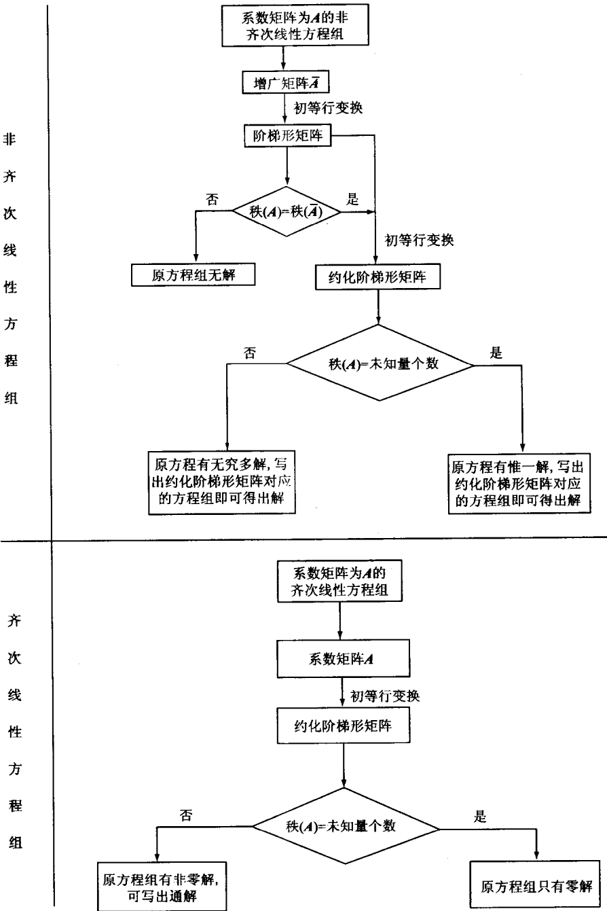

# 2.1 消元法

上一章我们只讨论了方程个数与未知量个数相等,且系数行列式不为零的线性方程组解的公式.这一章我们要讨论一般线性方程组

$$
\left\{ \begin{array}{l} a _ {11} x _ {1} + a _ {12} x _ {2} + \dots + a _ {1 n} x _ {n} = b _ {1}, \\ a _ {2 1} x _ {1} + a _ {2 2} x _ {2} + \dots + a _ {2 n} x _ {n} = b _ {2}, \\ \dots \dots \\ a _ {m 1} x _ {1} + a _ {m 2} x _ {2} + \dots + a _ {m n} x _ {n} = b _ {m}. \end{array} \right.\tag{2.1.1}
$$

解一般线性方程组的基本方法仍是消元法.

### 例 2.1.1 解线性方程组

$$
\text{(I)}\quad
\left\{
\begin{aligned}
&2x_{1} - 3x_{2} + x_{3} = -5 &&\text{①}\\
&x_{1} - 2x_{2} - x_{3} = -2 &&\text{②}\\
&4x_{1} - 2x_{2} + 7x_{3} = -7 &&\text{③}\\
&x_{1} - x_{2} + 2x_{3} = -3 &&\text{④}
\end{aligned}
\right.
$$

> [!note]- 解
> 首先消去①, ③, ④中的 $x_{1}$. 为此② $\times (-2)$ 加到①上得⑤, ② $\times (-4)$ 加到③上得⑥, ② $\times (-1)$ 加到④上得⑦, 并交换②, ⑤位置, 这样由(I)得到与其同解的方程组
>
> $$
> \text{(II)}\quad
> \left\{
> \begin{aligned}
> &x_{1} - 2x_{2} - x_{3} = -2 &&\text{②}\\
> &x_{2} + 3x_{3} = -1 &&\text{⑤}\\
> &6x_{2} + 11x_{3} = 1 &&\text{⑥}\\
> &x_{2} + 3x_{3} = -1 &&\text{⑦}
> \end{aligned}
> \right.
> $$
>
> 继续消去⑥,⑦中的 $x_{2}$. 为此⑤ $\times (-6)$ 加到⑥上得到⑧, ⑤ $\times (-1)$ 加到⑦上得到⑨, 即得与(II)同解的
>
> $$
> \text{(III)}\quad
> \left\{
> \begin{aligned}
> &x_{1} - 2x_{2} - x_{3} = -2 &&\text{②}\\
> &x_{2} + 3x_{3} = -1 &&\text{⑤}\\
> &-7x_{3} = 7 &&\text{⑧}\\
> &0x_{3} = 0 &&\text{⑨}
> \end{aligned}
> \right.
> $$
>
> (III)就容易求解.因⑨是一个恒等式,故求解方程组时可不考虑.将⑤×2与
>
> ⑧× $\frac{5}{7}$ 一起加到②上，将⑧× $\frac{3}{7}$ 加到⑤上，⑧× $\left(\frac{-1}{7}\right)$ 得同解的
>
> $$
> \text{(IV)}\quad
> \left\{
> \begin{aligned}
> &x_{1} = 1,\\
> &x_{2} = 2,\\
> &x_{3} = -1,\\
> &0x_{3} = 0
> \end{aligned}
> \right.
> $$
>
> 并且由前述知，(IV)的解即(I)的解.从而得出(I)的解为
>
> $$
> x _ {1} = 1, \quad x _ {2} = 2, \quad x _ {3} = - 1.
> $$

> 分析上例,我们对方程组施行了三种变换:
>
> (1) 交换两个方程的位置；
> (2) 用一个不等于零的数乘某一个方程；
> (3) 用一个数乘某个方程后加到另一个方程上. 称这三种变换为线性方程组的初等变换.

### 定理 2.1.1 

初等变换把**一个线性方程组**变为一个**与它同解的线性方程组**.

**消元法实质**：
反复施行初等变换，得到与原方程组同解、且更易求解的方程组。

方程组的解由未知量系数和常数项决定；消元时只需研究它们的变化.
用线性方程组(2.1.1)未知量的系数可排成如下一个表

$$
\left[ \begin{array}{c c c c} a _ {11} & a _ {12} & \dots & a _ {1 n} \\ a _ {2 1} & a _ {2 2} & \dots & a _ {2 n} \\ \vdots & \vdots & & \vdots \\ a _ {m 1} & a _ {m 2} & \dots & a _ {m n} \end{array} \right],\tag{2.1.2}
$$

用(2.1.1)未知量的系数和常数项可以排成

$$
\left[ \begin{array}{c c c c c} a _ {11} & a _ {12} & \dots & a _ {1 n} & b _ {1} \\ a _ {2 1} & a _ {2 2} & \dots & a _ {2 n} & b _ {2} \\ \vdots & \vdots & & \vdots & \vdots \\ a _ {m 1} & a _ {m 2} & \dots & a _ {m n} & b _ {m} \end{array} \right],\tag{2.1.3}
$$

为了区分系数和常数,两者之间用虚线分隔.

### 定义 2.1.1 矩阵
由 st 个数  $c_{ij} (i=1,2,\cdots,s; j=1,2,\cdots,t)$  排成一个 s 行 t 列的矩形数阵

$$
\left[ \begin{array}{c c c c} c _ {11} & c _ {12} & \dots & c _ {1 t} \\ c _ {2 1} & c _ {2 2} & \dots & c _ {2 t} \\ \vdots & \vdots & & \vdots \\ c _ {s 1} & c _ {s 2} & \dots & c _ {s t} \end{array} \right],
$$

称为一个 **s 行 t 列(或  $s \times t$ ) 矩阵**, 简记为  $[c_{ij}]_{s \times t}$ . 横写的称为行, 从上到下分别称为第 1, 第 2, …, 第 s 行. 竖写的称为列, 从左到右分别称为第 1, 第 2, …, 第 t 列.  $c_{ij}$  是位于第 i 行第 j 列的元素.

$s \times t$ 矩阵是由 $s t$ 个数组成的一个整体概念,所以两个 $s \times t$ 矩阵 $\left[b_{ij}\right]_{s \times t}$ 和 $\left[c_{ij}\right]_{s \times t}$ 当且仅当 $b_{ij} = c_{ij} (i = 1,2,\dots,s; j = 1,2,\dots,t)$, 才认为 $\left[b_{ij}\right]_{s \times t} = \left[c_{ij}\right]_{s \times t}$.

于是可将矩阵(2.1.2)称为线性方程组(2.1.1)的**系数矩阵**,记为  $A = [a_{ij}]_{m \times n}$ . 将矩阵(2.1.3)称为线性方程组(2.1.1)的**增广矩阵**,记为  $\bar{A}$ . 线性方程组的增广矩阵显然完全能够代表这个方程组.

对照线性方程组的初等变换引入下面的定义.

### 定义 2.1.2 矩阵的初等行(列)变换

矩阵的初等行(列)变换是对一个矩阵施行下列变换:
>(1) 交换矩阵的两行(列), 如第 $i$, 第 $j$ 行(列)的位置. 记为 $R_{ij}(C_{ij})$, 简称为互换;
>(2) 用一个不等于零的数 $k$ 乘矩阵的某一行(列), 如第 $i$ 行(列), 即用 $k$ 乘矩阵第 $i$ 行(列)的每一个元素. 记为 $kR_{i}(kC_{i})$, 简称为倍乘;
>(3) 用某一个数 $k$ 乘矩阵的某一行(列), 如第 $j$ 行(列)后加到另一行(列), 如第 $i$ 行(列)上, 即用 $k$ 乘矩阵的第 $j$ 行(列)的每一个元素后加到第 $i$ 行(列)的对应元素上. 记为 $R_{i} + kR_{j}(C_{i} + kC_{j})$, 简称为倍加.

对**方程组施行初等变换**，等价于对其**增广矩阵**施行对应的初等行变换.

对于一个线性方程组施行初等变换的目的是**消元**,也就是把方程组左端化简,对应地说用初等行变换化简线性方程组的系数矩阵.此时为了叙述方便,除了初等行变换外,还允许交换系数矩阵的两列,而这相当于方程组中未知量重新编号,所以对线性方程组的解没有实质性的影响.

### 定理 2.1.2 矩阵互化
设 $\mathbf{A} = [a_{ij}]_{m \times n}$, 且 $a_{ij} (i = 1, 2, \dots, m; j = 1, 2, \dots, n)$ 不全为零. 通过初等行变换和列互换能把 $\mathbf{A}$ 化为

$$
\boldsymbol {B} = \left[ \begin{array}{c c c c c c c c} 1 & 0 & 0 & \dots & 0 & c _ {1, r + 1} & \dots & c _ {1 n} \\ 0 & 1 & 0 & \dots & 0 & c _ {2, r + 1} & \dots & c _ {2 n} \\ \vdots & \vdots & \vdots & & \vdots & \vdots & & \vdots \\ 0 & 0 & 0 & \dots & 1 & c _ {r, r + 1} & \dots & c _ {r n} \\ 0 & 0 & 0 & \dots & 0 & 0 & \dots & 0 \\ \vdots & \vdots & \vdots & & \vdots & \vdots & & \vdots \\ 0 & 0 & 0 & \dots & 0 & 0 & \dots & 0 \end{array} \right].\tag{2.1.4}
$$

> [!note]- 证
> 若  $a_{11} \neq 0$ ，则可开始讨论，否则因  $a_{ij}$  不全为零，故必有某个  $a_{kl} \neq 0$ 。通过适当的行互换、列互换可使这个非零元素位于矩阵左上角，再开始讨论。用  $a_{kl}^{-1}$  乘第 1 行，然后将第 i 行加上第 1 行的适当倍数  $(i = 2, \cdots, m)$ ，矩阵 A 化为
>
> $$
> \left[ \begin{array}{c c c c c} 1 & a _ {12} ^ {\prime} & a _ {1 3} ^ {\prime} & \dots & a _ {1 n} ^ {\prime} \\ \hline 0 & & & & \\ 0 & & & & \\ \vdots & & \mathbf {A} _ {1} & & \\ 0 & & & & \end{array} \right],
> $$
>
> 此处  $A_{1}$  是一个  $(m-1)\times(n-1)$  矩阵.
>
> 若 $A_{1}$ 的元素全为零, 则定理得证. 此时 $r = 1$. 否则对 $A_{1}$ 重复对 $\pmb{A}$ 的讨论. 如此继续, $\pmb{A}$ 可化为
>
> $$
> \left[ \begin{array}{c c c c c c c c} 1 & a _ {12} ^ {\prime \prime} & a _ {1 3} ^ {\prime \prime} & \dots & a _ {1 r} ^ {\prime \prime} & a _ {1, r + 1} ^ {\prime \prime} & \dots & a _ {1 n} ^ {\prime \prime} \\ 0 & 1 & a _ {2 3} ^ {\prime} & \dots & a _ {2 r} ^ {\prime} & a _ {2, r + 1} ^ {\prime} & \dots & a _ {2 n} ^ {\prime} \\ \vdots & \vdots & \vdots & & \vdots & \vdots & & \vdots \\ 0 & 0 & 0 & \dots & 1 & a _ {r, r + 1} ^ {\prime} & \dots & a _ {r n} ^ {\prime} \\ 0 & 0 & 0 & \dots & 0 & 0 & \dots & 0 \\ \vdots & \vdots & \vdots & & \vdots & \vdots & & \vdots \\ 0 & 0 & 0 & \dots & 0 & 0 & \dots & 0 \end{array} \right].\tag{2.1.5}
> $$
>
> 再将矩阵(2.1.5)的第1,第2,…,第r-1行分别减去第r行的 $a_{1r}^{\prime\prime}$ 倍, $a_{2r}^{\prime}$ 倍,…, $a_{r-1,r}^{\prime}$ 倍;将第1,第2,…,第r-2行分别减去第r-1行的 $a_{1,r-1}^{\prime\prime}$ 倍, $a_{2,r-1}^{\prime}$ 倍,…, $a_{r-2,r-1}^{\prime}$ 倍,如此等等,即可把矩阵(2.1.5)化为矩阵(2.1.4).定理得证.

为描述矩阵B做以下定义
### 定义 2.1.3 阶梯形矩阵
设  $m \times n$  矩阵  $A = [a_{ij}]$  的前  $r (r \leqslant m)$  行均不全为零, 其余行全为零. A 的第  $k (k = 1, 2, \cdots, r)$  行第 1 个非零元素为  $a_{kj_k}$  满足

$$
j _ {1} <   j _ {2} <   \dots <   j _ {r},
$$

则称 A 为**阶梯形矩阵**,且称  $a_{kj}$  为**阶梯头**.

若阶梯形矩阵 $\mathbf{A}$ 的每一个阶梯头均为1, 且阶梯头所在的列其他元素均为零, 则称 $\mathbf{A}$ 为约化阶梯形矩阵(也称为行最简形).

据此定义(2.1.4)的矩阵 B 为约化阶梯形矩阵, 同样地下列矩阵均为阶梯形矩阵, 且后两个矩阵为约化阶梯形

$$
\left[ \begin{array}{c c c c} 1 & 2 & 5 & 8 \\ 0 & 0 & 2 & 4 \\ 0 & 0 & 0 & 0 \end{array} \right], \quad \left[ \begin{array}{c c c c c} 1 & 5 & 0 & 0 & - 2 \\ 0 & 0 & 1 & 0 & 3 \\ 0 & 0 & 0 & 1 & - 3 \end{array} \right], \quad \left[ \begin{array}{c c c c} 0 & 1 & 7 & 0 \\ 0 & 0 & 0 & 1 \\ 0 & 0 & 0 & 0 \end{array} \right].
$$

从解线性方程组的角度看,定理2.1.2是说m个线性方程,可化简(归结)为r个线性方程来求解.至此就会产生这样一个问题:r这个数是由原线性方程组所惟一确定,还是随着不同的初等行(列)变换过程而变化的?或者问一个矩阵用初等行(列)变换化简为阶梯形矩阵,这个阶梯形矩阵中不全为零的行数是否惟一确定?为此我们将在下一节引入一个概念来解决此问题.

## 习题 2.1

1. 用初等行变换将下列矩阵化为约化阶梯形:
(1) $\left[ \begin{array}{r r r r} 1 & 7 & 2 & 8 \\ 0 & - 5 & 3 & 6 \\ - 1 & - 7 & 3 & 7 \end{array} \right];$
(2) $\left[ \begin{array}{c c c} 1 & 3 & 12 \\ 4 & 7 & 7 \\ 3 & 6 & 9 \\ 2 & - 3 & 3 \end{array} \right];$
(3) $\left[ \begin{array}{c c c c} 1 & - 1 & 3 & - 1 \\ 2 & - 1 & - 1 & 4 \\ 3 & - 2 & 2 & 3 \\ 1 & 0 & - 4 & 5 \end{array} \right].$

2. 设 $n$ 阶行列式

$$
\left| \begin{array}{c c c c} a _ {11} & a _ {12} & \dots & a _ {1 n} \\ a _ {2 1} & a _ {2 2} & \dots & a _ {2 n} \\ \vdots & \vdots & & \vdots \\ a _ {n 1} & a _ {n 2} & \dots & a _ {n n} \end{array} \right| \neq 0.
$$

证明:用初等行变换能把 $n$ 行 $n$ 列矩阵

$$
\mathbf {A} = \left[ \begin{array}{c c c c} a _ {11} & a _ {12} & \dots & a _ {1 n} \\ a _ {2 1} & a _ {2 2} & \dots & a _ {2 n} \\ \vdots & \vdots & & \vdots \\ a _ {n 1} & a _ {n 2} & \dots & a _ {n n} \end{array} \right]
$$

化为

$$
\left[ \begin{array}{c c c c} 1 & 0 & \dots & 0 \\ 0 & 1 & \dots & 0 \\ \vdots & \vdots & & \vdots \\ 0 & 0 & \dots & 1 \end{array} \right].
$$

3. 证明互换可通过连续施行若干次倍乘、倍加而实现.

# 2.2 矩阵的秩

### 定义 2.2.1 在一个  $m \times n$  矩阵中，任取 k 行 k 列 ( $k \leqslant m, k \leqslant n$ )，位于这些行列交叉处的元素按原来位置构成的 k 阶行列式称为这个矩阵的一个 k 阶子式.

在2.1节中约化阶梯形矩阵(2.1.4)

$$
\boldsymbol {B} = \left[ \begin{array}{c c c c c c c c} 1 & 0 & 0 & \dots & 0 & c _ {1, r + 1} & \dots & c _ {1 n} \\ 0 & 1 & 0 & \dots & 0 & c _ {2, r + 1} & \dots & c _ {2 n} \\ \vdots & \vdots & \vdots & & \vdots & \vdots & & \vdots \\ 0 & 0 & 0 & \dots & 1 & c _ {r, r + 1} & \dots & c _ {r n} \\ 0 & 0 & 0 & \dots & 0 & 0 & \dots & 0 \\ \vdots & \vdots & \vdots & & \vdots & \vdots & & \vdots \\ 0 & 0 & 0 & \dots & 0 & 0 & \dots & 0 \end{array} \right]
$$

中，由第1,第2,…,第r行；第1,第2,…,第r列组成的r阶子式为

$$
\left| \begin{array}{c c c c} 1 & 0 & \dots & 0 \\ 0 & 1 & \dots & 0 \\ \vdots & \vdots & & \vdots \\ 0 & 0 & \dots & 1 \end{array} \right| = 1 \neq 0.
$$

但矩阵 $\pmb{B}$ 不含阶数高于 $r$ 的非零子式. 这是因为当 $r = m$, 或 $r = n$ 时, 矩阵 $\pmb{B}$ 根本不含阶数高于 $r$ 的子式; 而当 $r < m$, 且 $r < n$ 时, 矩阵 $\pmb{B}$ 的任何一个阶数高于 $r$ 的子式都至少有一行元素全为零, 因而该子式必为零. 这样 $r$ 为矩阵 $\pmb{B}$ 中不为零的子式的最大阶数.

同样道理可以证明:前 r 行均不全为零,其余行全为零的阶梯形矩阵不为零的子式的最大阶数为 r.

### 定义 2.2.2 一个矩阵 $\mathbf{A} = [a_{ij}]_{m\times n}$ 中不为零的子式的最大阶数称为这个矩阵的秩，记为 $r(A)$. 若一个矩阵没有不等于零的子式（相当于该矩阵的元素全为零），就认为这个矩阵的秩为零.

按此定义阶梯形矩阵的秩为其不全为零的行的行数.

确定矩阵秩时可用下列性质.

### 性质 2.2.1 设 $\mathbf{A}$ 是 $m\times n$ 矩阵.

(1) 若 A 有 r 阶子式不为零, 则  $r(A) \geqslant r$ .

(2) 若 $\mathbf{A}$ 的所有 $r + 1$ 阶子式全为零, 则 $r(\mathbf{A}) \leqslant r$.

> [!note]- 证
> （1）是显然的.
>
> (2) 因 $\mathbf{A}$ 的任意一个 $r + 2$ 阶子式(如果有), 可按定理1.4.1展开为 $r + 2$ 个 $r + 1$ 阶子式与一些数相乘后的和, 从而必为零. 据此可推出 $\mathbf{A}$ 的任意一个阶数大于 $r$ 的子式(如果有)必为零.所以 $\mathbf{A}$ 的不为零的子式的阶数 $\leqslant r$ ，即 $r(\mathbf{A})\leqslant r$
>
> 由性质2.2.1可得出矩阵 $\mathbf{A}$ 的秩为 $r$ 的一个等价描述.
>
### 定理 2.2.1 $r(A) = r$ 的充要条件为 $\mathbf{A}$ 有 $r$ 阶子式不为零，而所有的 $r + 1$ 阶子式(如果有)全为零.

前已阐明 $r(\pmb{B}) = r$. 下面将证明 $r$ 也是线性方程组(2.1.1)的系数矩阵 $\mathbf{A} = [a_{ij}]_{m\times n}$ 的秩. 为此只需证明下面的定理.

### 定理 2.2.2 初等行(列)变换不改变矩阵的秩.

> [!note]- 证
> 对三种初等行变换逐个证明.
>
> (1) 互换. 设矩阵 $\mathbf{A}$ 经 $R_{ij}$ 得到 $\mathbf{B}$, 则 $\mathbf{B}$ 中任何一个子式或为 $\mathbf{A}$ 中的一个子式, 或经过适当的行变换可成为 $\mathbf{A}$ 的一个子式. 反之亦然, 故两者最多只能有符号差别, 而是否为零的性质不变. 因此 $r(\mathbf{A}) = r(\mathbf{B})$.
>
> (2) 倍乘. 设矩阵 $\mathbf{A}$ 经 $kR_{i}(k \neq 0)$ 得到 $\mathbf{C}$, 则 $\mathbf{C}$ 中任何一个子式或为 $\mathbf{A}$ 的一个子式, 或为 $\mathbf{A}$ 中相应子式的 $k$ 倍. 反之亦然, 现 $k \neq 0$, 因而两者是否为零的性质不变. 故 $r(\mathbf{A}) = r(\mathbf{C})$.
>
> (3) 倍加. 设矩阵 $\mathbf{A}$ 经过 $R_{i} + kR_{j}$ 得到 $\mathbf{G}$. 设 $r(\mathbf{A}) = r$. 现考虑 $\mathbf{G}$ 中任意一个 $r + 1$ 阶子式 (如果有) $M$, 则 $M$ 有三种可能:
>
> 1) $M$ 不包含 $\pmb{G}$ 中的第 $i$ 行元素.这时 $M$ 为 $\mathbf{A}$ 的一个 $r + 1$ 阶子式，故 $M = 0$
>
> 2) $M$ 包含 $\pmb{G}$ 中的第 $i$ 行元素, 同时也包含 $\pmb{G}$ 中的第 $j$ 行元素. 这时可由行列式性质6得, $M = 0$.
>
> 3) $M$ 包含 $\pmb{G}$ 中的第 $i$ 行元素, 但不包含 $\pmb{G}$ 中的第 $j$ 行元素. 此时
>
> $$
> \begin{array}{r l} M = & \left| \begin{array}{c c c c c c} \vdots & \vdots & & & \vdots \\ a _ {i, t _ {1}} + k a _ {j, t _ {1}} & a _ {i, t _ {2}} + k a _ {j, t _ {2}} & \dots & a _ {i, t _ {r + 1}} + k a _ {j, t _ {r + 1}} \\ \vdots & \vdots & & & \vdots \end{array} \right| \\ = & \left| \begin{array}{c c c c} \vdots & \vdots & \dots & \vdots \\ a _ {i, t _ {1}} & a _ {i, t _ {2}} & \dots & a _ {i, t _ {r + 1}} \\ \vdots & \vdots & \dots & \vdots \end{array} \right| + k \left| \begin{array}{c c c c} \vdots & \vdots & \dots & \vdots \\ a _ {j, t _ {1}} & a _ {j, t _ {2}} & \dots & a _ {j, t _ {r + 1}} \\ \vdots & \vdots & \dots & \vdots \end{array} \right| \\ \underline {{\text {记为}}} M _ {1} + k M _ {2}, \end{array}
> $$
>
> 其中 $M_{1}$ 为 $\mathbf{A}$ 的一个 $r + 1$ 阶子式，故 $M_{1} = 0.$ 而 $M_{2}$ 经适当行交换后为 $\mathbf{A}$ 的一个$r + 1$ 阶子式，用行列式性质2知， $M_2 = 0.$ 从而 $M = 0$
>
> 综上所述 $\mathbf{G}$ 中所有 $r + 1$ 阶子式全为零，所以 $r(\mathbf{G})\leqslant r = r(\mathbf{A})$
>
> 另一方面 $\mathbf{G}$ 经 $R_{i} + (-k)R_{j}$ 得到 $\mathbf{A}$. 同理可得 $r(\mathbf{A}) \leqslant r(\mathbf{G})$. 从而 $r(\mathbf{A}) = r(\mathbf{G})$.
>
> 至此我们证明了初等行变换不改变矩阵的秩.同理可证初等列变换不改变矩
>
> 阵的秩.定理得证.
>
> 现在我们解答了上节所提出的问题: 将一个线性方程组的增广矩阵经过一系列初等行变换和列互换, 最后得到阶梯形矩阵中由不全为零组成行的个数 r 即为增广矩阵的秩, 从而 r 是由线性方程组惟一确定的.
>
下面讨论矩阵秩的性质及求秩方法.

由定义2.2.1可直接得出下述性质.

### 性质 2.2.2 设 $\mathbf{A}$ 是 $m\times n$ 矩阵，则 $r(A)\leqslant m,r(A)\leqslant n.$

### 性质 2.2.3 设 $A = [a_{ij}]$ 是 $n \times n$ 矩阵, 则

(1) $r(\mathbf{A}) = n$ 的充要条件为 $\left|a_{ij}\right|_n\neq 0.$

(2) $r(\mathbf{A}) < n$ 的充要条件为 $\left|a_{ij}\right|_n = 0.$

称 $r(\mathbf{A}) = n$ 的 $n\times n$ 矩阵为满秩矩阵.

### 定理 2.2.2 给出了求矩阵秩的一个常用方法:将矩阵通过初等行(列)变换化为阶梯形，阶梯形矩阵的秩为其不全为零的行的个数，而所得阶梯形矩阵的秩即为原矩阵的秩:

### 例 2.2.1 设矩阵

$$
\boldsymbol {A} = \left[ \begin{array}{c c c} 2 & k & - 1 \\ k & - 1 & 1 \\ 4 & 5 & - 5 \end{array} \right],
$$

求 $r(\mathbf{A})$

> [!note]- 解
>
> $$
> \begin{array}{r l} & \mathbf {A} \xrightarrow [ R _ {3} - 5 R _ {1} ]{R _ {2} + R _ {1}} \left[ \begin{array}{c c c} 2 & k & - 1 \\ k + 2 & k - 1 & 0 \\ - 6 & - 5 k + 5 & 0 \end{array} \right] \\ & \xrightarrow {R _ {3} + 5 R _ {2}} \left[ \begin{array}{c c c} 2 & k & - 1 \\ k + 2 & k - 1 & 0 \\ 5 k + 4 & 0 & 0 \end{array} \right] \xrightarrow {C _ {1 3}} \left[ \begin{array}{c c c} - 1 & k & 2 \\ 0 & k - 1 & k + 2 \\ 0 & 0 & 5 k + 4 \end{array} \right]. \end{array}
> $$
>
> 据此，当 $k \neq 1$ ，且 $k \neq -\frac{4}{5}$ 时，$r(A) = 3$；当 $k = -\frac{4}{5}$ 时，$r(A) = 2$；当 $k = 1$ 时，$r(A) = 2$。
>
### 例 2.2.2 求 $n \times n (n > 1)$ 矩阵

$$
\boldsymbol {A} = \left[ \begin{array}{c c c c c} a & b & b & \dots & b \\ b & a & b & \dots & b \\ \vdots & \vdots & \vdots & & \vdots \\ b & b & b & \dots & a \end{array} \right]
$$

的秩.

> [!note]- 解
>
> $$
> \mathbf {A} \xrightarrow [ \begin{array}{c} R _ {2} - R _ {1} \\ R _ {3} - R _ {1} \\ \vdots \\ R _ {n} - R _ {1} \end{array} ]{R _ {2} - R _ {1}} \left[ \begin{array}{c c c c c} a & b & b & \dots & b \\ b - a & a - b & 0 & \dots & 0 \\ b - a & 0 & a - b & \dots & 0 \\ \vdots & \vdots & \vdots & & \vdots \\ b - a & 0 & 0 & \dots & a - b \end{array} \right]
> $$
>
> $$
> \xrightarrow {C _ {1} + \sum_ {j = 2} ^ {n} C _ {j}} \left[ \begin{array}{c c c c c} a + (n - 1) b & b & b & \dots & b \\ 0 & a - b & 0 & \dots & 0 \\ 0 & 0 & a - b & \dots & 0 \\ \vdots & \vdots & \vdots & & \vdots \\ 0 & 0 & 0 & \dots & a - b \end{array} \right].
> $$
>
> (1) $a = b$ 时:若 $a = b = 0$ ，则 $r(\mathbf{A}) = 0$ ；若 $a = b \neq 0$ ，则 $r(\mathbf{A}) = 1$.
>
> (2) $a \neq b$ 时: 若 $a + (n - 1)b = 0$, 则 $r(\mathbf{A}) = n - 1$; 若 $a + (n - 1)b \neq 0$, 则 $r(\mathbf{A}) = n$.
>
> 注记 1.3节例1.3.5计算行列式
>
> $$
> D = \left| \begin{array}{c c c c c} a & b & b & \dots & b \\ b & a & b & \dots & b \\ \vdots & \vdots & \vdots & & \vdots \\ b & b & b & \dots & a \end{array} \right|,
> $$
>
> 方法二中的化简和这里对矩阵 $\mathbf{A}$ 所施行的变换非常类似，但前者化简过程可用等号连结，这里只能用箭头表示，因施行初等变换后的矩阵改变了.
>
## 习题 2.2

1. 设矩阵 $\mathbf{A}$ 的秩为 $r$, 问 $\mathbf{A}$ 中是否一定存在不为零的 $r - 1$ 阶子式？是否存在为零的 $r$ 阶子式？是否存在不为零的 $r + 1$ 阶子式？

2. 证明矩阵添加一列(行)，则其秩或不变，或增加1.

3. 求下列矩阵的秩:
(1) $\left[ \begin{array}{c c c c c} 2 & 0 & 3 & 1 & 4 \\ 3 & - 5 & 4 & 2 & 7 \\ 1 & 5 & 2 & 0 & 1 \end{array} \right];$
(2) $\left[ \begin{array}{c c c c c} 0 & 1 & 1 & - 1 & 2 \\ 0 & 2 & - 2 & - 2 & 0 \\ 0 & - 1 & - 1 & 1 & 1 \\ 1 & 1 & 0 & 1 & - 1 \end{array} \right];$
(3) $\left[ \begin{array}{c c c c c} 1 & 0 & 1 & 0 & 0 \\ 1 & 1 & 0 & 0 & 0 \\ 0 & 1 & 1 & 0 & 0 \\ 0 & 0 & 1 & 1 & 0 \\ 0 & 1 & 0 & 1 & 1 \end{array} \right];$
(4) $\left[ \begin{array}{c c c c c} 1 & - 1 & 2 & 1 & 0 \\ 2 & - 2 & 4 & - 1 & 0 \\ 3 & 0 & 6 & - 2 & 1 \\ 0 & 3 & 0 & 0 & 1 \end{array} \right].$

4. 设  $a_{i}(i=1,2,\cdots,m)$  不全为零， $b_{j}(j=1,2,\cdots,n)$  不全为零，且

$$
\mathbf {A} _ {m \times n} = \left[ \begin{array}{c c c c} a _ {1} b _ {1} & a _ {1} b _ {2} & \dots & a _ {1} b _ {n} \\ a _ {2} b _ {1} & a _ {2} b _ {2} & \dots & a _ {2} b _ {n} \\ \vdots & \vdots & & \vdots \\ a _ {m} b _ {1} & a _ {m} b _ {2} & \dots & a _ {m} b _ {n} \end{array} \right],
$$

求矩阵 $A_{m\times n}$ 的秩.

5. 求下列矩阵的秩:
(1) $\left[ \begin{array}{c c c c} 1 & 1 & 2 & - 2 \\ 1 & 3 & - k & - 2 k \\ 1 & - 1 & 6 & 0 \end{array} \right];$
(2) $\left[ \begin{array}{c c c} 1 & 1 & k \\ 1 & k & 1 \\ k & 1 & 1 \end{array} \right];$
(3) $\left[ \begin{array}{c c c c} 1 & 1 & 1 & 1 \\ 0 & 1 & - 1 & t \\ 2 & 3 & k & 4 \end{array} \right].$

# 2.3 解线性方程组

有了前两节的准备,现在就可以来解一般线性方程组:

$$
\text{(I)}\quad\left\{ \begin{array}{l} a _ {11} x _ {1} + a _ {12} x _ {2} + \dots + a _ {1 n} x _ {n} = b _ {1}, \\ a _ {2 1} x _ {1} + a _ {2 2} x _ {2} + \dots + a _ {2 n} x _ {n} = b _ {2}, \\ \dots \dots \\ a _ {m 1} x _ {1} + a _ {m 2} x _ {2} + \dots + a _ {m n} x _ {n} = b _ {m}. \end{array} \right.$$

记(I)的系数矩阵为  $A_{m \times n} = [a_{ij}]_{m \times n}$ ，增广矩阵为  $\bar{A}$ 。设  $r(A) = r > 0$ 。综合定理 2.1.2 和定理 2.2.2 知，可通过初等行变换和列互换把 A 化为

$$
A \sim \left[ \begin{array}{c c c c c c c c} 1 & 0 & 0 & \dots & 0 & c _ {1, r + 1} & \dots & c _ {1 n} \\ 0 & 1 & 0 & \dots & 0 & c _ {2, r + 1} & \dots & c _ {2 n} \\ \vdots & \vdots & \vdots & & \vdots & \vdots & & \vdots \\ 0 & 0 & 0 & \dots & 1 & c _ {r, r + 1} & \dots & c _ {r n} \\ 0 & 0 & 0 & \dots & 0 & 0 & \dots & 0 \\ \vdots & \vdots & \vdots & & \vdots & \vdots & & \vdots \\ 0 & 0 & 0 & \dots & 0 & 0 & \dots & 0 \end{array} \right].$$

同样的这些变换把 $\overline{A}$ 化为

$$
A \sim \left[ \begin{array}{c c c c c c c c c} 1 & 0 & 0 & \dots & 0 & c _ {1, r + 1} & \dots & c _ {1 n} & d _ {1} \\ 0 & 1 & 0 & \dots & 0 & c _ {2, r + 1} & \dots & c _ {2 n} & d _ {2} \\ \vdots & \vdots & \vdots & & \vdots & \vdots & & \vdots & \vdots \\ 0 & 0 & 0 & \dots & 1 & c _ {r, r + 1} & \dots & c _ {r n} & d _ {r} \\ 0 & 0 & 0 & \dots & 0 & 0 & \dots & 0 & d _ {r + 1} \\ \vdots & \vdots & \vdots & & \vdots & \vdots & & \vdots & \vdots \\ 0 & 0 & 0 & \dots & 0 & 0 & \dots & 0 & d _ {m} \end{array} \right].$$

这表明(I)与下列线性方程组(II)同解(最多只有未知量编号次序上的差别):

$$
\text{(II)}\quad\left\{ \begin{array}{c c c} x _ {1} & + c _ {1, r + 1} x _ {r + 1} + \dots + c _ {1 n} x _ {n} = d _ {1}, \\ x _ {2} & + c _ {2, r + 1} x _ {r + 1} + \dots + c _ {2 n} x _ {n} = d _ {2}, \\ & \dots \dots \\ & x _ {r} + c _ {r, r + 1} x _ {r + 1} + \dots + c _ {r n} x _ {n} = d _ {r}, \\ 0 x _ {1} + 0 x _ {2} & + \dots + & 0 x _ {n} = d _ {r + 1}, \\ & \dots \dots \\ 0 x _ {1} + 0 x _ {2} & + \dots + & 0 x _ {n} = d _ {m}. \end{array} \right.$$

易见(II)有解的充要条件为: $d_{r+1}=\cdots=d_{m}=0$ . 这相当于说  $r(\overline{\mathbf{A}})=r$ ，从而可得(I)有解的充要条件为: $r(\overline{\mathbf{A}})=r=r(\mathbf{A})$ .

在有解条件下,进而讨论如何确定解.

1. 若 $r = n$ ，方程组中如有恒等式就去掉，则(II)成为

$$
\left\{ \begin{array}{l} x _ {1} = d _ {1}, \\ x _ {2} = d _ {2}, \\ \dots \dots \\ x _ {n} = d _ {n}. \end{array} \right.
$$

这表明此时(II)有惟一解,从而(I)有惟一解: $x_{i}=d_{i}\quad(i=1,2,\cdots,n)$ .

2. 若 $r < n$ ，方程组中如有恒等式就去掉，则(II)成为

$$
\left\{ \begin{array}{l} x _ {1} + c _ {1, r + 1} x _ {r + 1} + \dots + c _ {1 n} x _ {n} = d _ {1}, \\ x _ {2} + c _ {2, r + 1} x _ {r + 1} + \dots + c _ {2 n} x _ {n} = d _ {2}, \\ \dots \dots \\ x _ {r} + c _ {r, r + 1} x _ {r + 1} + \dots + c _ {r n} x _ {n} = d _ {r}. \end{array} \right.
$$

移项得

$$
\left\{ \begin{array}{l} x _ {1} = d _ {1} - c _ {1, r + 1} x _ {r + 1} - \dots - c _ {1 n} x _ {n}, \\ x _ {2} = d _ {2} - c _ {2, r + 1} x _ {r + 1} - \dots - c _ {2 n} x _ {n}, \\ \dots \dots \\ x _ {r} = d _ {r} - c _ {r, r + 1} x _ {r + 1} - \dots - c _ {r n} x _ {n}. \end{array} \right.\tag{2.3.1}
$$

这表明 $x_{r+1}, \cdots, x_n$ 可作为自由未知量. 将自由未知量任意给定的一组数 $x_{r+1} = t_1, \cdots, x_n = t_{n-r}$ 代入(2.3.1), 即可求得 $x_1, x_2, \cdots, x_r$ 相应的值, 把这两组数合并起来就得到(II)的一组解. 因此这时(II), 从而也就是(I)有无穷多个解. 这些解的全体, 即通解可表示为

$$
\left\{ \begin{array}{l} x _ {1} = d _ {1} - c _ {1, r + 1} t _ {1} - \dots - c _ {1 n} t _ {n - r}, \\ x _ {2} = d _ {2} - c _ {2, r + 1} t _ {1} - \dots - c _ {2 n} t _ {n - r}, \\ \dots \dots \\ x _ {r} = d _ {r} - c _ {r, r + 1} t _ {1} - \dots - c _ {r n} t _ {n - r}, \\ x _ {r + 1} = t _ {1}, \\ \dots \dots \\ x _ {n} = t _ {n - r}, \end{array} \right.
$$

其中  $t_{1}, \cdots, t_{n-r}$  为任意常数(常限定在某个数域中, 下文不再说明).

引入记号

“ $A \Rightarrow B$ ”意指命题 $A$ 成立可推出命题 $B$ 成立；

“ $A \Leftrightarrow B$ ”意指命题 $A$ 成立的充要条件为命题 $B$ 成立.

于是我们可有下述定理.

### 定理 2.3.1 线性方程组(I)有解 $\Leftrightarrow r(\overline{A}) = r = r(A)$.

在有解条件下

(1) (I)有惟一解 $\Leftrightarrow r(\overline{A}) = r(A) = r = n$ （未知量个数）.

(2) (I)有无穷多个解 $\Leftrightarrow r(\overline{\mathbf{A}}) = r(\mathbf{A}) = r < n$ (未知量个数), 此时(I)的解中有 $n - r$ 个自由未知量.

(3) 若 $a_{ij} \in P, b_k \in P (i, k = 1, 2, \dots, m; j = 1, 2, \dots, n)$, $P$ 为某个数域, 且自由未知量 (如果有) 均在 $P$ 中取值, 则所有解中的数均属数域 $P$.

> [!note]- 证
> 从上面推导知仅需证明(1)，(2)的必要性及(3)即可.
>
> 现用反证法证(1)的必要性: 若(I)有惟一解, 但 $r(A) = r \neq n$, 则 $r(A) < n$. 据(2)的充分性知(I)有无穷多个解, 此为矛盾. 故(I)的必要性成立.
>
> 同理可证(2)的必要性成立.
>
> 现证(3). 当(I)有解时, 据前论述知解是由 $a_{ij}, b_k$ 经过加、减、乘、除四则运算得到的. 故当 $a_{ij}, b_k$ 均属 $P$, 且自由未知量(如果有)均在 $P$ 中取值时, 所有的解中数均属 $P$.
>
方程组的解由增广矩阵与系数矩阵的秩决定；通常将增广矩阵经初等行变换化为阶梯形来求秩.

在线性方程组(I)中若常数项  $b_{1}=b_{2}=\cdots=b_{m}=0$ ，则称其为齐次线性方程组（否则称其为非齐次线性方程组）。齐次线性方程组是一类特殊的线性方程组，所以可直接应用定理2.3.1来讨论它的解。首先齐次线性方程组是一定有解的，因为

$$
x _ {1} = 0, x _ {2} = 0, \dots , x _ {n} = 0
$$

是它的一组解, 这个解称为零解. 如果齐次线性方程组还有其他解, 则称为非零解. 这也表明齐次线性方程组解惟一相当于它只有零解. 从而当齐次线性方程组有非

零解时,它的解就不惟一,据定理2.3.1它就有无穷多个解.故可有如下定理.

### 定理 2.3.2 齐次线性方程组

$$
\text{(III)}\quad\left\{ \begin{array}{l} a _ {11} x _ {1} + a _ {12} x _ {2} + \dots + a _ {1 n} x _ {n} = 0, \\ a _ {2 1} x _ {1} + a _ {2 2} x _ {2} + \dots + a _ {2 n} x _ {n} = 0, \\ \dots \dots \\ a _ {m 1} x _ {1} + a _ {m 2} x _ {2} + \dots + a _ {m n} x _ {n} = 0 \end{array} \right.$$

解的情况如下:

(1) (III) 只有零解 $\Leftrightarrow r(\mathbf{A}) = r = n$ (未知量个数).

(2) (III)有非零解 $\Leftrightarrow r(\mathbf{A}) = r < n$ (未知量个数), 此时解中有 $n - r$ 个自由未知量.

(3) 若  $a_{ij} \in P (i = 1, 2, \cdots, m; j = 1, 2, \cdots, n)$ , P 为某个数域, 且自由未知量 (如果有) 均在 P 中取值, 则所有的解中的数均属 P.

此定理表明:齐次线性方程组的解是由它的系数矩阵 A 的秩决定的. 因此解齐次线性方程组通常是对 A 施行初等行变换化阶梯形.

当 $m = n$ 时, 我们将性质2.2.3运用于定理2.3.1和定理2.3.2可得下面结论.

### 推论 1 当 $m = n$ 时，(I)有惟一解 $\Leftrightarrow |a_{ij}|_n\neq 0.$

### 推论 2 当 $m = n$ 时，(III)只有零解 $\Leftrightarrow |a_{ij}|_n\neq 0.$

$$
(\text {III}) \text {有非零解} \Leftrightarrow | a _ {i j} | _ {n} = 0.
$$

易见推论1是第1章克拉默法则的加强.推论2是第1章性质1.5.1的加强.

### 例 2.3.1 按现在的说法解例2.1.1中的线性方程组

$$
\left\{ \begin{array}{l} 2 x _ {1} - 3 x _ {2} + x _ {3} = - 5, \\ x _ {1} - 2 x _ {2} - x _ {3} = - 2, \\ 4 x _ {1} - 2 x _ {2} + 7 x _ {3} = - 7, \\ 1 x _ {1} - 1 x _ {2} + 2 x _ {3} = - 3. \end{array} \right.
$$

> [!note]- 解
> 写出增广矩阵 $\overline{\mathbf{A}}$ ，并对 $\overline{\mathbf{A}}$ 施行初等行变换化阶梯形.
>
> $$
> \overline {{\boldsymbol {A}}} = \left[ \begin{array}{r r r r} 2 & - 3 & 1 & - 5 \\ 1 & - 2 & - 1 & - 2 \\ 4 & - 2 & 7 & - 7 \\ 1 & - 1 & 2 & - 3 \end{array} \right] \xrightarrow [ R _ {12} ]{R _ {1} - 2 R _ {2}} \left[ \begin{array}{c c c c} 1 & - 2 & - 1 & - 2 \\ 0 & 1 & 3 & - 1 \\ 0 & 6 & 11 & 1 \\ 0 & 1 & 3 & - 1 \end{array} \right]
> $$
>
> $$
> \xrightarrow { \begin{array}{c} R _ {3} - 6 R _ {2} \\ R _ {4} - R _ {2} \end{array} } \left[ \begin{array}{c c c c} 1 & - 2 & - 1 & - 2 \\ 0 & 1 & 3 & - 1 \\ 0 & 0 & - 7 & 7 \\ 0 & 0 & 0 & 0 \end{array} \right] \xrightarrow { \begin{array}{c} R _ {1} + 2 R _ {2} + \frac {5}{7} R _ {3} \\ R _ {2} + \frac {3}{7} R _ {3} \\ \frac {- 1}{7} R _ {3} \end{array} } \left[ \begin{array}{c c c c} 1 & 0 & 0 & 1 \\ 0 & 1 & 0 & 2 \\ 0 & 0 & 1 & - 1 \\ 0 & 0 & 0 & 0 \end{array} \right].
> $$
>
> 这表明 $r(\overline{A}) = r(A) = 3 =$ 未知量个数，故有惟一解.解为
>
> $$
> x _ {1} = 1, \quad x _ {2} = 2, \quad x _ {3} = - 1.
> $$
>
> 如上述线性方程组的第4个方程改为 $2x_{1} - 2x_{2} + 4x_{3} = -5$ ，而其余方程不变，得到一个新的线性方程组.记其系数矩阵为 $\pmb{B}$ ，增广矩阵为 $\bar{\pmb{B}}$ .对这个线性方程组的增广矩阵 $\bar{\pmb{B}}$ 进行初等行变换.
>
> $$
> \widetilde {\boldsymbol {B}} = \left[ \begin{array}{c c c c} 2 & - 3 & 1 & - 5 \\ 1 & - 2 & - 1 & - 2 \\ 4 & - 2 & 7 & - 7 \\ - 2 & - 2 & 4 & - 5 \end{array} \right] \xrightarrow [ R _ {12} ]{R _ {1} - 2 R _ {2}} \left[ \begin{array}{c c c c} 1 & - 2 & - 1 & - 2 \\ 0 & 1 & 3 & - 1 \\ 0 & 6 & 11 & 1 \\ 0 & 2 & 6 & - 1 \end{array} \right]
> $$
>
> $$
> \xrightarrow { \begin{array}{c} R _ {3} - 6 R _ {2} \\ R _ {4} - 2 R _ {2} \end{array} } \left[ \begin{array}{c c c c} 1 & - 2 & - 1 & - 2 \\ 0 & 1 & 3 & - 1 \\ 0 & 0 & - 7 & 7 \\ 0 & 0 & 0 & 1 \end{array} \right].
> $$
>
> 这表明 $r(\overline{\boldsymbol{B}}) = 4, r(\boldsymbol{B}) = 3$. 由 $r(\overline{\boldsymbol{B}}) \neq r(\boldsymbol{B})$ 知，该线性方程组无解.
>
### 例 2.3.2 解线性方程组

$$
\left\{ \begin{array}{l} x _ {1} + x _ {3} - x _ {4} - 3 x _ {5} = - 2, \\ x _ {1} + 2 x _ {2} - x _ {3} - x _ {5} = 1, \\ 4 x _ {1} + 6 x _ {2} - 2 x _ {3} - 4 x _ {4} + 3 x _ {5} = 7, \\ 2 x _ {1} - 2 x _ {2} + 4 x _ {3} - 7 x _ {4} + 4 x _ {5} = 1. \end{array} \right.
$$

> [!note]- 解
> 对增广矩阵 $\overline{A}$ 施行初等行变换化为阶梯形.
>
> $$
> \overline {{\boldsymbol {A}}} = \left[ \begin{array}{c c c c c c} 1 & 0 & 1 & - 1 & - 3 & - 2 \\ 1 & 2 & - 1 & 0 & - 1 & 1 \\ 4 & 6 & - 2 & - 4 & 3 & 7 \\ 2 & - 2 & 4 & - 7 & 4 & 1 \end{array} \right] \xrightarrow [ R _ {4} - 2 R _ {1} ]{R _ {2} - R _ {1}} \left[ \begin{array}{c c c c c c} 1 & 0 & 1 & - 1 & - 3 & - 2 \\ 0 & 2 & - 2 & 1 & 2 & 3 \\ 0 & 6 & - 6 & 0 & 15 & 15 \\ 0 & - 2 & 2 & - 5 & 10 & 5 \end{array} \right]
> $$
>
> $$
> \xrightarrow [ R _ {4} + R _ {2} ]{R _ {3} - 3 R _ {2}} \left[ \begin{array}{c c c c c c} 1 & 0 & 1 & - 1 & - 3 & - 2 \\ 0 & 2 & - 2 & 1 & 2 & 3 \\ 0 & 0 & 0 & - 3 & 9 & 6 \\ 0 & 0 & 0 & - 4 & 12 & 8 \end{array} \right] \xrightarrow [ - \frac {1}{3} R _ {3} ]{R _ {4} - \frac {4}{3} R _ {3}} \left[ \begin{array}{c c c c c c} 1 & 0 & 1 & - 1 & - 3 & - 2 \\ 0 & 2 & - 2 & 1 & 2 & 3 \\ 0 & 0 & 0 & 1 & - 3 & - 2 \\ 0 & 0 & 0 & 0 & 0 & 0 \end{array} \right]
> $$
>
> 记为 B.
>
> 这表明 $r(\overline{\mathbf{A}}) = 3, r(\mathbf{A}) = 3$，未知量个数 $= 5$. 故 $r(\overline{\mathbf{A}}) = r(\mathbf{A}) <$ 未知量个数. 所以此方程组有无穷多个解，且有 $5 - 3 = 2$ 个自由未知量.
>
> 同时上式也表明虽然 $r(\overline{\mathbf{A}}) = 3$ ，但 $\overline{\mathbf{A}}$ 的左上角的3阶子式为零.为此按定理2.3.1论述的做法要将 $x_{3}$ 和 $x_{4}$ 编号互换(即将 $\overline{\mathbf{A}}$ 的第3列和第4列互换)，再继续进行初等行变换，得出解后再将 $x_{3}$ 和 $x_{4}$ 的编号换回来.这样做既麻烦又易混
>
> 淆,在实际解题中不采用.由于矩阵 B 的第 1, 第 2, 第 3 行;第 1, 第 2, 第 4 列组式的 3 阶子式不为零,我们就对它再进行如下的初等行变换为约化阶梯形矩阵
>
> $$
> \boldsymbol {B} \xrightarrow [ R _ {2} - R _ {3} ]{R _ {1} + R _ {3}} \left[ \begin{array}{c c c c c c} 1 & 0 & 1 & 0 & - 6 & - 4 \\ 0 & 2 & - 2 & 0 & 5 & 5 \\ 0 & 0 & 0 & 1 & - 3 & - 2 \\ 0 & 0 & 0 & 0 & 0 & 0 \end{array} \right] \xrightarrow {\frac {1}{2} R _ {2}} \left[ \begin{array}{c c c c c c} 1 & 0 & 1 & 0 & - 6 & - 4 \\ 0 & 1 & - 1 & 0 & \frac {5}{2} & \frac {5}{2} \\ 0 & 0 & 0 & 1 & - 3 & - 2 \\ 0 & 0 & 0 & 0 & 0 & 0 \end{array} \right].
> $$
>
> 该矩阵所对应的线性方程组为
>
> $$
> \left\{ \begin{array}{c} x _ {1} + x _ {3} - 6 x _ {5} = - 4, \\ x _ {2} - x _ {3} + \frac {5}{2} x _ {5} = \frac {5}{2}, \\ x _ {4} - 3 x _ {5} = - 2. \end{array} \right.
> $$
>
> 可将 $x_{3}, x_{5}$ 作为自由未知量，移项得
>
> $$
> \left\{ \begin{array}{l} x _ {1} = - 4 - x _ {3} + 6 x _ {5}, \\ x _ {2} = \frac {5}{2} + x _ {3} - \frac {5}{2} x _ {5}, \\ x _ {4} = - 2 \quad + 3 x _ {5}. \end{array} \right.
> $$
>
> 所以通解可表示为
>
> $$
> \left\{ \begin{array}{l} x _ {1} = - 4 - t _ {1} + 6 t _ {2}, \\ x _ {2} = \frac {5}{2} + t _ {1} - \frac {5}{2} t _ {2}, \\ x _ {3} = t _ {1}, \\ x _ {4} = - 2 + 3 t _ {2}, \\ x _ {5} = t _ {2}, \end{array} \right.
> $$
>
> 其中 $t_1, t_2$ 为任意常数.
>
> 特别要指出的是若当 $r(\overline{\mathbf{A}}) = r(\mathbf{A}) = r < n$ 时，$\mathbf{A}$ 中不为零的 $r$ 阶子式未必惟一，如例2.3.2中由 $\pmb{B}$ 的第1,第2,第3行；第1,第3,第4列构成的3阶子式也不为零.也可以对它再进行化简，同样可得到方程组的通解，此时无非自由未知量是 $x_{2}, x_{5}$ 而已.虽然两者通解表达形式不一样，但两者所表示的解集合是相同的（解集合是相同的理由将在第4章进一步阐明），所以都可作为原线性方程组的解.
>
### 例 2.3.3 解齐次线性方程组

$$
\left\{ \begin{array}{l} x _ {1} + x _ {3} - x _ {4} - 3 x _ {5} = 0, \\ x _ {1} + 2 x _ {2} - x _ {3} - x _ {5} = 0, \\ 4 x _ {1} + 6 x _ {2} - 2 x _ {3} - 4 x _ {4} + 3 x _ {5} = 0, \\ 2 x _ {1} - 2 x _ {2} + 4 x _ {3} - 7 x _ {4} + 4 x _ {5} = 0. \end{array} \right.
$$

> [!note]- 解
> 此即例 2.3.2 中所有常数项为零的线性方程组, 故对其系数矩阵施行初
>
> 等行变换最后可得
>
> $$
> \left[ \begin{array}{c c c c c} 1 & 0 & 1 & 0 & - 6 \\ 0 & 1 & - 1 & 0 & \frac {5}{2} \\ 0 & 0 & 0 & 1 & - 3 \\ 0 & 0 & 0 & 0 & 0 \end{array} \right].
> $$
>
> 所以,通解为
>
> $$
> \left\{ \begin{array}{l} x _ {1} = - t _ {1} + 6 t _ {2}, \\ x _ {2} = t _ {1} - \frac {5}{2} t _ {2}, \\ x _ {3} = t _ {1}, \\ x _ {4} = 3 t _ {2}, \\ x _ {5} = t _ {2}, \end{array} \right.
> $$
>
> 其中 $t_1, t_2$ 为任意常数.
>
> 下面介绍一类方程,含参数的线性方程组的解法.
>
### 例 2.3.4 λ 取何值时, 线性方程组

$$
\text{(I)}\quad\left\{ \begin{array}{l} x _ {1} - x _ {2} + x _ {3} = 1, \\ x _ {1} + \lambda x _ {2} + x _ {3} = 1, \\ 2 x _ {1} + 2 \lambda x _ {2} + (\lambda + 4) x _ {3} = 3 \end{array} \right.$$

无解,有惟一解,有无穷多个解?在有解时,求出解.

> [!note]- 解
> 方法一 将(I)的增广矩阵 $\overline{A}$ 用初等行变换化为阶梯形
>
> $$
> \bar {\boldsymbol {A}} = \left[ \begin{array}{c c c c} 1 & - 1 & 1 & 1 \\ 1 & \lambda & 1 & 1 \\ 2 & 2 \lambda & \lambda + 4 & 3 \end{array} \right] \longrightarrow \left[ \begin{array}{c c c c} 1 & - 1 & 1 & 1 \\ 0 & \lambda + 1 & 0 & 0 \\ 0 & 0 & \lambda + 2 & 1 \end{array} \right].
> $$
>
> 据此(1)当 $\lambda = -2$ 时， $r(\mathbf{A}) = 2,r(\overline{\mathbf{A}}) = 3.$ 由 $r(\mathbf{A})\neq r(\overline{\mathbf{A}})$ 知，此时(I)无解.
>
> (2) 当 $\lambda \neq -1$, 且 $\lambda \neq -2$ 时, $r(A) = r(\overline{A}) = 3$. 故此时 (I) 有惟一解, 与 (I) 同解的方程组为
>
> $$
> \begin{array}{r l} & \left\{ \begin{array}{l} x _ {1} - x _ {2} + x _ {3} = 1, \\ (\lambda + 1) x _ {2} = 0, \\ (\lambda + 2) x _ {3} = 1. \end{array} \right. \end{array}
> $$
>
> 解此方程组得(I)的惟一解为
>
> $$
> x _ {1} = \frac {\lambda + 1}{\lambda + 2}, \quad x _ {2} = 0, \quad x _ {3} = \frac {1}{\lambda + 2}.
> $$
>
> (3) 当 $\lambda = -1$ 时, $r(A) = r(\overline{A}) = 2$. 故此时(I)有无穷多个解. 与(I)同解的方程组为
>
> $$
> \left\{ \begin{array}{c} x _ {1} - x _ {2} + x _ {3} = 1, \\ x _ {3} = 1. \end{array} \right.
> $$
>
> 解此方程组得(I)的解为
>
> $$
> \left\{ \begin{array}{l l} x _ {1} = t, \\ x _ {2} = t, & \text {其中} t \text {为任意常数}. \\ x _ {3} = 1, \end{array} \right.
> $$
>
> 方法二 因方程个数与未知量个数相等,故可用克拉默法则.为此首先计算系数行列式
>
> $$
> \mid \mathbf {A} \mid = \left| \begin{array}{c c c} 1 & - 1 & 1 \\ 1 & \lambda & 1 \\ 2 & 2 \lambda & \lambda + 4 \end{array} \right| = (\lambda + 1) (\lambda + 2).
> $$
>
> (1) 当 $\lambda \neq -1$, 且 $\lambda \neq -2$ 时, $|A| \neq 0$, 由克拉默法则知, (I)有惟一解. 惟一解可用克拉默法则求得(一般计算量较大), 也可将增广矩阵 $\overline{A}$ 化为阶梯形(参见方法一之(2))求解.
>
> (2) 当 $\lambda = -2$ 时, (I)为
>
> $$
> \left\{ \begin{array}{l} x _ {1} - x _ {2} + x _ {3} = 1, \\ x _ {1} - 2 x _ {2} + x _ {3} = 1, \\ 2 x _ {1} - 4 x _ {2} + 2 x _ {3} = 3. \end{array} \right.
> $$
>
> 将其增广矩阵 $\overline{A}$ 用初等行变换化为阶梯形:
>
> $$
> \overline {{\boldsymbol {A}}} = \left[ \begin{array}{c c c c} 1 & - 1 & 1 & 1 \\ 1 & - 2 & 1 & 1 \\ 2 & - 4 & 2 & 3 \end{array} \right] \longrightarrow \left[ \begin{array}{c c c c} 1 & - 1 & 1 & 1 \\ 0 & - 1 & 0 & 0 \\ 0 & 0 & 0 & 1 \end{array} \right],
> $$
>
> 据此 $r(\overline{\mathbf{A}}) = 3, r(\mathbf{A}) = 2$. 由 $r(\overline{\mathbf{A}}) \neq r(\mathbf{A})$ 知，此时(I)无解.
>
> (3) 当 $\lambda = -1$ 时, (I) 为
>
> $$
> \left\{ \begin{array}{l} x _ {1} - x _ {2} + x _ {3} = 1, \\ x _ {1} - x _ {2} + x _ {3} = 1, \\ 2 x _ {1} - 2 x _ {2} + 3 x _ {3} = 3. \end{array} \right.
> $$
>
> 将其增广矩阵 $\overline{\mathbf{A}}$ 用初等行变换化为阶梯形:
>
> $$
> \overline {{\boldsymbol {A}}} = \left[ \begin{array}{c c c c} 1 & - 1 & 1 & 1 \\ 1 & - 1 & 1 & 1 \\ 2 & - 2 & 3 & 3 \end{array} \right] \longrightarrow \left[ \begin{array}{c c c c} 1 & - 1 & 1 & 1 \\ 0 & 0 & 1 & 1 \\ 0 & 0 & 0 & 0 \end{array} \right],
> $$
>
> 据此 $r(\overline{\mathbf{A}}) = r(\mathbf{A}) = 2$。故(I)有无穷多个解。由与(I)同解的线性方程组为
>
> $$
> \left\{ \begin{array}{c} x _ {1} - x _ {2} + x _ {3} = 1, \\ x _ {3} = 1 \end{array} \right.
> $$
>
> 知，(I)的解为
>
> $$
> \left\{ \begin{array}{l} x _ {1} = t, \\ x _ {2} = t, \\ x _ {3} = 1, \end{array} \right.
> $$
>
> 其中 $t$ 为任意常数.
>
> 注记 此例中方法一比方法二简便.
>
> 线性方程组理论应用广泛.
>
## 习题 2.3

1. 解下列线性方程组:
(1) $\left\{ \begin{array}{l} 2 x _ {1} + x _ {2} - x _ {3} + x _ {4} = 1, \\ 3 x _ {1} - 2 x _ {2} + 2 x _ {3} - 3 x _ {4} = 2, \\ 5 x _ {1} + x _ {2} - x _ {3} + 2 x _ {4} = - 1, \\ 2 x _ {1} - x _ {2} + x _ {3} - 3 x _ {4} = 4; \end{array} \right.$
(2) $\left\{ \begin{array}{l} x _ {1} - 2 x _ {2} + 3 x _ {3} - 4 x _ {4} = 4, \\ x _ {2} - x _ {3} + x _ {4} = - 3, \\ x _ {1} + 3 x _ {2} + x _ {4} = 1, \\ - 7 x _ {2} + 3 x _ {3} + x _ {4} = - 3; \end{array} \right.$

$$
\left\{ \begin{array}{l} x _ {1} + 2 x _ {2} + 3 x _ {3} - x _ {4} = 1, \\ 3 x _ {1} + 2 x _ {2} + x _ {3} - x _ {4} = 1, \end{array} \right.
$$
\* (3) $\left\{ \begin{array}{l} 2 x _ {1} + 3 x _ {2} + x _ {3} + x _ {4} = 1, \\ 2 x _ {1} + 2 x _ {2} + 2 x _ {3} - x _ {4} = 1, \\ 5 x _ {1} + 5 x _ {2} + 2 x _ {3} = 2; \end{array} \right.$
(4) $\left\{ \begin{array}{l} x _ {1} + x _ {2} - x _ {3} - x _ {4} = 1, \\ 2 x _ {1} + x _ {2} + x _ {3} + x _ {4} = 4, \\ 4 x _ {1} + 3 x _ {2} - x _ {3} - x _ {4} = 6, \\ x _ {1} + 2 x _ {2} - 4 x _ {3} - 4 x _ {4} = - 1; \end{array} \right.$
(5) $\left\{ \begin{array}{l} x _ {1} - 2 x _ {2} + 3 x _ {3} - 4 x _ {4} = 0, \\ x _ {2} - x _ {3} + x _ {4} = 0, \\ x _ {1} + 3 x _ {2} - 3 x _ {4} = 0, \\ x _ {1} - 4 x _ {2} + 3 x _ {3} - 2 x _ {4} = 0; \end{array} \right.$
(6) $\left\{ \begin{array}{l} x _ {1} - x _ {3} + x _ {5} = 0, \\ x _ {2} - x _ {4} + x _ {6} = 0, \\ x _ {1} - x _ {2} + x _ {5} - x _ {6} = 0, \\ x _ {2} - x _ {3} + x _ {6} = 0, \\ x _ {1} - x _ {4} + x _ {5} = 0. \end{array} \right.$

2. 下列齐次线性方程组哪些可不必通过计算直接判断有非零解？为什么？
(1) $\left\{ \begin{array}{l} 2 x _ {1} + 3 x _ {2} - 4 x _ {4} = 0, \\ x _ {1} + 2 x _ {2} + 3 x _ {3} = 0, \\ 3 x _ {2} - 7 x _ {3} + 8 x _ {4} = 0; \end{array} \right.$
(2) $\left\{ \begin{array}{l} x _ {1} + 2 x _ {2} + 8 x _ {3} = 0, \\ x _ {1} + 2 x _ {2} - 3 x _ {3} = 0, \\ 2 x _ {1} + 3 x _ {2} + 5 x _ {3} = 0; \end{array} \right.$

$$
\left\{ \begin{array}{l} x _ {1} - 2 x _ {2} + 5 x _ {3} = 0, \\ 2 x _ {1} - 3 x _ {2} + 6 x _ {3} = 0, \\ - x _ {1} + 2 x _ {2} - 5 x _ {3} = 0. \end{array} \right. \tag {3}
$$

3. 方程个数小于未知量个数的齐次线性方程组必有无穷多个解, 对不对? 为什么?

4. $k$ 为何值时，齐次线性方程组

$$
\left\{ \begin{array}{l} k x _ {1} + x _ {2} + x _ {3} = 0, \\ x _ {1} + k x _ {2} - x _ {3} = 0, \\ 2 x _ {1} - x _ {2} + x _ {3} = 0 \end{array} \right.
$$

只有零解.

5. 问 $a, b$ 取何值时，线性方程组

$$
\left\{ \begin{array}{l} x _ {1} + x _ {2} + x _ {3} + x _ {4} + x _ {5} = 1, \\ 3 x _ {1} + 2 x _ {2} + x _ {3} + x _ {4} - 3 x _ {5} = a, \\ x _ {2} + 2 x _ {3} + 2 x _ {4} + 6 x _ {5} = 3, \\ 5 x _ {1} + 4 x _ {2} + 3 x _ {3} + 3 x _ {4} - x _ {5} = b \end{array} \right.
$$

有解？有解时，写出通解.

6. 判别齐次线性方程组 $(n>1)$

$$
\left\{ \begin{array}{l} x _ {2} + x _ {3} + \dots + x _ {n - 1} + x _ {n} = 0, \\ x _ {1} + x _ {3} + \dots + x _ {n - 1} + x _ {n} = 0, \\ x _ {1} + x _ {2} + \dots + x _ {n - 1} + x _ {n} = 0, \\ \dots \dots \\ x _ {1} + x _ {2} + x _ {3} + \dots + x _ {n - 1} = 0 \end{array} \right.
$$

是否有非零解.

7. 证明: 线性方程组

$$
\left\{ \begin{array}{r l} x _ {1} - x _ {2} & = b _ {1} \\ x _ {2} - x _ {3} & = b _ {2} \\ x _ {3} - x _ {4} & = b _ {3} \\ - x _ {1} & + x _ {4} = b _ {4} \end{array} \right.
$$

有解 $\Leftrightarrow \sum_{i=1}^{4} b_i = 0$，且在有解时求出一通解。

\* 8. 问 $a, b, c$ 满足什么条件时，线性方程组

$$
\boxed { \begin{array}{l} \left\{ \begin{array}{l} x + y + z = a + b + c, \\ a x + b y + c z = a ^ {2} + b ^ {2} + c ^ {2}, \\ b c x + a c y + a b z = 3 a b c \end{array} \right. \end{array} }
$$

有惟一解,并求之.

# 2.4 概要及小结

**本章主线**：消元法与矩阵的秩。

## 2.4.1 方法

消元法通过初等变换把线性方程组化为同解且易求解的形式；矩阵语言则把这一过程转化为增广矩阵的初等行变换。最终得到的独立方程个数等于增广矩阵的秩，且由原方程组唯一确定。

## 2.4.2 理论

1. 一般线性方程组

$$
\text{(I)}\quad\left\{ \begin{array}{l} a _ {11} x _ {1} + a _ {12} x _ {2} + \dots + a _ {1 n} x _ {n} = b _ {1}, \\ a _ {2 1} x _ {1} + a _ {2 2} x _ {2} + \dots + a _ {2 n} x _ {n} = b _ {2}, \\ \dots \dots \\ a _ {m 1} x _ {1} + a _ {m 2} x _ {2} + \dots + a _ {m n} x _ {n} = b _ {m}. \end{array} \right.$$

解的情况如下:

(I) 有解 $\Leftrightarrow r(\bar{A}) = r(A)$, 其中

$$
\mathbf {A} = \left[ \begin{array}{c c c c} a _ {11} & a _ {12} & \dots & a _ {1 n} \\ a _ {2 1} & a _ {2 2} & \dots & a _ {2 n} \\ \vdots & \vdots & & \vdots \\ a _ {m 1} & a _ {m 2} & \dots & a _ {m n} \end{array} \right], \quad \bar {\mathbf {A}} = \left[ \begin{array}{c c c c c} a _ {11} & a _ {12} & \dots & a _ {1 n} & b _ {1} \\ a _ {2 1} & a _ {2 2} & \dots & a _ {2 n} & b _ {2} \\ \vdots & \vdots & & \vdots & \vdots \\ a _ {m 1} & a _ {m 2} & \dots & a _ {m n} & b _ {m} \end{array} \right].
$$

在有解条件下

(I) 有惟一解 $\Leftrightarrow r(\overline{A}) = r(A) = r = n$ (未知量个数).

(I) 有无穷多个解 $\Leftrightarrow r(\overline{\mathbf{A}}) = r(\mathbf{A}) = r < n$ (未知量个数), 此时有 $n - r$ 个自由未知量.

特别地当 $m = n$ （即方程个数与未知量个数相等）时有

(I)有惟一解 $\Leftrightarrow |a_{ij}|_n\neq 0$ (克拉默法则包含其中).

2.齐次线性方程组

$$
\text{(II)}\quad\left\{ \begin{array}{l} a _ {11} x _ {1} + a _ {12} x _ {2} + \dots + a _ {1 n} x _ {n} = 0, \\ a _ {2 1} x _ {1} + a _ {2 2} x _ {2} + \dots + a _ {2 n} x _ {n} = 0, \\ \dots \dots \\ a _ {m 1} x _ {1} + a _ {m 2} x _ {2} + \dots + a _ {m n} x _ {n} = 0. \end{array} \right.$$

(II)是(I)中 $b_{1}=b_{2}=\cdots=b_{m}=0$ 的特例,故可直接利用(I)的结论.注意到(II)一定有解,零解就是其中之一,故有

(II) 只有零解 (等价于有惟一解) $\Leftrightarrow r(\mathbf{A}) = r = n$ (未知量个数).

(II)有非零解(等价于有无穷多个解) $\Leftrightarrow r(\mathbf{A}) = r < n$ (未知量个数), 此时有 $n - r$ 个自由未知量.

特别地当 $m = n$ （即方程个数与未知量个数相等）时有

(II) 只有零解 $\Leftrightarrow |a_{ij}|_n \neq 0$.

(II)有非零解 $\Leftrightarrow \left|a_{ij}\right|_n = 0.$

综合所述我们可将解线性方程组的过程用图2.1表示.

非齐次线性方程组

齐次线性方程组

图2.1

含参数的线性方程组需要按参数取值分类讨论。

### 例 2.4.1 设有齐次线性方程组 $(n\geqslant 2)$

$$
\text{(I)}\quad\left\{ \begin{array}{l} (1 + a) x _ {1} + x _ {2} + \dots + x _ {n} = 0, \\ 2 x _ {1} + (2 + a) x _ {2} + \dots + 2 x _ {n} = 0, \\ \dots \dots \\ n x _ {1} + n x _ {2} + \dots + (n + a) x _ {n} = 0, \end{array} \right.$$

试问 $a$ 取何值时，(I)有非零解，并求出其通解.

> [!note]- 解
> 方法一 将(I)的系数矩阵 A 只用初等行变换化简
>
> $$
> \boldsymbol {A} = \left[ \begin{array}{c c c c c} 1 + a & 1 & 1 & \dots & 1 \\ 2 & 2 + a & 2 & \dots & 2 \\ \vdots & \vdots & \vdots & & \vdots \\ n & n & n & \dots & n + a \end{array} \right] \xrightarrow [ R _ {n} - n R _ {1} ]{R _ {2} - 2 R _ {1}} \left[ \begin{array}{c c c c c} 1 + a & 1 & 1 & \dots & 1 \\ - 2 a & a & 0 & \dots & 0 \\ \vdots & \vdots & \vdots & & \vdots \\ - n a & 0 & 0 & \dots & a \end{array} \right] \xlongequal {\text {记为}} \boldsymbol {B}.
> $$
>
> 据此当 $a = 0$ 时，$r(A) = 1 < n$，故(I)有非零解，与(I)同解的方程组为
>
> $$
> x _ {1} + x _ {2} + \dots + x _ {n} = 0,
> $$
>
> 故得(I)的通解为
>
> $$
> \left\{ \begin{array}{l} x _ {1} = - t _ {1} - t _ {2} - \dots - t _ {n - 1}, \\ x _ {2} = t _ {1}, \\ x _ {3} = t _ {2}, \\ \dots \dots \\ x _ {n} = t _ {n - 1}, \end{array} \right.
> $$
>
> $$
> \text {其中} t _ {1}, t _ {2}, \dots , t _ {n - 1} \text {为任意常数}.
> $$
>
> 当 $a \neq 0$ 时，再对矩阵 $\pmb{B}$ 作初等行变换
>
> $$
> \begin{array}{r l} & \left| \boldsymbol {B} \xrightarrow [ i = 2 , \cdots , n ]{\frac {1}{a} R _ {i}} \left[ \begin{array}{c c c c c} 1 + a & 1 & 1 & \dots & 1 \\ - 2 & 1 & 0 & \dots & 0 \\ \vdots & \vdots & \vdots & & \vdots \\ - n & 0 & 0 & \dots & 1 \end{array} \right] \right. \\ & \xrightarrow {R _ {1} - \sum_ {i = 2} ^ {n} R _ {i}} \left[ \begin{array}{c c c c c} a + \frac {n (n + 1)}{2} & 0 & 0 & \dots & 0 \\ - 2 & 1 & 0 & \dots & 0 \\ \vdots & \vdots & \vdots & & \vdots \\ - n & 0 & 0 & \dots & 1 \end{array} \right], \end{array}
> $$
>
> 据此当 $a = -\frac{n(n + 1)}{2}$ 时，$r(\mathbf{A}) = n - 1 < n$，故(I)有非零解，与(I)同解的方程组为
>
> $$
> \left\{ \begin{array}{l} - 2 x _ {1} + x _ {2} = 0, \\ - 3 x _ {1} + x _ {3} = 0, \\ \dots \dots \\ - n x _ {1} + x _ {n} = 0, \end{array} \right.
> $$
>
> 故得(I)的通解为
>
> $$
> \left\{ \begin{array}{l} x _ {1} = t, \\ x _ {2} = 2 t, \\ \dots \\ x _ {n} = n t, \end{array} \right.
> $$
>
> 其中 $t$ 为任意常数.
>
> 方法二 因方程个数与未知量个数相等,故可用克拉默法则,为此首先计算行列式
>
> $$
> \mid \boldsymbol {A} \mid = \left| \begin{array}{c c c c c} 1 + a & 1 & 1 & \dots & 1 \\ 2 & 2 + a & 2 & \dots & 2 \\ \vdots & \vdots & \vdots & & \vdots \\ n & n & n & \dots & n + a \end{array} \right| = \left(a + \frac {n (n + 1)}{2}\right) a ^ {n - 1}.
> $$
>
> 据此当 $|\mathbf{A}| = 0$ ，即 $a = 0$ 或 $a = -\frac{n(n + 1)}{2}$ 时，(I)有非零解.
>
> 当 $a = 0$ 时，与(I)同解的方程组为
>
> $$
> x _ {1} + x _ {2} + \dots + x _ {n} = 0,
> $$
>
> 故得(I)的通解为
>
> $$
> \left\{ \begin{array}{l} x _ {1} = - t _ {1} - t _ {2} - \dots - t _ {n - 1}, \\ x _ {2} = t _ {1}, \\ x _ {3} = t _ {2}, \\ \dots \dots \\ x _ {n} = t _ {n - 1}, \end{array} \right.
> $$
>
> 其中  $t_{1}, t_{2}, \cdots, t_{n-1}$  为任意常数.
>
> 当 $a = -\frac{n(n + 1)}{2}$ 时，对系数矩阵 $\mathbf{A}$ 作初等变换
>
> $$
> \mathbf {A} = \left[ \begin{array}{c c c c c} 1 + a & 1 & 1 & \dots & 1 \\ 2 & 2 + a & 2 & \dots & 2 \\ \vdots & \vdots & \vdots & & \vdots \\ n & n & n & \dots & n + a \end{array} \right] \longrightarrow \left[ \begin{array}{c c c c c} 0 & 0 & 0 & \dots & 0 \\ - 2 & 1 & 0 & \dots & 0 \\ \vdots & \vdots & \vdots & & \vdots \\ - n & 0 & 0 & \dots & 1 \end{array} \right],
> $$
>
> 据此与(I)同解的方程组为
>
> $$
> \left\{ \begin{array}{l} - 2 x _ {1} + x _ {2} = 0, \\ - 3 x _ {1} + x _ {3} = 0, \\ \dots \dots \\ - n x _ {1} + x _ {n} = 0, \end{array} \right.
> $$
>
> 故得(I)的通解为
>
> $$
> \left\{ \begin{array}{l} x _ {1} = t, \\ x _ {2} = 2 t, \\ \dots \\ x _ {n} = n t, \end{array} \right.
> $$
>
> 其中 $t$ 为任意常数.
>
> 此例和例2.3.4均表明解含参数的线性方程组一般可有两种方法:
>
> 方法一 将增广矩阵(非齐次线性方程组),或系数矩阵(齐次线性方程组)只用初等行变换化为阶梯形矩阵.
>
> 方法二 当方程个数与未知量个数相等时,用克拉默法则.
>
## 习题 2.4

1. 讨论下列线性方程组, 当  $\lambda$  取何值时方程组无解, 有惟一解, 有无穷多个解? 在有无穷多个解时写出其通解:

(1) $\left\{ \begin{array}{l} x _ {1} + x _ {2} + \lambda x _ {3} = 2, \\ 3 x _ {1} + 4 x _ {2} + 2 x _ {3} = \lambda , \\ 2 x _ {1} + 3 x _ {2} - x _ {3} = 1; \end{array} \right. $

(2) $\left\{ \begin{array}{l} (\lambda + 3) x _ {1} + x _ {2} + 2 x _ {3} = \lambda , \\ \lambda x _ {1} + (\lambda - 1) x _ {2} + x _ {3} = \lambda , \\ 3 (\lambda + 1) x _ {1} + \lambda x _ {2} + (\lambda + 3) x _ {3} = 3; \end{array} \right.$

* (3) $\left\{ \begin{array}{l} \lambda x _ {1} + x _ {2} + x _ {3} = 1, \\ x _ {1} + \lambda x _ {2} + x _ {3} = \lambda , \\ x _ {1} + x _ {2} + \lambda x _ {3} = \lambda^ {2}. \end{array} \right.$

2. 设线性方程组

$$
\text{(I)}\quad\left\{ \begin{array}{l} a _ {11} x _ {1} + a _ {12} x _ {2} + \dots + a _ {1 n} x _ {n} = b _ {1}, \\ a _ {2 1} x _ {1} + a _ {2 2} x _ {2} + \dots + a _ {2 n} x _ {n} = b _ {2}, \\ \dots \dots \\ a _ {n 1} x _ {1} + a _ {n 2} x _ {2} + \dots + a _ {n n} x _ {n} = b _ {n} \end{array} \right.$$

的系数矩阵 $\mathbf{A}$ 的秩等于矩阵 $\pmb{B}$ 的秩，其中

$$
\boldsymbol {B} = \left[ \begin{array}{c c c c c} a _ {11} & a _ {12} & \dots & a _ {1 n} & b _ {1} \\ a _ {2 1} & a _ {2 2} & \dots & a _ {2 n} & b _ {2} \\ \vdots & \vdots & & \vdots & \vdots \\ a _ {n 1} & a _ {n 2} & \dots & a _ {n n} & b _ {n} \\ b _ {1} & b _ {2} & \dots & b _ {n} & 0 \end{array} \right].
$$

·试证:(I)有解.

3. 写出线性方程组

$$
\left\{ \begin{array}{c c} x _ {1} - x _ {2} & = b _ {1}, \\ x _ {2} - x _ {3} & = b _ {2}, \\ x _ {3} - x _ {4} & = b _ {3}, \\ \dots \dots \\ & x _ {n - 1} - x _ {n} = b _ {n - 1}, \\ - x _ {1} & + x _ {n} = b _ {n} \end{array} \right.
$$

有解的充要条件. 在有解情况下, 写出通解.

4. 已知 $n$ 阶行列式 $D=|a_{ij}|_n\ne0$，证明:线性方程组

$$
\left\{ \begin{array}{l} a _ {11} x _ {1} + a _ {12} x _ {2} + \dots + a _ {1, n - 1} x _ {n - 1} = a _ {1 n}, \\ a _ {2 1} x _ {1} + a _ {2 2} x _ {2} + \dots + a _ {2, n - 1} x _ {n - 1} = a _ {2 n}, \\ \dots \dots \\ a _ {n 1} x _ {1} + a _ {n 2} x _ {2} + \dots + a _ {n, n - 1} x _ {n - 1} = a _ {n n} \end{array} \right.
$$

无解.

5. 证明: 线性方程组

$$
\left\{ \begin{array}{l} a _ {11} x _ {1} + a _ {12} x _ {2} + \dots + a _ {1 n} x _ {n} = b _ {1}, \\ a _ {2 1} x _ {1} + a _ {2 2} x _ {2} + \dots + a _ {2 n} x _ {n} = b _ {2}, \\ \dots \dots \\ a _ {n 1} x _ {1} + a _ {n 2} x _ {2} + \dots + a _ {n n} x _ {n} = b _ {n}, \\ a _ {n + 1, 1} x _ {1} + a _ {n + 1, 2} x _ {2} + \dots + a _ {n + 1, n} x _ {n} = b _ {n + 1} \end{array} \right.
$$

有解的必要条件是行列式

$$
\left| \begin{array}{c c c c c} a _ {11} & a _ {12} & \dots & a _ {1 n} & b _ {1} \\ a _ {2 1} & a _ {2 2} & \dots & a _ {2 n} & b _ {2} \\ \vdots & \vdots & & \vdots & \vdots \\ a _ {n 1} & a _ {n 2} & \dots & a _ {n n} & b _ {n} \\ a _ {n + 1, 1} & a _ {n + 1, 2} & \dots & a _ {n + 1, n} & b _ {n + 1} \end{array} \right| = 0.
$$

试举一例说明这条件不是充分的.
