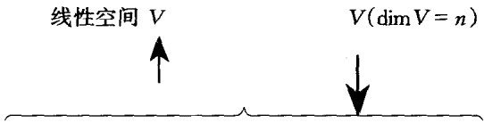

线性空间和线性变换是线性代数的核心，用来统一描述向量、矩阵、多项式等对象。

# 4.1 定义及其背景
线性空间是从我们已经熟悉的许多研究对象,诸如数、向量、矩阵、多项式等经概括而成的.

在研究(欧氏)平面时,通过引进直角坐标系,不仅把起点在坐标原点的向量(或称矢量) $\alpha$ 和其坐标 $[x,y]$ (平面上的点)建立起1-1对应的关系,而且可把几何向量的运算(如几何向量加法的平行四边形法则)转化为其对应坐标的代数运算(分量相加).这样可将平面上向量描述成下述代数系统:

把平面上的向量的全体记为

$$
\mathbf{R} ^{2} = \{[ x, y ] \mid x, y \in \mathbf{R} \}.
$$

对任意的 $\alpha = [x_1,y_1]\in \mathbb{R}^2,\beta = [x_2,y_2]\in \mathbb{R}^2$ ，任意的 $k\in \mathbb{R}$ ，规定加法和数乘为

$$
\begin{array}{r l} \boldsymbol{\alpha} + \boldsymbol{\beta} & = \left[ x _{1}, y _{1} \right] + \left[ x _{2}, y _{2} \right] = \left[ x _{1} + x _{2}, y _{1} + y _{2} \right] \in \mathbf{R} ^{2}; \\ k \boldsymbol{\alpha} & = k \left[ x _{1}, y _{1} \right] = \left[ k x _{1}, k y _{1} \right] \in \mathbf{R} ^{2}. \end{array}
$$

易见向量的加法和数乘适合3.1节的定理3.1.1所说的8条运算规律，比如说零向量为 $[0,0]$，$\alpha$ 的负向量为 $[-x_1, -y_1]$，于是 $\mathbf{R}^2$ 就是平面上全体向量的集合，具有两个封闭的运算加法和数乘，且这两个运算适合8条规律。

同样的想法和做法可在(欧氏)空间中实施.将空间的向量(或称矢量)视为

$$
\mathbf{R} ^{3} = \{[ x, y, z ] \mid x, y, z \in \mathbf{R} \},
$$

即实数域上所有三元向量的全体.类似地规定向量加法和数乘,而且加法和数乘运算也适合上述8条规律.

平面,空间可视为二元向量,三元向量构成的“空间”,自然可推广去设想 n 元向量构成的“空间”.设 P 是一个数域,记

$$
P ^ {n} = \{\left[ x _{1}, x _{2}, \dots , x _ {n} \right] \mid x _{1}, x _{2}, \dots , x _ {n} \in P \}
$$

为数域 $P$ 上所有 $n$ 元向量的全体. 对任意的

$$
\boldsymbol{\alpha} = \left[ x _{1}, x _{2}, \dots , x _ {n} \right] \in P ^ {n}, \quad \boldsymbol{\beta} = \left[ y _{1}, y _{2}, \dots , y _ {n} \right] \in P ^ {n}, \quad k \in P,
$$

规定加法和数乘为

$$
\begin{array}{r l} \boldsymbol{\alpha} + \boldsymbol{\beta} & = [ x _{1}, x _{2}, \dots , x _ {n} ] + [ y _{1}, y _{2}, \dots , y _ {n} ] \\ & = [ x _{1} + y _{1}, x _{2} + y _{2}, \dots , x _ {n} + y _ {n} ] \in P ^ {n}; \\ k \boldsymbol{\alpha} & = k [ x _{1}, x _{2}, \dots , x _ {n} ] = [ k x _{1}, k x _{2}, \dots , k x _ {n} ] \in P ^ {n}. \end{array}
$$

加法和数乘运算也适合上述8条规律.

这样我们就有一个 $n$ 元向量构成的“空间”$P^n$，特别地取 $P = \mathbf{R}$，则

$$
\mathbf{R} ^ {n} = \left\{\left[ a _{1}, a _{2}, \dots , a _ {n} \right] \mid a _ {i} \in \mathbf{R}, i = 1, 2, \dots , n \right\}
$$

是 $n$ 元实向量构成的“空间”，它是平面、空间的自然推广，也是将要引入线性空间的很好背景。

再来看第3章刚讨论过的矩阵，记 $P^{m \times n} = \{[a_{ij}]_{m \times n} | a_{ij} \in P\}$ 为数域 $P$ 上所有 $n \times m$ 矩阵的全体. 对任意的

$$
\left[ a _ {i j} \right] _ {m \times n} \in P ^ {m \times n}, \quad \left[ b _ {i j} \right] _ {m \times n} \in P ^ {m \times n}, \quad k \in P,
$$

规定加法和数乘为

$$
\begin{array}{c} \left[ a _ {i j} \right] _ {m \times n} + \left[ b _ {i j} \right] _ {m \times n} = \left[ a _ {i j} + b _ {i j} \right] _ {m \times n} \in P ^ {m \times n}; \\ k \left[ a _ {i j} \right] _ {m \times n} = \left[ k a _ {i j} \right] _ {m \times n} \in P ^ {m \times n}. \end{array}
$$

加法和数乘适合上述8条运算规律.

特别地, $P^{1\times n}$ (行向量)和 $P^{n}$ (n元向量)不仅表现形式相似,而且有相同的加法和数乘运算规律.

又如系数取自数域 $P$ 上的次数小于 $n$ 的一元多项式，及零多项式可记为

$$
P [ x ] _ {n} = \left\{a _{0} + a _{1} x + \dots + a _ {n - 1} x ^ {n - 1} \mid a _{0}, a _{1}, \dots , a _ {n - 1} \in P \right\}.
$$

设

$$
\begin{array}{c} f (x) = a _{0} + a _{1} x + \dots + a _ {n - 1} x ^ {n - 1} \in P [ x ] _ {n}, \\ g (x) = b _{0} + b _{1} x + \dots + b _ {n - 1} x ^ {n - 1} \in P [ x ] _ {n}, \\ k \in P. \end{array}
$$

多项式的加法和数乘可表为

$$
\begin{array}{c} f (x) + g (x) = (a _{0} + b _{0}) + (a _{1} + b _{1}) x + \dots (a _ {n - 1} + b _ {n - 1}) x ^ {n - 1} \in P [ x ] _ {n}; \\ k f (x) = k a _{0} + k a _{1} x + \dots + k a _ {n - 1} x ^ {n - 1} \in P [ x ] _ {n}. \end{array}
$$

加法和数乘也适合上述8条运算规律.

上述种种使我们看到诸如 $n$ 元向量、矩阵、一元多项式这些从表面上看各不相同的代数系统遵循着相同的运算规律.把这些作为背景概括成更一般的概念.

### **定义4.1.1** 设 P 是一个数域, 其中元素用 a, b, c, … 来表示. V 是一个非空集合, 其中元素用  $\alpha, \beta, \gamma, \cdots$  来表示, 如果下列条件被满足就称 V 为 P 上的一个线性空间. V 中元素通常称为向量.

1. 在 $V$ 中定义了一个加法, 对于 $V$ 中任意两个向量 $\alpha$ 与 $\beta$, 均有 $V$ 中一个惟

一确定的向量 $\gamma$ 与它们对应，这个向量称为 $\alpha$ 与 $\beta$ 的和，记为 $\gamma = \alpha +\beta$

2. 有一个数量乘法, 对于 $P$ 中每一个数 $k$ 和 $V$ 中每一个向量 $\alpha$, 有 $V$ 中惟一确定的向量 $\delta$ 与它们对应, 这个向量称为 $k$ 与 $\alpha$ 的数量乘积, 记为 $\delta = k \cdot \alpha$.

3. 对任意的 $\alpha, \beta, \gamma \in V$，任意的 $k, t \in P$，加法和数量乘法满足下列运算规律:

(1) 交换律 $\alpha + \beta = \beta + \alpha$;

(2) 结合律  $(\boldsymbol{\alpha} + \boldsymbol{\beta}) + \boldsymbol{\gamma} = \boldsymbol{\alpha} + (\boldsymbol{\beta} + \boldsymbol{\gamma})$ ;

(3) 在 $V$ 中存在一个零向量, 记为 $\theta$, 对于 $V$ 中的每一个向量 $\alpha$, 都有 $\alpha + \theta = \alpha$;

(4) 对于 $V$ 中每一个向量 $\alpha$, 在 $V$ 中存在一个向量 $\beta$ 使得 $\alpha + \beta = \theta$, 这样的 $\beta$ 称为 $\alpha$ 的一个负向量;

(5) $k \cdot (\boldsymbol{\alpha} + \boldsymbol{\beta}) = k \cdot \boldsymbol{\alpha} + k \cdot \boldsymbol{\beta}$;

(6) $(k + t)\cdot \boldsymbol{\alpha} = k\cdot \boldsymbol{\alpha} + t\cdot \boldsymbol{\alpha}$;

(7) $(kt)\cdot \alpha = k\cdot (t\cdot \alpha);$

(8) $1 \cdot \alpha = \alpha$.

据此定义容易得出本节开始所述的代数系统均是线性空间.

#### **例4.1.1** 数域 P 上的 n 元向量的全体, 关于向量的加法和数乘构成数域 P 上的一个线性空间, 称为 n 元向量空间, 记为  $P^{n}$ .

特别地，当 $P$ 为实数域 $\mathbf{R}$ 时，$\mathbf{R}^2$ 就是(欧氏)平面，$\mathbf{R}^3$ 就是(欧氏)空间.

下文为叙述方便将行向量改为列向量,即令

$$
P ^ {n} = \left\{\left[ x _{1}, x _{2}, \dots , x _ {n} \right] ^ {\mathrm{T}} \mid x _{1}, x _{2}, \dots x _ {n} \in P \right\},
$$

加法和数乘相应地改为列向量相加和数乘. 这样一来, 如无特殊说明, 约定下文中  $P^{n}$  就表示 n 元列向量关于列向量的加法和数乘构成的线性空间.

#### **例4.1.2** 数域 P 上  $m \times n$  矩阵的全体, 关于矩阵的加法和数乘构成数域 P 上的一个线性空间, 记为  $P^{m \times n}$ . 特别地据上约定  $P^{n \times 1}$  就是  $P^{n}$ .

#### **例4.1.3** 系数取自数域 $P$ 中的次数小于 $n$ 的一元多项式全体及零多项式，关于多项式的加法和数乘构成数域 $P$ 上的一个线性空间，记为 $P[x]_n$.

同样地,系数取自数域 P 中的一元多项式全体,关于多项式的加法和数乘构成数域 P 上的一个线性空间,记为  $P[x]$ .

线性空间的内涵是非常广泛的,许多我们熟悉的对象均可纳入其中.

#### **例4.1.4** 复数域 C 关于数的加法和乘法, 可以构成实数域 R 上的一个线性空间.

#### **例4.1.5** 任意一个数域 $P$ 关于数的加法和乘法可以构成自身 $P$ 上的一个线性空间.

#### **例4.1.6** 定义在闭区间  $[a, b]$  上的一切连续实函数的全体, 关于函数的加法

和实数与函数的数量乘法构成实数域 $\mathbf{R}$ 上的线性空间，记为 $C[a,b]$.

以上例子的验证繁而不难,为篇幅计不一一赘述.从以上例子中可看出线性空间的要点可概括为:一个非空集合 $V$, 具有两个适合8条规律的加法和数量乘法.为表明这几点, 线性空间可表示为 $\{V, +, \cdot\}$.

直接从定义出发可推导出线性空间的一些基本性质.

### **性质4.1.1** 设 V 是数域 P 上的线性空间, 则

(1) 零向量惟一； (2) 负向量惟一.

**证** （1）设 $\pmb{\theta}_{1},\pmb{\theta}_{2}$ 均为 $V$ 的零向量，考虑 $\pmb{\theta}_1 + \pmb{\theta}_2$ .视 $\pmb{\theta}_{1}$ 为零向量，则$\pmb{\theta}_{1} + \pmb{\theta}_{2} = \pmb{\theta}_{2}$ ；然而若视 $\pmb{\theta}_{2}$ 为零向量，则 $\pmb{\theta}_{1} + \pmb{\theta}_{2} = \pmb{\theta}_{1}$ .从而 $\pmb{\theta}_{1} = \pmb{\theta}_{2}$

(2) 设  $\alpha$  有两个负向量  $\beta$  与  $\gamma$ ，则

$$
\boldsymbol{\alpha} + \boldsymbol{\beta} = \boldsymbol{\theta}; \quad \boldsymbol{\alpha} + \boldsymbol{\gamma} = \boldsymbol{\theta}.
$$

从而

$$
\boldsymbol{\beta} = \boldsymbol{\beta} + \boldsymbol{\theta} = \boldsymbol{\beta} + (\boldsymbol{\alpha} + \gamma) = (\boldsymbol{\beta} + \boldsymbol{\alpha}) + \gamma = \boldsymbol{\theta} + \gamma = \gamma .
$$

据负向量的惟一性, 可将  $\alpha$  惟一的负向量记为  $-\alpha$ , 并由此可从加法派生定义减法:

$$
\boldsymbol{\alpha} - \boldsymbol{\beta} \stackrel {\text{规定}} {=} \boldsymbol{\alpha} + (- \boldsymbol{\beta}).
$$

据此可有

$$
\boldsymbol{\alpha} + \boldsymbol{\beta} = \gamma \Leftrightarrow \boldsymbol{\alpha} = \gamma - \boldsymbol{\beta}.
$$

这表明在线性空间中通常的移项变号规则成立.

### **性质4.1.2** 设 $\{V, +, \cdot\}$ 是数域 $P$ 上的线性空间，对任意的 $\alpha \in V, k \in P$ ，有

(1) $0 \cdot \alpha = \theta$;

(2) $k\cdot \pmb{\theta} = \pmb{\theta}$

(3) $(-k)\cdot \alpha = k\cdot (-\alpha) = -(k\cdot \alpha)$;

(4) 若 $k \cdot \boldsymbol{\alpha} = \boldsymbol{\theta}$, 则 $k = 0$, 或 $\boldsymbol{\alpha} = \boldsymbol{\theta}$.

**证** （1）由定义4.1.1知， $0\cdot \alpha = (0 + 0)\cdot \alpha = 0\cdot \alpha +0\cdot \alpha$ .等式两边同时加 $0\cdot \alpha$ 的负向量即得: $0\cdot \alpha = \theta$

(2) 类似(1), 留作习题.

(3) 为证 $(-k)\cdot \pmb{\alpha} = -(k\cdot \pmb{\alpha})$ ，仅须证明: $(-k)\cdot \pmb{\alpha} + k\cdot \pmb{\alpha} = \pmb{\theta}$ .事实上，

$$
(- k) \cdot \boldsymbol{\alpha} + k \cdot \boldsymbol{\alpha} = (- k + k) \cdot \boldsymbol{\alpha} = 0 \cdot \boldsymbol{\alpha} \stackrel {(1)} {=} \boldsymbol{\theta}.
$$

同理可证 $k\cdot (-\pmb{\alpha}) = -(k\cdot \pmb{\alpha}).$ 综上即得

$$
(- k) \cdot \boldsymbol{\alpha} = - (k \cdot \boldsymbol{\alpha}) = k \cdot (- \boldsymbol{\alpha}).
$$

(4) 设 $k \neq 0$, 对 $k \cdot \boldsymbol{\alpha} = \boldsymbol{\theta}$, 两边用 $k^{-1}$ 作数量乘法有

$$
k ^{-1} \cdot (k \cdot \boldsymbol{\alpha}) = k ^{-1} \cdot \boldsymbol{\theta} \stackrel {(2)} {=} \boldsymbol{\theta}.
$$

另一方面， $k^{-1}\cdot (k\cdot \alpha) = (k^{-1}k)\cdot \alpha = 1\cdot \alpha = \pmb{\alpha}$ .从而 $\pmb{\alpha} = \pmb{\theta}$

下文如无特别说明凡线性空间都是指数域 $P$ 上的线性空间, 数 $k$ 和向量 $\alpha$ 的数量乘法也简写为 $k\alpha$, 简称为数乘.

## 习题 4.1
1. 检验以下集合关于所指定的运算是否构成实数域 $\mathbf{R}$ 上的线性空间:

(1) n 阶实对称矩阵的全体, 关于矩阵的加法和实数与矩阵的数乘;

(2) 次数等于 $n (n \geqslant 1)$ 的实系数一元多项式的全体, 关于多项式的加法和实数与多项式的数乘;

(3) 有理数的全体 Q, 关于数的加法和实数与有理数的乘法;

(4) 平面上全体向量  $R^{2}$ ，关于通常的向量加法和如下定义的数量乘法“。”:

$$
k \circ \boldsymbol{\alpha} = \boldsymbol{\theta}, \quad \forall k \in \mathbf{R}, \quad \forall \boldsymbol{\alpha} \in \mathbf{R} ^{2}
$$

2. 在线性空间  $\{V, +, \cdot\}$  中证明:对  $\alpha, \beta \in V, \quad k, t \in P$  有
(1)  $k \cdot \theta = \theta;$ 

(2)  $k \cdot (-\alpha) = -(k \cdot \alpha);$ 
(3)  $-\alpha=(-1)\cdot\alpha;$ 

(4)  $k \cdot (\alpha - \beta) = k \cdot \alpha - k \cdot \beta;$

$$
(k - t) \cdot \boldsymbol{\alpha} = k \cdot \boldsymbol{\alpha} - t \cdot \boldsymbol{\beta}
$$

\* 3. 证明: 数域 $P$ 上的一个线性空间 $V$ 如果含有一个非零向量, 则 $V$ 一定含有无限多个向量.

# 4.2 向量的线性相关性
在研究线性空间时,向量的线性关系(相关或无关)起着极为重要的作用.它不仅是建立线性空间结构与分类理论的基础,也是线性方程组理论的基础,因而是线性代数学最重要的概念之一.

我们先在一般的数域 P 上线性空间 V 中研究向量的线性关系,然后再在具体线性空间  $P^{n}$  中看看这些线性关系的具体表现.

由于向量的加法满足结合律, 故  $k_{1}\alpha_{1} + k_{2}\alpha_{2} + \cdots + k_{s}\alpha_{s}$  有完全确定的意义. 我们由此开始讨论.

### **定义4.2.1** 设  $\alpha_{1}, \alpha_{2}, \cdots, \alpha_{s}$  是数域 P 上线性空间 V 中 s 个向量， $k_{1}, k_{2}, \cdots, k_{s}$  是 P 中任意 s 个数，称  $k_{1}\alpha_{1} + k_{2}\alpha_{2} + \cdots + k_{s}\alpha_{s}$  为向量  $\alpha_{1}, \alpha_{2}, \cdots, \alpha_{s}$  的一个线性组合.

若 V 中某一个向量  $\beta$  可表为向量  $\alpha_{1}, \alpha_{2}, \cdots, \alpha_{s}$  的线性组合，则称  $\beta$  可经  $\alpha_{1}, \alpha_{2}, \cdots, \alpha_{s}$  线性表示.

显见零向量  $\theta$  可经任意一组向量  $\alpha_{1}, \alpha_{2}, \cdots, \alpha_{s}$  线性表示，这是因为

$$
\boldsymbol{\theta} = 0 \boldsymbol{\alpha} _{1} + 0 \boldsymbol{\alpha} _{2} + \dots + 0 \boldsymbol{\alpha} _ {s},
$$

### **定义4.2.2** 设  $\alpha_{1}, \alpha_{2}, \cdots, \alpha_{s}$  是数域 P 上线性空间 V 中 s 个向量, 如果存在 P 中不全为零的数  $k_{1}, k_{2}, \cdots, k_{s}$ , 使得

$$
k _{1} \boldsymbol{\alpha} _{1} + k _{2} \boldsymbol{\alpha} _{2} + \dots + k _ {r} \boldsymbol{\alpha} _ {s} = \boldsymbol{\theta},\tag{4.2.1}
$$

则称  $\alpha_{1}, \alpha_{2}, \cdots, \alpha_{s}$  线性相关；否则就称线性无关.

据定义,称  $\alpha_{1},\alpha_{2},\cdots,\alpha_{s}$  线性无关,就是指 P 中找不到不全为零的数  $k_{1}, k_{2},\cdots,k_{s}$ ,使得(4.2.1)式成立,也就是说:

若有一组数 $k_{1}, k_{2}, \cdots, k_{s}$ 使 $k_{1} \boldsymbol{\alpha}_{1} + k_{2} \boldsymbol{\alpha}_{2} + \cdots + k_{r} \boldsymbol{\alpha}_{s} = \boldsymbol{\theta}$, 则必有

$$
k _{1} = k _{2} = \dots = k _ {s} = 0.\tag{4.2.2}
$$

(4.2.2)所述法则将常用来阐明  $\alpha_{1}, \alpha_{2}, \cdots, \alpha_{s}$  是线性无关的.

### 性质4.2.1 在线性空间 $V$ 中有
(1) 一个向量组中有部分向量组线性相关, 则向量组线性相关.

(2) 一个向量组线性无关, 则其任何一个部分向量组必线性无关.

(3) 任何一个包含零向量的向量组必线性相关.

(4) 一个向量 $\alpha$ 线性相关 $\Leftrightarrow \alpha = \theta$.

(5) 一个向量 $\alpha$ 线性无关 $\Leftrightarrow \alpha \neq \theta$.

**证** （1）仅需证在向量组  $\alpha_{1}, \alpha_{2}, \cdots, \alpha_{s}, \alpha_{s+1}, \cdots, \alpha_{s+t}$  中，若  $\alpha_{1}, \alpha_{2}, \cdots, \alpha_{s}$  线性相关，则  $\alpha_{1}, \alpha_{2}, \cdots, \alpha_{s}, \alpha_{s+1}, \cdots, \alpha_{s+t}$  必线性相关.

据题设存在 P 中不全为零的数  $k_{1}, k_{2}, \cdots, k_{s}$ ，使得

$$
k _{1} \boldsymbol{\alpha} _{1} + k _{2} \boldsymbol{\alpha} _{2} + \dots + k _ {s} \boldsymbol{\alpha} _ {s} = \boldsymbol{\theta}.
$$

从而有 P 中不全为零的数  $k_{1}, k_{2}, \cdots, k_{s}, 0, \cdots, 0$ ，使得

$$
k _{1} \boldsymbol{\alpha} _{1} + k _{2} \boldsymbol{\alpha} _{2} + \dots + k _ {s} \boldsymbol{\alpha} _ {s} + 0 \boldsymbol{\alpha} _ {s + 1} + \dots + 0 \boldsymbol{\alpha} _ {s + t} = \boldsymbol{\theta}.
$$

故  $\alpha_{1},\alpha_{2},\cdots,\alpha_{s},\alpha_{s+1},\cdots,\alpha_{s+z}$  线性相关.

(2) (2) 是 (1) 的逆否命题, 故由 (1) $\Rightarrow$ (2).

(3) 由 $1\pmb{\theta} + 0\pmb{\alpha}_{1} + \dots + 0\pmb{\alpha}_{s} = \pmb{\theta}$ 知，命题成立.

(4) $\pmb{\alpha}$ 线性相关 $\Leftrightarrow$ 存在不为零的数 $k_{1}$ 使得 $k_{1}\pmb{\alpha} = \pmb{\theta}\Leftrightarrow \pmb{\alpha} = \pmb{\theta}$

(5) (5) 是 (4) 的逆否命题, 故由 (4) $\Rightarrow$ (5).

现在我们在具体的线性空间 $P^n$ 中考察这些线性关系.

设

$$
\boldsymbol{\alpha} _ {i} = \left[ a _ {1 i}, a _ {2 i}, \dots , a _ {n i} \right] ^ {\mathrm{T}} \quad (i = 1, 2, \dots , s), \quad \boldsymbol{\beta} = \left[ b _{1}, b _{2}, \dots , b _ {n} \right] ^ {\mathrm{T}},
$$

则  $\beta$  能否用  $\alpha_{1}, \alpha_{2}, \cdots, \alpha_{s}$  线性表示相当于能否找到 P 中数  $k_{1}, k_{2}, \cdots, k_{s}$ ，使得

$$
k _{1} \boldsymbol{\alpha} _{1} + k _{2} \boldsymbol{\alpha} _{2} + \dots + k _ {s} \boldsymbol{\alpha} _ {s} = \boldsymbol{\beta},\tag{4.2.3}
$$

具体写出来是

$$
k _{1} \left[ \begin{array}{c} a _{11} \\ a _{21} \\ \vdots \\ a _ {n 1} \end{array} \right] + k _{2} \left[ \begin{array}{c} a _{12} \\ a _{22} \\ \vdots \\ a _ {n 2} \end{array} \right] + \dots + k _ {s} \left[ \begin{array}{c} a _ {1 s} \\ a _ {2 s} \\ \vdots \\ a _ {n s} \end{array} \right] = \left[ \begin{array}{c} b _{1} \\ b _{2} \\ \vdots \\ b _ {n} \end{array} \right],
$$

即

$$
\left\{ \begin{array}{l} a _{11} k _{1} + a _{12} k _{2} + \dots + a _ {1 s} k _ {s} = b _{1}, \\ a _{21} k _{1} + a _{22} k _{2} + \dots + a _ {2 s} k _ {s} = b _{2}, \\ \dots \dots \\ a _ {n 1} k _{1} + a _ {n 2} k _{2} + \dots + a _ {n s} k _ {s} = b _ {n}. \end{array} \right.
$$

这表明 P 中是否有  $k_{1}, k_{2}, \cdots, k_{s}$  使 (4.2.3) 式成立，相当于线性方程组

$$
\left[ \begin{array}{c c c c} a _{11} & a _{12} & \dots & a _ {1 s} \\ a _{21} & a _{22} & \dots & a _ {2 s} \\ \vdots & \vdots & & \vdots \\ a _ {n 1} & a _ {n 2} & \dots & a _ {n s} \end{array} \right] \left[ \begin{array}{c} x _{1} \\ x _{2} \\ \vdots \\ x _ {s} \end{array} \right] = \left[ \begin{array}{c} b _{1} \\ b _{2} \\ \vdots \\ b _ {n} \end{array} \right],
$$

即

$$
\left[ \begin{array}{l l l l} \boldsymbol{\alpha} _{1} & \boldsymbol{\alpha} _{2} & \dots & \boldsymbol{\alpha} _ {s} \end{array} \right] \left[ \begin{array}{c} x _{1} \\ x _{2} \\ \vdots \\ x _ {s} \end{array} \right] = \boldsymbol{\beta}
$$

在数域 $P$ 中是否有解.

于是据2.3节的定理2.3.1可有如下性质.

### **性质4.2.2**  $P^{n}$  中, 设  $\beta = [b_{1}, b_{2}, \cdots, b_{n}]^{T}$ ,  $\alpha_{i} = [a_{1i}, a_{2i}, \cdots, a_{ni}]^{T} (i = 1, 2, \cdots, s)$ , 则

(1)  $\beta$  能经向量组  $\alpha_{1}, \alpha_{2}, \cdots, \alpha_{s}$  线性表示  $\Leftrightarrow r(\overline{A}) = r(A)$ ;

(2)  $\beta$  不能经向量组  $\alpha_{1}, \alpha_{2}, \cdots, \alpha_{s}$  线性表示  $\Leftrightarrow r(\bar{A}) \neq r(A)$ ,

(1)和(2)中的  $A = \begin{bmatrix} \alpha_{1} & \alpha_{2} & \cdots & \alpha_{s} \end{bmatrix}, \overline{A} = \begin{bmatrix} \alpha_{1} & \alpha_{2} & \cdots & \alpha_{s} \end{bmatrix}$ .

当  $\beta$  能经向量组  $\alpha_{1}, \alpha_{2}, \cdots, \alpha_{s}$  线性表示时，若  $r(A) = s$ ，则表示式惟一，若  $r(A) < s$ ，则有无穷多种表示式.

进而  $\alpha_{1},\alpha_{2},\cdots,\alpha_{s}$  线性相关(线性无关)，意指存在(不存在)一组不全为零的 P 中数  $k_{1},k_{2},\cdots,k_{s}$ ，使得

$$
k _{1} \boldsymbol{\alpha} _{1}, + k _{2} \boldsymbol{\alpha} _{2} + \dots + k _ {s} \boldsymbol{\alpha} _ {s} = \boldsymbol{\theta},
$$

即

$$
\left[ \begin{array}{l l l l} {\pmb{\alpha} _{1}} & {\pmb{\alpha} _{2}} & {\dots} & {\pmb{\alpha} _ {s}} \end{array} \right] \left[ \begin{array}{c} k _{1} \\ k _{2} \\ \vdots \\ k _ {s} \end{array} \right] = \pmb{\theta}, \text{其中} \pmb{\theta} = [ 0, 0, \dots , 0 ] ^ {\mathrm{T}}.
$$

这就相当于齐次线性方程组  $A\begin{bmatrix}x_{1}\\ x_{2}\\ \vdots\\ x_{s}\end{bmatrix}=O$  有非零解  $x_{1}=k_{1},x_{2}=k_{2},\cdots,x_{s}=k_{s}$  (只

有零解). 于是利用2.3节的定理2.3.2有如下性质.

### **性质4.2.3**  $P^{n}$  中, 设  $\boldsymbol{\alpha}_{i}=[a_{1i},a_{2i},\cdots,a_{ni}]^{\mathrm{T}}(i=1,2,\cdots,s)$ , 则

(1)  $\alpha_{1}, \alpha_{2}, \cdots, \alpha_{s}$  线性相关  $\Leftrightarrow r(\mathbf{A}) < s;$

(2)  $\alpha_{1}, \alpha_{2}, \cdots, \alpha_{s}$  线性无关  $\Leftrightarrow r(A) = s$ .

(1)和(2)中的  $A=\left[\begin{array}{ccc}\boldsymbol{\alpha}_{1}&\boldsymbol{\alpha}_{2}&\cdots&\boldsymbol{\alpha}_{s}\end{array}\right]$ .

推论1 在 $P^n$ 中任意 $r(r > n)$ 个向量必线性相关.

特别地当 $s = n$ 时，利用2.3节的定理2.3.2推论，有如下结论.

推论 2 设  $\alpha_{1}, \alpha_{2}, \cdots, \alpha_{n} \in P^{n}$ ，记  $A = [\alpha_{1}, \alpha_{2}, \cdots, \alpha_{n}]$ ，则

(1)  $\alpha_{1}, \alpha_{2}, \cdots, \alpha_{n}$  线性相关  $\Leftrightarrow |A| = 0;$

(2) $\alpha_{1},\alpha_{2},\cdots,\alpha_{n}$ 线性无关 $\Leftrightarrow|A|\neq0.$

这表明在 $P^n$ 中利用线性方程组解的理论可非常简明地判别出 $P^n$ 中向量的线性关系.

#### **例4.2.1** 在 $\mathbf{R}^4$ 中已知

$$
\begin{array}{c} \boldsymbol{\alpha} _{1} = [ 1, 0, 2, 1 ] ^ {\mathrm{T}}, \quad \boldsymbol{\alpha} _{2} = [ 1, 1, 1, 1 ] ^ {\mathrm{T}}, \\ \boldsymbol{\alpha} _{3} = [ 2, 1, 3, 2 ] ^ {\mathrm{T}}, \quad \boldsymbol{\alpha} _{4} = [ 2, 5, - 1, 4 ] ^ {\mathrm{T}}. \end{array}
$$

(1) $\alpha_{4}$ 能否经 $\alpha_{1}, \alpha_{2}, \alpha_{3}$ 线性表示？$\alpha_{3}$ 能否经 $\alpha_{1}, \alpha_{2}, \alpha_{4}$ 线性表示？如能表示，写出表示式；如不能表示，则说明理由.

(2) 判别下列向量组是线性相关, 还是线性无关:

$$
(\mathrm{A}) \boldsymbol{\alpha} _{1}, \boldsymbol{\alpha} _{2}, \boldsymbol{\alpha} _{3}, \boldsymbol{\alpha} _{4}. \quad (\mathrm{B}) \boldsymbol{\alpha} _{1}, \boldsymbol{\alpha} _{2}, \boldsymbol{\alpha} _{3}. \quad (\mathrm{C}) \boldsymbol{\alpha} _{1}, \boldsymbol{\alpha} _{2}, \boldsymbol{\alpha} _{4}.
$$

解 由性质4.2.2及性质4.2.3知,要解答(1),(2)均可归结为求某些矩阵的秩.为此将 $\alpha_{1},\alpha_{2},\alpha_{3},\alpha_{4}$ 作为列向量组成矩阵 $A = [\alpha_{1}\quad \alpha_{2}\quad \alpha_{3}\quad \alpha_{4}]$, 将 $A$ 只用初等行变换化为阶梯形矩阵

$$
\boldsymbol{A} = \left[\begin{array}{l l l l}1&1&2&2\\0&1&1&5\\2&1&3&- 1\\1&1&2&4\end{array}\right]\rightarrow \left[\begin{array}{l l l l}1&0&1&- 3\\0&1&1&5\\0&0&0&1\\0&0&0&0\end{array}\right] \stackrel {\text{记为}} {=} \left[\begin{array}{l l l l}\boldsymbol{\alpha^ {\prime}} _{1}&\boldsymbol{\alpha^ {\prime}} _{2}&\boldsymbol{\alpha^ {\prime}} _{3}&\boldsymbol{\alpha^ {\prime}} _{4}\end{array}\right] = \boldsymbol{B}.\tag{4.2.4}
$$

(1) 因仅用初等行变换, 故由(4.2.4)知

$$
\begin{array}{l} r ([ \boldsymbol{\alpha} _{1} \quad \boldsymbol{\alpha} _{2} \quad \boldsymbol{\alpha} _{3} \quad \boldsymbol{\alpha} _{4} ]) = r ([ \boldsymbol{\alpha} _{1} ^ {\prime} \quad \boldsymbol{\alpha} _{2} ^ {\prime} \quad \boldsymbol{\alpha} _{3} ^ {\prime} \quad \boldsymbol{\alpha} _{4} ^ {\prime} ]) = 3, \\ r ([ \boldsymbol{\alpha} _{1} \quad \boldsymbol{\alpha} _{2} \quad \boldsymbol{\alpha} _{3} ]) = r ([ \boldsymbol{\alpha} _{1} ^ {\prime} \quad \boldsymbol{\alpha} _{2} ^ {\prime} \quad \boldsymbol{\alpha} _{3} ^ {\prime}) = 2. \end{array}
$$

据此线性方程组

$$
\left[ \begin{array}{l l l} \boldsymbol{\alpha} _{1} & \boldsymbol{\alpha} _{2} & \boldsymbol{\alpha} _{3} \end{array} \right] \left[ \begin{array}{l} x _{1} \\ x _{2} \\ x _{3} \end{array} \right] = \boldsymbol{\alpha} _{4}
$$

无解,所以  $\alpha_{4}$  不能经  $\alpha_{1},\alpha_{2},\alpha_{3}$  线性表示.

由(4.2.4)知

$$
\left[ \begin{array}{l l l l} {\pmb{\alpha} _{1}} & {\pmb{\alpha} _{2}} & {\pmb{\alpha} _{4}} & {\pmb{\alpha} _{3}} \end{array} \right] \xrightarrow [ \text{变换} ]{\text{初等行}} \left[ \begin{array}{l l l l} {\pmb{\alpha} _{1} ^ {\prime}} & {\pmb{\alpha} _{2} ^ {\prime}} & {\pmb{\alpha} _{4} ^ {\prime}} & {\pmb{\alpha} _{3} ^ {\prime}} \end{array} \right] = \left[ \begin{array}{c c c c} {1} & {0} & {- 3} & {1} \\ {0} & {1} & {5} & {1} \\ {0} & {0} & {1} & {0} \\ {0} & {0} & {0} & {0} \end{array} \right],
$$

从而

$$
\begin{array}{l} r ([ \boldsymbol{\alpha} _{1} \quad \boldsymbol{\alpha} _{2} \quad \boldsymbol{\alpha} _{4} \quad \boldsymbol{\alpha} _{3} ]) = r ([ \boldsymbol{\alpha} _{1} ^ {\prime} \quad \boldsymbol{\alpha} _{2} ^ {\prime} \quad \boldsymbol{\alpha} _{4} ^ {\prime} \quad \boldsymbol{\alpha} _{3} ^ {\prime} ]) = 3, \\ r ([ \boldsymbol{\alpha} _{1} \quad \boldsymbol{\alpha} _{2} \quad \boldsymbol{\alpha} _{4} ]) = r ([ \boldsymbol{\alpha} _{1} ^ {\prime} \quad \boldsymbol{\alpha} _{2} ^ {\prime} \quad \boldsymbol{\alpha} _{4} ^ {\prime} ]) = 3. \end{array}
$$

据此线性方程组

$$
\left[ \begin{array}{l l l} \boldsymbol{\alpha} _{1} & \boldsymbol{\alpha} _{2} & \boldsymbol{\alpha} _{4} \end{array} \right] \left[ \begin{array}{l} x _{1} \\ x _{2} \\ x _{3} \end{array} \right] = \boldsymbol{\alpha} _{3}
$$

有惟一解: $x_{1} = 1, x_{2} = 1, x_{3} = 0$。所以 $\alpha_{3}$ 能经 $\alpha_{1}, \alpha_{2}, \alpha_{4}$ 线性表示，表示式为

$$
\boldsymbol{\alpha} _{3} = \boldsymbol{\alpha} _{1} + \boldsymbol{\alpha} _{2}.
$$

(2) 由(4.2.4)知

$$
\begin{array}{l} r \left(\left[ \boldsymbol{\alpha} _{1} \quad \boldsymbol{\alpha} _{2} \quad \boldsymbol{\alpha} _{3} \quad \boldsymbol{\alpha} _{4} \right]\right) = r \left(\left[ \boldsymbol{\alpha} _{1} ^ {\prime} \quad \boldsymbol{\alpha} _{2} ^ {\prime} \quad \boldsymbol{\alpha} _{3} ^ {\prime} \quad \boldsymbol{\alpha} _{4} ^ {\prime} \right]\right) = 3, \\ r \left(\left[ \boldsymbol{\alpha} _{1} \quad \boldsymbol{\alpha} _{2} \quad \boldsymbol{\alpha} _{3} \right]\right) = r \left(\left[ \boldsymbol{\alpha} _{1} ^ {\prime} \quad \boldsymbol{\alpha} _{2} ^ {\prime} \quad \boldsymbol{\alpha} _{3} ^ {\prime} \right]\right) = 2, \\ r \left(\left[ \boldsymbol{\alpha} _{1} \quad \boldsymbol{\alpha} _{2} \quad \boldsymbol{\alpha} _{4} \right]\right) = r \left(\left[ \boldsymbol{\alpha} _{1} ^ {\prime} \quad \boldsymbol{\alpha} _{2} ^ {\prime} \quad \boldsymbol{\alpha} _{4} ^ {\prime} \right]\right) = 3. \end{array}
$$

故向量组(A)线性相关,(B)线性相关,(C)线性无关.

> **注记**：实际上据(4.2.4)可判断出 $\alpha_{1},\alpha_{2},\alpha_{3},\alpha_{4}$ 中任意一个部分向量组是线性无关还是线性相关，比如还可判定 $\alpha_{1},\alpha_{2}$ 线性无关，鉴于此下文还将多次采用此种方法来解题.

线性方程组的理论不仅可有效地判别  $P^{n}$  中向量间的线性关系, 即使在一般的线性空间中也能奏效.

#### **例4.2.2** 设  $\alpha_{1}, \alpha_{2}, \alpha_{3}$  是线性空间 V 中 3 个线性无关的向量, 若

$$
\boldsymbol{\beta} _{1} = \boldsymbol{\alpha} _{1} + \boldsymbol{\alpha} _{2}, \quad \boldsymbol{\beta} _{2} = \boldsymbol{\alpha} _{2} + \boldsymbol{\alpha} _{3}, \quad \boldsymbol{\beta} _{3} = \boldsymbol{\alpha} _{3} + \boldsymbol{\alpha} _{1},
$$

求证: $\pmb{\beta}_1,\pmb{\beta}_2,\pmb{\beta}_3$ 线性无关

**证** 设有 $k_{1}\pmb{\beta}_{1} + k_{2}\pmb{\beta}_{2} + k_{3}\pmb{\beta}_{3} = \pmb{\theta}$ ，代入题设条件有

$$
k _{1} (\boldsymbol{\alpha} _{1} + \boldsymbol{\alpha} _{2}) + k _{2} (\boldsymbol{\alpha} _{2} + \boldsymbol{\alpha} _{3}) + k _{3} (\boldsymbol{\alpha} _{3} + \boldsymbol{\alpha} _{1}) = \boldsymbol{\theta},
$$

整理得

$$
\left(k _{1} + k _{3}\right) \boldsymbol{\alpha} _{1} + \left(k _{1} + k _{2}\right) \boldsymbol{\alpha} _{2} + \left(k _{2} + k _{3}\right) \boldsymbol{\alpha} _{3} = \boldsymbol{\theta},
$$

因 $\alpha_{1},\alpha_{2},\alpha_{3}$ 线性无关，故

$$
\begin{array}{l} \left\{ \begin{array}{l} k _{1} + k _{3} = 0, \\ k _{1} + k _{2} = 0, \\ k _{2} + k _{3} = 0. \end{array} \right. \end{array}
$$

因

$$
\left| \begin{array}{c c c} 1 & 0 & 1 \\ 1 & 1 & 0 \\ 0 & 1 & 1 \end{array} \right| = 2 \neq 0,
$$

得出 $k_{1} = 0, k_{2} = 0, k_{3} = 0$. 利用(4.2.2)知，$\beta_{1}, \beta_{2}, \beta_{3}$ 线性无关.

## 习题4.2
1. 试将向量 $\beta$ 表示成向量 $\alpha_{1},\alpha_{2},\alpha_{3},\alpha_{4}$ 的线性组合:

(1) $\boldsymbol{\beta} = [1,2,1,1]^{\mathrm{T}},\boldsymbol{\alpha}_{1} = [1,1,1,1]^{\mathrm{T}},\boldsymbol{\alpha}_{2} = [1,1, - 1, - 1]^{\mathrm{T}}$

$$
\boldsymbol{\alpha} _{3} = [ 1, - 1, 1, - 1 ] ^ {\mathrm{T}}, \boldsymbol{\alpha} _{4} = [ 1, - 1, - 1, 1 ] ^ {\mathrm{T}};
$$

(2) $\pmb{\beta} = [0,2,0, - 1]^{\mathrm{T}},\pmb{\alpha}_{1} = [1,1,1,1]^{\mathrm{T}},\pmb{\alpha}_{2} = [1,1,1,0]^{\mathrm{T}},$

$$
\boldsymbol{\alpha} _{3} = [ 1, 1, 0, 0 ] ^ {\mathrm{T}}, \boldsymbol{\alpha} _{4} = [ 1, 0, 0, 0 ] ^ {\mathrm{T}}.
$$

2. 设 $\pmb{\beta} = [7, -2, a]^{\mathrm{T}}, \pmb{\alpha}_{1} = [2, 3, 5]^{\mathrm{T}}, \pmb{\alpha}_{2} = [3, 7, 8]^{\mathrm{T}}, \pmb{\alpha}_{3} = [1, -6, 1]^{\mathrm{T}}$. 问 $a$ 取何值时，$\pmb{\beta}$ 可经 $\pmb{\alpha}_{1}, \pmb{\alpha}_{2}, \pmb{\alpha}_{3}$ 线性表示？

\* 3. 设 $\boldsymbol{\beta} = [1,1,b + 3,5]^T$, $\boldsymbol{\alpha}_1 = [1,0,2,3]^T$, $\boldsymbol{\alpha}_2 = [1,1,3,5]^T$,

$$
\boldsymbol{\alpha} _{3} = [ 1, - 1, a + 2, 1 ] ^ {\mathrm{T}}, \boldsymbol{\alpha} _{4} = [ 1, 2, 4, a + 8 ] ^ {\mathrm{T}}.
$$

(1) $a, b$ 为何值时，$\beta$ 不能经 $\alpha_{1}, \alpha_{2}, \alpha_{3}, \alpha_{4}$ 线性表示？

(2) $a, b$ 为何值时，$\beta$ 能经 $\alpha_{1}, \alpha_{2}, \alpha_{3}, \alpha_{4}$ 线性表示？并写出该线性表示式.

4. 判断下列向量组是线性相关, 还是线性无关:

(1) $\boldsymbol{\alpha}_{1} = [2,2,7, - 1]^{\mathrm{T}},\boldsymbol{\alpha}_{2} = [3, - 1,2,4]^{\mathrm{T}},\boldsymbol{\alpha}_{3} = [1,1,3,1]^{\mathrm{T}};$

$$
\boldsymbol{\alpha} _{3} = [ 1, - 3, 0, 1, - 2 ] ^ {T}, \boldsymbol{\alpha} _{4} = [ 1, 5, 2, - 2, 6 ] ^ {T}.
$$

5. 设 $\alpha_{1} = [1,2,3]^{\mathrm{T}}, \alpha_{2} = [2,1,6]^{\mathrm{T}}, \alpha_{3} = [3,4,a]^{\mathrm{T}}$. 问 $a$ 取何值时 $\alpha_{1}, \alpha_{2}, \alpha_{3}$ 线性相关？$a$ 取何值时 $\alpha_{1}, \alpha_{2}, \alpha_{3}$ 线性无关？

$$
\boldsymbol{\alpha} _{1} = [ 4, a _{1}, 0, 0 ] ^ {\mathrm{T}}, \quad \boldsymbol{\alpha} _{2} = [ 4, a _{2}, 4, 0 ] ^ {\mathrm{T}}, \quad \boldsymbol{\alpha} _{3} = [ 4, a _{3}, 4, 4 ] ^ {\mathrm{T}}, \boldsymbol{\alpha} _{4} = [ 4, a _{4}, 0, 4 ] ^ {\mathrm{T}}
$$

在 $a_1, a_2, a_3, a_4$ 可任意选取时，下列命题哪一个是正确的:

(A) $\alpha_{1},\alpha_{2},\alpha_{3}$ 必线性相关. (B) $\alpha_{1},\alpha_{2},\alpha_{3}$ 必线性无关.

(C) $\alpha_{1},\alpha_{2},\alpha_{3},\alpha_{4}$ 必线性无关. (D) $\alpha_{1},\alpha_{2},\alpha_{3},\alpha_{4}$ 必线性相关.

7. 下列论断哪些是对的,哪些是错的? 如果是对的,请证明;否则举出反例:

(1) 如果当  $k_{1}=k_{2}=\cdots=k_{s}=0$  时， $k_{1}\alpha_{1}+k_{2}\alpha_{2}+\cdots+k_{s}\alpha_{s}=\theta$ ，则  $\alpha_{1},\alpha_{2},\cdots,\alpha_{s}$  线性无关；

(2) 若  $\alpha_{1}, \alpha_{2}, \cdots, \alpha_{s}$  线性相关，则存在全不为零的数  $k_{1}, k_{2}, \cdots, k_{s}$ ，使得

$$
k _{1} \boldsymbol{\alpha} _{1} + k _{2} \boldsymbol{\alpha} _{2} + \dots + k _ {s} \boldsymbol{\alpha} _ {s} = \boldsymbol{\theta};
$$

(3) 若  $\alpha_{1}, \alpha_{2}, \cdots, \alpha_{s}$  线性无关， $\beta_{1}, \beta_{2}, \cdots, \beta_{s}$  线性无关，则  $\alpha_{1}, \alpha_{2}, \cdots, \alpha_{s}, \beta_{1}, \beta_{2}, \cdots, \beta_{s}$  必线性无关；

(4) 若  $\alpha_{1}, \alpha_{2}, \cdots, \alpha_{s}$  线性无关，则其中每一个向量都不是其余向量的线性组合；

(5) 若  $\alpha_{1}, \alpha_{2}, \cdots, \alpha_{s}$  线性相关，则其中每一个向量都是其余向量的线性组合.

8. 设 $\alpha_{1}, \alpha_{2}, \alpha_{3}$ 是线性空间 $V$ 中线性无关的向量组, 判断 $\beta_{1}, \beta_{2}, \beta_{3}$ 是线性相关, 还是线性无关:

(1) $\beta_{1} = \alpha_{1} - \alpha_{2}$, $\beta_{2} = \alpha_{2} - \alpha_{3}$, $\beta_{3} = \alpha_{3} - \alpha_{1}$;

(2) $\pmb{\beta}_{1} = \pmb{\alpha}_{1} + \pmb{\alpha}_{2}$, $\pmb{\beta}_{2} = \pmb{\alpha}_{2} + \pmb{\alpha}_{3}$, $\pmb{\beta}_{3} = \pmb{\alpha}_{3} - \pmb{\alpha}_{1}$;

(3) $\beta_{1} = \alpha_{2} - \alpha_{2}$, $\beta_{2} = \alpha_{2} - \alpha_{3}$, $\beta_{3} = \alpha_{3} - t\alpha_{3}$.

9. 判断向量组

$\pmb{\alpha}_{1} = [1,1,1,1]^{\mathrm{T}}, \quad \pmb{\alpha}_{2} = [a,b,c,d]^{\mathrm{T}}, \quad \pmb{\alpha}_{3} = [a^{2},b^{2},c^{2},d^{2}]^{\mathrm{T}}, \quad \pmb{\alpha}_{4} = [a^{3},b^{3},c^{3},d^{3}]^{\mathrm{T}}$ 线性相关还是线性无关，其中 $a, b, c, d$ 为互异的数.

10. 设  $\alpha_{1}, \alpha_{2}, \cdots, \alpha_{s} (r \geqslant 2)$  是数域 P 上线性空间 V 中线性无关的向量组，任取  $k_{1}, k_{2}, \cdots, k_{r-1} \in P$ ，证明:向量组

$$
\boldsymbol{\beta} _{1} = \boldsymbol{\alpha} _{1} + k _{1} \boldsymbol{\alpha} _ {s}, \quad \boldsymbol{\beta} _{2} = \boldsymbol{\alpha} _{2} + k _{2} \boldsymbol{\alpha} _ {s}, \quad \dots , \quad \boldsymbol{\beta} _ {r - 1} = \boldsymbol{\alpha} _ {r - 1} + k _ {r - 1} \boldsymbol{\alpha} _ {s}, \quad \boldsymbol{\beta} _ {s} = \boldsymbol{\alpha} _ {s}
$$

线性无关.

11.(1) 当复数域 $\mathbf{C}$ 作为复数域 $\mathbf{C}$ 上线性空间时, 问: $1, i$ 是否线性无关? 为什么?

(2) 当复数域 $\mathbf{C}$ 作为实数域 $\mathbf{R}$ 上线性空间时，问:$1, i$ 是否线性无关？为什么？

# 4.3 向量的极大线性无关组
我们将在一般的线性空间 V 中研究向量间线性组合、线性相关、线性无关这三者之间的内在联系.

本节所说的向量都是一般线性空间 $V$ 的向量, 所说的向量组都是由有限个向量构成的.

### **定理4.3.1** 向量组  $\alpha_{1}, \alpha_{2}, \cdots, \alpha_{s} (s \geqslant 2)$  线性相关  $\Leftrightarrow \alpha_{1}, \alpha_{2}, \cdots, \alpha_{s}$  中至少有一个向量是其余 s-1 个向量的线性组合.

**证** 必要性. 设  $\alpha_{1}, \alpha_{2}, \cdots, \alpha_{s}$  线性相关, 则有不全为零的数  $k_{1}, k_{2}, \cdots, k_{s}$ , 使得

$$
k _{1} \boldsymbol{\alpha} _{1} + k _{2} \boldsymbol{\alpha} _{2} + \dots + k _ {s} \boldsymbol{\alpha} _ {s} = \boldsymbol{\theta}.
$$

不妨设 $k_{i}\neq 0(1\leqslant i\leqslant s)$ ，则有

$$
\boldsymbol{\alpha} _ {i} = \left(\frac {- k _{1}}{k _ {i}}\right) \boldsymbol{\alpha} _{1} + \dots + \left(\frac {- k _ {i - 1}}{k _ {i}}\right) \boldsymbol{\alpha} _ {i - 1} + \left(\frac {- k _ {i + 1}}{k _ {j}}\right) \boldsymbol{\alpha} _ {i + 1} + \dots + \left(\frac {- k _ {s}}{k _ {j}}\right) \boldsymbol{\alpha} _ {s}.
$$

充分性. 设  $\alpha_{1}, \alpha_{2}, \cdots, \alpha_{s}$  中有某个  $\alpha_{i} (1 \leqslant i \leqslant s)$  可表为

$$
\boldsymbol{\alpha} _ {i} = k _{1} \boldsymbol{\alpha} _{1} + \dots + k _ {i - 1} \boldsymbol{\alpha} _ {i - 1} + k _ {i + 1} \boldsymbol{\alpha} _ {i + 1} + \dots + k _ {s} \boldsymbol{\alpha} _ {s},
$$

则

$$
k _{1} \boldsymbol{\alpha} _{1} + \dots + k _ {i - 1} \boldsymbol{\alpha} _ {i - 1} + (- 1) \boldsymbol{\alpha} _ {i} + k _ {i + 1} \boldsymbol{\alpha} _ {i + 1} + \dots + k _ {s} \boldsymbol{\alpha} _ {s} = \boldsymbol{\theta}.
$$

由 $k_{1},\dots ,k_{i - 1},(-1),k_{i + 1},\dots ,k_s$ 不全为零知， $\alpha_{1},\alpha_{2},\dots ,\alpha_{s}$ 线性相关.

推论  $\alpha_{1},\alpha_{2},\cdots,\alpha_{s}(s\geqslant2)$  线性无关  $\Leftrightarrow\alpha_{1},\alpha_{2},\cdots,\alpha_{s}$  中每一个向量都不能经其余 s-1 个向量线性表示.

### **定理4.3.2** 若向量组  $\alpha_{1}, \alpha_{2}, \cdots, \alpha_{s}$  线性无关，而向量组  $\alpha_{1}, \alpha_{2}, \cdots, \alpha_{s}, \beta$  线性相关，则  $\beta$  必可经  $\alpha_{1}, \alpha_{2}, \cdots, \alpha_{s}$  线性表示，且线性表示式惟一.

**证** 由  $\alpha_{1},\alpha_{2},\cdots,\alpha_{s},\beta$  线性相关知, 存在不全为零的数  $k_{1},k_{2},\cdots,k_{s},k$ , 使得

$$
k _{1} \boldsymbol{\alpha} _{1} + k _{2} \boldsymbol{\alpha} _{2} + \dots + k _ {s} \boldsymbol{\alpha} _ {s} + k \boldsymbol{\beta} = \boldsymbol{\theta}.
$$

现用反证法来证必有 $k \neq 0$. 若不然, $k = 0$, 则 $k_{1}, k_{2}, \dots, k_{s}$ 不全为零, 且有

$$
k _{1} \boldsymbol{\alpha} _{1} + k _{2} \boldsymbol{\alpha} _{2} + \dots + k _ {s} \boldsymbol{\alpha} _ {s} = \boldsymbol{\theta},
$$

这与  $\alpha_{1},\alpha_{2},\cdots,\alpha_{s}$  线性无关矛盾，故  $k\neq0$ . 从而有

$$
\boldsymbol{\beta} = - \frac {k _{1}}{k} \boldsymbol{\alpha} _{1} - \frac {k _{2}}{k} \boldsymbol{\alpha} _{2} - \dots - \frac {k _ {s}}{k} \boldsymbol{\alpha} _ {s}.
$$

再证上述线性表示式惟一.设

$$
\begin{array}{l} \boldsymbol{\beta} = t _{1} \boldsymbol{\alpha} _{1} + t _{2} \boldsymbol{\alpha} _{2} + \dots + t _ {s} \boldsymbol{\alpha} _ {s}, \\ \boldsymbol{\beta} = l _{1} \boldsymbol{\alpha} _{1} + l _{2} \boldsymbol{\alpha} _{2} + \dots + l _ {s} \boldsymbol{\alpha} _ {s}. \end{array}
$$

两式相减得

$$
\left(t _{1} - l _{1}\right) \boldsymbol{\alpha} _{1} + \left(t _{2} - l _{2}\right) \boldsymbol{\alpha} _{2} + \dots + \left(t _ {s} - l _ {s}\right) \boldsymbol{\alpha} _ {s} = \boldsymbol{\theta}.
$$

由  $\alpha_{1},\alpha_{2},\cdots,\alpha_{s}$  线性无关推知

$$
t _{1} = l _{1}, \quad t _{2} = l _{2}, \quad \dots , \quad t _ {s} = l _ {s},
$$

故线性表示式惟一.

### **定理4.3.3** 设向量组  $\alpha_{1}, \alpha_{2}, \cdots, \alpha_{r}$  中每一个向量都可经向量组  $\beta_{1}, \beta_{2}, \cdots, \beta_{s}$  线性表示，若 r > s，则  $\alpha_{1}, \alpha_{2}, \cdots, \alpha_{r}$  线性相关.

**证** 由题设有

$$
\boldsymbol{\alpha} _ {j} = a _ {1 j} \boldsymbol{\beta} _{1} + a _ {2 j} \boldsymbol{\beta} _{2} + \dots + a _ {s j} \boldsymbol{\beta} _ {s}\tag{4.3.1}
$$

$$
\stackrel {\text{记为}} {=} \left[ \begin{array}{l l l l} \boldsymbol{\beta} _{1} & \boldsymbol{\beta} _{2} & \dots & \boldsymbol{\beta} _ {s} \end{array} \right] \left[ \begin{array}{c} a _ {1 j} \\ a _ {2 j} \\ \vdots \\ a _ {s j} \end{array} \right] \quad (j = 1, 2, \dots , r).\tag{4.3.2}
$$

注意 因为  $\beta_{1}, \beta_{2}, \cdots, \beta_{s}$  是一般线性空间中的向量，故不能认为  $[\beta_{1}, \beta_{2}, \cdots, \beta_{s}]$  是矩阵，(4.3.2)式仅是利用矩阵的乘法将(4.3.1)式改写成另一种形式罢了。下面我们常用这种“形式的”记法，不再一一指明。

将(4.3.2)式中的 $r$ 个等式合在一起，用矩阵形式表示

$$
\left[ \begin{array}{l l l l} \boldsymbol{\alpha} _{1} & \boldsymbol{\alpha} _{2} & \dots & \boldsymbol{\alpha} _ {r} \end{array} \right] = \left[ \begin{array}{l l l l} \boldsymbol{\beta} _{1} & \boldsymbol{\beta} _{2} & \dots & \boldsymbol{\beta} _ {s} \end{array} \right] \left[ \begin{array}{c c c c} a _{11} & a _{12} & \dots & a _ {1 r} \\ a _{21} & a _{22} & \dots & a _ {2 r} \\ \vdots & \vdots & & \vdots \\ a _ {s 1} & a _ {s 2} & \dots & a _ {s r} \end{array} \right]
$$

$$
\stackrel {\text{记为}} {=} \left[ \begin{array}{l l l l} \boldsymbol{\beta} _{1} & \boldsymbol{\beta} _{2} & \dots & \boldsymbol{\beta} _ {s} \end{array} \right] \boldsymbol{A} _ {s \times r}
$$

考虑

$$
\begin{array}{r l} k _{1} \boldsymbol{\alpha} _{1} + k _{2} \boldsymbol{\alpha} _{2} + \dots + k _ {r} \boldsymbol{\alpha} _ {r} & = \left[ \begin{array}{l l l l} \boldsymbol{\alpha} _{1} & \boldsymbol{\alpha} _{2} & \dots & \boldsymbol{\alpha} _ {s} \end{array} \right] \left[ \begin{array}{c} k _{1} \\ k _{2} \\ \vdots \\ k _ {r} \end{array} \right] \\ & = \left[ \begin{array}{l l l l} \boldsymbol{\beta} _{1} & \boldsymbol{\beta} _{2} & \dots & \boldsymbol{\beta} _ {s} \end{array} \right] \mathbf{A K}, \end{array}\tag{4.3.3}
$$

其中  $K=\left[k_{1},k_{2},\cdots,k_{r}\right]^{T}$

按向量线性相关的定义,若能找到不全为零的  $k_{1}, k_{2}, \cdots, k_{r}$  使(4.3.3)式等于零向量,就证明了  $\alpha_{1}, \alpha_{2}, \cdots, \alpha_{r}$  线性相关.为此考虑齐次线性方程组 AX = O, 因  $r(A_{s \times r}) \leqslant s < r$  (未知量个数),

据定理 2.3.2 知, AX = O 有非零解, 取其一为  $[k_{1}, k_{2}, \cdots, k_{r}]^{T} = K$ , 则有 AK = O, 从而

$$
k _{1} \boldsymbol{\alpha} _{1} + k _{2} \boldsymbol{\alpha} _{2} + \dots + k _ {r} \boldsymbol{\alpha} _ {r} = \boldsymbol{\theta},
$$

其中 $k_{1}, k_{2}, \cdots, k_{r}$ 不全为零，故得 $\alpha_{1}, \alpha_{2}, \cdots, \alpha_{r}$ 线性相关.

经常要用到的是此定理的逆否命题.

### **定理4.3.4** 设向量组  $\alpha_{1}, \alpha_{2}, \cdots, \alpha_{r}$  中每一个向量都可经向量组  $\beta_{1}, \beta_{2}, \cdots, \beta_{s}$  线性表示，若  $\alpha_{1}, \alpha_{2}, \cdots, \alpha_{r}$  线性无关，则  $r \leqslant s$ .

### **定义4.3.1** 若向量组  $\alpha_{1}, \alpha_{2}, \cdots, \alpha_{r}$  中每一个向量都可经向量组  $\beta_{1}, \beta_{2}, \cdots, \beta_{s}$  线性表示，则称向量组  $\alpha_{1}, \alpha_{2}, \cdots, \alpha_{r}$  可经向量组  $\beta_{1}, \beta_{2}, \cdots, \beta_{s}$  线性表示。若两个向量组可以互相线性表示，则称这两个向量组等价。

由定义容易推出等价向量组有以下性质:

(1) 自反性: 每一向量组都与自身等价;

(2) 对称性: 若向量组(I)与向量组(II)等价, 则向量组(II)也与向量组(I)等价;

(3) 传递性: 若向量组(I)与向量组(II)等价, 向量组(II)与向量组(III)等价, 则向量组(I)与向量组(III)等价.

### **定理4.3.5** 任意两个等价的线性无关向量组它们所含的向量个数相等.

**证** 设线性无关向量组(I)与线性无关向量组(II)等价,且它们所含向量个数分别为 $r,s$. 因(I)可经(II)线性表示,由定理4.3.4知,$r \leqslant s$. 同样由(II)可经(I)线性表示可推出,$s \leqslant r$. 综合即得 $r = s$.

现设  $\alpha_{1}, \alpha_{2}, \cdots, \alpha_{s}$  是线性空间 V 中一组不全为零向量的向量组，我们总可从中选取出一个含有尽可能多的线性无关部分向量组  $\alpha_{i_{1}}, \alpha_{i_{2}}, \cdots, \alpha_{i_{r}}$  来。也就是说

$\alpha_{i_{1}},\alpha_{i_{2}},\cdots,\alpha_{i_{r}}$ 线性无关,而再添加(如果可能)原向量组的任何一个向量 $\alpha_{k}$ 都有 $\alpha_{i_{1}},\alpha_{i_{2}},\cdots,\alpha_{i_{r}},\alpha_{k}$ 线性相关.具体做法可以是:因 $\alpha_{1},\alpha_{2},\cdots,\alpha_{s}$ 不全为零向量,不妨设 $\alpha_{i_{1}}\neq\theta$,则 $\alpha_{i_{1}}$ 线性无关.考察 $\alpha_{i_{1}},\alpha_{k}$,让k取遍 $1,2,\cdots,s$,若 $\alpha_{i_{1}},\alpha_{k}$ 均线性相关,则 $\alpha_{i_{1}}$ 就是.否则就可有 $\alpha_{i_{1}},\alpha_{i_{2}}$ 线性无关,则对 $\alpha_{i_{1}},\alpha_{i_{2}}$ 重复上述讨论.如此继续,即可从 $\alpha_{1},\alpha_{2},\cdots,\alpha_{s}$ 中选出一个含有尽可能多的线性无关的部分向量组.

### **定义4.3.2** 向量组  $\alpha_{1}, \alpha_{2}, \cdots, \alpha_{s}$  中的一个部分向量组  $\alpha_{i_{1}}, \alpha_{i_{2}}, \cdots, \alpha_{i_{r}}$  称为原向量组的一个极大线性无关组, 如果

(1) $\alpha_{i_1},\alpha_{i_2},\dots ,\alpha_{i_r}$ 线性无关；

(2) 再添加原向量组的任何一个向量  $\alpha_{k}$  (如果有)，则  $\alpha_{i_{1}}, \alpha_{i_{2}}, \cdots, \alpha_{i_{r}}, \alpha_{k}$  均线性相关.

由定义易得出当向量组(I):  $\alpha_{1}, \alpha_{2}, \cdots, \alpha_{s}$  线性无关时，(I)的极大线性无关组就是自身.

据定理4.3.2易知，在(1)条件下，(2)和下述条件等价

(2) $^{\prime}\alpha_{1},\alpha_{2},\cdots,\alpha_{s}$ 中任何一个向量 $\alpha_{k}$ 均可经 $\alpha_{i_{1}},\alpha_{i_{2}},\cdots,\alpha_{i_{i}}$ 线性表示.

因而(1)，(2)与(1)，(2)'均可作为极大线性无关组的定义.由(2)'知 $\alpha_{1}$ ， $\alpha_{2},\cdots,\alpha_{s}$ 可经其极大线性无关组 $\alpha_{i_{1}},\alpha_{i_{2}},\cdots,\alpha_{i_{r}}$ 线性表示，而 $\alpha_{i_{1}},\alpha_{i_{2}},\cdots,\alpha_{i_{r}}$ 可经原向量组线性表示是显然的，从而可有

### **性质4.3.1** 向量组与其极大线性无关组等价.

前文已说从线性空间 $V$ 中任意一组不全为零向量的向量组 $\alpha_{1},\alpha_{2},\dots ,\alpha_{s}$ 中总可选取出一个极大线性无关向量组来.而在具体线性空间 $P^n$ 中，选取方法可通过下例来展现.

#### **例4.3.1** 在 $\mathbf{R}^4$ 中已知

$$
\begin{array}{l l} \boldsymbol{\alpha} _{1} = [ 1, 0, 2, 1 ] ^ {\mathrm{T}}, & \boldsymbol{\alpha} _{2} = [ 1, 1, 1, 1 ] ^ {\mathrm{T}}, \\ \boldsymbol{\alpha} _{3} = [ 2, 1, 3, 2 ] ^ {\mathrm{T}}, & \boldsymbol{\alpha} _{4} = [ 2, 5, - 1, 4 ] ^ {\mathrm{T}}. \end{array}
$$

求 $\alpha_{1},\alpha_{2},\alpha_{3},\alpha_{4}$ 的极大线性无关组.

解 例4.2.1已表明

$$
\left[ \begin{array}{l l l l} {\pmb{\alpha} _{1}} & {\pmb{\alpha} _{2}} & {\pmb{\alpha} _{3}} & {\pmb{\alpha} _{4}} \end{array} \right] = \left[ \begin{array}{l l l l} 1 & 1 & 2 & 2 \\ 0 & 1 & 1 & 5 \\ 2 & 1 & 3 & - 1 \\ 1 & 1 & 2 & 4 \end{array} \right] \xrightarrow {\text{初等行变换}} \left[ \begin{array}{l l l l} 1 & 0 & 1 & - 3 \\ 0 & 1 & 1 & 5 \\ 0 & 0 & 0 & 1 \\ 0 & 0 & 0 & 0 \end{array} \right],
$$

且由此得出 $\alpha_{1},\alpha_{2},\alpha_{4}$ 线性无关， $\alpha_{1},\alpha_{2},\alpha_{3},\alpha_{4}$ 线性相关，故 $\alpha_{1},\alpha_{2},\alpha_{4}$ 是 $\alpha_{1}$ ，$\alpha_{2},\alpha_{3},\alpha_{4}$ 的一个极大线性无关组.另一方面， $\alpha_{1},\alpha_{3},\alpha_{4}$ 线性无关， $\alpha_{1},\alpha_{3},\alpha_{4},\alpha_{2}$ 线性相关，故 $\alpha_{1},\alpha_{3},\alpha_{4}$ 也是 $\alpha_{1},\alpha_{2},\alpha_{3},\alpha_{4}$ 的一个极大线性无关组，这表明每一

个不全为零向量的向量组不仅都有极大线性无关组,而还可能不只含一个极大线性无关组.在此例中已找出两个极大线性无关组(还能再找出其他的极大线性无关组吗?),它们都是由3个向量构成,一般地有下面结论.

### **性质4.3.2** 向量组的任意两个极大线性无关组必等价, 从而它们所含的向量个数相等.

**证** 因向量组与其极大线性无关组等价,且向量组的等价关系具有对称性、传递性,所以向量组的任意两个极大线性无关组必等价.据定理4.3.5知,两者所含向量个数相等.

据此命题我们可将向量组的极大线性无关组所含向量的个数,称为该向量组的秩.它是由向量组惟一确定的.据此,例4.3.1中向量组 $\alpha_{1},\alpha_{2},\alpha_{3},\alpha_{4}$ 的秩为3.

## 习题 4.3
1. 求下列向量组的秩及一个极大线性无关组:

$$
\boldsymbol{\alpha} _{1} = [ 2, 1, 3, - 1 ] ^ {\mathrm{T}}, \boldsymbol{\alpha} _{2} = [ 3, - 1, 2, 0 ] ^ {\mathrm{T}}, \boldsymbol{\alpha} _{3} = [ 1, 3, 4, - 2 ] ^ {\mathrm{T}},
$$

$$
\boldsymbol{\alpha} _{1} = [ 1, 1, 1, 1 ] ^ {\mathrm{T}}, \boldsymbol{\alpha} _{2} = [ 1, 1, - 1, - 1 ] ^ {\mathrm{T}}, \boldsymbol{\alpha} _{3} = [ 1, - 1, - 1, 1 ] ^ {\mathrm{T}}
$$

$$
\boldsymbol{\alpha} _{4} = [ - 1, - 1, - 1, 1 ] ^ {\mathrm{T}}
$$

$$
\boldsymbol{\alpha} _{1} = [ 1, - 1, 2, 4 ] ^ {\mathrm{T}}, \boldsymbol{\alpha} _{2} = [ 0, 3, 1, 2 ] ^ {\mathrm{T}}, \boldsymbol{\alpha} _{3} = [ 3, 0, 7, 1 4 ] ^ {\mathrm{T}}
$$

$$
\boldsymbol{\alpha} _{4} = [ 1, - 1, 2, 0 ] ^ {\mathrm{T}}, \boldsymbol{\alpha} _{5} = [ 2, 1, 5, 6 ] ^ {\mathrm{T}}
$$

2. 设(I), (II), (III)为线性空间 $V$ 中 3 个向量组, 若(I)可经(II)线性表示, (II)可经(III)线性表示, 则(I)可经(III)线性表示.

3. 在线性空间 $V$ 中, 若向量组(I)可经向量组(II)线性表示, 则

$$
\text{秩} (\mathrm{I}) \leqslant \text{秩} (\mathrm{II}).
$$

并由此证明:等价的向量组有相同的秩.

4. 在线性空间 V 中, 设向量  $\beta$  可经  $\alpha_{1}, \alpha_{2}, \cdots, \alpha_{r}$  线性表示, 但不能经  $\alpha_{1}, \alpha_{2}, \cdots, \alpha_{r-1}$  线性表示, 证明: 向量组  $\alpha_{1}, \alpha_{2}, \cdots, \alpha_{r-1}, \alpha_{r}$  与向量组  $\alpha_{1}, \alpha_{2}, \cdots, \alpha_{r-1}, \beta$  等价.

5. 在线性空间 $V$ 中, 设向量 $\alpha_{1}, \alpha_{2}, \cdots, \alpha_{s}$ 线性无关, 而 $\alpha_{1}, \alpha_{2}, \cdots, \alpha_{s}, \beta, \gamma$ 线性相关, 证明: 或者 $\beta$ 与 $\gamma$ 中至少有一个可经 $\alpha_{1}, \alpha_{2}, \cdots, \alpha_{s}$ 线性表示, 或者向量组 $\alpha_{1}, \alpha_{2}, \cdots, \alpha_{s}, \beta$ 与 $\alpha_{1}, \alpha_{2}, \cdots, \alpha_{s}, \gamma$ 等价.

6. 已知向量组 $\alpha_{1}, \alpha_{2}, \alpha_{3}$ 线性相关，$\alpha_{2}, \alpha_{3}, \alpha_{4}$ 线性无关，证明

(1) $\alpha_{1}$ 能经 $\alpha_{2},\alpha_{3}$ 线性表示；

(2) $\alpha_{4}$ 不能经 $\alpha_{1},\alpha_{2},\alpha_{3}$ 线性表示.

# 4.4 基和维数
在上一节我们阐明了线性空间 $V$ 中由有限个不全为零的向量组成的向量组

必有极大线性无关组,且极大线性无关组可以不惟一,但其所含向量的个数是由该向量组惟一确定的,称为该向量组的秩.

现将这些概念放在整个线性空间 $V$ 上来考察, 即考虑 $V$ 中全体向量组成的向量组的极大线性无关组, 那么这极大线性无关组或是由有限个向量构成, 或有无穷多个向量, 对于后者, 即 $V$ 中有无穷多个线性无关的向量, $V$ 称为无限维的, 这将主要是另一门数学分支泛函分析研究的对象. 线性代数把线性空间的研究范围常常局限在前者, 即 $V$ 中存在有限个向量构成的极大线性无关组, $V$ 称为有限维的, 并引入以下概念.

### **定义4.4.1** 设 V 是数域 P 上的一个线性空间, V 中满足下列条件的向量组  $\varepsilon_{1}, \varepsilon_{2}, \cdots, \varepsilon_{n}$  称为 V 的一组基.

(1) $\pmb{\varepsilon}_1, \pmb{\varepsilon}_2, \dots, \pmb{\varepsilon}_n$ 线性无关；

(2) V 中每一个向量都可经  $\varepsilon_{1}, \varepsilon_{2}, \cdots, \varepsilon_{n}$  线性表示.

据此定义知 $V$ 的两组基是彼此等价的线性无关向量组, 故两者由相同个数的向量组成. 我们给这个惟一确定的数下一个定义.

### **定义4.4.2** 线性空间 V 的基所含向量个数称为 V 的维数, 记为  $\dim V$ .

下文如无特殊说明所说的线性空间都是有限维的.

#### **例4.4.1** 确定线性空间 $P^n$ 的一组基和维数.

解 记  $e_{i}=[0,\cdots,0,1,0,\cdots,0]^{T},\quad i=1,2,\cdots,n$ . 则可直接验证  $e_{i}$  是线性无关的，且  $P^{n}$  中的任意向量  $\alpha=[a_{1},a_{2},\cdots,a_{n}]^{T}$  均可表为  $\alpha=\sum_{i=1}^{n}a_{i}e_{i}$ . 故  $e_{1},e_{2},\cdots,e_{n}$  为  $P^{n}$  的一组基（称为常用基）， $\dim P^{n}=n$ .

容易看出在(欧氏)平面  $R^{2}$ ，(欧氏)空间  $R^{3}$  中常用基分别就是我们熟悉的直角坐标系 Oxy, Oxyz.

#### **例4.4.2** 确定线性空间  $P^{m \times n}$  的一组基和维数.

解 记  $E_{ij}$  为第 i 行第 j 列元素为 1, 其余元素均为零的  $m \times n$  矩阵, 则可直接验证  $\boldsymbol{E}_{ij} (i = 1, 2, \cdots, m; j = 1, 2, \cdots, n)$  线性无关, 且对  $P^{m \times n}$  中的任意矩阵  $A = [a_{ij}]$ , 有  $A = [a_{ij}] = \sum_{i=1}^{m} \sum_{j=1}^{n} a_{ij} E_{ij}$ . 故  $\boldsymbol{E}_{ij} (i = 1, 2, \cdots, m; j = 1, 2, \cdots, n)$  为  $P^{m \times n}$  的一组基(称为常用基),  $\dim P^{m \times n} = m \times n$ .

#### **例4.4.3** 确定线性空间 $P[x]_n$ 的一组基和维数.

解 易见  $1, x, \cdots, x^{n-1}$  是  $P[x]_{n}$  中线性无关的向量组，且  $P[x]_{n}$  中任意多项式  $f(x)$  可表为  $f(x) = a_{0}1 + a_{1}x + \cdots + a_{n}x^{n-1}$ ，故  $1, x, \cdots, x^{n-1}$  为  $P[x]_{n}$  的一组基（称为常用基）， $\dim P[x]_{n} = n$ .

#### **例4.4.4** 线性空间  $P[x]$  中存在着无穷多个线性无关的向量, 这是因为对任

意的正整数 k，向量  $1, x, \cdots, x^{k-1}, x^{k}$  均线性无关.

下面的论述体现出线性空间中基的重要意义.

设 V 是 n 维线性空间,  $\varepsilon_{1}, \varepsilon_{2}, \cdots, \varepsilon_{n}$  是 V 的一组基. 据基的定义及定理 4.3.2 知, V 中任何一个向量  $\alpha$  均可经  $\varepsilon_{1}, \varepsilon_{2}, \cdots, \varepsilon_{n}$  线性表示, 且表法惟一. 即

$$
\boldsymbol{\alpha} = x _{1} \boldsymbol{\varepsilon} _{1} + x _{2} \boldsymbol{\varepsilon} _{2} + \dots + x _ {n} \boldsymbol{\varepsilon} _ {n},
$$

其中  $x_{1}, x_{2}, \cdots, x_{n}$  是惟一确定的，故可称为向量  $\alpha$  在基  $\varepsilon_{1}, \varepsilon_{2}, \cdots, \varepsilon_{n}$  下的坐标，记为  $[x_{1}, x_{2}, \cdots, x_{n}]^{T}$ .

利用向量在一组基下的坐标,我们可判别一般线性空间 V 中向量组的线性关系.

### **定理4.4.1** 设 V 是 n 维线性空间,  $\varepsilon_{1}, \varepsilon_{2}, \cdots, \varepsilon_{n}$  是 V 的一组基,  $\alpha_{1}, \alpha_{2}, \cdots, \alpha_{s}$  是 V 中任意的一组向量, 若  $\alpha_{i}$  在  $\varepsilon_{1}, \varepsilon_{2}, \cdots, \varepsilon_{n}$  下的坐标为

$$
\left[ a _ {1 i}, a _ {2 i}, \dots , a _ {n i} \right] ^ {\mathrm{T}}, \quad i = 1, 2, \dots , s.
$$

以 $\alpha_{i}$ 的坐标为列向量构成的矩阵记为

$$
\boldsymbol{A} = \left[ \begin{array}{c c c c} a _{11} & a _{12} & \dots & a _ {1 s} \\ a _{21} & a _{22} & \dots & a _ {2 s} \\ \vdots & \vdots & & \vdots \\ a _ {n 1} & a _ {n 2} & \dots & a _ {n s} \end{array} \right] _ {n \times s},
$$

则

(1)  $\alpha_{1}, \alpha_{2}, \cdots, \alpha_{s}$  线性相关  $\Leftrightarrow r(A) < s;$

(2)  $\alpha_{1}, \alpha_{2}, \cdots, \alpha_{s}$  线性无关  $\Leftrightarrow r(\mathbf{A}) = s$ .

此定理的证明与定理 4.3.3 类似, 故不赘述, 再则在后面第 7 节中利用“同构”可非常简便地得出此结论.

推论1 $n$ 维线性空间 $V$ 中向量个数 $k$ 大于 $n$ 的任意向量组必线性相关.特别是 $n + 1$ 个向量必线性相关.

推论 2 n 维线性空间 V 中任意 n 个线性无关的向量均可作为 V 的一组基.

当定理 4.4.1 那组向量  $\alpha_{1}, \alpha_{2}, \cdots, \alpha_{s}$  的个数 s = n 时，可有下述结论.

推论3 在 $n$ 维线性空间 $V$ 中

(1)  $\alpha_{1}, \alpha_{2}, \cdots, \alpha_{n}$  线性相关  $\Leftrightarrow |A| = 0;$

(2) $\alpha_{1},\alpha_{2},\dots ,\alpha_{n}$ 线性无关 $\Leftrightarrow |A|\neq 0;$

(3)  $\alpha_{1}, \alpha_{2}, \cdots, \alpha_{n}$  是 V 的一组基  $\Leftrightarrow |A| \neq 0$ ,

此处 A 是由  $\alpha_{1}, \alpha_{2}, \cdots, \alpha_{n}$  在一组基下的坐标作为列向量构成的矩阵.

请对照一下定理4.4.1和性质4.2.3,可发现两者是十分类似的.这种雷同的原因,我们将在第7节中阐明.

#### **例4.4.5** 在线性空间 $P[x]_4$ 中，问下列向量组中哪一组可作为 $P[x]_4$ 的基？

$$
\begin{array}{c c} (1) & f _{1} = 1 + 2 x + 2 x ^{3}, \quad f _{2} = 1 + x + 2 x ^{2}; \\ & f _{3} = 1 + 2 x ^{2}; \quad f _{4} = 1 + 3 x + 2 x ^{3}; \end{array}
$$

(2) $f_{1}, f_{2}, f_{3}$ 如(1), $f_{5} = 1 + 3x + 3x^{3}$.

解 取 $P[x]_4$ 的一组常用基为 $1, x, x^2, x^3$.

(1) 以 $f_{1}, f_{2}, f_{3}, f_{4}$ 在常用基下的坐标作为列向量构成矩阵 $\mathbf{A}$, 计算 $|\mathbf{A}|$.

$$
\mid \boldsymbol{A} \mid = \left| \begin{array}{l l l l} 1 & 1 & 1 & 1 \\ 2 & 1 & 0 & 3 \\ 0 & 2 & 2 & 0 \\ 2 & 0 & 0 & 2 \end{array} \right| \xlongequal {R _{2} - 2 R _{1}} \left| \begin{array}{c c c c} 1 & 1 & 1 & 1 \\ 0 & - 1 & - 2 & 1 \\ 0 & 2 & 2 & 0 \\ 0 & - 2 & - 2 & 0 \end{array} \right| = 0.
$$

由定理4.4.1推论3之(1)知， $f_{1},f_{2},f_{3},f_{4}$ 线性相关，因而不能作为 $P[x]_4$ 的基.

(2)类似地,计算

$$
\left| \begin{array}{c c c c} 1 & 1 & 1 & 1 \\ 2 & 1 & 0 & 3 \\ 0 & 2 & 2 & 0 \\ 2 & 0 & 0 & 3 \end{array} \right| = 2 \neq 0.
$$

由定理4.4.1推论3之(3)知， $f_{1},f_{2},f_{3},f_{5}$ 是 $P[x]_4$ 的一组基.

#### **例4.4.6** 在线性空间  $P^{3}$  中, 设向量  $\alpha=[5,2,-2]^{T}$ .

(1) 求  $\alpha$  在  $P^{3}$  的常用基  $e_{1}, e_{2}, e_{3}$  下的坐标.

(2) 设 $\pmb{\varepsilon}_{1} = [1,0,0]^{\mathrm{T}}, \pmb{\varepsilon}_{2} = [1,1,0]^{\mathrm{T}}, \pmb{\varepsilon}_{3} = [1,1,1]^{\mathrm{T}}$. 证明: $\pmb{\varepsilon}_{1}, \pmb{\varepsilon}_{2}, \pmb{\varepsilon}_{3}$ 是 $P^{3}$ 的一组基, 且求出 $\pmb{\alpha}$ 在 $\pmb{\varepsilon}_{1}, \pmb{\varepsilon}_{2}, \pmb{\varepsilon}_{3}$ 下的坐标.

解 (1) $\pmb{\alpha} = 5\pmb{e}_1 + 2\pmb{e}_2 - 2\pmb{e}_3$ ，故 $\pmb{\alpha}$ 在 $\pmb{e}_1,\pmb{e}_2,\pmb{e}_3$ 下的坐标为: $[5,2, - 2]^{\mathrm{T}}.$

(2) 因 $\pmb{\varepsilon}_{1}, \pmb{\varepsilon}_{2}, \pmb{\varepsilon}_{3}$ 在常用基 $\pmb{e}_{1}, \pmb{e}_{2}, \pmb{e}_{3}$ 下的坐标分别为

$$
[ 1, 0, 0 ] ^ {\mathrm{T}}, \quad [ 1, 1, 0 ] ^ {\mathrm{T}}, \quad [ 1, 1, 1 ] ^ {\mathrm{T}},
$$

而

$$
\left| \begin{array}{c c c} 1 & 1 & 1 \\ 0 & 1 & 1 \\ 0 & 0 & 1 \end{array} \right| = 1 \neq 0,
$$

由定理4.4.1推论3之(3)知，$\pmb{\varepsilon}_{1}, \pmb{\varepsilon}_{2}, \pmb{\varepsilon}_{3}$ 是 $P^{3}$ 的一组基. 设 $\pmb{\alpha}$ 在 $\pmb{\varepsilon}_{1}, \pmb{\varepsilon}_{2}, \pmb{\varepsilon}_{3}$ 下坐标为 $[x_{1}, x_{2}, x_{3}]^{\mathrm{T}}$，则

$$
\boldsymbol{\alpha} = x _{1} \boldsymbol{\varepsilon} _{1} + x _{2} \boldsymbol{\varepsilon} _{2} + x _{3} \boldsymbol{\varepsilon} _{3} = \left[ \begin{array}{c c c} \boldsymbol{\varepsilon} _{1} & \boldsymbol{\varepsilon} _{2} & \boldsymbol{\varepsilon} _{3} \end{array} \right] \left[ \begin{array}{c} x _{1}, x _{2}, x _{3} \end{array} \right] ^ {T},
$$

即

$$
\left[ \begin{array}{c} 5 \\ 2 \\ - 2 \end{array} \right] = \left[ \begin{array}{c c c} 1 & 1 & 1 \\ 0 & 1 & 1 \\ 0 & 0 & 1 \end{array} \right] \left[ \begin{array}{c} x _{1} \\ x _{2} \\ x _{3} \end{array} \right] = \left[ \begin{array}{c} x _{1} + x _{2} + x _{3} \\ x _{2} + x _{3} \\ x _{3} \end{array} \right],
$$

解得

$$
x _{1} = 3, \quad x _{2} = 4, \quad x _{3} = - 2.
$$

> **注记**：实际上我们是在解线性方程组 AX=b，这里 A 是由  $\varepsilon_{1}, \varepsilon_{2}, \varepsilon_{3}$  在常用基下坐标作为列向量构成的矩阵，b 是  $\alpha$  在常用基下的坐标。因  $|A| \neq 0$ ，利用克拉默法则知有惟一解。这再次表明:当  $\varepsilon_{1}, \varepsilon_{2}, \varepsilon_{3}$  是基时，任意一个向量在  $\varepsilon_{1}, \varepsilon_{2}, \varepsilon_{3}$  下的坐标是惟一确定的。

从上述例子讨论中看到在 $n$ 维线性空间中，一般说来同一个向量在不同基下的坐标是不同的。下面就来研究随着基的改变，向量坐标的变化规律。

### **定义4.4.3** 设(I):  $\varepsilon_{1}, \varepsilon_{2}, \cdots, \varepsilon_{n}$  与(II):  $\varepsilon_{1}^{\prime}, \varepsilon_{2}^{\prime}, \cdots, \varepsilon_{n}^{\prime}$  是 n 维线性空间 V 的两组基,  $\varepsilon_{i}^{\prime}(i=1,2,\cdots,n)$  经基(I)线性表示为

$$
\left\{ \begin{array}{l} \boldsymbol{\varepsilon} _{1} ^ {\prime} = m _{11} \boldsymbol{\varepsilon} _{1} + m _{21} \boldsymbol{\varepsilon} _{2} + \dots + m _ {n 1} \boldsymbol{\varepsilon} _ {n}, \\ \boldsymbol{\varepsilon} _{2} ^ {\prime} = m _{12} \boldsymbol{\varepsilon} _{1} + m _{22} \boldsymbol{\varepsilon} _{2} + \dots + m _ {n 2} \boldsymbol{\varepsilon} _ {n}, \\ \dots \dots \\ \boldsymbol{\varepsilon} _ {n} ^ {\prime} = m _ {1 n} \boldsymbol{\varepsilon} _{1} + m _ {2 n} \boldsymbol{\varepsilon} _{2} + \dots + m _ {n n} \boldsymbol{\varepsilon} _ {n}. \end{array} \right.
$$

以  $\boldsymbol{\varepsilon}_{i}^{\prime}(i=1,2,\cdots,n)$  在基(I)下的坐标作为列向量构成的矩阵

$$
\boldsymbol{M} = \left[ \begin{array}{c c c c} m _{11} & m _{12} & \dots & m _ {1 n} \\ m _{21} & m _{22} & \dots & m _ {2 n} \\ \vdots & \vdots & & \vdots \\ m _ {n 1} & m _ {n 2} & \dots & m _ {n n} \end{array} \right]
$$

称为基(I)到基(II)的过渡矩阵.

据定理4.4.1推论3之(3)知， $M$ 为可逆矩阵，且借助矩阵形式有

$$
\left[ \begin{array}{c c c c} \boldsymbol{\varepsilon} _{1} ^ {\prime} & \boldsymbol{\varepsilon} _{2} ^ {\prime} & \dots & \boldsymbol{\varepsilon} _ {n} ^ {\prime} \end{array} \right] = \left[ \begin{array}{c c c c} \boldsymbol{\varepsilon} _{1} & \boldsymbol{\varepsilon} _{2} & \dots & \boldsymbol{\varepsilon} _ {n} \end{array} \right] \boldsymbol{M}.\tag{4.4.1}
$$

### **定理4.4.2** 设(I):  $\varepsilon_{1}, \varepsilon_{2}, \cdots, \varepsilon_{n}$  与(II):  $\varepsilon_{1}^{\prime}, \varepsilon_{2}^{\prime}, \cdots, \varepsilon_{n}^{\prime}$  是 n 维线性空间 V 的两组基, M 是基(I)到基(II)的过渡矩阵,  $\alpha$  是 V 中的一个向量,  $\alpha$  在基(I), 基(II)下的坐标分别为

$$
\boldsymbol{X} = \left[ x _{1}, x _{2}, \dots , x _ {n} \right] ^ {\mathrm{T}}, \quad \boldsymbol{X} ^ {\prime} = \left[ x _{1} ^ {\prime}, x _{2} ^ {\prime}, \dots , x _ {n} ^ {\prime} \right] ^ {\mathrm{T}}.
$$

则

$$
\boldsymbol{X} = \boldsymbol{M} \boldsymbol{X} ^ {\prime}, \quad \boldsymbol{X} ^ {\prime} = \boldsymbol{M} ^{-1} \boldsymbol{X}.\tag{4.4.2}
$$

**证** 据题设有

$$
\begin{array}{r l} & {\left[ \boldsymbol{\varepsilon} _{1} ^ {\prime} \quad \boldsymbol{\varepsilon} _{2} ^ {\prime} \quad \dots \quad \boldsymbol{\varepsilon} _ {n} ^ {\prime} \right] = \left[ \boldsymbol{\varepsilon} _{1} \quad \boldsymbol{\varepsilon} _{2} \quad \dots \quad \boldsymbol{\varepsilon} _ {n} \right] \boldsymbol{M},} \\ & {\boldsymbol{\alpha} = x _{1} \boldsymbol{\varepsilon} _{1} + x _{2} \boldsymbol{\varepsilon} _{2} + \dots + x _ {n} \boldsymbol{\varepsilon} _ {n} = \left[ \boldsymbol{\varepsilon} _{1} \quad \boldsymbol{\varepsilon} _{2} \quad \dots \quad \boldsymbol{\varepsilon} _ {n} \right] \boldsymbol{X},} \\ & {\boldsymbol{\alpha} = x _{1} ^ {\prime} \boldsymbol{\varepsilon} _{1} ^ {\prime} + x _{2} ^ {\prime} \boldsymbol{\varepsilon} _{2} ^ {\prime} + \dots + x _ {n} ^ {\prime} \boldsymbol{\varepsilon} _ {n} ^ {\prime} = \left[ \boldsymbol{\varepsilon} _{1} ^ {\prime} \quad \boldsymbol{\varepsilon} _{2} ^ {\prime} \quad \dots \quad \boldsymbol{\varepsilon} _ {n} ^ {\prime} \right] \boldsymbol{X} ^ {\prime}} \\ & {\xlongequal{(4.4.3)} \left[ \boldsymbol{\varepsilon} _{1} \quad \boldsymbol{\varepsilon} _{2} \quad \dots \quad \boldsymbol{\varepsilon} _ {n} \right] \boldsymbol{M X} ^ {\prime}.} \end{array}\tag{4.4.3}
$$

这意指 $X$ 与 $MX^{\prime}$ 均为 $\alpha$ 在基(1)下的坐标，据坐标惟一性得

$$
\boldsymbol{X} = \boldsymbol{M} \boldsymbol{X} ^ {\prime},
$$

由 $M$ 可逆即可推出

$$
\boldsymbol{X} ^ {\prime} = \boldsymbol{M} ^{-1} \boldsymbol{X}.
$$

(4.4.1)式常称为基变换公式，(4.4.2)式常称为坐标变换公式.

#### **例4.4.7** 在线性空间  $P^{3}$  中, 设有两组基

(I): $\boldsymbol{\varepsilon}_{1} = [1,2,1]^{\mathrm{T}},\boldsymbol{\varepsilon}_{2} = [2,3,3]^{\mathrm{T}},\boldsymbol{\varepsilon}_{3} = [3,7,1]^{\mathrm{T}};$

$(\mathrm{II}):\boldsymbol{\varepsilon}_{1}^{\prime} = [9,24, - 1]^{\mathrm{T}},\boldsymbol{\varepsilon}_{2}^{\prime} = [8,22, - 2]^{\mathrm{T}},\boldsymbol{\varepsilon}_{3}^{\prime} = [12,28,4]^{\mathrm{T}}.$

(1) 求基(I)到基(II)的过渡矩阵.

(2) 若向量 $\alpha$ 在基(I)下的坐标为 $X = [0,1,-1]^{\mathrm{T}}$, 求 $\alpha$ 在基(II)下的坐标 $X'$.

解（1）设基(I)到基(II)的过渡矩阵为 $M$ ，则有

$$
\left[ \begin{array}{c c c} \boldsymbol{\varepsilon} _{1} ^ {\prime} & \boldsymbol{\varepsilon} _{2} ^ {\prime} & \boldsymbol{\varepsilon} _{3} ^ {\prime} \end{array} \right] = \left[ \begin{array}{c c c} \boldsymbol{\varepsilon} _{1} & \boldsymbol{\varepsilon} _{2} & \boldsymbol{\varepsilon} _{3} \end{array} \right] \boldsymbol{M}.
$$

现 $\left[\varepsilon_{1}\quad\varepsilon_{2}\quad\varepsilon_{3}\right],\left[\varepsilon_{1}^{\prime}\quad\varepsilon_{2}^{\prime}\quad\varepsilon_{3}^{\prime}\right]$ 均为矩阵,分别记为A,B.于是问题归结为解矩阵方程AM=B.因A为可逆矩阵,由3.4节知可用初等行变换来求出

$$
\boldsymbol{M} = \boldsymbol{A} ^{-1} \boldsymbol{B}.
$$

$$
\left[ \begin{array}{l l} \boldsymbol{A} & \boldsymbol{B} \end{array} \right] = \left[ \begin{array}{c c c c c c} 1 & 2 & 3 & 9 & 8 & 1 2 \\ 2 & 3 & 7 & 2 4 & 2 2 & 2 8 \\ 1 & 3 & 1 & - 1 & - 2 & 4 \end{array} \right]
$$

$$
\xrightarrow [ \text{变换} ]{\text{初等行}} \left[ \begin{array}{c c c c c c} 1 & 0 & 0 & 1 & 0 & 0 \\ 0 & 1 & 0 & - 2 & - 2 & 0 \\ 0 & 0 & 1 & 4 & 4 & 4 \end{array} \right].
$$

故

$$
\boldsymbol{M} = \left[ \begin{array}{r r r} 1 & 0 & 0 \\ - 2 & - 2 & 0 \\ 4 & 4 & 4 \end{array} \right].
$$

(2) 据坐标变换公式有: $X' = M^{-1}X$. 同样由 3.4 节知, 可用初等行变换来求 $X'$.

$$
\left[ \boldsymbol{M}: \boldsymbol{X} \right] = \left[ \begin{array}{r r r r} 1 & 0 & 0 & 0 \\ - 2 & - 2 & 0 & 1 \\ 4 & 4 & 4 & - 1 \end{array} \right] \xrightarrow [ \text{变换} ]{\text{初等行}} \left[ \begin{array}{r r r r} 1 & 0 & 0 & 0 \\ 0 & 1 & 0 & - \frac {1}{2} \\ 0 & 0 & 1 & \frac {1}{4} \end{array} \right],
$$

故

$$
\boldsymbol{X} ^ {\prime} = \left[ 0, - \frac {1}{2}, \frac {1}{4} \right] ^ {\mathrm{T}}.
$$

#### **例4.4.8** 在线性空间  $P^{2\times2}$  中, 设有两组基

$$
(\mathrm{I}): \boldsymbol{E} _{11} = \left[ \begin{array}{l l} 1 & 0 \\ 0 & 0 \end{array} \right], \boldsymbol{E} _{12} = \left[ \begin{array}{l l} 0 & 1 \\ 0 & 0 \end{array} \right], \boldsymbol{E} _{21} = \left[ \begin{array}{l l} 0 & 0 \\ 1 & 0 \end{array} \right], \boldsymbol{E} _{22} = \left[ \begin{array}{l l} 0 & 0 \\ 0 & 1 \end{array} \right];
$$

$(\mathrm{II}): \boldsymbol{E}_{11}^{\prime} = \begin{bmatrix} 1 & 1 \\ 1 & 1 \end{bmatrix}, \boldsymbol{E}_{12}^{\prime} = \begin{bmatrix} 1 & 1 \\ 1 & 0 \end{bmatrix}, \boldsymbol{E}_{21}^{\prime} = \begin{bmatrix} 1 & 1 \\ 0 & 0 \end{bmatrix}, \boldsymbol{E}_{22}^{\prime} = \begin{bmatrix} 1 & 0 \\ 0 & 0 \end{bmatrix}.$

(1) 求基(I)到基(II)的过渡矩阵.

(2) 求矩阵  $A=\begin{bmatrix}1&2\\ 3&4\end{bmatrix}$  在基(I)，基(II)下的坐标.

解（1）直接按定义4.4.3写出 $E_{11}^{\prime}, E_{12}^{\prime}, E_{21}^{\prime}, E_{22}^{\prime}$ 在基(I)下的坐标，以这些坐标为列向量构成过渡矩阵，即

$$
\boldsymbol{M} = \left[ \begin{array}{c c c c} 1 & 1 & 1 & 1 \\ 1 & 1 & 1 & 0 \\ 1 & 1 & 0 & 0 \\ 1 & 0 & 0 & 0 \end{array} \right].
$$

(2) 可直接写出 $\mathbf{A}$ 在基(I)下坐标为 $X = [1, 2, 3, 4]^{\mathrm{T}}$. 故 $\mathbf{A}$ 在基(II)下坐标 $X'$ 为 $X' = M^{-1}X$, 从而可用初等变换求出 $X'$:

$$
\left[ \boldsymbol{M}: \boldsymbol{X} \right] = \left[ \begin{array}{c c c c c} 1 & 1 & 1 & 1 & 1 \\ 1 & 1 & 1 & 0 & 2 \\ 1 & 1 & 0 & 0 & 3 \\ 1 & 0 & 0 & 0 & 4 \end{array} \right] \xrightarrow [ \text{变换} ]{\text{初等行}} \left[ \begin{array}{c c c c c} 1 & 0 & 0 & 0 & 4 \\ 0 & 1 & 0 & 0 & - 1 \\ 0 & 0 & 1 & 0 & - 1 \\ 0 & 0 & 0 & 1 & - 1 \end{array} \right].
$$

这表明 $\mathbf{A}$ 在基(II)下坐标为 $X^{\prime} = [4, - 1, - 1, - 1]^{\mathrm{T}}$

## 习题 4.4
1. 求下列线性空间的维数和一组基:

(1) 复数域 C 对通常数的加法和乘法构成复数域 C 上的线性空间；

(2) 复数域 C 对通常数的加法和乘法构成实数域 R 上的线性空间；

(3) $\mathbf{C}^2 = \{[x,y]^{\mathrm{T}} | x,y \in \mathbf{C}\}$ 作为 $\mathbf{C}$ 上的线性空间，这里 $\mathbf{C}$ 为复数域；

(4) $\mathbf{C}^2$ 作为 $\mathbf{R}$ 上的线性空间, 这里 $\mathbf{R}$ 为实数域;

(5) $\mathbf{C}^n (n > 2)$ 作为 $\mathbf{C}$ 上的线性空间；

(6) $\mathbf{C}^n (n > 2)$ 作为 $\mathbf{R}$ 上的线性空间.

2. 判断下列向量组是否是 $P[x]_4$ 的基:

(1) $\boldsymbol{a}_1 = 1 + x, \quad \boldsymbol{a}_2 = x + x^2, \quad \boldsymbol{a}_3 = 1 + x^3, \quad \boldsymbol{a}_4 = 2 + 2x + x^2 + x^3;$

(2) $\pmb{\beta}_{1} = -1 + x, \quad \pmb{\beta}_{2} = 1 - x^{2}, \quad \pmb{\beta}_{3} = -2 + 2x + x^{2}, \quad \pmb{\beta}_{4} = x^{3}$.

3. 证明: 向量组

$$
\boldsymbol{\alpha} _{1} = [ 1, 2, - 1, - 2 ] ^ {\mathrm{T}}, \quad \boldsymbol{\alpha} _{2} = [ 2, 3, 0, 1 ] ^ {\mathrm{T}},
$$

$$
\boldsymbol{\alpha} _{3} = [ 1, 3, - 1, 1 ] ^ {\mathrm{T}}, \quad \boldsymbol{\alpha} _{4} = [ 1, 2, 1, 3 ] ^ {\mathrm{T}}
$$

是 $P^4$ 中的一组基，并求向量 $\pmb{\alpha} = [7,14, - 1, - 2]^{\mathrm{T}}$ 在该基下坐标.

4. 在线性空间 $P^3$ 中, 取两个基

(I): $\pmb{\varepsilon}_1 = [1,0,1]^T$, $\pmb{\varepsilon}_2 = [1,1,0]^T$, $\pmb{\varepsilon}_3 = [0,1,1]^T$;

(II): $\pmb{\varepsilon}_{1}^{\prime} = [1,0,3]^{\mathrm{T}}$, $\pmb{\varepsilon}_{2}^{\prime} = [2,2,2]^{\mathrm{T}}$, $\pmb{\varepsilon}_{3}^{\prime} = [-1,1,4]^{\mathrm{T}}$.

(1) 求基(I)到基(II)的过渡矩阵.

(2) 设 $\alpha$ 在基(I)下坐标为 $[1,1,3]^{\mathrm{T}}$, 求 $\alpha$ 在(II)下的坐标.

5. 在线性空间  $P[x]_{4}$  中

(1) 求由基(I):  $1, x, x^{2}, x^{3}$  到基(II):  $1, 1 + x, 1 + x + x^{2}, 1 + x + x^{2} + x^{3}$  的过渡矩阵.

(2) 已知 $g(x)$ 在基(I)下坐标为 $[1,0,-2,5]^{\mathrm{T}}$, $f(x)$ 在基(II)下坐标为 $[7,0,8,-2]^{\mathrm{T}}$, 求 $f(x)+g(x)$ 分别在基(I), 基(II)下的坐标.

6. 在线性空间 $P^{2 \times 2}$ 中，取两组基

$$
(I): \boldsymbol{E} _{11} = \left[ \begin{array}{l l} 1 & 0 \\ 0 & 0 \end{array} \right], \boldsymbol{E} _{12} = \left[ \begin{array}{l l} 0 & 1 \\ 0 & 0 \end{array} \right], \boldsymbol{E} _{21} = \left[ \begin{array}{l l} 0 & 0 \\ 1 & 0 \end{array} \right], \boldsymbol{E} _{22} = \left[ \begin{array}{l l} 0 & 0 \\ 0 & 1 \end{array} \right];
$$

(II): $\boldsymbol{E}_{11}^{\prime} = \begin{bmatrix} 1 & 1 \\ 0 & 0 \end{bmatrix}, \boldsymbol{E}_{12}^{\prime} = \begin{bmatrix} 0 & 1 \\ 1 & 0 \end{bmatrix}, \boldsymbol{E}_{21}^{\prime} = \begin{bmatrix} 0 & 0 \\ 1 & 1 \end{bmatrix}, \boldsymbol{E}_{22}^{\prime} = \begin{bmatrix} 0 & 0 \\ 0 & 1 \end{bmatrix}.$

(1) 求基(I)到基(II)的过渡矩阵.

(2) 求矩阵  $A=\begin{bmatrix}1&2\\ 3&4\end{bmatrix}$  分别在基(I)，基(II)下的坐标.

7. 设  $\varepsilon_{1}, \varepsilon_{2}, \cdots, \varepsilon_{n}$  为线性空间 V 的一组基，求这个基到基  $\varepsilon_{2}, \cdots, \varepsilon_{n}, \varepsilon_{1}$  的过渡矩阵.

$$
P ^{4}
$$

$$
\boldsymbol{\alpha} _{1} = [ 2, 1, - 1, 1 ] ^ {\mathrm{T}}, \quad \boldsymbol{\alpha} _{2} = [ 0, 3, 1, 0 ] ^ {\mathrm{T}},
$$

$$
\boldsymbol{\alpha} _{3} = [ 5, 3, 2, 1 ] ^ {\mathrm{T}}, \quad \boldsymbol{\alpha} _{4} = [ 6, 6, 1, 3 ] ^ {\mathrm{T}}.
$$

**证明** $\alpha_{1}, \alpha_{2}, \alpha_{3}, \alpha_{4}$ 可作为 $P^{4}$ 的一组基，且在 $P^{4}$ 中求一个非零向量 $\alpha$，使它在基 $\alpha_{1}, \alpha_{2}, \alpha_{3}, \alpha_{4}$ 下的坐标与在常用基下的坐标相同。

# 4.5 子空间
在(欧氏)空间 $\mathbf{R}^3$ 中, 考虑一个通过坐标原点的平面 $\pi$, 容易看出 $\pi$ 上的所有向量对于向量的加法和数乘也构成一个 $\mathbf{R}$ 上的线性空间. 这就是说 $\pi$ 一方面是 $\mathbf{R}^3$ 的一部分(子集合), 同时 $\pi$ 自身关于 $\mathbf{R}^3$ 的运算也构成了线性空间. 本节将研究线性空间中这样的子集合.

### **定义4.5.1** 数域 P 上线性空间 V 的一个非空子集 W 称为 V 的一个线性子空间(简称子空间), 如果 W 关于 V 的两种运算也构成数域 P 上的线性空间.

据此上述 $\pi$ 就是 $\mathbf{R}^3$ 的一个子空间.

我们来分析一下 $V$ 的一个子集合 $W$ 要满足什么条件才能成为 $V$ 的子空间. 按定义 $W$ 应满足:

1） $W$ 是 $V$ 的非空子集；

2) $\alpha + \beta \in W, \forall \alpha, \beta \in W$ （加法封闭）；

3) $k\pmb{\alpha} \in W, \forall \pmb{\alpha} \in W, \forall k \in P$ （数乘封闭）；

4) 适合定义 4.1.1 中的 8 条运算规律.

首先要指出的是 $W$ 中向量也是线性空间 $V$ 中的向量, 故在 $V$ 的加法和数乘下当然适合 8 条运算规律中的 (1)、(2)、(5)、(6)、(7)、(8). 进而考察运算规律中的 (3) 和 (4) 是否成立, 即 $\theta \in W$? 及当 $\alpha \in W$ 时, $-\alpha \in W$? 而这只要注意到

$$
\boldsymbol{\theta} = 0 \boldsymbol{\alpha}, \quad - \boldsymbol{\alpha} = (- 1) \boldsymbol{\alpha}.
$$

故若3)成立就能导出. $\pmb{\theta}\in W, - \pmb{\alpha}\in W.$ 于是有如下定理.

### **定理4.5.1** 线性空间 $V$ 的一个非空子集 $W$, 若关于 $V$ 的加法和数乘封闭, 则 $W$ 就是 $V$ 的一个子空间.

这结果使检验 $V$ 的非空子集 $W$ 是否构成子空间非常简便.

#### **例4.5.1** 设 $V$ 是数域 $P$ 上的线性空间, 由零向量单独组成的集合 $\{\theta\}$, 及 $V$ 自身均为 $V$ 的子空间. 这两个子空间称为 $V$ 的平凡子空间, 而其他子空间称为非平凡子空间 (或称真子空间).

#### **例4.5.2** $P[x]_n$ 是 $P[x]$ 的子空间. 进而当 $0 < n < m$ 时, $P[x]_n$ 是 $P[x]_m$ 的子空间.

#### **例4.5.3** 在线性空间  $P^{n \times n}$  中, 设

$$
\begin{array}{l} W _{1} = \{\boldsymbol{A} \in P ^ {n \times n} \mid \boldsymbol{A} ^ {\mathrm{T}} = \boldsymbol{A} \}, \\ W _{2} = \{\boldsymbol{A} \in P ^ {n \times n} \mid \boldsymbol{A} ^ {\mathrm{T}} = - \boldsymbol{A} \}, \end{array}
$$

即 $W_{1}$ 是 $n \times n$ 对称矩阵全体, $W_{2}$ 是 $n \times n$ 反对称矩阵全体. 据定理3.1.6知, $W_{1}, W_{2}$ 是 $P^{n \times n}$ 的子空间.

#### **例4.5.4** 在(欧氏)空间  $R^{3}$  中, 设

$$
\begin{array}{l} W _{1} = \{\left[ x, y, 0 \right] ^ {\mathrm{T}} \mid x, y \in \mathbf{R} \}, \\ W _{2} = \{\left[ x, 0, z \right] ^ {\mathrm{T}} \mid x, z \in \mathbf{R} \}, \\ W _{3} = \{\left[ 0, y, z \right] ^ {\mathrm{T}} \mid y, z \in \mathbf{R} \}, \end{array}
$$

即 $W_{1}$ 是 $XY$ 平面，$W_{2}$ 是 $XZ$ 平面，$W_{3}$ 是 $YZ$ 平面，故 $W_{1}, W_{2}, W_{3}$ 均是 $\mathbf{R}^{3}$ 的子空间.

#### **例4.5.5** 设 $\mathbf{A}$ 是数域 $P$ 上的 $m \times n$ 矩阵, 记齐次线性方程组 $\mathbf{AX} = \mathbf{O}$ 解的全体为 $W$. 容易直接验证: $W$ 非空 (至少有零解), 且若 $\xi_1, \xi_2$ 是 $\mathbf{AX} = \mathbf{O}$ 的解, 则 $\xi_1 + \xi_2, k\xi_1$ 均为 $\mathbf{AX} = \mathbf{O}$ 的解. 这表明: $W$ 是 $P^n$ 非空子集, 且运算封闭, 故 $W$ 是线性空间 $P^n$ 的子空间, 称为齐次线性方程组 $\mathbf{AX} = \mathbf{O}$ 的解空间.

#### **例4.5.6** 设 V 是数域 P 上的线性空间， $\alpha_{1}, \alpha_{2}, \cdots, \alpha_{t}$ 是 V 中一组向量，记

$$
L \left(\boldsymbol{\alpha} _{1}, \boldsymbol{\alpha} _{2}, \dots , \boldsymbol{\alpha} _ {t}\right) = \left\{k _{1} \boldsymbol{\alpha} _{1} + k _{2} \boldsymbol{\alpha} _{2} + \dots + k _ {t} \boldsymbol{\alpha} _ {t} \mid k _{1}, k _{2}, \dots , k _ {t} \in P \right\}
$$

则可直接验证  $\{\alpha_{1},\alpha_{2},\cdots,\alpha_{t}\}\subseteq L(\alpha_{1},\alpha_{2},\cdots,\alpha_{t})$ . 故  $L(\alpha_{1},\alpha_{2},\cdots,\alpha_{t})$  非空，且可验证关于 V 中加法，数乘封闭，从而  $L(\alpha_{1},\alpha_{2},\cdots,\alpha_{t})$  为 V 的子空间，称为由  $\alpha_{1},\alpha_{2},\cdots,\alpha_{t}$  生成的子空间.

容易看出若  $\alpha_{1},\alpha_{2},\cdots,\alpha_{n}$  是线性空间 V 的一组基，则

$$
V = L \left(\boldsymbol{\alpha} _{1}, \boldsymbol{\alpha} _{2}, \dots , \boldsymbol{\alpha} _ {n}\right)
$$

这表明线性空间可看作由一组基生成的.

线性空间 V 的子空间 W 自身也是线性空间, 故有基和维数, 如  $W = \{\theta\}$  时, 规定  $\dim W = 0$ . 下面来具体讨论子空间  $L(\alpha_{1}, \alpha_{2}, \cdots, \alpha_{t})$  的基和维数.

### **性质4.5.1** 设  $\alpha_{1}, \alpha_{2}, \cdots, \alpha_{t}$  与  $\beta_{1}, \beta_{2}, \cdots, \beta_{s}$  是线性空间 V 中的两个向量组.

(1) $L(\pmb{\alpha}_1, \pmb{\alpha}_2, \dots, \pmb{\alpha}_t) = L(\pmb{\beta}_1, \pmb{\beta}_2, \dots, \pmb{\beta}_s) \Leftrightarrow \pmb{\alpha}_1, \pmb{\alpha}_2, \dots, \pmb{\alpha}_t$ 与 $\pmb{\beta}_1, \pmb{\beta}_2, \dots, \pmb{\beta}_s$ 等价.

(2)  $\dim L(\boldsymbol{\alpha}_{1},\boldsymbol{\alpha}_{2},\cdots,\boldsymbol{\alpha}_{t})=\text{秩}\left\{\boldsymbol{\alpha}_{1},\boldsymbol{\alpha}_{2},\cdots,\boldsymbol{\alpha}_{t}\right\}$ ，且  $\alpha_{1},\alpha_{2},\cdots,\alpha_{t}$  的极大线性无关组均可作为  $L(\boldsymbol{\alpha}_{1},\boldsymbol{\alpha}_{2},\cdots,\boldsymbol{\alpha}_{t})$  的一组基.

**证** （1）必要性.因  $L(\boldsymbol{\alpha}_{1},\boldsymbol{\alpha}_{2},\cdots,\boldsymbol{\alpha}_{t})=L(\boldsymbol{\beta}_{1},\boldsymbol{\beta}_{2},\cdots,\boldsymbol{\beta}_{s})$ ，故每一个向量  $\boldsymbol{\alpha}_{i}(i=1,2,\cdots,t)$  都是  $L(\boldsymbol{\beta}_{1},\boldsymbol{\beta}_{2},\cdots,\boldsymbol{\beta}_{s})$  中的向量，从而都可经  $\beta_{1},\beta_{2},\cdots,\beta_{s}$  线性表示；同样地每一个向量  $\boldsymbol{\beta}_{j}(j=1,2,\cdots,s)$  都是  $L(\boldsymbol{\alpha}_{1},\boldsymbol{\alpha}_{2},\cdots,\boldsymbol{\alpha}_{t})$  中的向量，从而都可经  $\alpha_{1},\alpha_{2},\cdots,\alpha_{t}$  线性表示。这就证明了两个向量组等价。

充分性.此时两个向量组等价，故凡可被  $\alpha_{1}, \alpha_{2}, \cdots, \alpha_{t}$  线性表示的向量均可经  $\beta_{1}, \beta_{2}, \cdots, \beta_{s}$  线性表示，此即

$$
L (\boldsymbol{\alpha} _{1}, \boldsymbol{\alpha} _{2}, \dots , \boldsymbol{\alpha} _ {t}) \subseteq L (\boldsymbol{\beta} _{1}, \boldsymbol{\beta} _{2}, \dots , \boldsymbol{\beta} _ {s}).
$$

反之亦然，故

$$
L \left(\boldsymbol{\alpha} _{1}, \boldsymbol{\alpha} _{2}, \dots , \boldsymbol{\alpha} _ {t}\right) = L \left(\boldsymbol{\beta} _{1}, \boldsymbol{\beta} _{2}, \dots , \boldsymbol{\beta} _ {s}\right).
$$

(2) 不妨设  $\alpha_{1}, \alpha_{2}, \cdots, \alpha_{t}$  的极大线性无关组为  $\alpha_{1}, \alpha_{2}, \cdots, \alpha_{k}$ ，则两者等价，据 (1) 有  $L(\boldsymbol{\alpha}_{1}, \boldsymbol{\alpha}_{2}, \cdots, \boldsymbol{\alpha}_{t}) = L(\boldsymbol{\alpha}_{1}, \boldsymbol{\alpha}_{2}, \cdots, \boldsymbol{\alpha}_{k})$ 。因  $\alpha_{1}, \alpha_{2}, \cdots, \alpha_{k}$  线性无关，据定义 4.4.1 知， $\alpha_{1}, \alpha_{2}, \cdots, \alpha_{k}$  就是  $L(\boldsymbol{\alpha}_{1}, \boldsymbol{\alpha}_{2}, \cdots, \boldsymbol{\alpha}_{k})$  的基，从而也是  $L(\boldsymbol{\alpha}_{1}, \boldsymbol{\alpha}_{2}, \cdots, \boldsymbol{\alpha}_{t})$  的基。故

$$
\begin{array}{r l} \dim L \left(\boldsymbol{\alpha} _{1}, \boldsymbol{\alpha} _{2}, \dots , \boldsymbol{\alpha} _ {t}\right) & = \dim L \left(\boldsymbol{\alpha} _{1}, \boldsymbol{\alpha} _{2}, \dots , \boldsymbol{\alpha} _ {k}\right) \\ & = k = \text{秩} \left\{\boldsymbol{\alpha} _{1}, \boldsymbol{\alpha} _{2}, \dots , \boldsymbol{\alpha} _ {t} \right\}. \end{array}
$$

#### **例4.5.7** 在线性空间  $P^{4}$  中, 求  $L(\boldsymbol{\alpha}_{1}, \boldsymbol{\alpha}_{2}, \boldsymbol{\alpha}_{3}, \boldsymbol{\alpha}_{4})$  的维数和基, 其中

$$
\boldsymbol{\alpha} _{1} = [ 1, 0, 2, 1 ] ^ {\mathrm{T}}, \quad \boldsymbol{\alpha} _{2} = [ 1, 1, 1, 1 ] ^ {\mathrm{T}},
$$

$$
\boldsymbol{\alpha} _{3} = [ 2, 1, 3, 2 ] ^ {\mathrm{T}}, \quad \boldsymbol{\alpha} _{4} = [ 2, 5, - 1, 4 ] ^ {\mathrm{T}}.
$$

解 据性质 4.5.1 知问题归结为求出  $\alpha_{1}, \alpha_{2}, \alpha_{3}, \alpha_{4}$  的极大线性无关组. 在例 4.3.1 中已借助初等行变换得出  $\alpha_{1}, \alpha_{2}, \alpha_{3}, \alpha_{4}$  的极大线性无关组为  $\alpha_{1}, \alpha_{2}, \alpha_{4}$  或  $\alpha_{1}, \alpha_{3}, \alpha_{4}$ . 故  $\dim L(\alpha_{1}, \alpha_{2}, \alpha_{3}, \alpha_{4}) = 3$ . 向量组  $\alpha_{1}, \alpha_{2}, \alpha_{4}$  或  $\alpha_{1}, \alpha_{3}, \alpha_{4}$  均可作

为 $L(\pmb{\alpha}_1,\pmb{\alpha}_2,\pmb{\alpha}_3,\pmb{\alpha}_4)$ 的基.

## 习题 4.5
1. 在线性空间 $P^n = \{[x_1, x_2, \cdots, x_n]^{\mathrm{T}} | x_1, x_2, \cdots, x_n \in P\}$ 中，判断下述集合 $W_1, W_2$ 是否构成 $P^n$ 的子空间:

(1) $W_{1}=\{[x_{1},x_{2},\cdots,x_{n}]^{T}\in P^{n}|x_{1}+x_{2}+\cdots+x_{n}=0\};$

(2) $W_{2}=\{[x_{1},x_{2},\cdots,x_{n}]^{\mathrm{T}}\in P^{n}|x_{1}+x_{2}+\cdots+x_{n}=1|$.

2. 在(欧氏)空间 $\mathbf{R}^3$ 中下述集合 $W_{1}, W_{2}$ 是否构成 $\mathbf{R}^3$ 的子空间:

(1) $W_{1} = \{[x,y,z]^{\mathrm{T}}\in \mathbf{R}^{3}\mid \frac{x}{2} = \frac{y}{3} = z\}$;

(2) $W_{2} = \{[x,y,z]^{\mathrm{T}}\in \mathbf{R}^{3}$ 或 $x - y + z = 1$ ，或 $2x - y - z = 1|$

(3) 说出 $W_{1}, W_{2}$ 的几何意义.

3. 在线性空间 $P^{n \times n}$ 中，$\mathbf{A}$ 是一个取定的 $n$ 阶方阵.

(1) 证明: 所有与 A 乘法可换的矩阵全体 W, 即

$$
W = \{\boldsymbol{B} \in P ^ {n \times n} \mid \boldsymbol{A B} = \boldsymbol{B A} \}
$$

是 $P^{n\times n}$ 的一个子空间，记为 $C(\mathbf{A})$

(2) 当 $\mathbf{A} = \mathbf{E}$ 时, 求 $C(\mathbf{A})$.

(3) 当

$$
\boldsymbol{A} = \left[ \begin{array}{c c c c c} 1 & 0 & 0 & \dots & 0 \\ 0 & 2 & 0 & \dots & 0 \\ 0 & 0 & 3 & \dots & 0 \\ \vdots & \vdots & \vdots & & \vdots \\ 0 & 0 & 0 & \dots & n \end{array} \right]
$$

时,求 $C(A)$ 的维数和一组基.

4. 求下列子空间的维数和一组基:

(1) $L(\pmb{\alpha}_{1},\pmb{\alpha}_{2},\pmb{\alpha}_{3})\subseteq \mathbf{R}^{3}$ ，其中

$$
\boldsymbol{\alpha} _{1} = [ 2, 3, 1 ] ^ {\mathrm{T}}, \quad \boldsymbol{\alpha} _{2} = [ 1, 0, - 1 ] ^ {\mathrm{T}}, \quad \boldsymbol{\alpha} _{3} = [ 2, 0, 1 ] ^ {\mathrm{T}};
$$

(2) $L(\pmb{\alpha}_{1},\pmb{\alpha}_{2},\pmb{\alpha}_{3},\pmb{\alpha}_{4})\subseteq \mathbb{R}^{4}$ ，其中

$$
\boldsymbol{\alpha} _{1} = [ 2, 1, 3, - 1 ] ^ {T}, \quad \boldsymbol{\alpha} _{2} = [ 1, - 1, 3, - 1 ] ^ {T},
$$

$$
\boldsymbol{\alpha} _{3} = [ 4, 5, 3, - 1 ] ^ {T}, \quad \boldsymbol{\alpha} _{4} = [ 1, 5, - 3, 1 ] ^ {T};
$$

(3) 由齐次线性方程组

$$
\left\{ \begin{array}{l} 3 x _{1} + 2 x _{2} - 5 x _{3} + 4 x _{4} = 0, \\ 3 x _{1} - x _{2} + 3 x _{3} - 3 x _{4} = 0, \\ 3 x _{1} + 5 x _{2} - 1 3 x _{3} + 1 1 x _{4} = 0 \end{array} \right.
$$

所确定的解空间.

5. 已知 $\alpha, \beta, \gamma$ 为线性空间 $V$ 中的向量，且适合 $c_{1}\alpha + c_{2}\beta + c_{3}\gamma = \theta$. 若 $c_{1}c_{3} \neq 0$ ，证明:

$$
L (\boldsymbol{\alpha}, \boldsymbol{\beta}) = L (\boldsymbol{\beta}, \boldsymbol{\gamma}).
$$

6. 在线性空间 $P[x]_4$ 中，设

$$
f _{1} = 1 + 2 x + 3 x ^{2} + 4 x ^{3}, \quad f _{2} = - 1 + x + 2 x ^{2},
$$

$$
f _{3} = 1 + x,
$$

$$
f _{4} = 1 + 4 x + 5 x ^{2} + 4 x ^{3}.
$$

(1) 求 $L(f_{1}, f_{2}, f_{3}, f_{4})$ 的维数和一组基(I).

(2) 求向量 $f_{5} = f_{1} + f_{2} + f_{3} + f_{4}$ 在基(I)下的坐标.

(3) 判断 $P[x]_4$ 中向量 $f_6 = 1$ 是否属于 $L(f_1, f_2, f_3, f_4)$.

\*(4) 将基(I)扩充成为 $P[x]_4$ 的一组基.

7. 设  $\alpha_{1}, \alpha_{2}, \cdots, \alpha_{t}$  是线性空间 V 中的一组向量，证明: $L(\alpha_{1}, \alpha_{2}, \cdots, \alpha_{t})$  是 V 的包含  $\alpha_{1}, \alpha_{2}, \cdots, \alpha_{t}$  的最小子空间，即若 W 是 V 的任意一个包含  $\alpha_{1}, \alpha_{2}, \cdots, \alpha_{t}$  的子空间，则

$$
W \supseteq L (\boldsymbol{\alpha} _{1}, \boldsymbol{\alpha} _{2}, \dots , \boldsymbol{\alpha} _ {t}).
$$

# 4.6 矩阵的秩·线性方程组解的结构
本节将应用线性空间的理论来进一步阐明矩阵的秩和线性方程组解的结构.

首先来看一下矩阵的秩. 设给出了一个数域 $P$ 上的 $m \times n$ 矩阵

$$
\mathbf{A} = \left[ \begin{array}{c c c c} a _{11} & a _{12} & \dots & a _ {1 n} \\ a _{21} & a _{22} & \dots & a _ {2 n} \\ \vdots & \vdots & & \vdots \\ a _ {m 1} & a _ {m 2} & \dots & a _ {m n} \end{array} \right].
$$

记其 m 个行向量为  $\boldsymbol{\beta}_{i}(i=1,2,\cdots,m)$ ，n 个列向量为  $\boldsymbol{\alpha}_{j}(j=1,2,\cdots,n)$ ，则  $\alpha_{i},\beta_{j}$  分别为线性空间  $P^{m},P^{n}$  中的向量。向量组  $\beta_{1},\beta_{2},\cdots,\beta_{m}$  和向量组  $\alpha_{1},\alpha_{2},\cdots,\alpha_{n}$  的秩（极大线性无关组所含向量的个数）分别称为 A 的行秩和列秩。

### **定理4.6.1** 设 $\mathbf{A}$ 是 $m \times n$ 矩阵, 则

$$
\boldsymbol{A} \text{的行秩} = r (\boldsymbol{A}) = \boldsymbol{A} \text{的列秩}.
$$

**证** 设 $r(A)=r$, 则 $\mathbf{A}$ 经初等行变换可化为前 $r$ 行不全为零, 后 $m-r$ 行全为零的阶梯形 $\boldsymbol{B}=\left[\begin{array}{ccc}\boldsymbol{\alpha}_{1}^{\prime}&\boldsymbol{\alpha}_{2}^{\prime}&\cdots&\boldsymbol{\alpha}_{n}^{\prime}\end{array}\right]$. 此时 $\boldsymbol{B}$ 的阶梯头所在的列向量 $\boldsymbol{\alpha}_{i_{1}}^{\prime},\boldsymbol{\alpha}_{i_{2}}^{\prime},\cdots,\boldsymbol{\alpha}_{i_{r}}^{\prime}$ 是 $\boldsymbol{\alpha}_{1}^{\prime},\boldsymbol{\alpha}_{2}^{\prime},\cdots,\boldsymbol{\alpha}_{n}^{\prime}$ 的一个极大线性无关组, 从而 $\boldsymbol{\alpha}_{i_{1}},\boldsymbol{\alpha}_{i_{2}},\cdots,\boldsymbol{\alpha}_{i_{r}}$ 是 $\boldsymbol{\alpha}_{1},\boldsymbol{\alpha}_{2},\cdots,\boldsymbol{\alpha}_{n}$ 的一个极大线性无关组, 所以

$$
\boldsymbol{A} \text{的列秩} = r = r (\boldsymbol{A}).
$$

容易得出 $r(\mathbf{A}^{\mathrm{T}}) = r(\mathbf{A}) = r$ ，对矩阵 $\mathbf{A}^{\mathrm{T}}$ 利用上式有

$$
\mathbf{A} ^ {\mathrm{T}} \text{的列秩} = r (\mathbf{A} ^ {\mathrm{T}}) = r.
$$

而 $\mathbf{A}^{\mathrm{T}}$ 的列秩即为 $\mathbf{A}$ 的行秩，所以 $\mathbf{A}$ 的行秩 $= r$。综上定理证毕。

推论 $A$ 是可逆矩阵 $\Leftrightarrow A$ 的行向量组线性无关

$\Leftrightarrow \mathbf{A}$ 的列向量组线性无关.

这定理表明我们可把矩阵的秩定义为它的行向量组线性无关向量的最大个数（行秩），也可定义为它的列向量组线性无关向量的最大个数(列秩).这就使得我们

能从一个新的角度(向量的角度)来刻画矩阵的秩,从而加深了对矩阵秩的认识,比如  $r(A)=r\Leftrightarrow A$  的列(行)向量组中有 r 个列(行)向量线性无关,且任意  $r+1$  个(如果有)列(行)向量均线性相关.从而若  $r(A_{5\times3})=3$ ,则 A 的行向量组线性相关,列向量组线性无关.

进而来考察线性方程组

$$
A X = b,\tag{I}
$$

其中  $A=\left[a_{ij}\right]_{m\times n},\boldsymbol{b}=\left[b_{1},b_{2},\cdots,b_{m}\right]^{\mathrm{T}}$ . 若记  $\alpha_{1},\alpha_{2},\cdots,\alpha_{n}$  为矩阵 A 的列向量，则方程组(I)可改写为

$$
\left[ \begin{array}{l l l l} \boldsymbol{\alpha} _{1} & \boldsymbol{\alpha} _{2} & \dots & \boldsymbol{\alpha} _ {n} \end{array} \right] \left[ \begin{array}{c} x _{1} \\ x _{2} \\ \vdots \\ x _ {n} \end{array} \right] = x _{1} \boldsymbol{\alpha} _{1} + x _{2} \boldsymbol{\alpha} _{2} + \dots + x _ {n} \boldsymbol{\alpha} _ {n} = \boldsymbol{b}.
$$

这表明若(I)有解,则 b 可经  $\alpha_{1},\alpha_{2},\cdots,\alpha_{n}$  线性表示,从而向量组  $\alpha_{1},\alpha_{2},\cdots,\alpha_{n}$  与  $\alpha_{1},\alpha_{2},\cdots,\alpha_{n},b$  等价.由性质 4.5.1 之(1)推得

$$
L (\boldsymbol{\alpha} _{1}, \boldsymbol{\alpha} _{2}, \dots , \boldsymbol{\alpha} _ {n}) = L (\boldsymbol{\alpha} _{1}, \boldsymbol{\alpha} _{2}, \dots , \boldsymbol{\alpha} _ {n}, \boldsymbol{b}),
$$

故 $r(\mathbf{A}) = r(\overline{\mathbf{A}})$, 此处 $\overline{\mathbf{A}} = [\alpha_{1} \quad \alpha_{2} \quad \cdots \quad \alpha_{n} \quad b]$.

反之，若 $r(\mathbf{A}) = r(\overline{\mathbf{A}})$，注意到 $L(\pmb{\alpha}_1, \pmb{\alpha}_2, \dots, \pmb{\alpha}_n)$ 是 $L(\pmb{\alpha}_1, \pmb{\alpha}_2, \dots, \pmb{\alpha}_n, \pmb{b})$ 的子空间，且两者维数相同，所以前者的基也是后者的基，从而

$$
L (\boldsymbol{\alpha} _{1}, \boldsymbol{\alpha} _{2}, \dots , \boldsymbol{\alpha} _ {n}) = L (\boldsymbol{\alpha} _{1}, \boldsymbol{\alpha} _{2}, \dots , \boldsymbol{\alpha} _ {n}, \boldsymbol{b}),
$$

这表明  $b \in L(\alpha_{1}, \alpha_{2}, \cdots, \alpha_{n})$ ，即 b 可经  $\alpha_{1}, \alpha_{2}, \cdots, \alpha_{n}$  线性表示，从而(I)有解.

这样我们用线性空间的理论,重新证明了线性方程组有解的判别法

$$
(I) \text{有解} \Leftrightarrow r (\mathbf{A}) = r (\overline {{\mathbf{A}}}).
$$

当然如果用线性空间的语言来叙述上述结论可有如下定理.

### **定理4.6.2** 设线性方程组(I): $AX = b$ ，则

(I) 有解 $\Leftrightarrow$ 向量 $\pmb{b}$ 可经 $\pmb{A}$ 的列向量组线性表示.

在(I)有解时注意到:

(I) 的解惟一 $\Leftrightarrow$ 向量 $b$ 经 $A$ 的列向量组线性表示式惟一

$\Leftrightarrow \mathbf{A}$ 的列向量组线性无关 $\Leftrightarrow \mathbf{A}$ 的列秩为 $n$

$\Leftrightarrow r(A) = n$ （未知量个数）.

这样我们又一次得出了线性方程组解的定理2.3.1.

最后来讨论线性方程组解的结构.

在上一节例4.5.5中已阐明，系数矩阵 $A \in P^{m \times n}$ 的齐次线性方程组 $AX = O$ 解的全体 $W$ 构成了线性空间 $P^n$ 的子空间，现在我们来探讨 $W$ 的维数和基.

设 $\mathbf{A} = [a_{ij}]_m\times_n,r(\mathbf{A}) = r$ ，据2.3节知， $AX = O$ 的解可表为

$$
\left\{ \begin{array}{l} x _{1} = - c _ {1, r + 1} t _{1} - \dots - c _ {1 n} t _ {n - r}, \\ x _{2} = - c _ {2, r + 1} t _{1} - \dots - c _ {2 n} t _ {n - r}, \\ \dots \dots \\ x _ {r} = - c _ {r, r + 1} t _{1} - \dots - c _ {r n} t _ {n - r}, \\ x _ {r + 1} = t _{1}, \\ \dots \dots \\ x _ {n} = t _ {n - r}, \end{array} \right.
$$

其中 $t_1, t_2, \dots, t_{n-r}$ 为任意常数. 将此式改写为向量形式

$$
\left[ \begin{array}{c} x _{1} \\ x _{2} \\ \vdots \\ x _ {r} \\ x _ {r + 1} \\ x _ {r + 2} \\ \vdots \\ x _ {n} \end{array} \right] = t _{1} \left[ \begin{array}{c} - c _ {1, r + 1} \\ - c _ {2, r + 1} \\ \vdots \\ - c _ {r, r + 1} \\ 1 \\ 0 \\ \vdots \\ 0 \end{array} \right] + t _{2} \left[ \begin{array}{c} - c _ {1, r + 2} \\ - c _ {2, r + 2} \\ \vdots \\ - c _ {r, r + 2} \\ 0 \\ 1 \\ \vdots \\ 0 \end{array} \right] + \dots + t _ {n - r} \left[ \begin{array}{c} - c _ {1 n} \\ - c _ {2 n} \\ \vdots \\ - c _ {r n} \\ 0 \\ 0 \\ \vdots \\ 1 \end{array} \right]
$$

分别记上式右端的 n-r 个 n 元解向量为  $\xi_{1}, \xi_{2}, \cdots, \xi_{n-r}$ ，则齐次线性方程组的通解可表为

$$
\boldsymbol{\xi} = t _{1} \boldsymbol{\xi} _{1} + t _{2} \boldsymbol{\xi} _{2} + \dots + t _ {n - r} \boldsymbol{\xi} _ {n - r},\tag{4.6.1}
$$

其中  $t_{1}, t_{2}, \cdots, t_{n-r}$  为任意常数。由  $\xi_{1}, \xi_{2}, \cdots, \xi_{n-r}$  作为列向量构成的矩阵  $[\xi_{1}, \xi_{2}, \cdots, \xi_{n-r}]$  的第  $r+1$ ，第  $r+2, \cdots$ ，第 n 行，第 1，第  $2, \cdots$ ，第 n-r 列构成的 n-r 阶子式

$$
\left| \begin{array}{c c c c} 1 & 0 & \dots & 0 \\ 0 & 1 & \dots & 0 \\ \vdots & \vdots & & \vdots \\ 0 & 0 & \dots & 1 \end{array} \right| = 1 \neq 0,
$$

据性质 4.2.3 知， $\xi_{1}, \xi_{2}, \cdots, \xi_{n-r}$  线性无关。(4.6.1) 式表明 AX = O 的任何一个解可经  $\xi_{1}, \xi_{2}, \cdots, \xi_{n-r}$  线性表示，故  $\xi_{1}, \xi_{2}, \cdots, \xi_{n-r}$  为解空间 W 的一组基， $\dim W = n - r$ . 请注意 W 的维数 n - r 恰为 2.3 节所说的该方程组自由未知量的个数.

概括起来我们有下述定理.

### **定理4.6.3** 设 A 为数域 P 上  $m \times n$  矩阵,  $r(A) = r$ , 则齐次线性方程组 AX = O 的解的全体 W 是  $P^{n}$  的一个子空间, 且  $\dim W = n - r$ , (4.6.1) 式中的  $\xi_{1}, \xi_{2}, \cdots, \xi_{n-r}$  是 W 的一组基.

齐次线性方程组的解空间的一组基称为该方程组的一个基础解系.

#### **例4.6.1** 解齐次线性方程组

$$
\left\{ \begin{array}{l} x _{1} + x _{3} - x _{4} - 3 x _{5} = 0, \\ x _{1} + 2 x _{2} - x _{3} - x _{5} = 0, \\ 4 x _{1} + 6 x _{2} - 2 x _{3} - 4 x _{4} + 3 x _{5} = 0, \\ 2 x _{1} - 2 x _{2} + 4 x _{3} - 7 x _{4} + 4 x _{5} = 0, \end{array} \right.
$$

且将其通解用基础解系表示.

解 此例题即2.3节中例2.3.3,故知其系数矩阵经初等行变换后可化为

$$
\left[ \begin{array}{c c c c c} 1 & 0 & 1 & 0 & - 6 \\ 0 & 1 & - 1 & 0 & \frac {5}{2} \\ 0 & 0 & 0 & 1 & - 3 \\ 0 & 0 & 0 & 0 & 0 \end{array} \right],
$$

通解为

$$
\left\{ \begin{array}{l} x _{1} = - t _{1} + 6 t _{2}, \\ x _{2} = t _{1} - \frac {5}{2} t _{2}, \\ x _{3} = t _{1}, \\ x _{4} = 3 t _{2}, \\ x _{5} = t _{2}, \end{array} \right.
$$

$t_1, t_2$ 为任意常数.

写成向量形式为

$$
\left[ \begin{array}{c} x _{1} \\ x _{2} \\ x _{3} \\ x _{4} \\ x _{5} \end{array} \right] = t _{1} \left[ \begin{array}{c} - 1 \\ 1 \\ 1 \\ 0 \\ 0 \end{array} \right] + t _{2} \left[ \begin{array}{c} 6 \\ - \frac {5}{2} \\ 0 \\ 3 \\ 1 \end{array} \right],
$$

其中 $t_1, t_2$ 为任意常数.

故基础解系为

$$
\boldsymbol{\xi} _{1} = [ - 1, 1, 1, 0, 0 ] ^ {\mathrm{T}}, \quad \boldsymbol{\xi} _{2} = \left[ 6, - \frac {5}{2}, 0, 3, 1 \right] ^ {\mathrm{T}}.
$$

通解为

$$
\boldsymbol{\xi} = t _{1} \boldsymbol{\xi} _{1} + t _{2} \boldsymbol{\xi} _{2}, \quad \text{其中} t _{1}, t _{2} \text{为任意常数}.
$$

如2.3节所述自由未知量选取可以是不惟一的，如本例中也可选取 $x_{2}, x_{5}$. 按现在的话来说就是虽然线性方程组的基础解系(解空间的基)可以不惟一，然而由不同的基生成的子空间均为解空间，故而它们表示的解集合是相同的. 这就进一步阐明了2.3节所说的虽然不同的自由未知量通解的表达形式不一样，但两者所表

示的解集合是相同的.

至此我们已阐明了齐次线性方程组解的结构,借此我们可以把非齐次线性方程组解的结构刻画出来.

设非齐次线性方程组为

$$
A X = b,\tag{I}
$$

其中 $\mathbf{A}$ 为 $m\times n$ 矩阵，且 $r(\mathbf{A}) = r.$ 称

$$
\boldsymbol{A} \boldsymbol{X} = \boldsymbol{O}\tag{II}
$$

为(I)对应的齐次线性方程组,或称为(I)的导出组.

(I)和(II)的解之间存在着密切的关系,容易直接验证下述性质.

### **性质4.6.1** (1) 若  $\xi_{1}, \xi_{2}$  均为(I)的解，则  $\xi_{1}-\xi_{2}$  为(II)的解.

(2) 若 $\xi_0$ 为(I)的解, $\bar{\xi}$ 为(II)的解, 则 $\xi_0 + \bar{\xi}$ 为(I)的解.

进而可得出(I)的解的构造.

### **定理4.6.4** 设 $\xi_0$ 是(I)的一个取定的解(一般称为特解), $\overline{\xi}$ 是(II)的通解, 则(I)的通解为

$$
\boldsymbol{\xi} = \boldsymbol{\xi} _{0} + \overline {{\boldsymbol{\xi}}}.\tag{4.6.2}
$$

**证** 首先据性质 4.6.1 知, $\xi = \xi_0 + \bar{\xi}$ 是 (I) 的解. 再证 (I) 的解均形如 $\xi_0 + \bar{\xi}$. 设 $\xi'$ 为 (I) 的任意一个解, 则

$$
\boldsymbol{\xi} ^ {\prime} = \boldsymbol{\xi} _{0} + \left(\boldsymbol{\xi} ^ {\prime} - \boldsymbol{\xi} _{0}\right).
$$

据性质4.6.1知，$\xi' - \xi_0$ 是(II)的解.这表明(4.6.2)式包含了(I)的所有的解.定理得证.

由定理 4.6.3 知: (II) 有基础解系  $\xi_{1}, \xi_{2}, \cdots, \xi_{n-r}$ ，且 (II) 的通解可表为  $t_{1}\xi_{1} + t_{2}\xi_{2} + \cdots + t_{n-r}\xi_{n-r}$ 。故 (I) 的通解可表为

$$
\boldsymbol{\xi} _{0} + t _{1} \boldsymbol{\xi} _{1} + t _{2} \boldsymbol{\xi} _{2} + \dots + t _ {n - r} \boldsymbol{\xi} _ {n - r},
$$

其中  $\xi_{0}$  是(I)的一个特解， $t_{1}, t_{2}, \cdots, t_{n-r}$  为任意常数.

#### **例4.6.2** 解线性方程组

$$
\left\{ \begin{array}{l} x _{1} + x _{3} - x _{4} - 3 x _{5} = - 2, \\ x _{1} + 2 x _{2} - x _{3} - x _{5} = 1, \\ 4 x _{1} + 6 x _{2} - 2 x _{3} - 4 x _{4} + 3 x _{5} = 7, \\ 2 x _{1} - 2 x _{2} + 4 x _{3} - 7 x _{4} + 4 x _{5} = 1, \end{array} \right.
$$

且将其通解用其对应的齐次线性方程组(导出组)的基础解系来表示.

解 此题即2.3节中例2.3.2,故知其增广矩阵通过初等行变换可化为

$$
\left[ \begin{array}{c c c c c c} 1 & 0 & 1 & 0 & - 6 & - 4 \\ 0 & 1 & - 1 & 0 & \frac {5}{2} & \frac {5}{2} \\ 0 & 0 & 0 & 1 & - 3 & - 2 \\ 0 & 0 & 0 & 0 & 0 & 0 \end{array} \right],
$$

通解为

$$
\left\{ \begin{array}{l} x _{1} = - 4 - t _{1} + 6 t _{2}, \\ x _{2} = \frac {5}{2} + t _{1} - \frac {5}{2} t _{2}, \\ x _{3} = t _{1}, \\ x _{4} = - 2 + 3 t _{2}, \\ x _{5} = t _{2}. \end{array} \right.
$$

若令 $t_1 = 0, t_2 = 0$，就得其一个特解

$$
\boldsymbol{\xi} _{0} = \left[ - 4, \frac {5}{2}, 0, - 2, 0 \right] ^ {\mathrm{T}}.
$$

而其对应的齐次线性方程组即例4.6.1,故所求的通解可表为

$$
\boldsymbol{\xi} = \left[ \begin{array}{c} - 4 \\ \frac {5}{2} \\ 0 \\ - 2 \\ 0 \end{array} \right] + t _{1} \left[ \begin{array}{c} - 1 \\ 1 \\ 1 \\ 0 \\ 0 \end{array} \right] + t _{2} \left[ \begin{array}{c} 6 \\ - \frac {5}{2} \\ 0 \\ 3 \\ 1 \end{array} \right],
$$

其中 $t_1, t_2$ 为任意常数.

至此我们已用线性空间的理论阐明了矩阵的秩和线性方程组解的结构,这一方面使我们把矩阵、线性方程组的问题放在线性空间理论中来看,得出一些原先未能意识到的结果,从而加深认识.另一方面又给我们解决矩阵,线性方程组的问题提供了新的思想、方法和技巧.

#### **例4.6.3** 设 $m \times n$ 矩阵 $\mathbf{A}$ 的秩为 $r$, 证明:

(1) A 可通过若干次初等行变换使第  $r+1$ , 第  $r+2,\cdots$ , 第 m 行全为零.

(2) A 可通过若干次初等列变换使第  $r+1$ , 第  $r+2,\cdots$ , 第 n 列全为零.

**证** （1）由 $r(\mathbf{A}) = r$ 知，$\mathbf{A}$ 的行秩为 $r$，设 $\mathbf{A}$ 的行向量组 $\pmb{\beta}_1, \pmb{\beta}_2, \dots, \pmb{\beta}_m$ 中极大线性无关组为 $\pmb{\beta}_{i_1}, \pmb{\beta}_{i_2}, \dots, \pmb{\beta}_{i_r}$。经过适当的行交换后，可将 $\pmb{\beta}_{i_1}, \pmb{\beta}_{i_2}, \dots, \pmb{\beta}_{i_r}$ 依次排在第1，第2，…，第 $r$ 行，此时第 $r + 1$，第 $r + 2, \dots$，第 $m$ 行中的任意一行均可经 $\pmb{\beta}_{i_1}, \pmb{\beta}_{i_2}, \dots, \pmb{\beta}_{i_r}$ 线性表示，故通过适当的初等行变换后第 $r + 1$，第 $r + 2, \dots$，第 $m$ 行全为零。

(2) 类似(1).

实际上, 此例阐明了在用消元法解线性方程组时, 最后留下的(系数不全为零)是那些系数与常数组成的行向量是线性无关的方程, 消失的(系数全为零)是那些可表为留下方程的系数与常数组成行向量线性组合的方程, 留下方程的个数即为极大线性无关组所含向量的个数, 也就是行秩. 中学所说方程“独立”、“不独立”实质上就是向量组线性无关、线性相关. 从这个观点上说线性空间中的线性相关、线性无关、维数等概念, 我们在中学时就接触过, 无非是没有点明而已.

#### **例4.6.4** 设 A, B 分别为  $m \times n, n \times t$  矩阵, 若 AB = O, 求证:

(1) B 的列向量是齐次线性方程组 AX = O 的解向量.

(2) $r(\mathbf{A}) + r(\mathbf{B}) \leqslant n$.

(3) 若 $r(\mathbf{A}) = n$, 则 $\mathbf{B} = \mathbf{O}$.

(4) 若 $A \neq O, B \neq O$，则 $A$ 的列向量组线性相关，$B$ 的行向量组线性相关。

**证** (1) 参见例 3.3.3 的(1).

(2) 据定理 4.6.3 知, AX = O 解空间中极大线性无关向量组(基)所含向量个数为  $n - r(A)$ . 而由(1)知, B 的列向量全体只是 AX = O 的解向量的一部分, 因而 B 的列向量的极大线性无关组所含向量个数不大于  $n - r(A)$ , 即

$$
r (\boldsymbol{B}) \leqslant n - r (\boldsymbol{A}),
$$

从而

$$
r (\boldsymbol{A}) + r (\boldsymbol{B}) \leqslant n.
$$

(3) 证法一 由 $r(\mathbf{A}) = n$ 知, $\mathbf{AX} = \mathbf{O}$ 只有零解, 而(1)表明 $\mathbf{B}$ 的列向量均是 $\mathbf{AX} = \mathbf{O}$ 的解向量, 从而 $\mathbf{B}$ 的列向量均为零向量, 即得 $\mathbf{B} = \mathbf{O}$.

**证** 法二 由(2)知， $r(\pmb{B})\leqslant n - r(\pmb{A}) = n - n = 0$ ，得 $r(\pmb{B}) = 0$ ，故 $\pmb{B} = \pmb{O}$

(4) 证法一 由题设 $r(\mathbf{A}) \geqslant 1, r(\mathbf{B}) \geqslant 1$，由(2)知，$r(\mathbf{A}) + r(\mathbf{B}) \leqslant n$，故得

$$
1 \leqslant_ {r} (\mathbf{A}) <   n, \quad 1 \leqslant_ {r} (\mathbf{B}) <   n.
$$

利用定理4.6.1知，$\mathbf{A}$ 的列秩 $< n, \mathbf{B}$ 的行秩 $< n$。从而 $\mathbf{A}$ 的 $n$ 个列向量线性相关，$\mathbf{B}$ 的 $n$ 个行向量线性相关。

**证** 法二 由 $B \neq O$, 据(1)齐次线性方程组 $AX = O$ 有非零解, 故 $r(A) < n$, 即 $A$ 的列秩 $< n$, 从而 $A$ 的 $n$ 个列向量线性相关. 利用 $B^{\mathrm{T}} A^{\mathrm{T}} = O$, 类似可推出 $B$ 的 $n$ 个行向量线性相关.

#### **例4.6.5** 在线性空间  $P^{n}$  中, 设向量组(I):  $\alpha_{1}, \alpha_{2}, \cdots, \alpha_{m}$ ; 向量组(II):  $\beta_{1}, \beta_{2}, \cdots, \beta_{s}$ . 若(I) 可经(II) 线性表示, 则向量组(I) 的秩  $\leqslant$  向量组(II) 的秩.

**证** 法一 设(I)的秩为  $r_{1}$ ，不妨设(I)的一个极大线性无关组为  $\alpha_{1}, \alpha_{2}, \cdots, \alpha_{r_{1}}$ ; (II)的秩为  $r_{2}$ ，不妨设(II)的一个极大线性无关组为  $\beta_{1}, \beta_{2}, \cdots, \beta_{r_{2}}$ 。据题设  $\alpha_{1}, \alpha_{2}, \cdots, \alpha_{r_{1}}$  可经向量组(II)线性表示，再利用向量组与其极大线性无关组等价，可推出  $\alpha_{1}, \alpha_{2}, \cdots, \alpha_{r_{1}}$  可经  $\beta_{1}, \beta_{2}, \cdots, \beta_{r_{2}}$  线性表示，因  $\alpha_{1}, \alpha_{2}, \cdots, \alpha_{r_{1}}$  线性无关，据

### **定理4.3.4**知， $r_1\leqslant r_2$

**证** 法二 据题设有

$$
\boldsymbol{\alpha} _{1} = a _{11} \boldsymbol{\beta} _{1} + a _{21} \boldsymbol{\beta} _{2} + \dots + a _ {s 1} \boldsymbol{\beta} _ {s},
$$

$$
\boldsymbol{\alpha} _{2} = a _{12} \boldsymbol{\beta} _{1} + a _{22} \boldsymbol{\beta} _{2} + \dots + a _ {s 2} \boldsymbol{\beta} _ {s},
$$

$$
\boldsymbol{\alpha} _ {m} = \alpha_ {1 m} \boldsymbol{\beta} _{1} + \alpha_ {2 m} \boldsymbol{\beta} _{2} + \dots + \alpha_ {s m} \boldsymbol{\beta} _ {s}.
$$

将上式改写为矩阵形式有

$$
\left[ \begin{array}{c c c c} \boldsymbol{\alpha} _{1} & \boldsymbol{\alpha} _{2} & \dots & \boldsymbol{\alpha} _ {m} \end{array} \right] = \left[ \begin{array}{c c c c} \boldsymbol{\beta} _{1} & \boldsymbol{\beta} _{2} & \dots & \boldsymbol{\beta} _ {s} \end{array} \right] \left[ \begin{array}{c c c c} a _{11} & a _{12} & \dots & a _ {1 m} \\ a _{21} & a _{22} & \dots & a _ {2 m} \\ \vdots & \vdots & & \vdots \\ a _ {s 1} & a _ {s 2} & \dots & a _ {s m} \end{array} \right],
$$

记 $\mathbf{A} = [\alpha_{ij}]_{s\times m}$ ，则有

$$
\left[ \begin{array}{c c c c} \boldsymbol{\alpha} _{1} & \boldsymbol{\alpha} _{2} & \dots & \boldsymbol{\alpha} _ {m} \end{array} \right] = \left[ \begin{array}{c c c c} \boldsymbol{\beta} _{1} & \boldsymbol{\beta} _{2} & \dots & \boldsymbol{\beta} _ {s} \end{array} \right] \boldsymbol{A}.
$$

故

$$
\begin{array}{r l} r \left(\left[ \boldsymbol{\alpha} _{1} \quad \boldsymbol{\alpha} _{2} \quad \dots \quad \boldsymbol{\alpha} _ {m} \right]\right) & = r \left(\left[ \boldsymbol{\beta} _{1} \quad \boldsymbol{\beta} _{2} \quad \dots \quad \boldsymbol{\beta} _ {s} \right] \mathbf{A}\right) \\ & \leqslant r \left(\left[ \boldsymbol{\beta} _{1} \quad \boldsymbol{\beta} _{2} \quad \dots \quad \boldsymbol{\beta} _ {s} \right]\right), \end{array}
$$

由定理4.6.1知

$\alpha_{1},\alpha_{2},\cdots,\alpha_{m}$  的秩 $\leqslant\beta_{1},\beta_{2},\cdots,\beta_{s}$  的秩.

> **注记**：（1）由证法一知,本例的结论对一般线性空间 V 中的向量都成立.

(2) 利用本例结论可推出线性空间中等价的向量组有相同的秩.

## 习题 4.6
1. 将习题2.3第1题中的齐次线性方程组的通解用基础解系表示, 将该题有解的非齐次线性方程组的通解用其导出组的基础解系来表示.

2. 设 $n$ 个未知量的齐次线性方程组的系数矩阵的秩为 $r$, 证明: 该齐次线性方程组任意的 $n - r$ 个线性无关的解向量都构成该方程组的一个基础解系.

3. 设 $\xi_1, \xi_2, \xi_3$ 是齐次线性方程组 $AX = O$ 的一个基础解系，则该方程组的基础解系还有（）.

$$
\boldsymbol{\xi} _{1} + \boldsymbol{\xi} _{2}, \boldsymbol{\xi} _{2} + \boldsymbol{\xi} _{3}, \boldsymbol{\xi} _{3} + \boldsymbol{\xi} _{1}.
$$

$$
\begin{array}{l} \boldsymbol{\xi} _{1} + \boldsymbol{\xi} _{2}, \boldsymbol{\xi} _{2} + \boldsymbol{\xi} _{3}, \boldsymbol{\xi} _{3} - \boldsymbol{\xi} _{1}. \\ \boldsymbol{\xi} _{1} + 2 \boldsymbol{\xi} _{2}, 2 \boldsymbol{\xi} _{2} + 3 \boldsymbol{\xi} _{3}, 3 \boldsymbol{\xi} _{3} - \boldsymbol{\xi} _{1} \end{array}
$$

(C) $\xi_{1} - \xi_{2},\xi_{2} - \xi_{3},\xi_{3} - \xi_{1}$ (D) $\xi_{1} + 2\xi_{2},2\xi_{2} + 3\xi_{3},3\xi_{3} - \xi_{1}$

4. 设 $5 \times 3$ 矩阵 $\mathbf{A}$ 的秩为2, 已知 $\eta_{1}, \eta_{2}$ 是非齐次线性方程组 $AX = b$ 的两个相异的解, 请用 $AX = O$ 的基础解来表示 $AX = b$ 的通解.

5. 设方程组

$$
\left\{ \begin{array}{l} a _{11} x _{1} + a _{12} x _{2} + \dots + a _ {1 n} x _ {n} = 0, \\ a _{21} x _{1} + a _{22} x _{2} + \dots + a _ {2 n} x _ {n} = 0, \\ \dots \dots \\ a _ {n 1} x _{1} + a _ {n 2} x _{2} + \dots + a _ {n n} x _ {n} = 0 \end{array} \right.\tag{I}
$$

的系数矩阵为 $A = [a_{ij}]_{n \times n}$, 且行列式 $|\mathbf{A}| = 0$, 而 $|\mathbf{A}|$ 中某一元素 $a_{ij}$ 的代数余子式 $A_{ij} \neq 0$. 证明: (I) 的通解可表为

$$
k [ A _ {i 1}, A _ {i 2}, \dots , A _ {i n} ] ^ {\mathrm{T}}, k \text{为任意常数}.
$$

6. 设 $n$ 阶方阵 $\mathbf{A} = [a_{ij}]$ 的秩为 $n$, 以 $\mathbf{A}$ 的前 $r(r < n)$ 行为系数的齐次线性方程组为

$$
\left\{ \begin{array}{l} a _{11} x _{1} + a _{12} x _{2} + \dots + a _ {1 n} x _ {n} = 0, \\ a _{21} x _{1} + a _{22} x _{2} + \dots + a _ {2 n} x _ {n} = 0, \\ \dots \dots \\ a _ {r 1} x _{1} + a _ {r 2} x _{2} + \dots + a _ {r n} x _ {n} = 0. \end{array} \right.\tag{I}
$$

求证:

$$
\begin{array}{c} \boldsymbol{\eta} _ {r + 1} = \left[ \boldsymbol{A} _ {r + 1, 1}, \boldsymbol{A} _ {r + 1, 2}, \dots , \boldsymbol{A} _ {r + 1, n} \right] ^ {\mathrm{T}}, \\ \dots \end{array}
$$

$$
\boldsymbol{\eta} _ {n} = \left[ \boldsymbol{A} _ {n 1}, \boldsymbol{A} _ {n 2}, \dots , \boldsymbol{A} _ {n n} \right] ^ {\mathrm{T}}
$$

为方程组(I)的一个基础解系,其中  $A_{ij}$  为行列式  $|A|$  中元素  $a_{ij}$  的代数余子式.

7. 设 $\mathbf{A}$ 是 $n$ 阶方阵, $\mathbf{B}$ 为 $n \times s$ 矩阵, 且 $r(\mathbf{B}) = n$, 证明:

(1) 若 AB = O，则 A = O；
(2) 若 AB = B，则 A = E.

8. 设 A, B 分别为  $m \times n, n \times t$  矩阵, 求证:

(1) 若 $r(\mathbf{A}) = n$，则 $r(\mathbf{AB}) = r(\mathbf{B})$;

(2) 若 $r(\pmb{B}) = n$，则 $r(\pmb{AB}) = r(\pmb{A})$.

9. 证明: 矩阵 $A = [a_{ij}]_{m \times n}$ 的秩为 1 的充分必要条件为存在 $m$ 个不全为零的数 $a_1, a_2, \cdots, a_m$ 及 $n$ 个不全为零的数 $b_1, b_2, \cdots, b_n$ 使 $a_{ij} = a_i b_j (i = 1, 2, \cdots, m; j = 1, 2, \cdots, n)$.

10. 设 $\mathbf{A}$ 为 $n (n \geqslant 2)$ 阶方阵, 证明:

(1) 当 $r(\mathbf{A}) = n$ 时, $r(\mathbf{A}^{*}) = n$;

(2) 当  $r(\boldsymbol{A}) < n - 1$  时,  $r(\boldsymbol{A}^{*}) = 0$ ;

(3) 当  $r(\mathbf{A}) = n - 1$  时,  $r(\mathbf{A}^{*}) = 1$ .

11. 设 $\mathbf{A}$ 是一个 $m$ 行矩阵, $r(\mathbf{A}) = r$. 从 $\mathbf{A}$ 中任取出 $s$ 行, 作一个 $s$ 行矩阵 $\mathbf{B}$. 证明:

$$
r (\boldsymbol{B}) \geqslant r + s - m.
$$

12. 设 $\mathbf{A}$ 是一个 $n$ 列矩阵, $r(\mathbf{A}) = r$. 从 $\mathbf{A}$ 中任取出 $t$ 列, 作一个 $t$ 列矩阵 $\mathbf{B}$. 证明:

$$
r (\boldsymbol{B}) \geqslant r + t - n.
$$

13. 设 $\mathbf{A}$ 是一个 $m \times n$ 矩阵, $r(\mathbf{A}) = r$. 从 $\mathbf{A}$ 中任意划去 $m - s$ 行与 $n - t$ 列, 其余元素按原来位置排成一个 $s \times t$ 矩阵 $\mathbf{C}$. 证明: $r(\mathbf{C}) \geqslant r + s + t - m - n$.

14.(Sylvester不等式).设 $\mathbf{A}$ 为 $m\times n$ 矩阵， $\pmb{B}$ 为 $n\times t$ 矩阵，则

$$
r (\boldsymbol{A} \boldsymbol{B}) \geqslant r (\boldsymbol{A}) + r (\boldsymbol{B}) - n,
$$

\* 15. 设 $\mathbf{A}$ 为 $n$ 阶实方阵, 求证: $r(\mathbf{A}^{\mathrm{T}}\mathbf{A}) = r(\mathbf{A})$.

# 4.7 同构
本节我们将引入两个线性空间同构的概念,借此可将数域 P 上一般的抽象的

$n$ 维线性空间归结为特殊的具体的 $P^n$ 的研究.

在第1节中介绍过各种各样的线性空间,诸如数域, $P[x]_{n},P^{n\times n},P^{n},\cdots$ ,它们的元素不相同,运算也不一样,如何来说两个线性空间结构是“相同”的呢?

先从集合的映射谈起.

### **定义4.7.1** 设 M, N 是二个非空集合. 若给定一个法则  $\sigma$ , 使 M 中每个元素 a 都有 N 中一个惟一确定的元素 b 与它对应, 则称  $\sigma$  是集合 M 到 N 的一个映射, 记作  $\sigma: M \rightarrow N$ . 同时称 b 为 a 在  $\sigma$  下的像, 记为  $b = \sigma(a)$ . a 称为 b 在  $\sigma$  下的一个原像. 这样 M 到 N 的映射  $\sigma$  可表示为

$$
\begin{array}{c} \sigma : M \longrightarrow N \\ a \longrightarrow \sigma (a) = b, \quad \forall   a \in M. \end{array}
$$

称 $M$ 中全体元素在 $\sigma$ 作用下的像集合为值域，记为

$$
\sigma (M) = \{\sigma (a) \mid a \in M \}.
$$

映射这概念对我们来说并不陌生,微积分中一元单值函数就是映射.然而映射比函数广泛,它的定义域和值域是一般的集合,而不仅仅是函数中的数集.

#### **例4.7.1** 设 M 是一个非空集合, 定义

$$
\begin{array}{c} \sigma : M \longrightarrow M \\ a \longrightarrow a, \quad \forall   a \in M. \end{array}
$$

$\sigma$ 是 $M$ 到 $M$ 的映射，称为恒等映射，记作 $I_{M}$，或简写为 $I$.

#### **例4.7.2** 取 M, N 均为数域 P 上的线性空间 V, 定义

$$
\begin{array}{c} \sigma : M \longrightarrow N \\ \boldsymbol{\alpha} \longrightarrow \boldsymbol{\theta}, \quad \forall   \boldsymbol{\alpha} \in V. \end{array}
$$

这是映射,称为零映射.

### **定义4.7.2** 设 $\sigma$ 是 $M$ 到 $N$ 的映射. 若 $\sigma(M) = N$, 则称 $\sigma$ 为满射.

这表明:$\sigma$ 为满射 $\Leftrightarrow N = \{\sigma(a) | a \in M\}$. 换言之，$\sigma$ 为满射当且仅当对任意的 $b \in N$，一定可以找到 $a \in M$，使得 $\sigma(a) = b$.

### **定义4.7.3** 设 $\sigma$ 是 $M$ 到 $N$ 的映射. 若在映射 $\sigma$ 下 $M$ 中不同元素的像也不同, 即若 $a_1, a_2 \in M$, 且 $a_1 \neq a_2$, 必有 $\sigma(a_1) \neq \sigma(a_2)$, 则称 $\sigma$ 为单射.

### **定义4.7.4** 若 M 到 N 的映射  $\sigma$ ，既是满射又是单射，则称  $\sigma$  为双射，或称为 1-1 对应.

#### **例4.7.3** 取 $M = \{\text{整数}\}, N = \{\text{偶数}\}$, 定义

$$
\begin{array}{c} \sigma_{1}: M \longrightarrow N \\ n \longrightarrow 2 n, \quad \forall n \in M. \end{array}
$$

则 $\sigma_{1}$ 是 $M$ 到 $N$ 的1-1映射.

下面引入映射相等和映射的乘法(或称合成).

### **定义4.7.5** 若 $\sigma, \tau$ 都是集合 $M$ 到集合 $N$ 的映射，且对任意的 $a \in M$ 有，

$\sigma (a) = \tau (a)$ ，则称 $\sigma ,\tau$ 相等，记为 $\sigma = \tau$

### **定义4.7.6** 设 $\sigma$ 和 $\tau$ 分别是集合 $M_{1}$ 到集合 $M_{2}$ 和集合 $M_{2}$ 到集合 $M_{3}$ 的两个映射, 定义 $\sigma$ 和 $\tau$ 的乘积(或称合成) $\tau \sigma$ 为

$$
(\tau \sigma) (a) = \tau (\sigma (a)), \quad \forall   a \in M _{1}.
$$

显然 $\tau \sigma$ 是集合 $M_{1}$ 到集合 $M_{3}$ 的一个映射.

#### **例4.7.4** 取 $M_1 = \{\mathbf{A} = [a_{ij}]_{n\times n}|a_{ij}\in \mathbf{R}\}$ ， $M_2 = \mathbf{R},M_3 = M_1$ ，定义映射

$$
\begin{array}{c c} \sigma_{2}: M _{1} \longrightarrow M _{2} & \sigma_{3}: M _{2} \longrightarrow M _{3} \\ \boldsymbol{A} ^ {\prime} \longrightarrow | \boldsymbol{A} |, \forall \boldsymbol{A} \in M _{1}. & \sigma_{3}: a \longrightarrow a \boldsymbol{E}, \forall a \in M _{2}. \end{array}
$$

则 $\sigma_{2}$ 和 $\sigma_{3}$ 的乘积 $\sigma_3\sigma_2$ 为

$$
(\sigma_{3} \sigma_{2}) (\boldsymbol{A}) = \sigma_{3} (\sigma_{2} (\boldsymbol{A})) = \sigma_{3} (| \boldsymbol{A} |) = | \boldsymbol{A} | \boldsymbol{E}.
$$

这是 $\mathbf{R}^{n\times n}$ 到 $\mathbf{R}^{n\times n}$ 的一个映射.也可表示为

$$
\begin{array}{c} \mathbf{R} ^ {n \times n} \longrightarrow \mathbf{R} ^ {n \times n}, \\ \sigma_{3} \sigma_{2}: \boldsymbol{A} \quad \longrightarrow | \boldsymbol{A} | \boldsymbol{E}, \quad \forall \boldsymbol{A} \in \mathbf{R} ^ {n \times n}. \end{array}
$$

### **定义4.7.7** 设  $\sigma$  是集合 M 到集合 N 的一个映射, 若存在 N 到 M 的一个映射  $\tau$ , 使得

$$
\tau \sigma = I _ {M}, \quad \sigma \tau = I _ {N}
$$

同时成立,则称  $\sigma$  是可逆映射,  $\tau$  称为  $\sigma$  的一个逆映射.

定义中 $\sigma$ 和 $\tau$ 地位是相同的, 故此时也说 $\tau$ 是可逆映射, $\sigma$ 为 $\tau$ 的一个逆映射. 若 $\sigma$ 是可逆映射, 则其逆映射是惟一的. 从而可将 $\sigma$ 惟一的逆映射记为 $\sigma^{-1}$.

#### **例4.7.5** 例 4.7.3 中的  $\sigma_{1}$  是可逆映射. 这是因为定义偶数集到整数集的映射  $\tau$  为

$$
\begin{array}{c} \tau : N \longrightarrow M \\ m \longrightarrow \frac {m}{2}, \quad \forall   m \in N, \end{array}
$$

则

$$
(\tau \sigma_{1}) (n) = \tau (\sigma_{1} (n)) = \tau (2 n) = n, \quad \forall n \in M.
$$

$$
(\sigma_{1} \tau) (m) = \sigma_{1} (\tau (m)) = \sigma_{1} \left(\frac {m}{2}\right) = m, \quad \forall m \in N.
$$

故 $\tau \sigma_{1} = I_{M}$ ， $\sigma_{1}\tau = I_{N}$ .据定义4.7.7知， $\sigma_{1}$ 是可逆映射， $\tau$ 是其惟一的逆映射.

### **定理4.7.1** 设 $\sigma$ 是集合 $M$ 到集合 $N$ 的一个映射, 则

$\sigma$ 是可逆映射 $\Leftrightarrow \sigma$ 是双射.

此定理的证明可参阅文献[1],11页.

集合的要素是元素,所以集合间,特别是有限集合之间关注能否建立双射,可建立双射的有限集,我们就认为它们元素个数相同.如平时我们对某些有限集(一

盒粉笔,一个班学生等)计数,其实际过程就是把这个集合与自然数集合:1,2,3,…的某个子集之间建立双射.若该集合最后一个元素所对应的自然数为n,我们称此集合为n元集,这种想法在下面还将出现,那时替代集合 $\{1,2,\cdots,n\}$ 的将是 $P^{n}$ .类似地对可建立双射的无限集,我们称之为等浓.

线性空间是带有适合8条性质的两个运算的非空集合.要使两个线性空间结构相同,一个自然的要求应是两者之间有一个保持运算的双射,这就是“同构”的概念.

### **定义4.7.8** 数域 P 上两个线性空间 V 和  $V'$  称为同构的, 如果 V 到  $V'$  有一个满足下述条件的双射  $\sigma$ :

(1) $\sigma (\pmb{\alpha} + \pmb{\beta}) = \sigma (\pmb{\alpha}) + \pmb{\alpha}(\pmb{\beta}),\qquad \forall \pmb{\alpha},\pmb{\beta}\in V;$

(2) $\sigma(k\pmb{\alpha}) = k\sigma(\pmb{\alpha}), \quad \forall \pmb{\alpha} \in V, \quad \forall k \in P.$

记为 $V \cong V'$, $\sigma$ 称为 $V$ 到 $V'$ 的一个同构映射.

其实(1)是说 $V$ 中元素和之像为其像在 $V'$ 中之和. 同样(2)是说 $V$ 中元素数乘后之像为其像在 $V'$ 中之数乘. 这就是所谓 $\sigma$ 保持运算.

下面我们将看到同构的线性空间确有相同的运算性质,从而有相同的构造.

本节下文的一些定理的证明并不困难,故略去.建议对这些证明有兴趣的读者可参阅文献[2],265\~267页.

### **定理4.7.2** 设 $V$ 和 $V'$ 是数域 $P$ 上两个线性空间, 若 $V \cong V'$, 则下述性质成立:

（1）保持零向量和负向量:$\sigma(\boldsymbol{\theta}) = \boldsymbol{\theta}'$，$\sigma(-\boldsymbol{\alpha}) = -\sigma(\boldsymbol{\alpha})$，此处 $\boldsymbol{\theta}, \boldsymbol{\theta}'$ 分别为 $V, V'$ 的零向量，$\boldsymbol{\alpha}$ 为 $V$ 中任意向量.

(2) 保持线性组合: $\sigma(k_{1}\boldsymbol{\alpha}_{1}+k_{2}\boldsymbol{\alpha}_{2}+\cdots+k_{r}\boldsymbol{\alpha}_{r})$

$$
= k _{1} \sigma (\boldsymbol{\alpha} _{1}) + k _{2} \sigma (\boldsymbol{\alpha} _{2}) + \dots + k _ {r} \sigma (\boldsymbol{\alpha} _ {r}).
$$

(3) 保持线性相关性: V 中元素  $\alpha_{1}, \alpha_{2}, \cdots, \alpha_{r}$  线性相关

$\Leftrightarrow$ 它们的像 $\sigma (\pmb{\alpha}_1),\sigma (\pmb{\alpha}_2),\dots ,\sigma (\pmb{\alpha}_r)$ 线性相关.

(4) 保持线性无关性:V 中元素  $\alpha_{1}, \alpha_{2}, \cdots, \alpha_{r}$  线性无关

$\Leftrightarrow$ 它们的像 $\sigma (\pmb{\alpha}_1),\sigma (\pmb{\alpha}_2),\dots ,\sigma (\pmb{\alpha}_r)$ 线性无关.

(5) 保持基:V 中向量  $\alpha_{1}, \alpha_{2}, \cdots, \alpha_{n}$  是一组基

$\Leftrightarrow$ 它们的像 $\sigma (\pmb{\alpha}_1),\sigma (\pmb{\alpha}_2),\dots ,\sigma (\pmb{\alpha}_n)$ 是 $V^{\prime}$ 的一组基.

(6) 保持子空间: 若 $W$ 是 $V$ 的子空间, 则 $\sigma(W)$ 是 $V'$ 的子空间, 且

$$
\dim \sigma (W) = \dim W.
$$

### **定理4.7.3** 设 $V, V'$ 为数域 $P$ 上两个有限维线性空间. 则

$$
V \cong V ^ {\prime} \Leftrightarrow \dim V = \dim V ^ {\prime}.
$$

推论 数域 $P$ 上任意一个 $n$ 维线性空间 $V$ 均与 $P^n$ 同构.

我们能直接写出 V 与  $P^{n}$  间的同构映射. 这只要取 V 的一组基  $\varepsilon_{1}, \varepsilon_{2}, \cdots, \varepsilon_{n}$

与 $P^{n}$ 中一组常用基 $e_{1},e_{2},\cdots,e_{n}$ ，定义

$$
\begin{array}{c c c} \sigma : V & \longrightarrow & P ^ {n} \\ \boldsymbol{\alpha} = \sum_ {i = 1} ^ {n} x _ {i} \boldsymbol{\varepsilon} _ {i} & \longrightarrow & \sum_ {i = 1} ^ {n} x _ {i} \boldsymbol{e} _ {i} = [ x _{1}, x _{2}, \dots , x _ {n} ] ^ {\mathrm{T}}, \end{array}
$$

则 $\sigma$ 是一个同构映射. 注意到 $\pmb{\alpha}$ 在同构映射下的像 $\sigma(\pmb{\alpha}) = [x_1, x_2, \dots, x_n]^{\mathrm{T}}$ 其实就是 $\pmb{\alpha} = \sum_{i=1}^{n} x_i \pmb{\varepsilon}_i$ 在基 $\pmb{\varepsilon}_1, \pmb{\varepsilon}_2, \dots, \pmb{\varepsilon}_n$ 下的坐标, 记为 $X_{\pmb{\alpha}}$. 至此我们来阐明本节开始所提出的观点: 利用同构可将数域 $P$ 上一般的抽象的 $n$ 维线性空间 $V$ 归结为特殊的具体的 $P^n$ 的研究.

设 V 是数域 P 上任意一个 n 维线性空间, 取其一组基为  $\varepsilon_{1}, \varepsilon_{2}, \cdots, \varepsilon_{n}$ , 记 V 中元素  $\alpha_{1}, \alpha_{2}, \cdots, \alpha_{r}$  在基  $\varepsilon_{1}, \varepsilon_{2}, \cdots, \varepsilon_{n}$  下的坐标为  $X_{\alpha_{1}}, X_{\alpha_{2}}, \cdots, X_{\alpha_{r}}$ , 据  $V \cong P^{n}$ ,  $\sigma: \alpha \to X_{\alpha}$  是同构映射, 利用定理 4.7.2 之性质 (3)～(6), 可得如下定理.

### **定理4.7.4** $V, P^n$ 如前所述，则有下述性质:

(1) V 中元素  $\alpha_{1}, \alpha_{2}, \cdots, \alpha_{s}$  线性相关  $\Leftrightarrow$  其坐标  $(P^{n}$  中元素  $X_{\alpha_{1}}, X_{\alpha_{2}}, \cdots, X_{\alpha_{s}}$  线性相关.

(2) V 中元素  $\alpha_{1}, \alpha_{2}, \cdots, \alpha_{s}$  线性无关  $\Leftrightarrow$  其坐标  $(P^{n}$  中元素  $X_{\alpha_{1}}, X_{\alpha_{2}}, \cdots, X_{\alpha_{s}}$  线性无关.

(3) V 中向量  $\alpha_{1}, \alpha_{2}, \cdots, \alpha_{n}$  为 V 的一组基  $\Leftrightarrow$  其坐标  $(P^{n}$  中元素  $X_{\alpha_{1}}$ ， $X_{\alpha_{2}}, \cdots, X_{\alpha_{n}}$  为  $P^{n}$  的一组基  $\Leftrightarrow |[X_{\alpha_{1}} \quad X_{\alpha_{2}} \quad \cdots \quad X_{\alpha_{n}}]| \neq 0.$

(4)

$$
\sigma \left(L \left(\boldsymbol{\alpha} _{1}, \boldsymbol{\alpha} _{2}, \dots , \boldsymbol{\alpha} _ {s}\right)\right) = L \left(\boldsymbol{X} _ {\boldsymbol{\alpha} _{1}}, \boldsymbol{X} _ {\boldsymbol{\alpha} _{2}}, \dots , \boldsymbol{X} _ {\boldsymbol{\alpha} _ {s}}\right).
$$

且  $\alpha_{1},\alpha_{2},\cdots,\alpha_{r}$  为  $L(\boldsymbol{\alpha}_{1},\boldsymbol{\alpha}_{2},\cdots,\boldsymbol{\alpha}_{s})$  的基

$\Leftrightarrow \boldsymbol{X}_{\boldsymbol{\alpha}_1}, \boldsymbol{X}_{\boldsymbol{\alpha}_2}, \dots, \boldsymbol{X}_{\boldsymbol{\alpha}_r}$ 为 $L(\boldsymbol{X}_{\boldsymbol{\alpha}_1}, \boldsymbol{X}_{\boldsymbol{\alpha}_2}, \dots, \boldsymbol{X}_{\boldsymbol{\alpha}_r})$ 的基.

故

$$
\dim L (\boldsymbol{\alpha} _{1}, \boldsymbol{\alpha} _{2}, \dots , \boldsymbol{\alpha} _ {s}) = \dim L (\boldsymbol{X} _ {\boldsymbol{\alpha} _{1}}, \boldsymbol{X} _ {\boldsymbol{\alpha} _{2}}, \dots , \boldsymbol{X} _ {\boldsymbol{\alpha} _ {s}}).
$$

注意到  $P^{n}$  中向量组的相关性、无关性、是否为基、求子空间  $L(X_{\alpha_{1}}, X_{\alpha_{2}}, \cdots, X_{\alpha_{r}})$  的基均有具体的方法。从而利用定理 4.7.4 的性质就可在一般的抽象的线性空间 V 中解决同样的一系列问题。这样若将  $P^{n}$  的结构研究清楚了，就可推断出 V 的结构。所以说一般抽象的 n 维线性空间可归结为特殊的具体的  $P^{n}$  的研究。

我们可以直接验证线性空间之间的同构关系具有反身性,对称性,传递性.于是数域 P 上的所有有限维线性空间可按同构分类,据定理 4.7.4 知,所有维数相同的线性空间恰为一类.而在维数为 n 的线性空间所在类中,可取  $P^{n}$  作为代表(对

照矩阵等价中的标准形), 以 $P^n$ 来推断一般抽象的 $n$ 维线性空间.

#### **例4.7.6** 定理4.7.4之(1)和(2)即4.4节中述而不证的定理4.4.1.

#### **例4.7.7** 在线性空间 $\mathbf{R}^{2\times 2}$ 中取

$$
\boldsymbol{\alpha} _{1} = \left[ \begin{array}{l l} 1 & 2 \\ 3 & 4 \end{array} \right], \quad \boldsymbol{\alpha} _{2} = \left[ \begin{array}{l l} 3 & 1 \\ 9 & 1 2 \end{array} \right], \quad \boldsymbol{\alpha} _{3} = \left[ \begin{array}{l l} 2 & 5 \\ 6 & 8 \end{array} \right],
$$

$$
\boldsymbol{\alpha} _{4} = \left[ \begin{array}{c c} 1 & 6 \\ 2 & 3 \end{array} \right], \quad \boldsymbol{\alpha} _{5} = \left[ \begin{array}{c c} 2 & 5 \\ 5 & 7 \end{array} \right].
$$

求:(1)(I): $\alpha_{1},\alpha_{2},\alpha_{3}$ ;(II) $\alpha_{1},\alpha_{2},\alpha_{4}$ 是线性相关,还是线性无关?

(2) $L(\pmb{\alpha}_{1},\pmb{\alpha}_{2},\pmb{\alpha}_{3},\pmb{\alpha}_{4},\pmb{\alpha}_{5})$ 的维数与一组基.

解（1）在 $\mathbf{R}^{2\times 2}$ 中取一组常用基

$$
\boldsymbol{E} _{11} = \left[ \begin{array}{l l} 1 & 0 \\ 0 & 0 \end{array} \right], \quad \boldsymbol{E} _{12} = \left[ \begin{array}{l l} 0 & 1 \\ 0 & 0 \end{array} \right], \quad \boldsymbol{E} _{21} = \left[ \begin{array}{l l} 0 & 0 \\ 1 & 0 \end{array} \right], \quad \boldsymbol{E} _{22} = \left[ \begin{array}{l l} 0 & 0 \\ 0 & 1 \end{array} \right],
$$

则 $\alpha_{1},\alpha_{2},\alpha_{3},\alpha_{4},\alpha_{5}$ 在这组基下坐标分别为

$$
\boldsymbol{X} _ {\alpha_{1}} = [ 1, 2, 3, 4 ] ^ {\mathrm{T}}, \quad \boldsymbol{X} _ {\alpha_{2}} = [ 3, 1, 9, 1 2 ] ^ {\mathrm{T}}, \quad \boldsymbol{X} _ {\alpha_{3}} = [ 2, 5, 6, 8 ] ^ {\mathrm{T}},
$$

$$
\boldsymbol{X} _ {\boldsymbol{a} _{4}} = [ 1, 6, 2, 3 ] ^ {\mathrm{T}}, \quad \boldsymbol{X} _ {\boldsymbol{a} _{5}} = [ 2, 5, 5, 7 ] ^ {\mathrm{T}}.
$$

据定理4.7.4之性质，只要求出 $(\mathrm{I}^{\prime}):X_{\alpha_{1}},X_{\alpha_{2}},X_{\alpha_{3}};(\mathrm{II}^{\prime})X_{\alpha_{1}},X_{\alpha_{2}},X_{\alpha_{4}}$ 的线性关系以及 $L(X_{\alpha_1},X_{\alpha_2},X_{\alpha_3},X_{\alpha_4},X_{\alpha_5})$ 的维数与一组基就够了.为此可对下列矩阵作初等行变换化为阶梯形矩阵

$$
\left[ \begin{array}{c c c c c} 1 & 3 & 2 & 1 & 2 \\ 2 & 1 & 5 & 6 & 5 \\ 3 & 9 & 6 & 2 & 5 \\ 4 & 1 2 & 8 & 3 & 7 \end{array} \right] \longrightarrow \left[ \begin{array}{c c c c c} 1 & 3 & 2 & 1 & 2 \\ 0 & - 5 & 1 & 4 & 1 \\ 0 & 0 & 0 & - 1 & - 1 \\ 0 & 0 & 0 & 0 & 0 \end{array} \right].\tag{*}
$$

据 $(*)$ 知，$X_{\alpha_1}, X_{\alpha_2}, X_{\alpha_3}$ 线性相关，$X_{\alpha_1}, X_{\alpha_2}, X_{\alpha_4}$ 线性无关，从而推知:$\alpha_1, \alpha_2, \alpha_3$ 线性相关，$\alpha_1, \alpha_2, \alpha_4$ 线性无关.

(2) 据 (\*) 知, $L(\mathbf{X}_{\alpha_1}, \mathbf{X}_{\alpha_2}, \mathbf{X}_{\alpha_3}, \mathbf{X}_{\alpha_4}, \mathbf{X}_{\alpha_5})$ 的维数为 3, 一组基为 $\mathbf{X}_{\alpha_1}, \mathbf{X}_{\alpha_2}, \mathbf{X}_{\alpha_4}$. 从而推知 $\dim L(\boldsymbol{\alpha}_1, \boldsymbol{\alpha}_2, \boldsymbol{\alpha}_3, \boldsymbol{\alpha}_4, \boldsymbol{\alpha}_5) = 3$, 一组基为 $\boldsymbol{\alpha}_1, \boldsymbol{\alpha}_2, \boldsymbol{\alpha}_4$.

#### **例4.7.8** 设  $\alpha_{1}, \alpha_{2}, \cdots, \alpha_{n}$  是数域 P 上 n 维线性空间 V 的一组基，A 是一个  $n \times s$  矩阵， $[\beta_{1}, \beta_{2}, \cdots, \beta_{s}] = [\alpha_{1}, \alpha_{2}, \cdots, \alpha_{n}] A$ ，证明: $L(\beta_{1}, \beta_{2}, \cdots, \beta_{s})$  的维数等于矩阵 A 的秩.

**证** 设  $\beta_{1}, \beta_{2}, \cdots, \beta_{s}$  在基  $\alpha_{1}, \alpha_{2}, \cdots, \alpha_{n}$  下的坐标分别为: $X_{\beta_{1}}, X_{\beta_{2}}, \cdots, X_{\beta_{s}} \in P^{n}$ ，据定理 4.7.4 性质(4)知

$$
\dim L (\boldsymbol{\beta} _{1}, \boldsymbol{\beta} _{2}, \dots , \boldsymbol{\beta} _ {s}) = \dim L (\boldsymbol{X} _ {\boldsymbol{\beta} _{1}}, \boldsymbol{X} _ {\boldsymbol{\beta} _{2}}, \dots , \boldsymbol{X} _ {\boldsymbol{\beta} _ {s}}).
$$

利用4.5节中性质4.5.1知，$\dim L(X_{\boldsymbol{\beta}_1}, X_{\boldsymbol{\beta}_2}, \dots, X_{\boldsymbol{\beta}_s})$恰为向量组 $X_{\boldsymbol{\beta}_1}, X_{\boldsymbol{\beta}_2}, \dots, X_{\boldsymbol{\beta}_s}$

的秩 r，而向量组  $X_{\beta_{1}}, X_{\beta_{2}}, \cdots, X_{\beta_{s}}$  恰为矩阵 A 的 s 个列向量，故其秩 r 即为矩阵 A 的秩，此即  $\dim L(\boldsymbol{\beta}_{1}, \boldsymbol{\beta}_{2}, \cdots, \boldsymbol{\beta}_{s}) = r(\boldsymbol{A})$ .

## 习题 4.7
1. 设 $M, N$ 均为实数集合 $\mathbf{R}$, 定义

$$
M \longrightarrow N,
$$

$$
\sigma : a \longrightarrow \frac {1}{a}, \quad \forall a \in \mathbf{R}.
$$

问 $\sigma$ 是不是 $\mathbf{R}$ 到 $\mathbf{R}$ 的映射？为什么？

2. 各举一个映射,使它们分别是单而不满,满而不单,既不单又不满,双射.

3. 设 $M = \{[x,y]^{\mathrm{T}} | x,y\in \mathbf{R}\}, N = \{[x,0]^{\mathrm{T}} | x\in \mathbf{R}\}$,

$$
M \longrightarrow N,
$$

$$
\sigma : [ x, y ] ^ {\mathrm{T}} \longrightarrow [ x, 0 ] ^ {\mathrm{T}}, \quad \forall [ x, y ] ^ {\mathrm{T}} \in M.
$$

这是一个映射, 称为 $M$ (平面) 到 $N(X$ 轴) 的投射. 问 $\sigma$ 是否单射? 是否满射? 并求 $\sigma([1,2]^{\mathrm{T}})$ 以及 $\sigma([1,2]^{\mathrm{T}})$ 的所有原像.

4. 设 $\sigma$ 定义如下:

$$
\sigma (a) = \left\{ \begin{array}{l l} a, & \text{若} a <   0, \\ 1, & \text{若} 0 \leqslant a <   1, \\ 2 a - 1, & \text{若} a \geqslant 1. \end{array} \right.
$$

问 $\sigma$ 是不是实数集 $\mathbf{R}$ 到 $\mathbf{R}$ 的映射？是不是单射？是不是满射？为什么？

5. 设 $M$ 为实数集 $\mathbf{R}, N$ 为正实数集，举一个 $M$ 到 $N$ 的双射，且写出它的逆映射。

6. 判断下列实数域 $\mathbf{R}$ 上线性空间 $V_{1}$ 和 $V_{2}$ 是否同构？如果同构，给出 $V_{1}$ 到 $V_{2}$ 的一个同构映射.

(1) $V_{1} = \mathbf{C}$, $V_{2} = \mathbf{R}^{2} = \{[x,y]^{\mathrm{T}} | x,y \in \mathbf{R}\}$;

(2) $V_{1} = \mathbf{C}^{2} = \{[x,y]^{\mathrm{T}} | x,y \in \mathbf{C}\}$,

$$
V _{2} = \mathbf{R} [ x ] _{2} = \left\{a _{0} + a _{1} x + a _{2} x ^{2} \mid a _{0}, a _{1}, a _{2} \in \mathbf{R} \right\};
$$

$$
V _{1} = \mathbf{C} ^{2}, V _{2} = \mathbf{R} [ x ] _{3} = \left\{a _{0} + a _{1} x + a _{2} x ^{2} + a _{3} x ^{3} \mid a _{0}, a _{1}, a _{2}, a _{3} \in \mathbf{R} \right\}; \tag {3}
$$

$$
V _{1} = \mathbf{C} ^{2}, V _{2} = \mathbf{R} ^ {2 \times 2} = \left\{\left[ \begin{array}{l l} a & b \\ c & d \end{array} \right] | a, b, c, d \in \mathbf{R} \right\}. \tag {4}
$$

7. 在线性空间 $\mathbf{R}^{2\times 2}$ 中设

$$
\boldsymbol{\alpha} _{1} = \left[ \begin{array}{c c} 1 & 2 \\ 1 & 0 \end{array} \right], \quad \boldsymbol{\alpha} _{2} = \left[ \begin{array}{c c} - 1 & - 1 \\ 1 & 1 \end{array} \right], \quad \boldsymbol{\beta} _{1} = \left[ \begin{array}{c c} 2 & - 1 \\ 4 & 1 \end{array} \right], \quad \boldsymbol{\beta} _{2} = \left[ \begin{array}{c c} 1 & 3 \\ 3 & 1 \end{array} \right].
$$

(1) $\beta_{1}$ 能否经 $\alpha_{1},\alpha_{2}$ 线性表示？ $\beta_{2}$ 能否使 $\alpha_{1},\alpha_{2}$ 线性表示？若不能，说明理由.若能，写出表示式；

(2) 求 $L(\alpha_{1}, \alpha_{2}, \beta_{1}, \beta_{2})$ 的维数和一组基.

8. 在线性空间 $\mathbf{R}[x]_3$，设

$$
f _{1} = 1 + 2 x - x ^{2} - 2 x ^{2}, \quad f _{2} = - 1 - x + x ^{2} + x ^{3},
$$

$$
f _{3} = - 1 + x ^{2} - x ^{3}, \quad f _{4} = 2 + 5 x - 2 x ^{2} - 5 x ^{3},
$$

$$
f _{5} = - 1 + 2 x - 7 x ^{2} + 3 x ^{3}.
$$

(1) 判断(I):  $f_{1}, f_{2}, f_{3}$ ; (II):  $f_{1}, f_{2}, f_{3}, f_{4}$  线性相关还是线性无关.

(2) 求 $L(f_{1}, f_{2}, f_{3}, f_{4}, f_{5})$ 的维数与一组基.

\*9. 设 $V_{1}=\{a_{n}\boldsymbol{A}^{n}+a_{n-1}\boldsymbol{A}^{n-1}+\cdots+a_{1}\boldsymbol{A}+a_{0}\boldsymbol{E}|a_{n},\cdots,a_{1},a_{0}\in\mathbf{R}\}$, 其中

$$
\boldsymbol{A} = \left[ \begin{array}{c c} 0 & - 1 \\ 1 & 0 \end{array} \right],
$$

则 $V_{1}$ 关于矩阵多项式的加法和数乘构成实数域 $\mathbf{R}$ 上的线性空间.

(1) 求  $V_{1}$  的维数和一组基；

(2) 证明: $V_{1} \cong \mathbf{C}$, 其中 $\mathbf{C}$ 是复数域 $\mathbf{C}$ 作为 $\mathbf{R}$ 上的线性空间.

# 4.8 欧氏空间
上节已阐明任意的数域 $P$ 上 $n$ 维线性空间 $V$ 都同构于 $P^n$, 从这个意义上讲 $P^n$ 代表了所有维数为 $n$ 的 $P$ 上线性空间 $V$. 从而我们熟悉的(欧氏)空间 $\mathbf{R}^3$, (欧氏)平面 $\mathbf{R}^2$ 可作为 $\mathbf{R}$ 上线性空间最好的背景和模型. 我们自然希望 $\mathbf{R}^3, \mathbf{R}^2$ 的一些良好的性态能拓广到一般线性空间 $V$ 中去, 但迄今线性空间只有向量的运算(如加法、数乘)性质, 尚没有 $\mathbf{R}^3, \mathbf{R}^2$ 所具有的向量的度量(如长度、夹角)性质. 而向量的度量性质在许多问题(其中包括几何问题)中有着特别重要的地位, 故有必要在一般线性空间中引入度量的概念.

在解析几何中, 几何空间(即  $R^{3}, R^{2}$ ) 向量的长度与夹角等度量性质都可以通过向量的内积(或称数量积)来表示. 而向量的内积有明显的代数性质, 所以取内积作为基本概念, 在实数域 R 上的一般线性空间中导入内积, 建立起具有度量的欧氏空间.

### **定义4.8.1** 设 $V$ 是实数域 $\mathbf{R}$ 上的一个线性空间, 如果对于 $V$ 中任意两个向量 $\alpha$ 与 $\beta$ 都有惟一确定的记为 $(\alpha, \beta)$ 的实数与它们对应, 且具有下列性质:

(1) $(\alpha, \beta) = (\beta, \alpha)$;

(2) $(k\boldsymbol{\alpha},\boldsymbol{\beta})=k(\boldsymbol{\alpha},\boldsymbol{\beta});$

(3) $(\pmb{\alpha} + \pmb{\beta},\pmb{\gamma}) = (\pmb{\alpha},\pmb{\gamma}) + (\pmb{\beta},\pmb{\gamma});$

(4) $(\alpha, \alpha) \geqslant 0$，且 $(\alpha, \alpha) = 0 \Leftrightarrow \alpha = \theta$

这里 $\alpha, \beta, \gamma$ 是 $V$ 中任意向量，$k$ 是任意实数，则称 $(\alpha, \beta)$ 为向量 $\alpha, \beta$ 的内积。具有内积的实线性空间 $V$ 称为欧几里得(Euclid)空间，简称为欧氏空间。

#### **例4.8.1** 在几何空间  $R^{3}, R^{2}$  中, 规定的内积为

$$
(\boldsymbol{\alpha}, \boldsymbol{\beta}) = | \boldsymbol{\alpha} | | \boldsymbol{\beta} | \cos \theta ,
$$

其中 $\alpha, \beta$ 为几何向量，$|\alpha|, |\beta|$ 表示向量的长度，$\theta$ 为它们的夹角，这样规定的内积（解析几何中称为数量积）满足定义4.8.1的4条性质，故几何空间是欧氏空间.

#### **例4.8.2** 在实线性空间  $R^{n}$  中, 对于向量

$$
\boldsymbol{\alpha} = \left[ a _{1}, a _{2}, \dots , a _ {n} \right] ^ {\mathrm{T}}, \quad \boldsymbol{\beta} = \left[ b _{1}, b _{2}, \dots , b _ {n} \right] ^ {\mathrm{T}},
$$

规定内积(称为标准内积)

$$
(\boldsymbol{\alpha}, \boldsymbol{\beta}) = a _{1} b _{1} + a _{2} b _{2} + \dots + a _ {n} b _ {n} = \boldsymbol{\alpha} ^ {\mathrm{T}} \boldsymbol{\beta}.\tag{4.8.1}
$$

显然适合定义4.8.1的4条性质,故 $R^{n}$ 构成欧氏空间.

当 $n = 3,2$ 时，(4.8.1)式就是几何空间 $\mathbf{R}^3,\mathbf{R}^2$ 中向量内积在直角坐标系中的坐标表达式.

#### **例4.8.3** 在实线性空间  $R^{m \times n}$  中, 对于实矩阵

$$
\boldsymbol{A} = [ a _ {i j} ] _ {m \times n}, \quad \boldsymbol{B} = [ b _ {i j} ] _ {m \times n},
$$

规定内积(称为标准内积)

$$
(\boldsymbol{A}, \boldsymbol{B}) = \sum_ {i = 1} ^ {m} \sum_ {j = 1} ^ {n} a _ {i j} b _ {i j}.
$$

可直接验证其适合定义4.8.1的4条性质，故 $\mathbf{R}^{m\times n}$ 构成欧氏空间.

#### **例4.8.4** 在实线性空间 C[a, b] 中, 对任意两个实连续函数  $f(x)$ ,  $g(x)$  规定内积

$$
(f (x), g (x)) = \int_ {a} ^ {b} f (x) g (x) \mathrm{d} x.
$$

由定积分的性质不难验证这样规定的内积适合定义4.8.1的4条性质，故 $C[a,b]$ 构成欧氏空间.

下文凡称 $\mathbf{R}^n, \mathbf{R}^{m \times n}$ 为欧氏空间时，如无特殊说明其具有的内积都是指标准内积.

至今我们只是对几个具体的实线性空间说可规定内积,使之成为欧氏空间,尚未阐明一般的实线性空间情形如何.我们可有下述定理.

### **定理4.8.1** 任何一个实数域 R 上的有限维线性空间 V, 一定能规定适当内积使之成为欧氏空间.

**证** 设  $\dim V = n$ ，取 V 的一组基  $\varepsilon_{1}, \varepsilon_{2}, \cdots, \varepsilon_{n}$ ，对 V 中任意向量  $\alpha$  与  $\beta$ ，有

$$
\boldsymbol{\alpha} = x _{1} \boldsymbol{\varepsilon} _{1} + x _{2} \boldsymbol{\varepsilon} _{2} + \dots + x _ {n} \boldsymbol{\varepsilon} _ {n}, \quad \boldsymbol{\beta} = y _{1} \boldsymbol{\varepsilon} _{1} + y _{2} \boldsymbol{\varepsilon} _{2} + \dots + y _ {n} \boldsymbol{\varepsilon} _ {n}.
$$

规定内积

$$
(\boldsymbol{\alpha}, \boldsymbol{\beta}) = x _{1} y _{1} + x _{2} y _{2} + \dots + x _ {n} y _ {n} = \boldsymbol{X} ^ {\mathrm{T}} \boldsymbol{Y},
$$

这里 X, Y 分别为  $\alpha, \beta$  在基  $\varepsilon_{1}, \varepsilon_{2}, \cdots, \varepsilon_{n}$  下的坐标. 可直接验证该内积适合定义 4.8.1 的 4 条性质, 故 V 构成欧氏空间.

进而我们可以指出 $\mathbf{R}$ 上的任意一个有限维线性空间 $V$ 不仅一定能规定适当内积使之构成欧氏空间, 而且可以规定不同的内积使得 $V$ 均成为欧氏空间. 比如在定理4.8.1的证明中, 我们可以规定内积为

$$
(\boldsymbol{\alpha}, \boldsymbol{\beta}) = k \sum_ {i = 1} ^ {n} x _ {i} y _ {i}, \quad k \text{为任意正实数，}
$$

或者规定内积为

$$
(\alpha , \beta) = x _{1} y _{1} + 2 x _{2} y _{2} + \dots + n x _ {n} y _ {n}.
$$

可直接验证这样规定的内积均适合定义4.8.1的4条性质,故 $V$ 关于这些不同的内积均构成欧氏空间.实际上同一个实线性空间 $V$ 关于这些不同内积所构成的不同欧氏空间,其差别在于“尺度”不一样.

鉴于欧氏空间首先是一个实线性空间, 故本章前面所述的关于线性空间所导入的一些基本概念, 诸如向量的线性关系(相关, 无关)、基、维数、坐标和子空间等, 以及与这些有关的定理、性质自然在欧氏空间都适用, 因而都可直接使用. 比如说欧氏空间 $V$ 的子空间, 按定义应是 $V$ 的一个非空子集, 其自身也构成欧氏空间. 然而我们看到欧氏空间 $V$ 作为线性空间的所有子空间 $W$ 关于 $V$ 所规定的内积也是一个欧氏空间, 所以都是欧氏空间的子空间.

我们可以把欧氏空间视作为具有内积的实线性空间.下面就来研究欧氏空间与内积有关的一些概念和性质.

### **性质4.8.1** 设 $V$ 是欧氏空间, $\alpha, \beta, \gamma, \alpha_{i}, \beta_{j}$ 均为 $V$ 中任意向量, $k, k_{i}, t_{j}$ 均为任意实数. 则有

(1) $(\theta, \alpha) = 0$;

(2) $(\alpha, k\beta) = k(\alpha, \beta)$;

(3) $(\alpha, \beta + \gamma) = (\alpha, \beta) + (\alpha, \gamma)$;

(4) $\left(\sum_{i=1}^{m} k_i \boldsymbol{\alpha}_i, \sum_{j=1}^{n} t_j \boldsymbol{\beta}_j\right) = \sum_{i=1}^{m} \sum_{j=1}^{n} k_i t_j (\boldsymbol{\alpha}_i, \boldsymbol{\beta}_j)$.

**证** (1) $(\pmb{\theta}, \pmb{\alpha}) = (\pmb{\theta} + \pmb{\theta}, \pmb{\alpha}) = (\pmb{\theta}, \pmb{\alpha}) + (\pmb{\theta}, \pmb{\alpha})$. 两边减去实数 $(\pmb{\theta}, \pmb{\alpha})$，即得 $(\pmb{\theta}, \pmb{\alpha}) = 0$.

(2) $(\alpha, k\beta) = (k\beta, \alpha) = k(\beta, \alpha) = k(\alpha, \beta)$.

(3) 类似于(2).

(4) 反复应用(2)，(3)和定义4.10.1中的性质(2)，(3)即得.

### **定义4.8.1**中的(2)，(3)表明内积对第一个变量是线性的，此处性质(2)，(3)表明内积对第二个变量也是线性的。因而内积是具有双线性性。在定义4.8.1中内积的性质(1)说明内积有对称性，为方便计将定义4.8.1中内积的性质(4)称为内积有正定性，概括起来欧氏空间的内积具有对称性、双线性性和正定性。

由于内积的正定性 $(\alpha, \alpha) \geqslant 0$，所以对欧氏空间中任意向量 $\alpha$ 而言 $\sqrt{(\alpha, \alpha)}$ 是有意义，故可借此引入向量长度的概念。

### **定义4.8.2** 设 $\alpha$ 为欧氏空间 $V$ 的一个向量, 则非负实数 $\sqrt{(\alpha, \alpha)}$ 称为向量 $\alpha$ 的长度, 记为 $\| \alpha \|$.

在此定义下有

$$
\| \boldsymbol{\alpha} \| = 0 \Leftrightarrow \boldsymbol{\alpha} = \boldsymbol{\theta}, \quad \| \boldsymbol{\alpha} \| > 0 \Leftrightarrow \boldsymbol{\alpha} \neq \boldsymbol{\theta}.
$$

这样定义的长度和几何空间中的向量长度是一致的,且符合熟知的性质:

$$
\| k \boldsymbol{\alpha} \| = \sqrt {(\boldsymbol{k} \boldsymbol{\alpha} , \boldsymbol{k} \boldsymbol{\alpha})} = \sqrt {k ^{2} (\boldsymbol{\alpha} , \boldsymbol{\alpha})} = | \boldsymbol{k} | \| \boldsymbol{\alpha} \|,
$$

$$
k \in \mathbf{R}, \boldsymbol{\alpha} \in V\tag{4.8.2}
$$

长度为1的向量称为单位向量, 若 $\alpha \neq \theta$, 由(4.8.2)式知, $\frac{1}{\| \alpha \|} \alpha$ 就是一个单位向量. 用非零向量 $\alpha$ 的长度的倒数去数乘向量 $\alpha$, 得到一个与 $\alpha$ 同方向的单位向量, 通常把这过程称为把向量 $\alpha$ 单位化(或称标准化).

现在我们来证明欧氏空间中的一个重要不等式,正是借助了这个不等式,我们才能合理地定义两个向量的夹角.

### **定理4.8.2** 对于欧氏空间 $V$ 中任意两个向量 $\alpha, \beta$ 恒有

$$
\mid (\boldsymbol{\alpha}, \boldsymbol{\beta}) \mid \leqslant \| \boldsymbol{\alpha} \| \| \boldsymbol{\beta} \|,\tag{4.8.3}
$$

且(4.8.3)式等号成立 $\Leftrightarrow \alpha, \beta$ 线性相关.

**证** 如 $\alpha, \beta$ 线性相关, 不妨可设 $\alpha = k\beta$, 则

$$
\begin{array}{r l} & \mid (\boldsymbol{\alpha}, \boldsymbol{\beta}) \mid = \mid (k \boldsymbol{\beta}, \boldsymbol{\beta}) \mid = \mid k \mid (\boldsymbol{\beta}, \boldsymbol{\beta}), \\ & \quad \parallel \boldsymbol{\alpha} \parallel = \parallel k \boldsymbol{\beta} \parallel = \mid k \mid \parallel \boldsymbol{\beta} \parallel , \\ & \parallel \boldsymbol{\alpha} \parallel \parallel \boldsymbol{\beta} \parallel = \mid k \mid \parallel \boldsymbol{\beta} \parallel^{2} = \mid k \mid (\boldsymbol{\beta}, \boldsymbol{\beta}) = \mid (\boldsymbol{\alpha}, \boldsymbol{\beta}) \mid . \end{array}
$$

这就证明了当 $\alpha, \beta$ 线性相关时，(4.8.3)式等号成立.

现设 $\alpha, \beta$ 线性无关，则对任意实数 $t$ 而言，$t\alpha + \beta \neq \theta$，故

$$
(t \alpha + \beta , t \alpha + \beta) > 0,
$$

即

$$
t ^{2} (\boldsymbol{\alpha}, \boldsymbol{\alpha}) + 2 t (\boldsymbol{\alpha}, \boldsymbol{\beta}) + (\boldsymbol{\beta}, \boldsymbol{\beta}) > 0.
$$

上式左端是 t 的二次三项式,由于它对 t 的任意实数值来说都是正数,所以它的判别式一定小于零,即

$$
(\boldsymbol{\alpha}, \boldsymbol{\beta}) ^{2} - (\boldsymbol{\alpha}, \boldsymbol{\alpha}) (\boldsymbol{\beta}, \boldsymbol{\beta}) <   0,
$$

即得

$$
\mid (\boldsymbol{\alpha}, \boldsymbol{\beta}) \mid <   \| \boldsymbol{\alpha} \| \| \boldsymbol{\beta} \|.
$$

至此我们已经证明了(4.8.3)式恒成立, 当  $\alpha, \beta$  线性相关时(4.8.3)式等号成立. 下面用反证法来证(4.8.3)式等号成立能导出  $\alpha, \beta$  线性相关. 若不然, 据上证明知, (4.8.3)等号不成立, 此为矛盾. 综上所述定理得证.

#### **例4.8.5** 考虑例 4.8.2 中的欧氏空间  $R^{n}$ ，由不等式(4.8.3)推出对任意实数  $a_{1}, a_{2}, \cdots, a_{n}; b_{1}, b_{2}, \cdots, b_{n}$ ，有不等式

$$
(a _{1} b _{1} + a _{2} b _{2} + \dots + a _ {n} b _ {n}) ^{2} \leqslant (a _{1} ^{2} + a _{2} ^{2} + \dots + a _ {n} ^{2}) (b _{1} ^{2} + b _{2} ^{2} + \dots + b _ {n} ^{2}).
$$

上述不等式称为柯西(Cauchy)不等式.

#### **例4.8.6** 考虑例4.8.4中的欧氏空间 $C[a,b]$，由不等式

(4.8.3)推出对于定义在 $[a,b]$ 上任意连续的实函数 $f(x),g(x)$ 有不等式

$$
\left| \int_ {a} ^ {b} f (x) g (x) \mathrm{d} x \right| \leqslant \sqrt {\int_ {a} ^ {b} f ^{2} (x) \mathrm{d} x \int_ {a} ^ {b} g ^{2} (x) \mathrm{d} x}.
$$

此不等式称为施瓦茨(Schwarz)不等式.

这两个不等式都是历史上著名的不等式, 它们从外表上看差异很大, 然而它们被统一在欧氏空间的不等式(4.8.3)中, 因而通常把不等式(4.8.3)称为柯西-施瓦茨不等式. 事实上不等式(4.8.3)的内涵极其丰富, 它包含着许多有用的不等式(你能列举一些吗?).

现在来定义欧氏空间中两个向量的夹角.

### **定义4.8.3** 设 $\alpha$ 和 $\beta$ 是欧氏空间两个非零向量. $\alpha$ 和 $\beta$ 的夹角 $\langle \alpha, \beta \rangle$ 由以下公式定义:

$$
\langle \boldsymbol{\alpha}, \boldsymbol{\beta} \rangle = \arccos \frac {(\boldsymbol{\alpha} , \boldsymbol{\beta})}{\| \boldsymbol{\alpha} \| \| \boldsymbol{\beta} \|}, \quad 0 \leqslant \langle \boldsymbol{\alpha}, \boldsymbol{\beta} \rangle \leqslant \pi .
$$

由(4.8.3)式知

$$
- 1 \leqslant \frac {(\boldsymbol{\alpha} , \boldsymbol{\beta})}{\| \boldsymbol{\alpha} \| \| \boldsymbol{\beta} \|} \leqslant 1,
$$

所以这样定义两向量的夹角是合理的.

### **定义4.8.4** 设 V 是欧氏空间,  $\alpha, \beta \in V$ , 若  $(\alpha, \beta) = 0$ , 则称  $\alpha$  与  $\beta$  正交 (或互相垂直), 记为  $\alpha \perp \beta$ .

由性质4.8.1之(1)知,零向量 $\pmb{\theta}$ 与任意向量正交,当然就和自身正交.由内积的正定性知,$\alpha \perp \alpha \Leftrightarrow \alpha = \pmb{\theta}$.当 $\alpha, \beta$ 都不是零向量时,我们有

$$
\boldsymbol{\alpha} \perp \boldsymbol{\beta} \Leftrightarrow \langle \boldsymbol{\alpha}, \boldsymbol{\beta} \rangle = \frac {\pi}{2}.
$$

这是因为

$$
\alpha \perp \boldsymbol{\beta} \Leftrightarrow (\boldsymbol{\alpha}, \boldsymbol{\beta}) = 0 \Leftrightarrow \frac {(\boldsymbol{\alpha} , \boldsymbol{\beta})}{\| \boldsymbol{\alpha} \| \| \boldsymbol{\beta} \|} = 0 \Leftrightarrow \langle \boldsymbol{\alpha}, \boldsymbol{\beta} \rangle = \frac {\pi}{2}.
$$

这表明这样定义的正交是和几何空间中说法相吻合的.

#### **例4.8.7** 在欧氏空间 $\mathbf{R}^n$ 中常用基为

$$
\boldsymbol{e} _ {i} = [ 0, \dots , 0, \overset {i} {1}, 0, \dots , 0 ], \quad i = 1, 2, \dots , n.
$$

直接计算知

$$
\| \boldsymbol{e} _ {i} \| = 1, \quad i = 1, 2, \dots , n.
$$

$$
(\boldsymbol{e} _ {i}, \boldsymbol{e} _ {j}) = 0, \quad i \neq j, \quad i, j = 1, 2, \dots , n.
$$

这表明 $\mathbf{R}^n$ 中常用基是由两两正交长度为1的向量组成.

同样可以推知,在欧氏空间  $R^{m \times n}$  中常用基  $E_{ij} (i = 1, 2, \cdots, m, j = 1, 2, \cdots, n)$  也是由两两正交长度为 1 的向量组成.

### **性质4.8.2** 设 $V$ 为欧氏空间，$\alpha, \beta$ 为 $V$ 中向量，则有

(1)（三角形不等式） $\| \alpha +\beta \| \leqslant \| \alpha \| +\| \beta \| .$

(2) (勾股定理) 若 $\alpha \perp \beta$, 则 $\| \alpha + \beta \|^2 = \| \alpha \|^2 + \| \beta \|^2$.

**证** （1）利用柯西-施瓦茨不等式有

$$
\begin{array}{r l} \| \boldsymbol{\alpha} + \boldsymbol{\beta} \| ^{2} & = (\boldsymbol{\alpha} + \boldsymbol{\beta}, \boldsymbol{\alpha} + \boldsymbol{\beta}) = (\boldsymbol{\alpha}, \boldsymbol{\alpha}) + 2 (\boldsymbol{\alpha}, \boldsymbol{\beta}) + (\boldsymbol{\beta}, \boldsymbol{\beta}) \\ & \leqslant \| \boldsymbol{\alpha} \| ^{2} + 2 \| \boldsymbol{\alpha} \| \| \boldsymbol{\beta} \| + \| \boldsymbol{\beta} \| ^{2} = (\| \boldsymbol{\alpha} \| + \| \boldsymbol{\beta} \|) ^{2}. \end{array}
$$

所以

$$
\| \boldsymbol{\alpha} + \boldsymbol{\beta} \| \leqslant \| \boldsymbol{\alpha} \| + \| \boldsymbol{\beta} \|\left. \right.
$$

(2) 当  $\alpha\perp\beta$  时, 有  $(\alpha,\beta)=0$ , 故

$$
\| \boldsymbol{\alpha} + \boldsymbol{\beta} \| ^{2} = (\boldsymbol{\alpha} + \boldsymbol{\beta}, \boldsymbol{\alpha} + \boldsymbol{\beta}) = (\boldsymbol{\alpha}, \boldsymbol{\alpha}) + (\boldsymbol{\beta}, \boldsymbol{\beta}) = \| \boldsymbol{\alpha} \| ^{2} + \| \boldsymbol{\beta} \| ^{2}.
$$

在以上讨论中,除定理 4.8.1 外,我们对空间的维数没有任何限制,下面讨论时限定空间是有限维的.

设 V 是一个 n 维欧氏空间，在 V 中取一组基  $\varepsilon_{1}, \varepsilon_{2}, \cdots, \varepsilon_{n}$ ，对 V 中任意两个向量  $\alpha = \sum_{i=1}^{n} x_{i} \varepsilon_{i}, \quad \beta = \sum_{j=1}^{n} y_{j} \varepsilon_{j}$ ，由内积性质得

$$
(\boldsymbol{\alpha}, \boldsymbol{\beta}) = (\sum_ {i = 1} ^ {n} x _ {i} \boldsymbol{\varepsilon} _ {i}, \sum_ {j = 1} ^ {n} y _ {j} \boldsymbol{\varepsilon} _ {j}) = \sum_ {i = 1} ^ {n} \sum_ {j = 1} ^ {n} x _ {i} y _ {j} (\boldsymbol{\varepsilon} _ {i}, \boldsymbol{\varepsilon} _ {j}).
$$

记 $(\pmb{\varepsilon}_i,\pmb{\varepsilon}_j) = a_{ij}$ ，则

$$
\left[ x _{1}, x _{2}, \dots , x _ {n} \right] \left[ \begin{array}{c c c c} a _{11} & a _{12} & \dots & a _ {1 n} \\ a _{21} & a _{22} & \dots & a _ {2 n} \\ \vdots & \vdots & & \vdots \\ a _ {n 1} & a _ {n 2} & \dots & a _ {n n} \end{array} \right] \left[ \begin{array}{c} y _{1} \\ y _{2} \\ \vdots \\ y _ {n} \end{array} \right] = \sum_ {i = 1} ^ {n} \sum_ {j = 1} ^ {n} a _ {i j} x _ {i} y _ {j}.
$$

从而

$$
(\boldsymbol{\alpha}, \boldsymbol{\beta}) = \boldsymbol{X} ^ {\mathrm{T}} \boldsymbol{A} \boldsymbol{Y},\tag{4.8.4}
$$

这里 X, Y 分别为  $\alpha, \beta$  在基  $\varepsilon_{1}, \varepsilon_{2}, \cdots, \varepsilon_{n}$  下的坐标，而矩阵

$$
\boldsymbol{A} = \left[ a _ {i j} \right] _ {n \times n} = \left[ \left(\boldsymbol{\varepsilon} _ {i}, \boldsymbol{\varepsilon} _ {j}\right) \right] _ {n \times n}
$$

称为基  $\varepsilon_{1}, \varepsilon_{2}, \cdots, \varepsilon_{n}$  的度量矩阵. 由内积的对称性知,  $a_{ij} = a_{ji}$ , 故度量矩阵 A 为实对称矩阵.

上面讨论表明,在知道了一组基的度量矩阵后,任意两个向量的内积就可以通过坐标按(4.8.4)式计算得出,因而度量矩阵确定内积.

#### **例4.8.8** 设 $V$ 是4维欧氏空间，基 $\varepsilon_1, \varepsilon_2, \varepsilon_3, \varepsilon_4$ 的度量矩阵为

$$
\left[ \begin{array}{c c c c} 1 & - 1 & 0 & 1 \\ - 1 & 2 & 0 & - 2 \\ 0 & 0 & 3 & - 3 \\ 1 & - 2 & - 3 & 4 \end{array} \right].
$$

若 $\pmb{\alpha} = -\pmb{\varepsilon}_1 + \pmb{\varepsilon}_3 + 2\pmb{\varepsilon}_4$ ， $\pmb{\beta} = 4\pmb{\varepsilon}_{1} + \pmb{\varepsilon}_{2} - \pmb{\varepsilon}_{3} - \pmb{\varepsilon}_{4}$ ，求

(1) $\| \pmb{\varepsilon}_2\|$ 和 $\| \pmb{\varepsilon}_4\|$; (2) $(\alpha, \beta)$.

解 (1) $\| \pmb{\varepsilon}_2\| = \sqrt{(\pmb{\varepsilon}_2,\pmb{\varepsilon}_2)} = \sqrt{2},\| \pmb{\varepsilon}_4\| = \sqrt{(\pmb{\varepsilon}_4,\pmb{\varepsilon}_4)} = 2;$

(2) 代公式(4.10.4)计算得

$$
(\boldsymbol{\alpha}, \boldsymbol{\beta}) = [ - 1, 0, 1, 2 ] \left[ \begin{array}{r r r r} 1 & - 1 & 0 & 1 \\ - 1 & 2 & 0 & - 2 \\ 0 & 0 & 3 & - 3 \\ 1 & - 2 & - 3 & 4 \end{array} \right] \left[ \begin{array}{c} 4 \\ 1 \\ - 1 \\ - 1 \end{array} \right] = 0.
$$

这表明 $\alpha \perp \beta$

欧氏空间是线性空间, 故有基. 因其还具有内积, 故可以寻求有良好度量性质的基. 例 4.8.7 表明欧氏空间 $\mathbf{R}^{n}$ 和 $\mathbf{R}^{m \times n}$ 都具有长度为 1, 两两正交的向量组成的基. 特别地在 $\mathbf{R}^{2}, \mathbf{R}^{3}$ 中这种基就构成直角坐标系. 而直角坐标系使用起来特别方便. 我们希望在一般的 $n$ 维欧氏空间中能够有这种使用方便的基.

### **定义4.8.5** 欧氏空间 $V$ 的一组两两正交的非零向量称为 $V$ 的一个正交向量组.

应当指出按此定义,由单个非零向量组成的向量组也是正交向量组,所以欧氏空间的正交向量组总是存在的.

### **性质4.8.3** 设  $\alpha_{1}, \alpha_{2}, \cdots, \alpha_{m}$  是 n 维欧氏空间 V 的一个正交向量组，则  $\alpha_{1}, \alpha_{2}, \cdots, \alpha_{m}$  线性无关.

**证** 设 $k_{1}\alpha_{1} + k_{2}\alpha_{2} + \dots + k_{m}\alpha_{m} = \theta$. 用 $\alpha_{i}$ 与等式两边的向量作内积, 且利用 $i \neq j$ 时有 $(\alpha_{i}, \alpha_{j}) = 0$, 可得 $k_{i}(\alpha_{i}, \alpha_{i}) = 0$. 因 $\alpha_{i} \neq \theta$, 故 $(\alpha_{i}, \alpha_{i}) > 0$, 从而 $k_{i} = 0 (i = 1, 2, \dots, m)$. 这就证明了 $\alpha_{1}, \alpha_{2}, \dots, \alpha_{m}$ 线性无关.

推论 $n$ 维欧氏空间中两两正交的非零向量的个数不能超过 $n$.

这一事实的几何意义是清楚的,如平面上找不到三个两两垂直的非零向量,空间找不到四个两两垂直的非零向量.

容易看出性质 4.8.3 的逆命题不成立, 即线性无关的向量组未必是正交向量组. 如  $R^{3}$  中的

$$
\boldsymbol{\alpha} _{1} = [ 1, 1, 1 ] ^ {\mathrm{T}}, \quad \boldsymbol{\alpha} _{2} = [ 1, 1, 0 ] ^ {\mathrm{T}}, \quad \boldsymbol{\alpha} _{3} = [ 1, 0, 0 ] ^ {\mathrm{T}}
$$

就是线性无关向量组, 但 $\pmb{\alpha}_{i}$ 与 $\pmb{\alpha}_{j}(i,j=1,2,3)$ 均不正交. 这表明正交向量组是比线性无关向量组更强的概念.

### **定义4.8.6** 在 n 维欧氏空间中, 由 n 个向量组成的正交向量组称为正交基, 由单位向量组成的正交基, 称为标准正交基(或单位正交基).

容易看出如有了正交基,则对其单位化即可得到标准正交基.

据定义有

$\boldsymbol{\varepsilon}_{1},\boldsymbol{\varepsilon}_{2},\cdots,\boldsymbol{\varepsilon}_{n}$  为标准正交基  $\Leftrightarrow(\boldsymbol{\varepsilon}_{i},\boldsymbol{\varepsilon}_{j})=\left\{\begin{aligned}&1,&i=j,\\ &0,&i\neq j,\end{aligned}\right.$ 
$i,j=1,2,\cdots,n.$

据此有如下性质.

### **性质4.8.4**（1） $V$ 的一组基为标准正交基 $\Leftrightarrow$ 它的度量矩阵为单位矩阵；

(2) $\mathbf{R}^n$ 的常用基 $e_i (i = 1,2,\dots ,n)$ 是标准正交基；

(3)  $R^{m \times n}$  的常用基  $E_{ij} (i=1,2,\cdots,m; j=1,2,\cdots,n)$  是标准正交基.

在欧氏空间  $R^{n}$  中检验一组基  $\alpha_{1}, \alpha_{2}, \cdots, \alpha_{n}$  是否标准正交基可如下进行:因此时  $(\boldsymbol{\alpha}_{i}, \boldsymbol{\alpha}_{j}) = \boldsymbol{\alpha}_{i}^{\mathrm{T}} \boldsymbol{\alpha}_{j}$ ，故度量矩阵为

$$
\left[ \begin{array}{c c c c} \boldsymbol{\alpha} _{1} ^ {\mathrm{T}} \boldsymbol{\alpha} _{1} & \boldsymbol{\alpha} _{1} ^ {\mathrm{T}} \boldsymbol{\alpha} _{2} & \dots & \boldsymbol{\alpha} _{1} ^ {\mathrm{T}} \boldsymbol{\alpha} _ {n} \\ \boldsymbol{\alpha} _{2} ^ {\mathrm{T}} \boldsymbol{\alpha} _{1} & \boldsymbol{\alpha} _{2} ^ {\mathrm{T}} \boldsymbol{\alpha} _{2} & \dots & \boldsymbol{\alpha} _{2} ^ {\mathrm{T}} \boldsymbol{\alpha} _ {n} \\ \vdots & \vdots & & \vdots \\ \boldsymbol{\alpha} _ {n} ^ {\mathrm{T}} \boldsymbol{\alpha} _{1} & \boldsymbol{\alpha} _ {n} ^ {\mathrm{T}} \boldsymbol{\alpha} _{2} & \dots & \boldsymbol{\alpha} _ {n} ^ {\mathrm{T}} \boldsymbol{\alpha} _ {n} \end{array} \right] = \left[ \begin{array}{c} \boldsymbol{\alpha} _{1} ^ {\mathrm{T}} \\ \boldsymbol{\alpha} _{2} ^ {\mathrm{T}} \\ \vdots \\ \boldsymbol{\alpha} _ {n} ^ {\mathrm{T}} \end{array} \right] \left[ \begin{array}{c c c c} \boldsymbol{\alpha} _{1} & \boldsymbol{\alpha} _{2} & \dots & \boldsymbol{\alpha} _ {n} \end{array} \right].
$$

若记  $A = \begin{bmatrix} \alpha_{1} & \alpha_{2} & \cdots & \alpha_{n} \end{bmatrix}$ ，则有

$\alpha_{1},\alpha_{2},\cdots,\alpha_{n}$  为  $R^{n}$  的标准正交基  $\Leftrightarrow A^{T}A=E$ .

### **定义4.8.7** $n$ 阶实矩阵 $\mathbf{A}$ 称为正交矩阵，若 $\mathbf{A}^{\mathrm{T}}\mathbf{A} = \mathbf{E}$

### **性质4.8.5** 在欧氏空间 $\mathbf{R}^n$ 中，

$\boldsymbol{\alpha}_{1},\boldsymbol{\alpha}_{2},\cdots,\boldsymbol{\alpha}_{n}$ 为标准正交基 $\Leftrightarrow A=\left[\begin{array}{ccc}\boldsymbol{\alpha}_{1}&\boldsymbol{\alpha}_{2}&\cdots&\boldsymbol{\alpha}_{n}\end{array}\right]$ 为正交矩阵.

具有标准正交基的欧氏空间使用方便之处可从下述性质略见一二.

### **性质4.8.6** 设  $\varepsilon_{1}, \varepsilon_{2}, \cdots, \varepsilon_{n}$  为 n 维欧氏空间的一组标准正交基，向量  $\alpha, \beta$  在该基下坐标分别为

$$
\boldsymbol{X} = \left[ x _{1}, x _{2}, \dots , x _ {n} \right] ^ {\mathrm{T}}, \quad \boldsymbol{Y} = \left[ y _{1}, y _{2}, \dots , y _ {n} \right] ^ {\mathrm{T}}.
$$

(1) $(\pmb{\alpha},\pmb{\beta}) = \pmb{X}^{\mathrm{T}}\pmb{Y}$.

(2) $\| \boldsymbol{\alpha} \| = \sqrt{\boldsymbol{X}^{\mathrm{T}}\boldsymbol{X}} = \sqrt{\sum_{i=1}^{n} x_{i}^{2}}.$

(3) $x_{i} = (\pmb{\alpha},\pmb{\varepsilon}_{i}),i = 1,2,\dots ,n.$

**证** （1）因标准正交基度量矩阵为 $\pmb{E}$ ，由(4.8.4)式即得:

$$
(\boldsymbol{\alpha}, \boldsymbol{\beta}) = \boldsymbol{X} ^ {\mathrm{T}} \boldsymbol{Y}.
$$

(2) (1) 中取  $\beta = \alpha$  即得.

$$
(\boldsymbol{\alpha}, \boldsymbol{\varepsilon} _ {i}) = (\sum_ {j = 1} ^ {n} x _ {j} \boldsymbol{\varepsilon} _ {j}, \boldsymbol{\varepsilon} _ {i}) = \sum_ {j = 1} ^ {n} x _ {j} (\boldsymbol{\varepsilon} _ {j}, \boldsymbol{\varepsilon} _ {i}) = x _ {i}.
$$

#### **例4.8.9** 设欧氏空间 $\mathbf{R}^4$ 中

$$
\boldsymbol{\alpha} _{1} = \frac {1}{2} [ 1, 1, 1, 1 ] ^ {\mathrm{T}}, \quad \boldsymbol{\alpha} _{2} = \frac {1}{2} [ 1, 1, - 1, - 1 ] ^ {\mathrm{T}},
$$

$$
\boldsymbol{\alpha} _{3} = \frac {1}{2} [ 1, - 1, 1, - 1 ] ^ {\mathrm{T}}, \quad \boldsymbol{\alpha} _{4} = \frac {1}{2} [ 1, - 1, - 1, 1 ] ^ {\mathrm{T}},
$$

$$
\boldsymbol{\beta} = [ 0, 0, 1, 1 ] ^ {\mathrm{T}}.
$$

(1) 证明: $\alpha_{1}, \alpha_{2}, \alpha_{3}, \alpha_{4}$ 是 $\mathbf{R}^{4}$ 的一组标准正交基.

(2) 若 $\alpha = 3\alpha_{1} + 2\alpha_{2} + 4\alpha_{3} - 5\alpha_{4}$, 求 $\| \alpha \|$ 及 $(\alpha, \beta)$.

解（1）方法一 计算

$$
\| \boldsymbol{\alpha} _{1} \| = \| \boldsymbol{\alpha} _{2} \| = \| \boldsymbol{\alpha} _{3} \| = \| \boldsymbol{\alpha} _{4} \| = 1.
$$

$$
(\boldsymbol{\alpha} _ {i}, \boldsymbol{\alpha} _ {j}) = 0 \quad (i \neq j; i, j = 1, 2, 3, 4).
$$

由定义推出结论.

方法二 因

$$
\frac {1}{2} \left[ \begin{array}{r r r r} 1 & 1 & 1 & 1 \\ 1 & 1 & - 1 & - 1 \\ 1 & - 1 & 1 & - 1 \\ 1 & - 1 & - 1 & 1 \end{array} \right] \frac {1}{2} \left[ \begin{array}{r r r r} 1 & 1 & 1 & 1 \\ 1 & 1 & - 1 & - 1 \\ 1 & - 1 & 1 & - 1 \\ 1 & - 1 & - 1 & 1 \end{array} \right] = \boldsymbol{E} _{4},
$$

由性质4.8.5推出结论.

(2) 由(1)知, $\alpha_{1}, \alpha_{2}, \alpha_{3}, \alpha_{4}$ 是标准正交基, $\alpha$ 在该基下坐标为 $[3, 2, 4, -5]^{\mathrm{T}}$. 据性质4.8.6之(2), 有

$$
\| \boldsymbol{\alpha} \| = \sqrt {3 ^{2} + 2 ^{2} + 4 ^{2} + (- 5) ^{2}} = 3 \sqrt {6}.
$$

计算 $(\alpha, \beta)$ 有两种方法.

$$
\begin{array}{r l} \boldsymbol{\alpha} & = 3 \boldsymbol{\alpha} _{1} + 2 \boldsymbol{\alpha} _{2} + 4 \boldsymbol{\alpha} _{3} - 5 \boldsymbol{\alpha} _{4} \\ & = \frac {3}{2} [ 1, 1, 1, 1 ] ^ {\mathrm{T}} + [ 1, 1, - 1, - 1 ] ^ {\mathrm{T}} \\ & + 2 [ 1, - 1, 1, - 1 ] ^ {\mathrm{T}} - \frac {5}{2} [ 1, - 1, - 1, 1 ] ^ {\mathrm{T}} \\ & = [ 2, 3, 5, - 4 ] ^ {\mathrm{T}}. \end{array}
$$

故

$$
(\boldsymbol{\alpha}, \boldsymbol{\beta}) = [ 2, 3, 5, - 4 ] \left[ \begin{array}{c} 0 \\ 0 \\ 1 \\ 1 \end{array} \right] = 1.
$$

方法二 利用性质 4.8.6 之(3)，求出  $\beta$  在标准正交基  $\alpha_{1}, \alpha_{2}, \alpha_{3}, \alpha_{4}$  下坐标为

$$
(\boldsymbol{\beta}, \boldsymbol{\alpha} _{1}) = 1, \quad (\boldsymbol{\beta}, \boldsymbol{\alpha} _{2}) = - 1, \quad (\boldsymbol{\beta}, \boldsymbol{\alpha} _{3}) = 0, \quad (\boldsymbol{\beta}, \boldsymbol{\alpha} _{4}) = 0.
$$

从而

$$
(\boldsymbol{\alpha}, \boldsymbol{\beta}) = [ 3, 2, 4, - 5 ] \left[ \begin{array}{c} 1 \\ - 1 \\ 0 \\ 0 \end{array} \right] = 1.
$$

现在来阐明前述重要议题:在一个 n 维欧氏空间 V 中是否存在标准正交基?我们将用两种方法来给出此议题的肯定回答.

一是扩充: $V$ 的任意一个正交向量组可以扩充成为正交基.

二是改造: $V$ 的任意一组基可改造成为标准正交基.

### **定理4.8.3** n 维欧氏空间中任意一个正交向量组都能扩充成一组正交基.

**证** 设  $\alpha_{1}, \alpha_{2}, \cdots, \alpha_{m}$  是 V 的一个正交向量组.

若 $m = n$ ，则定理得证.

若 m < n，由  $L(\boldsymbol{\alpha}_{1}, \boldsymbol{\alpha}_{2}, \cdots, \boldsymbol{\alpha}_{m}) \subset V$  知存在 V 中向量  $\beta$ ，

$$
\boldsymbol{\beta} \notin L \left(\boldsymbol{\alpha} _{1}, \boldsymbol{\alpha} _{2}, \dots , \boldsymbol{\alpha} _ {m}\right),
$$

即有 $(*)$ :  $\beta$  不能经  $\alpha_{1}, \alpha_{2}, \cdots, \alpha_{m}$  线性表示. 作向量

$$
\boldsymbol{\alpha} _ {m + 1} = \boldsymbol{\beta} - k _{1} \boldsymbol{\alpha} _{1} - k _{2} \boldsymbol{\alpha} _{2} - \dots - k _ {m} \boldsymbol{\alpha} _ {m},
$$

这里 $k_{1}, k_{2}, \cdots, k_{m}$ 是待定的系数. 据 (\*) 知, 不论 $k_{1}, k_{2}, \cdots, k_{m}$ 如何取值, 均有 $\alpha_{m+1} \neq \theta$. 用 $\alpha_{i}(1 \leqslant i \leqslant m)$ 与 $\alpha_{m+1}$ 作内积, 利用 $\alpha_{1}, \alpha_{2}, \cdots, \alpha_{m}$ 两两正交性得

$$
(\boldsymbol{\alpha} _ {i}, \boldsymbol{\alpha} _ {m + 1}) = (\boldsymbol{\beta}, \boldsymbol{\alpha} _ {i}) - k _ {i} (\boldsymbol{\alpha} _ {i}, \boldsymbol{\alpha} _ {i}), \quad i = 1, 2, \dots , m.
$$

取

$$
k _ {i} = \frac {(\boldsymbol{\beta} , \boldsymbol{\alpha} _ {i})}{(\boldsymbol{\alpha} _ {i} , \boldsymbol{\alpha} _ {i})}, \quad i = 1, 2, \dots , m.
$$

有

$$
(\boldsymbol{\alpha} _ {i}, \boldsymbol{\alpha} _ {m + 1}) = 0, \quad i = 1, 2, \dots , m.
$$

于是  $\alpha_{1},\alpha_{2},\cdots,\alpha_{m},\alpha_{m+1}$  是正交向量组. 若  $m+1=n$ , 则定理得证. 否则重复讨论, 经 n-m 步扩充即得 V 的一组正交基. 定理得证.

正交基单位化后即可得标准正交基. 由此知任意 $n$ 维欧氏空间总可从一个非零向量开始, 经扩充后得到一组标准正交基.

### **定理4.8.4** 对于 n 维欧氏空间中任意一组基  $\alpha_{1}, \alpha_{2}, \cdots, \alpha_{n}$ ，都可找到一组标准正交基  $\eta_{1}, \eta_{2}, \cdots, \eta_{n}$ ，且使得

$$
L \left(\boldsymbol{\alpha} _{1}, \boldsymbol{\alpha} _{2}, \dots , \boldsymbol{\alpha} _ {i}\right) = L \left(\boldsymbol{\eta} _{1}, \boldsymbol{\eta} _{2}, \dots , \boldsymbol{\eta} _ {i}\right), \quad i = 1, 2, \dots , n.
$$

**证** 利用原有的  $\alpha_{1},\alpha_{2},\cdots,\alpha_{n}$  来逐个求出  $\eta_{1},\eta_{2},\cdots,\eta_{n}$ .

首先取 $\pmb{\beta}_{1} = \pmb{\alpha}_{1}$ ，显然 $L(\pmb{\beta}_1) = L(\pmb{\alpha}_1)$ ，且 $\pmb{\beta}_{1}\neq \pmb{\theta}$ ，所以 $\pmb{\beta}_{1}$ 是正交向量组.

其次令

$$
\boldsymbol{\beta} _{2} = \boldsymbol{\alpha} _{2} + k _{21} \boldsymbol{\beta} _{1}.\tag{4.8.5}
$$

因 $\alpha_{2},\beta_{1}$ (即 $\alpha_{1}$) 线性无关, 故不论 $k_{21}$ 取何值, 均有 $\beta_{2} \neq \theta$. 用 $\beta_{1}$ 对(4.8.5)式两边作内积, 有

$$
(\boldsymbol{\beta} _{2}, \boldsymbol{\beta} _{1}) = (\boldsymbol{\alpha} _{2} + k _{21} \boldsymbol{\beta} _{1}, \boldsymbol{\beta} _{1}) = (\boldsymbol{\alpha} _{2}, \boldsymbol{\beta} _{1}) + k _{21} (\boldsymbol{\beta} _{1}, \boldsymbol{\beta} _{1}).
$$

取 $k_{21} = -\frac{(\pmb{\alpha}_2, \pmb{\beta}_1)}{(\pmb{\beta}_1, \pmb{\beta}_1)}$，有 $(\pmb{\beta}_2, \pmb{\beta}_1) = 0$。这样 $\pmb{\beta}_1, \pmb{\beta}_2$ 就是正交向量组。且由(4.8.5)知，向量组 $\alpha_1, \alpha_2$ 与向量组 $\pmb{\beta}_1, \pmb{\beta}_2$ 等价，故 $L(\pmb{\alpha}_1, \pmb{\alpha}_2) = L(\pmb{\beta}_1, \pmb{\beta}_2)$。

一般的，假定已经求出  $\beta_{1}, \beta_{2}, \cdots, \beta_{m} (m < n)$  是正交向量组，具有性质

$$
L \left(\boldsymbol{\alpha} _{1}, \boldsymbol{\alpha} _{2}, \dots , \boldsymbol{\alpha} _ {i}\right) = L \left(\boldsymbol{\beta} _{1}, \boldsymbol{\beta} _{2}, \dots , \boldsymbol{\beta} _ {i}\right), \quad i = 1, 2, \dots , m.\tag{4.8.6}
$$

下一步求 $\pmb{\beta}_{m + 1}$

因  $L(\boldsymbol{\alpha}_{1},\boldsymbol{\alpha}_{2},\cdots,\boldsymbol{\alpha}_{m})=L(\boldsymbol{\beta}_{1},\boldsymbol{\beta}_{2},\cdots,\boldsymbol{\beta}_{m})$ ，所以  $\alpha_{m+1}$  不能经  $\beta_{1},\beta_{2},\cdots,\beta_{m}$  线性表示，按定理 4.8.3 证明中方法作向量

$$
\boldsymbol{\beta} _ {m + 1} = \boldsymbol{\alpha} _ {m + 1} - \frac {(\boldsymbol{\alpha} _ {m + 1} , \boldsymbol{\beta} _{1})}{(\boldsymbol{\beta} _{1} , \boldsymbol{\beta} _{1})} \boldsymbol{\beta} _{1} - \frac {(\boldsymbol{\alpha} _ {m + 1} , \boldsymbol{\beta} _{2})}{(\boldsymbol{\beta} _{2} , \boldsymbol{\beta} _{2})} \boldsymbol{\beta} _{2} - \dots - \frac {(\boldsymbol{\alpha} _ {m + 1} , \boldsymbol{\beta} _ {m})}{(\boldsymbol{\beta} _ {m} , \boldsymbol{\beta} _ {m})} \boldsymbol{\beta} _ {m},\tag{4.8.7}
$$

适合

$$
\boldsymbol{\beta} _ {m + 1} \neq \boldsymbol{\theta}, \quad (\boldsymbol{\beta} _ {i}, \boldsymbol{\beta} _ {m + 1}) = 0, \quad i = 1, 2, \dots , m.
$$

故  $\beta_{1}, \beta_{2}, \cdots, \beta_{m}, \beta_{m+1}$  是正交向量组. 且由(4.8.6)式和(4.8.7)式知, 向量组  $\alpha_{1}, \alpha_{2}, \cdots, \alpha_{m}, \alpha_{m+1}$  与向量组  $\beta_{1}, \beta_{2}, \cdots, \beta_{m}, \beta_{m+1}$  等价, 故有

$$
L \left(\boldsymbol{\alpha} _{1}, \boldsymbol{\alpha} _{2}, \dots , \boldsymbol{\alpha} _ {m}, \boldsymbol{\alpha} _ {m + 1}\right) = L \left(\boldsymbol{\beta} _{1}, \boldsymbol{\beta} _{2}, \dots , \boldsymbol{\beta} _ {m}, \boldsymbol{\beta} _ {m + 1}\right).
$$

由归纳法原理知，可得到一组正交基  $\beta_{1}, \beta_{2}, \cdots, \beta_{n}$ ，使

$$
L (\boldsymbol{\alpha} _{1}, \boldsymbol{\alpha} _{2}, \dots , \boldsymbol{\alpha} _ {i}) = L (\boldsymbol{\beta} _{1}, \boldsymbol{\beta} _{2}, \dots , \boldsymbol{\beta} _ {i}), \quad i = 1, 2, \dots , n.
$$

将 $\beta_{i}$ 单位化，即令

$$
\boldsymbol{\eta} _ {i} = \frac {1}{\| \boldsymbol{\beta} _ {i} \|} \boldsymbol{\beta} _ {i}, \quad i = 1, 2, \dots , n.
$$

可得 V 的一组标准正交基  $\eta_{1}, \eta_{2}, \cdots, \eta_{n}$ . 且有

$$
L (\boldsymbol{\alpha} _{1}, \boldsymbol{\alpha} _{2}, \dots , \boldsymbol{\alpha} _ {i}) = L (\boldsymbol{\eta} _{1}, \boldsymbol{\eta} _{2}, \dots , \boldsymbol{\eta} _ {i}), \quad i = 1, 2, \dots , n.
$$

定理得证.

> **注记**：（1）定理中要求

$$
L \left(\boldsymbol{\alpha} _{1}, \boldsymbol{\alpha} _{2}, \dots , \boldsymbol{\alpha} _ {i}\right) = L \left(\boldsymbol{\eta} _{1}, \boldsymbol{\eta} _{2}, \dots , \boldsymbol{\eta} _ {i}\right), \quad i = 1, 2, \dots , n.
$$

相当于由基  $\alpha_{1}, \alpha_{2}, \cdots, \alpha_{n}$  到  $\eta_{1}, \eta_{2}, \cdots, \eta_{n}$  的过渡矩阵是上三角形的.

(2) 定理的证明是构造性的. 即证明过程已具体给出将任意一组基改造为标准正交基的做法. 这个方法称为施密特(Schmidt)正交化方法.

#### **例4.8.10** 设欧氏空间 $\mathbf{R}^4$ 的向量组

$$
\boldsymbol{\alpha} _{1} = [ 1, 0, 1, 0 ] ^ {\mathrm{T}}, \quad \boldsymbol{\alpha} _{2} = [ 0, 1, 2, 1 ] ^ {\mathrm{T}}, \quad \boldsymbol{\alpha} _{3} = [ - 2, 1, 0, 1 ] ^ {\mathrm{T}}.
$$

(1) 求  $R^{4}$  的子空间  $L(\boldsymbol{\alpha}_{1}, \boldsymbol{\alpha}_{2}, \boldsymbol{\alpha}_{3})$  的一组标准正交基.

(2) 将此标准正交基扩充成为  $R^{4}$  的一组标准正交基.

解（1）先求 $L(\pmb{\alpha}_1,\pmb{\alpha}_2,\pmb{\alpha}_3)$ 的基，为此考虑

$$
\left[ \begin{array}{l l l} \boldsymbol{\alpha} _{1} & \boldsymbol{\alpha} _{2} & \boldsymbol{\alpha} _{3} \end{array} \right] = \left[ \begin{array}{c c c} 1 & 0 & - 2 \\ 0 & 1 & 1 \\ 1 & 2 & 0 \\ 0 & 1 & 1 \end{array} \right] \xrightarrow [ \text{变换} ]{\text{初等行}} \left[ \begin{array}{c c c} 1 & 0 & - 2 \\ 0 & 1 & 1 \\ 0 & 0 & 0 \\ 0 & 0 & 0 \end{array} \right],
$$

得 $L(\alpha_{1},\alpha_{2},\alpha_{3})$ 的维数为2，基可取 $\alpha_{1},\alpha_{2}$ .现将 $\alpha_{1},\alpha_{2}$ 改造成为标准正交基

令

$$
\boldsymbol{\beta} _{1} = \boldsymbol{\alpha} _{1},
$$

$$
\boldsymbol{\beta} _{2} = \boldsymbol{\alpha} _{2} - \frac {(\boldsymbol{\alpha} _{2} , \boldsymbol{\beta} _{1})}{(\boldsymbol{\beta} _{1} , \boldsymbol{\beta} _{1})} \boldsymbol{\beta} _{1} = \left[ \begin{array}{l} 0 \\ 1 \\ 2 \\ 1 \end{array} \right] - \frac {2}{2} \left[ \begin{array}{l} 1 \\ 0 \\ 1 \\ 0 \end{array} \right] = \left[ \begin{array}{c} - 1 \\ 1 \\ 1 \\ 1 \end{array} \right].
$$

再单位化得

$$
\boldsymbol{\eta} _{1} = \frac {\boldsymbol{\beta} _{1}}{\| \boldsymbol{\beta} _{1} \|} = \frac {1}{\sqrt {2}} [ 1, 0, 1, 0 ] ^ {\mathrm{T}},
$$

$$
\boldsymbol{\eta} _{2} = \frac {\boldsymbol{\beta} _{2}}{\| \boldsymbol{\beta} _{2} \|} = \frac {1}{2} [ - 1, 1, 1, 1 ] ^ {\mathrm{T}}.
$$

$\pmb{\eta}_{1}, \pmb{\eta}_{2}$ 就是 $L(\pmb{\alpha}_{1}, \pmb{\alpha}_{2}, \pmb{\alpha}_{3})$ 的一组标准正交基.

(2) 设 $\boldsymbol{\alpha} = [x_1, x_2, x_3, x_4]^{\mathrm{T}} \in \mathbb{R}^4$, 且 $\boldsymbol{\alpha} \perp \boldsymbol{\eta}_1, \boldsymbol{\alpha} \perp \boldsymbol{\eta}_2$, 即

$$
(\boldsymbol{\alpha}, \boldsymbol{\eta} _{1}) = 0, \quad (\boldsymbol{\alpha}, \boldsymbol{\eta} _{2}) = 0,
$$

从而

$$
\begin{array}{l} \hline \left\{ \begin{array}{l} x _{1} + x _{3} = 0, \\ - x _{1} + x _{2} + x _{3} + x _{4} = 0. \end{array} \right. \end{array}
$$

求出此齐次线性方程组的基础解系(即解空间 $W$ 的基)为

$$
\boldsymbol{\alpha} _{4} = [ 0, - 1, 0, 1 ] ^ {\mathrm{T}}, \quad \boldsymbol{\alpha} _{5} = [ - 1, - 2, 1, 0 ] ^ {\mathrm{T}}.
$$

至此已有 $\alpha_{4} \perp \eta_{1}, \alpha_{4} \perp \eta_{2}, \alpha_{5} \perp \eta_{1}, \alpha_{5} \perp \eta_{2}$, 但 $\alpha_{4}, \alpha_{5}$ 不正交, 故还须改造 $\alpha_{4}, \alpha_{5}$ 使之正交. 令 $\beta_{3} = \alpha_{4}$,

$$
\boldsymbol{\beta} _{4} = \boldsymbol{\alpha} _{5} - \frac {(\boldsymbol{\alpha} _{5} , \boldsymbol{\beta} _{3})}{(\boldsymbol{\beta} _{3} , \boldsymbol{\beta} _{3})} \boldsymbol{\beta} _{3} = \left[ \begin{array}{c} - 1 \\ - 2 \\ 1 \\ 0 \end{array} \right] - \frac {2}{2} \left[ \begin{array}{c} 0 \\ - 1 \\ 0 \\ 1 \end{array} \right] = \left[ \begin{array}{c} - 1 \\ - 1 \\ 1 \\ - 1 \end{array} \right].
$$

再单位化得

$$
\boldsymbol{\eta} _{3} = \frac {\boldsymbol{\beta} _{3}}{\| \boldsymbol{\beta} _{3} \|} = \frac {1}{\sqrt {2}} [ 0, - 1, 0, 1 ] ^ {\mathrm{T}},
$$

$$
\boldsymbol{\eta} _{4} = \frac {\boldsymbol{\beta} _{4}}{\| \boldsymbol{\beta} _{4} \|} = \frac {1}{2} [ - 1, - 1, 1, - 1 ] ^ {\mathrm{T}}.
$$

注意到 $\pmb{\eta}_{3},\pmb{\eta}_{4}$ 仍为解空间 $W$ 的基，所以与 $\pmb{\eta}_{1},\pmb{\eta}_{2}$ 均正交，从而 $\pmb{\eta}_{1},\pmb{\eta}_{2},\pmb{\eta}_{3},\pmb{\eta}_{4}$ 就是 $\mathbf{R}^4$ 的一组标准正交基.

利用欧氏空间具有标准正交基来阐明两个有限维欧氏空间的同构就容易了。欧氏空间是具有内积的实线性空间，故下述定义是自然的。

### **定义4.8.8** 欧氏空间 V 与  $V'$  称为同构的, 如果有一个 V 到  $V'$  的双射  $\sigma$  适合:

(1) $\sigma (\pmb{\alpha} + \pmb{\beta}) = \sigma (\pmb{\alpha}) + \sigma (\pmb{\beta}),$ $\forall \pmb{\alpha},\pmb{\beta}\in V;$

(2) $\sigma(k\pmb{\alpha}) = k\sigma(\pmb{\alpha}),$ $\forall k\in \mathbf{R},\forall \pmb{\alpha}\in V;$

(3) $(\alpha, \beta) = (\sigma(\alpha), \sigma(\beta))$, $\forall \alpha, \beta \in V$.

这样的映射 $\sigma$ 称为 $V$ 到 $V'$ 的同构映射，记为:$V^{\underline{\sigma}}\cong V'$.

### **定理4.8.5** 设 $V$ 和 $V'$ 是两个欧氏空间，若 $V \cong V'$，则下述性质成立:

(1) 保持零向量, 负向量.

(2) 保持线性组合.

(3) 保持线性相关性.

(4) 保持线性无关性.

(5) 保持基, 从而保持维数.

(6) 保持子空间.

(7) 保持正交性: $\alpha \perp \beta \Leftrightarrow \sigma(\alpha) \perp \sigma(\beta)$.

(8) 保持长度: $\|\alpha\| = \|\sigma(\alpha)\|$ .

(9) 保持夹角: $\alpha\neq\theta,\beta\neq\theta,\langle\alpha,\beta\rangle=\langle\sigma(\alpha),\sigma(\beta)\rangle.$

(10) 保持标准正交基: $\alpha_{1}, \alpha_{2}, \cdots, \alpha_{n}$ 为 $V$ 的一组标准正交基 $\Leftrightarrow$ 它们的像 $\sigma(\alpha_{1}), \sigma(\alpha_{2}), \cdots, \sigma(\alpha_{n})$ 为 $V'$ 的一组标准正交基.

**证** 由定义4.8.8可看出,如果 $\sigma$ 是欧氏空间 $V$ 到 $V'$ 的一个同构映射,那么 $\sigma$ 也是作为线性空间 $V$ 到 $V'$ 的同构映射.这样利用定理4.7.2知,性质(1)～(6)均成立.

**证** (7) 因 $(\alpha, \beta) = 0 \Leftrightarrow (\sigma(\alpha), \sigma(\beta)) = 0.$

**证** (8) 因 $(\pmb{\alpha},\pmb{\alpha}) = (\sigma (\pmb{\alpha}),\sigma (\pmb{\alpha}))$

**证** (9) 因 $\langle\boldsymbol{\alpha},\boldsymbol{\beta}\rangle=\arccos\frac{(\boldsymbol{\alpha},\boldsymbol{\beta})}{\|\boldsymbol{\alpha}\|\|\boldsymbol{\beta}\|}=\arccos\frac{(\sigma(\boldsymbol{\alpha}),\sigma(\boldsymbol{\beta}))}{\|\sigma(\boldsymbol{\alpha})\|\|\sigma(\boldsymbol{\beta})\|}$ 

$=\langle\sigma(\boldsymbol{\alpha}),\sigma(\boldsymbol{\beta})\rangle.$

**证** (10) 将性质(5),(7)和(8)结合起来即得.

这表明同构的欧氏空间有相同的性质和结构.

### **定理4.8.6** 设 $V, V'$ 为两个有限维欧氏空间, 则 $V \cong V'$ 当且仅当 $\dim V = \dim V'$.

**证** 若 $V \cong V'$, 则 $V$ 与 $V'$ 作为线性空间是同构的, 由定理4.7.3知

$$
\dim V = \dim V ^ {\prime}.
$$

若  $\dim V = \dim V' = n$ ，在 V 和  $V'$  中分别取一组标准正交基: $\varepsilon_{1}, \varepsilon_{2}, \cdots, \varepsilon_{n}$  和  $\varepsilon_{1}', \varepsilon_{2}', \cdots, \varepsilon_{n}'$ ，定义映射

$$
\sigma : V \longrightarrow V ^ {\prime}
$$

$$
\boldsymbol{\alpha} = \sum_ {i = 1} ^ {n} x _ {i} \boldsymbol{\varepsilon} _ {i} \longrightarrow \sum_ {i = 1} ^ {n} x _ {i} \boldsymbol{\varepsilon} _ {i} ^ {\prime} = \boldsymbol{\alpha} ^ {\prime}, \forall \boldsymbol{\alpha} \in V,
$$

则 $\sigma$ 是 $V\to V^{\prime}$ 的保持加法，数乘和内积的双射，从而 $V\cong V^{\prime}$

综上定理得证.

特别地取 $V^{\prime} = \mathbf{R}^{n}$ ，且取 $\mathbf{R}^n$ 中基为常用基:

$$
\boldsymbol{e} _{1} = [ 1, 0, \dots , 0, 0 ] ^ {\mathrm{T}}, \quad \boldsymbol{e} _{2} = [ 0, 1, \dots , 0, 0 ] ^ {\mathrm{T}}, \quad \dots , \quad \boldsymbol{e} _ {n} = [ 0, 0, \dots , 0, 1 ] ^ {\mathrm{T}}.
$$

则可得下面的结论.

推论 设 $V$ 是 $\mathbf{R}$ 上任意一个 $n$ 维欧氏空间，则 $V \cong \mathbf{R}^n$，同构映射可取

$$
\sigma : \boldsymbol{\alpha} = \sum_ {i = 1} ^ {n} x _ {i} \boldsymbol{\varepsilon} _ {i} \longrightarrow \sum_ {i = 1} ^ {n} x _ {i} \boldsymbol{e} _ {i} = [ x _{1}, x _{2}, \dots , x _ {n} ] ^ {\mathrm{T}}.
$$

这表明从抽象的观点看欧氏空间的结构完全被它的维数确定,在所有的 $n$ 维欧氏空间中,可取 $\mathbf{R}^n$ 作为代表,一般的 $n$ 维欧氏空间在取一组标准正交基后,向量的性质可由其对应的坐标 $(\mathbf{R}^n$ 中向量!)在 $\mathbf{R}^n$ 中性质来确定.

#### **例4.8.11** 在欧氏空间  $R^{2\times2}$  中, 设

$$
\boldsymbol{A} = \left[ \begin{array}{c c} 1 & 2 \\ 3 & 4 \end{array} \right], \quad \boldsymbol{B} = \left[ \begin{array}{c c} 2 & 2 \\ - 2 & 0 \end{array} \right].
$$

(1) 求出所有与 A, B 均正交的矩阵全体 W.

(2) 证明 $W$ 是 $\mathbf{R}^{2\times 2}$ 的子空间, 求出 $W$ 的维数和一组基.

解（1）设所求矩阵为 $\begin{bmatrix} x_1 & x_2 \\ x_3 & x_4 \end{bmatrix}$，则 $x_1, x_2, x_3, x_4$ 恰为下述方程的解:

$$
\left\{ \begin{array}{l} x _{1} + 2 x _{2} + 3 x _{3} + 4 x _{4} = 0, \\ 2 x _{1} + 2 x _{2} - 2 x _{3} = 0. \end{array} \right. \Rightarrow \left\{ \begin{array}{l} x _{1} = 5 x _{3} + 4 x _{4}, \\ x _{2} = - 4 x _{3} - 4 x _{4}. \end{array} \right.
$$

记

$\left\{ \begin{array}{l}x_{3} = t_{1},\\ x_{4} = t_{2}, \end{array} \right.$ 其中 $t_1,t_2$ 为任意实数.

所求矩阵为

$$
\left[ \begin{array}{c c} 5 t _{1} + 4 t _{2} & - 4 t _{1} - 4 t _{2} \\ t _{1} & t _{2} \end{array} \right] = t _{1} \left[ \begin{array}{c c} 5 & - 4 \\ 1 & 0 \end{array} \right] + t _{2} \left[ \begin{array}{c c} 4 & - 4 \\ 0 & 1 \end{array} \right].
$$

(2) 记  $C=\begin{bmatrix}5 & -4 \\ 1 & 0\end{bmatrix}, D=\begin{bmatrix}4 & -4 \\ 0 & 1\end{bmatrix}$ . 由(1)知  $W=L(C, D)$ ，故 W 为  $R^{2\times2}$  的

子空间(也可按子空间定义直接验证 W 非空,且对加法,数乘封闭),现 C,D 线性无关(为什么?),所以  $\dim W=2$ .

## 习题 4.8
1. 在实线性空间 $\mathbf{R}[x]_n$ 中如何定义适当内积使之成为欧氏空间？

2. 在欧氏空间 $\mathbf{R}^4$ 中, 设

$$
\boldsymbol{\alpha} = [ 1, 2, 3, 4 ] ^ {\mathrm{T}}, \quad \boldsymbol{\beta} = [ - 1, 1, - 2, - 6 ] ^ {\mathrm{T}}.
$$

求 $\| \alpha +\beta \| ,\| \alpha -\beta \|$ 及 $(3\alpha +2\beta ,3\alpha -2\beta)$

3. 在欧氏空间中对任意的向量 $\alpha, \beta$，证明:

(1) $\| \boldsymbol{\alpha} + \boldsymbol{\beta} \|^2 + \| \boldsymbol{\alpha} - \boldsymbol{\beta} \|^2 = 2(\| \boldsymbol{\alpha} \|^2 + \| \boldsymbol{\beta} \|^2)$;

(2) $(\alpha, \beta) = \frac{1}{4} \| \alpha + \beta \|^{2} - \frac{1}{4} \| \alpha - \beta \|^{2}$.

且说明在平面解析几何中(1)的几何意义是什么？

4. 在欧氏空间 $\mathbf{R}^4$ 中求 $\alpha, \beta$ 的夹角，其中

(1) $\boldsymbol{\alpha} = [1,2,2,3]^{\mathrm{T}}$ ， $\pmb{\beta} = [3,1,5,1]^{\mathrm{T}}$

(2) $\pmb{\alpha} = [2,1,3,2]^{\mathrm{T}}$, $\pmb{\beta} = [1,2, - 2,1]^{\mathrm{T}}$;

(3) $\boldsymbol{\alpha} = [-1,3, - 5,1]^{\mathrm{T}}$ ， $\pmb{\beta} = [2, - 1,2, - 3]^{\mathrm{T}}$

5. 在欧氏空间  $R^{n}$  中求向量  $\alpha = [1, 1, \cdots, 1]^{T}$  与每一个常用基向量

$$
\boldsymbol{e} _ {i} = [ 0, \dots , 0, 1, 0, \dots , 0 ], \quad i = 1, 2, \dots , n
$$

的夹角, 当 $n = 2$ 时夹角是多少? 几何意义是什么?

6. 在欧氏空间 $V$ 中, 若 $\pmb{\beta}$ 与 $\alpha_{1}, \alpha_{2}, \dots, \alpha_{m}$ 均正交, 则 $\pmb{\beta}$ 与 $\alpha_{1}, \alpha_{2}, \dots, \alpha_{m}$ 的任一线性组合 $\sum_{i=1}^{m} k_{i} \pmb{\alpha}_{i}$ 都正交.

7. 在欧氏空间 $\mathbf{R}^4$ 中, 求一单位向量 $\alpha$, 使其与

$$
\boldsymbol{\alpha} _{1} = [ 1, 1, - 1, 1 ] ^ {\mathrm{T}}, \quad \boldsymbol{\alpha} _{2} = [ 1, - 1, - 1, 1 ] ^ {\mathrm{T}}, \quad \boldsymbol{\alpha} _{3} = [ 2, 1, 1, 3 ] ^ {\mathrm{T}}
$$

都正交.

8. 设  $\varepsilon_{1}, \varepsilon_{2}, \cdots, \varepsilon_{n}$  是 n 维欧氏空间 V 的一组基，证明:

(1) 若  $\alpha \in V$  使得  $(\boldsymbol{\alpha}, \boldsymbol{\varepsilon}_{i}) = 0 (i = 1, 2, \cdots, n)$ ，则  $\alpha = \theta$ .

(2) 若 $\alpha_{1}, \alpha_{2} \in V$, 对任意的 $\beta \in V$, 均有 $(\alpha_{1}, \beta) = (\alpha_{2}, \beta)$, 则 $\alpha_{1} = \alpha_{2}$.

9. 证明勾股定理的推广: 若欧氏空间中向量  $\alpha_{1}, \alpha_{2}, \cdots, \alpha_{m}$  两两正交, 则

$$
\| \boldsymbol{\alpha} _{1} + \boldsymbol{\alpha} _{2} + \dots + \boldsymbol{\alpha} _ {m} \| ^{2} = \| \boldsymbol{\alpha} _{1} \| ^{2} + \| \boldsymbol{\alpha} _{2} \| ^{2} + \dots + \| \boldsymbol{\alpha} _ {m} \| ^{2}.
$$

10. 对任意实数  $a_{1}, a_{2}, \cdots, a_{n}$  证明:

$$
\sum_ {i = 1} ^ {n} \mid a _ {i} \mid \leqslant \sqrt {n \left(a _{1} ^{2} + a _{2} ^{2} + \cdots + a _ {n} ^{2}\right)}.
$$

11. 已知欧氏空间 $\mathbf{R}^4$ 中向量

$$
\boldsymbol{\alpha} _{1} = \frac {1}{\sqrt {2}} [ 1, 1, 0, 0 ] ^ {\mathrm{T}}, \quad \boldsymbol{\alpha} _{2} = \frac {1}{\sqrt {2}} [ 0, 0, 1, 1 ] ^ {\mathrm{T}}, \quad \boldsymbol{\alpha} _{3} = \frac {1}{2} [ - 1, 1, - 1, 1 ] ^ {\mathrm{T}},
$$

$$
\boldsymbol{\alpha} _{4} = \frac {1}{2} [ 1, - 1, - 1, 1 ] ^ {\mathrm{T}}, \quad \boldsymbol{\beta} = [ 1, 1, 1, 1 ] ^ {\mathrm{T}}.
$$

(1) $\alpha_{1},\alpha_{2},\alpha_{3},\alpha_{4}$ 是否是 $\mathbb{R}^4$ 的一组标准正交基；

(2) 若 $\alpha = \alpha_{1} + 2\alpha_{2} + 3\alpha_{3} + 4\alpha_{4}$, 求 $\| \alpha \|, (\alpha, \beta)$.

12. 设 $\pmb{\varepsilon}_1, \pmb{\varepsilon}_2, \pmb{\varepsilon}_3$ 为3维欧氏空间 $V$ 的一组标准正交基，

$$
\boldsymbol{\eta} _{1} = \frac {1}{3} (- \boldsymbol{\varepsilon} _{1} + 2 \boldsymbol{\varepsilon} _{2} + 2 \boldsymbol{\varepsilon} _{3}), \quad \boldsymbol{\eta} _{2} = \frac {1}{3} (2 \boldsymbol{\varepsilon} _{1} + 2 \boldsymbol{\varepsilon} _{2} - \boldsymbol{\varepsilon} _{3}),
$$

$$
\boldsymbol{\eta} _{3} = \frac {1}{3} (- 2 \boldsymbol{\varepsilon} _{1} + \boldsymbol{\varepsilon} _{2} - 2 \boldsymbol{\varepsilon} _{3}).
$$

求证: $\eta_{1},\eta_{2},\eta_{3}$ 也是V的一组标准正交基.

13. 已知 $\pmb{\alpha}_{1} = [1,2,1]^{\mathrm{T}}, \pmb{\alpha}_{2} = [2,3,3]^{\mathrm{T}}, \pmb{\alpha}_{3} = [3,7,1]^{\mathrm{T}}$ 是欧氏空间 $\mathbf{R}^3$ 的一组基，将它改造成为 $\mathbf{R}^3$ 的一组标准正交基.

14. 在 $\mathbf{R}[x]_3$ 中定义内积为

$$
(f (x), g (x)) = \int_{-1} ^{1} f (x) g (x) \mathrm{d} x, \quad \forall f (x), g (x) \in \mathbf{R} [ x ] _{3},
$$

则 $\mathbf{R}[x]_3$ 构成3维欧氏空间，求 $\mathbf{R}[x]_3$ 的一组标准正交基(对基 $1,x,x^{2}$ 进行改造).

15. 求齐次线性方程组

$$
\left\{ \begin{array}{l} 2 x _{1} + x _{2} - x _{3} + x _{4} - 3 x _{5} = 0, \\ x _{1} + x _{2} - x _{3} \quad + \quad x _{5} = 0 \end{array} \right.
$$

的解空间(作为  $R^{5}$  的子空间)的一组标准正交基.

16. 设  $\alpha_{1}, \alpha_{2}, \cdots, \alpha_{n}$  是 n 维欧氏空间 V 的一组基， $\alpha, \beta$  为 V 中任意向量，且

$$
\boldsymbol{\alpha} = \sum_ {i = 1} ^ {n} x _ {i} \boldsymbol{\alpha} _ {i}, \quad \boldsymbol{\beta} = \sum_ {i = 1} ^ {n} y _ {i} \boldsymbol{\alpha} _ {i}.
$$

**证明** $(\boldsymbol{\alpha},\boldsymbol{\beta})=\sum_{i=1}^{n}x_{i}y_{i}\Leftrightarrow\boldsymbol{\alpha}_{1},\boldsymbol{\alpha}_{2},\cdots,\boldsymbol{\alpha}_{n}$ 是标准正交基.

17. 设  $\alpha_{1}, \alpha_{2}, \cdots, \alpha_{m}$  是 n 维欧氏空间 V 的一个标准正交向量组. 证明: 对 V 中任意向量  $\alpha$  有

$$
\sum_ {i = 1} ^ {m} (\boldsymbol{\alpha}, \boldsymbol{\alpha} _ {i}) ^{2} \leqslant \| \boldsymbol{\alpha} \| ^{2}.
$$

\*18. 设  $\alpha_{1}, \alpha_{2}, \cdots, \alpha_{m}$  是 n 维欧氏空间 V 中一组向量，称

$$
G (\boldsymbol{\alpha} _{1}, \boldsymbol{\alpha} _{2}, \dots , \boldsymbol{\alpha} _ {m}) = \left| \begin{array}{c c c c} (\boldsymbol{\alpha} _{1}, \boldsymbol{\alpha} _{1}) & (\boldsymbol{\alpha} _{1}, \boldsymbol{\alpha} _{2}) & \dots & (\boldsymbol{\alpha} _{1}, \boldsymbol{\alpha} _ {m}) \\ (\boldsymbol{\alpha} _{2}, \boldsymbol{\alpha} _{1}) & (\boldsymbol{\alpha} _{2}, \boldsymbol{\alpha} _{2}) & \dots & (\boldsymbol{\alpha} _{2}, \boldsymbol{\alpha} _ {m}) \\ \vdots & \vdots & & \vdots \\ (\boldsymbol{\alpha} _ {m}, \boldsymbol{\alpha} _{1}) & (\boldsymbol{\alpha} _ {m}, \boldsymbol{\alpha} _{2}) & \dots & (\boldsymbol{\alpha} _ {m}, \boldsymbol{\alpha} _ {m}) \end{array} \right|
$$

为格拉姆(Gram)行列式.求证:

$$
\boldsymbol{\alpha} _{1}, \boldsymbol{\alpha} _{2}, \dots , \boldsymbol{\alpha} _ {m} \text{线性无关} \Leftrightarrow G (\boldsymbol{\alpha} _{1}, \boldsymbol{\alpha} _{2}, \dots , \boldsymbol{\alpha} _ {m}) \neq 0.
$$

# 4.9 线性变换的定义和运算
至此我们已经阐明了数域 $P$ 上任意一个 $n$ 维线性空间都与 $P^n$ 同构，因而有限维线性空间的结构可以认为清楚了。同时要指出近世代数学明显区别于古典代数学就在于近世代数学的最基本研究对象不再是代数系统中的元素特征，而是代

数系统本身的结构和不同代数系统之间的联系. 在线性空间中, 这种联系就反映为线性空间之间的映射. 线性空间 $V$ 到自身的映射通常称为 $V$ 的一个变换. 在数学里, 变换的概念是非常基本的, 如解析几何里常要用到的坐标的变换、数学分析 (微积分) 里常要用到的变量的替换等. 如同线性函数是最简单最基本的函数一样, 下面要讨论的线性变换是线性空间最简单, 同时也可以说是最基本的一种变换.

我们将看到有限维线性空间的线性变换和矩阵之间有着很密切的联系. 这种联系有助于我们加深对线性变换和矩阵的认识.

如无特殊说明下面所说的线性空间都是指某个固定数域 $P$ 上的.

### **定义4.9.1** 线性空间 V 的一个变换 (V 到 V 的映射) A 称为线性变换, 如果对 V 中任意向量  $\alpha, \beta$  和数域 P 中任意数 k 都有

$$
\mathcal {A} (\boldsymbol{\alpha} + \boldsymbol{\beta}) = \mathcal {A} (\boldsymbol{\alpha}) + \mathcal {A} (\boldsymbol{\beta}), \quad \mathcal {A} (k \boldsymbol{\alpha}) = k \mathcal {A} (\boldsymbol{\alpha}).\tag{4.9.1}
$$

(4.9.1)式表明变换 $\mathcal{A}$ 是保持加法和数乘的, 故线性变换实际上就是线性空间 $V$ 到 $V$ 的一个保持运算的映射.

下文我们一般用手写体拉丁字母 A, B, C, D, … 代表变换, 用 A(α) 或 Aα 代表 V 中向量 α 在变换 A 下的像. A(α) 仍是 V 中的向量.

#### **例4.9.1** 在线性空间  $R^{2}$  中, 把平面围绕坐标原点按逆时针方向旋转  $\varphi$  角的变换记为  $R_{\varphi}$ . 设  $R^{2}$  中任意一个向量  $\alpha$  在直角坐标下的坐标为  $[x, y]^{T}$ , 则其像  $\mathcal{R}_{\varphi}(\boldsymbol{\alpha})$  的坐标  $[x', y']^{T}$  有

$$
\left[ \begin{array}{c} x ^ {\prime} \\ y ^ {\prime} \end{array} \right] = \left[ \begin{array}{c c} \cos \varphi & - \sin \varphi \\ \sin \varphi & \cos \varphi \end{array} \right] \left[ \begin{array}{c} x \\ y \end{array} \right].
$$

注意到 $k\alpha$ 的坐标为 $[kx,ky]^{\mathrm{T}}$ ，故 $\mathcal{R}_{\varphi}(k\alpha)$ 的坐标为

$$
\left[ \begin{array}{c c} \cos \varphi & - \sin \varphi \\ \sin \varphi & \cos \varphi \end{array} \right] \left[ \begin{array}{c} k x \\ k y \end{array} \right] = k \left[ \begin{array}{c c} \cos \varphi & - \sin \varphi \\ \sin \varphi & \cos \varphi \end{array} \right] \left[ \begin{array}{c} x \\ y \end{array} \right].
$$

这表明

$$
\mathcal {R} _ {\varphi} (k \boldsymbol{\alpha}) = k \mathcal {R} _ {\varphi} (\boldsymbol{\alpha}).
$$

同样设 $\pmb{\beta}$ 为 $\mathbf{R}^2$ 的任意向量，其坐标为 $[a,b]^{\mathrm{T}}$ ，则 $\pmb{\alpha} + \pmb{\beta}$ 的坐标为 $[x + a,y + b]^{\mathrm{T}}$ 从而 $\mathcal{R}_{\varphi}(\pmb{\alpha} + \pmb{\beta})$ 的坐标为

$$
\left| \begin{array}{c} \left[ \begin{array}{c c} \cos \varphi & - \sin \varphi \\ \sin \varphi & \cos \varphi \end{array} \right] \left[ \begin{array}{c} x + a \\ y + b \end{array} \right] = \left[ \begin{array}{c c} \cos \varphi & - \sin \varphi \\ \sin \varphi & \cos \varphi \end{array} \right] \left(\left[ \begin{array}{c} x \\ y \end{array} \right] + \left[ \begin{array}{c} a \\ b \end{array} \right]\right) \\ = \left[ \begin{array}{c c} \cos \varphi & - \sin \varphi \\ \sin \varphi & \cos \varphi \end{array} \right] \left[ \begin{array}{c} x \\ y \end{array} \right] + \left[ \begin{array}{c c} \cos \varphi & - \sin \varphi \\ \sin \varphi & \cos \varphi \end{array} \right] \left[ \begin{array}{c} a \\ b \end{array} \right]. \end{array} \right.
$$

这表明

$$
\mathcal {R} _ {\varphi} (\boldsymbol{\alpha} + \boldsymbol{\beta}) = \mathcal {R} _ {\varphi} (\boldsymbol{\alpha}) + \mathcal {R} _ {\varphi} (\boldsymbol{\beta}).
$$

所以 $\mathcal{R}_{\varphi}$ 是 $\mathbf{R}^2$ 的一个线性变换.

#### **例4.9.2** 在线性空间 $\mathbf{R}^2$ 中, 把平面以 $X$ 轴(或某条过原点的直线)为对称轴作180度的翻转, 这类变换称为反射, 记为 $\mathcal{R}_X$. 设 $\mathbf{R}^2$ 中任意一个向量 $\alpha$ 的坐标为 $[x, y]^{\mathrm{T}}$, 则像 $\mathcal{R}_X(\alpha)$ 的坐标为 $[x, -y]^{\mathrm{T}}$. 如例4.9.1可直接验证 $\mathcal{R}_X$ 满足(4.9.1), 故反射是 $\mathbf{R}^2$ 的一个线性变换.

#### **例4.9.3** 在线性空间 $\mathbf{R}^3$ 中, 将任意一个向量 $\alpha$ 内射影到 $XY$ 平面上是 $\mathbf{R}^3$ 的变换, 这类变换称为投影变换, 记为 $\mathcal{P}_{XY}$. 设 $\alpha$ 的坐标为 $[x, y, z]^{\mathrm{T}}$, 则 $\mathcal{P}_{XY}(\alpha)$ 的坐标为 $= [x, y, 0]^{\mathrm{T}}$. 如例4.9.1可直接验证 $\mathcal{P}_{XY}$ 满足(4.9.1), 故投影变换 $\mathcal{P}_{XY}$ 是 $\mathbf{R}^3$ 的一个线性变换. 类似可验证投影变换 $\mathcal{P}_{YZ}, \mathcal{P}_{XZ}$ 也是 $\mathbf{R}^3$ 的线性变换.

#### **例4.9.4** 在线性空间  $P[x]_{n}$  中, 对多项式求导是变换, 记为 D. 在此变换下  $P[x]_{n}$  中任意向量  $f(x)$  的像为  $\mathcal{D}(f(x)) = f'(x)$ . 由求导法则易知

$$
\begin{array}{c} \mathscr {D} (f (x) + g (x)) = \mathscr {D} (f (x)) + \mathscr {D} (g (x)), \\ \mathscr {D} (k f (x)) = k \mathscr {D} (f (x)). \end{array}
$$

故 $\mathcal{D}$ 是 $P[x]_n$ 中的线性变换.

#### **例4.9.5** 在线性空间 C[a, b] 中, 对函数求积分是变换, 记为 J. 在此变换下 C[a, b] 中任意向量  $f(x)$  的像为  $\mathcal{J}(f(x)) = \int_{a}^{x} f(t) dt$ . 由积分法则知

$$
\begin{array}{c} \mathscr {J} (f (x) + g (x)) = \mathscr {J} (f (x)) + \mathscr {J} (g (x)), \\ \mathscr {J} (k f (x)) = k \mathscr {J} (f (x)). \end{array}
$$

故 $\mathcal{J}$ 是 $C[a,b]$ 中的线性变换.

#### **例4.9.6** 任意线性空间 V 中的恒等变换 E (参见例 4.7.1), 即

$$
\mathscr {E} (\boldsymbol{\alpha}) = \boldsymbol{\alpha}, \quad \forall \boldsymbol{\alpha} \in V.
$$

以及零变换 $\mathcal{O}$ (参见例4.7.2)，即

$$
\mathcal {O} (\boldsymbol{\alpha}) = \boldsymbol{\theta}, \quad \forall \boldsymbol{\alpha} \in V.
$$

都满足(4.9.1)，因而任意线性空间上都有线性变换 $\mathcal{E}$ 和 $\mathcal{O}$.

#### **例4.9.7** 在线性空间 V 中, 取定 P 中的一个数 k, 定义变换为

$$
\mathcal {A} (\boldsymbol{\alpha}) = k \boldsymbol{\alpha}, \quad \forall \boldsymbol{\alpha} \in V.
$$

可直接验证 $\mathcal{A}$ 满足(4.9.1)，所以 $\mathcal{A}$ 为 $V$ 上的线性变换，称为数乘变换，记为 $k\mathcal{E}$.

> **注记**：当 $k = 0$ 时, $k\mathcal{E}$ 为零变换; 当 $k = 1$ 时 $k\mathcal{E}$ 为恒等变换.

从上述例子可看出线性变换有着丰富的内涵.

由线性变换的定义容易得出它的一些基本性质.

### **性质4.9.1** 设 $\mathcal{A}$ 是线性空间 $V$ 的线性变换.

(1) 保持零向量: $\mathcal{A}(\boldsymbol{\theta})=\boldsymbol{\theta}$ ;

(2) 保持负向量: $\mathcal{A}(-\boldsymbol{\alpha}) = -\mathcal{A}(\boldsymbol{\alpha})$ ;

(3) 保持线性组合:若 $\pmb{\beta} = \sum_{i=1}^{m} k_i \alpha_i$，则

$$
\mathcal {A} (\boldsymbol{\beta}) = k _{1} \mathcal {A} (\boldsymbol{\alpha} _{1}) + k _{2} \mathcal {A} (\boldsymbol{\alpha} _{2}) + \dots + k _ {m} \mathcal {A} (\boldsymbol{\alpha} _ {m});
$$

(4) 保持线性相关性: 若  $\alpha_{1}, \alpha_{2}, \cdots, \alpha_{m}$  线性相关, 则  $\mathcal{A}(\boldsymbol{\alpha}_{1}), \mathcal{A}(\boldsymbol{\alpha}_{2}), \cdots, \mathcal{A}(\boldsymbol{\alpha}_{m})$  线性相关.

**证** (1),(2). 因 $\mathcal{A}(k\boldsymbol{\alpha}) = k\mathcal{A}(\boldsymbol{\alpha})$ ，分别取 $k = 0, k = -1$ 即可证得(1)，(2).

(3) 多次利用(4.9.1)式即得.

(4) 因  $\alpha_{1}, \alpha_{2}, \cdots, \alpha_{m}$  线性相关，故存在 P 中不全为零的数  $k_{1}, k_{2}, \cdots, k_{m}$  使

$$
k _{1} \boldsymbol{\alpha} _{1} + k _{2} \boldsymbol{\alpha} _{2} + \dots + k _ {m} \boldsymbol{\alpha} _ {m} = \boldsymbol{\theta}.
$$

两边作线性变换 $\mathcal{A}$ ，且利用(1)，(3)即得

$$
k _{1} \mathscr {A} (\boldsymbol{\alpha} _{1}) + k _{2} \mathscr {A} (\boldsymbol{\alpha} _{2}) + \dots + k _ {m} \mathscr {A} (\boldsymbol{\alpha} _ {m}) = \boldsymbol{\theta},
$$

故 $\mathcal{A}(\pmb{\alpha}_1),\mathcal{A}(\pmb{\alpha}_2),\dots ,\mathcal{A}(\pmb{\alpha}_m)$ 线性相关.

附记 线性变换不能保证保持线性无关性, 即若  $\alpha_{1}, \alpha_{2}, \cdots, \alpha_{m}$  线性无关, 不能保证  $\mathcal{A}(\boldsymbol{\alpha}_{1}), \mathcal{A}(\boldsymbol{\alpha}_{2}), \cdots, \mathcal{A}(\boldsymbol{\alpha}_{m})$  一定线性无关. 比如 V 中零变换就是把 V 中所有线性无关向量组变为线性相关的向量组,  $R^{3}$  中的  $P_{XY}$  也把常用基变为线性相关的向量组.

由例4.9.6和例4.9.7知，任意线性空间 $V$ 都具有线性变换，恒等变换 $\mathcal{E}$ 、零变换 $\mathcal{O}$ 和数乘变换 $k\mathcal{E}$ 均是.所以若以 $LT(V)$ 来表示 $V$ 上全体线性变换的集合，则 $LT(V)$ 非空.下面在 $LT(V)$ 中引入运算.

注意到 $V$ 上线性变换是 $V$ 到 $V$ 的映射. 故若 $\mathcal{A}, \mathcal{B} \in LT(V)$, 则

$$
\mathcal {A} = \mathcal {B} \Leftrightarrow \mathcal {A} (\boldsymbol{\alpha}) = \mathcal {B} (\boldsymbol{\alpha}), \quad \forall \boldsymbol{\alpha} \in V.
$$

### **定义4.9.2** 对任意的  $\mathcal{A}, \mathcal{B} \in LT(V)$ ，可在 V 中定义一个变换

$$
(\mathcal {A} + \mathcal {B}) (\boldsymbol{\alpha}) = \mathcal {A} (\boldsymbol{\alpha}) + \mathcal {B} (\boldsymbol{\alpha}), \quad \forall \boldsymbol{\alpha} \in V,
$$

称为 $\mathcal{A},\mathcal{B}$ 的和，记作 $A + B$

$\mathcal{A} + \mathcal{B}$ 是 $V$ 上的线性变换，这是因为对任意的 $\alpha, \beta \in V$ ，任意的 $k \in P$ ，有

$$
\begin{array}{r l} (\mathcal {A} + \mathcal {B}) (\boldsymbol{\alpha} + \boldsymbol{\beta}) & = \mathcal {A} (\boldsymbol{\alpha} + \boldsymbol{\beta}) + \mathcal {B} (\boldsymbol{\alpha} + \boldsymbol{\beta}) \\ & = \mathcal {A} (\boldsymbol{\alpha}) + \mathcal {A} (\boldsymbol{\beta}) + \mathcal {B} (\boldsymbol{\alpha}) + \mathcal {B} (\boldsymbol{\beta}) \\ & = (\mathcal {A} (\boldsymbol{\alpha}) + \mathcal {B} (\boldsymbol{\alpha})) + (\mathcal {A} (\boldsymbol{\beta}) + \mathcal {B} (\boldsymbol{\beta})) \\ & = (\mathcal {A} + \mathcal {B}) (\boldsymbol{\alpha}) + (\mathcal {A} + \mathcal {B}) (\boldsymbol{\beta}). \\ (\mathcal {A} + \mathcal {B}) (k \boldsymbol{\alpha}) & = \mathcal {A} (k \boldsymbol{\alpha}) + \mathcal {B} (k \boldsymbol{\alpha}) \\ & = k \mathcal {A} (\boldsymbol{\alpha}) + k \mathcal {B} (\boldsymbol{\alpha}) = k (\mathcal {A} (\boldsymbol{\alpha}) + \mathcal {B} (\boldsymbol{\alpha})) \\ & = k (\mathcal {A} + \mathcal {B}) (\boldsymbol{\alpha}). \end{array}
$$

### **定义4.9.3** 对任意的 $\mathcal{A} \in LT(V)$, 可在 $V$ 中定义变换

$$
(- \mathcal {A}) (\boldsymbol{\alpha}) = - \mathcal {A} (\boldsymbol{\alpha}), \quad \forall \boldsymbol{\alpha} \in V,
$$

称为 $\mathcal{A}$ 的负变换，记为 $-\mathcal{A}$.

同样可直接验证 $-\mathcal{A}$ 是 $V$ 上的线性变换.

### **定义4.9.4** 对任意的 $\mathcal{A} \in LT(V)$, 任意的 $k \in P$, 可在 $V$ 中定义变换

$$
(k \mathscr {A}) (\boldsymbol{\alpha}) = k \cdot \mathscr {A} (\boldsymbol{\alpha}), \quad \forall \boldsymbol{\alpha} \in V,
$$

称为 $k$ 与 $\mathcal{A}$ 的数量乘积(简称为数乘), 记为 $k\mathcal{A}$.

可直接验证 $k\mathcal{A}$ 是 $V$ 上的线性变换.

上述结果表明 $LT(V)$ 非空,有两个封闭的运算:加法和数量乘法,而且还可直接验证这两种运算适合线性空间定义4.1.1的8条运算规律,其中零向量为零变换,$\mathcal{A}$ 的负向量为 $\mathcal{A}$ 的负变换-$\mathcal{A}$.所以有下述定理.

### **定理4.9.1**  $\{LT(V), +, \cdot\}$  是数域 P 上的一个线性空间.

由于线性变换是映射,利用映射的乘法可引入线性变换的乘法.

### **定义4.9.5** 对任意的 $\mathcal{A},\mathcal{B}\in LT(V)$ ，可在 $V$ 中定义变换

$$
(\mathscr {A B}) (\boldsymbol{\alpha}) = \mathscr {A} (\mathscr {B} (\boldsymbol{\alpha})), \quad \forall \boldsymbol{\alpha} \in V,
$$

称为 $\mathcal{B}$ 和 $\mathcal{A}$ 的乘积，记为 $\mathcal{AB}$.

可如加法、数乘一样直接验证 $\mathcal{AB}$ 是 $V$ 上的线性变换(参见文献[2],276页)，即 $LT(V)$ 对乘法的运算封闭.

为了考虑线性变换乘法的逆运算,借鉴矩阵的做法,引入“逆变换”的概念.

### **定义4.9.6** 设  $\mathcal{A} \in LT(V)$ ，若存在一个变换 B 使得

$$
\mathcal {A} \mathcal {B} = \mathcal {E} = \mathcal {B} \mathcal {A},
$$

则称 $\mathcal{A}$ 是可逆的线性变换，且称 $\mathcal{B}$ 为 $\mathcal{A}$ 的一个逆变换.

若 $\mathcal{A}$ 是可逆线性变换, 则其逆变换也是线性变换(参见文献[2], 278页), 而且是惟一的. 这样可把 $\mathcal{A}$ 的惟一的逆变换记为 $\mathcal{A}^{-1}$.

#### **例4.9.8** 在 $LT(\mathbf{R}^2)$ 中，取 $\mathcal{R}_X$ （旋转 $90^{\circ}$ 角）和 $\mathcal{R}_X$ （以 $X$ 轴反射）则

$$
\begin{array}{r l} \mathcal {R} _ {\frac {\pi}{2}} \mathcal {R} _ {X} ([ x, y ] ^ {\mathrm{T}}) & = \mathcal {R} _ {\frac {\pi}{2}} (\mathcal {R} _ {X} ([ x, y ] ^ {\mathrm{T}})) \\ & = \mathcal {R} _ {\frac {\pi}{2}} ([ x, - y ] ^ {\mathrm{T}}) = [ y, x ] ^ {\mathrm{T}}, \end{array}
$$

$$
\begin{array}{r l} \mathcal {R} _ {X} \mathcal {R} _ {\frac {\pi}{2}} ([ x, y ] ^ {\mathrm{T}}) & = \mathcal {R} _ {X} (\mathcal {R} _ {\frac {\pi}{2}} ([ x, y ] ^ {\mathrm{T}})) \\ & = \mathcal {R} _ {X} ([ - y, x ] ^ {\mathrm{T}}) = [ - y, - x ] ^ {\mathrm{T}}. \end{array}
$$

这表明 $\mathcal{R}_X\mathcal{R}_Z^* \neq \mathcal{R}_Z^*\mathcal{R}_X$ .所以线性变换的乘法不满足交换律.

#### **例4.9.9** 在 $LT(P[x]_n)$ 中，取求导变换 $\mathcal{D}$，可直接验证 $\mathcal{D}^n = \mathcal{O}$.

#### **例4.9.10** 在 $LT(\mathbf{R}^2)$ 中容易直接验证

$$
\mathcal {R} _ {X} \mathcal {R} _ {X} = \mathscr {E}; \quad \mathcal {R} _ {\varphi} \mathcal {R} _ {- \varphi} = \mathscr {E}, \quad \mathcal {R} _ {- \varphi} \mathcal {R} _ {\varphi} = \mathscr {E}.
$$

所以 $\mathcal{R}_X$ 为可逆线性变换，且 $\mathcal{R}_X^{-1} = \mathcal{R}_X$. $\mathcal{R}_{\varphi}$ 为可逆线性变换，且 $\mathcal{R}_{\varphi}^{-1} = \mathcal{R}_{-\varphi}$.

## 习题 4.9
1. 判断下面所定义的 $P^3$ 中的变换哪些是线性变换:

(1) $\mathcal{A}([x_1,x_2,x_3]^{\mathrm{T}}) = [x_2 + x_3,2x_1 + x_3,3x_1 - x_2 + x_3]^{\mathrm{T}};$

(2) $\mathcal{B}([x_1,x_2,x_3]^T) = [x_1,x_2 + 1,x_3 + 2]^T;$

(3) $\mathcal{C}([x_1,x_2,x_3]^{\mathrm{T}}) = [2x_{1} + x_{2},x_{1} + x_{3},x_{3}^{2}]^{\mathrm{T}};$

(4) $\mathcal{D}([x_1, x_2, x_3]^{\mathrm{T}}) = [x_1 - x_2 - x_3, -x_3, x_2 - x_3]^{\mathrm{T}}.$

2. 讨论下面所定义的变换何时成为线性变换:

(1) 在线性空间 $V$ 中, $\alpha_0$ 是 $V$ 中取定的一个向量, 定义变换 $\mathcal{A}$ 为

$$
\mathcal {A} (\boldsymbol{\alpha}) = \boldsymbol{\alpha} + \boldsymbol{\alpha} _{0}, \quad \forall \boldsymbol{\alpha} \in V;
$$

(2) 在线性空间 $V$ 中, $\alpha_0$ 是 $V$ 中取定的一个向量, 定义变换 $\mathcal{A}$ 为

$$
\mathcal {A} (\boldsymbol{\alpha}) = \boldsymbol{\alpha} _{0}, \quad \forall \boldsymbol{\alpha} \in V;
$$

(3) 在 $P[x]_n$ 中，$x_0$ 是 $P$ 中取定的一个数，定义变换 $\mathcal{A}$ 为

$$
\mathcal {A} (f (x)) = f \left(x _{0}\right), \quad \forall f (x) \in P [ x ] _ {n}.
$$

3. 在线性空间 $P^{n \times n}$ 中，证明下列变换为线性变换:

(1) $\pmb{B}$ 为 $P^{n\times n}$ 中一个取定的矩阵，定义变换

$$
\mathcal {A} (\boldsymbol{X}) = \boldsymbol{B} \boldsymbol{X} - \boldsymbol{X B}, \quad \forall \boldsymbol{X} \in P ^ {n \times n};
$$

(2) B, C 均为  $P^{n \times n}$  中取定的矩阵, 定义变换为

$$
\mathscr {A} (\boldsymbol{X}) = \boldsymbol{B X C}, \quad \forall \boldsymbol{X} \in P ^ {n \times n}.
$$

4. 当 $\mathcal{A}$ 为线性空间 $V$ 的一个线性变换时, 判断下列命题是否成立:

(1) 若  $\alpha_{1}, \alpha_{2}, \cdots, \alpha_{n}$  是 V 的一组基，则  $\mathcal{A}(\boldsymbol{\alpha}_{1}), \mathcal{A}(\boldsymbol{\alpha}_{2}), \cdots, \mathcal{A}(\boldsymbol{\alpha}_{n})$  必是 V 的一组基；

(2) 若  $\mathcal{A}(\boldsymbol{\alpha}_{1}), \mathcal{A}(\boldsymbol{\alpha}_{2}), \cdots, \mathcal{A}(\boldsymbol{\alpha}_{n})$  是 V 的一组基，则  $\alpha_{1}, \alpha_{2}, \cdots, \alpha_{n}$  必是 V 的一组基.

5. 在 $LT(P^3)$ 中取 $\mathcal{A}$ 和 $\mathcal{D}$ 分别为第1题(1)和(4)所说的线性变换, 求出 $\mathcal{A} + \mathcal{D}, \mathcal{A}\mathcal{D}$ 和 $\mathcal{D}\mathcal{A}$. 即写出

$$
(\mathcal {A} + \mathcal {D}) ([ x _{1}, x _{2}, x _{3} ] ^ {\mathrm{T}}); \quad \mathcal {A} \mathcal {D} ([ x _{1}, x _{2}, x _{3} ] ^ {\mathrm{T}}); \quad \mathcal {D} \mathcal {A} ([ x _{1}, x _{2}, x _{3} ] ^ {\mathrm{T}}).
$$

6. 在 $P^{n \times n}$ 中定义变换 $\mathcal{R}$ 为

$$
\mathcal {R} (\boldsymbol{A}) = \boldsymbol{A} ^ {\mathrm{T}}, \quad \forall \boldsymbol{A} \in P ^ {n \times n}
$$

(1) 证明: R 为  $P^{n \times n}$  上线性变换;

(2) 求 $\mathcal{R}^2$;

(3) 证明: R 是可逆线性变换, 且求出  $R^{-1}$ .

7. 证明可逆线性变换的逆变换是惟一的.

8. 在 $P[x]$ 中，记线性变换 $\mathcal{D}$ 为

$$
\mathscr {D} (f (x)) = f ^ {\prime} (x), \quad \forall f (x) \in P [ x ].
$$

定义变换 $\mathcal{F}$ 为

$$
\mathcal {F} (f (x)) = x f (x), \quad \forall f (x) \in P [ x ].
$$

(1) 证明:$\mathcal{F}$ 为 $P[x]$ 上的线性变换；

(2) 证明:$\mathcal{D}\mathcal{F} - \mathcal{F}\mathcal{D} = \mathcal{E}$，这里 $\mathcal{E}$ 表示恒等变换.

9. 设 $\mathcal{A}$ 为线性空间 $V$ 上的可逆线性变换, 证明

$\boldsymbol{\alpha}_{1},\boldsymbol{\alpha}_{2},\cdots,\boldsymbol{\alpha}_{m}$ 线性无关 $\Leftrightarrow\mathcal{A}(\boldsymbol{\alpha}_{1}),\mathcal{A}(\boldsymbol{\alpha}_{2}),\cdots,\mathcal{A}(\boldsymbol{\alpha}_{m})$ 线性无关.

\* 10. 设 $\mathcal{A} \in LT(V), \alpha \in V$. 若 $\alpha, \mathcal{A}(\alpha), \cdots, \mathcal{A}^{k-1}(\alpha)$ 都不等于零向量, 但有 $\mathcal{A}^k(\alpha) = \theta$, 证明: $\alpha, \mathcal{A}(\alpha), \cdots, \mathcal{A}^{k-1}(\alpha)$ 线性无关.

# 4.10 线性变换的矩阵·同构
本节将阐明线性变换和矩阵的联系.

由变换相等定义知一个线性变换被它在 $V$ 中每一个元素的像所惟一确定.然而当 $V$ 是有限维线性空间时有如下性质.

### **性质4.10.1** 设  $\varepsilon_{1}, \varepsilon_{2}, \cdots, \varepsilon_{n}$  是 n 维线性空间 V 的一组基,  $\mathcal{A}, \mathcal{B} \in LT(V)$ , 则

$$
\mathcal {A} = \mathcal {B} \Leftrightarrow \mathcal {A} (\boldsymbol{\varepsilon} _ {i}) = \mathcal {B} (\boldsymbol{\varepsilon} _ {i}), \quad i = 1, 2, \dots , n.
$$

**证** 必要性是显然的. 下证充分性. 设 $\alpha$ 是 $V$ 中任意向量, 则

$$
\boldsymbol{\alpha} = k _{1} \boldsymbol{\varepsilon} _{1} + k _{2} \boldsymbol{\varepsilon} _{2} + \dots + k _ {n} \boldsymbol{\varepsilon} _ {n}.
$$

从而

$$
\begin{array}{r l} \mathscr {A} (\boldsymbol{\alpha}) & = \mathscr {A} (\sum_ {i = 1} ^ {n} k _ {i}   \boldsymbol{\varepsilon} _ {i}) = \sum_ {i = 1} ^ {n} k _ {i}   \mathscr {A} (\boldsymbol{\varepsilon} _ {i}) \\ & = \sum_ {i = 1} ^ {n} k _ {i}   \mathscr {B} (\boldsymbol{\varepsilon} _ {i}) = \mathscr {B} (\sum_ {i = 1} ^ {n} k _ {i}   \boldsymbol{\varepsilon} _ {i}) = \mathscr {B} (\boldsymbol{\alpha}), \end{array}
$$

推得 $\mathcal{A} = \mathcal{B}$

这命题表明线性变换 A 可由它在一组基上的像  $\mathcal{A}(\boldsymbol{\varepsilon}_{i})$  惟一确定, 注意到  $\mathcal{A}(\boldsymbol{\varepsilon}_{i})$  是 V 中元素, 故可由它在基  $\varepsilon_{1}, \varepsilon_{2}, \cdots, \varepsilon_{n}$  下的坐标惟一确定. 为更确切表达这一点我们引入下面的定义.

### **定义4.10.1** 设  $\varepsilon_{1}, \varepsilon_{2}, \cdots, \varepsilon_{n}$  是数域 P 上 n 维线性空间 V 的一组基， $\mathcal{A} \in LT(V)$ ，且有

$$
\begin{array}{r l} \mathscr {A} (\boldsymbol{\varepsilon} _ {i}) & = a _ {1 i} \boldsymbol{\varepsilon} _{1} + a _ {2 i} \boldsymbol{\varepsilon} _{2} + \dots + a _ {n i} \boldsymbol{\varepsilon} _ {n} \\ & = \left[ \begin{array}{c c c c} \boldsymbol{\varepsilon} _{1} & \boldsymbol{\varepsilon} _{2} & \dots & \boldsymbol{\varepsilon} _ {n} \end{array} \right] \left[ \begin{array}{c} a _ {1 i} \\ a _ {2 i} \\ \vdots \\ a _ {n i} \end{array} \right], \quad i = 1, 2, \dots , n. \end{array}
$$

将上述 $n$ 个等式合写成矩阵形式

$$
\begin{array}{r l} & {\left[ \mathscr {A} (\boldsymbol{\varepsilon} _{1}) \quad \mathscr {A} (\boldsymbol{\varepsilon} _{2}) \quad \dots \quad \mathscr {A} (\boldsymbol{\varepsilon} _ {n}) \right] = \left[ \begin{array}{l l l l} \boldsymbol{\varepsilon} _{1} & \boldsymbol{\varepsilon} _{2} & \dots & \boldsymbol{\varepsilon} _ {n} \end{array} \right] \left[ \begin{array}{c c c c} a _{11} & a _{12} & \dots & a _ {1 n} \\ a _{21} & a _{22} & \dots & a _ {2 n} \\ \vdots & \vdots & & \vdots \\ a _ {n 1} & a _ {n 2} & \dots & a _ {n n} \end{array} \right]} \\ & {\qquad \stackrel {\text{记为}} {=} \left[ \begin{array}{l l l l} \boldsymbol{\varepsilon} _{1} & \boldsymbol{\varepsilon} _{2} & \dots & \boldsymbol{\varepsilon} _ {n} \end{array} \right] \boldsymbol{A},} \end{array}
$$

其中数域 P 上矩阵  $A = \left[a_{ij}\right]_{n \times n}$  称为线性变换 A 关于基  $\varepsilon_{1}, \varepsilon_{2}, \cdots, \varepsilon_{n}$  的矩阵.

我们看到矩阵 A 的第 j 个列向量就是  $\mathcal{A}(\boldsymbol{\varepsilon}_{j})$  在基  $\varepsilon_{1}, \varepsilon_{2}, \cdots, \varepsilon_{n}$  下的坐标,  $j = 1, 2, \cdots, n$ .

这样取定了 $V$ 的一组基后, 对于 $LT(V)$ 中任意一个线性变换都有 $P^{n \times n}$ 中一个确定的矩阵与之对应. 注意到性质 4.10.1 还可有下述性质.

### **性质4.10.2** 设  $\mathcal{A}, \mathcal{B} \in LT(V)$ ，且 A, B 关于 V 的一组基的矩阵分别为 A, B，则  $A = B \Leftrightarrow A = B$ .

反之, 对于 $P^{n \times n}$ 中任意一个矩阵 $\mathbf{A}$, 能否总有一个 $LT(V)$ 中的线性变换 $\mathcal{A}$, 使得 $\mathcal{A}$ 关于 $V$ 的某组基的矩阵恰为 $\mathbf{A}$? 为回答该问题我们将证明一个一般化的结果.

### **定理4.10.1** 设  $\varepsilon_{1}, \varepsilon_{2}, \cdots, \varepsilon_{n}$  是 n 维线性空间 V 的一组基, 那么对于 V 中任意 n 个向量  $\alpha_{1}, \alpha_{2}, \cdots, \alpha_{n}$  存在惟一的一个线性变换 A, 使得

$$
\mathcal {A} (\boldsymbol{\varepsilon} _ {i}) = \boldsymbol{\alpha} _ {i}, \quad i = 1, 2, \dots , n.
$$

\* 证 设  $\alpha = x_{1}\varepsilon_{1} + x_{2}\varepsilon_{2} + \cdots + x_{n}\varepsilon_{n}$  是 V 中任意向量, 定义 V 的一个变换 A 为

$$
\mathcal {A} (\boldsymbol{\alpha}) = x _{1} \boldsymbol{\alpha} _{1} + x _{2} \boldsymbol{\alpha} _{2} + \dots + x _ {n} \boldsymbol{\alpha} _ {n}.
$$

我们首先证明 $\mathcal{A}$ 是 $V$ 的一个线性变换.

在 $V$ 中任取两个向量

$$
\boldsymbol{\beta} = \sum_ {i = 1} ^ {n} a _ {i} \boldsymbol{\varepsilon} _ {i}, \quad \boldsymbol{\gamma} = \sum_ {i = 1} ^ {n} b _ {i} \boldsymbol{\varepsilon} _ {i}.
$$

于是

$$
\boldsymbol{\beta} + \boldsymbol{\gamma} = \sum_ {i = 1} ^ {n} (a _ {i} + b _ {i}) \boldsymbol{\varepsilon} _ {i}, \quad k \boldsymbol{\beta} = \sum_ {i = 1} ^ {n} (k a _ {i}) \boldsymbol{\varepsilon} _ {i}, \quad \forall k \in P.
$$

按 $\mathcal{A}$ 的定义有

$$
\begin{array}{r l} \mathscr {A} (\boldsymbol{\beta} + \boldsymbol{\gamma}) & = \sum_ {i = 1} ^ {n} (a _ {i} + b _ {i}) \boldsymbol{\alpha} _ {i} \\ & = \sum_ {i = 1} ^ {n} a _ {i} \boldsymbol{\alpha} _ {i} + \sum_ {i = 1} ^ {n} b _ {i} \boldsymbol{\alpha} _ {i} = \mathscr {A} (\boldsymbol{\beta}) + \mathscr {A} (\boldsymbol{\gamma}), \end{array}
$$

$$
\mathscr {A} (k \boldsymbol{\beta}) = \sum_ {i = 1} ^ {n} \left(k a _ {i}\right) \boldsymbol{\alpha} _ {i} = k \sum_ {i = 1} ^ {n} a _ {i} \boldsymbol{\alpha} _ {i} = k \mathscr {A} (\boldsymbol{\beta}).
$$

故 $\mathcal{A}$ 是 $V$ 的一个线性变换，且适合

$$
\begin{array}{r l} \mathscr {A} (\boldsymbol{\varepsilon} _ {i}) & = \mathscr {A} (0 \boldsymbol{\varepsilon} _{1} + \dots + 0 \boldsymbol{\varepsilon} _ {i - 1} + 1 \boldsymbol{\varepsilon} _ {i} + 0 \boldsymbol{\varepsilon} _ {i + 1} + \dots + 0 \boldsymbol{\varepsilon} _ {n}) \\ & = 0 \boldsymbol{\alpha} _{1} + \dots + 0 \boldsymbol{\alpha} _ {i - 1} + 1 \boldsymbol{\alpha} _ {i} + 0 \boldsymbol{\alpha} _ {i + 1} + \dots + 0 \boldsymbol{\varepsilon} _ {n} \\ & = \boldsymbol{\alpha} _ {i}, \quad i = 1, 2, \dots , n. \end{array}
$$

惟一性可由性质4.10.1直接导出.定理证毕.

据此上述问题可有肯定的解答.设 $\mathbf{A}$ 是 $P^{n\times n}$ 中的任意一个矩阵，令

$$
\left[ \begin{array}{c c c c} \boldsymbol{\alpha} _{1} & \boldsymbol{\alpha} _{2} & \dots & \boldsymbol{\alpha} _ {n} \end{array} \right] = \left[ \begin{array}{c c c c} \boldsymbol{\varepsilon} _{1} & \boldsymbol{\varepsilon} _{2} & \dots & \boldsymbol{\varepsilon} _ {n} \end{array} \right] \boldsymbol{A},
$$

则  $\alpha_{1},\alpha_{2},\cdots,\alpha_{n}$  是由 A 所惟一确定的 V 中 n 个向量, 据定理 4.10.1 知有惟一一个  $\mathcal{A}\in LT(V)$ , 使得

$$
\left[ \begin{array}{c c c c} \mathscr {A} (\boldsymbol{\varepsilon} _{1}) & \mathscr {A} (\boldsymbol{\varepsilon} _{2}) & \dots & \mathscr {A} (\boldsymbol{\varepsilon} _ {n}) \end{array} \right] = \left[ \begin{array}{c c c c} \boldsymbol{\alpha} _{1} & \boldsymbol{\alpha} _{2} & \dots & \boldsymbol{\alpha} _ {n} \end{array} \right] \\ = \left[ \begin{array}{c c c c} \boldsymbol{\varepsilon} _{1} & \boldsymbol{\varepsilon} _{2} & \dots & \boldsymbol{\varepsilon} _ {n} \end{array} \right] \boldsymbol{A},
$$

即 A 关于基  $\varepsilon_{1}, \varepsilon_{2}, \cdots, \varepsilon_{n}$  的矩阵为 A.

综上所述我们阐明了在取定了线性空间 V 的一组基  $\varepsilon_{1}, \varepsilon_{2}, \cdots, \varepsilon_{n}$  后， $LT(V)$  和  $P^{n \times n}$  之间有一个双射

$$
\begin{array}{c c c c} \sigma : & L T (V) & \longrightarrow & P ^ {n \times n} \\ & \mathscr {A} & \longrightarrow & \boldsymbol{A}, \end{array}
$$

其中 A 是 A 关于基  $\varepsilon_{1}, \varepsilon_{2}, \cdots, \varepsilon_{n}$  的矩阵.

下面我们要指出映射 $\sigma$ 保持运算.

\* 设 $\sigma(\mathcal{A}) = \boldsymbol{A}, \sigma(\mathcal{B}) = \boldsymbol{B}$, 即

$$
\begin{array}{l l l l} [ \mathcal {A} (\boldsymbol{\varepsilon} _{1}) & \mathcal {A} (\boldsymbol{\varepsilon} _{2}) & \dots & \mathcal {A} (\boldsymbol{\varepsilon} _ {n}) ] = [ \boldsymbol{\varepsilon} _{1} \quad \boldsymbol{\varepsilon} _{2} \quad \dots \quad \boldsymbol{\varepsilon} _ {n} ] \boldsymbol{A}, \\ [ \mathcal {B} (\boldsymbol{\varepsilon} _{1}) & \mathcal {B} (\boldsymbol{\varepsilon} _{2}) & \dots & \mathcal {B} (\boldsymbol{\varepsilon} _ {n}) ] = [ \boldsymbol{\varepsilon} _{1} \quad \boldsymbol{\varepsilon} _{2} \quad \dots \quad \boldsymbol{\varepsilon} _ {n} ] \boldsymbol{B}. \end{array}
$$

则

$$
\begin{array}{r l} & {\left[ (\mathcal {A} + \mathcal {B}) (\boldsymbol{\varepsilon} _{1}) \quad (\mathcal {A} + \mathcal {B}) (\boldsymbol{\varepsilon} _{2}) \quad \dots \quad (\mathcal {A} + \mathcal {B}) (\boldsymbol{\varepsilon} _ {n}) \right]} \\ & {\qquad = \left[ \mathcal {A} (\boldsymbol{\varepsilon} _{1}) \quad \mathcal {A} (\boldsymbol{\varepsilon} _{2}) \quad \dots \quad \mathcal {A} (\boldsymbol{\varepsilon} _ {n}) \right] + \left[ \mathcal {B} (\boldsymbol{\varepsilon} _{1}) \quad \mathcal {B} (\boldsymbol{\varepsilon} _{2}) \quad \dots \quad \mathcal {B} (\boldsymbol{\varepsilon} _ {n}) \right]} \\ & {\qquad = \left[ \boldsymbol{\varepsilon} _{1} \quad \boldsymbol{\varepsilon} _{2} \quad \dots \quad \boldsymbol{\varepsilon} _ {n} \right] \mathbf{A} + \left[ \boldsymbol{\varepsilon} _{1} \quad \boldsymbol{\varepsilon} _{2} \quad \dots \quad \boldsymbol{\varepsilon} _ {n} \right] \mathbf{B}} \\ & {\qquad = \left[ \boldsymbol{\varepsilon} _{1} \quad \boldsymbol{\varepsilon} _{2} \quad \dots \quad \boldsymbol{\varepsilon} _ {n} \right] (\mathbf{A} + \mathbf{B}).} \end{array}
$$

从而

$$
\sigma (\mathcal {A} + \mathcal {B}) = \boldsymbol{A} + \boldsymbol{B} = \sigma (\mathcal {A}) + \sigma (\mathcal {B}).
$$

同理，由

$$
\begin{array}{l} \hline \left[ (k \mathscr {A}) (\boldsymbol{\varepsilon} _{1}) \quad (k \mathscr {A}) (\boldsymbol{\varepsilon} _{2}) \quad \dots \quad (k \mathscr {A}) (\boldsymbol{\varepsilon} _ {n}) \right] \\ = \left[ k \cdot \mathscr {A} (\boldsymbol{\varepsilon} _{1}) \quad k \cdot \mathscr {A} (\boldsymbol{\varepsilon} _{2}) \quad \dots \quad k \cdot \mathscr {A} (\boldsymbol{\varepsilon} _ {n}) \right] \\ = \left[ \boldsymbol{\varepsilon} _{1} \quad \boldsymbol{\varepsilon} _{2} \quad \dots \quad \boldsymbol{\varepsilon} _ {n} \right] k \boldsymbol{A}, \end{array}
$$

推知

$$
\sigma (k \mathcal {A}) = k \mathbf{A} = k \sigma (\mathcal {A}).
$$

至此我们证明了下述定理.

### **定理4.10.2** 设 $V$ 是数域 $P$ 上 $n$ 维线性空间, 则作为 $P$ 上线性空间有

$$
L T (V) \stackrel {{\sigma}} {{\cong}} P ^ {n \times n}.
$$

事实上 $\sigma$ 不仅保持加法和数乘，还保持乘法和求逆，即

$$
\sigma (\mathscr {A B}) = \boldsymbol{A B} = \sigma (\mathscr {A}) \sigma (\mathscr {B}).
$$

$\mathcal{A}$ 为可逆线性变换 $\Leftrightarrow \sigma (\mathcal{A}) = \mathbf{A}$ 为可逆矩阵.

$\mathcal{A}$ 为可逆线性变换，则 $\sigma (\mathcal{A}^{-1}) = [\sigma (\mathcal{A})]^{-1} = \mathbf{A}^{-1}$

(参见文献[2],284页).这表明作为代数系统 $LT(V)$ 与 $P^{n\times n}$ 的运算规律和结构是相同的.因而欲知 $LT(V)$ 的性质,可由 $P^{n\times n}$ 着手.

#### **例4.10.1** 设  $\dim V = n$ ，求  $\dim LT(V)$  及其一组基.

解 据定理 4.10.2, $LT(V) \cong P^{n \times n}$, 而 $\dim P^{n \times n} = n^2$, 得

$$
\dim L T (V) = n ^{2}.
$$

利用4.8节同构中定理4.7.2之(5)知, 可由 $P^{n \times n}$ 的一组基推导出 $LT(V)$ 的一组基. 在 $P^{n \times n}$ 中取常用基 $\pmb{E}_{ij}(i, j = 1, 2, \dots, n)$, 则 $\pmb{E}_{ij}$ 在同构映射 $\sigma$ 下的原像就构成 $LT(V)$ 的一组基, 从而 $LT(V)$ 中关于 $V$ 的一组基 $\pmb{\varepsilon}_1, \pmb{\varepsilon}_2, \dots, \pmb{\varepsilon}_n$ 的矩阵为 $\pmb{E}_{ij}$ 的线性变换 $\mathscr{E}_{ij}$ 是 $LT(V)$ 的基, 即

$$
\begin{array}{r l} \left[ \mathscr {E} _ {i j} (\boldsymbol{\varepsilon} _{1}) \quad \mathscr {E} _ {i j} (\boldsymbol{\varepsilon} _{2}) \quad \dots \quad \mathscr {E} _ {i j} (\boldsymbol{\varepsilon} _ {n}) \right] = & \left[ \boldsymbol{\varepsilon} _{1} \quad \boldsymbol{\varepsilon} _{2} \quad \dots \quad \boldsymbol{\varepsilon} _ {n} \right] \boldsymbol{E} _ {i j}, \\ i, j = & 1, 2, \dots , n. \end{array}
$$

#### **例4.10.2** 证明例 4.9.3 所说的线性空间  $R^{3}$  上的投射变换  $P_{XY}, P_{YZ}, P_{XZ}$  作为线性空间  $LT(\mathbf{R}^{3})$  中向量是线性无关的.

**证** 取 $\mathbf{R}^3$ 的常用基

$$
\boldsymbol{e} _{1} = [ 1, 0, 0 ] ^ {\mathrm{T}}, \quad \boldsymbol{e} _{2} = [ 0, 1, 0 ] ^ {\mathrm{T}}, \quad \boldsymbol{e} _{3} = [ 0, 0, 1 ] ^ {\mathrm{T}}.
$$

可直接求得 $\mathcal{P}_{XY},\mathcal{P}_{YZ},\mathcal{P}_{XZ}$ 关于常用基的矩阵分别为

$$
\boldsymbol{P} _ {X Y} = \left[ \begin{array}{c c c} 1 & 0 & 0 \\ 0 & 1 & 0 \\ 0 & 0 & 0 \end{array} \right], \quad \boldsymbol{P} _ {Y Z} = \left[ \begin{array}{c c c} 0 & 0 & 0 \\ 0 & 1 & 0 \\ 0 & 0 & 1 \end{array} \right], \quad \boldsymbol{P} _ {X Z} = \left[ \begin{array}{c c c} 1 & 0 & 0 \\ 0 & 0 & 0 \\ 0 & 0 & 1 \end{array} \right].
$$

设有 $k_{1}, k_{2}, k_{3} \in P$，使得

$$
k _{1} \boldsymbol{P} _ {X Y} + k _{2} \boldsymbol{P} _ {Y Z} + k _{3} \boldsymbol{P} _ {X Z} = \boldsymbol{O},
$$

即

$$
\left| k _{1} \left[ \begin{array}{l l l} 1 & 0 & 0 \\ 0 & 1 & 0 \\ 0 & 0 & 0 \end{array} \right] + k _{2} \left[ \begin{array}{l l l} 0 & 0 & 0 \\ 0 & 1 & 0 \\ 0 & 0 & 1 \end{array} \right] + k _{3} \left[ \begin{array}{l l l} 1 & 0 & 0 \\ 0 & 0 & 0 \\ 0 & 0 & 1 \end{array} \right] = \left[ \begin{array}{l l l} 0 & 0 & 0 \\ 0 & 0 & 0 \\ 0 & 0 & 0 \end{array} \right]. \right|
$$

得到

$$
\left| \left\{ \begin{array}{l} k _{1} + k _{3} = 0, \\ k _{1} + k _{2} = 0, \\ k _{2} + k _{3} = 0. \end{array} \Rightarrow \left\{ \begin{array}{l} k _{1} = 0, \\ k _{2} = 0, \\ k _{3} = 0. \end{array} \right. \right. \right.
$$

这表明在线性空间 $\mathbf{R}^{3\times 3}$ 中矩阵 $P_{XY}, P_{YZ}, P_{XZ}$ 是线性无关. 利用定理4.10.2所阐明的 $LT(\mathbf{R}^3)\stackrel{\sigma}{\cong}\mathbf{R}^{3\times 3}$ 和同构保持线性无关性推导出线性变换 $\mathcal{P}_{XY}, \mathcal{P}_{YZ}, \mathcal{P}_{XZ}$ 是线性无关的.

> **注记**：要判别 $\mathbf{R}^{3\times 3}$ 中矩阵的线性关系,也可再次利用同构 $\mathbf{R}^{3\times 3}\cong \mathbf{R}^9$ ，在 $\mathbf{R}^9$ 中讨论.

#### **例4.10.3** 在线性空间  $R^{3}$  中, 取一组基为

$$
\boldsymbol{\varepsilon} _{1} = [ 1, 1, 1 ] ^ {\mathrm{T}}, \quad \boldsymbol{\varepsilon} _{2} = [ 1, 1, 0 ] ^ {\mathrm{T}}, \quad \boldsymbol{\varepsilon} _{3} = [ 1, 0, 0 ] ^ {\mathrm{T}}.
$$

设 $\mathcal{A}$ 是 $\mathbf{R}^3$ 中一个线性变换，且

$$
\mathcal {A} (\boldsymbol{\varepsilon} _{1}) = [ 1, 1, 1 ] ^ {\mathrm{T}}, \quad \mathcal {A} (\boldsymbol{\varepsilon} _{2}) = [ 1, 1, - 1 ] ^ {\mathrm{T}}, \quad \mathcal {A} (\boldsymbol{\varepsilon} _{3}) = [ 2, 1, 2 ] ^ {\mathrm{T}}.
$$

(1) 求 $\mathcal{A}$ 关于 $\pmb{\varepsilon}_1, \pmb{\varepsilon}_2, \pmb{\varepsilon}_3$ 的矩阵；

(2) $\mathcal{A}$ 是不是可逆线性变换？如是可逆线性变换，求出 $\mathcal{A}^{-1}$.

解 (1) 设 $\mathcal{A}$ 关于 $\pmb{\varepsilon}_1, \pmb{\varepsilon}_2, \pmb{\varepsilon}_3$ 的矩阵为 $\mathbf{A}$, 则由定义4.10.1知

$$
\left[ \begin{array}{l l l} \mathcal {A} (\boldsymbol{\varepsilon} _{1}) & \mathcal {A} (\boldsymbol{\varepsilon} _{2}) & \mathcal {A} (\boldsymbol{\varepsilon} _{3}) \end{array} \right] = \left[ \begin{array}{l l l} \boldsymbol{\varepsilon} _{1} & \boldsymbol{\varepsilon} _{2} & \boldsymbol{\varepsilon} _{3} \end{array} \right] \boldsymbol{A},
$$

即

$$
\left[ \begin{array}{c c c} 1 & 1 & 2 \\ 1 & 1 & 1 \\ 1 & - 1 & 2 \end{array} \right] = \left[ \begin{array}{c c c} 1 & 1 & 1 \\ 1 & 1 & 0 \\ 1 & 0 & 0 \end{array} \right] \boldsymbol{A},
$$

故

$$
\boldsymbol{A} = \left[ \begin{array}{l l l} 1 & 1 & 1 \\ 1 & 1 & 0 \\ 1 & 0 & 0 \end{array} \right] ^{-1} \left[ \begin{array}{c c c} 1 & 1 & 2 \\ 1 & 1 & 1 \\ 1 & - 1 & 2 \end{array} \right].
$$

可利用3.4节介绍方法求 $\mathbf{A}$

$$
\left[ \begin{array}{c c c c c c} 1 & 1 & 1 & 1 & 1 & 2 \\ 1 & 1 & 0 & 1 & 1 & 1 \\ 1 & 0 & 0 & 1 & - 1 & 2 \end{array} \right] \xrightarrow [ \text{变换} ]{\text{初等行}} \left[ \begin{array}{c c c c c c} 1 & 0 & 0 & 1 & - 1 & 2 \\ 0 & 1 & 0 & 0 & 2 & - 1 \\ 0 & 0 & 1 & 0 & 0 & 1 \end{array} \right],
$$

得出

$$
\boldsymbol{A} = \left[ \begin{array}{c c c} 1 & - 1 & 2 \\ 0 & 2 & - 1 \\ 0 & 0 & 1 \end{array} \right].
$$

(2) 因 $|\mathbf{A}| = 2 \neq 0$，故 $\mathbf{A}$ 可逆. 据同构保持可逆性知 $\mathcal{A}$ 是可逆线性变换. 因

$$
\boldsymbol{A} ^{-1} = \frac {1}{2} \left[ \begin{array}{c c c} 2 & 1 & - 3 \\ 0 & 1 & 1 \\ 0 & 0 & 2 \end{array} \right],
$$

所以 $\mathcal{A}^1$ 关于 $\pmb{\varepsilon}_1, \pmb{\varepsilon}_2, \pmb{\varepsilon}_3$ 的矩阵为 $\mathbf{A}^{-1}$, 即

$$
\mathcal {A} ^{1} (\boldsymbol{\varepsilon} _{1}) = \boldsymbol{\varepsilon} _{1}, \quad \mathcal {A} ^{1} (\boldsymbol{\varepsilon} _{2}) = \frac {1}{2} \boldsymbol{\varepsilon} _{1} + \frac {1}{2} \boldsymbol{\varepsilon} _{2},
$$

$$
\mathcal {A} ^{1} (\boldsymbol{\varepsilon} _{3}) = \frac {1}{2} (- 3 \boldsymbol{\varepsilon} _{1} + \boldsymbol{\varepsilon} _{2} + 2 \boldsymbol{\varepsilon} _{3}).
$$

这样 $\mathcal{A}^1$ 就惟一确定下来了.

利用线性变换关于基的矩阵可以直接确定一个向量在线性变换下像的坐标.

### **定理4.10.3** 设  $\mathcal{A} \in LT(V)$ , A 关于 V 的一组基  $\varepsilon_{1}, \varepsilon_{2}, \cdots, \varepsilon_{n}$  的矩阵为 A. 若记向量  $\alpha$  在该基下坐标为  $X = [x_{1}, x_{2}, \cdots, x_{n}]^{T}$ ,  $\mathcal{A}(\alpha)$  在该基下坐标为  $Y = [y_{1}, y_{2}, \cdots, y_{n}]^{T}$ , 则有 Y = AX.

**证** 由题设有

$$
\begin{array}{c} \boldsymbol{\alpha} = x _{1} \boldsymbol{\varepsilon} _{1} + x _{2} \boldsymbol{\varepsilon} _{2} + \dots + x _ {n} \boldsymbol{\varepsilon} _ {n}, \\ \left[ \mathscr {A} (\boldsymbol{\varepsilon} _{1}) \quad \mathscr {A} (\boldsymbol{\varepsilon} _{2}) \quad \dots \quad \mathscr {A} (\boldsymbol{\varepsilon} _ {n}) \right] = \left[ \begin{array}{c c c c} \boldsymbol{\varepsilon} _{1} & \boldsymbol{\varepsilon} _{2} & \dots & \boldsymbol{\varepsilon} _ {n} \end{array} \right] \boldsymbol{A}, \end{array}
$$

故

$$
\begin{array}{r l} \mathscr {A} (\boldsymbol{\alpha}) & = \mathscr {A} (x _{1} \boldsymbol{\varepsilon} _{1} + x _{2} \boldsymbol{\varepsilon} _{2} + \dots + x _ {n} \boldsymbol{\varepsilon} _ {n}) \\ & = x _{1} \mathscr {A} (\boldsymbol{\varepsilon} _{1}) + x _{2} \mathscr {A} (\boldsymbol{\varepsilon} _{2}) + \dots + x _ {n} \mathscr {A} (\boldsymbol{\varepsilon} _ {n}) \\ & = [ \mathscr {A} (\boldsymbol{\varepsilon} _{1}) \quad \mathscr {A} (\boldsymbol{\varepsilon} _{2}) \quad \dots \quad \mathscr {A} (\boldsymbol{\varepsilon} _ {n}) ] \boldsymbol{X} \\ & = [ \boldsymbol{\varepsilon} _{1} \quad \boldsymbol{\varepsilon} _{2} \quad \dots \quad \boldsymbol{\varepsilon} _ {n} ] \boldsymbol{A} \boldsymbol{X}. \end{array}
$$

这意指  $\mathcal{A}(\boldsymbol{\alpha})$  关于基  $\varepsilon_{1}, \varepsilon_{2}, \cdots, \varepsilon_{n}$  的坐标为 AX. 据坐标惟一性有

$$
\boldsymbol{Y} = \boldsymbol{A} \boldsymbol{X}.
$$

上述种种表明线性变换关于基的矩阵在研究线性变换时起着极为重要的作用.值得注意的是线性变换关于基的矩阵是与线性空间的一组基联系在一起的.一般说来随着基的改变,同一个线性变换就对应着不同的矩阵.为了借助矩阵来研究线性变换,就有必要来阐明线性变换关于基的矩阵当基改变时其变化规律是什么.

### **定理4.10.4** 设线性空间 $V$ 的线性变换 $\mathcal{A}$ 关于 $V$ 的两组基

$$
\mathrm{(I)}: \boldsymbol{\varepsilon} _{1}, \boldsymbol{\varepsilon} _{2}, \dots , \boldsymbol{\varepsilon} _ {n}; \quad \mathrm{(II)}: \boldsymbol{\eta} _{1}, \boldsymbol{\eta} _{2}, \dots , \boldsymbol{\eta} _ {n}
$$

的矩阵分别为 $\mathbf{A}$ 和 $\mathbf{B}$，从基(I)到基(II)的过渡矩阵为 $M = [m_{ij}]_n \times_n$，则

$$
\boldsymbol{B} = \boldsymbol{M} ^{-1} \boldsymbol{A} \boldsymbol{M}.
$$

**证** 据题设

$$
\begin{array}{r l} & {\left[ \mathscr {A} (\boldsymbol{\varepsilon} _{1}) \mathscr {A} (\boldsymbol{\varepsilon} _{2}) \dots \mathscr {A} (\boldsymbol{\varepsilon} _ {n}) \right] = \left[ \begin{array}{l l l l} \boldsymbol{\varepsilon} _{1} & \boldsymbol{\varepsilon} _{2} & \dots & \boldsymbol{\varepsilon} _ {n} \end{array} \right] \boldsymbol{A},} \\ & {\left[ \mathscr {A} (\boldsymbol{\eta} _{1}) \mathscr {A} (\boldsymbol{\eta} _{2}) \dots \mathscr {A} (\boldsymbol{\eta} _ {n}) \right] = \left[ \begin{array}{l l l l} \boldsymbol{\eta} _{1} & \boldsymbol{\eta} _{2} & \dots & \boldsymbol{\eta} _ {n} \end{array} \right] \boldsymbol{B},} \\ & {\left[ \begin{array}{l l l l} \boldsymbol{\eta} _{1} & \boldsymbol{\eta} _{2} & \dots & \boldsymbol{\eta} _ {n} \end{array} \right] = \left[ \begin{array}{l l l l} \boldsymbol{\varepsilon} _{1} & \boldsymbol{\varepsilon} _{2} & \dots & \boldsymbol{\varepsilon} _ {n} \end{array} \right] \boldsymbol{M},} \\ & {\left[ \begin{array}{l l l l} \boldsymbol{\varepsilon} _{1} & \boldsymbol{\varepsilon} _{2} & \dots & \boldsymbol{\varepsilon} _ {n} \end{array} \right] = \left[ \begin{array}{l l l l} \boldsymbol{\eta} _{1} & \boldsymbol{\eta} _{2} & \dots & \boldsymbol{\eta} _ {n} \end{array} \right] \boldsymbol{M} ^{-1}.} \end{array}\tag{1}
$$

(2)

于是

$$
\begin{array}{r l} & {\left[ \mathscr {A} (\boldsymbol{\eta} _{1}) \mathscr {A} (\boldsymbol{\eta} _{2}) \dots \mathscr {A} (\boldsymbol{\eta} _ {n}) \right]} \\ & {\quad = \left[ \mathscr {A} \left(\sum_ {i = 1} ^ {n} m _ {i 1} \boldsymbol{\varepsilon} _ {i}\right) \quad \mathscr {A} \left(\sum_ {i = 1} ^ {n} m _ {i 2} \boldsymbol{\varepsilon} _ {i}\right) \quad \dots \quad \mathscr {A} \left(\sum_ {i = 1} ^ {n} m _ {i n} \boldsymbol{\varepsilon} _ {i}\right) \right]} \\ & {\quad = \left[ \sum_ {i = 1} ^ {n} m _ {i 1} \mathscr {A} (\boldsymbol{\varepsilon} _ {i}) \quad \sum_ {i = 1} ^ {n} m _ {i 2} \mathscr {A} (\boldsymbol{\varepsilon} _ {i}) \quad \dots \quad \sum_ {i = 1} ^ {n} m _ {i n} \mathscr {A} (\boldsymbol{\varepsilon} _ {i}) \right]} \end{array}
$$

$$
\begin{array}{l} = \left[ \begin{array}{c c c c} \mathscr {A} (\boldsymbol{\varepsilon} _{1}) & \mathscr {A} (\boldsymbol{\varepsilon} _{2}) & \dots & \mathscr {A} (\boldsymbol{\varepsilon} _ {n}) \end{array} \right] \boldsymbol{M} \\ \underline {{\underline {{(1)}}}} \left[ \begin{array}{c c c c} \boldsymbol{\varepsilon} _{1} & \boldsymbol{\varepsilon} _{2} & \dots & \boldsymbol{\varepsilon} _ {n} \end{array} \right] \boldsymbol{A M} \\ \underline {{\underline {{(2)}}}} \left[ \begin{array}{c c c c} \boldsymbol{\eta} _{1} & \boldsymbol{\eta} _{2} & \dots & \boldsymbol{\eta} _ {n} \end{array} \right] \boldsymbol{M} ^{-1} \boldsymbol{A M}. \end{array}
$$

这意指 $\mathcal{A}$ 关于基(II)的矩阵为 $M^{-1}AM$. 据惟一性即得: $B = M^{-1}AM$.

### **定理4.10.4** 所阐明的同一个线性变换关于不同基的矩阵间的关系是矩阵理论中一个十分重要的基本关系.为此引入相应的定义.

### **定义4.10.2** 设 $A, B \in P^{n \times n}$, 若存在可逆矩阵 $P \in P^{n \times n}$, 使得

$$
\boldsymbol{P} ^{-1} \boldsymbol{A} \boldsymbol{P} = \boldsymbol{B},
$$

则称 $\mathbf{A}$ 与 $\pmb{B}$ 相似.

由此定义直接可得下述性质.

### **性质4.10.3** 若 A 与 B 相似, 则  $r(A) = r(B)$ ,  $|A| = |B|$ .

相似和3.5节中的等价一样是两个矩阵间的关系(二元关系)，即两个 $n$ 阶矩阵或相似或不相似.同样地相似关系具有下述三个性质.

### **性质4.10.4** $n$ 阶矩阵间的相似关系适合

(1) 自反性: 任意矩阵 A 与自身相似;

(2) 对称性: 若 A 与 B 相似, 则 B 与 A 相似;

(3) 传递性: 若 A 与 B 相似, B 与 C 相似, 则 A 与 C 相似.

**证** (1) $\mathbf{A} = \mathbf{E}^{-1}\mathbf{A}\mathbf{E}$.

(2) 因  $P^{-1}AP=B$ ，故  $\boldsymbol{A}=(\boldsymbol{P}^{-1})^{-1}\boldsymbol{BP}^{-1}$ .

(3) 因  $P_{1}^{-1}AP_{1}=B$ ,  $P_{2}^{-1}BP_{2}=C$ , 故

$$
\boldsymbol{C} = \boldsymbol{P} _{2} ^{-1} \boldsymbol{B} \boldsymbol{P} _{2} = \boldsymbol{P} _{2} ^{-1} \left(\boldsymbol{P} _{1} ^{-1} \boldsymbol{A} \boldsymbol{P} _{1}\right) \boldsymbol{P} _{2} = \left(\boldsymbol{P} _{1} \boldsymbol{P} _{2}\right) ^{-1} \boldsymbol{A} \left(\boldsymbol{P} _{1} \boldsymbol{P} _{2}\right).
$$

有了矩阵相似的概念,定理4.10.4可更为完善.

### **定理4.10.5** 线性变换关于不同基的矩阵是相似的. 反之, 若两个矩阵相似, 则它们可以看成同一个线性变换关于两组基的矩阵.

**证** 前一部分即为定理 4.10.4. 现证后一部分. 设 n 阶矩阵 A 与 B 相似, 此时有可逆矩阵 P 使  $B = P^{-1} AP$ . 据  $LT(V)$  和  $P^{n \times n}$  之间有 1-1 对应, 故 A 可看成 n 维线性空间 V 中某个线性变换 A 在基  $\varepsilon_{1}, \varepsilon_{2}, \cdots, \varepsilon_{n}$  下的矩阵. 令

$$
\left[ \begin{array}{c c c c} \boldsymbol{\eta} _{1} & \boldsymbol{\eta} _{2} & \dots & \boldsymbol{\eta} _ {n} \end{array} \right] = \left[ \begin{array}{c c c c} \boldsymbol{\varepsilon} _{1} & \boldsymbol{\varepsilon} _{2} & \dots & \boldsymbol{\varepsilon} _ {n} \end{array} \right] \boldsymbol{P}.
$$

因 P 是可逆矩阵, 故  $\eta_{1}, \eta_{2}, \cdots, \eta_{n}$  线性无关(参见例 4.7.8), 从而  $\eta_{1}, \eta_{2}, \cdots, \eta_{n}$  也为 V 的一组基, 且 P 为基  $\varepsilon_{1}, \varepsilon_{2}, \cdots, \varepsilon_{n}$  到基  $\eta_{1}, \eta_{2}, \cdots, \eta_{n}$  的过渡矩阵, 据定理 4.10.4 知 A 关于基  $\eta_{1}, \eta_{2}, \cdots, \eta_{n}$  的矩阵为  $P^{-1}AP = B$ . 定理得证.

## 习题 4.10
1. 在线性空间 $P^3$ 中，取常用基

$$
\boldsymbol{e} _{1} = [ 1, 0, 0 ] ^ {\mathrm{T}}, \quad \boldsymbol{e} _{2} = [ 0, 1, 0 ] ^ {\mathrm{T}}, \quad \boldsymbol{e} _{3} = [ 0, 0, 1 ] ^ {\mathrm{T}}.
$$

(1) 写出习题 4.9 第 1 题线性变换 A, D 以及  $A + D$ ,  $A^{D}$ ,  $D^{A}$  关于常用基的矩阵；

(2) 在 $\mathcal{A}, \mathcal{D}, \mathcal{A} + \mathcal{D}, \mathcal{A}\mathcal{D}, \mathcal{D}\mathcal{A}$ 中哪一些是可逆线性变换？为什么？

(3) 判断 $\mathcal{A}, \mathcal{D}, \mathcal{A} + \mathcal{D}, \mathcal{A}\mathcal{D}, \mathcal{D}\mathcal{A}$ 是线性相关还是线性无关, 为什么?

2. 在线性空间  $P[x]_{n}$  中, 取常用基  $1, x, \cdots, x^{n-1}$ .

(1) 写出例 4.9.4 求导变换 D 关于常用基的矩阵；

(2) 证明: $\mathcal{D}$ 为不可逆的线性变换, $\mathcal{D}^n$ 为零变换.

3. 证明数乘变换 $k\mathcal{E}$ (参见习题4.9第4题)关于任何一组基的矩阵均为数量矩阵 $kE$.

4. 在线性空间 $\mathbf{R}^3$ 中，已知线性变换 $\mathcal{A}$ 关于基 $\varepsilon_1, \varepsilon_2, \varepsilon_3$ 的矩阵为

$$
\boldsymbol{A} = \left[ \begin{array}{c c c} 4 & 9 & - 1 \\ - 3 & 2 & 7 \\ 8 & - 1 1 & 5 \end{array} \right].
$$

(1) 求  $\mathcal{A}(\boldsymbol{\varepsilon}_{1}), \mathcal{A}(\boldsymbol{\varepsilon}_{2}), \mathcal{A}(\boldsymbol{\varepsilon}_{3})$ ;

(2) 若 $\pmb{\eta} = 5\pmb{\varepsilon}_{1} - \pmb{\varepsilon}_{2} + \pmb{\varepsilon}_{3}$, 求 $\mathcal{A}(\pmb{\eta})$.

5. 在线性空间 $\mathbb{R}^{2\times 2}$ 中，定义线性变换 $\mathcal{A},\mathcal{B}$ 为

$$
\mathcal {A} (\boldsymbol{X}) = \left[ \begin{array}{c c} a & b \\ c & d \end{array} \right] \boldsymbol{X}, \quad \forall \boldsymbol{X} = \mathbf{R} ^ {2 \times 2}.
$$

$$
\mathscr {B} (\boldsymbol{X}) = \boldsymbol{X} \left[ \begin{array}{c c} a & b \\ c & d \end{array} \right], \quad \forall \boldsymbol{X} \in \mathbf{R} ^ {2 \times 2}.
$$

求 $\mathcal{A},\mathcal{B}$ 关于 $\mathbf{R}^{2\times 2}$ 的常用基

$$
\boldsymbol{E} _{11} = \left[ \begin{array}{c c} 1 & 0 \\ 0 & 0 \end{array} \right], \quad \boldsymbol{E} _{12} = \left[ \begin{array}{c c} 0 & 1 \\ 0 & 0 \end{array} \right], \quad \boldsymbol{E} _{21} = \left[ \begin{array}{c c} 0 & 0 \\ 1 & 0 \end{array} \right], \quad \boldsymbol{E} _{22} = \left[ \begin{array}{c c} 0 & 0 \\ 0 & 1 \end{array} \right]
$$

的矩阵.

6. 已知线性空间 $\mathbf{R}^3$ 的线性变换 $\mathcal{A}$ 关于常用基 $e_1, e_2, e_3$ 的矩阵为

$$
\mathbf{A} = \left[ \begin{array}{c c c} 1 5 & - 1 1 & 5 \\ 2 0 & - 1 5 & 8 \\ 8 & - 7 & 6 \end{array} \right].
$$

求 $\mathcal{A}$ 关于下列基 $\pmb{\varepsilon}_1, \pmb{\varepsilon}_2, \pmb{\varepsilon}_3$ 的矩阵:

(1) $\pmb{\varepsilon}_{1} = \pmb{e}_{1},\quad \pmb{\varepsilon}_{2} = \pmb{e}_{2},\quad \pmb{\varepsilon}_{3} = \pmb{e}_{2} + \pmb{e}_{3};$

(2) $\pmb{\varepsilon}_{1} = \pmb{e}_{1}$, $\pmb{\varepsilon}_{2} = \pmb{e}_{3}$, $\pmb{\varepsilon}_{3} = \pmb{e}_{2}$;

(3) $\pmb{\varepsilon}_{1} = 2\pmb{e}_{1} + 3\pmb{e}_{2} + \pmb{e}_{3}, \quad \pmb{\varepsilon}_{2} = 3\pmb{e}_{1} + 4\pmb{e}_{2} + \pmb{e}_{3}, \quad \pmb{\varepsilon}_{3} = \pmb{e}_{1} + 2\pmb{e}_{2} + 2\pmb{e}_{3}.$

7. 在线性空间 $\mathbf{R}^3$ 中，已知线性变换 $\mathcal{A}$ 关于基

$$
\boldsymbol{\varepsilon} _{1} = [ 8, - 1, 7 ] ^ {\mathrm{T}}, \quad \boldsymbol{\varepsilon} _{2} = [ - 1 6, 7, - 1 3 ] ^ {\mathrm{T}}, \quad \boldsymbol{\varepsilon} _{3} = [ 9, - 3, 7 ] ^ {\mathrm{T}}
$$

的矩阵为

$$
\mathbf{A} = \left[ \begin{array}{c c c} - 1 & - 1 8 & 1 5 \\ - 1 & - 2 2 & 2 0 \\ 1 & - 2 5 & 2 2 \end{array} \right].
$$

求 $\mathcal{A}$ 关于基

$$
\boldsymbol{\eta} _{1} = [ 1, - 2, 1 ] ^ {\mathrm{T}}, \quad \boldsymbol{\eta} _{2} = [ 3, - 1, 2 ] ^ {\mathrm{T}}, \quad \boldsymbol{\eta} _{3} = [ 2, 1, 2 ] ^ {\mathrm{T}}
$$

的矩阵.

8. 在线性空间 $\mathbf{R}^3$ 中, 给定两组基:

(I): $\pmb{\varepsilon}_1 = [1,0,1]^{\mathrm{T}},\pmb{\varepsilon}_2 = [2,1,0]^{\mathrm{T}},\pmb{\varepsilon}_3 = [1,1,1]^{\mathrm{T}};$

$$
\boldsymbol{\eta} _{1} = [ 1, 2, - 1 ] ^ {\mathrm{T}}, \boldsymbol{\eta} _{2} = [ 2, 2, - 1 ] ^ {\mathrm{T}}, \boldsymbol{\eta} _{3} = [ 2, - 1, - 1 ] ^ {\mathrm{T}}
$$

且定义线性变换 $\mathcal{A}$ 为 $\mathcal{A}(\pmb{\varepsilon}_i) = \pmb{\eta}_i$ ， $i = 1,2,3.$

(1) 写出由基(I)到基(I)的过渡矩阵；

(2) 写出 $\mathcal{A}$ 关于基(I)的矩阵；

(3) 写出 $\mathcal{A}$ 关于基(II)的矩阵.

9. 设 $\mathbf{A}, \mathbf{B}$ 均为 $n$ 阶矩阵, 若 $\mathbf{A}$ 可逆, 证明: $\mathbf{AB}$ 与 $\mathbf{BA}$ 相似.

10. 设 A, B, C, D 均为 n 阶矩阵，且 A 与 B 相似，C 与 D 相似，证明:

$$
\left[ \begin{array}{c c} {\boldsymbol{A}} & {\boldsymbol{O}} \\ {\boldsymbol{O}} & {\boldsymbol{C}} \end{array} \right] \text{与} \left[ \begin{array}{c c} {\boldsymbol{B}} & {\boldsymbol{O}} \\ {\boldsymbol{O}} & {\boldsymbol{D}} \end{array} \right]
$$

相似.

11. 证明: $\mathrm{diag}[\lambda_1, \lambda_2, \cdots, \lambda_n]$ 与 $\mathrm{diag}[\lambda_{i_1}, \lambda_{i_2}, \cdots, \lambda_{i_n}]$ 相似, 其中 $i_1 i_2 \cdots i_n$ 是 $1, 2, \cdots, n$ 的一个排列.

# 4.11 概要及小结
开始,许多学生对数学只停留在形式上的掌握,没有进入实质的理解;有些学生则在达到较高境界之后,再来回顾时才达到实质(回味)的理解.令人惊奇的是,许多数学家和科学家回顾他们自己的学习过程时都符合这个模式.任何东西只有用较高的观点来透视,才能看清它的本质.

美国国家研究委员会·《人人关心数学教育的未来》

概要:线性空间；同构；欧氏空间；线性变换

## 4.11.1 线性空间
1. 我们从许许多多表面上看来很不相同的代数系统, 诸如数域、矩阵、多项式、$n$ 元数组、一元单值函数等等, 摒弃了它们的一些具体的个别的属性, 抽象出它们共有的属性: 一个非空集合, 两个封闭的运算, 八条运算规律. 以公理化的方式建立起数域 $P$ 上线性空间的概念. 我们原先熟悉的数域、矩阵、多项式、$n$ 元数组、一元单值函数都是具体的线性空间, 而一般的线性空间内涵更为广泛, 当然也较为抽象. 为了研究较为抽象的一般线性空间, 我们引入了同构的概念. 指出同构的线性空间具有相同的运算性质和相同的结构, 而两个有限维线性空间同构当且仅当它们的维数相同, 从而数域 $P$ 上的一般的 $n$ 维线性空间同构于 $P^n$, 于是一般的有限

维线性空间的研究可归结为  $P^{n}(n=1,2,\cdots)$  的研究. 这种过程可表示为:

{数域,多项式,矩阵,一元单值函数, $\cdots,P^{n},\cdots$ }

这也就是从许多具体背景中经概括,升华成一般的线性空间,又借助同构将一般的线性空间的研究归结为  $P^{n}$  的研究.这种从具体到一般,又将一般化为具体的思想方法使我们既能从具体中提炼出一般,又能用具体背景中的熟悉的方法来解决抽象的一般问题.

鉴于同构的线性空间具有相同的运算性质和规律,所以若不考虑线性空间的向量具体是什么,也不考虑其运算具体如何定义,而只涉及线性空间在所定义运算下的运算性质和规律,则同构(维数相同)的线性空间是可以不加区别的.在这种观点下有限维线性空间被它的维数所惟一确定,从而维数是有限维线性空间惟一的本质特征.

2. 线性空间 $P^n$ 具有特殊地位: 一方面它是一个具体的线性空间, 其运算可以具体计算, 性质和结构都较清楚; 另一方面它又是一般抽象的线性空间的代表, 抽象线性空间中的问题可通过它得以解决. 故可以认为掌握了 $P^n$ 就知道了有限维线性空间, 所以线性空间中以 $P^n$ 最重要. 它的性质和结构必须清楚, 必须掌握. 而 $P^n$ 的基本性质实际上都可归结为线性方程组理论来解决.

(1)  $\beta$  能(否)经  $\alpha_{1}, \alpha_{2}, \cdots, \alpha_{s}$  线性表示

$\Leftrightarrow$ 非齐次线性方程组 $[\pmb{\alpha}_{1} \quad \pmb{\alpha}_{2} \quad \dots \quad \pmb{\alpha}_{s}] \pmb{X} = \pmb{\beta}$ 有(没有)解

$\Leftrightarrow r([\pmb{\alpha}_{1} \quad \pmb{\alpha}_{2} \quad \dots \quad \pmb{\alpha}_{s}])$ 是(否)等于 $r([\pmb{\alpha}_{1} \quad \pmb{\alpha}_{2} \quad \dots \quad \pmb{\alpha}_{s} ; \pmb{\beta}])$.

(2) $\alpha_{1},\alpha_{2},\dots ,\alpha_{s}$ 线性无关

$\Leftrightarrow$ 齐次线性方程组 $\left[\boldsymbol{\alpha}_{1} \quad \boldsymbol{\alpha}_{2} \quad \cdots \quad \boldsymbol{\alpha}_{s}\right]\boldsymbol{X} = \boldsymbol{O}$ 只有零解

$\Leftrightarrow r([ \boldsymbol{\alpha}_{1} \quad \boldsymbol{\alpha}_{2} \quad \cdots \quad \boldsymbol{\alpha}_{s}] ) = s.$

(3) $\alpha_{1},\alpha_{2},\dots ,\alpha_{s}$ 线性相关

$\Leftrightarrow$ 齐次线性方程组 $[\pmb{\alpha}_{1}\quad \pmb{\alpha}_{2}\quad \dots \quad \pmb{\alpha}_{s}]\mathbf{X} = \mathbf{O}$ 有非零解

$\Leftrightarrow r([\boldsymbol{\alpha}_{1} \quad \boldsymbol{\alpha}_{2} \quad \cdots \quad \boldsymbol{\alpha}_{s}] )<_{s}.$

(4)  $\alpha_{1}, \alpha_{2}, \cdots, \alpha_{n}$  是(否)能作为  $P^{n}$  的一组基

$\Leftrightarrow$ 行列式 $\left|\left[\alpha_{1} \quad \alpha_{2} \quad \cdots \quad \alpha_{n}\right]\right|$ 是(否)不为零.

(5) 计算向量组  $\alpha_{1}, \alpha_{2}, \cdots, \alpha_{s}$  的极大线性无关组可通过对矩阵  $[\alpha_{1}, \alpha_{2}, \cdots, \alpha_{s}]$  施行初等行变换化阶梯形矩阵而推断出来.

而一般的 n 维线性空间 V，只要取定一组基，研究 V 中向量  $\alpha_{1}, \alpha_{2}, \cdots, \alpha_{s}$  在

这组基下的坐标 $X_{\alpha_{1}},X_{\alpha_{2}},\cdots,X_{\alpha_{s}}(P^{n}$ 中向量！)，即可将V中问题转化为 $P^{n}$ 中问题来解决.

#### **例4.11.1** 两组贯串前四章的题:第一组

(1) 计算行列式  $D = \begin{vmatrix} 1 & 1 & 3 & 2 \\ 1 & 3 & 1 & 6 \\ 1 & -5 & 10 & -10 \\ 3 & -1 & 15 & -2a \end{vmatrix}$ .

(2) 求矩阵  $A = \begin{bmatrix} 1 & 1 & 3 & 2 \\ 1 & 3 & 1 & 6 \\ 1 & -5 & 10 & -10 \\ 3 & -1 & 15 & -2a \end{bmatrix}$  的秩.

(3) 讨论方程组  $\left\{\begin{aligned}x_{1}+x_{2}+3x_{3}+2x_{4}&=0,\\ x_{1}+3x_{2}+x_{3}+6x_{4}&=0,\\ x_{1}-5x_{2}+10x_{3}-10x_{4}&=0,\\ 3x_{1}-x_{2}+15x_{3}-2ax_{4}&=0,\end{aligned}\right.$

$a$ 取何值时只有零解？ $a$ 取何值时有非零解？且用通解表示非零解.

(4) 已知 4 元向量

$$
\left| \begin{array}{l l} \boldsymbol{\alpha} _{1} = [ 1, 1, 1, 3 ] ^ {\mathrm{T}}, & \boldsymbol{\alpha} _{2} = [ 1, 3, - 5, - 1 ] ^ {\mathrm{T}}, \\ \boldsymbol{\alpha} _{3} = [ 3, 1, 1 0, 1 5 ] ^ {\mathrm{T}}, & \boldsymbol{\alpha} _{4} = [ 2, 6, - 1 0, - 2 a ] ^ {\mathrm{T}}, \end{array} \right|
$$

问 $a$ 取何值时 $\alpha_{1},\alpha_{2},\alpha_{3},\alpha_{4}$ 线性无关？$a$ 取何值时 $\alpha_{1},\alpha_{2},\alpha_{3},\alpha_{4}$ 线性相关？当 $\alpha_{1},\alpha_{2},\alpha_{3},\alpha_{4}$ 线性相关时，$\alpha_{4}$ 能否经 $\alpha_{1},\alpha_{2},\alpha_{3}$ 线性表出？$\alpha_{3}$ 能否经 $\alpha_{1},\alpha_{2},\alpha_{4}$ 线性表出？能线性表出的，请写出表达式.

(5) $\alpha_{1}, \alpha_{2}, \alpha_{3}, \alpha_{4}$ 如(4)题所设, 讨论 $\alpha_{1}, \alpha_{2}, \alpha_{3}, \alpha_{4}$ 的秩, 且写出一个极大线性无关组.

(6) 讨论 $L(\pmb{\alpha}_1, \pmb{\alpha}_2, \pmb{\alpha}_3, \pmb{\alpha}_4)$ 的维数和一组基.

这一组题的内容涵盖第1\~4章,而其核心是第(2)题,第(3)\~(6)题看起来是线性方程组,线性空间中的不同类型的问题,但最终均可归结为第(2)题,下面就来逐一剖析.

第(1)题 将 D 化为上三角形, 可求出  $D = 4(1 - a)$ .

第(2)题 对 $\mathbf{A}$ 施行初等行变换化约化阶梯形

$$
\boldsymbol{A} = \left[ \begin{array}{c c c c} 1 & 1 & 3 & 2 \\ 1 & 3 & 1 & 6 \\ 1 & - 5 & 1 0 & - 1 0 \\ 3 & - 1 & 1 5 & - 2 a \end{array} \right] \xrightarrow {\text{初等行变换}} \left[ \begin{array}{c c c c} 1 & 0 & 0 & 0 \\ 0 & 1 & 0 & 2 \\ 0 & 0 & 1 & 0 \\ 0 & 0 & 0 & 1 - a \end{array} \right].
$$

从而 $a \neq 1$ 时，$r(\mathbf{A}) = 4; a = 1$ 时，$r(\mathbf{A}) = 3$.

> **注记**：仅为解此题, 可对 A 施行初等列变换, 但为了下面几题我们这里仅对 A 施行初等行变换.

第(3)题 据齐次线性方程组理论(定理2.3.2), $AX = O$ 解的情况归结为系数矩阵 $\mathbf{A}$ 的秩,求解的方法是将系数矩阵用初等行变换化为约化阶梯形.从而利用第(2)题的结果有:

$a \neq 1$ 时，秩 $(\mathbf{A}) = 4 =$ 未知量个数，故 $\mathbf{AX} = \mathbf{O}$ 只有零解；

$a = 1$ 时，秩 $(\mathbf{A}) = 3 <$ 未知量个数，故 $\mathbf{AX} = \mathbf{O}$ 有非零解，通解为

$$
t [ 0, - 2, 0, 1 ] ^ {\mathrm{T}}, \text{其中} t \text{为任意常数}.
$$

第(4)题 由 $\alpha_{1},\alpha_{2},\alpha_{3},\alpha_{4}$ 线性无关(相关)

$\Leftrightarrow k_{1}\pmb{\alpha}_{1} + k_{2}\pmb{\alpha}_{2} + k_{3}\pmb{\alpha}_{3} + k_{4}\pmb{\alpha}_{4} = \pmb{O}$ 只有零解(有非零解).

从而该题前两个问题无非是第(3)题用向量的形式表叙出来,所以结果是:

$a \neq 1$ 时，$\alpha_{1}, \alpha_{2}, \alpha_{3}, \alpha_{4}$ 线性无关； $a = 1$ 时，$\alpha_{1}, \alpha_{2}, \alpha_{3}, \alpha_{4}$ 线性相关.

当 $a = 1, \alpha_{1}, \alpha_{2}, \alpha_{3}, \alpha_{4}$ 线性相关时，此时

$$
\left[ \begin{array}{l l l l} \boldsymbol{\alpha} _{1} & \boldsymbol{\alpha} _{2} & \boldsymbol{\alpha} _{3} & \boldsymbol{\alpha} _{4} \end{array} \right] \xrightarrow {\text{初等行变换}} \left[ \begin{array}{c c c c} 1 & 0 & 0 & 0 \\ 0 & 1 & 0 & 2 \\ 0 & 0 & 1 & 0 \\ 0 & 0 & 0 & 0 \end{array} \right].\tag{4.11.1}
$$

由此知， $r([\pmb{\alpha}_{1}\quad \pmb{\alpha}_{2}\quad \pmb{\alpha}_{3}] = 3 = r([\pmb{\alpha}_{1}\quad \pmb{\alpha}_{2}\quad \pmb{\alpha}_{3}\vdots \pmb{\alpha}_{4}])$ ，从而

$$
\left[ \begin{array}{c c c} \boldsymbol{\alpha} _{1} & \boldsymbol{\alpha} _{2} & \boldsymbol{\alpha} _{3} \end{array} \right] \boldsymbol{X} = \boldsymbol{\alpha} _{4}
$$

有惟一解, 解为  $x_{1}=0, x_{2}=2, x_{3}=0$ . 所以  $\alpha_{4}$  能经  $\alpha_{1}, \alpha_{2}, \alpha_{3}$  线性表出, 且表法惟一:  $\alpha_{4}=0\alpha_{1}+2\alpha_{2}+0\alpha_{3}=2\alpha_{2}$ .

同样由(4.11.1)知

$$
r \left(\left[ \begin{array}{l l l} \boldsymbol{\alpha} _{1} & \boldsymbol{\alpha} _{2} & \boldsymbol{\alpha} _{4} \end{array} \right]\right) = 2, r \left(\left[ \begin{array}{l l l} \boldsymbol{\alpha} _{1} & \boldsymbol{\alpha} _{2} & \boldsymbol{\alpha} _{4} \vdots \boldsymbol{\alpha} _{3} \end{array} \right]\right) = 3,
$$

从而 $[\alpha_{1} \quad \alpha_{2} \quad \alpha_{4}]X = \alpha_{3}$ 无解，所以 $\alpha_{3}$ 不能经 $\alpha_{1}, \alpha_{2}, \alpha_{4}$ 线性表出.

第(5)题 据本章4.3节所介绍的方法,要求出  $\alpha_{1},\alpha_{2},\alpha_{3},\alpha_{4}$  的秩与极大线性无关组是将  $[\alpha_{1},\alpha_{2},\alpha_{3},\alpha_{4}]$  仅施行初等行变换化为阶梯形,即第(2)题的做法:

$$
\left[ \begin{array}{l l l l} {\pmb{\alpha} _{1}} & {\pmb{\alpha} _{2}} & {\pmb{\alpha} _{3}} & {\pmb{\alpha} _{4}} \end{array} \right] \xrightarrow {\text{初等行变换}} \left[ \begin{array}{c c c c} {1} & {0} & {0} & {0} \\ {0} & {1} & {0} & {2} \\ {0} & {0} & {1} & {0} \\ {0} & {0} & {0} & {1 - a} \end{array} \right].
$$

据此

$a \neq 1$ 时，$\alpha_{1}, \alpha_{2}, \alpha_{3}, \alpha_{4}$ 的秩为4，其极大线性无关组是自身；

$a = 1$ 时， $\alpha_{1},\alpha_{2},\alpha_{3},\alpha_{4}$ 的秩为3，一个极大线性无关组为 $\pmb{\alpha}_{1},\pmb{\alpha}_{2},\pmb{\alpha}_{3}$

> **注记**：在第(5)题中, 当 $a = 1$ 时, 极大线性无关组不惟一, 可取其他向量组, 不

一一列举.

第(6)题是第(5)题的另一表叙形式,故结论相仿.

$a \neq 1$ 时, $\dim (\alpha_{1},\alpha_{2},\alpha_{3},\alpha_{4}) = 4$, 一组基为 $\alpha_{1},\alpha_{2},\alpha_{3},\alpha_{4}$;

$a = 1$ 时， $\dim (\pmb{\alpha}_1,\pmb{\alpha}_2,\pmb{\alpha}_3,\pmb{\alpha}_4) = 3$ ，一组基为 $\pmb{\alpha}_{1},\pmb{\alpha}_{2},\pmb{\alpha}_{3}$

下面再介绍第二组.

(1) 讨论矩阵  $\bar{A}=\begin{bmatrix}1&1&3&2&1\\ 1&3&1&6&3\\ 1&-5&10&-10&b\\ 3&-1&15&-2a&3\end{bmatrix}$  的秩.

(2) 讨论方程组

$$
\left\{ \begin{array}{l} x _{1} + x _{2} + 3 x _{3} + 2 x _{4} = 1, \\ x _{1} + 3 x _{2} + x _{3} + 6 x _{4} = 3, \\ x _{1} - 5 x _{2} + 1 0 x _{3} - 1 0 x _{4} = b, \\ 3 x _{1} - x _{2} + 1 5 x _{3} - 2 a x _{4} = 3, \end{array} \right.
$$

$a, b$ 取何值时无解, 有解? 有解时何时有惟一解, 何时有无穷多个解? 且写出这些解.

(3) 设 $\alpha_{1}, \alpha_{2}, \alpha_{3}, \alpha_{4}$ 如第一组第(4)题所设, $\boldsymbol{\beta} = [1, 3, b, 3]^{\mathrm{T}}$. 问 $a, b$ 取何值时, $\boldsymbol{\beta}$ 不能经 $\alpha_{1}, \alpha_{2}, \alpha_{3}, \alpha_{4}$ 线性表示; $a, b$ 取何值时, $\boldsymbol{\beta}$ 能经 $\alpha_{1}, \alpha_{2}, \alpha_{3}, \alpha_{4}$ 线性表示. 进而何时表法惟一? 何时表法无穷? 且写出这些表示式.

(4) 讨论  $\alpha_{1}, \alpha_{2}, \alpha_{3}, \alpha_{4}, \beta$  的秩，并写出一个极大线性无关组.

(5) 讨论 $L(\alpha_{1}, \alpha_{2}, \alpha_{3}, \alpha_{4}, \beta)$ 的维数和一组基.

这一组题的核心是第(1)题,其余题均可由它演化而得,所以解(2)\~(4)题均可归结为解(1),具体解题过程作为习题留给读者.

这两组题把前面四章的一些主要内容贯串起来,展现了不同章节同一题型的演变过程,从而揭示了从表面上看出自不同章节五花八门的题,其实质是基于同一问题(矩阵的秩).熟练地掌握本节的两组题,进而了解其思想和方法,对掌握前四章的主要内容是很有帮助的.

3. 以线性空间的观点来看齐次线性方程组 $A_{m \times n}X = O$ 的解集合 $W$ 是一个线性空间 ($P^n$ 的子空间), 且 $\dim W = n - r$, 其中 $r = r(A)$. $W$ 的一组基 $\xi_1, \xi_2, \cdots, \xi_{n-r}$ 就是 $AX = O$ 的基础解系, 从而 $AX = O$ 的解的全体可表为

$$
\boldsymbol{\xi} = t _{1} \boldsymbol{\xi} _{1} + t _{2} \boldsymbol{\xi} _{2} + \dots + t _ {n - r} \boldsymbol{\xi} _ {n - r},
$$

其中  $t_{1}, t_{2}, \cdots, t_{n-r}$  为任意常数.

以线性空间的观点来看数域 P 上矩阵  $A = [a_{ij}]_{m \times n}$  的列向量  $\alpha_{1}, \alpha_{2}, \cdots, \alpha_{n}$  是  $P^{m}$  中向量，行向量  $\beta_{1}, \beta_{2}, \cdots, \beta_{m}$  是  $P^{n}$  中向量，且有

$$
\dim L (\boldsymbol{\alpha} _{1}, \boldsymbol{\alpha} _{2}, \dots , \boldsymbol{\alpha} _ {n}) = r (\boldsymbol{A}) = \dim L (\boldsymbol{\beta} _{1}, \boldsymbol{\beta} _{2}, \dots , \boldsymbol{\beta} _ {m}).
$$

从而对矩阵 A 的秩可有新的认识: 矩阵的秩是它的行(列)向量组的极大线性无关组所含向量的个数. 据此

A 为行(列)满秩的  $\Leftrightarrow A$  的行(列)向量组线性无关.

以这种观点来思考,处理线性方程组和矩阵给我们提供新的思想、方法和技巧.在4.6节中已有所阐明,下再举一例.

#### **例4.11.2** 设 $\mathbf{A}$ 为 $m \times n$ 实矩阵, 求证: $r(\mathbf{A}^{\mathrm{T}}\mathbf{A}) = r(\mathbf{A}\mathbf{A}^{\mathrm{T}}) = r(\mathbf{A})$.

**证** 考虑两个齐次线性方程组:

$$
\boldsymbol{A} \boldsymbol{X} = \boldsymbol{O};\tag{I}
$$

$$
(\boldsymbol{A} ^ {\mathrm{T}} \boldsymbol{A}) \boldsymbol{X} = \boldsymbol{O}.\tag{II}
$$

并记(I)的解空间为 $W_{1}$, (II)的解空间为 $W_{2}$, 因凡是(I)的解必是(II)的解, 故 $W_{1} \subseteq W_{2}$. 反之设 $\xi$ 是(II)的任意一个解, 则有

$$
\boldsymbol{A} ^ {\mathrm{T}} \boldsymbol{A} \boldsymbol{\xi} = \boldsymbol{O}.
$$

上式两边同时左乘 $\xi^{\mathrm{T}}$ 得

$$
\begin{array}{r l} \boldsymbol{O} & = \boldsymbol{\xi} ^ {\mathrm{T}} \boldsymbol{A} ^ {\mathrm{T}} \boldsymbol{A} \boldsymbol{\xi} = (\boldsymbol{A} \boldsymbol{\xi}) ^ {\mathrm{T}} (\boldsymbol{A} \boldsymbol{\xi}) \\ & \stackrel {{\text{记为}}} {{=}} \left[ \begin{array}{l l l l} b _{1} & b _{2} & \dots & b _ {m} \end{array} \right] \left[ \begin{array}{c} b _{1} \\ b _{2} \\ \vdots \\ b _ {m} \end{array} \right] = \sum_ {i = 1} ^ {m} b _ {i} ^{2}.\end{array}
$$

因 $b_{1}, b_{2}, \cdots, b_{m}$ 为实数，故导致 $b_{1} = b_{2} = \cdots = b_{m} = 0$，即 $\mathbf{A}\boldsymbol{\xi} = \mathbf{O}$. 这表明 $W_{2} \subseteq W_{1}$，从而 $W_{1} = W_{2}$. 故 $\dim W_{1} = \dim W_{2}$. 即有

$$
n - r (\boldsymbol{A}) = n - r (\boldsymbol{A} ^ {\mathrm{T}} \boldsymbol{A}),
$$

从而 $r(\mathbf{A}^{\mathrm{T}}\mathbf{A}) = r(\mathbf{A}).$

同理可证: $r(\mathbf{A}\mathbf{A}^{\mathrm{T}}) = r(\mathbf{A})$

## 4.11.2 同构
数域 $P$ 上两个线性空间 $V, V'$ 同构是指 $V$ 到 $V'$ 有一个保持运算的双射. 因而 $V$ 和 $V'$ 不仅等浓, 而且遵循相同的运算规律.

同构是两个线性空间之间的一种具有自反、对称、传递的关系,故可据此将数域 P 上所有的线性空间进行分类,即将同构的归并成一类.由于

$$
V \cong V ^ {\prime} \Leftrightarrow \dim V = \dim V ^ {\prime},
$$

故实际上可按线性空间的维数分类,相同维数的线性空间为一类.在维数为 n 的类中,我们取  $P^{n}$  为代表,并以  $P^{n}$  的性态来推断维数为 n 的线性空间的性态.

## 4.11.3 欧氏空间
1. 欧氏空间是特殊的线性空间, 即具有内积的实线性空间. 任何一个有限维

实线性空间总可以适当定义内积使之成为欧氏空间. 从同构意义上讲 $n$ 维欧氏空间是以 $\mathbf{R}^n$ 为代表的. 我们最熟悉的几何空间 $\mathbf{R}^3, \mathbf{R}^2$ 就是这样的代表. 在 $\mathbf{R}^n$ 中, 向量的内积、长度、夹角、正交都可具体计算而得. 在一般的 $n$ 维欧氏空间中, 只要取一组标准正交基后, 以 $V$ 中向量在这组基下的坐标 $(\mathbf{R}^n$ 中向量!)代替该向量来研究, 即可将 $V$ 中问题化为 $\mathbf{R}^n$ 中问题而得以解决.

2. 欧氏空间是特殊的线性空间, 故它不仅具有线性空间所有的性质, 而且有其特殊性质, 如度量性质. 这就使得在欧氏空间中可有比一般线性空间更强的性态, 列举如下:

(1) 线性空间 欧氏空间  
(2) 基 标准正交基

3. 在欧氏空间中要判断一个向量 $\alpha$ 是否为零向量有一个独特的方法: 计算 $(\alpha, \alpha)$. 因由内积正定性有 $\alpha = \theta \Leftrightarrow (\alpha, \alpha) = 0$.

推而广之在欧氏空间中为证明表达式

$$
\boldsymbol{\beta} = k _{1} \boldsymbol{\alpha} _{1} + k _{2} \boldsymbol{\alpha} _{2} + \dots + k _ {r} \boldsymbol{\alpha} _ {r},
$$

只要计算出 $(\pmb{\beta} - \sum_{i=1}^{r} k_i \pmb{\alpha}_i, \pmb{\beta} - \sum_{i=1}^{r} k_i \pmb{\alpha}_i) = 0$ 即可.

#### **例4.11.3** 设  $\alpha_{1}, \alpha_{2}, \cdots, \alpha_{m}$  是 n 维欧氏空间 V 中一组向量，称

$$
G (\boldsymbol{\alpha} _{1}, \boldsymbol{\alpha} _{2}, \dots , \boldsymbol{\alpha} _ {m}) = \left| \begin{array}{c c c c} (\boldsymbol{\alpha} _{1}, \boldsymbol{\alpha} _{1}) & (\boldsymbol{\alpha} _{1}, \boldsymbol{\alpha} _{2}) & \dots & (\boldsymbol{\alpha} _{1}, \boldsymbol{\alpha} _ {m}) \\ (\boldsymbol{\alpha} _{2}, \boldsymbol{\alpha} _{1}) & (\boldsymbol{\alpha} _{2}, \boldsymbol{\alpha} _{2}) & \dots & (\boldsymbol{\alpha} _{2}, \boldsymbol{\alpha} _ {m}) \\ \vdots & \vdots & & \vdots \\ (\boldsymbol{\alpha} _ {m}, \boldsymbol{\alpha} _{1}) & (\boldsymbol{\alpha} _ {m}, \boldsymbol{\alpha} _{2}) & \dots & (\boldsymbol{\alpha} _ {m}, \boldsymbol{\alpha} _ {m}) \end{array} \right|
$$

为格拉姆行列式.证明

$\boldsymbol{\alpha}_{1},\boldsymbol{\alpha}_{2},\cdots,\boldsymbol{\alpha}_{m}$  线性相关  $\Leftrightarrow G(\boldsymbol{\alpha}_{1},\boldsymbol{\alpha}_{2},\cdots,\boldsymbol{\alpha}_{m})=0.$

**证** “$\Rightarrow$”因 $\alpha_{1},\alpha_{2},\dots,\alpha_{m}$ 线性相关，不妨设

$$
\boldsymbol{\alpha} _{1} = k _{2} \boldsymbol{\alpha} _{2} + \dots + k _ {m} \boldsymbol{\alpha} _ {m} = \sum_ {i = 2} ^ {m} k _ {i} \boldsymbol{\alpha} _ {i}.
$$

依次用  $\alpha_{1}, \alpha_{2}, \cdots, \alpha_{m}$  分别对上式两边作内积，得

$$
\begin{array}{l} \left(\boldsymbol{\alpha} _{1}, \boldsymbol{\alpha} _{1}\right) = \left(\sum_ {i = 2} ^ {m} k _ {i} \boldsymbol{\alpha} _ {i}, \boldsymbol{\alpha} _{1}\right) = k _{2} \left(\boldsymbol{\alpha} _{2}, \boldsymbol{\alpha} _{1}\right) + \dots + k _ {m} \left(\boldsymbol{\alpha} _ {m}, \boldsymbol{\alpha} _{1}\right), \\ \left(\boldsymbol{\alpha} _{1}, \boldsymbol{\alpha} _{2}\right) = \left(\sum_ {i = 2} ^ {m} k _ {i} \boldsymbol{\alpha} _ {i}, \boldsymbol{\alpha} _{2}\right) = k _{2} \left(\boldsymbol{\alpha} _{2}, \boldsymbol{\alpha} _{2}\right) + \dots + k _ {m} \left(\boldsymbol{\alpha} _ {m}, \boldsymbol{\alpha} _{2}\right), \\ \dots \end{array}\tag{4.11.1}
$$

$$
(\boldsymbol{\alpha} _{1}, \boldsymbol{\alpha} _ {m}) = (\sum_ {i = 2} ^ {m} k _ {i} \boldsymbol{\alpha} _ {i}, \boldsymbol{\alpha} _ {m}) = k _{2} (\boldsymbol{\alpha} _{2}, \boldsymbol{\alpha} _ {m}) + \dots + k _ {m} (\boldsymbol{\alpha} _ {m}, \boldsymbol{\alpha} _ {m}).
$$

这表明 $G(\pmb{\alpha}_1, \pmb{\alpha}_2, \dots, \pmb{\alpha}_m)$ 中第一行是其余行的线性组合. 从而导出 $G(\pmb{\alpha}_1, \pmb{\alpha}_2, \dots, \pmb{\alpha}_m)$ 的行向量组线性相关. 故 $G(\pmb{\alpha}_1, \pmb{\alpha}_2, \dots, \pmb{\alpha}_m) = 0$.

“$\Leftarrow$”因 $G(\alpha_{1}, \alpha_{2}, \cdots, \alpha_{m}) = 0$，故 $G(\alpha_{1}, \alpha_{2}, \cdots, \alpha_{m})$ 对应的矩阵的行向量组线性相关，不妨设第一行可经其余行线性表示，即(4.11.1)式成立。从而可得

$$
\begin{array}{r l} & (\boldsymbol{\alpha} _{1} - \sum_ {i = 2} ^ {m} k _ {i} \boldsymbol{\alpha} _ {i}, \boldsymbol{\alpha} _{1}) = 0, \\ & (\boldsymbol{\alpha} _{1} - \sum_ {i = 2} ^ {m} k _ {i} \boldsymbol{\alpha} _ {i}, \boldsymbol{\alpha} _{2}) = 0, \\ & \dots \dots \end{array}\tag{4.11.2}
$$

$$
(\boldsymbol{\alpha} _{1} - \sum_ {i = 2} ^ {m} k _ {k} \boldsymbol{\alpha} _ {k}, \boldsymbol{\alpha} _ {m}) = 0.
$$

计算

$$
\begin{array}{l} \left(\boldsymbol{\alpha} _{1} - \sum_ {i = 2} ^ {m} k _ {i} \boldsymbol{\alpha} _ {i}, \boldsymbol{\alpha} _{1} - \sum_ {i = 2} ^ {m} k _ {i} \boldsymbol{\alpha} _ {i}\right) \\ = \left(\boldsymbol{\alpha} _{1} - \sum_ {i = 2} ^ {m} k _ {i} \boldsymbol{\alpha} _ {i}, \boldsymbol{\alpha} _{1}\right) - \left(\boldsymbol{\alpha} _{1} - \sum_ {i = 2} ^ {m} k _ {i} \boldsymbol{\alpha} _ {i}, \sum_ {i = 2} ^ {m} k _ {i} \boldsymbol{\alpha} _ {i}\right) \\ \underline {{\underline {{(4 . 1 1 . 2)}}}} - k _{2} \left(\boldsymbol{\alpha} _{1} - \sum_ {i = 2} ^ {m} k _ {i} \boldsymbol{\alpha} _ {i}, \boldsymbol{\alpha} _{2}\right) - \dots - k _ {m} \left(\boldsymbol{\alpha} _{1} - \sum_ {i = 2} ^ {m} k _ {i} \boldsymbol{\alpha} _ {i}, \boldsymbol{\alpha} _ {m}\right) \\ \underline {{\underline {{(4 . 1 1 . 2)}}}} 0. \end{array}
$$

从而  $\alpha_{1}-\sum_{i=2}^{m}k_{i}\alpha_{i}=\theta$  , 故  $\alpha_{1},\alpha_{2},\cdots,\alpha_{m}$  线性相关.

## 4.11.4 线性变换
1. 线性变换是线性空间 $V$ 到自身的一个保持运算的映射. 它被它在 $V$ 的一组基上的像所惟一确定, 而这些像是被其坐标所惟一确定, 把像的坐标作为列向量构成矩阵, 则这个矩阵和线性变换互相惟一确定. 这样在确定 $V$ 的一组基 $\varepsilon_1, \varepsilon_2, \dots, \varepsilon_n$ 后, $V$ 的线性变换的全体 $LT(V)$ 和 $n$ 阶矩阵全体 $P^{n \times n}$ 可建立起双射:

$$
\begin{array}{c c c} \sigma : & L T (V) & \xrightarrow {\text{基} \varepsilon_{1} , \varepsilon_{2} , \cdots , \varepsilon_ {n}} P ^ {n \times n} \\ & \mathcal {A} & \longrightarrow \quad A, \end{array}
$$

此处矩阵 $\mathbf{A}$ 是由下列关系式确定:

$$
\left[ \begin{array}{c c c c} \mathscr {A} (\boldsymbol{\varepsilon} _{1}) & \mathscr {A} (\boldsymbol{\varepsilon} _{2}) & \dots & \mathscr {A} (\boldsymbol{\varepsilon} _ {n}) \end{array} \right] = \left[ \begin{array}{c c c c} \boldsymbol{\varepsilon} _{1} & \boldsymbol{\varepsilon} _{2} & \dots & \boldsymbol{\varepsilon} _ {n} \end{array} \right] \boldsymbol{A}.
$$

映射 $\sigma$ 保持运算:

(1) $\sigma (\mathcal{A} + \mathcal{B}) = \sigma (\mathcal{A}) + \sigma (\mathcal{B}) = \mathbf{A} + \mathbf{B}$;

(2) $\sigma(k\mathcal{A}) = k\sigma(\mathcal{A}) = k\mathbf{A}$;

(3) $\sigma (\mathcal{A}\mathcal{B}) = \sigma (\mathcal{A})\sigma (\mathcal{B}) = \mathbf{A}\mathbf{B};$

(4) $\mathcal{A}$ 可逆 $\Leftrightarrow A$ 可逆；

(5) 当 $\mathcal{A}$ 可逆时, $\sigma(\mathcal{A}^{-1}) = [\sigma(\mathcal{A})]^{-1} = \mathbf{A}^{-1}$.

据(1),(2)可有如下.

(6) 作为线性空间 $LT(V) \cong \frac{\sigma}{2} P^{n \times n}$.

2. 如上所述 $LT(V)$ 和 $P^{n \times n}$ 有相同的运算(加法、数乘、乘法、求逆)规律. 从而可以说矩阵是线性变换的代数形式, 而线性变换是矩阵的几何背景. 在这种观点下某类问题既可以用线性变换的语言, 也可用矩阵的语言来描述. 因比较起来矩阵比线性变换具体, 运算也容易计算, 故常常将线性变换的问题转化为矩阵问题. 矩阵问题解决了, 线性变换的问题也就迎刃而解了.

#### **例4.11.4** 在线性空间  $R^{3}$  中, 定义线性变换  $A_{1}, A_{2}, A_{3}, A_{4}, A_{5}$  为对任意的  $[x, y, z]^{T} \in R^{3}$  有

$$
\left| \begin{array}{l} \mathscr {A} _{1} ([ x, y, z ] ^ {\mathrm{T}}) = [ x, 0, 0 ] ^ {\mathrm{T}}; \\ \mathscr {A} _{2} ([ x, y, z ] ^ {\mathrm{T}}) = [ 0, y, 0 ] ^ {\mathrm{T}}; \\ \mathscr {A} _{3} ([ x, y, z ] ^ {\mathrm{T}}) = [ 0, 0, z ] ^ {\mathrm{T}}; \\ \mathscr {A} _{4} ([ x, y, z ] ^ {\mathrm{T}}) = [ x + y, y + z, x + z ] ^ {\mathrm{T}}; \\ \mathscr {A} _{5} ([ x, y, z ] ^ {\mathrm{T}}) = [ 4 x + 2 y, 5 y + 2 z, 2 x + z ] ^ {\mathrm{T}}. \end{array} \right|
$$

(1) 问: 作为线性空间 $LT(\mathbf{R}^3)$ 的向量组 $\mathcal{A}_1, \mathcal{A}_2, \mathcal{A}_3, \mathcal{A}_4$ 是否线性相关? $\mathcal{A}_1, \mathcal{A}_2, \mathcal{A}_3, \mathcal{A}_4, \mathcal{A}_5$ 是否线性相关? 线性相关时写出线性表达式.

(2) 求: $\mathcal{A}_1, \mathcal{A}_2, \mathcal{A}_3, \mathcal{A}_4, \mathcal{A}_5$ 在 $LT(V)$ 中生成子空间 $L(\mathcal{A}_1, \mathcal{A}_2, \mathcal{A}_3, \mathcal{A}_4, \mathcal{A}_5)$ 的维数和一组基.

解 取 $\mathbf{R}^3$ 的一组常用基 $e_1, e_2, e_3$，计算出 $\mathcal{A}_1, \mathcal{A}_2, \mathcal{A}_3, \mathcal{A}_4, \mathcal{A}_5$ 关于该基的矩阵分别为

$$
\boldsymbol{A} _{1} = \left[ \begin{array}{l l l} 1 & 0 & 0 \\ 0 & 0 & 0 \\ 0 & 0 & 0 \end{array} \right], \quad \boldsymbol{A} _{2} = \left[ \begin{array}{l l l} 0 & 0 & 0 \\ 0 & 1 & 0 \\ 0 & 0 & 0 \end{array} \right], \quad \boldsymbol{A} _{3} = \left[ \begin{array}{l l l} 0 & 0 & 0 \\ 0 & 0 & 0 \\ 0 & 0 & 1 \end{array} \right],
$$

$$
\boldsymbol{A} _{4} = \left[ \begin{array}{l l l} 1 & 1 & 0 \\ 0 & 1 & 1 \\ 1 & 0 & 1 \end{array} \right], \quad \boldsymbol{A} _{5} = \left[ \begin{array}{l l l} 4 & 2 & 0 \\ 0 & 5 & 2 \\ 2 & 0 & 1 \end{array} \right].
$$

(1) 若 $k_{1}A_{1} + k_{2}A_{2} + k_{3}A_{3} + k_{4}A_{4} = O$ ，即

$$
k _{1} \left[ \begin{array}{l l l} 1 & 0 & 0 \\ 0 & 0 & 0 \\ 0 & 0 & 0 \end{array} \right] + k _{2} \left[ \begin{array}{l l l} 0 & 0 & 0 \\ 0 & 1 & 0 \\ 0 & 0 & 0 \end{array} \right] + k _{3} \left[ \begin{array}{l l l} 0 & 0 & 0 \\ 0 & 0 & 0 \\ 0 & 0 & 1 \end{array} \right] + k _{4} \left[ \begin{array}{l l l} 1 & 1 & 0 \\ 0 & 1 & 1 \\ 1 & 0 & 1 \end{array} \right] = \left[ \begin{array}{l l l} 0 & 0 & 0 \\ 0 & 0 & 0 \\ 0 & 0 & 0 \end{array} \right].
$$

首先可推出 $k_{4} = 0$ ，然后可推出 $k_{1} = k_{2} = k_{3} = 0$ ，故 $\mathbf{A}_1,\mathbf{A}_2,\mathbf{A}_3,\mathbf{A}_4$ 线性无关.

类似地由

$$
\left[ \begin{array}{l l l} 4 & 2 & 0 \\ 0 & 5 & 2 \\ 2 & 0 & 1 \end{array} \right] = 2 \left[ \begin{array}{l l l} 1 & 1 & 0 \\ 0 & 1 & 1 \\ 1 & 0 & 1 \end{array} \right] + 2 \left[ \begin{array}{l l l} 1 & 0 & 0 \\ 0 & 0 & 0 \\ 0 & 0 & 0 \end{array} \right] + 3 \left[ \begin{array}{l l l} 0 & 0 & 0 \\ 0 & 1 & 0 \\ 0 & 0 & 0 \end{array} \right] - \left[ \begin{array}{l l l} 0 & 0 & 0 \\ 0 & 0 & 0 \\ 0 & 0 & 1 \end{array} \right],
$$

得出 $A_{5} = 2A_{4} + 2A_{1} + 3A_{2} - A_{3}$ .据 $LT(\mathbf{R}^3)\cong \mathbf{R}^{3\times 3}$ 可推出

$\mathcal{A}_1,\mathcal{A}_2,\mathcal{A}_3,\mathcal{A}_4$ 线性无关. $\mathcal{A}_1,\mathcal{A}_2,\mathcal{A}_3,\mathcal{A}_4,\mathcal{A}_5$ 线性相关，

且

$$
\mathcal {A} _{5} = 2 \mathcal {A} _{1} + 3 \mathcal {A} _{2} - \mathcal {A} _{3} + 2 \mathcal {A} _{4}.
$$

(2) 由(1)得出 $\dim L(\mathcal{A}_1, \mathcal{A}_2, \mathcal{A}_3, \mathcal{A}_4, \mathcal{A}_5) = 4$，一组基可取 $\mathcal{A}_1, \mathcal{A}_2, \mathcal{A}_3, \mathcal{A}_4$.

> **注记**：题中应用 $LT(\mathbf{R}^3) \cong \mathbf{R}^{3 \times 3}$, 将线性变换问题化为矩阵问题来解. 当矩阵问题还是不容易解时, 可进一步利用 $\mathbf{R}^{3 \times 3} \cong \mathbf{R}^9$, 把矩阵问题化为列向量问题来解, 一般说来此时问题就比较容易解决. 读者不妨一试.

## 习题4.11
1. 解答例 4.11.1.

2. 设 $\mathbf{A}, \mathbf{B}$ 分别为 $m \times n, t \times n$ 矩阵，证明:

(1) 若 AX = O 的解均为 BX = O 的解，则  $r(A) \geqslant r(B)$ ;

(2) 若 AX = O 与 BX = O 同解，则  $r(A) = r(B)$ ;

(3) 若 AX = O 的解均为 BX = O 的解，且  $r(A) = r(B)$ ，则 AX = O 与 BX = O 同解；

(4) 若 $r(\mathbf{A}) = r(\mathbf{B})$，问是否能导出 $\mathbf{AX} = \mathbf{O}$ 与 $\mathbf{BX} = \mathbf{O}$ 同解？

3. 设 A, B, C 均为 n 阶矩阵，且  $r(A) = r(BA)$ ，证明: $r(AC) = r(BAC)$ .

4. 设 $\mathbf{A}, \mathbf{B}, \mathbf{C}$ 分别为 $m \times n, n \times s, s \times m$ 矩阵，且 $r(\mathbf{CA}) = r(\mathbf{A})$ ，证明:

$$
r (\boldsymbol{C A B}) = r (\boldsymbol{A B}).
$$

\* 5. 设 $A, B$ 均为 $n$ 阶矩阵，且 $AB = BA$ ，求证:

$$
r (\mathbf{A} + \mathbf{B}) \leqslant r (\mathbf{A}) + r (\mathbf{B}) - r (\mathbf{A B}).
$$

6. 设 $V$ 是欧氏空间, $\sigma$ 是 $V$ 到自身的一个映射, 且保持内积, 即

$$
(\sigma (\boldsymbol{\alpha}), \sigma (\boldsymbol{\beta})) = (\boldsymbol{\alpha}, \boldsymbol{\beta}), \quad \forall \boldsymbol{\alpha}, \boldsymbol{\beta} \in V.
$$

求证:

(1) $\sigma$ 保持加法:$\sigma (\pmb{a} + \pmb{\beta}) = \sigma (\pmb{a}) + \sigma (\pmb{\beta}), \quad \forall \pmb{a}, \pmb{\beta} \in V;$

(2) $\sigma$ 保持数乘:$\sigma(k\boldsymbol{\alpha}) = k\sigma(\boldsymbol{\alpha})$，$\forall \boldsymbol{\alpha} \in V$，$\forall k \in \mathbf{R}$.
