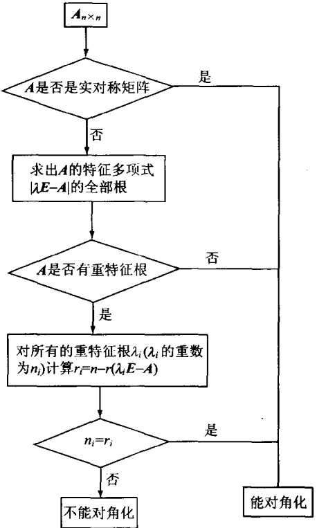

研究线性变换常归结为研究其关于一组基的矩阵；矩阵对角化旨在选择适当的基，使该矩阵化为对角矩阵。

# 5.1 特征值和特征向量
矩阵对角化具体说来可分成下述问题:

(1) n 阶方阵与对角矩阵相似的充分必要条件是什么？

(2) 如果 $n$ 阶方阵 $\mathbf{A}$ 能与对角矩阵 $\mathbf{\Lambda}$ 相似, 那么使得 $\mathbf{P}^{-1}\mathbf{A}\mathbf{P} = \mathbf{\Lambda}$ 的可逆矩阵 $\mathbf{P}$ 的结构如何? 如何求出?

(3) 如果  $P^{-1}AP$  为对角矩阵  $\Lambda$ ，则称  $\Lambda$  为 A 的相似标准形。此时对角矩阵  $\Lambda$  应有何种结构？

(4) 如果一个 $n$ 阶方阵 $\mathbf{A}$ 不能相似于对角矩阵, 那么与 $\mathbf{A}$ 相似的最简单矩阵是何种形式的?

为了阐明上述问题引入概念:

### **定义5.1.1** 设 A 为数域 P 上的 n 阶方阵, 如果存在数域 P 上的数  $\lambda_{0}$  和非零向量  $\xi$ , 使得  $A\xi = \lambda_{0}\xi$ , 则称  $\lambda_{0}$  为 A 的一个特征值(或特征根), 而  $\xi$  称为 A 的属于特征值  $\lambda_{0}$  的一个特征向量.

#### **例5.1.1** 设 $n$ 阶方阵

$$
\mathbf{A} = \left[ \begin{array}{c c c c c} a & b & b & \dots & b \\ b & a & b & \dots & b \\ b & b & a & \dots & b \\ \vdots & \vdots & \vdots & & \vdots \\ b & b & b & \dots & a \end{array} \right].
$$

在第1章行列式中我们就指出该矩阵的每行元素之和为常数 $a + (n - 1)b$ .利用此性质，取 $\xi = [1,1,\dots ,1]^{\mathrm{T}}$ ，则有

$$
\begin{array}{r l} \boldsymbol{A} \boldsymbol{\xi} & = \left[ \begin{array}{c c c c c} a & b & b & \dots & b \\ b & a & b & \dots & b \\ b & b & a & \dots & b \\ \vdots & \vdots & \vdots & & \vdots \\ b & b & b & \dots & a \end{array} \right] \left[ \begin{array}{c} 1 \\ 1 \\ 1 \\ \vdots \\ 1 \end{array} \right] = \left[ \begin{array}{c} a + (n - 1) b \\ a + (n - 1) b \\ a + (n - 1) b \\ \vdots \\ a + (n - 1) b \end{array} \right] \\ & = [ a + (n - 1) b ] \left[ \begin{array}{c} 1 \\ 1 \\ 1 \\ \vdots \\ 1 \end{array} \right]. \end{array}
$$

也就是说

$$
\boldsymbol{A} \boldsymbol{\xi} = [ a + (n - 1) b ] \boldsymbol{\xi},
$$

所以 $a + (n - 1)b$ 是 $\mathbf{A}$ 的一个特征值. $\xi$ 是 $\mathbf{A}$ 的属于特征值 $a + (n - 1)b$ 的特征向量.

由特征值,特征向量的定义就可推出如下性质.

### **性质5.1.1** （1）若  $\xi$  是 A 的特征向量，则  $\xi$  只能属于一个特征值.

(2) 属于特征值  $\lambda_{0}$  的特征向量有无穷多个.

**证** （1）设 $\xi$ 是 $A$ 的既属于特征值 $\lambda_{1}$，又属于特征值 $\lambda_{2}$ 的特征向量，则

$$
\boldsymbol{A} \boldsymbol{\xi} = \lambda_{1} \boldsymbol{\xi}, \quad \boldsymbol{A} \boldsymbol{\xi} = \lambda_{2} \boldsymbol{\xi},
$$

从而 $\lambda_1\xi = \lambda_2\xi$ ，移项得 $(\lambda_{1} - \lambda_{2})\pmb{\xi} = \pmb{O}$ .因 $\pmb{\xi}\neq \pmb{O}$ ，所以 $\lambda_1 = \lambda_2$ .这表明 $\pmb{\xi}$ 只能属于一个特征值.

(2) 设 $\xi$ 是 $A$ 的属于 $\lambda_0$ 的特征向量, 下证对数域 $P$ 中任意的 $k \neq 0$, $k\xi$ 也是 $A$ 的属于 $\lambda_0$ 的特征向量. 这是因为 $k\xi \neq O$, 且有

$$
\boldsymbol{A} (k \boldsymbol{\xi}) = k \boldsymbol{A} \boldsymbol{\xi} = k \lambda_{0} \boldsymbol{\xi} = \lambda_{0} (k \boldsymbol{\xi}).
$$

易推得当 $k_{1} \neq k_{2}$ 时有 $k_{1}\xi \neq k_{2}\xi$，故 $\mathbf{A}$ 的属于 $\lambda_0$ 的特征向量有无穷多个.

现在开始讨论问题(1),(2),(3),先回忆在3.3节中我们已经约定将n阶对角矩阵

$$
\boldsymbol{\Lambda} = \left[ \begin{array}{c c c c} \lambda_{1} & 0 & \dots & 0 \\ 0 & \lambda_{2} & \dots & 0 \\ \vdots & \vdots & & \vdots \\ 0 & 0 & \dots & \lambda_ {n} \end{array} \right]
$$

简记为  $\mathrm{diag}[\lambda_{1},\lambda_{2},\cdots,\lambda_{n}]$ ，故问题(1)可表述为:

$n$ 阶矩阵 $\mathbf{A}$ 能与一个对角矩阵 $\mathrm{diag}[\lambda_1,\lambda_2,\dots ,\lambda_n]$ 相似（$\mathbf{A}$ 能对角化）

$\Leftrightarrow$ 存在可逆矩阵 $\pmb{P}$ 使得 $P^{-1}AP = \mathrm{diag}[\lambda_1,\lambda_2,\dots ,\lambda_n]$

$\Leftrightarrow \mathbf{A}\mathbf{P} = \mathbf{P}\mathrm{diag}[\lambda_1,\lambda_2,\dots ,\lambda_n].$

若将矩阵 P 按列向量  $\alpha_{1}, \alpha_{2}, \cdots, \alpha_{n}$  分块表示为: $P = [\alpha_{1}, \alpha_{2}, \cdots, \alpha_{n}]$ ，因 P 为可逆矩阵，故  $\alpha_{1}, \alpha_{2}, \cdots, \alpha_{n}$  线性无关，上式即为

$$
\begin{array}{r l} \boldsymbol{A} \left[ \begin{array}{c c c c} \boldsymbol{\alpha} _{1} & \boldsymbol{\alpha} _{2} & \dots & \boldsymbol{\alpha} _ {n} \end{array} \right] & = \left[ \begin{array}{c c c c} \boldsymbol{\alpha} _{1} & \boldsymbol{\alpha} _{2} & \dots & \boldsymbol{\alpha} _ {n} \end{array} \right] \operatorname{diag} \left[ \lambda_{1}, \lambda_{2}, \dots , \lambda_ {n} \right] \\ \left[ \begin{array}{c c c c} \boldsymbol{A} \boldsymbol{\alpha} _{1} & \boldsymbol{A} \boldsymbol{\alpha} _{2} & \dots & \boldsymbol{A} \boldsymbol{\alpha} _ {n} \end{array} \right] & = \left[ \begin{array}{c c c c} \lambda_{1} \boldsymbol{\alpha} _{1} & \lambda_{2} \boldsymbol{\alpha} _{2} & \dots & \lambda_ {n} \boldsymbol{\alpha} _ {n} \end{array} \right] \\ & \Leftrightarrow \boldsymbol{A} \boldsymbol{\alpha} _ {i} = \lambda_ {i} \boldsymbol{\alpha} _ {i}, i = 1, 2, \dots , n. \end{array}\tag{5.1.1}
$$

利用特征值和特征向量的概念我们可将(5.1.1)表述为下述重要定理.

### **定理5.1.1** 设 A 为 n 阶方阵, 则 A 能与对角矩阵相似的充要条件为 A 有 n 个线性无关的特征向量. 若 A 有 n 个线性无关的特征向量  $\xi_{1}, \xi_{2}, \cdots, \xi_{n}$ , 可记  $P = [\xi_{1}, \xi_{2}, \cdots, \xi_{n}]$ , 则 P 是一个可逆矩阵, 且使得

$$
\boldsymbol{P} ^{-1} \boldsymbol{A} \boldsymbol{P} = \mathrm{diag} \left[ \lambda_{1}, \lambda_{2}, \dots , \lambda_ {n} \right],
$$

此处  $\lambda_{1},\lambda_{2},\cdots,\lambda_{n}$  是 A 的特征值,  $\xi_{i}(i=1,2,\cdots,n)$  是属于  $\lambda_{i}$  的特征向量.

### **定理5.1.1**回答了前述四个问题中的前三个.

(1) $n$ 阶方阵 $\mathbf{A}$ 能与对角矩阵 $\mathbf{\Lambda}$ 相似的充要条件为 $\mathbf{A}$ 有 $n$ 个线性无关的特征向量.

(2) 如 n 阶方阵 A 能与对角矩阵 A 相似, 则 A 有 n 个线性无关的特征向量  $\xi_{1}, \xi_{2}, \cdots, \xi_{n}$ . 将  $\xi_{1}, \xi_{2}, \cdots, \xi_{n}$  作为列向量组成矩阵 P, 即

$$
\boldsymbol{P} = \left[ \begin{array}{c c c c} \boldsymbol{\xi} _{1} & \boldsymbol{\xi} _{2} & \dots & \boldsymbol{\xi} _ {n} \end{array} \right],
$$

则 $\pmb{P}$ 是可逆矩阵，且 $P^{-1}AP = \Lambda$ .所以使得 $P^{-1}AP = \Lambda$ 的可逆矩阵 $\pmb{P}$ 是由 $\mathbf{A}$ 的 $n$ 个线性无关的特征向量作为列向量组成的.

(3) 若 $P^{-1}AP = \Lambda$ ，其中

$$
\boldsymbol{P} = \left[ \begin{array}{c c c c} \boldsymbol{\xi} _{1} & \boldsymbol{\xi} _{2} & \dots & \boldsymbol{\xi} _ {n} \end{array} \right], \quad \boldsymbol{\Lambda} = \operatorname{diag} \left[ \begin{array}{c c c c} \lambda_{1}, \lambda_{2}, \dots , \lambda_ {n} \end{array} \right],
$$

则  $A\xi_{i}=\lambda_{i}\xi_{i}(i=1,2,\cdots,n)$ . 所以此时对角矩阵 A 的主对角线上元素  $\lambda_{1},\lambda_{2},\cdots,\lambda_{n}$  均是 A 的特征值. 它们排列的次序与构成 P 的特征向量  $\xi_{1},\xi_{2},\cdots,\xi_{n}$  的次序相对应, 即  $\lambda_{i}$  对应于  $\xi_{i}(i=1,2,\cdots,n)$ .

这样矩阵 $\mathbf{A}$ 能否对角化问题就在于 $\mathbf{A}$ 是否有 $n$ 个线性无关的特征向量.为此我们首先把 $\mathbf{A}$ 的所有特征向量全确定下来，然后再确定哪些是线性无关的.

### **定义5.1.2** 设  $A = [a_{ij}]_{n \times n}$  是数域 P 上 n 阶方阵,  $\lambda$  是一个变量, 矩阵  $\lambda E - A$  的行列式

$$
\mid \lambda \boldsymbol{E} - \boldsymbol{A} \mid = \left| \begin{array}{c c c c} \lambda - a _{11} & - a _{12} & \dots & - a _ {1 n} \\ - a _{21} & \lambda - a _{22} & \dots & - a _ {2 n} \\ \vdots & \vdots & & \vdots \\ - a _ {n 1} & - a _ {n 2} & \dots & \lambda - a _ {n n} \end{array} \right|
$$

称为 $\mathbf{A}$ 的特征多项式，记为 $f(\lambda)$. 它是数域 $P$ 上变量 $\lambda$ 的一个 $n$ 次多项式.

现开始讨论确定方阵的特征值问题. 设 $\xi \neq O$ 是 $n$ 阶方阵 $A$ 的属于 $\lambda_0$ 的特征向量, 于是有 $A\xi = \lambda_0\xi$, 即 $(\lambda_0E - A)\xi = O$, 从而线性方程组

$$
(\lambda_{0} \boldsymbol{E} - \boldsymbol{A}) \boldsymbol{X} = \boldsymbol{O}\tag{5.1.2}
$$

有非零解 $\xi$

反之，若(5.1.2)有非零解 $\pmb{\xi}$，则 $(\lambda_0E - A)\pmb{\xi} = \pmb{O}$，从而 $A\xi = \lambda_0\xi$。据定义5.1.1知，向量 $\pmb{\xi}$ 就是 $A$ 的属于 $\lambda_0$ 的特征向量。

据上所述,我们有

$\xi \neq O$ 是 $A$ 的属于 $\lambda_0$ 的特征向量

$$
\begin{array}{r l} & {\Leftrightarrow \text{齐次线性方程组} (\lambda_{0} \pmb{E} - \pmb{A}) \pmb{X} = \pmb{O} \text{有非零解} \pmb{\xi}} \\ & {\Leftrightarrow | \lambda_{0} \pmb{E} - \pmb{A} | = 0.} \end{array}
$$

注意到 $|\lambda_0\pmb{E} - \pmb{A}| = f(\lambda_0)$ ，故

$$
| \lambda_{0} \pmb{E} - \pmb{A} | = 0 \Leftrightarrow \lambda_{0} \text{是} f (\lambda) \text{的一个根}.
$$

综上所述可得下述重要定理.

### **定理5.1.2**（1）$\lambda_0$ 是 $\mathbf{A}$ 的一个特征值的充要条件为 $\lambda_0$ 是 $\mathbf{A}$ 的特征多项式 $f(\lambda)$ 在数域 $P$ 中的一个根，即 $|\lambda_0\mathbf{E} - \mathbf{A}| = 0$

(2) 若 $\lambda_0$ 是 $\mathbf{A}$ 的一个特征值, 则属于 $\lambda_0$ 的特征向量的全体是齐次线性方程组 $(\lambda_0\mathbf{E} - \mathbf{A})\mathbf{X} = \mathbf{O}$ 的所有非零解.

#### **例5.1.2** 求矩阵 A 的特征多项式和全部特征值, 这里

$$
\boldsymbol{A} = \left[ \begin{array}{c c c c c} 0 & b & b & \dots & b \\ b & 0 & b & \dots & b \\ b & b & 0 & \dots & b \\ \vdots & \vdots & \vdots & & \vdots \\ b & b & b & \dots & 0 \end{array} \right].
$$

解

$$
\mid \lambda \boldsymbol{E} - \boldsymbol{A} \mid = \left| \begin{array}{c c c c c} \lambda & - b & - b & \dots & - b \\ - b & \lambda & - b & \dots & - b \\ - b & - b & \lambda & \dots & - b \\ \vdots & \vdots & \vdots & & \vdots \\ - b & - b & - b & \dots & \lambda \end{array} \right|.
$$

回忆1.3节中例1.3.5的注记知

$$
\mid \lambda \boldsymbol{E} - \boldsymbol{A} \mid = [ \lambda - (n - 1) b ] (\lambda + b) ^ {n - 1}.
$$

所以 $\mathbf{A}$ 的特征值为: $(n - 1)b, - b(n - 1$ 重根).

利用定理5.1.2确定 $\mathbf{A}$ 的全部特征值和特征向量的方法可归结为如下步骤:

1. 求出 A 的特征多项式  $f(\lambda)=|\lambda E-A|$  在数域 P 中的全部根  $\lambda_{1},\lambda_{2},\cdots,\lambda_{s}$

据定理5.1.2, 它们就是 $\mathbf{A}$ 的全部特征值.

2. 把求出的特征值 $\lambda_{i}$ 逐个代入对应的齐次线性方程组

$$
(\lambda_ {i} \boldsymbol{E} - \boldsymbol{A}) \boldsymbol{X} = \boldsymbol{O}, \quad i = 1, 2, \dots , s.
$$

求出一组基础解系为  $\xi_{i1}, \xi_{i2}, \cdots, \xi_{ir_{i}}$ . 据定理 5.1.2 属于  $\lambda_{i}$  的全体特征向量可表为

$$
\boldsymbol{\xi} _ {i} = t _{1} \boldsymbol{\xi} _ {i 1} + t _{2} \boldsymbol{\xi} _ {i 2} + \dots + t _ {r _ {i}} \boldsymbol{\xi} _ {i r _ {i}},
$$

其中 $t_1, t_2, \dots, t_{r_i}$ 为不全为零的一组任意常数，这表明属于 $\lambda_i$ 的特征向量加上零向量构成齐次线性方程组 $(\lambda_i E - A) X = O$ 的全部解向量（即解空间 $W_{\lambda_i}$），这也说明属于 $\lambda_i$ 的特征向量有无穷多个。

3.  $\xi_{1}, \xi_{2}, \cdots, \xi_{s}$  就是 A 的全部特征向量, 这是因为 A 的任何一个特征向量  $\xi$  必属于某一个特征值, 比如说属于  $\lambda_{i} (1 \leqslant i \leqslant s)$ , 而属于  $\lambda_{i}$  的全体特征向量可表为  $\xi_{i}$ , 所以  $\xi_{i}$  的某个表达式就表示了特征向量  $\xi$ .

#### **例5.1.3** 设

$$
\boldsymbol{A} = \left[ \begin{array}{c c c} - 1 & 1 & 0 \\ - 4 & 3 & 0 \\ 1 & 0 & 2 \end{array} \right],
$$

求出 $\mathbf{A}$ 的全部特征值和特征向量.

解 先求出矩阵 $\mathbf{A}$ 的特征多项式

$$
f (\lambda) = | \lambda \boldsymbol{E} - \boldsymbol{A} | = \left| \begin{array}{c c c} \lambda + 1 & - 1 & 0 \\ 4 & \lambda - 3 & 0 \\ - 1 & 0 & \lambda - 2 \end{array} \right| = (\lambda - 2) (\lambda - 1) ^{2}.
$$

所以 $\mathbf{A}$ 的全部特征值为 $\lambda_1 = 2, \lambda_2 = \lambda_3 = 1$.

然后把 $\lambda_1 = 2$ 代入 $(\lambda_{1}\pmb{E} - \pmb{A})\pmb{X} = \pmb{O}$ ，得

$$
\left[ \begin{array}{c c c} 3 & - 1 & 0 \\ 4 & - 1 & 0 \\ - 1 & 0 & 0 \end{array} \right] \left[ \begin{array}{c} x _{1} \\ x _{2} \\ x _{3} \end{array} \right] = \left[ \begin{array}{c} 0 \\ 0 \\ 0 \end{array} \right].
$$

因 $r(\lambda_1\boldsymbol{E} - \boldsymbol{A}) = 2$ 知，该方程组基础解系所含向量个数为1，解得一个基础解系为$\pmb{\xi}_{1} = [0,0,1]^{\mathrm{T}}$ .故属于特征值2的全部特征向量为 $k\xi_{1},0\neq k\in P$

再把 $\lambda_{2} = \lambda_{3} = 1$ 代入 $(\lambda_{2}\pmb{E} - \pmb{A})\pmb{X} = \pmb{O}$ ，得

$$
\left[ \begin{array}{c c c} 2 & - 1 & 0 \\ 4 & - 2 & 0 \\ - 1 & 0 & - 1 \end{array} \right] \left[ \begin{array}{c} x _{1} \\ x _{2} \\ x _{3} \end{array} \right] = \left[ \begin{array}{c} 0 \\ 0 \\ 0 \end{array} \right].
$$

因 $r(\lambda_2\mathbf{E} - \mathbf{A}) = 2$ 知，该方程组基础解系所含向量个数为1，解得一个基础解系为$\pmb{\xi}_{2} = [1,2, - 1]^{\mathrm{T}}.$ 故属于特征值1的全部特征向量为 $k\xi_{2},0\neq k\in P$

\* 例5.1.4 设 $\mathbf{A} = \begin{bmatrix} 0 & 1 & 0 \\ -1 & 0 & 0 \\ 3 & 2 & 1 \end{bmatrix}$, 求出 $\mathbf{A}$ 的全部特征值和特征向量.

解

$$
f (\lambda) = | \lambda \boldsymbol{E} - \boldsymbol{A} | = \left| \begin{array}{c c c} \lambda & - 1 & 0 \\ 1 & \lambda & 0 \\ - 3 & - 2 & \lambda - 1 \end{array} \right| = (\lambda - 1) (\lambda^{2} + 1).
$$

如果把 $\mathbf{A}$ 看作实数域上的矩阵，据定理5.1.2特征值只能取 $f(\lambda)$ 的实根，故此时 $\mathbf{A}$ 只有特征值 $\lambda_1 = 1$。若把 $\mathbf{A}$ 看成复数域上的矩阵，则特征值可以取 $f(\lambda)$ 的复根，此时 $\mathbf{A}$ 的特征值就是 $\lambda_1 = 1, \lambda_2 = i, \lambda_3 = -i$。

把 $\lambda_{1} = 1$ 代入 $(\lambda_{1}\pmb{E} - \pmb{A})\pmb{X} = \pmb{O}$ ，解得一个基础解系 $\pmb{\xi}_{1} = [0,0,1]^{\mathrm{T}}$ ，所以 $\mathbf{A}$ 的属于特征值1的全部特征向量为 $k[0,0,1]^{\mathrm{T}}, 0 \neq k \in \mathbb{R}$.

由上述知, 若把 $\mathbf{A}$ 看作实数域上的矩阵, 则 $\mathbf{A}$ 的全部特征值为 1 , 属于 1 的全部特征向量为 $k[0,0,1]^{\mathrm{T}}, 0 \neq k \in \mathbb{R}$.

如果把 $\mathbf{A}$ 看作复数域上的矩阵，则 $\mathbf{A}$ 还有特征值 $\lambda_2 = i, \lambda_3 = -i$.

再把 $\lambda_{2} = i$ 代入 $(\lambda_{2}\pmb{E} - \pmb{A})\pmb{X} = \pmb{O}$ ，解得一个基础解系

$$
\boldsymbol{\xi} _{2} = [ 1 - 5 i, 5 + i, - 1 3 ] ^ {\mathrm{T}},
$$

所以 $\mathbf{A}$ 的属于特征值 $i$ 的全部特征向量为 $t[1 - 5i,5 + i, - 13]^{\mathrm{T}},0\neq t\in \mathbf{C}$

再把 $\lambda_3 = -i$ 代入 $(\lambda_3E - A)X = O$ ，解得一个基础解系

$$
\xi_{3} = [ 1 + 5 i, 5 - i, - 1 3 ] ^ {\mathrm{T}},
$$

所以 $\mathbf{A}$ 的属于特征值 $-i$ 的全部特征向量为 $t[1 + 5i, 5 - i, -13]^{\mathrm{T}}, 0 \neq t \in \mathbf{C}$.

由上述知,若把 A 看作复数域上的矩阵,则 A 的全部特征值为 1,i,-i.

属于1的全部特征向量为 $k[0,0,1]^{\mathrm{T}}$

属于 $i$ 的全部特征向量为 $t[1 - 5i, 5 + i, -13]^{\mathrm{T}}$,

属于 $-i$ 的全部特征向量为 $t[1 + 5i, 5 - i, -13]^{\mathrm{T}}$,

其中 $k, t$ 为任意非零的复数.

## 习题5.1
1. 设 A, B 均为 n 阶方阵, 则下述命题正确的是( ), 且说明理由.

(A) 若 $\mathbf{A}$ 与 $\pmb{B}$ 等价, 则 $\mathbf{A}$ 与 $\pmb{B}$ 必相似. (B) 若 $\mathbf{A}$ 与 $\pmb{B}$ 相似, 则 $\mathbf{A}$ 与 $\pmb{B}$ 必等价.

(C) 若 $r(\mathbf{A}) = r(\mathbf{B})$，则 $\mathbf{A}$ 与 $\mathbf{B}$ 必相似. (D) 若 $|\mathbf{A}| = |\mathbf{B}|$，则 $\mathbf{A}$ 与 $\mathbf{B}$ 必相似.

2. 设

$$
\boldsymbol{A} = \left[ \begin{array}{l l l} 1 & 2 & 0 \\ 2 & 3 & 0 \\ 0 & 0 & 4 \end{array} \right], \quad \boldsymbol{B} = \left[ \begin{array}{l l l} 1 & 2 & 0 \\ 2 & 3 & 0 \\ 0 & 0 & 0 \end{array} \right], \quad \boldsymbol{C} = \left[ \begin{array}{l l l} 1 & 2 & 0 \\ 2 & 3 & 0 \\ 0 & 0 & 2 \end{array} \right],
$$

则下述命题正确的是( ),且说明理由.

(A) A 与 B 等价,且 A 与 B 相似.

(B) A 与 C 等价, 且 A 与 C 相似.

(C) A 与 C 等价,但 A 与 C 不相似.

(D) A 与 B 不等价,但 A 与 B 相似.

3. 设 $\mathbf{A} = \boldsymbol{\xi}\boldsymbol{\eta}^{\mathrm{T}}$ ，其中

$$
\boldsymbol{\xi} = [ x _{1}, x _{2}, \dots , x _ {n} ] ^ {\mathrm{T}} \neq \boldsymbol{O}, \quad \boldsymbol{\eta} = [ y _{1}, y _{2}, \dots , y _ {n} ] ^ {\mathrm{T}} \neq \boldsymbol{O}.
$$

求证: $\xi$ 是 $A$ 的特征向量，并指出其对应的特征值.

4. 设 $\lambda_0$ 是 $n$ 阶方阵 $\mathbf{A}$ 的一个特征值. 记 $\mathbf{A}$ 的属于 $\lambda_0$ 的特征向量的全体及零向量为

$$
\boldsymbol{W} _ {\lambda_{0}} = \{\boldsymbol{\xi} \in P ^ {n} \mid \boldsymbol{A} \boldsymbol{\xi} = \lambda_{0} \boldsymbol{\xi} \}.
$$

**证明** (1) 若 $\pmb{\xi}_1, \pmb{\xi}_2 \in W_{\lambda_0}$, 则 $\pmb{\xi}_1 + \pmb{\xi}_2 \in W_{\lambda_0}$.

(2) 若 $\xi_1 \in W_{\lambda_0}$, 则对任意的 $k \in P$ 有 $k\xi_1 \in W_{\lambda_0}$.

(3) 由(1)，(2)导出 $W_{\lambda_0}$ 为 $\pmb{P}^n$ 的一个子空间，称为属于 $\lambda_0$ 的特征子空间。特征子空间 $W_{\lambda_0}$ 中任意非零向量都是 $\pmb{A}$ 的属于 $\lambda_0$ 的特征向量。

5. 若方阵 $\mathbf{A}$ 有一个特征值为 -1, 则 $|\mathbf{A} + \mathbf{E}| =$ \_\_\_\_, 且说明理由.

6. 命题:“若 $\frac{1}{2}$ 不是方阵 $A$ 的特征值，则 $E - 2A$ 为可逆矩阵”对不对？为什么？

7. 求出下列矩阵的全部特征值和特征向量

(1)

$$
\left[ \begin{array}{c c c} 1 & 0 & 0 \\ - 2 & 5 & - 2 \\ - 2 & 4 & - 1 \end{array} \right];
$$

(2)

$$
\left[ \begin{array}{c c c} 4 & - 5 & 2 \\ 5 & - 7 & 3 \\ 6 & - 9 & 4 \end{array} \right];
$$

$$
\left[ \begin{array}{c c c} - 1 & 3 & - 1 \\ - 3 & 5 & - 1 \\ - 3 & 3 & 1 \end{array} \right];
$$

(3)

(4)

$$
\left[ \begin{array}{c c c} 1 & - 3 & 4 \\ 4 & - 7 & 8 \\ 6 & - 7 & 7 \end{array} \right];
$$

(5)

$$
\left[ \begin{array}{c c c c} 5 & 3 & 1 & 1 \\ - 3 & - 1 & 1 & - 1 \\ 0 & 0 & 1 & 0 \\ 0 & 0 & 2 & 2 \end{array} \right];
$$

(6)

$$
\left[ \begin{array}{c c c c} 0 & 0 & 0 & 1 \\ 0 & 0 & 1 & 0 \\ 0 & 1 & 0 & 0 \\ 1 & 0 & 0 & 0 \end{array} \right].
$$

# 5.2 矩阵对角化
由定理5.1.1知，$n$ 阶方阵 $\mathbf{A}$ 能否对角化关键在于 $\mathbf{A}$ 能否有 $n$ 个线性无关的特征向量，故需讨论特征向量中哪一些是线性无关的.

### **定理5.2.1** 方阵 $A$ 的属于不同特征值的特征向量是线性无关的.

**证** 设  $\lambda_{1}, \lambda_{2}, \cdots, \lambda_{s}$  是方阵 A 的互异特征值, 它们对应的特征向量分别为  $\xi_{1}, \xi_{2}, \cdots, \xi_{s}$ . 现对 s 用数学归纳法来证明结论.

当 $s = 1$ ，因 $\pmb{\xi}_1\neq \pmb{O}$ ，故 $\pmb{\xi}_{1}$ 是线性无关的.

设 $s - 1$ 时定理成立，下面考察 $s$ 的情况.设有

$$
k _{1} \boldsymbol{\xi} _{1} + k _{2} \boldsymbol{\xi} _{2} + \dots + k _ {s - 1} \boldsymbol{\xi} _ {s - 1} + k _ {s} \boldsymbol{\xi} _ {s} = \boldsymbol{O}.\tag{5.2.1}
$$

在(5.2.1)式两边同时用 $\lambda_{s}$ 作数乘，得

$$
k _{1} \lambda_ {s} \boldsymbol{\xi} _{1} + k _{2} \lambda_ {s} \boldsymbol{\xi} _{2} + \dots + k _ {s - 1} \lambda_ {s} \boldsymbol{\xi} _ {s - 1} + k _ {s} \lambda_ {s} \boldsymbol{\xi} _ {s} = \boldsymbol{O}.\tag{5.2.2}
$$

在(5.2.1)式两边同时左乘矩阵 $\mathbf{A}$，注意到 $A\xi_{i} = \lambda_{i}\xi_{i}$，有

$$
k _{1} \lambda_{1} \boldsymbol{\xi} _{1} + k _{2} \lambda_{2} \boldsymbol{\xi} _{2} + \dots + k _ {s - 1} \lambda_ {s - 1} \boldsymbol{\xi} _ {s - 1} + k _ {x} \lambda_ {x} \boldsymbol{\xi} _ {s} = \boldsymbol{O}.\tag{5.2.3}
$$

将(5.2.2)式减去(5.2.3)式,得

$$
k _{1} \left(\lambda_ {s} - \lambda_{1}\right) \boldsymbol{\xi} _{1} + k _{2} \left(\lambda_ {s} - \lambda_{2}\right) \boldsymbol{\xi} _{2} + \dots + k _ {s - 1} \left(\lambda_ {s} - \lambda_ {s - 1}\right) \boldsymbol{\xi} _ {s - 1} = \boldsymbol{O}.
$$

据归纳法假设  $\xi_{1}, \xi_{2}, \cdots, \xi_{s-1}$  线性无关，于是

$$
k _ {i} (\lambda_ {s} - \lambda_ {i}) = 0, \quad i = 1, 2, \dots , s - 1.
$$

由题设  $\lambda_{s}\neq\lambda_{i}(i=1,2,\cdots,s-1)$ ，故得

$$
k _{1} = k _{2} = \dots = k _ {s - 1} = 0,
$$

将此结果代入(5.2.1)式, 得 $k_{s} \xi_{s} = O$. 因 $\xi_{s} \neq O$, 从而 $k_{s} = 0$. 这就证明了 $\xi_{1}, \xi_{2}, \cdots, \xi_{s}$ 线性无关. 至此根据数学归纳法原理, 定理得证.

据此定理, 若 $n$ 阶方阵 $\mathbf{A}$ 有 $n$ 个互异的特征值 $\lambda_1, \lambda_2, \cdots, \lambda_n$, 则属于特征值 $\lambda_i (i=1,2,\cdots,n)$ 的特征向量 $\xi_i (i=1,2,\cdots,n)$ 线性无关, 从而 $\mathbf{A}$ 有 $n$ 个线性无关的特征向量. 据定理 5.1.1 知, 若记 $\boldsymbol{P} = [\xi_1 \quad \xi_2 \quad \cdots \quad \xi_n]$, 则 $\boldsymbol{P}$ 是一个可逆矩阵, 且有 $\boldsymbol{P}^{-1} \boldsymbol{A} \boldsymbol{P} = \text{diag} [\lambda_1, \lambda_2, \cdots, \lambda_n]$, 从而 $\mathbf{A}$ 与对角矩阵 $\text{diag}[\lambda_1, \lambda_2, \cdots, \lambda_n]$ 相似. 于是就有下述判别法.

推论(判别法) n 阶方阵 A 若有 n 个互异特征值  $\lambda_{1}, \lambda_{2}, \cdots, \lambda_{n}$ ，则 A 与对角矩阵  $\mathrm{diag}[\lambda_{1}, \lambda_{2}, \cdots, \lambda_{n}]$  相似.

#### **例5.2.1** 对例5.1.3中的矩阵 $A$ 略作变动得到

$$
\boldsymbol{B} = \left[ \begin{array}{c c c} - 1 & 1 & 0 \\ 0 & 3 & 0 \\ 1 & 0 & 2 \end{array} \right],
$$

容易求得 $f(\lambda) = |\lambda E - B| = (\lambda + 1)(\lambda - 2)(\lambda - 3)$. 所以 $\pmb{B}$ 有3个相异的特征根 $\lambda_1 = -1, \lambda_2 = 2, \lambda_3 = 3$.

将 $\lambda_{1} = -1$ 代入 $(\lambda_1\pmb{E} - \pmb{B})\pmb{X} = \pmb{O}$ 可解得属于 $\lambda_1 = -1$ 的全部特征向量为

$$
k \boldsymbol{\xi} _{1} = k [ 3, 0, - 1 ] ^ {\mathrm{T}}, \quad k \neq 0.
$$

将 $\lambda_{2} = 2$ 代入 $(\lambda_{2}\pmb{E} - \pmb{B})\pmb{X} = \pmb{O}$ 可解得属于 $\lambda_{2} = 2$ 的全部特征向量为

$$
k \boldsymbol{\xi} _{2} = k [ 0, 0, 1 ] ^ {\mathrm{T}}, \quad k \neq 0.
$$

将 $\lambda_3 = 3$ 代入 $(\lambda_{3}E - B)\mathbf{X} = \mathbf{O}$ 可解得属于 $\lambda_3 = 3$ 的全部特征向量为

$$
k \xi_{3} = k [ 1, 4, 1 ] ^ {\mathrm{T}}, \quad k \neq 0.
$$

据定理5.2.1知，$\xi_1, \xi_2, \xi_3$ 线性无关。3阶方阵 $\pmb{B}$ 有3个线性无关的特征向量，所以 $\pmb{B}$ 能对角化。令 $\pmb{P} = [\xi_1, \xi_2, \xi_3]$，有 $\pmb{P}^{-1}\pmb{A}\pmb{P} = \mathrm{diag}[-1, 2, 3]$。

> **注记**：本判别法只是 $\mathbf{A}$ 与对角矩阵相似的一个充分性条件, 而不是必要条件. 下文就有例子表明一个方阵的特征值如果有重根可能与对角矩阵相似, 也可能

不与对角矩阵相似.

上述注记表明当方阵 $\mathbf{A}$ 的特征值有重根时，用本判别法无法判别，为了解决此问题，需要将定理5.2.1推广.

### **定理5.2.2** 若  $\lambda_{1}, \lambda_{2}, \cdots, \lambda_{s}$  是方阵 A 的互异的特征值，且  $\xi_{i1}, \xi_{i2}, \cdots, \xi_{ir_{i}}$  是属于特征值  $\lambda_{i} (i = 1, 2, \cdots, s)$  的线性无关的特征向量，则  $\xi_{11}, \cdots, \xi_{1r_{1}}, \cdots, \xi_{s1}, \cdots, \xi_{sr_{s}}$  线性无关.

**证** 对 $s$ 用数学归纳法, 用类似于定理5.2.1推理证得.

回忆我们求方阵 A 的全部特征值和特征向量时, 所用的方法是: 求出 A 的所有互异的特征值为  $\lambda_{1}, \lambda_{2}, \cdots, \lambda_{s}$ , 将  $\lambda_{i} (i = 1, 2, \cdots, s)$  逐个代入对应线性方程组  $(\lambda_{i} E - A) X = O, i = 1, 2, \cdots, s$ . 求出一组基础解系 (即解空间  $W_{\lambda_{i}}$  的一组基)  $\xi_{i1}, \xi_{i2}, \cdots, \xi_{ir_{i}}$ . 现据定理 5.2.2 可判定

$$
\boldsymbol{\xi} _{11}, \dots , \boldsymbol{\xi} _ {1 r _{1}}, \boldsymbol{\xi} _{21}, \dots , \boldsymbol{\xi} _ {2 r _{2}}, \dots , \boldsymbol{\xi} _ {s 1}, \dots , \boldsymbol{\xi} _ {s r _ {s}}\tag{5.2.4}
$$

是一组线性无关的特征向量. 我们断言(5.2.4)是 A 的所有特征向量组成的向量组中的极大线性无关组. 这是因为 A 的任何一个特征向量  $\xi$  必属于某个特征值  $\lambda_{i}$  ( $1 \leqslant i \leqslant s$ ), 从而  $\xi$  可经基础解系  $\xi_{i1}, \xi_{i2}, \cdots, \xi_{ir_{i}}$  线性表示. 这表明

$$
\xi_{11}, \dots , \xi_ {1 r _{1}}, \dots , \xi_ {i 1}, \dots , \xi_ {i r _ {i}}, \dots , \xi_ {s 1}, \dots , \xi_ {s r _ {s}}, \xi
$$

线性相关.

将此结论和定理5.1.1结合起来可有下述定理.

### **定理5.2.3** 设 n 阶方阵 A 的互异的特征值的全体为  $\lambda_{1}, \lambda_{2}, \cdots, \lambda_{s}$ ，且将  $\lambda_{i} (i=1,2,\cdots,s)$  逐个代入对应线性方程组  $(\lambda_{i}\boldsymbol{E}-\boldsymbol{A})\boldsymbol{X}=\boldsymbol{O}(i=1,2,\cdots,s)$ ，求得一组基础解系（即解空间  $W_{\lambda_{i}}$  的一组基）为  $\xi_{i1}, \xi_{i2}, \cdots, \xi_{ir_{i}}$ ，则

(1) A 与对角矩阵相似的充要条件为: $r_{1} + r_{2} + \cdots + r_{s} = n$.

(2) 当  $r_{1} + r_{2} + \cdots + r_{s} = n$  时, A 有 n 个线性无关的特征向量  $\xi_{1}, \xi_{2}, \cdots, \xi_{n}$ ，若令  $P = [\xi_{1}, \xi_{2}, \cdots, \xi_{n}]$ ，则有  $P^{-1} AP = diag[\lambda_{1}, \lambda_{2}, \cdots, \lambda_{n}]$ ，其中  $\lambda_{i} (i = 1, 2, \cdots, n)$  恰为特征向量  $\xi_{i}$  所属的特征值.

#### **例5.2.2** 判别矩阵

$$
\mathbf{A} = \left[ \begin{array}{c c c} - 1 & 1 & 0 \\ - 4 & 3 & 0 \\ 1 & 0 & 2 \end{array} \right]
$$

能否与对角矩阵相似.

解 $\mathbf{A}$ 即为例5.1.3中的矩阵 $\mathbf{A}$. 据例5.1.3知, $\mathbf{A}$ 有两个相异特征值 $\lambda_{1} = 2, \lambda_{2} = 1$ (二重), 所对应的线性方程组的基础解系所含向量个数 $r_{1} = 1, r_{2} = 1$. 因 $r_{1} + r_{2} = 2 < 3$, 所以 $\mathbf{A}$ 不能与对角矩阵相似.

#### **例5.2.3** 判别矩阵

$$
\mathbf{A} = \left[ \begin{array}{l l l} 1 & 2 & 2 \\ 2 & 1 & 2 \\ 2 & 2 & 1 \end{array} \right]
$$

能否与对角矩阵相似,如能则写出可逆矩阵 P 使  $P^{-1}AP$  为对角矩阵.

解 先解 $\mathbf{A}$ 的特征多项式

$$
f (\lambda) = \left| \lambda \boldsymbol{E} - \boldsymbol{A} \right| = \left| \begin{array}{c c c} \lambda - 1 & - 2 & - 2 \\ - 2 & \lambda - 1 & - 2 \\ - 2 & - 2 & \lambda - 1 \end{array} \right| = (\lambda - 5) (\lambda + 1) ^{2},
$$

故 $\mathbf{A}$ 的特征值为 $\lambda_1 = 5, \lambda_2 = -1$ (二重).

然后以 $\lambda_{1} = 5$ 代入齐次线性方程组 $(\lambda_{1}\pmb{E} - \pmb{A})\pmb{X} = \pmb{O}$ ，解得一个基础解系为$\pmb{\xi}_1 = [1,1,1]^{\mathrm{T}}$ 故属于特征值5的特征向量为 $k_{1}\pmb{\xi}_{1}$ ，其中 $k_{1}\neq 0$

再以 $\lambda_{2} = -1$ 代入齐次线性方程组 $(\lambda_{2}\pmb{E} - \pmb{A})\pmb{X} = \pmb{O}$ ，解得一个基础解系为$\pmb{\xi}_2 = [1,0, - 1]^{\mathrm{T}},\pmb{\xi}_3 = [0,1, - 1]^{\mathrm{T}}.$ 故属于特征值-1的特征向量为 $k_{2}\pmb{\xi}_{2} + k_{3}\pmb{\xi}_{3}$ 其中 $k_{2},k_{3}$ 不同时为零.

这表明: $r_{1}=1, r_{2}=2$ 。由  $r_{1}+r_{2}=3=A$  的阶数，利用定理 5.2.3 知，A 能与对角矩阵相似，若令

$$
\boldsymbol{P} = \left[ \begin{array}{l l l} \boldsymbol{\xi} _{1} & \boldsymbol{\xi} _{2} & \boldsymbol{\xi} _{3} \end{array} \right] = \left[ \begin{array}{c c c} 1 & 1 & 0 \\ 1 & 0 & 1 \\ 1 & - 1 & - 1 \end{array} \right],
$$

则有 $\pmb{P}^{-1}\pmb{A}\pmb{P} = \mathrm{diag}[\lambda_1,\lambda_2,\lambda_3] = \mathrm{diag}[5, - 1, - 1].$

从上述两例可以看出一个方阵 $\mathbf{A}$ 能否对角化与它的特征根中重根 $\lambda_0$ 的重数与所对应的线性方程组 $(\lambda_0\boldsymbol{E} - \boldsymbol{A})\boldsymbol{X} = \boldsymbol{O}$ 的基础解系所含向量的个数（即解空间$W_{\lambda_0}$ 的维数）有密切关系，为了阐明这种关系，我们介绍一个性质，并由此性质得出判别矩阵对角化的新定理.

### **性质5.2.1** 设 $\lambda_0$ 是方阵 $A$ 的 $k$ 重特征根. 则齐次线性方程组

$$
(\lambda_{0} \boldsymbol{E} - \boldsymbol{A}) \boldsymbol{X} = \boldsymbol{O}
$$

的基础解系所含向量个数(即  $\dim W_{\lambda_{0}} \leqslant k$ .

**证明** 参见文献[1],303页:$\lambda_0$ 的特征子空间 $W_{\lambda_0}$ 的维数不能大于 $\lambda_0$ 的重数.

这性质首先表明若  $\lambda_{0}$  为单根，则必有线性方程组  $(\lambda_{0}\boldsymbol{E}-\boldsymbol{A})\boldsymbol{X}=\boldsymbol{O}$  的基础解系所含向量个数为 1. 其次，若 A 的全部相异特征根为  $\lambda_{1},\lambda_{2},\cdots,\lambda_{s}$ ，它们的重数相应为  $n_{1},n_{2},\cdots,n_{s}$ ，则有

$(\lambda_{i}E - A)X = O$ 的基础解系所含向量个数 $= r_i \leqslant n_i, \quad i = 1,2,\dots ,s.$

$$
n _{1} + n _{2} + \dots + n _ {s} = n,
$$

故

$$
r _{1} + r _{2} + \dots + r _ {s} = n \Leftrightarrow r _ {i} = n _ {i}, \quad i = 1, 2, \dots , s.
$$

于是我们有下述定理.

### **定理5.2.4** 数域 P 上的 n 阶矩阵 A 若在 P 中互异的特征根的全体为  $\lambda_{1}, \lambda_{2}, \cdots, \lambda_{s}$ ，它们相应的重数为  $n_{1}, n_{2}, \cdots, n_{s}$ ，且

$(\lambda_{i}\boldsymbol{E}-\boldsymbol{A})\boldsymbol{X}=\boldsymbol{O}$  的基础解系所含向量个数  $=r_{i}\quad(i=1,2,\cdots,s)$ ,

则 A 与对角矩阵  $\mathrm{diag}[\overbrace{\lambda_{1},\cdots,\lambda_{1}},\cdots,\overbrace{\lambda_{s},\cdots,\lambda_{s}}^{\eta_{1}},\cdots,\overbrace{\lambda_{s},\cdots,\lambda_{s}}^{\eta_{s}}]$  相似的充分必要条件为

$$
r _ {i} = n _ {i}, \quad i = 1, 2, \dots , s.
$$

此定理表明若矩阵 $\mathbf{A}$ 的某个 $n_i$ 重根 $\lambda_{i}$ 所对应的齐次线性方程组$(\lambda_{i}E - A)X = O$ 的基础解系所含向量的个数 $r_i$ 小于 $n_i$ ，则立即可断定 $\mathbf{A}$ 不能对角化.故在判断 $\mathbf{A}$ 是否能对角化时(如例5.2.2)，这是一个简便的方法.

> **注记**：若仅需求出方程组 $(\lambda_{i}\boldsymbol{E} - \boldsymbol{A})\boldsymbol{X} = \boldsymbol{O}$ 基础解系所含向量的个数 $r_i$，大可不必去求解该方程组，因为据定理4.4.3知，$r_i = n - r(\lambda_i\boldsymbol{E} - \boldsymbol{A})$。而计算矩阵 $\lambda_{i}\boldsymbol{E} - \boldsymbol{A}$ 的秩显然比解方程组更为简单。

#### **例5.2.4** 已知3阶矩阵 $\mathbf{A}$ 的特征值为1,2,2，且 $\mathbf{A}$ 能与对角矩阵$\mathrm{diag}[1,2,2]$ 相似，则 $r(E - A) = \underline{\quad},r(2E - A) = \underline{\quad}$

解 因 1 是 A 的单根, 所以方程组  $(E - A)X = O$  的基础解系所含向量个数为 1, 从而由  $3 - r(E - A) = 1$  推知,  $r(E - A) = 2$ . 因 A 能与对角矩阵相似, 所以 A 的 2 重特征值 2 所对应的方程组  $(2E - A)X = O$  的基础解系所含向量个数为 2, 从而由  $3 - r(2E - A) = 2$  推知,  $r(2E - A) = 1$ .

#### **例5.2.5** 设  $\alpha=[1\quad2\quad3\quad4]^{T},\beta=[3,-2,-1,a]^{T},A=\alpha\beta^{T}$ . 问 a 取何值时, A 能对角化？为什么？

解

$$
\boldsymbol{A} = \boldsymbol{\alpha} \boldsymbol{\beta} ^ {\mathrm{T}} = \left[ \begin{array}{l} 1 \\ 2 \\ 3 \\ 4 \end{array} \right] \left[ \begin{array}{l l l l} 3 & 2 & - 1 & a \end{array} \right] = \left[ \begin{array}{c c c c} 3 & - 2 & - 1 & a \\ 6 & - 4 & - 2 & 2 a \\ 9 & - 6 & - 3 & 3 a \\ 1 2 & - 8 & - 4 & 4 a \end{array} \right],
$$

故

$$
f (\lambda) = | \lambda \boldsymbol{E} - \boldsymbol{A} | = \left| \begin{array}{c c c c} \lambda - 3 & 2 & 1 & - a \\ - 6 & \lambda + 4 & 2 & - 2 a \\ - 9 & 6 & \lambda + 3 & - 3 a \\ - 1 2 & 8 & 4 & \lambda - 4 a \end{array} \right| = \lambda^{3} (\lambda - 4 a + 4).
$$

从而 $\mathbf{A}$ 的特征值为 $\lambda_1 = \lambda_2 = \lambda_3 = 0, \lambda_4 = 4(a - 1)$.

当 $a = 1$ 时，0是 $\mathbf{A}$ 的4重特征根，由 $r(\mathbf{A}) = 1$ 知，$(0E - A)\mathbf{X} = \mathbf{O}$ 的基础解系所含向量个数为 $4 - r(\mathbf{A}) = 3 < 4$ ，所以此时 $\mathbf{A}$ 不能对角化.

当 $a \neq 1$ 时, 0 是 $\mathbf{A}$ 的 3 重特征根, 由 $r(\mathbf{A}) = 1$ 知, $(0\mathbf{E} - \mathbf{A})\mathbf{X} = \mathbf{O}$ 的基础解系所含向量个数为 $4 - r(\mathbf{A}) = 3 =$ 特征根的重数, 所以此时 $\mathbf{A}$ 能对角化.

#### **例5.2.6** 设 n 阶矩阵  $A \neq O$ ，若存在正整数  $k \geqslant 2$  使  $A^{k} = O$ ，求证:A 不能与对角矩阵相似.

**证** 设 $\lambda$ 是 $\mathbf{A}$ 的任意一个特征值, 属于 $\lambda$ 的一个特征向量为 $\xi \neq O$, 则

$$
A \xi = \lambda \xi .
$$

从而

$$
\boldsymbol{A} ^ {k} \boldsymbol{\xi} = \boldsymbol{A} ^ {k - 1} (\boldsymbol{A} \boldsymbol{\xi}) = \boldsymbol{A} ^ {k - 1} (\lambda \boldsymbol{\xi}) = \lambda \boldsymbol{A} ^ {k - 1} \boldsymbol{\xi} = \dots = \lambda^ {k} \boldsymbol{\xi}.
$$

另一方面，由 $\mathbf{A}^k = \mathbf{O}$ 得，$\mathbf{A}^k\xi = \mathbf{O}$. 从而推得 $\lambda^k\xi = \mathbf{O}$. 因 $\xi \neq \mathbf{O}$，所以 $\lambda^k = 0$，即得 $\lambda = 0$. 这表明 $\mathbf{A}$ 的特征值均为零. 若 $\mathbf{A}$ 能与对角矩阵 $\Lambda$ 相似，即有可逆矩阵 $\mathbf{P}$ 使得 $\mathbf{P}^{-1}\mathbf{A}\mathbf{P} = \Lambda$，则 $\Lambda$ 主对角线上元素恰为 $\mathbf{A}$ 的全体特征值，从而 $\Lambda = \mathbf{O}$，即 $\mathbf{P}^{-1}\mathbf{A}\mathbf{P} = \mathbf{O}$，导出 $\mathbf{A} = \mathbf{O}$，此与题设 $\mathbf{A} \neq \mathbf{O}$ 矛盾，原命题得证.

## 习题 5.2
1. 判断习题 5.1 的第 7 题中哪些矩阵可以对角化, 对那些可对角化的矩阵 A, 写出可逆矩阵 P 使  $P^{-1}AP$  为对角矩阵, 并写出该对角矩阵.

2. 设 3 阶方阵 A 有特征值 -1, 1, 2，它们所对应的特征向量分别为  $\xi_{1}, \xi_{2}, \xi_{3}$ ，令  $P = [\xi_{2}, \xi_{1}, \xi_{3}]$ ，则  $P^{-1}AP$  为（），且说明理由.

$$
\left| \begin{array}{c} (\mathrm{A}) \left[ \begin{array}{c c c} - 1 & 0 & 0 \\ 0 & 1 & 0 \\ 0 & 0 & 2 \end{array} \right]. (\mathrm{B}) \left[ \begin{array}{c c c} 1 & 0 & 0 \\ 0 & 2 & 0 \\ 0 & 0 & - 1 \end{array} \right]. (\mathrm{C}) \left[ \begin{array}{c c c} 1 & 0 & 0 \\ 0 & - 1 & 0 \\ 0 & 0 & 2 \end{array} \right]. (\mathrm{D}) \left[ \begin{array}{c c c} 2 & 0 & 0 \\ 0 & - 1 & 0 \\ 0 & 0 & 1 \end{array} \right]. \end{array} \right|
$$

3. 设上三角矩阵

$$
\boldsymbol{A} = \left[ \begin{array}{c c c c} a _{11} & a _{12} & \dots & a _ {1 n} \\ 0 & a _{22} & \dots & a _ {2 n} \\ \vdots & \vdots & & \vdots \\ 0 & 0 & \dots & a _ {n n} \end{array} \right],
$$

它的主对角线上元素互异,证明:A能与对角矩阵相似.

4. 设 $\mathbf{A}$ 为 $n$ 阶方阵, 证明: $\mathbf{A}$ 与 $\mathbf{A}^{\mathrm{T}}$ 有相同的特征多项式.

\* 5. 设 $\xi_1, \xi_2$ 分别是方阵 $A$ 的属于 $\lambda_1, \lambda_2$ 的特征向量, 若 $\lambda_1 \neq \lambda_2$, 证明: $\xi_1 + \xi_2$ 不可能是 $A$ 的特征向量.

6. 已知 3 阶矩阵 A 的特征值为 1, 2, 2, 且 A 不能与对角矩阵相似, 则

$$
r (\mathbf{E} - \mathbf{A}) = \underline {{\quad}}; \quad r (2 \mathbf{E} - \mathbf{A}) = \underline {{\quad}},
$$

并说明理由.

7. 已知 $\mathbf{A} = \begin{bmatrix} 0 & 0 & 1 \\ x & 1 & 2x - 3 \\ 1 & 0 & 0 \end{bmatrix}$ 能与对角矩阵相似, 求 $x$.

8. 已知 $\mathbf{A} = \begin{bmatrix} 1 & -2 & -1 \\ -a & a & -a \\ -1 & 2 & 1 \end{bmatrix}$ 不能与对角矩阵相似, 求 $a$.

# 5.3 矩阵相似的理论和应用
本节将探讨矩阵的特征多项式和特征值的一些性质,以及矩阵相似的理论和应用.本节将较多地涉及一元多项式的一些概念和性质,为此建议读者先参阅本书附录二.

### **性质5.3.1** 设  $A = [a_{ij}]$  为 n 阶方阵，A 的全部特征值为  $\lambda_{1}, \lambda_{2}, \cdots, \lambda_{n}$ .

$$
\begin{array}{r l} (1) f (\lambda) & = | \lambda \boldsymbol{E} - \boldsymbol{A} | = \left| \begin{array}{c c c c} \lambda - a _{11} & - a _{12} & \dots & - a _ {1 n} \\ - a _{21} & \lambda - a _{22} & \dots & - a _ {2 n} \\ \vdots & \vdots & & \vdots \\ - a _ {n 1} & - a _ {n 2} & \dots & \lambda - a _ {n n} \end{array} \right| \\ & = \lambda^ {n} - (a _{11} + a _{22} + \dots + a _ {n n}) \lambda^ {n - 1} + \dots + (- 1) ^ {n} | \boldsymbol{A} |. \end{array}
$$

(2) $\sum_{i=1}^{n} a_{ii} = \sum_{i=1}^{n} \lambda_i, \quad |A| = \lambda_1 \lambda_2 \cdots \lambda_n.$

**证** （1）将行列式 $|\lambda E - A|$ 按定义(1.2.5)式展开，其中一项为主对角线上元素的乘积

$$
(\lambda - a _{11}) (\lambda - a _{22}) \dots (\lambda - a _ {n n}).\tag{5.3.1}
$$

展开式中其余的项至多含有 $n - 2$ 个主对角线上的元素，因而 $\lambda$ 的次数不能超过$n - 2$ ，所以 $f(\lambda)$ 的最高次项，次高次项只能在(5.3.1)式中出现，故

$$
f (\lambda) = \lambda^ {n} - (a _{11} + a _{22} + \dots + a _ {m n}) \lambda^ {n - 1} + \dots .
$$

$f(\lambda)$ 的常数项为 $f(0)$，而 $f(0) = (-1)^{n}|\mathbf{A}|$. 所以

$$
f (\lambda) = \lambda^ {n} - (a _{11} + a _{22} + \dots + a _ {n n}) \lambda^ {n - 1} + \dots + (- 1) ^ {n} | \boldsymbol{A} |\tag{5.3.2}
$$

我们将矩阵 $\mathbf{A}$ 的主对角线上元素之和 $\sum_{i=1}^{n} a_{ii}$ 称为矩阵 $\mathbf{A}$ 的迹, 记为 $\operatorname{tr} \mathbf{A}$.

(2) 因  $f(\lambda)$  的全部特征值为  $\lambda_{1}, \lambda_{2}, \cdots, \lambda_{n}$ ，且首项系数为 1，故

$$
\begin{array}{r l} f (\lambda) & = (\lambda - \lambda_{1}) (\lambda - \lambda_{2}) \dots (\lambda - \lambda_ {n}) \\ & = \lambda^ {n} - (\lambda_{1} + \lambda_{2} + \dots + \lambda_ {n}) \lambda^ {n - 1} + \dots + (- 1) ^ {n} \lambda_{1} \lambda_{2} \dots \lambda_ {n}. \end{array}\tag{5.3.3}
$$

比较(5.3.2)式和(5.3.3)式,即得

$$
\sum_ {i = 1} ^ {n} \lambda_ {i} = \sum_ {i = 1} ^ {n} a _ {i i} = \operatorname{tr} \boldsymbol{A}, \quad \lambda_{1} \lambda_{2} \dots \lambda_ {n} = | \boldsymbol{A} |.
$$

### **性质5.3.2** 设 $\lambda_0$ 是 $n$ 阶方阵 $\mathbf{A}$ 的一个特征值, $\xi$ 是 $\mathbf{A}$ 的属于 $\lambda_0$ 的特征向量, 则 $\lambda_0^2$ 是 $\mathbf{A}^2$ 的一个特征值, $\xi$ 是 $\mathbf{A}^2$ 的属于 $\lambda_0^2$ 的特征向量.

**证** 由题设知, $A\xi=\lambda_{0}\xi$ ,从而

$$
\boldsymbol{A} ^{2} \boldsymbol{\xi} = \boldsymbol{A} (\boldsymbol{A} \boldsymbol{\xi}) = \boldsymbol{A} (\lambda_{0} \boldsymbol{\xi}) = \lambda_{0} \boldsymbol{A} \boldsymbol{\xi} = \lambda_{0} ^{2} \boldsymbol{\xi}.
$$

这表明 $\lambda_0^2$ 是 $A^2$ 的一个特征值，$\xi$ 是 $A^2$ 的属于 $\lambda_0^2$ 的特征向量.

上述已由  $A\xi=\lambda_{0}\xi$  推得  $A^{2}\xi=\lambda_{0}^{2}\xi$ ，如法炮制可推得  $A^{3}\xi=\lambda_{0}^{3}\xi,\cdots,A^{k}\xi=\lambda_{0}^{k}\xi$ 。进而可推得

$$
\begin{array}{c} a _{1} \boldsymbol{A} \boldsymbol{\xi} = a _{1} \lambda_{0} \boldsymbol{\xi}, \\ a _{2} \boldsymbol{A} ^{2} \boldsymbol{\xi} = a _{2} \lambda_{0} ^{2} \boldsymbol{\xi}, \\ \dots \dots \\ a _ {k} \boldsymbol{A} ^ {k} \boldsymbol{\xi} = a _ {k} \lambda^ {k} \boldsymbol{\xi}, \end{array}
$$

且显然有

$$
a _{0} \boldsymbol{E} \boldsymbol{\xi} = a _{0} \boldsymbol{\xi}.
$$

把这些等式两边加起来即得

$$
\begin{array}{c} a _ {k} \boldsymbol{A} ^ {k} \boldsymbol{\xi} + \dots + a _{2} \boldsymbol{A} ^{2} \boldsymbol{\xi} + a _{1} \boldsymbol{A} \boldsymbol{\xi} + a _{0} \boldsymbol{E} \boldsymbol{\xi} \\ = a _ {k} \lambda_{0} ^ {k} \boldsymbol{\xi} + \dots + a _{2} \lambda_{0} ^{2} \boldsymbol{\xi} + a _{1} \lambda_{0} \boldsymbol{\xi} + a _{0} \boldsymbol{\xi}. \end{array}
$$

即

$$
(a _ {k} \boldsymbol{A} ^ {k} + \dots + a _{2} \boldsymbol{A} ^{2} + a _{1} \boldsymbol{A} + a _{0} \boldsymbol{E}) \boldsymbol{\xi} = (a _ {k} \lambda_{0} ^ {k} + \dots + a _{2} \lambda_{0} ^{2} + a _{1} \lambda_{0} + a _{0}) \boldsymbol{\xi}.
$$

实际上我们已经证明了下述性质.

### **性质5.3.3** 设 $f(x) = a_{k}x^{k} + \dots + a_{1}x + a_{0}$ 是数域 $P$ 上的一个多项式，$\mathbf{A}$ 是一个 $n$ 阶方阵，此时 $f(\mathbf{A}) = a_{k}\mathbf{A}^{k} + \dots + a_{1}\mathbf{A} + a_{0}\mathbf{E}$. 若 $\lambda_0$ 是 $\mathbf{A}$ 的一个特征值，则

$$
f (\lambda_{0}) = a _ {k} \lambda_{0} ^ {k} + \dots + a _{1} \lambda_{0} + a _{0}
$$

是 $f(\mathbf{A})$ 的一个特征值. 同时若 $\xi$ 是 $\mathbf{A}$ 的属于 $\lambda_0$ 的特征向量, 则 $\xi$ 也是 $f(\mathbf{A})$ 的属于 $f(\lambda_0)$ 的特征向量.

#### **例5.3.1** 设矩阵

$$
\boldsymbol{A} = \left[ \begin{array}{c c c} 1 & 2 & 2 \\ 2 & 1 & - 2 \\ - 2 & - 2 & 1 \end{array} \right].
$$

(1) 求 $\mathbf{A}$ 的全部特征值和特征向量, 并判断 $\mathbf{A}$ 能否对角化? 若能写出可逆矩阵 $\mathbf{P}$ 使 $\mathbf{P}^{-1}\mathbf{A}\mathbf{P}$ 为对角矩阵 $\mathbf{\Lambda}$.

(2) 求 $2A^{3} - 3A^{2} - 4A + 2E$ 的全部特征值和特征向量.

(3) 求 $\left|2\boldsymbol{A}^{3}-3\boldsymbol{A}^{2}-4\boldsymbol{A}+2\boldsymbol{E}\right|$.

(4) 求  $2A^{3}-3A^{2}-4A+2E$ .

解（1）计算 $\mathbf{A}$ 的特征多项式.

$$
f (\lambda) = | \lambda \boldsymbol{E} - \boldsymbol{A} | = \left| \begin{array}{c c c} \lambda - 1 & - 2 & - 2 \\ - 2 & \lambda - 1 & 2 \\ 2 & 2 & \lambda - 1 \end{array} \right| = (\lambda + 1) (\lambda - 3) (\lambda - 1).
$$

所以 $\mathbf{A}$ 的全部特征值为 $\lambda_{1} = -1, \lambda_{2} = 1, \lambda_{3} = 3$. 分别将 $\lambda_{1} = -1, \lambda_{2} = 1, \lambda_{3} = 3$ 代入 $(\lambda_{i}\mathbf{E} - \mathbf{A})\mathbf{X} = \mathbf{O}(i = 1,2,3)$, 可求得

$\mathbf{A}$ 的属于-1的全部特征向量为 $k\xi_{1} = k[1, - 1,0]^{\mathrm{T}},k\neq 0;$

$\mathbf{A}$ 的属于1的全部特征向量为 $k\xi_{2} = k[1, - 1,1]^{\mathrm{T}},k\neq 0;$

$\mathbf{A}$ 的属于3的全部特征向量为 $k\xi_{3} = k[0,1, - 1]^{\mathrm{T}},k\neq 0.$

因 $\mathbf{A}$ 有3个相异的特征值，所以 $\mathbf{A}$ 能对角化.取 $P = [\xi_1\quad \xi_2\quad \xi_3]$ ，则 $\pmb{P}$ 为可逆矩阵，且 $P^{-1}AP = \mathrm{diag[-1,1,3]}$

(2) 令 $f(x) = 2x^{3} - 3x^{2} - 4x + 2$，则 $2\mathbf{A}^{3} - 3\mathbf{A}^{2} - 4\mathbf{A} + 2\mathbf{E} = f(\mathbf{A})$. 据性质 5.3.3 知，$f(\mathbf{A})$ 的全部特征值为

$$
\begin{array}{l} f (- 1) = - 2 - 3 + 4 + 2 = 1; \quad f (1) = 2 - 3 - 4 + 2 = - 3; \\ f (3) = 5 4 - 2 7 - 1 2 + 2 = 1 7. \end{array}
$$

$f(\mathbf{A})$ 的属于 $f(-1) = 1$ 的全部特征向量 $k\xi_{1} = k[1, - 1,0]^{\mathrm{T}},k\neq 0;$

$f(\mathbf{A})$ 的属于 $f(1) = -3$ 的全部特征向量 $k\xi_{2} = k[1, - 1,1]^{\mathrm{T}},k\neq 0;$

$f(\mathbf{A})$ 的属于 $f(3) = 17$ 的全部特征向量 $k\xi_{3} = k[0,1, - 1]^{\mathrm{T}},k\neq 0.$

(3) 由性质 5.3.1 得

$$
\begin{array}{r l} \mid 2 \boldsymbol{A} ^{3} - 3 \boldsymbol{A} + 4 \boldsymbol{A} + 2 \boldsymbol{E} \mid = & \mid f (\boldsymbol{A}) \mid \\ = & f (- 1) f (1) f (3) ^ {\prime} = - 5 1. \end{array}
$$

(4) 由(2)知 $f(\mathbf{A})$ 有3个线性无关特征向量 $\xi_1, \xi_2, \xi_3$. 所以若令

$$
\boldsymbol{P} = \left[ \begin{array}{c c c} \boldsymbol{\xi} _{1} & \boldsymbol{\xi} _{2} & \boldsymbol{\xi} _{3} \end{array} \right],
$$

有 $P^{-1}f(A)P = \mathrm{diag}[1, - 3,17]$ ，从而

$$
\begin{array}{r l} f (\mathbf{A}) & = \mathbf{P} \operatorname{diag} [ 1, - 3, 1 7 ] \mathbf{P} ^{-1} \\ & = \left[ \begin{array}{c c c} 1 & 1 & 0 \\ - 1 & - 1 & 1 \\ 0 & 1 & - 1 \end{array} \right] \left[ \begin{array}{c c c} 1 & 0 & 0 \\ 0 & - 3 & 0 \\ 0 & 0 & 1 7 \end{array} \right] \left[ \begin{array}{c c c} 0 & - 1 & - 1 \\ 1 & 1 & 1 \\ 1 & 1 & 0 \end{array} \right] \\ & = \left[ \begin{array}{c c c} - 3 & - 4 & - 4 \\ 2 0 & 2 1 & 4 \\ - 2 0 & - 2 0 & - 3 \end{array} \right]. \end{array}
$$

> **注记**：本例的第(4)小题表明, 若 $\mathbf{A}$ 能与对角矩阵相似, 则 $\mathbf{A}$ 的矩阵多项式 $f(\mathbf{A})$ 也容易求得.

### **性质5.3.4** 设 A 是 n 阶可逆矩阵, 则

(1) A 的特征值均不为零.

(2) 若 $\lambda_0$ 为 $\mathbf{A}$ 的特征值, 则 $\lambda_0^{-1}$ 是 $\mathbf{A}^{-1}$ 的一个特征值. 同时若 $\xi$ 是 $\mathbf{A}$ 的属于 $\lambda_0$ 的特征向量, 则 $\xi$ 也是 $\mathbf{A}^{-1}$ 的属于 $\lambda_0^{-1}$ 的特征向量.

**证** （1）证法一 设 A 的全部特征值为  $\lambda_{1}, \lambda_{2}, \cdots, \lambda_{n}$ ，则据性质 5.3.1 之 (2) 知， $\lambda_{1}\lambda_{2}\cdots\lambda_{n}=|A|\neq0$ 。故  $\lambda_{1}, \lambda_{2}, \cdots, \lambda_{n}$  均不为零。

\* 证法二 （反证法） 设 $\mathbf{A}$ 有一个特征值 $\lambda_0 = 0$ ，则

$$
0 = \mid \lambda_{0} \boldsymbol{E} - \boldsymbol{A} \mid = \mid - \boldsymbol{A} \mid = (- 1) ^ {n} \mid \boldsymbol{A} \mid ,
$$

这与 $\mathbf{A}$ 是可逆矩阵矛盾.故命题成立.

\* 证法三（反证法）设 $\mathbf{A}$ 有一个特征值 $\lambda_0 = 0, \xi$ 是属于 $\lambda_0$ 的特征向量，则

$$
\boldsymbol{A} \boldsymbol{\xi} = \lambda_{0} \boldsymbol{\xi} = \boldsymbol{O}.
$$

因 $\mathbf{A}$ 是可逆矩阵，上式两边同时左乘 $A^{-1}$ 可推得:$\xi = O$，这与 $\xi$ 是特征向量矛盾，故命题成立.

(2) 据(1)知, 此时 $\lambda_0 \neq 0$. 设 $\xi$ 是 $A$ 的属于 $\lambda_0$ 的特征向量, 则 $A\xi = \lambda_0\xi$. 两边同时左乘 $A^{-1}$ 得

$$
\boldsymbol{A} ^{-1} \boldsymbol{A} \boldsymbol{\xi} = \boldsymbol{A} ^{-1} (\lambda_{0} \boldsymbol{\xi}).
$$

上式左端为 $\xi$ ，右端为 $\lambda_0\pmb{A}^{-1}\pmb{\xi}$ ，所以 $\lambda_0\pmb{A}^{-1}\pmb{\xi} = \pmb{\xi}$ .两边同时用 $\lambda_0^{-1}$ 作数乘得

$$
\boldsymbol{A} ^{-1} \boldsymbol{\xi} = \lambda_{0} ^{-1} \boldsymbol{\xi},
$$

故 $\lambda_0^{-1}$ 为 $A^{-1}$ 的一个特征值，同时 $\xi$ 也是 $A^{-1}$ 的属于 $\lambda_0^{-1}$ 的一个特征向量.

#### **例5.3.2** 设 3 阶方阵 A 的行列式  $\left|A\right|=6, A$  有一个特征值为 -2，则  $A^{*}$  必有一个特征值为 \_\_\_\_； $A^{3}+4A^{2}+8A+8E$  必有一个特征值为 \_\_\_\_； $\left|A^{3}+4A^{2}+8A+8E\right|=$  \_\_\_\_.

解 由 $|\mathbf{A}| = 6 \neq 0$ 知, $\mathbf{A}$ 为可逆矩阵, 且 $\mathbf{A}^{-1} = \frac{1}{|\mathbf{A}|} \mathbf{A}^{*} = \frac{1}{6} \mathbf{A}^{*}$, 从而 $\mathbf{A}^{*} = 6 \mathbf{A}^{-1}$. 现-2是可逆矩阵 $\mathbf{A}$ 的一个特征值, 由性质5.3.4知, $-\frac{1}{2}$ 是 $\mathbf{A}^{-1}$ 的一个特征值. 进而 $6 \cdot (-\frac{1}{2}) = -3$ 是 $\mathbf{A}^{*}$ 的一个特征值, 所以第一个空格应填-3.

取 $f(x) = x^{3} + 4x^{2} + 8x + 8$ ，则 $\mathbf{A}^3 + 4\mathbf{A}^2 + 8\mathbf{A} + 8\mathbf{E} = f(\mathbf{A})$ .由性质5.3.3知， $f(\mathbf{A})$ 有一个特征值为

$$
f (- 2) = (- 2) ^{3} + 4 (- 2) ^{2} + 8 (- 2) + 8 = 0,
$$

所以第二个空格应填0.

据性质5.3.1知， $|\mathbf{A}^3 +4\mathbf{A}^2 +8\mathbf{A} + 8\mathbf{E}|$ 为矩阵 $\mathbf{A}^3 +4\mathbf{A}^2 +8\mathbf{A} + 8\mathbf{E}$ 的全部特征值的乘积.现已知其特征值有一个为零，所以

$$
\mid \boldsymbol{A} ^{3} + 4 \boldsymbol{A} ^{2} + 8 \boldsymbol{A} + 8 \boldsymbol{E} \mid = 0,
$$

这样第3个空格应填0.

下面我们来讨论矩阵相似的理论与应用.

### **性质5.3.5** 相似矩阵有相同的特征多项式，即若 $\mathbf{A}$ 与 $\pmb{B}$ 相似，则

$$
\mid \lambda \boldsymbol{E} - \boldsymbol{A} \mid = \mid \lambda \boldsymbol{E} - \boldsymbol{B} \mid .
$$

**证** 因 $\mathbf{A}$ 与 $\pmb{B}$ 相似, 故存在可逆矩阵 $\pmb{P}$ 使 $\pmb{P}^{-1}\pmb{A}\pmb{P} = \pmb{B}$. 从而

$$
\begin{array}{r l} \mid \lambda \boldsymbol{E} - \boldsymbol{B} \mid = & \mid \lambda \boldsymbol{E} - \boldsymbol{P} ^{-1} \boldsymbol{A} \boldsymbol{P} \mid = \mid \boldsymbol{P} ^{-1} (\lambda \boldsymbol{E} - \boldsymbol{A}) \boldsymbol{P} \mid \\ = & \mid \boldsymbol{P} ^{-1} \mid \mid \lambda \boldsymbol{E} - \boldsymbol{A} \mid \mid \boldsymbol{P} \mid = \mid \lambda \boldsymbol{E} - \boldsymbol{A} \mid . \end{array}
$$

> **注记**：性质 5.3.5 的逆命题不成立,也就是说特征多项式相同只是矩阵相似的必要条件,而不是充分条件.例子如下.

#### **例5.3.3** 设

$$
\boldsymbol{A} = \left[ \begin{array}{c c} 1 & 0 \\ 0 & 1 \end{array} \right] = \boldsymbol{E}, \quad \boldsymbol{B} = \left[ \begin{array}{c c} 1 & 1 \\ 0 & 1 \end{array} \right],
$$

则

$$
\mid \lambda \boldsymbol{E} - \boldsymbol{E} \mid = (\lambda - 1) ^{2} = \mid \lambda \boldsymbol{E} - \boldsymbol{B} \mid .
$$

$\pmb{E}, \pmb{B}$ 有相同的特征多项式. 然而和 $\pmb{E}$ 相似的矩阵只有自身, 因凡和 $\pmb{E}$ 相似的矩阵均形如 $P^{-1}EP = E$. 现 $B \neq E$, 所以 $\pmb{E}$ 与 $\pmb{B}$ 不相似.

结合性质 5.3.1 和性质 5.3.5 可得下面的性质.

### **性质5.3.6** 相似矩阵有相同的迹和行列式. 即若 A 与 B 相似, 则

$$
\operatorname{tr} \boldsymbol{A} = \operatorname{tr} \boldsymbol{B}, \quad | \boldsymbol{A} | = | \boldsymbol{B} |.
$$

**证** 由性质5.3.1知，$\pmb{A}$ 的特征多项式次高次项系数为 $-\operatorname{tr} \pmb{A}$，常数项为 $(-1)^n |\pmb{A}|$. 现 $\pmb{A}$ 与 $\pmb{B}$ 相似，所以有相同的特征多项式，特别地次高次项系数相同和常数项相同. 故

$$
\operatorname{tr} \boldsymbol{A} = \operatorname{tr} \boldsymbol{B}, \quad | \boldsymbol{A} | = | \boldsymbol{B} |.
$$

> **注记**：性质 5.3.6 的逆命题不成立,例子可见例 5.3.3. 这表明迹相同,行列式相同均只是矩阵相似的必要条件,而不是充分条件.

#### **例5.3.4** 已知矩阵 A 与 B 相似, 其中

$$
\boldsymbol{A} = \left[ \begin{array}{c c c} 2 & 0 & 0 \\ 0 & a & 2 \\ 0 & 2 & 3 \end{array} \right], \quad \boldsymbol{B} = \left[ \begin{array}{c c c} 1 & 0 & 0 \\ 0 & 2 & 0 \\ 0 & 0 & b \end{array} \right],
$$

(1) 求参数 $a, b$;

(2) 求可逆矩阵 P 使  $P^{-1}AP = B$ .

解（1）由 $\operatorname{tr} A = \operatorname{tr} B$ 得:$5 + a = 3 + b$；由 $|A| = |B|$ 得:$6a - 8 = 2b$。从而解得:$a = 3, b = 5$。

(2) 由(1)知, 此时

$$
\boldsymbol{A} = \left[ \begin{array}{l l l} 2 & 0 & 0 \\ 0 & 3 & 2 \\ 0 & 2 & 3 \end{array} \right], \quad \boldsymbol{B} = \left[ \begin{array}{l l l} 1 & 0 & 0 \\ 0 & 2 & 0 \\ 0 & 0 & 5 \end{array} \right],
$$

$\mathbf{A}$ 有3个相异的特征值 $\lambda_{1} = 1, \lambda_{2} = 2, \lambda_{3} = 5.$ 分别将 $\lambda_{1}, \lambda_{2}, \lambda_{3}$ 代入 $(\lambda E - A)X = O$ 可求得

$\mathbf{A}$ 的属于1的特征向量为 $k\xi_{1} = k[0,1,\sim 1]^{\mathrm{T}},k\neq 0;$

$\mathbf{A}$ 的属于2的特征向量为 $k\xi_{2} = k[1,0,0]^{\mathrm{T}},k\neq 0;$

$\mathbf{A}$ 的属于5的特征向量为 $k\xi_{3} = k[0,1,1]^{\mathrm{T}},k\neq 0.$

$\pmb{\xi}_{1}, \pmb{\xi}_{2}, \pmb{\xi}_{3}$ 是 $\mathbf{A}$ 的3个线性无关的特征向量，令 $\pmb{P} = [\pmb{\xi}_{1} \quad \pmb{\xi}_{2} \quad \pmb{\xi}_{3}]$，则 $\pmb{P}$ 为可逆矩阵，且 $\pmb{P}^{-1}\pmb{A}\pmb{P} = \mathrm{diag}[\lambda_{1}, \lambda_{2}, \lambda_{3}] = \pmb{B}$，故所求

$$
\boldsymbol{P} = \left[ \begin{array}{c c c} 0 & 1 & 0 \\ 1 & 0 & 1 \\ - 1 & 0 & 1 \end{array} \right].
$$

### **性质5.3.7** 设 A, B 均为 n 阶矩阵,  $a_{0}, a_{1}, a_{2}, \cdots, a_{k}$  均为数域 P 中任意的数, 若 A 与 B 相似, 则

(1) $A^{2}$ 与 $B^{2}$ 相似, $A^{3}$ 与 $B^{3}$ 相似, $\cdots$ , $A^{k}$ 与 $B^{k}$ 相似;

(2) $f(x)=a_{k}x^{k}+\cdots+a_{1}x+a_{0}$ 为系数取自数域P的一个多项式，则 $f(\mathbf{A})$ 与 $f(\mathbf{B})$ 相似，这里

$$
\begin{array}{l} f (\boldsymbol{A}) = a _ {k} \boldsymbol{A} ^ {k} + \dots + a _{1} \boldsymbol{A} + a _{0} \boldsymbol{E}, \\ f (\boldsymbol{B}) = a _ {k} \boldsymbol{B} ^ {k} + \dots + a _{1} \boldsymbol{B} + a _{0} \boldsymbol{E}. \end{array}
$$

**证** （1）由题设知，存在可逆矩阵 $P$ 使得 $\mathbf{P}^{-1}\mathbf{A}\mathbf{P} = \mathbf{B}$ .从而

$$
\begin{array}{l} \boldsymbol{B} ^{2} = (\boldsymbol{P} ^{-1} \boldsymbol{A} \boldsymbol{P}) (\boldsymbol{P} ^{-1} \boldsymbol{A} \boldsymbol{P}) = \boldsymbol{P} ^{-1} \boldsymbol{A} ^{2} \boldsymbol{P}, \\ \boldsymbol{B} ^{3} = (\boldsymbol{P} ^{-1} \boldsymbol{A} \boldsymbol{P}) (\boldsymbol{P} ^{-1} \boldsymbol{A} \boldsymbol{P}) (\boldsymbol{P} ^{-1} \boldsymbol{A} \boldsymbol{P}) = \boldsymbol{P} ^{-1} \boldsymbol{A} ^{3} \boldsymbol{P}, \\ \dots \dots \\ \boldsymbol{B} ^ {k} = (\boldsymbol{P} ^{-1} \boldsymbol{A} \overbrace {\boldsymbol{P}) (\boldsymbol{P} ^{-1} \boldsymbol{A} \boldsymbol{P}) \cdots (\boldsymbol{P} ^{-1} \boldsymbol{A} \boldsymbol{P})} ^ {k} = \boldsymbol{P} ^{-1} \boldsymbol{A} ^ {k} \boldsymbol{P}. \end{array}
$$

这表明  $A^{2}$  与  $B^{2}$  相似， $A^{3}$  与  $B^{3}$  相似， $\cdots$ ， $A^{k}$  与  $B^{k}$  相似.

(2) 同样由  $P^{-1}AP = B$ ，可推得

$$
\begin{array}{c} \left| \begin{array}{l} a _{1} \boldsymbol{B} = \boldsymbol{P} ^{-1} (a _{1} \boldsymbol{A}) \boldsymbol{P}, \\ a _{2} \boldsymbol{B} ^{2} = \boldsymbol{P} ^{-1} (a _{2} \boldsymbol{A} ^{2}) \boldsymbol{P}, \\ \dots \dots \\ a _ {k} \boldsymbol{B} ^ {k} = \boldsymbol{P} ^{-1} (a _ {k} \boldsymbol{A} ^ {k}) \boldsymbol{P}. \end{array} \right| \end{array}
$$

将这些等式相加，再加上等式 $a_0\pmb{E} = \pmb{P}^{-1}(a_0\pmb{E})\pmb{P}$ 得

$$
\begin{array}{l} a _ {k} \boldsymbol{B} ^ {k} + \dots + a _{2} \boldsymbol{B} ^{2} + a _{1} \boldsymbol{B} + a _{0} \boldsymbol{E} \\ = \boldsymbol{P} ^{-1} (a _ {k} \boldsymbol{A} ^ {k} + \dots + a _{2} \boldsymbol{A} ^{2} + a _{1} \boldsymbol{A} + a _{0} \boldsymbol{E}) \boldsymbol{P}, \end{array}
$$

即 $f(\pmb{B}) = \pmb{P}^{-1}f(\pmb{A})\pmb{P}$ .这表明 $f(\mathbf{A})$ 与 $f(\pmb{B})$ 相似.

> **注记**：这性质是说若 $\mathbf{A}$ 与 $\pmb{B}$ 相似，则 $\mathbf{A}$ 的方幂 $A^k$ 与 $\pmb{B}$ 的方幂 $B^{k}$ 相似，$\mathbf{A}$ 的

矩阵多项式 $f(\mathbf{A})$ 与 $\pmb{B}$ 的矩阵多项式 $f(\pmb{B})$ 相似. 特别要指出的是联系 $\pmb{B}^k$ 与 $\pmb{A}^k$, 联系 $f(\pmb{B})$ 与 $f(\mathbf{A})$ 的矩阵就是联系 $\pmb{B}$ 与 $\mathbf{A}$ 的矩阵 $\pmb{P}$ 和 $\pmb{P}^{-1}$. 这一点在下面应用于可对角化矩阵时, 将带来方便.

将性质5.3.7应用于可对角化矩阵有下面的性质.

### **性质5.3.8** 设 A 为 n 阶矩阵, 其全体特征根为  $\lambda_{1}, \lambda_{2}, \cdots, \lambda_{n}$  (重根按重数计). 若 A 可对角化, 即存在可逆矩阵 P, 使得  $P^{-1}AP = diag[\lambda_{1}, \lambda_{2}, \cdots, \lambda_{n}]$ , 则

$$
\boldsymbol{A} ^{2} = \boldsymbol{P} \operatorname{diag} \left[ \lambda_{1} ^{2}, \lambda_{2} ^{2}, \dots , \lambda_ {n} ^{2} \right] \boldsymbol{P} ^{-1}, \dots , \boldsymbol{A} ^ {k} = \boldsymbol{P} \operatorname{diag} \left[ \lambda_{1} ^ {k}, \lambda_{2} ^ {k}, \dots , \lambda_ {n} ^ {k} \right] \boldsymbol{P} ^{-1}
$$

(2) $f(\mathbf{A}) = \mathbf{P} \mathrm{diag}[f(\lambda_1), f(\lambda_2), \cdots, f(\lambda_n)] \mathbf{P}^{-1}$，其中 $f(x)$ 为数域 $P$ 上的一个多项式 $f(x) = a_k x^k + \cdots + a_1 x + a_0$. 从而

$$
\mid f (\mathbf{A}) \mid = f (\lambda_{1}) f (\lambda_{2}) \dots f (\lambda_ {n}).
$$

#### **例5.3.5** 设 $\mathbf{A}$ 是3阶方阵，已知向量 $\xi_{1} = [1,2,0]^{\mathrm{T}},\xi_{2} = [2,3,0]^{\mathrm{T}}$ ，$\pmb{\xi}_{3} = [0,0,2]^{\mathrm{T}}$ 满足 $A\xi_{1} = \xi_{1},A\xi_{2} = -\xi_{2},A\xi_{3} = 2\xi_{3}$

(1) 证明: A 能与对角矩阵相似;

(2) 求出 A 及  $A^{1000}$ .

解（1）由题设知 $\mathbf{A}$ 有3个相异的特征值 $\lambda_1 = 1, \lambda_2 = -1, \lambda_3 = 2$，所以 $\mathbf{A}$ 能与对角矩阵 $\mathbf{A} = \mathrm{diag}[1, -1, 2]$ 相似.

(2) 记

$$
\boldsymbol{P} = \left[ \begin{array}{l l l} \boldsymbol{\xi} _{1} & \boldsymbol{\xi} _{2} & \boldsymbol{\xi} _{3} \end{array} \right] = \left[ \begin{array}{c c c} 1 & 2 & 0 \\ 2 & 3 & 0 \\ 0 & 0 & 2 \end{array} \right].
$$

则由(1)知, $P^{-1}AP=\Lambda$ ,所以

$$
\begin{array}{r l} \boldsymbol{A} = \boldsymbol{P} \boldsymbol{\Lambda} \boldsymbol{P} ^{-1} & = \left[ \begin{array}{c c c} 1 & 2 & 0 \\ 2 & 3 & 0 \\ 0 & 0 & 2 \end{array} \right] \left[ \begin{array}{c c c} 1 & 0 & 0 \\ 0 & - 1 & 0 \\ 0 & 0 & 2 \end{array} \right] \left[ \begin{array}{c c c} - 3 & 2 & 0 \\ 2 & - 1 & 0 \\ 0 & 0 & \frac {1}{2} \end{array} \right] \\ & = \left[ \begin{array}{c c c} - 7 & 4 & 0 \\ - 1 2 & 7 & 0 \\ 0 & 0 & 2 \end{array} \right]. \end{array}
$$

$$
\begin{array}{r l} \boldsymbol{A} ^{1000} = \boldsymbol{P} \boldsymbol{\Lambda} ^{1000} \boldsymbol{P} ^{-1} & = \left[ \begin{array}{l l l} 1 & 2 & 0 \\ 2 & 3 & 0 \\ 0 & 0 & 2 \end{array} \right] \left[ \begin{array}{l l l} 1 & 0 & 0 \\ 0 & 1 & 0 \\ 0 & 0 & 2 ^{1000} \end{array} \right] \left[ \begin{array}{l l l} - 3 & 2 & 0 \\ 2 & - 1 & 0 \\ 0 & 0 & \frac {1}{2} \end{array} \right] \\ & = \left[ \begin{array}{l l l} 1 & 0 & 0 \\ 0 & 1 & 0 \\ 0 & 0 & 2 ^{1000} \end{array} \right]. \end{array}
$$

#### **例5.2.1**、例 5.2.3、例 5.3.1 和例 5.3.5 均是可对角化矩阵, 所以均可利用性质 5.3.8。这表明计算可对角化矩阵的任意方幂, 以及矩阵多项式, 在利用了相似标准形后都变得并不困难了(参见例 5.3.1 和例 5.3.5)。

## 习题5.3
1. 设矩阵  $A = \begin{bmatrix} 2 & 0 & 0 \\ 0 & 0 & 1 \\ 0 & 1 & x \end{bmatrix}$  与矩阵  $B = \begin{bmatrix} 2 & 0 & 0 \\ 0 & y & 1 \\ 0 & 0 & -1 \end{bmatrix}$  相似. 求 x, y.

2. 设

$$
\boldsymbol{A} = \left[ \begin{array}{c c c c} 1 & 1 & 1 & 1 \\ 1 & 1 & 1 & 1 \\ 1 & 1 & 1 & 1 \\ 1 & 1 & 1 & 1 \end{array} \right], \quad \boldsymbol{B} = \left[ \begin{array}{c c c c} 1 & 0 & 0 & 0 \\ 0 & 0 & 0 & 0 \\ 0 & 0 & 0 & 0 \\ 0 & 0 & 0 & 0 \end{array} \right],
$$

则下述命题正确的是( ),且说明理由.

(A) A 与 B 等价, 且 A 与 B 相似. (B) A 与 B 等价, 但 A 与 B 不相似.

(C) A 与 B 不等价, 且 A 与 B 不相似. (D) A 与 B 不等价, 但 A 与 B 相似.

3. 已知 3 阶矩阵 A 的特征值为 -1, 1, 2, 求

(1) 矩阵  $A^{2} + A - 2E$  的特征值； (2)  $|A^{2} + A - 2E|$ .

4. 设 3 阶方阵 A 的行列式  $\left|A\right| = -2, A^{*}$  有一个特征值为 6，则  $A^{-1}$  必有一个特征值为 \_\_\_\_；A 必有一个特征值为 \_\_\_\_； $5A^{-1} - 3A^{*}$  必有一个特征值为 \_\_\_\_； $\mathbf{A}(\mathbf{E} + \mathbf{A})$  必有一个特征值为 \_\_\_\_； $5A^{-1} - 3A$  必有一个特征值为 \_\_\_\_.

以上各项均要求写出计算过程.

5. 设  $A = \begin{bmatrix} 1 & -2 & 2 \\ -2 & -2 & 4 \\ 2 & 4 & -2 \end{bmatrix}$ .

(1) 计算  $\boldsymbol{A}^{k}(k>1)$ ; (2) 求  $A^{3}+3A^{2}-24A+28E$ .

6. 设 n 阶方阵 A 的 n 个特征值为  $1, 2, \cdots, n$ ，求  $|A + E|$ .

7. 设 $n$ 阶方阵 $\mathbf{A}$ 满足 $\mathbf{A}^3 = \mathbf{O}$, 则下列矩阵: $\mathbf{B} = \mathbf{A} - \mathbf{E}, \mathbf{C} = \mathbf{A} + \mathbf{E}, \mathbf{D} = \mathbf{A}^2 - \mathbf{A}, \mathbf{F} = \mathbf{A}^2 + \mathbf{A}$ 中可逆矩阵是 \_\_\_\_.

8. 已知 3 阶方阵 A 的特征值为 0,1,2, 所对应的特征向量分别为

$$
[ 1, 1, 1 ] ^ {T}, \quad [ 1, 1, 0 ] ^ {T}, \quad [ 1, 0, 0 ] ^ {T},
$$

求(1) $A^{k}$ ，其中k为任意正整数；(2) $|A^{3}+A^{2}-4A+2E|$ ；(3) $A^{3}+A^{2}-4A+2E$ .

\*9.设矩阵

$$
\boldsymbol{A} = \left[ \begin{array}{c c c} a & - 1 & c \\ 5 & b & 3 \\ 1 - c & 0 & - a \end{array} \right], \quad | \boldsymbol{A} | = - 1,
$$

$\mathbf{A}^{*}$ 有一个特征值 $\lambda_0$ ，属于 $\lambda_0$ 的特征向量为 $\xi = [-1, -1, 1]^{\mathrm{T}}$ ，求 $a, b, c$ 和 $\lambda_0$ 的值.

10. 设 $\mathbf{A}$ 为 $n$ 阶方阵, 证明: $|\mathbf{A}| = 0 \Leftrightarrow$ 零是 $\mathbf{A}$ 的一个特征值.

11. 设 $n(n > 1)$ 阶上三角矩阵

$$
\mathbf{A} = \left[ \begin{array}{c c c c c} a & a _{12} & a _{13} & \dots & a _ {1 n} \\ 0 & a & a _{23} & \dots & a _ {2 n} \\ 0 & 0 & a & \dots & a _ {3 n} \\ \vdots & \vdots & \vdots & & \vdots \\ 0 & 0 & 0 & \dots & a \end{array} \right].
$$

若 $A \neq aE$，则 $A$ 不能与对角矩阵相似。

12. 设 $n$ 阶方阵 $\mathbf{A}$ 满足 $\mathbf{A}^2 + 4\mathbf{A} + 4\mathbf{E} = \mathbf{O}$, 证明: $\mathbf{A}$ 的特征值仅为 -2.

# 5.4 实对称矩阵的对角化
上节已表明能对角化的矩阵有许多好的性质,使得计算其方幂和矩阵多项式都较方便.本节就来介绍一类一定能对角化的矩阵:实对称矩阵.

首先介绍有关实对称矩阵特征值和特征向量的一些性质.

### **性质5.4.1** 实对称矩阵  $A_{n \times n}$  的特征值都是实数, 特征向量均为 n 元实向量.
\*证 设  $\lambda$  是 A 的任意一个特征值,  $O \neq \xi = [a_{1}, a_{2}, \cdots, a_{n}]^{T}$  是 A 的属于  $\lambda$  的一个特征向量, 则有

$$
A \xi = \lambda \xi .\tag{5.4.1}
$$

令

$$
\overline {{\boldsymbol{\xi}}} = \left[ \begin{array}{c} \bar {a} _{1}, \bar {a} _{2}, \dots , \bar {a} _ {n} \end{array} \right] ^ {\mathrm{T}},
$$

其中  $\bar{a}_{i}$  表示  $a_{i}$  的共轭复数,  $i=1,2,\cdots,n$ . 对 (5.4.1) 式两边取共轭得

$$
\overline {{A}} \overline {{\xi}} = \overline {{\lambda}} \overline {{\xi}}.
$$

因 $\mathbf{A}$ 为实矩阵，所以 $\overline{\mathbf{A}} = \mathbf{A}$，从而得:

$$
A \overline {{\xi}} = \overline {{\lambda}} \overline {{\xi}}.\tag{5.4.2}
$$

对(5.4.1)式两边转置得: $\pmb{\xi}^{\mathrm{T}}\pmb{A}^{\mathrm{T}} = \lambda \pmb{\xi}^{\mathrm{T}}$ ，因 $\mathbf{A}$ 为对称矩阵，所以 $\mathbf{A}^{\mathrm{T}} = \mathbf{A}$ ，从而

$$
\boldsymbol{\xi} ^ {T} \boldsymbol{A} = \lambda \boldsymbol{\xi} ^ {T}.\tag{5.4.3}
$$

对(5.4.2)式两边左乘 $\xi^{\mathrm{T}}$ ，对(5.4.3)两边右乘 $\xi$ ，分别得

$$
\boldsymbol{\xi} ^ {\mathrm{T}} \boldsymbol{A} \overline {{\boldsymbol{\xi}}} = \overline {{\lambda}} \boldsymbol{\xi} ^ {\mathrm{T}} \overline {{\boldsymbol{\xi}}}; \quad \boldsymbol{\xi} ^ {\mathrm{T}} \boldsymbol{A} \overline {{\boldsymbol{\xi}}} = \lambda \boldsymbol{\xi} ^ {\mathrm{T}} \overline {{\boldsymbol{\xi}}}.
$$

从而 $\overline{\lambda}\pmb{\xi}^{\mathrm{T}}\overline{\pmb{\xi}} = \lambda \pmb{\xi}^{\mathrm{T}}\overline{\pmb{\xi}}$ ，移项得 $(\lambda -\overline{\lambda})\pmb{\xi}^{\mathrm{T}}\overline{\pmb{\xi}} = 0.$ 因 $\pmb{\xi}^{\mathrm{T}}\overline{\pmb{\xi}}\neq 0$ ，所以 $\lambda = \overline{\lambda}$ .这表明 $\lambda$ 为实数.

这样属于 $\lambda$ 的特征向量 $\xi$ 就是实系数的齐次线性方程组 $(\lambda E - A)X = O$ 的解. 从而 $\xi \in \mathbf{R}^n$.

### **性质5.4.2** 设  $A_{n \times n}$  是一个实对称矩阵, 则属于 A 的不同特征值的特征向量一定正交.

\* 证 设 $\xi_{1}, \xi_{2}$ 分别是 $\mathbf{A}$ 的属于不同特征值 $\lambda_{1}, \lambda_{2}$ 的特征向量，则有

$$
\boldsymbol{A} \boldsymbol{\xi} _{1} = \lambda_{1} \boldsymbol{\xi} _{1}, \quad \boldsymbol{\xi} _{1} \in \mathbf{R} ^ {n}; \quad \boldsymbol{A} \boldsymbol{\xi} _{2} = \lambda_{2} \boldsymbol{\xi} _{2}, \quad \boldsymbol{\xi} _{2} \in \mathbf{R} ^ {n}
$$

在欧氏空间 $\mathbf{R}^n$ 中作内积有

$$
(\boldsymbol{A} \boldsymbol{\xi} _{1}, \boldsymbol{\xi} _{2}) = (\lambda_{1} \boldsymbol{\xi} _{1}, \boldsymbol{\xi} _{2}) = \lambda_{1} (\boldsymbol{\xi} _{1}, \boldsymbol{\xi} _{2}).
$$

另一方面，

$$
\begin{array}{r l} (\boldsymbol{A} \boldsymbol{\xi} _{1}, \boldsymbol{\xi} _{2}) & = (\boldsymbol{A} \boldsymbol{\xi} _{1}) ^ {\mathrm{T}} \boldsymbol{\xi} _{2} = \boldsymbol{\xi} _{1} ^ {\mathrm{T}} \boldsymbol{A} ^ {\mathrm{T}} \boldsymbol{\xi} _{2} = \boldsymbol{\xi} _{1} ^ {\mathrm{T}} (\boldsymbol{A} \boldsymbol{\xi} _{2}) \\ & = \boldsymbol{\xi} _{1} ^ {\mathrm{T}} (\lambda_{2} \boldsymbol{\xi} _{2}) = \lambda_{2} (\boldsymbol{\xi} _{1} ^ {\mathrm{T}} \boldsymbol{\xi} _{2}) = \lambda_{2} (\boldsymbol{\xi} _{1}, \boldsymbol{\xi} _{2}). \end{array}
$$

从而 $\lambda_1(\pmb{\xi}_1, \pmb{\xi}_2) = \lambda_2(\pmb{\xi}_1, \pmb{\xi}_2)$, 整理得 $(\lambda_2 - \lambda_1)(\pmb{\xi}_1, \pmb{\xi}_2) = 0$. 因 $\lambda_1 \neq \lambda_2$, 得 $(\pmb{\xi}_1, \pmb{\xi}_2) = 0$. 即 $\pmb{\xi}_1, \pmb{\xi}_2$ 正交, 性质得证.

### **定理5.4.1** 设 A 是一个 n 阶的实对称矩阵, 则存在一个正交矩阵 U 使得  $U^{-1}AU = diag[\lambda_{1}, \lambda_{2}, \cdots, \lambda_{n}]$ , 其中  $\lambda_{1}, \lambda_{2}, \cdots, \lambda_{n}$  为 A 的全部特征值.

限于篇幅上述定理证明略去,有兴趣的读者可参阅文献[2],379页.

### **定理5.4.1** 的重要性在于从理论上证明了对任意的实对称矩阵 A 存在正交矩阵 U 使得  $U^{-1}AU = diag[\lambda_{1}, \lambda_{2}, \cdots, \lambda_{n}]$ . 但证明并没有提供正交矩阵 U 如何求得的方法. 下面就来提供求 U 的具体方法, 步骤如下:

1. 求出实对称矩阵 A 的全部互异的特征值  $\lambda_{1}, \lambda_{2}, \cdots, \lambda_{s}$ . 据性质 5.4.1 知， $\lambda_{1}, \lambda_{2}, \cdots, \lambda_{s} \in R$ .

2. 对每个  $\lambda_{i}(i=1,2,\cdots,s)$  解齐次线性方程组  $(\lambda_{i}\boldsymbol{E}-\boldsymbol{A})\boldsymbol{X}=\boldsymbol{O}$ ，得到一组基础解系为  $\xi_{i1}, \xi_{i2}, \cdots, \xi_{i r_{i}}$ 。据定理 5.4.1 知， $r_{1}+r_{2}+\cdots+r_{s}=n$ 。故

$$
\boldsymbol{\xi} _{11}, \dots , \boldsymbol{\xi} _ {1 r _{1}}, \boldsymbol{\xi} _{21}, \dots , \boldsymbol{\xi} _ {2 r _{2}}, \dots , \boldsymbol{\xi} _ {s 1}, \dots , \boldsymbol{\xi} _ {s r _ {s}}
$$

为 $\mathbf{R}^n$ 的一组基.

3. 当 A 有 n 个相异的特征值时，有 s = n，且  $r_{i} = 1 (i = 1, 2, \cdots, n)$ . 据性质 5.
4.2 知， $\xi_{11}, \xi_{22}, \cdots, \xi_{nn}$  为正交向量组，将它们单位化，即得  $R^{n}$  的一组标准正交基  $\eta_{11}, \eta_{12}, \cdots, \eta_{nn}$ . 从而  $U = [\eta_{11} \quad \eta_{22} \quad \cdots \quad \eta_{nn}]$  为正交矩阵，且  $U^{-1} AU = diag[\lambda_{1}, \lambda_{2}, \cdots, \lambda_{n}]$ .

当 A 的特征值有重根  $\lambda_{i}$  时，将所有重根所对应的线性无关特征向量  $\xi_{i_{1}}$ ， $\xi_{i_{2}},\cdots,\xi_{ir_{i}}$ ，用施密特正交化方法改造成为标准正交向量组  $\eta_{i_{1}},\eta_{i_{2}},\cdots,\eta_{ir_{i}}$ ，利用性质 5.4.2 知，

$$
\boldsymbol{\eta} _{11}, \dots , \boldsymbol{\eta} _ {1 r _{1}}, \boldsymbol{\eta} _{21}, \dots , \boldsymbol{\eta} _ {2 r _{2}}, \dots , \boldsymbol{\eta} _ {s 1}, \dots , \boldsymbol{\eta} _ {s r _ {r}}
$$

为  $R^{n}$  的一组标准正交基. 从而  $U = [\eta_{11} \cdots \eta_{1r_{1}} \cdots \eta_{s1} \cdots \eta_{s r_{s}}]$  为正交矩阵, 且

$$
\boldsymbol{U} ^{-1} \boldsymbol{A} \boldsymbol{U} = \operatorname{diag} \left[ \lambda_{1}, \dots , \lambda_ {s} \right],
$$

其中重根 $\lambda_{i}$ 要按重数计.

#### **例5.4.1** 求一个正交矩阵 U, 将实对称矩阵

$$
\boldsymbol{A} = \left[ \begin{array}{c c c} 1 & 1 & 0 \\ 1 & 1 & 0 \\ 0 & 0 & 1 \end{array} \right]
$$

化为对角矩阵.

解因

$$
\begin{array}{r l} f (\lambda) = | \lambda \boldsymbol{E} - \boldsymbol{A} | & = \left| \begin{array}{c c c} \lambda - 1 & - 1 & 0 \\ - 1 & \lambda - 1 & 0 \\ 0 & 0 & \lambda - 1 \end{array} \right| \\ & = \lambda (\lambda - 1) (\lambda - 2), \end{array}
$$

所以3阶方阵 $\mathbf{A}$ 有3个相异的特征值 $\lambda_1 = 0, \lambda_2 = 1, \lambda_3 = 2$.

将 $\lambda_{1} = 0$ 代入 $(\lambda_1E - A)X = O$ ，求得一个基础解系为 $\xi_1 = [1, - 1,0]^{\mathrm{T}}$

将 $\lambda_{2} = 1$ 代入 $(\lambda_{2}\pmb{E} - \pmb{A})\pmb{X} = \pmb{O}$ ，求得一个基础解系为 $\pmb{\xi}_2 = [0,0,1]^{\mathrm{T}}$

将 $\lambda_3 = 2$ 代入 $(\lambda_{3}\pmb{E} - \pmb{A})\pmb{X} = \pmb{O}$ ，求得一个基础解系为 $\pmb{\xi}_3 = [1,1,0]^{\mathrm{T}}$

据性质5.4.2知， $\xi_{1},\xi_{2},\xi_{3}$ 为正交向量组，将它们单位化得 $\mathbf{R}^3$ 的一组标准正交基

$$
\boldsymbol{\eta} _{1} = \frac {1}{\sqrt {2}} [ 1, - 1, 0 ] ^ {\mathrm{T}}, \quad \boldsymbol{\eta} _{2} = [ 0, 0, 1 ] ^ {\mathrm{T}}, \quad \boldsymbol{\eta} _{3} = \frac {1}{\sqrt {2}} [ 1, 1, 0 ] ^ {\mathrm{T}}.
$$

故所求正交矩阵  $U=\left[\eta_{1}\quad\eta_{2}\quad\eta_{3}\right]$ ，且  $U^{-1}AU=\operatorname{diag}[0,1,2]$ .

#### **例5.4.2** 求一个正交矩阵 U, 将实对称矩阵

$$
\mathbf{A} = \left[ \begin{array}{c c c} 1 & 2 & 2 \\ 2 & 1 & 2 \\ 2 & 2 & 1 \end{array} \right]
$$

化为对角矩阵.

解 此即例 5.2.3 中的矩阵 A, 故由例 5.2.3 知, A 的特征值为 5, -1 (二重).

对应于5求得一个基础解系为 $\xi_{1} = [1,1,1]^{\mathrm{T}}$ 对应于-1求得一个基础解系为 $\xi_{2} = [1,0, - 1]^{\mathrm{T}},\xi_{3} = [0,1, - 1]^{\mathrm{T}}$ 将 $\xi_{2},\xi_{3}$ 改造成正交向量组:

$$
\boldsymbol{\xi} _{2} ^ {\prime} = \boldsymbol{\xi} _{2} = [ 1, 0, - 1 ] ^ {T},
$$

$$
\boldsymbol{\xi} _{3} ^ {\prime} = \boldsymbol{\xi} _{3} - \frac {(\boldsymbol{\xi} _{3} , \boldsymbol{\xi} _{2} ^ {\prime})}{(\boldsymbol{\xi} _{2} ^ {\prime} , \boldsymbol{\xi} _{2} ^ {\prime})} \boldsymbol{\xi} _{2} ^ {\prime} = \left[ \begin{array}{c} 0 \\ 1 \\ - 1 \end{array} \right] - \frac {1}{2} \left[ \begin{array}{c} 1 \\ 0 \\ - 1 \end{array} \right] = \frac {1}{2} \left[ \begin{array}{c} - 1 \\ 2 \\ - 1 \end{array} \right].
$$

将 $\xi_1, \xi'_2, \xi'_3$ 单位化后，得到 $\mathbf{R}^3$ 的一组标准正交基

$$
\boldsymbol{\eta} _{1} = \frac {1}{\sqrt {3}} [ 1, 1, 1 ] ^ {\mathrm{T}}, \quad \boldsymbol{\eta} _{2} = \frac {1}{\sqrt {2}} [ 1, 0, - 1 ] ^ {\mathrm{T}}, \quad \boldsymbol{\eta} _{3} = \frac {1}{\sqrt {6}} [ - 1, 2, - 1 ] ^ {\mathrm{T}}.
$$

故所求正交矩阵

$$
\boldsymbol{U} = \left[ \begin{array}{l l l} \boldsymbol{\eta} _{1} & \boldsymbol{\eta} _{2} & \boldsymbol{\eta} _{3} \end{array} \right] = \left[ \begin{array}{c c c} \frac {1}{\sqrt {3}} & \frac {1}{\sqrt {2}} & \frac {- 1}{\sqrt {6}} \\ \frac {1}{\sqrt {3}} & 0 & \frac {2}{\sqrt {6}} \\ \frac {1}{\sqrt {3}} & \frac {- 1}{\sqrt {2}} & \frac {- 1}{\sqrt {6}} \end{array} \right],
$$

且

$$
\boldsymbol{U} ^{-1} \boldsymbol{A} \boldsymbol{U} = \operatorname{diag} [ 5, - 1, - 1 ].
$$

#### **例5.4.3** 设 3 阶实对称矩阵 A 的特征值为 1,2,3; 矩阵 A 的属于特征值 1,2 的特征向量分别为  $\xi_{1}=[-1,-1,1]^{T}$ ,  $\xi_{2}=[1,-2,-1]^{T}$ .

(1) 求 A 的属于特征值 3 的特征向量；

(2) 求出矩阵 A.

解（1）设 $\mathbf{A}$ 的属于特征值3的特征向量为 $\xi_3 = [x_1, x_2, x_3]^{\mathrm{T}}$，据性质5.4.2知，$\xi_3 \perp \xi_1, \xi_3 \perp \xi_2$，故得线性方程组

$$
\left\{ \begin{array}{l} - x _{1} - x _{2} + x _{3} = 0, \\ x _{1} - 2 x _{2} - x _{3} = 0. \end{array} \right.
$$

解得该方程组的一个基础解系为 $[1,0,1]^{\mathrm{T}}$ .故 $\mathbf{A}$ 的属于特征值3的特征向量为

$$
k [ 1, 0, 1 ] ^ {T}, \quad k \neq 0.
$$

(2) 解法一 取  $\xi_{3}=[1,0,1]^{T}$ ，记

$$
\boldsymbol{P} = \left[ \begin{array}{l l l} \boldsymbol{\xi} _{1} & \boldsymbol{\xi} _{2} & \boldsymbol{\xi} _{3} \end{array} \right] = \left[ \begin{array}{r r r} - 1 & 1 & 1 \\ - 1 & - 2 & 0 \\ 1 & - 1 & 1 \end{array} \right],
$$

由 $P^{-1}AP = \mathrm{diag}[1,2,3]$ ，得 $A = P$ diag[1,2,3] $P^{-1}$ .求出

$$
\boldsymbol{P} ^{-1} = \frac {1}{6} \left[ \begin{array}{c c c} - 2 & - 2 & 2 \\ 1 & - 2 & - 1 \\ 3 & 0 & 3 \end{array} \right],
$$

代入计算得

$$
\boldsymbol{A} = \frac {1}{6} \left[ \begin{array}{c c c} 1 3 & - 2 & 5 \\ - 2 & 1 0 & 2 \\ 5 & 2 & 1 3 \end{array} \right].
$$

解法二 注意到 $\xi_1, \xi_2, \xi_3$ 是 $\mathbf{R}^3$ 的一组正交基，单位化后可得标准正交基

$$
\boldsymbol{\eta} _{1} = \frac {1}{\sqrt {3}} [ - 1, - 1, 1 ] ^ {\mathrm{T}}, \quad \boldsymbol{\eta} _{2} = \frac {1}{\sqrt {6}} [ 1, - 2, 1 ] ^ {\mathrm{T}}, \quad \boldsymbol{\eta} _{3} = \frac {1}{\sqrt {2}} [ 1, 0, 1 ] ^ {\mathrm{T}}.
$$

记 $U = [\eta_1\quad \eta_2\quad \eta_3]$ ，则 $U$ 为正交阵.从而

(2)

(1)

220

第5章 特征值和特征向量·矩阵对角化

$$
\boldsymbol{A} = \boldsymbol{U} \mathrm{diag} [ 1, 2, 3 ] \boldsymbol{U} ^ {\mathrm{T}} = \frac {1}{6} \left[ \begin{array}{c c c} 1 3 & - 2 & 5 \\ - 2 & 1 0 & 2 \\ 5 & 2 & 1 3 \end{array} \right].
$$

## 习题 5.4
\* 1. 证明: 反对称实矩阵的特征值是零或纯虚数.

2. 求可逆矩阵 P 使  $P^{-1}AP$  为对角阵，且写出这对角阵:

$$
\mathbf{A} = \left[ \begin{array}{c c c} 5 & - 1 & 3 \\ - 1 & 5 & - 3 \\ 3 & - 3 & 3 \end{array} \right];
$$

$$
\mathbf{A} = \left[ \begin{array}{c c c c} 3 & 1 & 0 & - 1 \\ 1 & 3 & - 1 & 0 \\ 0 & - 1 & 3 & 1 \\ - 1 & 0 & 1 & 3 \end{array} \right];\tag{3}
$$

$$
\mathbf{A} = \left[ \begin{array}{c c c c} 2 & - 1 & - 1 & 1 \\ - 1 & 2 & 1 & - 1 \\ - 1 & 1 & 2 & - 1 \\ 1 & - 1 & - 1 & 2 \end{array} \right].
$$

3. 求正交矩阵 $\mathbf{U}$ 使 $\mathbf{U}^{-1}\mathbf{A}\mathbf{U}$ 为对角阵, 且写出这对角阵, 这里 $\mathbf{A}$ 即第2题中的 $\mathbf{A}$.

4. 设 $\mathbf{A}, \mathbf{B}$ 均为 $n$ 阶实对称矩阵, 证明:

$\mathbf{A}$ 与 $\pmb{B}$ 相似 $\Leftrightarrow \mathbf{A},\mathbf{B}$ 有相同的特征多项式.

5. 已知 1, 1, -1 是 3 阶实对称矩阵 A 的 3 个特征值, 向量

$$
\boldsymbol{\xi} _{1} = [ 1, 1, 1 ] ^ {\mathrm{T}}, \quad \boldsymbol{\xi} _{2} = [ 2, 2, 1 ] ^ {\mathrm{T}}
$$

是 $\mathbf{A}$ 的属于 $\lambda_1 = \lambda_2 = 1$ 的特征向量.

(1) 求 A 的属于特征值 -1 的特征向量；

(2) 求出矩阵 A.

\* 6. 设矩阵 $\mathbf{A} = \begin{bmatrix} 1 & 0 & 1 \\ 0 & 2 & 0 \\ 1 & 0 & 1 \end{bmatrix}$, 矩阵 $\mathbf{B} = (k\mathbf{E} + \mathbf{A})^2$, 其中 $k \in \mathbb{R}$, 求一个对角矩阵 $\mathbf{A}$, 使得 $\mathbf{B}$ 与 $\mathbf{A}$ 相似.

# 5.5 概要及小结
概要: 矩阵对角化; 特征值和特征向量; 矩阵相似的理论和应用.

## 5.5.1 矩阵对角化
1.理论

n 阶方阵 A 能与对角矩阵相似的充要条件为 A 有 n 个线性无关的特征向量. 若 A 有 n 个线性无关的特征向量  $\xi_{1}, \xi_{2}, \cdots, \xi_{n}$ ，则令

$$
\boldsymbol{P} = \left[ \begin{array}{c c c c} \boldsymbol{\xi} _{1} & \boldsymbol{\xi} _{2} & \dots & \boldsymbol{\xi} _ {n} \end{array} \right],
$$

有  $P^{-1}AP=\operatorname{diag}\left[\lambda_{1},\lambda_{2},\cdots,\lambda_{n}\right]$ ，这里  $\lambda_{i}(i=1,2,\cdots,n)$  是  $\xi_{i}$  对应的特征值.

### 2. 方法
设 $\mathbf{A}$ 是 $n$ 阶方阵，判别 $\mathbf{A}$ 能否对角化可按下述步骤进行:

对能对角化的矩阵 $\mathbf{A}$ ，对角化的具体步骤如下:

① 解特征多项式  $f(\lambda)=|\lambda E-A|$ ，求出 A 的全部相异的特征值  $\lambda_{1},\lambda_{2},\cdots,\lambda_{s}$ .

② 将  $\lambda_{i}(1\leqslant i\leqslant s)$  逐个代入  $(\lambda_{i}\boldsymbol{E}-\boldsymbol{A})\boldsymbol{X}=\boldsymbol{O}$ ，求得一个基础解系（即解空间  $W_{\lambda_{i}}$  的一组基） $\xi_{i1},\xi_{i2},\cdots,\xi_{ir_{i}}$ ，这是一组线性无关的特征向量.

③ 因 $\mathbf{A}$ 可对角化, 所以 $\sum_{i=1}^{s} r_i = n$. 将这 $n$ 个线性无关的特征向量记为 $\xi_1, \xi_2, \cdots, \xi_n$.

④ 取  $P = [\xi_{1} \quad \xi_{2} \quad \cdots \quad \xi_{n}]$ ，则有  $P^{-1}AP = diag[\lambda_{1}, \lambda_{2}, \cdots, \lambda_{n}]$ ，其中  $\lambda_{i}$  是特征向量  $\xi_{i}$  所对应的特征值  $(i = 1, 2, \cdots, n)$ .

#### **例5.5.1** 设矩阵

$$
\mathbf{A} = \left[ \begin{array}{c c c} 3 & 2 & - 2 \\ - k & - 1 & k \\ 4 & 2 & - 3 \end{array} \right],
$$

当 $k$ 取何值时, 存在可逆矩阵 $\pmb{P}$ 使 $\pmb{P}^{-1}\pmb{A}\pmb{P}$ 为对角矩阵 $\pmb{\Lambda}$? 求出 $\pmb{P}$ 及 $\pmb{\Lambda}$.

解 A 不是实对称矩阵, 故要计算 A 的特征多项式

$$
\mid \lambda \boldsymbol{E} - \boldsymbol{A} \mid = \left| \begin{array}{c c c} \lambda - 3 & - 2 & 2 \\ k & \lambda + 1 & - k \\ - 4 & - 2 & \lambda + 3 \end{array} \right| = (\lambda + 1) ^{2} (\lambda - 1).
$$

据此 $\mathbf{A}$ 的重根只有一个2重根 $\lambda_1 = \lambda_2 = -1$ .所以

A 能对角化  $\Leftrightarrow$  线性方程组  $(-E-A)X=O$  的基础解系由 2 个线性无关的解向量组成

$$
\Leftrightarrow 2 = 3 - r (- \boldsymbol{E} - \boldsymbol{A}) \Leftrightarrow r (- \boldsymbol{E} - \boldsymbol{A}) = 1.
$$

因

$$
- \boldsymbol{E} - \boldsymbol{A} = \left[ \begin{array}{c c c} - 4 & - 2 & 2 \\ k & 0 & - k \\ - 4 & - 2 & 2 \end{array} \right] \xrightarrow {R _{3} - R _{1}} \left[ \begin{array}{c c c} - 4 & - 2 & 2 \\ k & 0 & - k \\ 0 & 0 & 0 \end{array} \right],
$$

所以 $\mathbf{A}$ 能对角化 $\Leftrightarrow r(-\mathbf{E} - \mathbf{A}) = 1 \Leftrightarrow k = 0.$

当 $k = 0$ 时，$\mathbf{A} = \begin{bmatrix} 3 & 2 & -2 \\ 0 & -1 & 0 \\ 4 & 2 & -3 \end{bmatrix}$，将 $\lambda_1 = \lambda_2 = -1$ 代入 $(-E - A)X = O$，解得一组基础解系(线性无关的特征向量)

$$
\boldsymbol{\xi} _{1} = [ - 1, 2, 0 ] ^ {\mathrm{T}}, \quad \boldsymbol{\xi} _{2} = [ 1, 0, 2 ] ^ {\mathrm{T}}.
$$

将 $\lambda_3 = 1$ 代入 $(\pmb{E} - \pmb{A})\pmb{X} = \pmb{O}$, 解得一组基础解系 $\pmb{\xi}_3 = [1,0,1]^{\mathrm{T}}$. 从而 $\pmb{\xi}_1, \pmb{\xi}_2, \pmb{\xi}_3$ 为 $\pmb{A}$ 的3个线性无关的特征向量, 令

$$
\boldsymbol{P} = \left[ \begin{array}{l l l} \boldsymbol{\xi} _{1} & \boldsymbol{\xi} _{2} & \boldsymbol{\xi} _{3} \end{array} \right] = \left[ \begin{array}{c c c} - 1 & 1 & 1 \\ 2 & 0 & 0 \\ 0 & 2 & 1 \end{array} \right],
$$

则 $P$ 为可逆矩阵，且

$$
\boldsymbol{P} ^{-1} \boldsymbol{A} \boldsymbol{P} = \left[ \begin{array}{c c c} - 1 & 0 & 0 \\ 0 & - 1 & 0 \\ 0 & 0 & 1 \end{array} \right] \stackrel {\text{记为}} {=} \boldsymbol{\Lambda}.
$$

3.能对角化矩阵的特例:实对称矩阵

从前述知 $n$ 阶方阵 $\mathbf{A}$ 能对角化 $\Leftrightarrow \mathbf{A}$ 有 $n$ 个线性无关的特征向量构成 $P^n$ 的一组基. 对于 $n$ 阶实对称矩阵 $\mathbf{A}$ 而言, 在欧氏空间 $\mathbf{R}^n$ 中看 $\mathbf{A}$ 有 $n$ 个线性无关的特征向量构成 $\mathbf{R}^n$ 的一组标准正交基, 因而存在正交矩阵 $\mathbf{U}$ 使得 $\mathbf{U}^{-1}\mathbf{A}\mathbf{U}$ 为对角矩

阵.具体做法如下:

(1),(2)即为第2条中的①,②.

(3) 用施密特正交化方法将线性无关向量组  $\xi_{i1}, \xi_{i2}, \cdots, \xi_{ir_{j}}$  改造成标准正交向量组

$$
\boldsymbol{\eta} _ {i 1}, \boldsymbol{\eta} _ {i 2}, \dots , \boldsymbol{\eta} _ {i r _ {i}} \quad (i = 1, 2, \dots , s), \quad \text{且} \sum_ {i = 1} ^ {s} r _ {i} = n.
$$

则

$$
\boldsymbol{\eta} _{11}, \dots , \boldsymbol{\eta} _ {1 r _{1}}, \dots , \boldsymbol{\eta} _ {s 1}, \dots , \boldsymbol{\eta} _ {s r _ {s}}
$$

就是 $\mathbf{R}^n$ 的一组标准正交基，记 $U = [\eta_{11}\dots \eta_{1r_1}\dots \eta_{s1}\dots \eta_{s,r_s}]$ ，则 $U$ 就是正交矩阵，且 $U^{-1}AU = \mathrm{diag}[\lambda_1,\dots ,\lambda_s]$ ，其中主对角线上元素为 $A$ 的全部特征值.

## 5.5.2 特征值和特征向量
设 A 为 n 阶方阵， $\lambda_{1}, \lambda_{2}, \cdots, \lambda_{n}$ 是 A 的全体特征根（重根按重数计），则

(1) $\sum_{i=1}^{n} \lambda_i = \operatorname{tr} \mathbf{A}, \quad \lambda_1 \lambda_2 \cdots \lambda_n = |\mathbf{A}|.$

(2) A 为可逆矩阵  $\Leftrightarrow \lambda_{i} \neq 0, i = 1, 2, \cdots, n.$

(3) 设 $f(x) = a_{m}x^{m} + a_{m-1}x^{m-1} + \cdots + a_{1}x + a_{0}$，若 $\lambda_0$ 是 $\mathbf{A}$ 的一个特征值，则 $f(\lambda_0)$ 是 $f(\mathbf{A})$ 的一个特征值。同时若 $\pmb{\xi}$ 是 $\mathbf{A}$ 的属于 $\lambda_0$ 的特征向量，则 $\pmb{\xi}$ 也是 $f(\mathbf{A})$ 的属于 $f(\lambda_0)$ 的特征向量。

特别地若 A 可对角化，则  $f(A)$  的全部特征值为  $f(\lambda_{1}), f(\lambda_{2}), \cdots, f(\lambda_{n})$ .

(4) $\mathbf{A}$ 为可逆矩阵时, 若 $\lambda_0$ 是 $\mathbf{A}$ 的一个特征值, 则 $\lambda_0^{-1}$ 是 $\mathbf{A}^{-1}$ 的一个特征值. 同时若 $\xi$ 是 $\mathbf{A}$ 的属于 $\lambda_0$ 的特征向量, 则 $\xi$ 也是 $\mathbf{A}^{-1}$ 的属于 $\lambda_0^{-1}$ 的特征向量.

阐明上述性质(3)和(4)可有两种方法.

一是由 $A\xi = \lambda_0\xi$ 着手，利用矩阵运算规律逐步推得所需结果.如性质5.3.2和性质5.3.5之(2)的证法.用此种方法我们还可以证明:

若 $\mathbf{A}^2 = \mathbf{A}$ ，则 $\mathbf{A}$ 的特征值或为零，或为1.

若 $\mathbf{A}^2 = \mathbf{E}$ ，则 $\mathbf{A}$ 的特征值或为1，或为-1.

若 $\mathbf{A}^k = \mathbf{O}$ ，则 $\mathbf{A}$ 的特征值均为零(参见例5.2.6).

> **注记**：说得更严格一点是: 若  $A^{2}=A$ , 则 A 的特征值取值范围为  $\{0,1\}$ ; 若  $A^{2}=E$ , 则 A 的特征值取值范围为  $\{-1,1\}$ .

二是由 $|\lambda_0E - A| = 0$ 着手，利用行列式的性质逐步推得所需的行列式为零.如

$$
\left| \begin{array}{r l} | \lambda_{0} ^{2} \boldsymbol{E} - \boldsymbol{A} ^{2} | & = | (\lambda_{0} \boldsymbol{E} + \boldsymbol{A}) (\lambda_{0} \boldsymbol{E} - \boldsymbol{A}) | \\ & = | \lambda_{0} \boldsymbol{E} + \boldsymbol{A} | | \lambda_{0} \boldsymbol{E} - \boldsymbol{A} | = 0, \end{array} \right.
$$

所以 $\lambda_0^2$ 是 $A^2$ 的一个特征值.

又如当 $\mathbf{A}$ 为可逆矩阵时， $\lambda_0\neq 0$ .此时有

$$
\begin{array}{r l} \mid \lambda_{0} ^{-1} \boldsymbol{E} - \boldsymbol{A} ^{-1} \mid = & \mid \lambda_{0} ^{-1} \boldsymbol{A} ^{-1} \boldsymbol{A} - \boldsymbol{A} ^{-1} \mid = \mid - \lambda_{0} ^{-1} \boldsymbol{A} ^{-1} (\lambda_{0} \boldsymbol{E} - \boldsymbol{A}) \mid \\ & = (- \lambda_{0} ^{-1}) ^ {n} \mid \boldsymbol{A} ^{-1} \mid \mid \lambda_{0} \boldsymbol{E} - \boldsymbol{A} \mid = 0, \end{array}
$$

所以 $\lambda_0^{-1}$ 是 $A^{-1}$ 的一个特征值.

下例也是按此方法做的.

#### **例5.5.2** 设 $\mathbf{A}$ 为 $n$ 阶正交矩阵，且 $|\mathbf{A}| = -1$ ，则-1是 $\mathbf{A}$ 的一个特征值.

**证** $$
\left| \begin{array}{c} | - \boldsymbol{E} - \boldsymbol{A} | = | - \boldsymbol{A} ^ {\mathrm{T}} \boldsymbol{A} - \boldsymbol{A} | = | - \boldsymbol{A} ^ {\mathrm{T}} - \boldsymbol{E} |   | \boldsymbol{A} | \\ = - | (- \boldsymbol{E} - \boldsymbol{A}) ^ {\mathrm{T}} | = - | - \boldsymbol{E} - \boldsymbol{A} |. \end{array} \right|
$$

移项得

$$
2 \mid - \boldsymbol{E} - \boldsymbol{A} \mid = 0 \Rightarrow \mid - \boldsymbol{E} - \boldsymbol{A} \mid = 0.
$$

故-1是 $\mathbf{A}$ 的一个特征值.

> **注记**：正交矩阵当然是实矩阵,但它的特征值可以是复数,如

$$
\boldsymbol{A} = \left[ \begin{array}{c c} 0 & - 1 \\ 1 & 0 \end{array} \right],
$$

易见 A 是正交阵, 但 A 的特征值为  $\pm i$ , 所以命题“正交矩阵的特征值为  $\pm1$ ”是错误的, 正确的命题应是: 正交矩阵实的特征值为  $\pm1$ .

#### **例5.5.3** 设 $n$ 阶方阵 $\mathbf{A}$ 满足 $\mathbf{A}^2 = \mathbf{A}$，且 $r(\mathbf{A}) = r(0 < r \leqslant n)$，求 $|5\mathbf{E} + \mathbf{A}|$.

解 先证 $\mathbf{A}$ 能对角化, 由 $\mathbf{A}^2 = \mathbf{A}$ 可推出 $\mathbf{A}$ 的特征值或为0, 或为1.

特征值0所对应的方程组 $(0E - A)\mathbf{X} = \mathbf{O}$ 的基础解系所含向量个数

$$
r _{1} = n - r (\mathbf{A}) = n - r.
$$

特征值1所对应的方程组 $(\pmb{E} - \pmb{A})\pmb{X} = \pmb{O}$ 的基础解系所含向量个数

$$
r _{2} = n - r (\mathbf{E} - \mathbf{A}).
$$

由附录四练习题第二题第3小题知，此时 $r(\mathbf{A}) + r(\mathbf{A} - \mathbf{E}) = n$ ，故

$$
r (\mathbf{E} - \mathbf{A}) = n - r (\mathbf{A}) = n - r,
$$

从而 $r_2 = n - r(\mathbf{E} - \mathbf{A}) = r$. 由 $r_1 + r_2 = n$ 知, $\mathbf{A}$ 能与对角矩阵 $\mathbf{\Lambda}$ 相似, 且 $\mathbf{\Lambda}$ 的主对角线上元素为 $r$ 个 $1, (n - r)$ 个0, 即有可逆矩阵 $\pmb{P}$ 使得

$$
\boldsymbol{P} ^{-1} \boldsymbol{A} \boldsymbol{P} = \operatorname{diag} [ \overbrace {1 , \cdots , 1} ^ {r}, \overbrace {0 , \cdots , 0} ^ {n - r} ]
$$

再取多项式 $f(x) = x + 5$ ，利用性质5.3.8之(2)有

$$
| 5 \boldsymbol{E} + \boldsymbol{A} | = f ^ {r} (1) f ^ {n - r} (0) = 6 ^ {r} 5 ^ {n - r}.
$$

## 5.5.3 矩阵相似的理论和应用
能对角化的矩阵就是与对角矩阵相似的矩阵,所以对角化是矩阵相似理论的

一部分.

若 $\mathbf{A}$ 与 $\pmb{B}$ 相似，则

(1) $r(\mathbf{A}) = r(\mathbf{B})$.

(2) A, B 有相同的特征多项式, 从而 trA = trB,  $|A| = |B|$ .

(3) 设 $f(x) = a_{m}x^{m} + a_{m-1}x^{m-1} + \cdots + a_{1}x + a_{0}$，则 $f(\mathbf{A})$ 与 $f(\mathbf{B})$ 相似.

若 $\mathbf{A}$ 与对角矩阵相似，即存在可逆矩阵 $P$ ，使得

$$
\boldsymbol{P} ^{-1} \boldsymbol{A} \boldsymbol{P} = \mathrm{diag} [ \lambda_{1}, \lambda_{2}, \dots , \lambda_ {n} ],
$$

其中 $\lambda_1, \lambda_2, \dots, \lambda_n$ 为 $\mathbf{A}$ 的全部特征值，则上述结果可具体化为

$$
\boldsymbol{A} ^ {k} = \boldsymbol{P} \operatorname{diag} \left[ \lambda_{1} ^ {k}, \lambda_{2} ^ {k}, \dots , \lambda_ {n} ^ {k} \right] \boldsymbol{P} ^{-1},
$$

$$
f (\boldsymbol{A}) = \boldsymbol{P} \mathrm{diag} [ f (\lambda_{1}), f (\lambda_{2}), \dots , f (\lambda_ {n}) ] \boldsymbol{P} ^{-1}.
$$

特别地

$$
\mid f (\boldsymbol{A}) \mid = f (\lambda_{1}) f (\lambda_{2}) \dots f (\lambda_ {n}).
$$

这结果常被用来计算可对角化矩阵 $\mathbf{A}$ 的方幂 $A^k$ 及 $f(A)$.

我们已经指出有相同特征多项式的矩阵未必是相似的,但下述性质是正确的.

### **性质5.5.1** 设 $A, B$ 均为 $n$ 阶方阵，且 $A, B$ 均能对角化，则

$\mathbf{A}$ 与 $\pmb{B}$ 相似 $\Leftrightarrow \mathbf{A},\mathbf{B}$ 有相同的特征多项式.

**证** 必要性,性质5.3.5已证,下证充分性.

因 A, B 有相同的特征多项式, 所以 A, B 有相同的特征值, 设为  $\lambda_{1}, \lambda_{2}, \cdots, \lambda_{n}$ . 现 A, B 均能对角化, 所以存在可逆矩阵  $P_{1}, P_{2}$ , 使

$$
\boldsymbol{P} _{1} ^{-1} \boldsymbol{A} \boldsymbol{P} _{1} = \operatorname{diag} \left[ \lambda_{1}, \lambda_{2}, \dots , \lambda_ {n} \right], \quad \boldsymbol{P} _{2} ^{-1} \boldsymbol{B} \boldsymbol{P} _{2} = \operatorname{diag} \left[ \lambda_{1}, \lambda_{2}, \dots , \lambda_ {n} \right].
$$

从而

$$
\boldsymbol{P} _{1} ^{-1} \boldsymbol{A} \boldsymbol{P} _{1} = \boldsymbol{P} _{2} ^{-1} \boldsymbol{B} \boldsymbol{P} _{2}.
$$

上式两边左乘 $P_{2}$ ，右乘 $P_{2}^{-1}$ 得

$$
\left(\boldsymbol{P} _{1} \boldsymbol{P} _{2} ^{-1}\right) ^{-1} \boldsymbol{A} \left(\boldsymbol{P} _{1} \boldsymbol{P} _{2} ^{-1}\right) = \boldsymbol{B},
$$

而 $P_{1}P_{2}^{-1}$ 是可逆矩阵，所以 $\mathbf{A}$ 与 $\pmb{B}$ 相似.

这再次表明可对角化矩阵有较好的性质.

回忆第3章的矩阵等价和等价标准形,感到现在所讲的应该是方阵的相似和相似标准形.但迄今我们并未提及相似标准形这一概念,这是因为我们没有阐明将所有同阶方阵按相似分类后,相似类的标准形(即最简单矩阵)是什么形式的?实际上,至今我们尚未给出矩阵相似的充分必要条件,所以连分类的“标准”都没有.诚然若相似类中有对角矩阵,当然该对角矩阵可作为这一类矩阵的相似标准形.但事实上并不是所有的方阵都能与对角矩阵相似,这也就是说并不是所有的相似类中都有对角矩阵存在.那么所有的同阶方阵按相似分类后,相似类的标准形(即类中最简单矩阵)是什么呢?作为介绍我们指出相似类中的标准形可取不同的形式,

例如若尔当(Jordan)标准形(参见文献[2],第八章)、有理标准形等.这些“标准形”都是准对角矩阵.这就是说凡不能与对角矩阵相似的方阵,它能相似的最简单矩阵是准对角矩阵.至此我们简略地解答了本章开始5.1节的问题(4).

#### **例5.5.4** 设 3 阶方阵 A 的特征值为  $\lambda_{1}=1, \lambda_{2}=2, \lambda_{3}=3$ ，对应的特征向量依次为: $\xi_{1}=[1,1,1]^{T}, \xi_{2}=[1,2,4]^{T}, \xi_{3}=[1,3,9]^{T}$ ；又设  $\beta=[1,1,3]^{T}$ ，求  $A^{n}\beta$ ，其中 n 为任意正整数.

解法一 因 $\mathbf{A}$ 有3个互异的特征值，故 $\mathbf{A}$ 可对角化，令 $P = [\xi_1, \xi_2, \xi_3]$，有 $P^{-1}AP = \mathrm{diag}[1,2,3]$. 于是

$$
\begin{array}{r l} \boldsymbol{A} ^ {n} & = \boldsymbol{P} \mathrm{diag} \left[ 1, 2 ^ {n}, 3 ^ {n} \right] \boldsymbol{P} ^{-1} \\ & = \left[ \begin{array}{l l l} 1 & 1 & 1 \\ 1 & 2 & 3 \\ 1 & 4 & 9 \end{array} \right] \left[ \begin{array}{c c c} 1 & 0 & 0 \\ 0 & 2 ^ {n} & 0 \\ 0 & 0 & 3 ^ {n} \end{array} \right] \left[ \begin{array}{c c c} 3 & - \frac {5}{2} & \frac {1}{2} \\ - 3 & 4 & - 1 \\ 1 & - \frac {3}{2} & \frac {1}{2} \end{array} \right], \end{array}
$$

从而可计算出

$$
\begin{array}{r l} \boldsymbol{A} ^ {n} \boldsymbol{\beta} & = \left(\left[ \begin{array}{l l l} 1 & 1 & 1 \\ 1 & 2 & 3 \\ 1 & 4 & 9 \end{array} \right] \left[ \begin{array}{l l l} 1 & 0 & 0 \\ 0 & 2 ^ {n} & 0 \\ 0 & 0 & 3 ^ {n} \end{array} \right]\right) \left(\left[ \begin{array}{c c c} 3 & - \frac {5}{2} & \frac {1}{2} \\ - 3 & 4 & - 1 \\ 1 & - \frac {3}{2} & \frac {3}{2} \end{array} \right] \left[ \begin{array}{l} 1 \\ 1 \\ 3 \end{array} \right]\right) \\ & = \left[ \begin{array}{c c c} 1 & 2 ^ {n} & 3 ^ {n} \\ 1 & 2 ^ {n + 1} & 3 ^ {n + 1} \\ 1 & 2 ^ {n + 2} & 3 ^ {n + 2} \end{array} \right] \left[ \begin{array}{l} 2 \\ - 2 \\ 1 \end{array} \right] = \left[ \begin{array}{c} 2 - 2 ^ {n + 1} + 3 ^ {n} \\ 2 - 2 ^ {n + 2} + 3 ^ {n + 1} \\ 2 - 2 ^ {n + 3} + 3 ^ {n + 2} \end{array} \right]. \end{array}
$$

解法二 由 $\xi_1, \xi_2, \xi_3$ 线性无关，所以 $\xi_1, \xi_2, \xi_3$ 构成 $P^3$ 一组基. 故可设 $\beta = x_1\xi_1 + x_2\xi_2 + x_3\xi_3$ ，将 $\beta, \xi_1, \xi_2, \xi_3$ 的分量代入，即得线性方程组

$$
\left\{ \begin{array}{l} x _{1} + x _{2} + x _{3} = 1, \\ x _{1} + 2 x _{2} + 3 x _{3} = 1, \\ x _{1} + 4 x _{2} + 9 x _{3} = 3. \end{array} \right.
$$

解之可得 $x_{1} = 2, x_{2} = -2, x_{3} = 1$，故 $\pmb{\beta} = 2\pmb{\xi}_{1} - 2\pmb{\xi}_{2} + \pmb{\xi}_{3}$. 从而

$$
\begin{array}{r l} \boldsymbol{A} \boldsymbol{\beta} & = \boldsymbol{A} (2 \boldsymbol{\xi} _{1} - 2 \boldsymbol{\xi} _{2} + \boldsymbol{\xi} _{3}) = 2 \boldsymbol{A} \boldsymbol{\xi} _{1} - 2 \boldsymbol{A} \boldsymbol{\xi} _{2} + \boldsymbol{A} \boldsymbol{\xi} _{3} \\ & = 2 \lambda_{1} \boldsymbol{\xi} _{1} - 2 \lambda_{2} \boldsymbol{\xi} _{2} + \lambda_{3} \boldsymbol{\xi} _{3}, \\ \boldsymbol{A} ^{2} \boldsymbol{\beta} & = \boldsymbol{A} (\boldsymbol{A} \boldsymbol{\beta}) = \boldsymbol{A} (2 \lambda_{1} \boldsymbol{\xi} _{1} - 2 \lambda_{2} \boldsymbol{\xi} _{2} + \lambda_{3} \boldsymbol{\xi} _{3}) \\ & = 2 \lambda_{1} \boldsymbol{A} \boldsymbol{\xi} _{1} - 2 \lambda_{2} \boldsymbol{A} \boldsymbol{\xi} _{2} + \lambda_{3} \boldsymbol{A} \boldsymbol{\xi} _{3} = 2 \lambda_{1} ^{2} \boldsymbol{\xi} _{1} - 2 \lambda_{2} ^{2} \boldsymbol{\xi} _{2} + \lambda_{3} ^{2} \boldsymbol{\xi} _{3}, \\ & \dots\dots\\ \boldsymbol{A} ^ {n} \boldsymbol{\beta} & = 2 \lambda_{1} ^ {n} \boldsymbol{\xi} _{1} - 2 \lambda_{2} ^ {n} \boldsymbol{\xi} _{2} + \lambda_{3} ^ {n} \boldsymbol{\xi} _{3} \end{array}
$$

$$
= 2 \left[ \begin{array}{l} 1 \\ 1 \\ 1 \end{array} \right] - 2 ^ {n + 1} \left[ \begin{array}{l} 1 \\ 2 \\ 4 \end{array} \right] + 3 ^ {n} \left[ \begin{array}{l} 1 \\ 3 \\ 9 \end{array} \right] = \left[ \begin{array}{l} 2 - 2 ^ {n + 1} + 3 ^ {n} \\ 2 - 2 ^ {n + 2} + 3 ^ {n + 1} \\ 2 - 2 ^ {n + 3} + 3 ^ {n + 2} \end{array} \right].
$$

> **注记**：注意解法一和解法二中的一些运算技巧.并可比较一下两种方法的计算工作量.

## 5.5.4 联系
鉴于 $LT(V) \cong P^{n \times n}$, 所以本章所讨论的问题既可用矩阵的语言, 也可用线性变换的语言来描述.

本章核心问题方阵 A 能否对角化(矩阵语言), 用线性变换语言来说就是线性空间 V 上线性变换 A 能否找到 V 中一组基使得 A 关于该基的矩阵为对角形.

本章例5.2.6指出若方阵 $\mathbf{A}$ 满足 $A^k = O(k\geqslant 2)$，则 $\mathbf{A}$ 不能与对角矩阵相似。这一结论用线性变换语言说就是:若线性空间 $V$ 上线性变换 $\mathcal{A}$ 满足 $\mathcal{A}^k = \mathcal{O}$（如$P(x)_n$中的求导变换 $\mathcal{D}$），则 $\mathcal{A}$ 在 $V$ 的任何一组基下的矩阵都不是对角矩阵。

本章例 5.3.1 指出, 设矩阵  $A = \begin{bmatrix} 1 & 2 & 2 \\ 2 & 1 & -2 \\ -2 & -2 & 1 \end{bmatrix}$ ，则存在可逆矩阵 P 使得
 $P^{-1}AP=diag[-1,1,3]$ . 进而对矩阵  $2A^{3}-3A^{2}+4A+2E$  有

$$
\boldsymbol{P} ^{-1} (2 \boldsymbol{A} ^{3} - 3 \boldsymbol{A} ^{2} - 4 \boldsymbol{A} + 2 \boldsymbol{E}) \boldsymbol{P} = \mathrm{diag} [ 1, - 3, 1 ].
$$

用线性变换语言说就是: 设  $P^{3}$  中线性变换 A 在基  $\varepsilon_{1}, \varepsilon_{2}, \varepsilon_{3}$  下的矩阵为 A，则 A 在基  $\eta_{1}, \eta_{2}, \eta_{3}$  下的矩阵为对角矩阵  $diag[-1,1,3]$ ，线性变换  $2A^{3}-3A^{2}-4A+2E$  在基  $\eta_{1}, \eta_{2}, \eta_{3}$  下的矩阵为对角矩阵  $diag[1,-3,17]$ 。其中  $[\eta_{1}, \eta_{2}, \eta_{3}] = [\varepsilon_{1}, \varepsilon_{2}, \varepsilon_{3}]P$ 。一般地利用本章性质 5.3.8 可得到: 对数域 P 上任意多项式  $f(x) = a_{k}x^{k} + \cdots + a_{1}x + a_{0}$ ，线性变换  $a_{k}A^{k} + \cdots + a_{1}A + a_{0}E$  在基  $\eta_{1}, \eta_{2}, \eta_{3}$  下的矩阵为对角矩阵  $diag[f(-1), f(1), f(3)]$ 。

本章例5.4.2指出:设矩阵 $\mathbf{A} = \begin{bmatrix} 1 & 2 & 2\\ 2 & 1 & 2\\ 2 & 2 & 1 \end{bmatrix}$ ，则存在正交矩阵 $\pmb{U}$ 使得

$$
\boldsymbol{U} ^{-1} \boldsymbol{A} \boldsymbol{U} = \mathrm{diag} [ 5, - 1, - 1 ].
$$

用线性变换语言说就是: 设  $R^{3}$  中线性变换 A 在一组标准正交基  $\varepsilon_{1}, \varepsilon_{2}, \varepsilon_{3}$  下的矩阵为 A, 则 A 在标准正交基  $\eta_{1}, \eta_{2}, \eta_{3}$  下的矩阵为对角矩阵  $\mathrm{diag}[5, -1, -1]$ , 其中  $[\eta_{1}, \eta_{2}, \eta_{3}] = [\varepsilon_{1}, \varepsilon_{2}, \varepsilon_{3}] U$ . 而一般地利用本章性质 5.3.8 可得出: 对 R 上任意多项式  $f(x) = a_{k}x^{k} + \cdots + a_{1}x + a_{0}$ , 线性变换  $a_{1}A^{k} + \cdots + a_{1}A + a_{0}C$  在标准正交基  $\eta_{1}, \eta_{2}, \eta_{3}$  下的矩阵为  $\mathrm{diag}[f(5), f(-1), f(-1)]$ .

最后要求指出利用定理 4.10.3, 本章的基本概念(特征值和特征向量)可用线性变换的语言来描述.

### **定义5.5.1** 设  $\mathcal{A} \in LT(V)$ ，若对于数域 P 上的数  $\lambda_{0}$ ，存在一个非零向量  $\xi$ ，使得  $\mathcal{A}(\xi) = \lambda_{0}\xi$ ，则称  $\lambda_{0}$  为 A 的一个特征值，称  $\xi$  为 A 的属于特征值  $\lambda_{0}$  的一个特征向量.

据此在欧氏空间 $\mathbf{R}^n$ (特别当 $n = 2,3$ 时), 特征向量的几何意义是清楚的, 它是那些经过变换后, 保持在同一条直线上拉长或压缩的向量, 且当 $\lambda_0 > 0$ 时方向不变, 当 $\lambda_0 < 0$ 时方向相反.

## 习题 5.5
1. $n$ 阶方阵 $\mathbf{A}$ 有 $n$ 个互异的特征值是 $\mathbf{A}$ 能与对角矩阵相似的（ ）.

(A) 充分必要条件.
(B) 充分而非必要条件.
(C) 必要而非充分条件.
(D) 既非充分也非必要条件.

2. 设 $\mathbf{A}, \mathbf{B}$ 为 $n$ 阶方阵, 且 $\mathbf{A}$ 与 $\mathbf{B}$ 相似, 则下述命题正确的是 ( ), 且说明理由. (A) $\lambda \mathbf{E} - \mathbf{A} = \lambda \mathbf{E} - \mathbf{B}$.

(B) A 与 B 有相同的特征值和特征向量.

(C) $\mathbf{A}$ 与 $\pmb{B}$ 都能与一个对角矩阵相似.

(D) 对任意常数 $k, k\mathbf{E} - \mathbf{A}$ 与 $k\mathbf{E} - \mathbf{B}$ 相似.

3. 下列矩阵中不能对角化的矩阵是 \_\_\_\_，且说明理由.

(A)

$$
\left[ \begin{array}{c c c} 1 & 2 & 3 \\ 2 & 0 & 4 \\ 3 & 4 & 5 \end{array} \right]
$$

(B)

$$
\left[ \begin{array}{c c c} 1 & 2 & 3 \\ 0 & 0 & 4 \\ 0 & 0 & 5 \end{array} \right]
$$

(C)

$$
\left[ \begin{array}{c c c} 1 & 2 & 3 \\ 0 & 0 & 0 \\ 0 & 0 & 0 \end{array} \right].
$$

(D)

4. 设

$$
\left[ \begin{array}{c c c} 1 & 2 & 3 \\ 0 & 1 & 4 \\ 0 & 0 & 1 \end{array} \right].
$$

$$
\boldsymbol{A} = \left[ \begin{array}{c c c} 1 & 0 & 0 \\ 2 & 0 & 0 \\ 3 & 0 & 0 \end{array} \right]; \quad \boldsymbol{B} = \left[ \begin{array}{c c c} 0 & 0 & 0 \\ 1 & 0 & 0 \\ 0 & 2 & 3 \end{array} \right].
$$

问 A, B 中哪一个矩阵可以对角化？为什么？

5.b为任意实数时，问矩阵

$$
\mathbf{A} = \left[ \begin{array}{c c c c c} 0 & b & b & \dots & b \\ b & 0 & b & \dots & b \\ b & b & 0 & \dots & b \\ \vdots & \vdots & \vdots & & \vdots \\ b & b & b & \dots & 0 \end{array} \right]
$$

能否对角化？为什么？若能对角化，请写出与 $\mathbf{A}$ 相似的对角矩阵.

6. 设 $n$ 阶方阵 $\mathbf{A}$ 适合 $\mathbf{A}^2 = \mathbf{E}$, 证明 $\mathbf{A}$ 的特征值或为 1, 或为 -1.

7. 设矩阵 $\mathbf{A}$ 与 $\mathbf{B}$ 相似, 其中

$$
\boldsymbol{A} = \left[ \begin{array}{c c c} 1 & - 1 & 1 \\ 2 & 4 & - 2 \\ - 3 & - 3 & a \end{array} \right], \quad \boldsymbol{B} = \left[ \begin{array}{c c c} 2 & 0 & 0 \\ 0 & 2 & 0 \\ 0 & 0 & b \end{array} \right].
$$

(1) 求 $a, b$ 的值；

(2) 求可逆矩阵 P, 使  $P^{-1}AP = B$ .

8. 已知矩阵

$$
\mathbf{A} = \left[ \begin{array}{c c c c} 1 & 0 & 0 & 0 \\ a & 1 & 0 & 0 \\ 2 & 3 & 2 & 0 \\ 2 & 3 & c & 2 \end{array} \right],
$$

问 $a$ 与 $c$ 取何值时 $\mathbf{A}$ 能与对角矩阵相似？为什么？

9. 已知矩阵

$$
\mathbf{A} = \left[ \begin{array}{l l l} 2 & 2 & 0 \\ 8 & 2 & a \\ 0 & 0 & 6 \end{array} \right]
$$

相似于对角矩阵 $\Lambda$ ，试确定常数 $a$ 的值；并求可逆矩阵 $\pmb{P}$ 使 $P^{-1}A P = \Lambda$

10. 设矩阵

$$
\mathbf{A} = \left[ \begin{array}{c c c} 2 & - 1 & 2 \\ 5 & a & 3 \\ - 1 & b & - 2 \end{array} \right],
$$

且已知 $\pmb{\xi} = [1,1, - 1]^{\mathrm{T}}$ 是 $\mathbf{A}$ 的属于 $\lambda_0$ 的特征向量.

(1) 确定参数  $a, b, \lambda_{0}$ ;

(2) 问 A 能否与对角矩阵相似？为什么？

\*11. 附录四中例4.1已阐明了对 $n \times m$ 矩阵 $\mathbf{A}, m \times n$ 矩阵 $\mathbf{B}$ 而言, 若 $\lambda \neq 0$ 有 $|\lambda E_n - AB| = \lambda^{n-m} |\lambda E_m - BA|$. 利用此说明矩阵 $\mathbf{AB}$ 与矩阵 $\mathbf{BA}$ 特征值之间的关系.
